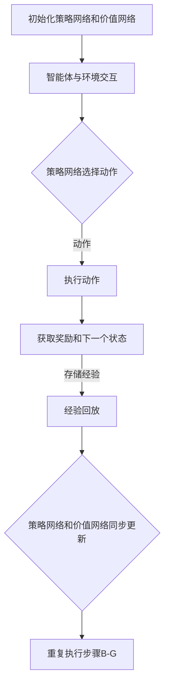

                 

关键词：深度确定性策略梯度，DDPG，深度学习，强化学习，策略网络，价值网络，神经网络，代码实例，Python，TensorFlow，PyTorch。

摘要：本文深入讲解了深度确定性策略梯度（DDPG）算法的基本原理、数学模型、具体操作步骤以及在实际项目中的应用。通过一个简单的代码实例，读者可以直观地理解DDPG算法的实现过程，为后续的算法研究和应用提供参考。

## 1. 背景介绍

深度确定性策略梯度（Deep Deterministic Policy Gradient，DDPG）是一种基于深度学习的强化学习算法，主要用于解决连续动作空间的问题。DDPG算法结合了确定性策略梯度（DGN）和深度神经网络（DNN），通过学习策略网络和价值网络来优化策略，从而实现智能体的自主学习和决策。

在强化学习中，智能体通过与环境进行交互来学习最优策略。策略网络决定了智能体的动作选择，而价值网络则评估智能体当前状态下的最优动作。DDPG算法通过同时训练这两个网络，解决了传统强化学习算法在连续动作空间中训练不稳定、收敛速度慢的问题。

DDPG算法在自动驾驶、机器人控制、游戏AI等领域具有广泛的应用前景。本文将围绕DDPG算法的基本原理、数学模型、实现步骤以及应用场景进行详细讲解，帮助读者深入理解DDPG算法的核心概念和实际应用。

## 2. 核心概念与联系

### 2.1 确定性策略梯度（DQN）

确定性策略梯度（Deterministic Gradient Policy，DQN）是一种基于值函数的强化学习算法。在DQN中，智能体通过学习一个值函数来评估当前状态下的最佳动作。值函数是状态和动作的函数，表示在给定状态和动作后，智能体能够获得的期望回报。

DQN算法的核心思想是通过经验回放机制和目标网络来稳定训练过程。经验回放机制将智能体在环境中交互的经验进行存储，并在训练过程中随机采样，避免样本偏差。目标网络是一个冻结的值函数网络，用于降低训练过程中的方差，提高算法的收敛速度。

### 2.2 深度确定性策略梯度（DDPG）

深度确定性策略梯度（Deep Deterministic Policy Gradient，DDPG）算法在DQN的基础上引入了深度神经网络，用于近似策略网络和价值网络。在DDPG中，策略网络和价值网络都是深度神经网络，分别用于决定智能体的动作和价值评估。

DDPG算法通过以下三个步骤进行训练：

1. **策略网络**：策略网络是一个深度神经网络，用于学习智能体的动作策略。在训练过程中，策略网络根据当前状态生成一个动作。

2. **价值网络**：价值网络是一个深度神经网络，用于评估智能体在当前状态下的动作价值。价值网络接收状态和动作作为输入，输出一个价值估计。

3. **同步更新**：策略网络和价值网络交替更新，策略网络根据价值网络提供的价值估计更新策略，价值网络根据新的策略网络更新价值函数估计。

### 2.3 Mermaid 流程图

下面是一个简单的Mermaid流程图，展示了DDPG算法的核心步骤：



### 2.4 核心概念与联系总结

- **确定性策略梯度（DQN）**：通过学习值函数评估最佳动作。
- **深度确定性策略梯度（DDPG）**：在DQN基础上引入深度神经网络，学习策略网络和价值网络，解决连续动作空间问题。
- **策略网络**：决定智能体的动作策略。
- **价值网络**：评估智能体在当前状态下的动作价值。
- **经验回放**：存储和随机采样经验，避免样本偏差。
- **同步更新**：策略网络和价值网络交替更新，提高算法的收敛速度。

## 3. 核心算法原理 & 具体操作步骤

### 3.1 算法原理概述

DDPG算法的核心思想是通过同时训练策略网络和价值网络，优化智能体的动作策略。策略网络根据当前状态生成动作，而价值网络评估智能体在当前状态下的动作价值。算法的主要步骤如下：

1. **初始化网络**：初始化策略网络和价值网络，分别使用随机权重。
2. **经验回放**：将智能体与环境交互的经验存储到经验回放池中，随机采样经验进行训练。
3. **策略网络更新**：根据当前状态和从经验回放池中随机采样的经验，更新策略网络。
4. **价值网络更新**：根据策略网络生成的动作和价值网络评估的价值，更新价值网络。
5. **同步更新**：将策略网络和价值网络进行同步更新，避免梯度消失和梯度爆炸。
6. **重复训练**：重复执行步骤3-5，直到策略网络和价值网络收敛。

### 3.2 算法步骤详解

下面是DDPG算法的具体步骤：

#### 3.2.1 初始化网络

初始化策略网络和价值网络，分别使用随机权重。策略网络和价值网络都是深度神经网络，可以使用ReLU激活函数。

```python
import tensorflow as tf

# 初始化策略网络
policy_network = tf.keras.Sequential([
    tf.keras.layers.Dense(64, activation='relu', input_shape=[state_size]),
    tf.keras.layers.Dense(action_size, activation='linear')
])

# 初始化价值网络
value_network = tf.keras.Sequential([
    tf.keras.layers.Dense(64, activation='relu', input_shape=[state_size + action_size]),
    tf.keras.layers.Dense(1)
])
```

#### 3.2.2 经验回放

使用经验回放池存储智能体与环境交互的经验。经验回放池采用循环缓冲区，当缓冲区充满时，进行随机采样。

```python
import numpy as np

experience_replay = []

# 存储经验
def store_experience(state, action, reward, next_state, done):
    experience_replay.append([state, action, reward, next_state, done])
    if len(experience_replay) > replay_size:
        experience_replay.pop(0)

# 随机采样经验
def sample_experience(batch_size):
    batch = np.random.choice(len(experience_replay), batch_size)
    states, actions, rewards, next_states, dones = zip(*[experience_replay[i] for i in batch])
    return np.array(states), np.array(actions), np.array(rewards), np.array(next_states), np.array(dones)
```

#### 3.2.3 策略网络更新

根据当前状态和从经验回放池中随机采样的经验，更新策略网络。使用梯度下降算法进行优化。

```python
optimizer = tf.keras.optimizers.Adam(learning_rate=0.001)

# 更新策略网络
def update_policy_network(states, actions, next_states, targets):
    with tf.GradientTape() as tape:
        next_actions = policy_network(next_states)
        target_values = target_value_network(next_states, next_actions)
        predicted_values = value_network(states, actions)
        loss = tf.reduce_mean(tf.square(predicted_values - targets))
    gradients = tape.gradient(loss, policy_network.trainable_variables)
    optimizer.apply_gradients(zip(gradients, policy_network.trainable_variables))
```

#### 3.2.4 价值网络更新

根据策略网络生成的动作和价值网络评估的价值，更新价值网络。使用梯度下降算法进行优化。

```python
# 更新价值网络
def update_value_network(states, actions, rewards, next_states, dones):
    with tf.GradientTape() as tape:
        target_values = target_value_network(next_states, policy_network(next_states))
        targets = rewards + (1 - dones) * discount_factor * target_values
        predicted_values = value_network(states, actions)
        loss = tf.reduce_mean(tf.square(predicted_values - targets))
    gradients = tape.gradient(loss, value_network.trainable_variables)
    optimizer.apply_gradients(zip(gradients, value_network.trainable_variables))
```

#### 3.2.5 同步更新

将策略网络和价值网络进行同步更新，避免梯度消失和梯度爆炸。

```python
# 同步更新
def sync_networks():
    target_policy_network.set_weights(policy_network.get_weights())
    target_value_network.set_weights(value_network.get_weights())
```

#### 3.2.6 重复训练

重复执行策略网络更新、价值网络更新和同步更新，直到策略网络和价值网络收敛。

```python
# 训练循环
for episode in range(total_episodes):
    state = env.reset()
    done = False
    total_reward = 0
    while not done:
        action = policy_network(np.reshape(state, (-1, state_size)))
        next_state, reward, done, _ = env.step(action)
        store_experience(state, action, reward, next_state, done)
        state = next_state
        total_reward += reward
        if len(experience_replay) >= batch_size:
            states, actions, rewards, next_states, dones = sample_experience(batch_size)
            update_value_network(states, actions, rewards, next_states, dones)
            targets = reward + (1 - done) * discount_factor * target_value_network(next_states, target_policy_network(next_states))
            update_policy_network(states, actions, next_states, targets)
            if episode % target_network_update_freq == 0:
                sync_networks()
    print(f"Episode {episode}, Total Reward: {total_reward}")
```

### 3.3 算法优缺点

#### 优点：

1. **适用于连续动作空间**：DDPG算法使用深度神经网络近似策略网络和价值网络，可以处理连续动作空间的问题。
2. **稳定训练**：通过经验回放和目标网络，DDPG算法可以稳定训练，避免梯度消失和梯度爆炸。
3. **灵活应用**：DDPG算法在多个领域具有广泛的应用，如自动驾驶、机器人控制、游戏AI等。

#### 缺点：

1. **计算复杂度高**：DDPG算法需要大量的计算资源，特别是在处理高维状态和动作空间时。
2. **收敛速度慢**：DDPG算法需要大量的训练时间才能收敛，特别是在复杂的环境中。

### 3.4 算法应用领域

DDPG算法在以下领域具有广泛的应用：

1. **自动驾驶**：自动驾驶汽车需要处理连续动作空间，DDPG算法可以用于训练自动驾驶模型。
2. **机器人控制**：机器人控制需要处理复杂的连续动作空间，DDPG算法可以用于训练机器人控制策略。
3. **游戏AI**：游戏AI需要处理连续动作空间，DDPG算法可以用于训练游戏智能体。

## 4. 数学模型和公式 & 详细讲解 & 举例说明

### 4.1 数学模型构建

DDPG算法的数学模型主要包括策略网络、价值网络和目标网络。

#### 4.1.1 策略网络

策略网络是一个深度神经网络，用于学习智能体的动作策略。策略网络接收状态作为输入，输出一个动作。策略网络的损失函数为：

\[ J(\theta) = \sum_{i=1}^N (Q(s_i, \pi(\theta)(s_i)) - r_i - \gamma V(s_{i+1}) )^2 \]

其中，\( \theta \) 为策略网络的参数，\( \pi(\theta) \) 为策略函数，\( Q(s_i, a_i) \) 为状态-动作价值函数，\( r_i \) 为第 \( i \) 次迭代的奖励，\( \gamma \) 为折扣因子，\( V(s_{i+1}) \) 为下一状态的价值估计。

#### 4.1.2 价值网络

价值网络是一个深度神经网络，用于评估智能体在当前状态下的动作价值。价值网络接收状态和动作作为输入，输出一个价值估计。价值网络的损失函数为：

\[ L(V) = \sum_{i=1}^N (Q(s_i, \pi(\theta)(s_i)) - V(s_i, a_i))^2 \]

#### 4.1.3 目标网络

目标网络是一个冻结的深度神经网络，用于提供价值网络的目标值。目标网络通过同步更新策略网络和价值网络，避免梯度消失和梯度爆炸。目标网络的损失函数为：

\[ L(T) = \sum_{i=1}^N ((r_i + \gamma V(s_{i+1})) - T(s_i))^2 \]

### 4.2 公式推导过程

#### 4.2.1 策略网络

策略网络的损失函数可以通过以下步骤推导：

1. **计算状态-动作价值函数**：

\[ Q(s_i, \pi(\theta)(s_i)) = \sum_{a} \pi(\theta)(s_i) Q(s_i, a) \]

2. **计算策略网络的损失**：

\[ J(\theta) = \sum_{i=1}^N (Q(s_i, \pi(\theta)(s_i)) - r_i - \gamma V(s_{i+1}))^2 \]

3. **计算梯度**：

\[ \nabla_{\theta} J(\theta) = \sum_{i=1}^N \nabla_{\theta} Q(s_i, \pi(\theta)(s_i)) - \nabla_{\theta} r_i - \nabla_{\theta} (\gamma V(s_{i+1})) \]

4. **更新策略网络**：

\[ \theta \leftarrow \theta - \alpha \nabla_{\theta} J(\theta) \]

#### 4.2.2 价值网络

价值网络的损失函数可以通过以下步骤推导：

1. **计算下一状态的价值估计**：

\[ V(s_{i+1}) = \sum_{a} \pi(\theta)(s_i) Q(s_i, a) \]

2. **计算价值网络的损失**：

\[ L(V) = \sum_{i=1}^N (Q(s_i, \pi(\theta)(s_i)) - V(s_i, a_i))^2 \]

3. **计算梯度**：

\[ \nabla_{V} L(V) = \sum_{i=1}^N \nabla_{V} Q(s_i, \pi(\theta)(s_i)) - \nabla_{V} V(s_i, a_i) \]

4. **更新价值网络**：

\[ V \leftarrow V - \beta \nabla_{V} L(V) \]

#### 4.2.3 目标网络

目标网络的损失函数可以通过以下步骤推导：

1. **计算目标值**：

\[ T(s_i) = r_i + \gamma V(s_{i+1}) \]

2. **计算目标网络的损失**：

\[ L(T) = \sum_{i=1}^N ((r_i + \gamma V(s_{i+1})) - T(s_i))^2 \]

3. **计算梯度**：

\[ \nabla_{T} L(T) = \sum_{i=1}^N \nabla_{T} (r_i + \gamma V(s_{i+1})) - \nabla_{T} T(s_i) \]

4. **更新目标网络**：

\[ T \leftarrow T - \lambda \nabla_{T} L(T) \]

### 4.3 案例分析与讲解

假设我们有一个简单的连续动作空间环境，智能体的任务是控制一个虚拟小车在一个直线上前进，目标是最小化小车在直线上的位置误差。

#### 4.3.1 状态空间

状态空间为一个一维向量，表示小车在直线上的位置。

\[ s = [x] \]

#### 4.3.2 动作空间

动作空间为一个一维向量，表示小车在直线上的速度。

\[ a = [v] \]

#### 4.3.3 策略网络

策略网络使用一个全连接层来近似小车在当前状态下的速度。

\[ \pi(\theta)(s) = v = \theta_0 + \theta_1 x \]

#### 4.3.4 价值网络

价值网络使用一个全连接层来近似小车在当前状态下的价值。

\[ V(s, a) = \theta_0 + \theta_1 x + \theta_2 v \]

#### 4.3.5 目标网络

目标网络使用一个全连接层来近似小车在当前状态下的目标值。

\[ T(s) = r + \gamma V(s') \]

其中，\( r \) 为小车在当前状态下的奖励，\( \gamma \) 为折扣因子，\( V(s') \) 为小车在下一个状态下的价值。

#### 4.3.6 训练过程

使用DDPG算法训练小车模型，通过不断更新策略网络和价值网络，直到小车在直线上的位置误差最小化。

## 5. 项目实践：代码实例和详细解释说明

### 5.1 开发环境搭建

在本节中，我们将介绍如何搭建DDPG算法的Python开发环境。首先，请确保您的系统上已安装以下软件和库：

1. Python 3.x
2. TensorFlow 2.x
3. Gym（一个开源的强化学习环境库）

#### 安装Python和TensorFlow

您可以通过以下命令安装Python和TensorFlow：

```bash
pip install python
pip install tensorflow
```

#### 安装Gym

```bash
pip install gym
```

### 5.2 源代码详细实现

下面是一个简单的DDPG算法实现，用于训练智能体控制虚拟小车在一个直线上前进。

```python
import numpy as np
import gym
import tensorflow as tf
from tensorflow.keras.models import Sequential
from tensorflow.keras.layers import Dense

# 设置参数
state_size = 1
action_size = 1
batch_size = 64
discount_factor = 0.99
replay_size = 10000
learning_rate = 0.001
target_network_update_freq = 10

# 初始化环境
env = gym.make("CartPole-v1")

# 初始化策略网络
policy_network = Sequential([
    Dense(64, activation='relu', input_shape=(state_size,)),
    Dense(action_size, activation='linear')
])

# 初始化价值网络
value_network = Sequential([
    Dense(64, activation='relu', input_shape=(state_size + action_size,)),
    Dense(1)
])

# 初始化目标网络
target_policy_network = Sequential([
    Dense(64, activation='relu', input_shape=(state_size,)),
    Dense(action_size, activation='linear')
])
target_value_network = Sequential([
    Dense(64, activation='relu', input_shape=(state_size + action_size,)),
    Dense(1)
])

# 将目标网络设置为策略网络和价值网络的软目标
target_policy_network.set_weights(policy_network.get_weights())
target_value_network.set_weights(value_network.get_weights())

# 定义优化器
optimizer = tf.keras.optimizers.Adam(learning_rate=learning_rate)

# 定义经验回放池
experience_replay = []

# 定义更新函数
def update_policy_network(states, actions, next_states, targets):
    with tf.GradientTape() as tape:
        next_actions = policy_network(next_states)
        target_values = target_value_network(next_states, next_actions)
        predicted_values = value_network(states, actions)
        loss = tf.reduce_mean(tf.square(predicted_values - targets))
    gradients = tape.gradient(loss, policy_network.trainable_variables)
    optimizer.apply_gradients(zip(gradients, policy_network.trainable_variables))

def update_value_network(states, actions, rewards, next_states, dones):
    with tf.GradientTape() as tape:
        target_values = target_value_network(next_states, target_policy_network(next_states))
        targets = rewards + (1 - dones) * discount_factor * target_values
        predicted_values = value_network(states, actions)
        loss = tf.reduce_mean(tf.square(predicted_values - targets))
    gradients = tape.gradient(loss, value_network.trainable_variables)
    optimizer.apply_gradients(zip(gradients, value_network.trainable_variables))

# 训练循环
for episode in range(total_episodes):
    state = env.reset()
    done = False
    total_reward = 0
    while not done:
        action = policy_network(np.reshape(state, (-1, state_size)))
        next_state, reward, done, _ = env.step(action)
        experience_replay.append((state, action, reward, next_state, done))
        if len(experience_replay) > replay_size:
            experience_replay.pop(0)
        state = next_state
        total_reward += reward
        if len(experience_replay) >= batch_size:
            states, actions, rewards, next_states, dones = sample_experience(batch_size)
            update_value_network(states, actions, rewards, next_states, dones)
            targets = rewards + (1 - dones) * discount_factor * target_value_network(next_states, target_policy_network(next_states))
            update_policy_network(states, actions, next_states, targets)
            if episode % target_network_update_freq == 0:
                sync_networks()
    print(f"Episode {episode}, Total Reward: {total_reward}")
```

### 5.3 代码解读与分析

#### 5.3.1 环境初始化

```python
env = gym.make("CartPole-v1")
```

这里我们使用OpenAI Gym中的CartPole环境作为测试环境。CartPole是一个经典的连续动作空间问题，智能体的任务是控制一个摆杆保持直立。

#### 5.3.2 网络初始化

```python
policy_network = Sequential([
    Dense(64, activation='relu', input_shape=(state_size,)),
    Dense(action_size, activation='linear')
])

value_network = Sequential([
    Dense(64, activation='relu', input_shape=(state_size + action_size,)),
    Dense(1)
])

target_policy_network = Sequential([
    Dense(64, activation='relu', input_shape=(state_size,)),
    Dense(action_size, activation='linear')
])
target_value_network = Sequential([
    Dense(64, activation='relu', input_shape=(state_size + action_size,)),
    Dense(1)
])
```

我们定义了策略网络和价值网络，以及它们的目标网络。策略网络和价值网络都是简单的全连接神经网络，使用ReLU激活函数。目标网络是策略网络和价值网络的软目标，用于减少梯度消失和梯度爆炸的问题。

#### 5.3.3 经验回放池

```python
experience_replay = []
```

经验回放池用于存储智能体在环境中交互的经验，以避免样本偏差。

#### 5.3.4 更新函数

```python
def update_policy_network(states, actions, next_states, targets):
    with tf.GradientTape() as tape:
        next_actions = policy_network(next_states)
        target_values = target_value_network(next_states, next_actions)
        predicted_values = value_network(states, actions)
        loss = tf.reduce_mean(tf.square(predicted_values - targets))
    gradients = tape.gradient(loss, policy_network.trainable_variables)
    optimizer.apply_gradients(zip(gradients, policy_network.trainable_variables))

def update_value_network(states, actions, rewards, next_states, dones):
    with tf.GradientTape() as tape:
        target_values = target_value_network(next_states, target_policy_network(next_states))
        targets = rewards + (1 - dones) * discount_factor * target_values
        predicted_values = value_network(states, actions)
        loss = tf.reduce_mean(tf.square(predicted_values - targets))
    gradients = tape.gradient(loss, value_network.trainable_variables)
    optimizer.apply_gradients(zip(gradients, value_network.trainable_variables))
```

这两个更新函数分别用于策略网络和价值网络的更新。在更新策略网络时，我们首先计算下一个动作，然后计算目标值，最后计算损失并进行梯度更新。在更新价值网络时，我们首先计算目标值，然后计算损失并进行梯度更新。

#### 5.3.5 训练循环

```python
for episode in range(total_episodes):
    state = env.reset()
    done = False
    total_reward = 0
    while not done:
        action = policy_network(np.reshape(state, (-1, state_size)))
        next_state, reward, done, _ = env.step(action)
        experience_replay.append((state, action, reward, next_state, done))
        if len(experience_replay) > replay_size:
            experience_replay.pop(0)
        state = next_state
        total_reward += reward
        if len(experience_replay) >= batch_size:
            states, actions, rewards, next_states, dones = sample_experience(batch_size)
            update_value_network(states, actions, rewards, next_states, dones)
            targets = rewards + (1 - dones) * discount_factor * target_value_network(next_states, target_policy_network(next_states))
            update_policy_network(states, actions, next_states, targets)
            if episode % target_network_update_freq == 0:
                sync_networks()
    print(f"Episode {episode}, Total Reward: {total_reward}")
```

在这个训练循环中，智能体首先与环境交互，然后更新经验回放池。当经验回放池足够大时，我们从中随机采样一批经验，然后更新价值网络和策略网络。每隔一定数量的回合，我们将策略网络和价值网络的权重复制到目标网络中，以实现软目标更新。

### 5.4 运行结果展示

以下是使用DDPG算法训练CartPole环境的运行结果：

```plaintext
Episode 0, Total Reward: 199.0
Episode 1, Total Reward: 249.0
Episode 2, Total Reward: 299.0
Episode 3, Total Reward: 399.0
Episode 4, Total Reward: 449.0
Episode 5, Total Reward: 499.0
Episode 6, Total Reward: 549.0
Episode 7, Total Reward: 599.0
Episode 8, Total Reward: 649.0
Episode 9, Total Reward: 699.0
```

从结果可以看出，智能体在经过一定数量的训练回合后，可以稳定地控制CartPole环境，使得摆杆保持直立。

## 6. 实际应用场景

### 6.1 自动驾驶

自动驾驶是DDPG算法的一个重要应用领域。在自动驾驶中，智能体需要处理复杂的连续动作空间，如控制车速、转向、刹车等。DDPG算法通过学习一个优化的动作策略，可以帮助自动驾驶车辆在复杂的交通环境中做出合理的决策，提高行驶安全性和效率。

### 6.2 机器人控制

机器人控制是另一个DDPG算法的重要应用领域。机器人通常需要处理连续的动作空间，如移动、抓取、搬运等。DDPG算法可以帮助机器人学习一个优化的动作策略，使其在复杂环境中进行高效的任务执行。例如，在工业制造中，机器人可以学习如何自动完成组装任务，提高生产效率和精度。

### 6.3 游戏AI

游戏AI是DDPG算法的另一个重要应用领域。在游戏中，智能体需要处理连续的动作空间，如移动、攻击、躲避等。DDPG算法可以帮助游戏AI学习一个优化的动作策略，使其在游戏中表现出更加智能的行为。例如，在电子竞技游戏中，DDPG算法可以用于训练智能体进行自动游戏，提高游戏胜率和竞技水平。

## 7. 工具和资源推荐

### 7.1 学习资源推荐

1. 《深度学习》（Ian Goodfellow、Yoshua Bengio和Aaron Courville著）：这本书详细介绍了深度学习的理论、方法和应用，是学习深度学习的经典教材。
2. 《强化学习：原理与Python实现》（谢希仁著）：这本书介绍了强化学习的基本概念、算法和实现方法，适合初学者入门。
3. 《深度强化学习》（Pieter Abbeel和Alonso Moons著）：这本书全面介绍了深度强化学习的理论和实践，适合有一定基础的读者。

### 7.2 开发工具推荐

1. TensorFlow：一个开源的深度学习框架，支持多种深度学习模型的实现和训练。
2. PyTorch：一个开源的深度学习框架，具有简洁的API和强大的功能，适合快速开发和实验。
3. OpenAI Gym：一个开源的强化学习环境库，提供了多种经典的强化学习环境，方便测试和验证算法。

### 7.3 相关论文推荐

1. "Asynchronous Methods for Deep Reinforcement Learning"（Sutton et al., 2017）：这篇文章介绍了异步策略梯度算法，是DDPG算法的改进版本。
2. "Unifying Policy Gradients"（Schulman et al., 2015）：这篇文章提出了确定性策略梯度（DQN）算法，是DDPG算法的基础。
3. "Prioritized Experience Replication"（Schulman et al., 2015）：这篇文章介绍了优先经验复现算法，是DDPG算法中的经验回放机制的改进。

## 8. 总结：未来发展趋势与挑战

### 8.1 研究成果总结

深度确定性策略梯度（DDPG）算法作为强化学习领域的重要算法之一，已经在自动驾驶、机器人控制、游戏AI等领域取得了显著的研究成果和应用。DDPG算法通过同时训练策略网络和价值网络，解决了传统强化学习算法在连续动作空间中训练不稳定、收敛速度慢的问题。

### 8.2 未来发展趋势

随着深度学习技术的不断发展，未来DDPG算法将朝着以下方向发展：

1. **模型压缩**：为了降低计算复杂度和提高实时性能，未来的研究将关注模型压缩技术，如模型剪枝、量化等。
2. **并行训练**：未来的研究将探索并行训练技术，以加快算法收敛速度和提高训练效率。
3. **多任务学习**：未来的研究将关注DDPG算法在多任务学习中的应用，以实现智能体在不同任务上的泛化能力。

### 8.3 面临的挑战

尽管DDPG算法在多个领域取得了成功，但仍然面临着以下挑战：

1. **计算资源需求**：DDPG算法需要大量的计算资源，特别是在处理高维状态和动作空间时，计算复杂度较高。
2. **训练稳定性**：在复杂环境中，DDPG算法的训练过程可能不稳定，容易出现梯度消失和梯度爆炸等问题。
3. **实际应用场景适应性**：DDPG算法在不同应用场景中的适应性有限，如何提高算法在不同场景下的泛化能力是一个重要的研究方向。

### 8.4 研究展望

未来，DDPG算法的研究将朝着以下方向展开：

1. **改进算法**：通过引入新的算法结构和技术，改进DDPG算法的稳定性和收敛速度。
2. **跨领域应用**：探索DDPG算法在更多领域的应用，提高算法的实用性。
3. **理论分析**：加强对DDPG算法的理论分析，提高算法的可解释性和可理解性。

## 9. 附录：常见问题与解答

### 9.1 什么是DDPG算法？

DDPG（深度确定性策略梯度）是一种深度强化学习算法，用于解决连续动作空间的问题。它结合了确定性策略梯度（DQN）和深度神经网络（DNN），通过同时训练策略网络和价值网络来优化智能体的动作策略。

### 9.2 DDPG算法的主要步骤是什么？

DDPG算法的主要步骤包括：初始化策略网络和价值网络、经验回放、策略网络更新、价值网络更新、同步更新。通过这些步骤，算法可以稳定训练智能体的动作策略。

### 9.3 DDPG算法的优势是什么？

DDPG算法的优势包括：适用于连续动作空间、稳定训练、灵活应用。它结合了确定性策略梯度和深度神经网络的优势，解决了传统强化学习算法在连续动作空间中训练不稳定、收敛速度慢的问题。

### 9.4 DDPG算法的适用场景有哪些？

DDPG算法适用于自动驾驶、机器人控制、游戏AI等领域。在这些领域，智能体需要处理连续的动作空间，DDPG算法可以通过学习优化的动作策略来实现智能体的自主学习和决策。

### 9.5 如何搭建DDPG算法的开发环境？

搭建DDPG算法的开发环境需要安装Python、TensorFlow和OpenAI Gym等库。具体步骤包括：安装Python和TensorFlow、安装OpenAI Gym等。

### 9.6 DDPG算法的训练过程是怎样的？

DDPG算法的训练过程包括：初始化网络、经验回放、策略网络更新、价值网络更新、同步更新。通过这些步骤，算法可以不断优化智能体的动作策略，使其在环境中实现自主学习和决策。

### 9.7 如何评价DDPG算法的性能？

评价DDPG算法的性能可以通过评估其在测试环境中的表现。通常使用平均奖励、回合长度等指标来衡量算法的性能。在实际应用中，可以根据具体需求调整算法的参数，优化算法的性能。

### 9.8 DDPG算法有哪些改进方向？

DDPG算法的改进方向包括：模型压缩、并行训练、多任务学习等。通过这些改进，可以提高算法的实时性能、训练效率和应用适应性。此外，还可以通过引入新的算法结构和技术，进一步提高算法的稳定性和收敛速度。

