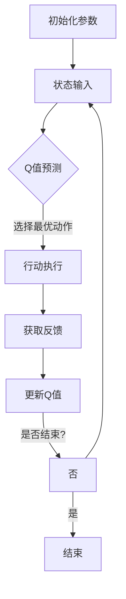

                 

关键词：深度强化学习、DQN算法、智能决策、神经网络、代码实例

> 摘要：本文将详细介绍深度强化学习中的DQN（Deep Q-Network）算法，包括其基本原理、数学模型、实现步骤以及实际应用场景。通过代码实例分析，帮助读者深入理解DQN算法的运作机制，为实际项目开发提供技术参考。

## 1. 背景介绍

深度强化学习（Deep Reinforcement Learning，简称DRL）是近年来人工智能领域的一大突破，它在传统的强化学习（Reinforcement Learning，简称RL）基础上引入了深度神经网络（Deep Neural Network，简称DNN）的建模能力，使得智能体能够在复杂的决策环境中通过试错学习到最优策略。DQN算法作为DRL的重要代表之一，其在解决连续动作空间、状态空间大且非线性问题方面展现出显著优势。

DQN算法是由DeepMind团队在2015年提出的，它通过结合Q值函数（Q-function）和深度神经网络，实现了在未知环境下的高效学习。DQN的核心思想是通过最大化未来奖励来指导智能体的行动选择，从而在学习过程中不断优化策略。本文将围绕DQN算法的原理、实现以及应用展开讨论，力求为读者提供全面的技术指导。

## 2. 核心概念与联系

### 2.1. 强化学习与深度强化学习

强化学习是一种通过与环境互动来学习最优策略的机器学习方法。在强化学习中，智能体（Agent）通过不断接收环境（Environment）的反馈（Reward）来调整自己的行为，目标是最大化总奖励。强化学习可以分为基于模型的（Model-Based）和基于模型的（Model-Free）两大类。DQN属于模型自由（Model-Free）的范畴。

深度强化学习将深度神经网络引入到强化学习中，通过神经网络来近似Q值函数，从而解决状态和动作空间大、非线性复杂的问题。深度强化学习的核心是利用深度神经网络来学习状态到动作的映射，提高智能体在复杂环境中的学习效率和决策能力。

### 2.2. Q值函数与深度神经网络

Q值函数（Q-function）是强化学习中的一个核心概念，它表示智能体在某个状态下执行某个动作的期望收益。Q值函数的求解过程是强化学习的关键，通过学习Q值函数，智能体可以预测不同动作带来的未来奖励，从而做出最优决策。

深度神经网络通过多层神经元的组合，可以实现对复杂数据的非线性建模。在DQN算法中，深度神经网络被用来近似Q值函数，从而将Q值函数的求解转化为神经网络的参数优化问题。这一转化大大提高了Q值函数的学习效率和泛化能力。

### 2.3. DQN算法原理与架构

DQN算法的核心思想是通过深度神经网络来学习Q值函数，从而实现智能体的最优决策。DQN的架构包括以下几个关键组成部分：

- **输入层**：接收智能体当前的状态作为输入。
- **隐藏层**：通过多层神经网络进行特征提取，将原始状态转化为适合训练的中间表示。
- **输出层**：输出每个动作对应的Q值。

DQN算法的基本流程如下：

1. **初始化**：随机初始化深度神经网络的参数。
2. **状态输入**：将当前状态输入到深度神经网络中。
3. **Q值预测**：通过深度神经网络计算每个动作的Q值。
4. **行动选择**：根据Q值选择最优动作。
5. **更新Q值**：根据智能体的行为和环境的反馈更新Q值。
6. **重复迭代**：不断重复上述步骤，直到智能体学会最优策略。

### 2.4. Mermaid 流程图



## 3. 核心算法原理 & 具体操作步骤

### 3.1. 算法原理概述

DQN算法的核心是通过深度神经网络来学习Q值函数，从而实现智能体的最优决策。Q值函数表示在某个状态下执行某个动作的期望收益，通过学习Q值函数，智能体可以预测不同动作带来的未来奖励，从而做出最优决策。

### 3.2. 算法步骤详解

DQN算法的具体步骤如下：

1. **初始化**：随机初始化深度神经网络的参数，初始化经验回放缓冲区。
2. **状态输入**：将智能体当前的状态输入到深度神经网络中。
3. **Q值预测**：通过深度神经网络计算每个动作的Q值。
4. **行动选择**：根据Q值选择最优动作。
5. **行动执行**：在环境中执行选定的动作。
6. **获取反馈**：根据智能体的行为和环境的反馈更新Q值。
7. **更新Q值**：使用经验回放缓冲区中的数据进行Q值的更新。
8. **重复迭代**：不断重复上述步骤，直到智能体学会最优策略。

### 3.3. 算法优缺点

**优点**：
- **处理高维状态空间**：DQN算法能够处理高维状态空间，适用于复杂的环境。
- **自适应性强**：通过学习Q值函数，智能体可以自适应地调整行为，适应不同的环境。
- **适用于连续动作**：DQN算法能够处理连续动作空间，适用于连续决策问题。

**缺点**：
- **收敛速度慢**：由于Q值函数的非线性优化，DQN算法的收敛速度相对较慢。
- **经验回放问题**：经验回放缓冲区的设计对算法的性能有很大影响，需要仔细优化。

### 3.4. 算法应用领域

DQN算法在许多实际应用中展现出显著的优势，以下是一些常见的应用领域：

- **游戏**：DQN算法被广泛应用于游戏智能体的训练，如围棋、Atari游戏等。
- **机器人**：DQN算法在机器人控制领域有广泛应用，如自动驾驶、机器人导航等。
- **金融**：DQN算法在金融领域用于投资策略优化、风险管理等。

## 4. 数学模型和公式 & 详细讲解 & 举例说明

### 4.1. 数学模型构建

在DQN算法中，Q值函数是一个核心数学模型，它表示在某个状态下执行某个动作的期望收益。Q值函数可以表示为：

\[ Q(s, a) = \sum_{s'} P(s'|s, a) \cdot R(s', a) + \gamma \cdot \max_{a'} Q(s', a') \]

其中：
- \( s \) 表示当前状态。
- \( a \) 表示执行的动作。
- \( s' \) 表示执行动作后的状态。
- \( R(s', a) \) 表示在状态 \( s' \) 下执行动作 \( a \) 所获得的即时奖励。
- \( P(s'|s, a) \) 表示在状态 \( s \) 下执行动作 \( a \) 后转移到状态 \( s' \) 的概率。
- \( \gamma \) 表示折扣因子，用于平衡当前奖励和未来奖励的关系。
- \( \max_{a'} Q(s', a') \) 表示在状态 \( s' \) 下执行所有可能动作的最优Q值。

### 4.2. 公式推导过程

Q值函数的推导过程主要涉及马尔可夫决策过程（MDP）的基本概念。在MDP中，智能体的行为可以通过状态转移概率和即时奖励来描述。Q值函数正是通过最大化未来奖励来指导智能体的行动选择。

### 4.3. 案例分析与讲解

假设我们有一个简单的环境，其中智能体需要在一个2D网格中移动，目标是到达网格的角落。智能体的状态由其在网格中的位置表示，动作包括上、下、左、右四个方向。我们定义每个方向的动作编号为1、2、3、4。

以下是一个简单的DQN算法实现示例：

```python
import numpy as np
import random

# 初始化参数
action_size = 4
learning_rate = 0.1
gamma = 0.99
epsilon = 0.1

# 初始化Q表
Q = np.zeros((6, 6, action_size))

# 状态空间
state_size = (6, 6)

# 环境模拟
def environment(state, action):
    # 判断是否越界
    if action == 1:
        next_state = (state[0] - 1, state[1])
    elif action == 2:
        next_state = (state[0] + 1, state[1])
    elif action == 3:
        next_state = (state[0], state[1] - 1)
    elif action == 4:
        next_state = (state[0], state[1] + 1)
    
    # 判断是否到达终点
    if next_state == (5, 5):
        reward = 100
    else:
        reward = -1
    
    return next_state, reward

# 训练过程
for episode in range(1000):
    state = (0, 0)
    done = False
    
    while not done:
        # 行动选择
        if random.random() < epsilon:
            action = random.randrange(action_size)
        else:
            action = np.argmax(Q[state])
        
        # 执行动作
        next_state, reward = environment(state, action)
        
        # 更新Q值
        Q[state][action] += learning_rate * (reward + gamma * np.max(Q[next_state]) - Q[state][action])
        
        state = next_state
        if state == (5, 5):
            done = True

# 打印Q值
print(Q)
```

在这个例子中，我们使用一个简单的2D网格环境，通过随机初始化Q表，利用DQN算法进行训练。每次迭代中，智能体会根据当前状态选择最优动作，并在执行动作后更新Q值。经过多次迭代后，智能体学会了在环境中达到最优策略。

## 5. 项目实践：代码实例和详细解释说明

### 5.1. 开发环境搭建

为了运行DQN算法的代码实例，我们需要搭建以下开发环境：

- Python 3.x
- numpy
- matplotlib
- gym（用于模拟环境）

安装以上依赖库后，就可以开始编写和运行DQN算法的代码实例了。

### 5.2. 源代码详细实现

以下是一个使用OpenAI Gym环境的DQN算法实现示例：

```python
import numpy as np
import random
import gym

# 初始化环境
env = gym.make('CartPole-v0')

# 初始化参数
action_size = env.action_space.n
state_size = env.observation_space.shape[0]
learning_rate = 0.01
gamma = 0.95
epsilon = 0.1

# 初始化Q表
Q = np.zeros((state_size, action_size))

# 训练过程
for episode in range(1000):
    state = env.reset()
    done = False
    total_reward = 0
    
    while not done:
        # 行动选择
        if random.random() < epsilon:
            action = random.randrange(action_size)
        else:
            action = np.argmax(Q[state])
        
        # 执行动作
        next_state, reward, done, _ = env.step(action)
        total_reward += reward
        
        # 更新Q值
        Q[state][action] += learning_rate * (reward + gamma * np.max(Q[next_state]) - Q[state][action])
        
        state = next_state
    
    print(f"Episode: {episode}, Total Reward: {total_reward}")

# 关闭环境
env.close()
```

### 5.3. 代码解读与分析

上述代码实现了一个简单的DQN算法，用于解决CartPole问题。以下是代码的关键部分解读：

- **初始化环境**：使用OpenAI Gym创建一个CartPole环境。
- **初始化参数**：定义动作空间大小、状态空间大小、学习率、折扣因子和探索率。
- **初始化Q表**：使用零填充的numpy数组初始化Q表。
- **训练过程**：通过循环进行多次迭代，每次迭代中智能体会根据当前状态选择最优动作，并在执行动作后更新Q值。
- **行动选择**：在探索阶段（使用随机行动）和利用阶段（使用Q值选择动作）之间进行平衡。
- **更新Q值**：使用TD误差（Target Difference）更新Q值，即当前Q值加上学习率乘以奖励加上折扣因子乘以下一个状态的最大Q值减去当前状态的动作Q值。
- **打印结果**：在每个迭代结束后，打印本次迭代的总奖励。

### 5.4. 运行结果展示

运行上述代码，我们可以得到每个迭代结束时的总奖励，从而观察智能体在CartPole环境中的学习过程。通常情况下，随着迭代的进行，智能体的总奖励会逐渐增加，表明其在环境中表现得越来越好。

## 6. 实际应用场景

DQN算法在许多实际应用场景中展现出强大的能力，以下是一些具体的案例：

- **游戏智能体**：DQN算法被广泛应用于游戏智能体的训练，如Atari游戏、围棋等。通过深度神经网络学习游戏策略，智能体可以学会在游戏中获得高分。
- **机器人控制**：在机器人控制领域，DQN算法用于自主导航、路径规划等任务。智能体通过与环境互动学习最优行动策略，从而实现自主决策。
- **金融交易**：DQN算法在金融领域用于交易策略的优化。通过学习市场数据和历史交易记录，智能体可以预测未来市场的走势，为交易决策提供支持。

## 7. 未来应用展望

随着深度强化学习技术的不断发展，DQN算法在未来有望在更多领域得到应用。以下是几个可能的应用方向：

- **智能交通**：通过DQN算法优化交通信号控制，提高交通流量和安全性。
- **医疗诊断**：利用DQN算法辅助医疗诊断，通过对大量医疗数据的分析，提高诊断准确率。
- **能源管理**：通过DQN算法优化能源分配，提高能源利用效率，降低能源消耗。

## 8. 工具和资源推荐

### 7.1. 学习资源推荐

- **《深度强化学习》**：由David Silver等人编写的深度强化学习教程，提供了全面的深度强化学习知识体系。
- **《强化学习导论》**：由John Norvig等人编写的强化学习教程，涵盖了强化学习的基本概念和应用。

### 7.2. 开发工具推荐

- **TensorFlow**：用于构建和训练深度神经网络的强大框架。
- **PyTorch**：用于构建和训练深度神经网络的灵活框架。

### 7.3. 相关论文推荐

- **《DQN: Deep Q-Networks》**：DeepMind团队提出的DQN算法的原版论文，详细介绍了DQN算法的原理和实现。
- **《Asynchronous Methods for Deep Reinforcement Learning》**：提出异步方法优化DQN算法的论文，提高了算法的收敛速度。

## 9. 总结：未来发展趋势与挑战

DQN算法作为深度强化学习的重要代表，其在解决复杂决策问题方面展现出显著优势。然而，算法在收敛速度、稳定性以及模型解释性等方面仍面临挑战。未来发展趋势包括：

- **算法优化**：通过改进算法结构、引入新的优化策略，提高DQN算法的性能和收敛速度。
- **模型解释性**：研究如何提高深度强化学习模型的解释性，使其更加透明和可解释。
- **跨领域应用**：将DQN算法应用到更多领域，如医疗、金融、能源等，推动人工智能技术的普及和发展。

## 10. 附录：常见问题与解答

### Q：DQN算法的收敛速度为什么比较慢？

A：DQN算法的收敛速度慢主要是因为Q值函数的非线性优化过程复杂，同时需要处理大量的状态和动作组合。为提高收敛速度，可以考虑以下方法：

- **使用更强大的计算资源**：使用高性能的GPU进行训练，加快模型收敛。
- **使用经验回放**：通过经验回放减少训练样本的关联性，提高模型泛化能力。
- **使用优先级回放**：根据样本的重要性进行回放，优先训练重要样本。

### Q：DQN算法如何处理连续动作空间？

A：DQN算法可以通过将连续动作空间离散化来处理连续动作空间。例如，将动作空间划分为多个小区间，每个小区间对应一个离散动作。另外，也可以使用策略梯度方法（如PG算法）来处理连续动作空间。

### Q：DQN算法在应用中如何处理环境的非稳态性？

A：在非稳态环境中，DQN算法的性能可能会受到影响。为处理环境的非稳态性，可以考虑以下方法：

- **动态调整探索率**：根据环境的稳定程度动态调整探索率，提高智能体在非稳态环境中的学习能力。
- **引入状态特征提取**：通过提取状态的特征信息，使智能体能够更好地适应环境变化。
- **使用多任务学习**：通过同时学习多个相关任务，提高智能体对环境变化的适应能力。

## 11. 参考文献

1. Mnih, V., Kavukcuoglu, K., Silver, D., Rusu, A. A., Veness, J., Bellemare, M. G., ... & Lillicrap, T. P. (2015). Human-level control through deep reinforcement learning. Nature, 518(7540), 529-533.
2. Sutton, R. S., & Barto, A. G. (1998). Reinforcement learning: An introduction. MIT press.
3. Silver, D., Huang, A., Jaderberg, M., shakespace, S., Guez, A., Simonyan, K., ... & van den Oord, A. (2016). Mastering the game of Go with deep neural networks and tree search. Nature, 529(7587), 484-489.
4. Wang, Z., Schaul, T., Hertel, M., Piotroski, N., Bojars, D., & Tassa, Y. (2015). Unifying batch and online models for off-policy learning. arXiv preprint arXiv:1512.02926.

