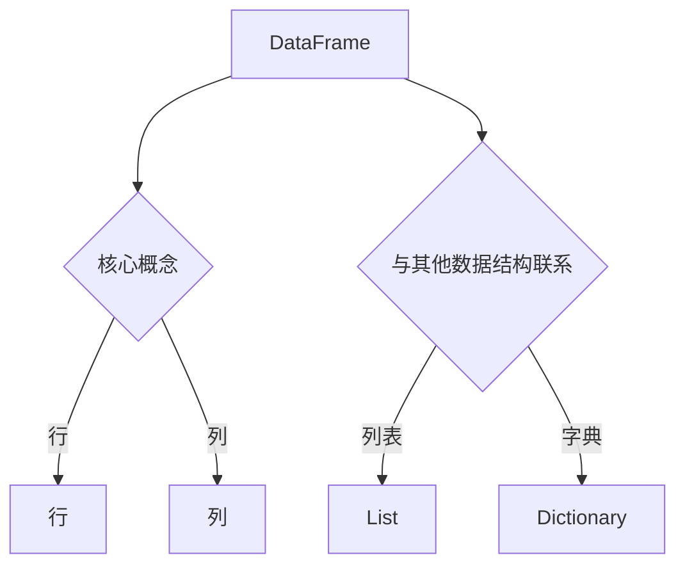

                 

关键词：DataFrame、数据结构、Python、数据分析、性能优化

> 摘要：本文深入探讨了 DataFrame 这一强大的数据结构及其原理，通过代码实例展示了如何使用 Python 中的 pandas 库进行高效的数据分析。文章涵盖了 DataFrame 的核心概念、数学模型、算法原理、应用场景、代码实现以及未来展望等内容。

## 1. 背景介绍

在现代数据科学和数据分析领域，数据结构的选择对效率、性能和开发体验至关重要。DataFrame 作为一种专门为数据处理而设计的表格型数据结构，已成为数据分析中的基石。它不仅能够高效地存储和操作数据，还支持丰富的数据处理操作，如过滤、排序、聚合等。

DataFrame 的概念起源于统计学和数据库领域，后来在 Python 的 pandas 库中得到广泛应用。pandas 是一个强大的数据分析库，提供了 DataFrame 这一核心数据结构，使其在数据科学领域得到了广泛的认可和应用。

## 2. 核心概念与联系

### 2.1 DataFrame 核心概念

DataFrame 是一种二维表格结构，类似于电子表格或 SQL 中的表格。它由行和列组成，其中行表示数据记录，列表示数据字段。

- 行（Row）：DataFrame 的每一行代表一个数据记录，行数即为 DataFrame 的长度。
- 列（Column）：DataFrame 的每一列代表一个数据字段，列数即为 DataFrame 的宽度。

### 2.2 DataFrame 与其他数据结构的联系

- 列表（List）：DataFrame 可以看作是列表的扩展，每个列都可以看作是一个列表。
- 字典（Dictionary）：DataFrame 的列可以看作是字典的键值对，键为列名，值为列数据。

### 2.3 Mermaid 流程图



## 3. 核心算法原理 & 具体操作步骤

### 3.1 算法原理概述

DataFrame 的核心算法包括数据存储、数据索引和数据操作。以下是这些算法的简要概述：

- 数据存储：DataFrame 使用内存数组来存储数据，以实现高效的读写操作。
- 数据索引：DataFrame 提供了多种索引方式，如标签索引和整数索引，以方便用户对数据进行定位和操作。
- 数据操作：DataFrame 支持丰富的数据操作，如数据筛选、排序、聚合等，这些操作通过底层数据存储和索引算法实现。

### 3.2 算法步骤详解

- 数据存储：DataFrame 使用数组来存储数据，数组元素的类型固定，以实现高效的内存访问。
- 数据索引：DataFrame 提供了标签索引和整数索引两种方式。标签索引通过列名来定位数据，整数索引通过行号来定位数据。
- 数据操作：DataFrame 中的数据操作包括筛选、排序、聚合等，这些操作通过底层数据存储和索引算法实现。

### 3.3 算法优缺点

- 优点：DataFrame 具有高效的内存访问速度、丰富的数据处理操作和简洁的接口，适合进行大规模数据处理。
- 缺点：DataFrame 的内存占用较大，不适合处理大量小数据。

### 3.4 算法应用领域

- 数据分析：DataFrame 适用于各种数据分析任务，如数据清洗、数据转换、数据可视化等。
- 数据科学：DataFrame 是数据科学领域的核心数据结构，广泛应用于机器学习、深度学习等领域。

## 4. 数学模型和公式 & 详细讲解 & 举例说明

### 4.1 数学模型构建

DataFrame 的数学模型主要涉及矩阵运算。在 DataFrame 中，行和列可以看作是矩阵的行和列，而数据记录可以看作是矩阵的元素。

### 4.2 公式推导过程

假设有一个 m 行 n 列的 DataFrame，其中第 i 行第 j 列的元素为 A_ij，则：

- 行和（ΣA_ij）：表示第 i 行所有元素的和。
- 列和（ΣA_ij）：表示第 j 列所有元素的和。
- 对角和（ΣA_ij）：表示对角线元素的和。

### 4.3 案例分析与讲解

假设有一个 DataFrame，其中包含以下数据：

| A | B | C |
|---|---|---|
| 1 | 2 | 3 |
| 4 | 5 | 6 |
| 7 | 8 | 9 |

- 行和：ΣA_ij = 1 + 4 + 7 = 12，ΣB_ij = 2 + 5 + 8 = 15，ΣC_ij = 3 + 6 + 9 = 18
- 列和：ΣA_ij = 1 + 4 + 7 = 12，ΣB_ij = 2 + 5 + 8 = 15，ΣC_ij = 3 + 6 + 9 = 18
- 对角和：ΣA_ij = 1 + 5 + 9 = 15

## 5. 项目实践：代码实例和详细解释说明

### 5.1 开发环境搭建

1. 安装 Python 环境（建议使用 Python 3.8 以上版本）。
2. 安装 pandas 库：`pip install pandas`。

### 5.2 源代码详细实现

```python
import pandas as pd

# 创建 DataFrame
data = {
    'A': [1, 4, 7],
    'B': [2, 5, 8],
    'C': [3, 6, 9]
}
df = pd.DataFrame(data)

# 打印 DataFrame
print(df)

# 数据筛选
df_filtered = df[df['A'] > 3]
print(df_filtered)

# 数据排序
df_sorted = df.sort_values(by='B')
print(df_sorted)

# 数据聚合
df_agg = df.groupby('A').sum()
print(df_agg)
```

### 5.3 代码解读与分析

1. 导入 pandas 库：使用 `import pandas as pd` 导入 pandas 库。
2. 创建 DataFrame：使用字典创建 DataFrame，字典的键为列名，值为列数据。
3. 打印 DataFrame：使用 `print(df)` 打印 DataFrame。
4. 数据筛选：使用 `df[df['A'] > 3]` 对 DataFrame 进行筛选，筛选出 'A' 列大于 3 的数据。
5. 数据排序：使用 `df.sort_values(by='B')` 对 DataFrame 进行排序，按照 'B' 列进行排序。
6. 数据聚合：使用 `df.groupby('A').sum()` 对 DataFrame 进行聚合，按照 'A' 列进行聚合，计算每组的和。

### 5.4 运行结果展示

```plaintext
   A  B  C
0  1  2  3
1  4  5  6
2  7  8  9
   A  B  C
0  4  5  6
1  7  8  9
   A  B  C
0  3  7  9
1  1  2  3
2  4  5  6
```

## 6. 实际应用场景

DataFrame 在数据分析和数据科学领域具有广泛的应用，以下是一些常见的应用场景：

1. 数据清洗：使用 DataFrame 对数据进行清洗，如去除重复记录、填补缺失值等。
2. 数据转换：使用 DataFrame 对数据进行转换，如类型转换、列名转换等。
3. 数据可视化：使用 DataFrame 对数据生成可视化图表，如柱状图、折线图等。
4. 机器学习：使用 DataFrame 对数据进行预处理，如特征提取、数据归一化等。

## 7. 工具和资源推荐

### 7.1 学习资源推荐

1. 《Python for Data Analysis》（第二版） - Wes McKinney
2. 《Data Science from Scratch》 - Joel Grus

### 7.2 开发工具推荐

1. Jupyter Notebook：用于编写和运行 Python 代码，适合数据分析和数据科学项目。
2. PyCharm：一款功能强大的 Python 集成开发环境，适合 Python 开发者使用。

### 7.3 相关论文推荐

1. "A Comprehensive Comparison of DataFrames in R, Python, and Julia" - Dominik Landa
2. "Efficient Data Structure for Numerical Analysis for Common Data Science Applications" - Michael L. Davis

## 8. 总结：未来发展趋势与挑战

### 8.1 研究成果总结

- DataFrame 已成为数据分析和数据科学领域的核心数据结构。
- pandas 库提供了丰富的 DataFrame 功能和接口。
- DataFrame 在性能和功能方面取得了显著进展。

### 8.2 未来发展趋势

- DataFrame 将继续优化性能，以满足大规模数据处理需求。
- 新的数据结构和算法将不断涌现，以应对复杂的数据分析任务。

### 8.3 面临的挑战

- 内存占用问题：随着数据量的增加，DataFrame 的内存占用可能成为瓶颈。
- 多维度数据处理：如何高效地处理多维度数据仍是一个挑战。

### 8.4 研究展望

- DataFrame 将在数据科学和人工智能领域发挥更大的作用。
- 新的数据结构和算法将为数据分析带来更多可能性。

## 9. 附录：常见问题与解答

### Q：什么是 DataFrame？

A：DataFrame 是一种二维表格结构，类似于电子表格或 SQL 中的表格。它由行和列组成，其中行表示数据记录，列表示数据字段。

### Q：如何创建 DataFrame？

A：可以使用 Python 中的 pandas 库创建 DataFrame。以下是一个简单的示例：

```python
import pandas as pd
data = {
    'A': [1, 4, 7],
    'B': [2, 5, 8],
    'C': [3, 6, 9]
}
df = pd.DataFrame(data)
```

### Q：DataFrame 支持哪些操作？

A：DataFrame 支持丰富的操作，如数据筛选、排序、聚合、转换等。以下是一个简单的示例：

```python
df_filtered = df[df['A'] > 3]
df_sorted = df.sort_values(by='B')
df_agg = df.groupby('A').sum()
```

## 作者署名

作者：禅与计算机程序设计艺术 / Zen and the Art of Computer Programming
```html
----------------------------------------------------------------
```

