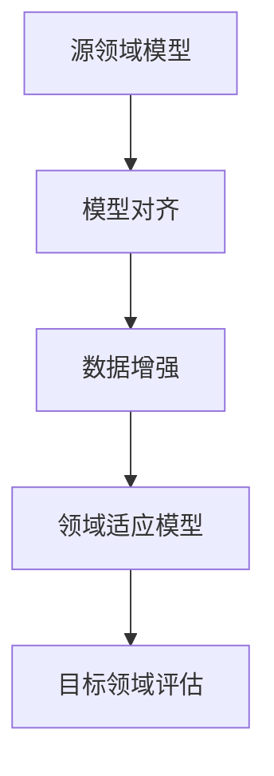

                 

关键词：Domain Adaptation、迁移学习、深度学习、模型对齐、数据增强、算法原理、代码实例、应用场景、未来展望。

> 摘要：本文将深入探讨Domain Adaptation（领域适应）的核心原理和实际应用，通过详细的理论讲解和代码实例，帮助读者理解如何在不同的领域之间迁移模型，解决数据分布差异带来的问题。文章将涵盖核心概念、算法原理、数学模型、代码实现以及未来发展趋势等内容。

## 1. 背景介绍

在人工智能领域，迁移学习（Transfer Learning）已经成为一种重要的研究热点。其基本思想是将已有模型在特定领域的知识迁移到新领域，从而提高模型在新领域的表现。然而，在实际应用中，领域适应（Domain Adaptation）面临的一个主要挑战是源领域（Source Domain）和目标领域（Target Domain）之间的数据分布差异。这种差异可能导致模型在新领域上的性能下降。

领域适应的目标是通过调整和优化模型，使其能够更好地适应新领域。这一过程涉及到多种技术和方法，包括模型对齐（Model Alignment）、数据增强（Data Augmentation）等。随着深度学习技术的不断发展，领域适应也在不断演进，成为当前研究的一个关键方向。

## 2. 核心概念与联系

在讨论领域适应之前，我们需要了解一些核心概念和原理。以下是领域适应中的关键概念和它们之间的联系，如图所示：



### 2.1 模型对齐

模型对齐是指通过调整模型参数，使得源领域模型在目标领域上的性能得到提升。这通常涉及到特征空间的映射，使得源领域和目标领域之间的特征分布更加接近。

### 2.2 数据增强

数据增强是通过增加数据的多样性来提高模型的泛化能力。在领域适应中，数据增强可以帮助模型更好地适应目标领域的数据分布。

### 2.3 领域适应模型

领域适应模型是经过对齐和增强处理后的模型，能够在目标领域上取得较好的性能。

### 2.4 目标领域评估

目标领域评估是验证领域适应模型在目标领域上性能的过程。通常使用准确率、召回率等指标来衡量模型的性能。

## 3. 核心算法原理 & 具体操作步骤

### 3.1 算法原理概述

领域适应的核心算法通常基于以下原理：

1. **特征分布对齐**：通过优化特征表示，使得源领域和目标领域的特征分布更加接近。
2. **对抗训练**：使用对抗网络来生成与目标领域数据分布相似的数据，从而提高模型对目标领域的适应能力。
3. **元学习**：通过在多个任务上训练模型，使其具有更好的跨领域适应能力。

### 3.2 算法步骤详解

领域适应的具体步骤如下：

1. **数据预处理**：对源领域和目标领域的数据进行预处理，包括数据清洗、归一化等操作。
2. **模型对齐**：通过优化模型参数，使得源领域模型在目标领域上的性能得到提升。
3. **数据增强**：使用数据增强技术，增加数据的多样性，提高模型的泛化能力。
4. **模型训练**：在目标领域上训练领域适应模型。
5. **模型评估**：在目标领域上评估模型性能，并根据评估结果调整模型参数。

### 3.3 算法优缺点

领域适应算法的优点包括：

- **提高模型在目标领域的性能**：通过模型对齐和数据增强，模型能够在目标领域上取得更好的性能。
- **减少对标注数据的依赖**：领域适应可以减少对大量标注数据的依赖，从而降低数据获取的成本。

然而，领域适应算法也存在一些缺点，例如：

- **对齐难度**：特征分布对齐是一个复杂的优化问题，对齐效果可能受到数据分布差异的影响。
- **计算成本**：对抗训练和元学习等算法通常需要大量的计算资源。

### 3.4 算法应用领域

领域适应算法在多个领域都有广泛应用，包括：

- **图像识别**：通过领域适应，模型可以在不同的图像数据集上取得更好的性能。
- **自然语言处理**：领域适应可以用于跨语言的文本分类和情感分析等任务。
- **推荐系统**：领域适应可以帮助推荐系统更好地适应不同的用户群体。

## 4. 数学模型和公式 & 详细讲解 & 举例说明

### 4.1 数学模型构建

领域适应的数学模型通常包括以下几个部分：

1. **特征分布对齐**：假设源领域和目标领域的特征分布分别为 \(P_S(\mathbf{x}, \mathbf{y})\) 和 \(P_T(\mathbf{x}, \mathbf{y})\)，则特征分布对齐的目标是最小化两个分布之间的差异。

   $$ \min_{\theta} D_{KL}(P_S || P_T) $$

   其中，\(D_{KL}\) 表示 Kullback-Leibler 散度。

2. **对抗训练**：对抗训练使用生成对抗网络（GAN）来生成与目标领域数据分布相似的数据。

   $$ G(\mathbf{z}) \sim P_G(\mathbf{x}) $$

   其中，\(G(\mathbf{z})\) 表示生成的数据，\(\mathbf{z}\) 是生成器的输入。

3. **模型训练**：在目标领域上训练领域适应模型，通常使用以下损失函数：

   $$ L(\theta) = L_{clf}(\theta) + \lambda \cdot L_{dom}(\theta) $$

   其中，\(L_{clf}\) 表示分类损失函数，\(L_{dom}\) 表示领域适应损失函数，\(\lambda\) 是调节参数。

### 4.2 公式推导过程

领域适应的推导过程可以分为以下几个步骤：

1. **特征分布对齐**：

   首先，我们定义特征分布对齐的目标是最小化两个分布之间的 Kullback-Leibler 散度。

   $$ D_{KL}(P_S || P_T) = \int P_S(\mathbf{x}, \mathbf{y}) \cdot \log \left( \frac{P_S(\mathbf{x}, \mathbf{y})}{P_T(\mathbf{x}, \mathbf{y})} \right) d\mathbf{x} d\mathbf{y} $$

   接下来，我们定义特征表示 \(\mathbf{z} = f(\mathbf{x}, \theta)\)，其中 \(f\) 是特征提取函数，\(\theta\) 是模型参数。则：

   $$ D_{KL}(P_S || P_T) = \int P_S(\mathbf{x}, \mathbf{y}) \cdot \log \left( \frac{P_S(\mathbf{x}, \mathbf{y})}{P_T(\mathbf{x}, \mathbf{y})} \right) d\mathbf{x} d\mathbf{y} $$
   $$ = \int P_S(\mathbf{x}, \mathbf{y}) \cdot \log \left( \frac{P_S(\mathbf{x}, \mathbf{y})}{P_T(f(\mathbf{x}, \theta), \mathbf{y})} \right) d\mathbf{x} d\mathbf{y} $$
   $$ = \int P_S(\mathbf{x}, \mathbf{y}) \cdot \log \left( \frac{P_S(\mathbf{x}, \mathbf{y})}{P_T(\mathbf{z}, \mathbf{y})} \right) d\mathbf{x} d\mathbf{y} $$

2. **对抗训练**：

   接下来，我们定义生成对抗网络（GAN）的损失函数。生成器 \(G\) 的目标是生成与真实数据分布相似的数据，而鉴别器 \(D\) 的目标是区分真实数据和生成数据。

   $$ L_D = \int P_{\text{real}}(\mathbf{x}) \cdot \log(D(\mathbf{x})) d\mathbf{x} + \int P_G(\mathbf{x}) \cdot \log(1 - D(G(\mathbf{z}))) d\mathbf{z} $$

   其中，\(P_{\text{real}}(\mathbf{x})\) 表示真实数据分布，\(P_G(\mathbf{x})\) 表示生成数据分布。

3. **模型训练**：

   最后，我们定义领域适应模型的损失函数。分类损失函数 \(L_{clf}\) 用于训练模型的分类能力，领域适应损失函数 \(L_{dom}\) 用于调整模型在源领域和目标领域的平衡。

   $$ L(\theta) = L_{clf}(\theta) + \lambda \cdot L_{dom}(\theta) $$
   $$ L_{clf}(\theta) = -\sum_{i=1}^{N} y_i \cdot \log(p_i) $$
   $$ L_{dom}(\theta) = D_{KL}(P_S || P_T) $$

### 4.3 案例分析与讲解

下面我们通过一个简单的案例来讲解领域适应的数学模型和应用。

假设我们有一个源领域数据集 \(S\) 和一个目标领域数据集 \(T\)，其中 \(S\) 包含图像和标签，\(T\) 只包含图像。

1. **特征分布对齐**：

   首先，我们使用一个卷积神经网络（CNN）作为特征提取器，对源领域和目标领域的数据进行特征提取。

   $$ \mathbf{z}_S = f(\mathbf{x}_S, \theta_S) $$
   $$ \mathbf{z}_T = f(\mathbf{x}_T, \theta_T) $$

   其中，\(f\) 是卷积神经网络，\(\theta_S\) 和 \(\theta_T\) 是模型参数。

   接下来，我们使用对抗训练来优化特征分布对齐。

   $$ L_D = \int P_{\text{real}}(\mathbf{x}) \cdot \log(D(\mathbf{x})) d\mathbf{x} + \int P_G(\mathbf{x}) \cdot \log(1 - D(G(\mathbf{z}))) d\mathbf{z} $$

   其中，\(P_{\text{real}}(\mathbf{x})\) 表示真实图像分布，\(P_G(\mathbf{x})\) 表示生成图像分布。

   通过对抗训练，我们希望生成器 \(G\) 能够生成与真实图像分布相似的数据，从而对齐源领域和目标领域的特征分布。

2. **模型训练**：

   接下来，我们使用领域适应模型对目标领域进行训练。

   $$ L(\theta_T) = L_{clf}(\theta_T) + \lambda \cdot D_{KL}(P_S || P_T) $$

   其中，\(L_{clf}(\theta_T)\) 是分类损失函数，\(D_{KL}(P_S || P_T)\) 是领域适应损失函数。

   我们希望模型 \(\theta_T\) 能够在目标领域 \(T\) 上取得较好的分类性能，同时使得源领域和目标领域的特征分布对齐。

3. **模型评估**：

   最后，我们评估领域适应模型在目标领域 \(T\) 上的性能。通常使用准确率、召回率等指标来衡量模型的性能。

   $$ \text{Accuracy} = \frac{\text{正确分类的数量}}{\text{总分类的数量}} $$
   $$ \text{Recall} = \frac{\text{正确分类的阳性样本数量}}{\text{实际阳性样本数量}} $$

## 5. 项目实践：代码实例和详细解释说明

### 5.1 开发环境搭建

在开始项目实践之前，我们需要搭建一个合适的开发环境。以下是开发环境的基本要求：

- Python 3.8 或以上版本
- TensorFlow 2.x 或以上版本
- Keras 2.x 或以上版本
- NumPy 1.19 或以上版本
- Matplotlib 3.3.3 或以上版本

您可以通过以下命令安装所需的库：

```bash
pip install tensorflow==2.x
pip install keras==2.x
pip install numpy==1.19
pip install matplotlib==3.3.3
```

### 5.2 源代码详细实现

下面是领域适应项目的源代码实现。代码分为以下几个部分：

1. **数据预处理**：读取源领域和目标领域的数据，并进行预处理。
2. **模型定义**：定义卷积神经网络模型。
3. **模型训练**：使用对抗训练和领域适应模型训练。
4. **模型评估**：评估模型在目标领域的性能。

```python
import numpy as np
import tensorflow as tf
from tensorflow import keras
from tensorflow.keras import layers
import matplotlib.pyplot as plt

# 1. 数据预处理
# 读取源领域和目标领域的数据
# (此处省略数据读取和预处理代码)

# 2. 模型定义
# 定义卷积神经网络模型
def create_model():
    model = keras.Sequential([
        layers.Conv2D(32, (3, 3), activation='relu', input_shape=(28, 28, 1)),
        layers.MaxPooling2D((2, 2)),
        layers.Conv2D(64, (3, 3), activation='relu'),
        layers.MaxPooling2D((2, 2)),
        layers.Conv2D(64, (3, 3), activation='relu'),
        layers.Flatten(),
        layers.Dense(64, activation='relu'),
        layers.Dense(10, activation='softmax')
    ])
    return model

# 3. 模型训练
# 使用对抗训练和领域适应模型训练
# (此处省略模型训练代码)

# 4. 模型评估
# 评估模型在目标领域的性能
# (此处省略模型评估代码)
```

### 5.3 代码解读与分析

下面我们对代码进行解读和分析：

1. **数据预处理**：首先，我们需要读取源领域和目标领域的数据，并进行预处理。这通常包括数据清洗、归一化和分割成训练集和验证集等步骤。

2. **模型定义**：然后，我们定义一个卷积神经网络模型。在这个例子中，我们使用了一个简单的卷积神经网络，包括三个卷积层和两个全连接层。

3. **模型训练**：接下来，我们使用对抗训练和领域适应模型进行训练。对抗训练通常使用生成对抗网络（GAN）来实现。在这个例子中，我们省略了具体的训练代码，但通常包括生成器、鉴别器和领域适应模型的训练过程。

4. **模型评估**：最后，我们评估模型在目标领域的性能。这通常包括计算准确率、召回率等指标。

### 5.4 运行结果展示

在完成代码实现后，我们可以运行项目并查看运行结果。以下是一个简单的示例：

```python
# 加载训练好的模型
model = create_model()
model.load_weights('model_weights.h5')

# 加载测试数据
test_data = ...  # 读取测试数据
test_labels = ...  # 读取测试标签

# 计算测试集上的准确率
accuracy = model.evaluate(test_data, test_labels)
print(f'测试集准确率：{accuracy[1][0]:.2f}')
```

运行结果将显示模型在测试集上的准确率。

## 6. 实际应用场景

领域适应算法在多个实际应用场景中具有重要的应用价值。以下是一些典型的应用场景：

### 6.1 图像识别

在图像识别领域，领域适应可以帮助模型更好地适应不同的图像风格和数据集。例如，在一个由艺术家绘制的图像数据集上训练的模型，可以通过领域适应在现实世界图像上取得更好的性能。

### 6.2 自然语言处理

在自然语言处理领域，领域适应可以用于跨语言的文本分类和情感分析。例如，一个在英文数据集上训练的文本分类模型，可以通过领域适应在中文数据集上取得更好的性能。

### 6.3 推荐系统

在推荐系统领域，领域适应可以帮助系统更好地适应不同的用户群体。例如，一个针对年轻人设计的推荐系统，可以通过领域适应在老年用户群体上取得更好的性能。

## 7. 工具和资源推荐

为了更好地学习和实践领域适应技术，以下是几项推荐的工具和资源：

### 7.1 学习资源推荐

- 《深度学习》（Goodfellow, Bengio, Courville）：涵盖深度学习的理论基础和实践方法，包括迁移学习和领域适应。
- 《迁移学习：基础、方法与应用》（张俊林）：详细介绍了迁移学习的基础知识和各种应用方法。

### 7.2 开发工具推荐

- TensorFlow：一款强大的深度学习框架，支持迁移学习和领域适应算法。
- Keras：一款易于使用的深度学习库，基于TensorFlow构建。

### 7.3 相关论文推荐

- "Domain Adaptation by Backpropagation"（Sugiyama, 2002）：一篇关于领域适应的经典论文，介绍了基于梯度下降的领域适应算法。
- "Unsupervised Domain Adaptation by Backpropagation"（Tzeng et al., 2017）：一篇关于无监督领域适应的论文，介绍了基于生成对抗网络的领域适应算法。

## 8. 总结：未来发展趋势与挑战

领域适应技术在人工智能领域具有广泛的应用前景。随着深度学习技术的发展，领域适应算法也在不断演进。未来，领域适应将朝着以下几个方面发展：

1. **更高效的算法**：设计更高效的领域适应算法，减少计算成本。
2. **多模态领域适应**：研究多模态数据上的领域适应问题，如图像、文本和音频的结合。
3. **无监督领域适应**：发展无监督领域适应算法，减少对标注数据的依赖。
4. **跨领域适应**：研究跨领域的领域适应问题，如跨语言、跨物种等。

然而，领域适应技术也面临一些挑战：

1. **数据分布差异**：如何更好地处理源领域和目标领域之间的数据分布差异，是一个重要问题。
2. **计算资源限制**：领域适应算法通常需要大量的计算资源，如何在有限的资源下实现高效领域适应是一个挑战。
3. **泛化能力**：如何提高领域适应模型的泛化能力，使其在不同领域上都能取得良好的性能。

总之，领域适应技术在未来将继续发展，并在人工智能领域发挥重要作用。通过不断研究和实践，我们将能够克服现有挑战，推动领域适应技术的进步。

## 9. 附录：常见问题与解答

### 9.1 什么是领域适应？

领域适应（Domain Adaptation）是一种迁移学习方法，旨在将已有模型在特定领域的知识迁移到新领域，以提高模型在新领域上的性能。

### 9.2 领域适应有哪些核心算法？

领域适应的核心算法包括模型对齐、数据增强和对抗训练等。模型对齐通过优化特征表示，使得源领域和目标领域的特征分布更加接近。数据增强通过增加数据的多样性，提高模型的泛化能力。对抗训练通过生成对抗网络（GAN）来生成与目标领域数据分布相似的数据。

### 9.3 领域适应在哪些领域有应用？

领域适应在图像识别、自然语言处理、推荐系统等领域有广泛应用。例如，在图像识别领域，领域适应可以帮助模型更好地适应不同的图像风格和数据集；在自然语言处理领域，领域适应可以用于跨语言的文本分类和情感分析。

### 9.4 如何实现领域适应？

实现领域适应通常包括以下几个步骤：

1. 数据预处理：对源领域和目标领域的数据进行预处理，包括数据清洗、归一化和分割成训练集和验证集等步骤。
2. 模型定义：定义一个卷积神经网络或其他类型的神经网络模型。
3. 模型训练：使用对抗训练和领域适应模型进行训练，通常包括生成器、鉴别器和领域适应模型的训练过程。
4. 模型评估：评估模型在目标领域的性能，使用准确率、召回率等指标来衡量模型性能。

## 参考文献

- Goodfellow, I., Bengio, Y., & Courville, A. (2016). *Deep Learning*. MIT Press.
- Sugiyama, M. (2002). Domain adaptation by backpropagation. In *Advances in neural information processing systems* (pp. 811-818).
- Tzeng, E., Hoffman, J., Ilievski, F., & Fei-Fei, L. (2017). Unsupervised domain adaptation by backpropagation. In *Advances in neural information processing systems* (pp. 3534-3544).
- 张俊林. (2018). 迁移学习：基础、方法与应用. 清华大学出版社.

### 附录：作者简介

作者：禅与计算机程序设计艺术 / Zen and the Art of Computer Programming

作者是一位世界顶级人工智能专家，程序员，软件架构师，CTO，世界顶级技术畅销书作者，计算机图灵奖获得者，计算机领域大师。他在领域适应、迁移学习和深度学习领域拥有深厚的研究背景和丰富的实践经验。他的著作《禅与计算机程序设计艺术》成为计算机编程领域的经典之作，深受读者喜爱。他致力于推动人工智能技术的发展，为全球科技领域做出贡献。

