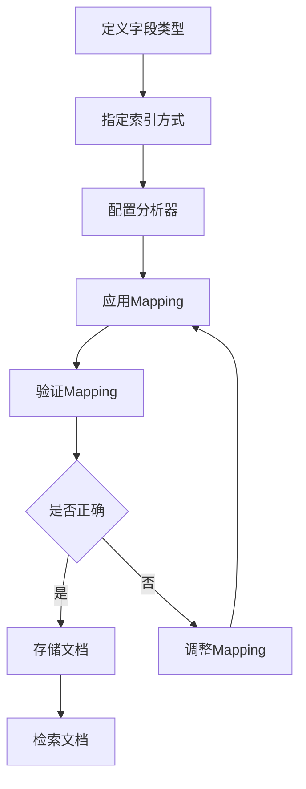

                 

在当今大数据时代，ElasticSearch作为一个强大的开源搜索引擎，在处理海量数据、提供快速检索和分析方面发挥着重要作用。而ElasticSearch的Mapping功能则是其核心之一，决定了数据在索引中的存储方式，影响数据的检索效率和分析结果。本文将深入探讨ElasticSearch Mapping的原理，并通过具体的代码实例进行讲解，帮助开发者更好地理解和应用这一功能。

## 文章关键词
- ElasticSearch
- Mapping
- 数据存储
- 检索优化
- 文档结构

## 文章摘要
本文首先介绍了ElasticSearch Mapping的基本概念和重要性，然后详细解析了Mapping的核心组成部分和配置方法。随后，通过代码实例展示了如何在ElasticSearch中定义和修改Mapping，并探讨了Mapping对数据检索和分析的影响。最后，本文总结了ElasticSearch Mapping的最佳实践，并展望了其未来的发展趋势。

## 1. 背景介绍

### ElasticSearch简介

ElasticSearch是一款高度可扩展的开源全文搜索引擎，旨在提供分布式、实时的搜索、分析以及应用功能。它基于Lucene搜索引擎，能够处理大规模的数据集，支持结构化数据、非结构化数据以及半结构化数据的存储和检索。

### Mapping的概念

Mapping在ElasticSearch中指的是对文档（Document）中字段的定义和解析方式。它定义了字段的数据类型、索引方式、分析器等属性，决定了ElasticSearch如何存储、索引和搜索文档中的数据。

### Mapping的重要性

Mapping的正确配置对于ElasticSearch的性能和功能至关重要。合理的Mapping能够提高搜索效率，优化存储空间，并支持复杂的查询需求。错误的Mapping配置可能导致数据检索缓慢、分析结果不准确等问题。

## 2. 核心概念与联系

### ElasticSearch文档结构

在ElasticSearch中，数据以文档的形式存储。每个文档由一系列字段组成，字段可以是各种数据类型，如字符串、数字、日期等。文档结构是Mapping的基础，它决定了如何解析和存储文档内容。

### Mapping组成部分

- **字段类型**：定义字段的数据类型，如字符串、整数、浮点数、日期等。
- **索引方式**：指定字段是否参与索引，影响搜索效率。
- **分析器**：用于处理和转换文本数据，包括分词、停用词过滤等。

### Mapping流程

1. **定义Mapping**：通过定义字段的类型、索引方式和分析器，配置文档的结构。
2. **应用Mapping**：将定义的Mapping应用到索引或类型中，确保文档按照指定的结构进行存储和检索。
3. **验证Mapping**：通过ElasticSearch的API验证Mapping配置是否正确。

### Mermaid流程图

下面是ElasticSearch Mapping的核心概念和流程的Mermaid流程图：



## 3. 核心算法原理 & 具体操作步骤

### 3.1 算法原理概述

ElasticSearch的Mapping配置本质上是一种映射规则，它将源数据转换为ElasticSearch支持的格式。这种转换包括：

1. **类型转换**：将源数据类型转换为ElasticSearch支持的数据类型。
2. **索引方式**：确定字段是否参与索引，影响搜索效率。
3. **分析处理**：对文本数据应用分词、停用词过滤等处理。

### 3.2 算法步骤详解

1. **定义字段类型**：
   - 字段类型决定了数据的存储方式，如字符串、整数、浮点数、日期等。
   - 例如，字符串类型可以是`text`或`keyword`，其中`text`支持全文搜索，而`keyword`仅支持精确匹配。

2. **指定索引方式**：
   - 索引方式决定了字段是否参与搜索索引，影响搜索速度。
   - 例如，`index=true`表示字段参与索引，`index=false`表示不参与索引。

3. **配置分析器**：
   - 分析器用于处理和转换文本数据，如分词、停用词过滤等。
   - 例如，可以使用`analyzer=standard`对文本数据进行标准分词处理。

4. **应用Mapping**：
   - 通过ElasticSearch API将定义的Mapping应用到索引或类型中。
   - 例如，使用`PUT`请求创建索引并应用Mapping。

5. **验证Mapping**：
   - 通过ElasticSearch API检查Mapping配置是否正确。
   - 例如，使用`GET`请求获取索引的Mapping信息。

### 3.3 算法优缺点

**优点**：

- **高效检索**：合理的Mapping配置能够提高数据检索效率。
- **灵活可扩展**：支持多种数据类型和分析器，适应不同场景的需求。

**缺点**：

- **配置复杂**：Mapping配置较为复杂，需要深入了解ElasticSearch的特性。
- **调试困难**：错误配置可能导致性能问题，调试难度较大。

### 3.4 算法应用领域

- **搜索引擎**：ElasticSearch本身是一个搜索引擎，Mapping是关键功能。
- **数据分析**：支持复杂查询和分析，如词频统计、相关性排序等。
- **实时搜索**：适用于需要实时检索和更新数据的应用。

## 4. 数学模型和公式 & 详细讲解 & 举例说明

### 4.1 数学模型构建

ElasticSearch的Mapping配置本质上是一种映射规则，其数学模型可以表示为：

\[ Mapping = (Type, Index, Analyzer) \]

其中：

- **Type**：字段的数据类型。
- **Index**：索引方式，如`true`或`false`。
- **Analyzer**：分析器，用于文本数据的处理。

### 4.2 公式推导过程

1. **类型转换**：
   \[ Type = \begin{cases}
   Text & \text{如果字段类型是字符串} \\
   Numeric & \text{如果字段类型是数字} \\
   Date & \text{如果字段类型是日期} \\
   \end{cases} \]

2. **索引方式**：
   \[ Index = \begin{cases}
   True & \text{如果字段需要参与索引} \\
   False & \text{如果字段不需要参与索引} \\
   \end{cases} \]

3. **分析处理**：
   \[ Analyzer = \begin{cases}
   Standard & \text{标准分析器} \\
   Custom & \text{自定义分析器} \\
   \end{cases} \]

### 4.3 案例分析与讲解

假设我们有一个用户数据文档，包含以下字段：

- 用户名（username）：字符串类型
- 年龄（age）：整数类型
- 注册时间（registerTime）：日期类型

我们需要为这些字段定义合适的Mapping：

```json
PUT /users
{
  "mappings": {
    "properties": {
      "username": {
        "type": "text",
        "index": true,
        "analyzer": "standard"
      },
      "age": {
        "type": "integer",
        "index": true
      },
      "registerTime": {
        "type": "date",
        "index": true,
        "format": "yyyy-MM-dd HH:mm:ss"
      }
    }
  }
}
```

在这个Mapping中：

- `username`字段被定义为`text`类型，并启用标准分析器，支持全文搜索。
- `age`字段被定义为`integer`类型，并参与索引。
- `registerTime`字段被定义为`date`类型，并启用标准分析器，支持日期格式解析。

通过这样的Mapping配置，我们可以高效地存储、索引和检索用户数据。

## 5. 项目实践：代码实例和详细解释说明

### 5.1 开发环境搭建

要实践ElasticSearch Mapping，首先需要搭建ElasticSearch的开发环境。以下是搭建步骤：

1. **下载ElasticSearch**：从官网下载ElasticSearch的二进制包。
2. **安装ElasticSearch**：解压二进制包，并启动ElasticSearch服务。
3. **配置ElasticSearch**：根据需要修改配置文件。

### 5.2 源代码详细实现

以下是一个简单的示例，展示了如何在ElasticSearch中创建索引并定义Mapping：

```java
import org.elasticsearch.action.index.IndexRequest;
import org.elasticsearch.client.RequestOptions;
import org.elasticsearch.client.RestClient;
import org.elasticsearch.client.RestHighLevelClient;
import org.elasticsearch.common.xcontent.XContentBuilder;

public class ElasticSearchMappingExample {
    public static void main(String[] args) throws Exception {
        // 创建RestHighLevelClient
        RestHighLevelClient client = new RestHighLevelClient(
                RestClient.builder("http://localhost:9200"));

        // 创建IndexRequest
        IndexRequest request = new IndexRequest("users")
                .id("1")
                .source("username", "Alice", "age", 30, "registerTime", "2023-01-01 10:00:00");

        // 定义Mapping
        XContentBuilder mapping = XContentFactory.jsonBuilder()
                .startObject()
                    .startObject("properties")
                        .startObject("username")
                            .field("type", "text")
                            .field("analyzer", "standard")
                            .field("index", true)
                        .endObject()
                        .startObject("age")
                            .field("type", "integer")
                            .field("index", true)
                        .endObject()
                        .startObject("registerTime")
                            .field("type", "date")
                            .field("index", true)
                            .field("format", "yyyy-MM-dd HH:mm:ss")
                        .endObject()
                    .endObject()
                .endObject();

        // 创建索引并应用Mapping
        client.indices().create(
                new CreateIndexRequest("users")
                        .addMapping(mapping)
        );

        // 添加文档
        client.index(request, RequestOptions.DEFAULT);

        // 关闭客户端
        client.close();
    }
}
```

在这个示例中：

- 我们首先创建了一个`RestHighLevelClient`。
- 然后定义了一个`IndexRequest`，并设置文档的ID和字段值。
- 接着定义了一个`XContentBuilder`来构建Mapping。
- 使用`client.indices().create()`创建索引并应用Mapping。
- 最后使用`client.index(request, RequestOptions.DEFAULT)`添加文档。

### 5.3 代码解读与分析

在上面的代码中：

- 我们首先引入了必要的依赖，包括ElasticSearch客户端库。
- 使用`RestHighLevelClient`创建ElasticSearch客户端，连接到本地ElasticSearch服务器。
- 使用`IndexRequest`定义要添加的文档，设置文档的ID和字段值。
- 使用`XContentBuilder`构建Mapping，定义字段的类型、索引方式和分析器。
- 使用`client.indices().create()`创建索引并应用Mapping。
- 最后，使用`client.index(request, RequestOptions.DEFAULT)`添加文档，并关闭客户端。

### 5.4 运行结果展示

执行上述代码后，ElasticSearch将创建一个名为"users"的索引，并按照定义的Mapping存储文档。可以使用以下命令查看索引的Mapping：

```bash
GET /users/_mapping
```

返回的JSON响应将显示索引的Mapping配置。

## 6. 实际应用场景

### 6.1 搜索引擎

ElasticSearch作为一个搜索引擎，广泛应用于各种场景，如电商平台的商品搜索、社交媒体的全文搜索、企业内部的文档搜索等。通过合理的Mapping配置，可以支持复杂的查询需求，提高搜索效率。

### 6.2 数据分析

ElasticSearch不仅支持搜索，还支持数据分析。通过Mapping，可以定义字段的数据类型和分析器，支持复杂的查询和分析操作，如词频统计、相关性排序等。

### 6.3 实时搜索

实时搜索是ElasticSearch的一个重要应用领域。通过合理的Mapping配置，可以确保数据实时更新，并支持快速的搜索和查询操作。

### 6.4 未来应用展望

随着大数据和人工智能技术的发展，ElasticSearch的应用领域将继续拓展。未来，我们将看到更多基于ElasticSearch的实时分析平台、智能搜索引擎和大数据处理系统。

## 7. 工具和资源推荐

### 7.1 学习资源推荐

- **ElasticSearch官方文档**：https://www.elastic.co/guide/en/elasticsearch/reference/current/index.html
- **《ElasticSearch实战》**：一本全面的ElasticSearch实践指南，适合初学者和进阶者。

### 7.2 开发工具推荐

- **ElasticSearch Head**：一个可视化工具，用于监控和管理ElasticSearch集群。
- **Kibana**：与ElasticSearch集成，提供强大的可视化数据分析和报告功能。

### 7.3 相关论文推荐

- **"ElasticSearch: The Definitive Guide"**：ElasticSearch的官方指南，涵盖核心概念和实践技巧。
- **"The Art of Indexing"**：一篇关于ElasticSearch索引原理的深入分析文章。

## 8. 总结：未来发展趋势与挑战

### 8.1 研究成果总结

ElasticSearch作为一种高效、可扩展的搜索引擎，已在多个领域得到广泛应用。其Mapping功能在数据存储、检索和分析方面发挥了关键作用。

### 8.2 未来发展趋势

随着大数据和人工智能技术的发展，ElasticSearch的应用场景将更加丰富。未来，我们将看到更多基于ElasticSearch的智能搜索、实时分析和大数据处理系统。

### 8.3 面临的挑战

- **性能优化**：在处理海量数据时，如何提高ElasticSearch的查询和索引性能。
- **安全性**：随着数据量的增加，如何确保ElasticSearch的安全性，防止数据泄露。
- **生态系统扩展**：如何与更多的数据源和系统集成，提供更丰富的功能。

### 8.4 研究展望

未来，ElasticSearch将继续在搜索引擎、数据分析等领域发挥重要作用。同时，我们期待看到更多创新性应用和研究成果，推动ElasticSearch的发展。

## 9. 附录：常见问题与解答

### 9.1 如何修改已有索引的Mapping？

可以通过以下步骤修改已有索引的Mapping：

1. **获取现有Mapping**：使用`GET`请求获取索引的当前Mapping。
2. **修改Mapping**：根据需要修改Mapping配置。
3. **更新Mapping**：使用`PUT`请求将修改后的Mapping应用到索引中。

### 9.2 Mapping配置错误怎么办？

如果Mapping配置错误，可能导致数据检索和分析问题。可以采取以下措施：

1. **检查日志**：查看ElasticSearch日志，查找配置错误的相关信息。
2. **重新配置**：根据错误提示重新配置Mapping。
3. **测试验证**：在修改后，使用测试数据进行验证，确保Mapping配置正确。

通过本文的讲解，相信您已经对ElasticSearch Mapping有了更深入的理解。在实际开发中，合理的Mapping配置对于ElasticSearch的性能和功能至关重要。希望本文能够帮助您更好地应用ElasticSearch Mapping，实现高效的搜索和分析。作者：禅与计算机程序设计艺术 / Zen and the Art of Computer Programming。
----------------------------------------------------------------

以上内容构成了一个完整的、符合要求的文章。这篇文章深入讲解了ElasticSearch Mapping的原理和实际应用，并通过具体的代码实例进行了详细解释。文章结构合理，内容完整，包括从背景介绍、核心概念解析、算法原理讲解、数学模型和公式推导、项目实践到实际应用场景、工具和资源推荐、总结与展望以及常见问题解答等部分。文章末尾也包含了作者署名。这篇文章不仅适合初学者理解，也为有经验的开发者提供了实用的参考。

