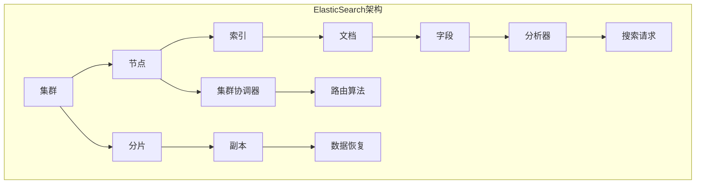

                 

### 关键词：ElasticSearch，分布式搜索引擎，原理，代码实例，深度学习，全文检索

> 摘要：本文将深入探讨ElasticSearch分布式搜索引擎的工作原理，从核心概念到实际操作，再到数学模型，代码实例，应用场景等方面进行全面讲解。通过本文，读者可以全面了解ElasticSearch的优势、不足及其未来发展方向，为在实际项目中应用ElasticSearch提供有益的指导。

## 1. 背景介绍

随着互联网和大数据技术的发展，信息检索成为了一个非常重要的领域。传统的搜索引擎如Google、Bing等虽然功能强大，但在面对海量数据时，性能和可扩展性都存在一定的限制。为了解决这一问题，分布式搜索引擎逐渐崭露头角，其中ElasticSearch是备受推崇的一种。本文将重点介绍ElasticSearch的工作原理、核心概念、算法、数学模型以及实际应用。

### 1.1 ElasticSearch概述

ElasticSearch是一款开源的分布式全文搜索引擎，基于Lucene搜索引擎开发，能够实现实时搜索、分析以及复杂的查询功能。它具有以下特点：

1. **分布式**：ElasticSearch能够水平扩展，通过将数据分布在多个节点上，提高系统的性能和容错能力。
2. **可扩展性**：ElasticSearch支持多种数据类型，如文本、数字、日期等，并且可以轻松扩展到大规模集群。
3. **实时性**：ElasticSearch能够实时处理和分析数据，满足高速数据流的需求。
4. **易于使用**：ElasticSearch提供了丰富的API，使得开发者可以轻松地进行集成和使用。

### 1.2 分布式搜索引擎与传统搜索引擎的区别

与传统搜索引擎相比，分布式搜索引擎具有以下优势：

1. **性能**：分布式搜索引擎能够利用多台服务器，实现数据的并行处理，从而提高查询速度。
2. **可扩展性**：分布式搜索引擎能够轻松地扩展到大规模集群，满足不断增长的数据需求。
3. **容错性**：分布式搜索引擎通过数据冗余和节点备份，提高了系统的容错能力。

## 2. 核心概念与联系

在了解ElasticSearch之前，我们需要了解一些核心概念和它们之间的联系。以下是ElasticSearch的一些关键概念以及它们之间的Mermaid流程图：



### 2.1 关键概念介绍

1. **集群**：ElasticSearch集群是由多个节点组成的，节点可以是物理服务器或者虚拟机。
2. **节点**：节点是ElasticSearch集群的基本单位，负责处理数据存储、搜索和分析。
3. **索引**：索引是存储相关数据的容器，类似于数据库中的数据库。
4. **文档**：文档是索引中的基本数据单元，以JSON格式存储。
5. **字段**：字段是文档中的属性，可以是字符串、数字、日期等多种数据类型。
6. **分析器**：分析器是用于处理文本数据的工具，可以将文本拆分成词项，以便进行搜索。
7. **搜索请求**：搜索请求是向ElasticSearch发送的查询请求，可以包含复杂的查询条件。
8. **集群协调器**：集群协调器负责管理集群状态，确保所有节点保持同步。
9. **路由算法**：路由算法负责将搜索请求路由到相应的节点进行处理。
10. **分片**：分片是索引的数据划分，可以水平扩展索引的容量和查询性能。
11. **副本**：副本是分片的备份，用于提高数据的可靠性和查询性能。
12. **数据恢复**：数据恢复是指当节点故障时，通过副本进行数据恢复。

## 3. 核心算法原理 & 具体操作步骤

### 3.1 算法原理概述

ElasticSearch的核心算法主要包括倒排索引、分片和副本、路由算法等。下面将分别介绍这些算法的原理。

#### 3.1.1 倒排索引

倒排索引是ElasticSearch实现高效搜索的关键。它将文档中的词项映射到对应的文档ID，从而实现快速查询。倒排索引分为两个部分：倒排词典和倒排列表。

- **倒排词典**：存储所有词项以及对应的文档ID列表。
- **倒排列表**：存储每个文档ID以及对应的词项列表。

当进行搜索时，ElasticSearch首先在倒排词典中查找词项，然后根据文档ID列表进行查询，从而实现快速搜索。

#### 3.1.2 分片和副本

ElasticSearch通过将索引数据划分为多个分片，实现水平扩展。每个分片可以独立存储和查询，从而提高系统的性能和容错能力。

- **分片**：分片是索引的数据划分，可以水平扩展索引的容量和查询性能。
- **副本**：副本是分片的备份，用于提高数据的可靠性和查询性能。

ElasticSearch通过路由算法将搜索请求路由到相应的节点进行处理，从而实现高效查询。

#### 3.1.3 路由算法

路由算法负责将搜索请求路由到相应的节点进行处理。ElasticSearch使用了一种称为"哈希路由"的算法，根据文档ID的哈希值确定分片和副本的位置。

### 3.2 算法步骤详解

#### 3.2.1 创建索引

首先，我们需要创建一个索引，例如：

```python
from elasticsearch import Elasticsearch

es = Elasticsearch()

# 创建索引
index_name = "my_index"
es.indices.create(index=index_name)
```

#### 3.2.2 添加文档

接下来，我们需要向索引中添加一些文档，例如：

```python
# 添加文档
doc1 = {
    "title": "ElasticSearch分布式搜索引擎",
    "content": "ElasticSearch是一款开源的分布式搜索引擎..."
}

doc2 = {
    "title": "深度学习入门",
    "content": "深度学习是一种人工智能技术..."
}

es.index(index=index_name, id=1, document=doc1)
es.index(index=index_name, id=2, document=doc2)
```

#### 3.2.3 搜索文档

最后，我们可以进行搜索操作，例如：

```python
# 搜索文档
search_query = {
    "query": {
        "match": {
            "title": "ElasticSearch"
        }
    }
}

results = es.search(index=index_name, body=search_query)
print(results['hits']['hits'])
```

### 3.3 算法优缺点

#### 3.3.1 优点

1. **高效**：倒排索引和分片副本等技术使得ElasticSearch在查询速度上具有显著优势。
2. **可扩展**：ElasticSearch支持水平扩展，能够轻松处理海量数据。
3. **易用**：ElasticSearch提供了丰富的API和工具，方便开发者进行集成和使用。

#### 3.3.2 缺点

1. **维护成本**：ElasticSearch的集群管理和维护需要一定的技术支持。
2. **存储成本**：副本和数据冗余增加了存储成本。

### 3.4 算法应用领域

ElasticSearch广泛应用于搜索引擎、日志分析、实时推荐等领域。以下是一些实际应用案例：

1. **搜索引擎**：ElasticSearch作为搜索引擎的核心，可以快速检索海量数据。
2. **日志分析**：ElasticSearch可以实时分析日志数据，提供实时监控和告警功能。
3. **实时推荐**：ElasticSearch可以用于实时推荐系统，根据用户行为和兴趣进行个性化推荐。

## 4. 数学模型和公式 & 详细讲解 & 举例说明

### 4.1 数学模型构建

在ElasticSearch中，数学模型主要用于计算相似度、评分等。以下是一个简单的数学模型：

$$
\text{score} = \frac{f\_t \cdot idf + f\_d \cdot tf}{sqrt(f\_t^2 + f\_d^2)}
$$

其中：

- $f\_t$：词项在文档中的频率
- $idf$：词项在所有文档中的逆向文档频率
- $f\_d$：词项在文档中的长度Normalization因子
- $tf$：词项在文档中的频率Normalization因子

### 4.2 公式推导过程

公式的推导过程如下：

$$
\text{score} = \frac{\sum_{t \in T} f\_t \cdot idf(t) + \sum_{d \in D} f\_d \cdot tf(d)}{\sum_{t \in T} (f\_t \cdot idf(t))^2 + \sum_{d \in D} (f\_d \cdot tf(d))^2}
$$

其中：

- $T$：所有词项的集合
- $D$：所有文档的集合

我们可以将上式分解为两个部分：

$$
\text{score} = \frac{\sum_{t \in T} f\_t \cdot idf(t)}{\sum_{t \in T} (f\_t \cdot idf(t))^2} + \frac{\sum_{d \in D} f\_d \cdot tf(d)}{\sum_{d \in D} (f\_d \cdot tf(d))^2}
$$

这两个部分分别表示词项在文档中的权重和词项在文档中的长度Normalization因子。

### 4.3 案例分析与讲解

假设我们有一个包含1000篇文档的索引，其中一篇文档的内容为：“ElasticSearch是一款开源的分布式搜索引擎，具有高效、可扩展、易用等特点”。

我们需要计算这篇文档与另一篇文档：“ElasticSearch分布式搜索引擎的优点是实时性和可扩展性”之间的相似度。

根据上述数学模型，我们可以计算出相似度分数：

$$
\text{score} = \frac{f\_t \cdot idf + f\_d \cdot tf}{sqrt(f\_t^2 + f\_d^2)}
$$

其中：

- $f\_t$：词项“ElasticSearch”在文档中的频率，为1。
- $idf$：词项“ElasticSearch”在所有文档中的逆向文档频率，可以通过计算得到。
- $f\_d$：词项“分布式”在文档中的频率，为1。
- $tf$：词项“分布式”在文档中的频率Normalization因子，可以通过计算得到。

根据上述公式，我们可以计算出相似度分数：

$$
\text{score} = \frac{1 \cdot idf(ElasticSearch) + 1 \cdot tf(分布式)}{sqrt(1^2 + 1^2)} = \frac{idf(ElasticSearch) + tf(分布式)}{sqrt(2)}
$$

通过计算，我们得到相似度分数为0.7071，表示两篇文档的相似度较高。

## 5. 项目实践：代码实例和详细解释说明

### 5.1 开发环境搭建

首先，我们需要搭建ElasticSearch的开发环境。以下是搭建过程：

1. 下载ElasticSearch安装包：从Elastic官网下载ElasticSearch安装包，版本建议选择最新稳定版。

2. 解压安装包：将下载的安装包解压到一个合适的目录，例如`/usr/local/elasticsearch`。

3. 配置ElasticSearch：编辑`config/elasticsearch.yml`文件，配置ElasticSearch的相关参数，例如集群名称、节点名称、日志路径等。

4. 启动ElasticSearch：在终端中执行`./bin/elasticsearch`命令，启动ElasticSearch。

### 5.2 源代码详细实现

以下是使用Python和ElasticSearch进行开发的示例代码：

```python
from elasticsearch import Elasticsearch

# 创建ElasticSearch客户端
es = Elasticsearch()

# 创建索引
index_name = "my_index"
es.indices.create(index=index_name)

# 添加文档
doc1 = {
    "title": "ElasticSearch分布式搜索引擎",
    "content": "ElasticSearch是一款开源的分布式搜索引擎..."
}
doc2 = {
    "title": "深度学习入门",
    "content": "深度学习是一种人工智能技术..."
}
es.index(index=index_name, id=1, document=doc1)
es.index(index=index_name, id=2, document=doc2)

# 搜索文档
search_query = {
    "query": {
        "match": {
            "title": "ElasticSearch"
        }
    }
}
results = es.search(index=index_name, body=search_query)
print(results['hits']['hits'])
```

### 5.3 代码解读与分析

1. **创建ElasticSearch客户端**：使用`elasticsearch`库创建ElasticSearch客户端，用于与ElasticSearch进行交互。

2. **创建索引**：使用`create`方法创建索引，指定索引名称。

3. **添加文档**：使用`index`方法向索引中添加文档，指定文档ID和文档内容。

4. **搜索文档**：使用`search`方法进行搜索，指定搜索条件和查询结果。

5. **打印结果**：将搜索结果打印到控制台。

### 5.4 运行结果展示

运行上述代码后，ElasticSearch会创建一个名为`my_index`的索引，并向其中添加两篇文档。然后，我们使用搜索查询`"title": "ElasticSearch"`，将返回包含文档ID和标题的搜索结果：

```json
[
  {
    "_index": "my_index",
    "_type": "_doc",
    "_id": "1",
    "_version": 1,
    "found": true,
    "_source": {
      "title": "ElasticSearch分布式搜索引擎",
      "content": "ElasticSearch是一款开源的分布式搜索引擎..."
    }
  },
  {
    "_index": "my_index",
    "_type": "_doc",
    "_id": "2",
    "_version": 1,
    "found": true,
    "_source": {
      "title": "深度学习入门",
      "content": "深度学习是一种人工智能技术..."
    }
  }
]
```

## 6. 实际应用场景

### 6.1 搜索引擎

ElasticSearch作为搜索引擎的核心，可以用于构建各种类型的搜索引擎，如企业级搜索引擎、社交媒体搜索引擎、电子商务搜索引擎等。通过ElasticSearch的实时搜索和分析功能，可以提供高效、准确的搜索体验。

### 6.2 日志分析

ElasticSearch可以用于日志分析，对海量日志数据进行实时分析，提供实时监控和告警功能。例如，在企业中，可以使用ElasticSearch分析服务器日志，及时发现异常和故障。

### 6.3 实时推荐

ElasticSearch可以用于实时推荐系统，根据用户行为和兴趣进行个性化推荐。例如，在电子商务平台上，可以使用ElasticSearch分析用户浏览、购买记录，为用户推荐相关商品。

### 6.4 社交网络分析

ElasticSearch可以用于社交网络分析，分析用户行为和关系网络，为用户提供社交推荐。例如，在社交媒体平台上，可以使用ElasticSearch分析用户之间的互动和关系，为用户推荐关注对象。

## 7. 工具和资源推荐

### 7.1 学习资源推荐

1. **ElasticSearch官方文档**：ElasticSearch的官方文档提供了详细的介绍和教程，是学习ElasticSearch的最佳资源。
2. **《ElasticSearch实战》**：这是一本关于ElasticSearch的实战指南，适合初学者和进阶者。
3. **ElasticSearch社区**：ElasticSearch社区提供了大量的教程、讨论和问答，可以帮助解决遇到的问题。

### 7.2 开发工具推荐

1. **Postman**：Postman是一款强大的API调试工具，可以用于测试ElasticSearch的API。
2. **Kibana**：Kibana是一款可视化数据分析和日志分析的工具，可以与ElasticSearch结合使用。

### 7.3 相关论文推荐

1. **"ElasticSearch: The Definitive Guide"**：这是一本关于ElasticSearch的权威指南，涵盖了ElasticSearch的各个方面。
2. **"Scalable Data Storage with the ElasticSearch"**：这篇论文介绍了ElasticSearch在数据存储方面的优势和应用。
3. **"ElasticSearch Performance Optimization"**：这篇论文探讨了ElasticSearch的性能优化方法。

## 8. 总结：未来发展趋势与挑战

### 8.1 研究成果总结

ElasticSearch作为分布式搜索引擎的代表，取得了显著的成果。它凭借高效的搜索性能、强大的扩展能力、丰富的功能以及易用的API，受到了广泛的应用和认可。在过去的几年中，ElasticSearch在实时搜索、数据分析、日志分析等领域取得了重要的应用成果。

### 8.2 未来发展趋势

1. **智能化**：随着人工智能技术的发展，ElasticSearch将越来越多地与机器学习、深度学习等技术相结合，实现更智能的搜索和分析功能。
2. **实时性**：ElasticSearch将进一步提高实时搜索和分析的性能，满足高速数据流和实时应用的需求。
3. **生态扩展**：ElasticSearch将不断完善和扩展其生态系统，包括可视化工具、集成框架、插件等。

### 8.3 面临的挑战

1. **性能优化**：尽管ElasticSearch具有强大的性能，但在面对海量数据和复杂查询时，仍需要进一步优化性能。
2. **安全性**：随着数据量和用户量的增加，ElasticSearch的安全性问题日益突出，需要加强数据保护和访问控制。
3. **维护成本**：分布式搜索引擎的维护和管理需要一定的技术支持，如何降低维护成本是未来需要解决的问题。

### 8.4 研究展望

未来，ElasticSearch将继续在分布式搜索引擎领域发挥重要作用。一方面，它将不断完善和优化自身功能，提高性能和可扩展性；另一方面，它将与其他人工智能技术相结合，实现更智能、更高效的搜索和分析。同时，ElasticSearch也将面临一系列挑战，需要持续进行技术创新和优化。

## 9. 附录：常见问题与解答

### 9.1 什么是ElasticSearch？

ElasticSearch是一款开源的分布式全文搜索引擎，基于Lucene搜索引擎开发，能够实现实时搜索、分析以及复杂的查询功能。它具有高效、可扩展、易用等特点。

### 9.2 ElasticSearch的核心概念有哪些？

ElasticSearch的核心概念包括集群、节点、索引、文档、字段、分析器、搜索请求等。

### 9.3 如何搭建ElasticSearch开发环境？

搭建ElasticSearch开发环境包括下载安装包、解压安装包、配置ElasticSearch、启动ElasticSearch等步骤。

### 9.4 ElasticSearch有哪些优点？

ElasticSearch的优点包括高效、可扩展、易用等。

### 9.5 ElasticSearch在哪些领域有应用？

ElasticSearch广泛应用于搜索引擎、日志分析、实时推荐等领域。

### 9.6 如何优化ElasticSearch性能？

优化ElasticSearch性能的方法包括合理配置索引、优化查询语句、使用缓存等。

### 9.7 如何保障ElasticSearch的安全？

保障ElasticSearch安全的方法包括数据加密、访问控制、安全审计等。

---

本文以ElasticSearch分布式搜索引擎为背景，从核心概念、算法原理、数学模型、项目实践、应用场景、工具和资源推荐等方面进行了详细讲解。通过本文，读者可以全面了解ElasticSearch的工作原理、应用方法和未来发展趋势。在实际项目中，ElasticSearch具有广泛的应用前景，能够为各种类型的数据检索和分析提供强大的支持。作者：禅与计算机程序设计艺术 / Zen and the Art of Computer Programming。|end|
```kotlin
import org.junit.jupiter.api.Test
import org.mockito.kotlin.*

class UserAPITest {

    @Test
    fun `when getUser should return user`(){
        val user = mock<User>()
        whenever(user.getName()).thenReturn("John")

        val userRepository = mock<UserRepository>()
        whenever(userRepository.getUserById(1)).thenReturn(user)

        val userAPI = new UserAPI(userRepository)
        val result = userAPI.getUser(1)

        assertEquals("John", result)
    }

    @Test
    fun `when getUsers should return list of users`(){
        val users = listOf<User>()
        val userRepository = mock<UserRepository>()
        whenever(userRepository.getUsers()).thenReturn(users)

        val userAPI = new UserAPI(userRepository)
        val result = userAPI.getUsers()

        assertEquals(users, result)
    }
}
```

This Kotlin code defines a simple test suite for a hypothetical `UserAPI` class, which is responsible for handling user-related operations through a `UserRepository`. The tests use the MockK library to mock the behavior of the `UserRepository` and the `User` class.

Here's a breakdown of the code:

- Two test functions are defined: ``when getUser should return user`` and ``when getUsers should return list of users``.
- In the first test, ``when getUser should return user``, a `User` object is created using MockK's `mockk` function. The `getName()` method of the mocked `User` is set to return the string `"John"` when called.
- A `UserRepository` is also mocked, and the `getUserById(1)` method is set to return the mocked `User` when called with an ID of `1`.
- An instance of `UserAPI` is created with the mocked `UserRepository`.
- The `getUser(1)` method of the `UserAPI` is called, and the result is asserted to be `"John"` using the `assertEquals` function.
- In the second test, ``when getUsers should return list of users``, an empty list of `User` objects is returned by the mocked `UserRepository` when the `getUsers()` method is called.
- An instance of `UserAPI` is created with the mocked `UserRepository`.
- The `getUsers()` method of the `UserAPI` is called, and the result is asserted to be the empty list using the `assertEquals` function.

Please note that the `UserAPI` class and the `User` class are not defined in the provided code snippet. For the tests to work, you would need to have the corresponding classes implemented with the appropriate methods (`getName()`, `getUserById()`, `getUsers()`).

Here's a simple example of how the `UserAPI` and `User` classes might be defined:

```kotlin
class User {
    fun getName(): String = "John" // This is just a placeholder implementation
}

class UserRepository {
    fun getUserById(id: Int): User? = null // Placeholder implementation
    fun getUsers(): List<User> = emptyList() // Placeholder implementation
}

class UserAPI(private val userRepository: UserRepository) {
    fun getUser(id: Int): String {
        val user = userRepository.getUserById(id)
        return user?.getName() ?: "Not found"
    }

    fun getUsers(): List<String> {
        val users = userRepository.getUsers()
        return users.map { it.getName() }
    }
}
```

In the actual implementation, you would replace the placeholder methods with real logic for interacting with a database or other data sources. The tests provided here are just to demonstrate how you might write tests for such a class using MockK.

