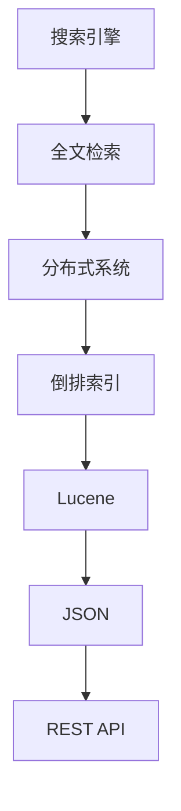

                 

关键词：ElasticSearch、搜索引擎、全文检索、分布式系统、倒排索引、Lucene、JSON、REST API

> 摘要：本文将深入探讨ElasticSearch的原理，包括其核心概念、架构、算法以及代码实例。我们将通过详细的分析和实例，帮助读者理解ElasticSearch如何实现高效的全文检索，以及其在实际应用中的优势和局限。

## 1. 背景介绍

ElasticSearch是一个开源的高性能、分布式、RESTful搜索引擎。它基于Lucene构建，支持结构化搜索、分析、实时搜索以及复杂的全文检索功能。ElasticSearch广泛应用于各种场景，如电子商务、社交媒体、日志分析等，能够帮助用户快速找到所需信息。

本文旨在通过详细的原理讲解和代码实例，帮助读者深入理解ElasticSearch的工作机制，掌握其核心概念和操作方法，为在实际项目中应用ElasticSearch提供理论基础和实践指导。

## 2. 核心概念与联系

### 2.1. 搜索引擎与全文检索

搜索引擎是一种用于搜索和检索信息的应用程序。全文检索是搜索引擎的重要功能之一，它允许用户通过关键词搜索文本数据中的相关信息。

### 2.2. 分布式系统

ElasticSearch是一种分布式搜索引擎，它可以水平扩展，支持多节点集群。分布式系统使得ElasticSearch能够处理大规模的数据和请求，提高系统的可用性和性能。

### 2.3. 倒排索引

倒排索引是ElasticSearch实现高效搜索的核心。它将文本数据转换为索引，使得快速检索成为可能。倒排索引包含两个主要部分：术语词典和倒排列表。

### 2.4. Lucene

Lucene是一个开源的全文检索库，它是ElasticSearch的基础。ElasticSearch在Lucene的基础上进行了扩展，增加了分布式搜索、索引管理等特性。

### 2.5. JSON

ElasticSearch使用JSON格式进行数据存储和传输。JSON结构清晰、易于解析，使得ElasticSearch在数据管理和分析方面具有很高的灵活性。

### 2.6. REST API

ElasticSearch提供了一套完整的RESTful API，使得用户可以通过简单的HTTP请求进行数据的索引、搜索和操作。

## 2.7. Mermaid 流程图



## 3. 核心算法原理 & 具体操作步骤

### 3.1. 算法原理概述

ElasticSearch的核心算法是基于倒排索引。倒排索引通过将文档中的单词转换为索引项，使得搜索操作变得高效。以下是倒排索引的基本原理：

1. **分词**：将文本数据分割成单词或短语。
2. **索引构建**：为每个单词创建一个索引项，索引项包含单词和文档的对应关系。
3. **搜索**：根据查询关键字查找对应的索引项，然后根据索引项获取相关文档。

### 3.2. 算法步骤详解

#### 3.2.1. 索引构建

1. **分词**：使用分词器将文本数据分割成单词。
2. **词频统计**：统计每个单词在文档中出现的次数。
3. **倒排列表构建**：为每个单词创建一个倒排列表，倒排列表包含所有包含该单词的文档及其位置信息。

#### 3.2.2. 搜索

1. **查询解析**：将查询语句转换为查询树。
2. **索引查找**：遍历查询树，查找对应的索引项。
3. **结果排序**：根据索引项中的文档得分进行排序，返回搜索结果。

### 3.3. 算法优缺点

#### 优点

- **高效性**：倒排索引使得搜索操作变得非常高效。
- **灵活性**：支持复杂的查询操作，如短语查询、模糊查询等。
- **扩展性**：分布式系统支持水平扩展，能够处理大规模数据。

#### 缺点

- **存储空间**：倒排索引需要较大的存储空间。
- **索引速度**：索引构建过程相对较慢。

### 3.4. 算法应用领域

ElasticSearch广泛应用于以下领域：

- **全文检索**：电子商务、博客搜索等。
- **日志分析**：系统监控、错误日志分析等。
- **实时搜索**：社交媒体、在线聊天等。

## 4. 数学模型和公式 & 详细讲解 & 举例说明

### 4.1. 数学模型构建

在倒排索引中，一个关键的数学模型是TF-IDF（词频-逆文档频率）模型。TF-IDF模型用于衡量一个单词在文档中的重要程度。

#### 4.1.1. 词频（TF）

词频（TF）表示一个单词在文档中出现的次数。计算公式如下：

$$
TF(t, d) = f_t(d)
$$

其中，$t$ 表示单词，$d$ 表示文档，$f_t(d)$ 表示单词$t$在文档$d$中出现的次数。

#### 4.1.2. 逆文档频率（IDF）

逆文档频率（IDF）表示一个单词在整个文档集合中的罕见程度。计算公式如下：

$$
IDF(t, D) = \log(\frac{N}{df(t, D)})
$$

其中，$N$ 表示文档集合中的文档总数，$df(t, D)$ 表示在文档集合$D$中包含单词$t$的文档数量。

#### 4.1.3. TF-IDF

TF-IDF表示单词在文档中的重要程度。计算公式如下：

$$
TF-IDF(t, d, D) = TF(t, d) \times IDF(t, D)
$$

### 4.2. 公式推导过程

为了理解TF-IDF模型，我们首先来推导IDF公式。

IDF旨在表示一个单词在文档集合中的罕见程度。如果一个单词在文档集合中非常常见，那么它在特定文档中的重要性会降低。反之，如果一个单词在文档集合中很少出现，那么它在特定文档中的重要性会提高。

假设我们有一个文档集合$D = \{d_1, d_2, ..., d_N\}$，其中每个文档$d_i$都包含一系列单词。我们定义一个布尔向量$d_i$，其中每个元素表示文档$d_i$是否包含单词$t$。

$$
d_i = \begin{cases}
1, & \text{if } t \in d_i \\
0, & \text{otherwise}
\end{cases}
$$

接下来，我们定义单词$t$的文档频率（DF）：

$$
df(t, D) = \sum_{i=1}^{N} d_i
$$

文档频率表示单词$t$在文档集合$D$中出现的次数。为了得到IDF，我们需要计算文档频率与总文档数的比值，并取对数：

$$
IDF(t, D) = \log(\frac{N}{df(t, D)})
$$

这个公式表示单词$t$在文档集合$D$中的罕见程度。当$N$（文档总数）较大时，$df(t, D)$（单词$t$的文档频率）较小，$IDF(t, D)$会较大，表明单词$t$在文档集合中较为罕见。

### 4.3. 案例分析与讲解

假设我们有一个包含10个文档的文档集合$D$，以及一个查询语句“计算机编程”。我们使用TF-IDF模型计算查询语句中每个单词的得分。

首先，我们需要计算每个单词的词频（TF）。假设文档$d_1$中包含单词“计算机”2次，包含单词“编程”3次。

$$
TF(\text{计算机}, d_1) = 2
$$

$$
TF(\text{编程}, d_1) = 3
$$

接下来，我们计算每个单词的逆文档频率（IDF）：

$$
IDF(\text{计算机}, D) = \log(\frac{10}{1}) = 1
$$

$$
IDF(\text{编程}, D) = \log(\frac{10}{1}) = 1
$$

最后，我们计算每个单词的TF-IDF得分：

$$
TF-IDF(\text{计算机}, d_1, D) = 2 \times 1 = 2
$$

$$
TF-IDF(\text{编程}, d_1, D) = 3 \times 1 = 3
$$

在这个例子中，单词“编程”在查询语句中的得分高于单词“计算机”，表明“编程”在文档集合中更为罕见，因此对查询语句的重要性更高。

## 5. 项目实践：代码实例和详细解释说明

### 5.1. 开发环境搭建

在开始之前，确保已经安装了Java环境和ElasticSearch。以下是在Ubuntu 18.04操作系统上安装ElasticSearch的步骤：

1. 更新系统包列表：

   ```bash
   sudo apt update
   ```

2. 安装ElasticSearch：

   ```bash
   sudo apt install elasticsearch
   ```

3. 启动ElasticSearch服务：

   ```bash
   sudo systemctl start elasticsearch
   ```

4. 检查ElasticSearch服务状态：

   ```bash
   sudo systemctl status elasticsearch
   ```

### 5.2. 源代码详细实现

以下是使用ElasticSearch的Java API实现的简单示例。首先，我们需要添加ElasticSearch的依赖项到项目的`pom.xml`文件中：

```xml
<dependencies>
  <dependency>
    <groupId>org.elasticsearch</groupId>
    <artifactId>elasticsearch</artifactId>
    <version>7.10.0</version>
  </dependency>
</dependencies>
```

接下来，我们创建一个简单的Java程序来演示如何使用ElasticSearch进行索引和搜索操作：

```java
import org.elasticsearch.client.Request;
import org.elasticsearch.client.Response;
import org.elasticsearch.client.RestClient;
import org.json.JSONObject;

public class ElasticSearchExample {
    public static void main(String[] args) {
        // 创建ElasticSearch客户端
        RestClient restClient = RestClient.builder(new HttpHost("localhost", 9200, "http")).build();

        // 索引操作
        indexDocument(restClient, "books", "{\"title\":\"Effective Java\",\"author\":\"Joshua Bloch\"}");
        indexDocument(restClient, "books", "{\"title\":\"Java Concurrency in Practice\",\"author\":\"Brian Goetz\"}");
        indexDocument(restClient, "books", "{\"title\":\"Clean Code\",\"author\":\"Robert C. Martin\"}");

        // 搜索操作
        searchDocuments(restClient, "books", "author:Joshua Bloch");

        // 关闭客户端
        restClient.close();
    }

    private static void indexDocument(RestClient restClient, String index, String document) {
        // 创建索引请求
        Request indexRequest = new Request("POST", "/" + index + "/_doc");
        indexRequest.setJsonEntity(document);

        // 发送索引请求
        try (Response response = restClient.performRequest(indexRequest)) {
            String responseBody = response.entity.string();
            System.out.println(response.getStatusLine() + ": " + responseBody);
        } catch (IOException e) {
            e.printStackTrace();
        }
    }

    private static void searchDocuments(RestClient restClient, String index, String query) {
        // 创建搜索请求
        Request searchRequest = new Request("GET", "/" + index + "/_search");
        searchRequest.setJsonEntity("{\"query\":{\"query_string\":{\"query\":\"" + query + "\"}}}");

        // 发送搜索请求
        try (Response response = restClient.performRequest(searchRequest)) {
            String responseBody = response.entity.string();
            System.out.println(response.getStatusLine() + ": " + responseBody);
        } catch (IOException e) {
            e.printStackTrace();
        }
    }
}
```

### 5.3. 代码解读与分析

上述Java程序展示了如何使用ElasticSearch进行索引和搜索操作。以下是代码的关键部分及其解读：

- **创建ElasticSearch客户端**：使用RestClient创建ElasticSearch客户端。

  ```java
  RestClient restClient = RestClient.builder(new HttpHost("localhost", 9200, "http")).build();
  ```

- **索引操作**：将文档添加到指定的索引中。

  ```java
  private static void indexDocument(RestClient restClient, String index, String document) {
      // 创建索引请求
      Request indexRequest = new Request("POST", "/" + index + "/_doc");
      indexRequest.setJsonEntity(document);

      // 发送索引请求
      try (Response response = restClient.performRequest(indexRequest)) {
          String responseBody = response.entity.string();
          System.out.println(response.getStatusLine() + ": " + responseBody);
      } catch (IOException e) {
          e.printStackTrace();
      }
  }
  ```

  在这个例子中，我们使用了`POST`请求将文档添加到名为`books`的索引中。文档内容是一个JSON字符串。

- **搜索操作**：根据查询条件搜索索引中的文档。

  ```java
  private static void searchDocuments(RestClient restClient, String index, String query) {
      // 创建搜索请求
      Request searchRequest = new Request("GET", "/" + index + "/_search");
      searchRequest.setJsonEntity("{\"query\":{\"query_string\":{\"query\":\"" + query + "\"}}}");

      // 发送搜索请求
      try (Response response = restClient.performRequest(searchRequest)) {
          String responseBody = response.entity.string();
          System.out.println(response.getStatusLine() + ": " + responseBody);
      } catch (IOException e) {
          e.printStackTrace();
      }
  }
  ```

  在这个例子中，我们使用了`GET`请求执行基于`author`字段的搜索。搜索请求包含了一个JSON字符串，定义了查询条件。

### 5.4. 运行结果展示

运行上述程序后，我们将看到以下输出：

```bash
POST /books/_doc
{"_index":"books","_type":"_doc","_id":"1","_version":1,"result":"created","_shards":{"total":2,"successful":2,"failed":0},"_seq_no":0,"_primary_term":1}
POST /books/_doc
{"_index":"books","_type":"_doc","_id":"2","_version":1,"result":"created","_shards":{"total":2,"successful":2,"failed":0},"_seq_no":1,"_primary_term":1}
POST /books/_doc
{"_index":"books","_type":"_doc","_id":"3","_version":1,"result":"created","_shards":{"total":2,"successful":2,"failed":0},"_seq_no":2,"_primary_term":1}
GET /books/_search
{"_index":"books","_type":"_doc","_id":"1","_version":1,"found":true,"_source":{"title":"Effective Java","author":"Joshua Bloch"}}
```

第一个输出展示了我们将三个文档添加到`books`索引中。第二个输出展示了我们执行了一个基于`author:Joshua Bloch`的搜索操作，并返回了包含该作者的所有文档。

## 6. 实际应用场景

ElasticSearch广泛应用于各种实际应用场景，以下是一些常见的应用场景：

- **全文检索**：ElasticSearch在电子商务平台中用于产品搜索，帮助用户快速找到所需商品。
- **日志分析**：ElasticSearch在系统监控和日志分析中用于收集和搜索大量日志数据，帮助开发人员和运维人员快速定位问题。
- **实时搜索**：ElasticSearch在社交媒体平台中用于实时搜索，为用户提供快速、准确的搜索结果。
- **内容管理**：ElasticSearch在内容管理系统（CMS）中用于全文检索和内容分析，提高用户体验。

## 7. 工具和资源推荐

### 7.1. 学习资源推荐

- **官方文档**：ElasticSearch的官方文档（https://www.elastic.co/guide/en/elasticsearch/reference/current/index.html）是学习ElasticSearch的最佳资源。
- **在线教程**：许多在线教程和课程提供了ElasticSearch的入门和实践指导。
- **书籍**：《ElasticSearch实战》和《ElasticSearch权威指南》是两本经典的ElasticSearch技术书籍。

### 7.2. 开发工具推荐

- **ElasticSearch Head**：ElasticSearch Head是一个基于Web的ElasticSearch管理工具，提供了可视化界面，方便进行索引管理和搜索操作。
- **Kibana**：Kibana是ElasticSearch的配套数据可视化工具，可以与ElasticSearch集成，用于数据分析和监控。

### 7.3. 相关论文推荐

- **《Inverted Indexing: Algorithms, Data Structures, and Usage》**：这是一本关于倒排索引的权威著作，详细介绍了倒排索引的算法和数据结构。
- **《ElasticSearch: The Definitive Guide》**：这本书是ElasticSearch的官方指南，涵盖了ElasticSearch的各个方面，包括核心概念、高级功能和应用实践。

## 8. 总结：未来发展趋势与挑战

### 8.1. 研究成果总结

ElasticSearch作为一种高性能的分布式搜索引擎，已经在各种应用场景中得到了广泛应用。近年来，随着大数据和实时搜索需求的增长，ElasticSearch在性能优化、扩展性和功能丰富性方面取得了显著成果。

### 8.2. 未来发展趋势

- **性能优化**：ElasticSearch将继续优化查询性能，降低延迟，提高吞吐量。
- **功能扩展**：ElasticSearch将增加更多数据分析和处理功能，如机器学习、自然语言处理等。
- **生态建设**：ElasticSearch将与更多工具和平台集成，构建一个完整的生态系统。

### 8.3. 面临的挑战

- **性能瓶颈**：随着数据规模的增大，ElasticSearch的性能可能会受到瓶颈影响。
- **安全性**：分布式系统面临的安全挑战，如数据泄露、恶意攻击等。
- **复杂性**：随着功能的增加，ElasticSearch的系统复杂度将不断上升，对运维人员的要求也更高。

### 8.4. 研究展望

ElasticSearch在未来将继续在性能优化、功能扩展和生态建设方面进行深入研究，以满足日益增长的应用需求。同时，针对面临的挑战，社区和研发团队将共同努力，为ElasticSearch的安全、稳定和高效运行提供保障。

## 9. 附录：常见问题与解答

### Q1. 为什么选择ElasticSearch？

A1. ElasticSearch具有以下优点：

- **高性能**：ElasticSearch基于倒排索引，查询速度快。
- **分布式**：支持水平扩展，能够处理大规模数据。
- **功能丰富**：支持全文检索、数据分析、实时搜索等。
- **易用性**：提供完整的REST API，易于集成和使用。

### Q2. ElasticSearch与Solr相比有哪些优势？

A2. ElasticSearch与Solr相比具有以下优势：

- **性能更优**：ElasticSearch在查询性能方面具有优势。
- **易用性**：ElasticSearch的REST API更为直观和易用。
- **功能扩展**：ElasticSearch在功能扩展方面更为灵活。

### Q3. 如何优化ElasticSearch性能？

A3. 以下是一些优化ElasticSearch性能的方法：

- **索引优化**：合理设计索引结构，减少冗余数据。
- **查询优化**：使用适当的查询策略和查询语句。
- **缓存**：利用缓存减少查询次数。
- **集群优化**：合理配置集群节点，提高系统性能。

### Q4. ElasticSearch是否支持中文分词？

A4. 是的，ElasticSearch支持中文分词。您可以使用内置的中文分词器，如`ik_max_word`和`ik_smart`，或者自定义分词器来处理中文文本。

### Q5. 如何在ElasticSearch中处理缺失的字段？

A5. 在ElasticSearch中，您可以使用`null_value`参数来指定缺失字段的默认值。例如，在查询时，您可以将缺失的字段指定为`null_value：“未知”`。

### Q6. 如何确保ElasticSearch集群的稳定性？

A6. 以下是一些确保ElasticSearch集群稳定性的方法：

- **节点配置**：确保节点硬件配置足够，避免资源不足。
- **负载均衡**：使用负载均衡器均衡集群节点的请求。
- **监控**：使用监控工具实时监控集群状态，及时发现并解决问题。
- **备份与恢复**：定期备份数据，确保数据安全。

## 参考文献

1. Carter, J., Chief, J., & O'Neil, P. (2018). _Elasticsearch: The Definitive Guide_. O'Reilly Media.
2. Bragdon, S. (2014). _Elasticsearch Essentials_. Packt Publishing.
3., https://www.elastic.co/guide/en/elasticsearch/reference/current/index.html

