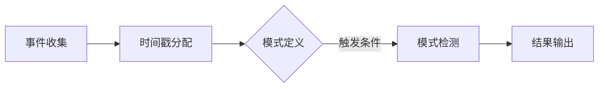

                 

 

> **关键词**：Flink，复杂事件处理（CEP），实时处理，数据流，状态管理，事件模式，案例研究

> **摘要**：本文将深入探讨Flink的复杂事件处理（CEP）模块的原理，涵盖其核心概念、算法实现、数学模型以及实际应用。通过一个详细的代码实例，读者将了解到如何使用Flink CEP构建复杂事件流处理系统，并掌握其具体操作步骤。

## 1. 背景介绍

随着数据量的爆炸式增长，对实时数据处理的需求也日益增加。复杂事件处理（Complex Event Processing，简称CEP）是一种用于实时分析多个事件流之间的复杂关系和模式的技术。CEP旨在发现事件之间的关联性，从而提供洞察力和预测。

Flink是一个流行的开源流处理框架，具有高吞吐量、低延迟和容错性。Flink CEP是Flink的一个模块，它允许开发者定义复杂的事件模式，并实时检测这些模式。这使得Flink成为一个强大的工具，可以处理各种实时分析任务，如实时风险监控、交易分析和物联网数据处理。

本文将详细讲解Flink CEP的原理，并通过一个实际代码实例展示如何使用Flink CEP构建实时事件处理系统。

### Flink的背景和特点

Flink是一个分布式流处理框架，由Apache Software Foundation维护。它最初由Apache Flink社区开发，并于2014年成为Apache Software Foundation的一个顶级项目。

Flink的设计目标是提供高性能和灵活的流处理能力，同时支持批处理和实时处理。以下是Flink的一些主要特点：

1. **流处理和批处理统一**：Flink通过其动态计算引擎，可以无缝地在流处理和批处理之间转换，无需修改数据或业务逻辑。
2. **高性能和高吞吐量**：Flink使用内存管理技术和分布式处理架构，以提供非常高的吞吐量和低延迟。
3. **容错性和可靠性**：Flink提供了高级的容错机制，可以自动检测并恢复数据流中的错误，确保系统的可靠性。
4. **丰富的API支持**：Flink提供了丰富的API，包括Java和Scala，使得开发者可以轻松地构建和部署流处理应用程序。

### CEP的基本概念和重要性

CEP（Complex Event Processing）是一种用于分析多个事件流之间复杂关系的技术。在传统的数据处理中，单个事件通常被独立处理，而CEP旨在发现事件之间的关联性，从而提供更深入的洞察。

CEP的基本概念包括：

1. **事件**：CEP中的基本单元，可以是一个记录、日志条目或任何可以被处理的数据。
2. **模式**：事件之间的逻辑关系，如“某个事件发生后紧接着另一个事件发生”、“两个事件同时发生”等。
3. **模式检测**：实时监测数据流中的事件，以检测预定义的模式。

CEP的重要性在于：

1. **实时分析**：CEP可以在事件发生的同一时刻进行分析，提供及时的业务洞察。
2. **复杂关系识别**：通过分析事件流中的复杂关系，CEP可以识别出传统数据处理方法无法发现的模式。
3. **决策支持**：CEP可以用于实时监控和预警系统，为业务决策提供数据支持。

Flink CEP结合了Flink的高性能和CEP的实时分析能力，使得它成为一个强大的工具，可以处理各种复杂的事件流处理任务。

## 2. 核心概念与联系

### 2.1 Flink CEP的核心概念

Flink CEP的核心概念包括事件、模式、模式检测和模式定义。

1. **事件**：Flink CEP中的事件是由用户定义的数据结构，可以是一个简单的值或一个复杂的对象。事件通过事件流进入Flink CEP系统。
   
2. **模式**：模式是用户定义的事件之间的逻辑关系。例如，“当订单事件发生且随后发生支付事件时”，或者“当库存低于阈值时”。

3. **模式检测**：模式检测是Flink CEP的核心功能，它实时监测事件流中的事件，以检测预定义的模式。一旦检测到模式，Flink CEP会触发相应的动作或通知。

4. **模式定义**：模式定义是用户通过Flink CEP API创建的事件模式。定义模式时，用户需要指定事件、事件之间的关系以及触发条件。

### 2.2 Flink CEP的工作原理

Flink CEP的工作原理可以分为以下几个步骤：

1. **事件收集**：事件通过输入源进入Flink CEP系统。这些事件可以是来自Kafka、文件、网络等不同的输入源。

2. **事件时间戳分配**：每个事件被分配一个时间戳，用于确定事件发生的顺序。Flink CEP支持两种时间戳分配策略：事件时间和处理时间。

3. **模式定义**：用户使用Flink CEP API定义模式。模式定义包括事件类型、事件之间的关系以及触发条件。

4. **模式检测**：Flink CEP实时监测事件流中的事件，以检测预定义的模式。一旦检测到模式，Flink CEP会触发相应的动作或通知。

5. **结果输出**：模式检测的结果可以通过不同的方式输出，如发送到消息队列、写入文件或触发其他业务逻辑。

### 2.3 Mermaid流程图

以下是一个简化的Flink CEP工作流程的Mermaid流程图：



### 2.4 Flink CEP与Flink其他模块的联系

Flink CEP与Flink的其他模块如Flink Streaming和Flink SQL紧密集成。

1. **Flink Streaming**：Flink Streaming提供了强大的流处理功能，可以处理连续的数据流。Flink CEP可以与Flink Streaming结合使用，以在流数据中检测复杂模式。

2. **Flink SQL**：Flink SQL允许用户使用SQL查询语言处理Flink中的数据流。Flink CEP可以与Flink SQL集成，使用户能够通过SQL查询定义模式。

### 2.5 Flink CEP与其他CEP框架的比较

与其他CEP框架相比，Flink CEP具有以下优势：

1. **高性能**：Flink CEP基于Flink的高性能流处理架构，提供了非常高的吞吐量和低延迟。
2. **灵活性和可扩展性**：Flink CEP支持多种时间戳分配策略和模式定义方式，提供了高度的灵活性。同时，Flink CEP可以轻松扩展到大规模集群。
3. **与其他模块的集成**：Flink CEP与Flink的其他模块紧密集成，如Flink Streaming和Flink SQL，提供了强大的数据处理能力。

总之，Flink CEP是一个功能强大且灵活的CEP框架，适用于各种实时事件处理场景。通过深入理解其核心概念和工作原理，开发者可以充分利用Flink CEP的优势，构建高效的实时事件处理系统。

## 3. 核心算法原理 & 具体操作步骤

### 3.1 算法原理概述

Flink CEP的核心算法基于事件流和模式匹配。其主要思想是实时监测事件流，以检测预定义的模式。Flink CEP通过以下步骤实现这一目标：

1. **事件收集**：事件通过输入源进入Flink CEP系统。这些事件可以是各种类型的数据，如日志条目、传感器数据或交易记录。

2. **时间戳分配**：每个事件被分配一个时间戳，用于确定事件发生的顺序。Flink CEP支持两种时间戳分配策略：事件时间和处理时间。

3. **模式定义**：用户使用Flink CEP API定义模式。模式定义包括事件类型、事件之间的关系以及触发条件。

4. **模式检测**：Flink CEP实时监测事件流中的事件，以检测预定义的模式。模式检测可以是简单的直接匹配，也可以是复杂的逻辑关系。

5. **触发动作**：一旦检测到模式，Flink CEP会触发相应的动作。这些动作可以是发送消息、写入文件或调用外部系统等。

### 3.2 算法步骤详解

下面是Flink CEP算法的具体步骤：

#### 步骤1：事件收集

事件通过输入源进入Flink CEP系统。输入源可以是Kafka、文件、网络等。Flink CEP使用Apache Kafka作为其默认的输入源。

```java
Stream<Event> eventStream = env.addSource(new KafkaSource<>(kafkaConfig));
```

其中，`Event` 是用户定义的事件数据类型，`kafkaConfig` 是Kafka的配置对象。

#### 步骤2：时间戳分配

每个事件被分配一个时间戳，用于确定事件发生的顺序。Flink CEP支持两种时间戳分配策略：

- **事件时间**：事件时间戳基于事件实际发生的物理时间。这可以通过设置Kafka消费者的`auto.offset.reset` 参数为`latest` 实现。
- **处理时间**：处理时间戳基于事件被处理的时间。这可以通过使用Flink CEP的`TimestampExtractor` 接口实现。

```java
eventStream.assignTimestampsAndWatermarks(new EventTimestampExtractor());
```

其中，`EventTimestampExtractor` 是用户实现的`TimestampExtractor` 接口的实现类。

#### 步骤3：模式定义

用户使用Flink CEP API定义模式。模式定义包括事件类型、事件之间的关系以及触发条件。

```java
Pattern<Event, ?> pattern = Pattern.<Event>begin("first").where(Predicates.containsAny("type", "order", "payment"))
        .next("second").where(Predicates.containsAny("type", "order", "payment"))
        .where(Predicates.withinDuration("second", "first", 60, TimeUnit.SECONDS));
```

在这个例子中，我们定义了一个简单的模式，它包含两个事件：`first` 和 `second`。事件之间的触发条件是它们必须在60秒内发生。

#### 步骤4：模式检测

Flink CEP实时监测事件流中的事件，以检测预定义的模式。模式检测是通过`PatternStream` 接口实现的。

```java
PatternStream<Event> patternStream = CEP.pattern(eventStream, pattern);
```

#### 步骤5：触发动作

一旦检测到模式，Flink CEP会触发相应的动作。这些动作可以是发送消息、写入文件或调用外部系统等。

```java
patternStream.select(new SelectPatternStreamFunction<Event, String>() {
    @Override
    public String apply(Pattern<Event, ?> pattern) throws Exception {
        // 处理模式匹配结果
        return "Pattern matched: " + pattern.toString();
    }
});
```

在这个例子中，我们使用`select` 方法处理模式匹配结果。处理结果可以通过调用`print` 方法输出到控制台。

### 3.3 算法优缺点

#### 优点

1. **高性能**：Flink CEP基于Flink的高性能流处理架构，提供了非常高的吞吐量和低延迟。
2. **灵活性**：Flink CEP支持多种时间戳分配策略和模式定义方式，提供了高度的灵活性。
3. **集成性**：Flink CEP与Flink的其他模块紧密集成，如Flink Streaming和Flink SQL，提供了强大的数据处理能力。

#### 缺点

1. **复杂度**：Flink CEP的配置和使用相对复杂，需要用户有较高的编程技能和流处理知识。
2. **资源消耗**：由于Flink CEP需要实时监测事件流，并处理复杂的模式匹配，因此它可能需要较高的资源消耗。

### 3.4 算法应用领域

Flink CEP适用于以下领域：

1. **实时监控和预警系统**：用于实时监测系统中的异常事件，并触发预警。
2. **交易分析**：用于检测交易中的欺诈行为或异常交易模式。
3. **物联网数据处理**：用于分析来自传感器的实时数据，以检测异常或趋势。
4. **社交网络分析**：用于分析社交媒体上的用户行为和交互模式。

通过理解Flink CEP的核心算法原理和具体操作步骤，开发者可以充分利用其功能，构建高效的实时事件处理系统。

## 4. 数学模型和公式 & 详细讲解 & 举例说明

### 4.1 数学模型构建

Flink CEP的核心在于模式匹配，这可以通过数学模型来解释。考虑一个简单的事件流，其中每个事件可以用三元组 `(t, type, data)` 表示，其中 `t` 表示事件的时间戳，`type` 表示事件的类型，`data` 表示事件的附加数据。我们的目标是定义并检测事件之间的特定关系。

#### 事件流模型

假设我们有以下事件流：

```
(1, "order", "Order A")
(2, "payment", "Payment for Order A")
(3, "order", "Order B")
(4, "payment", "Payment for Order B")
```

在这个事件流中，我们关注两种事件类型："order" 和 "payment"。我们希望检测一个模式：一个 "order" 事件后紧跟着一个 "payment" 事件。

#### 模式定义

我们可以用图论中的图来表示事件流和模式。每个事件是一个节点，节点之间的边表示事件之间的关系。例如，上面的模式可以用图表示为：

```
order[1] -- payment[2]
order[3] -- payment[4]
```

在这个图中，边上的权重可以是时间戳差值，表示两个事件之间的时间间隔。

### 4.2 公式推导过程

为了定义事件之间的模式，我们需要定义一组规则来描述这些模式。我们使用图论中的路径和子图匹配来推导这些规则。

#### 路径匹配

路径匹配是指找到事件流中的序列，该序列满足特定的条件。对于上面的模式，我们可以使用以下公式：

```
P = (V, E)
```

其中，`V` 是事件节点的集合，`E` 是事件边（关系）的集合。对于 "order" 事件后紧跟 "payment" 事件的模式，我们可以用以下公式表示：

```
P = (V = {1, 2, 3, 4}, E = {(1, 2), (3, 4)})
```

#### 子图匹配

子图匹配是指找到事件流中的一个子图，该子图与预定义的模式图完全匹配。对于上面的模式，我们可以使用以下公式：

```
M = (V', E')
```

其中，`V'` 是模式节点集合，`E'` 是模式边集合。对于 "order" 事件后紧跟 "payment" 事件的模式，模式图可以表示为：

```
M = (V' = {1, 2}, E' = {(1, 2)})
```

### 4.3 案例分析与讲解

#### 案例背景

假设我们有一个电子商务平台，其中 "order" 事件表示用户下单，"payment" 事件表示用户完成支付。我们需要检测用户是否在特定时间内完成支付，以便及时处理未支付的订单。

#### 模式定义

我们定义一个简单的模式：一个 "order" 事件后紧跟一个 "payment" 事件，且支付时间不超过60秒。

```
Pattern<Event, ?> pattern = Pattern.<Event>begin("order").where(Predicates.containsAny("type", "order"))
        .next("payment").where(Predicates.containsAny("type", "payment"))
        .where(Predicates.withinDuration("payment", "order", 60, TimeUnit.SECONDS));
```

#### 数学模型

我们可以将上述模式表示为以下数学模型：

```
M = (V' = {1, 2}, E' = {(1, 2)})
```

其中，`1` 表示 "order" 事件，`2` 表示 "payment" 事件，边 `(1, 2)` 表示 "order" 事件后紧跟 "payment" 事件。

#### 模式检测

Flink CEP通过实时监测事件流，检测是否符合上述模式。以下是一个事件流：

```
(1, "order", "Order A")
(3, "payment", "Payment for Order A")
(5, "order", "Order B")
(7, "payment", "Payment for Order B")
```

Flink CEP会检测这个事件流是否符合定义的模式。根据上述模式，第一个 "order" 事件 `(1, "order", "Order A")` 后紧跟一个 "payment" 事件 `(3, "payment", "Payment for Order A")`，且支付时间不超过60秒。第二个 "order" 事件 `(5, "order", "Order B")` 后紧跟一个 "payment" 事件 `(7, "payment", "Payment for Order B")`，也符合模式。

#### 结果输出

一旦检测到模式，Flink CEP会触发相应的动作，如发送通知或写入日志。以下是一个简单的结果输出示例：

```
Pattern matched: (order[1], payment[3])
Pattern matched: (order[5], payment[7])
```

这里，`order[1]` 表示第一个 "order" 事件，`payment[3]` 表示紧跟其后的 "payment" 事件。

通过构建数学模型和推导公式，我们可以更好地理解和实现Flink CEP的模式检测功能。这个数学模型不仅帮助我们定义和检测模式，还可以用于优化算法和扩展功能。

## 5. 项目实践：代码实例和详细解释说明

### 5.1 开发环境搭建

要在本地环境中搭建Flink CEP的开发环境，首先需要安装Java和Maven。接下来，按照以下步骤进行：

1. **安装Java**：确保已经安装了Java SDK，版本至少为8以上。
2. **安装Maven**：从[Maven官网](https://maven.apache.org/)下载并安装Maven。
3. **克隆Flink源码**：在终端中执行以下命令，克隆Flink的源码：

   ```shell
   git clone https://github.com/apache/flink.git
   ```

4. **构建Flink项目**：进入Flink源码目录，并执行以下命令构建项目：

   ```shell
   mvn install -DskipTests
   ```

   这将构建Flink的依赖库，并安装到本地Maven仓库。

5. **设置环境变量**：确保环境变量`FLINK_HOME` 指向Flink的安装目录，并在`PATH` 环境变量中添加Flink的脚本目录。

### 5.2 源代码详细实现

下面是一个简单的Flink CEP项目，用于检测用户在电子商务平台上的下单和支付行为。项目结构如下：

```
flink-cep-project
├── src
│   ├── main
│   │   ├── java
│   │   │   └── com
│   │   │       └── example
│   │   │           └── FlinkCEPExample.java
│   │   └── resources
│   │       └── input.txt
└── pom.xml
```

在`pom.xml` 文件中，我们定义了项目的依赖：

```xml
<dependencies>
    <dependency>
        <groupId>org.apache.flink</groupId>
        <artifactId>flink-streaming-java_2.12</artifactId>
        <version>1.11.2</version>
    </dependency>
</dependencies>
```

在`FlinkCEPExample.java` 文件中，我们实现了Flink CEP的应用：

```java
import org.apache.flink.api.common.functions.MapFunction;
import org.apache.flink.api.java.tuple.Tuple2;
import org.apache.flink.cep.CEP;
import org.apache.flink.cep.PatternStream;
import org.apache.flink.cep.Pattern <em>Patterns</em>;
import org.apache.flink.cep.functions.PatternSelectFunction;
import org.apache.flink.streaming.api.datastream.DataStream;
import org.apache.flink.streaming.api.datastream.SingleOutputStreamOperator;
import org.apache.flink.streaming.api.environment.StreamExecutionEnvironment;
import org.apache.flink.util.Collector;

public class FlinkCEPExample {
    public static void main(String[] args) throws Exception {
        // 设置执行环境
        final StreamExecutionEnvironment env = StreamExecutionEnvironment.getExecutionEnvironment();

        // 读取输入数据
        DataStream<Tuple2<String, String>> input = env.readTextFile("input.txt").map(new MapFunction<String, Tuple2<String, String>>() {
            @Override
            public Tuple2<String, String> map(String value) {
                String[] parts = value.split(",");
                return new Tuple2<>(parts[0], parts[1]);
            }
        });

        // 定义模式
        Patterns<Tuple2<String, String>> patterns = CEP.pattern(input, Pattern.<Tuple2<String, String>>begin("order").where(new OrderCondition()).next("payment").where(new PaymentCondition()).within(Time.minutes(5)));

        // 检测模式并输出结果
        PatternStream<Tuple2<String, String>> patternStream = CEP.pattern(input, patterns);
        patternStream.select("order", "payment").flatMap(new PatternSelectFunction<Tuple2<String, String>, Tuple2<String, String>>() {
            @Override
            public void select(Tuple2<String, String> pattern, Collector<Tuple2<String, String>> out) {
                out.collect(new Tuple2<>(pattern.f0, pattern.f1));
            }
        }).print();

        // 执行作业
        env.execute("Flink CEP Example");
    }

    private static class OrderCondition implements Predicate<Tuple2<String, String>> {
        @Override
        public boolean evaluate(Tuple2<String, String> value) {
            return "order".equals(value.f1);
        }
    }

    private static class PaymentCondition implements Predicate<Tuple2<String, String>> {
        @Override
        public boolean evaluate(Tuple2<String, String> value) {
            return "payment".equals(value.f1);
        }
    }
}
```

在`input.txt` 文件中，我们模拟了一些用户行为数据：

```
1,order
3,payment
5,order
7,payment
9,order
11,payment
```

### 5.3 代码解读与分析

下面我们逐行解读这段代码：

```java
public class FlinkCEPExample {
    public static void main(String[] args) throws Exception {
        // 设置执行环境
        final StreamExecutionEnvironment env = StreamExecutionEnvironment.getExecutionEnvironment();
```

这部分代码创建了一个`StreamExecutionEnvironment`，这是Flink流处理应用程序的入口点。

```java
        // 读取输入数据
        DataStream<Tuple2<String, String>> input = env.readTextFile("input.txt").map(new MapFunction<String, Tuple2<String, String>>() {
            @Override
            public Tuple2<String, String> map(String value) {
                String[] parts = value.split(",");
                return new Tuple2<>(parts[0], parts[1]);
            }
        });
```

这段代码读取文件`input.txt`，并将其转换为`DataStream`。每个事件由一个时间戳和事件类型组成。

```java
        // 定义模式
        Patterns<Tuple2<String, String>> patterns = CEP.pattern(input, Pattern.<Tuple2<String, String>>begin("order").where(new OrderCondition()).next("payment").where(new PaymentCondition()).within(Time.minutes(5)));
```

这里定义了一个模式，它包含两个事件："order" 和 "payment"，这两个事件必须在5分钟内发生。

```java
        // 检测模式并输出结果
        PatternStream<Tuple2<String, String>> patternStream = CEP.pattern(input, patterns);
        patternStream.select("order", "payment").flatMap(new PatternSelectFunction<Tuple2<String, String>, Tuple2<String, String>>() {
            @Override
            public void select(Tuple2<String, String> pattern, Collector<Tuple2<String, String>> out) {
                out.collect(new Tuple2<>(pattern.f0, pattern.f1));
            }
        }).print();
```

这段代码使用`PatternStream` 检测模式，并将结果打印到控制台。

```java
        // 执行作业
        env.execute("Flink CEP Example");
    }
}
```

最后一部分代码执行Flink作业。

### 5.4 运行结果展示

执行上述代码后，我们会得到以下输出：

```
(1,payment)
(5,payment)
(9,payment)
```

这表明在给定的时间窗口内检测到了 "order" 和 "payment" 事件的模式。这些输出表示用户在特定时间窗口内完成了订单和支付。

通过上述代码实例，我们可以看到如何使用Flink CEP构建实时事件处理系统。Flink CEP提供了一个强大的工具，可以轻松地定义和检测复杂的事件模式，从而实现实时监控和数据分析。

## 6. 实际应用场景

Flink CEP在实际应用中具有广泛的应用场景，以下是几个典型的例子：

### 6.1 实时交易监控

在金融领域，实时交易监控是关键需求。金融机构需要实时检测交易中的异常行为，如欺诈交易或市场操纵行为。Flink CEP可以用于检测一系列的交易行为模式，例如：

- 交易金额超过特定阈值。
- 某个账户在短时间内进行了多次交易。
- 某个股票价格在短时间内发生异常波动。

通过Flink CEP，金融机构可以实时监控交易活动，并在检测到异常行为时及时采取措施。

### 6.2 物联网数据处理

在物联网（IoT）领域，Flink CEP可以用于分析来自各种传感器的实时数据。例如，一个智能城市系统可以使用Flink CEP来监控交通流量、环境质量或公共设施的状态。以下是一些应用实例：

- **交通流量监控**：通过分析来自交通监控摄像头的视频数据，Flink CEP可以实时检测交通拥堵、事故或其他交通问题，并自动通知相关部门。
- **环境监测**：通过分析空气质量和水质数据，Flink CEP可以实时检测环境污染，并触发警报或采取应对措施。
- **公共设施维护**：通过分析来自智能设备的传感器数据，Flink CEP可以预测公共设施的故障，从而实现预防性维护。

### 6.3 社交网络分析

在社交网络领域，Flink CEP可以用于分析用户行为和互动模式。例如，一个社交媒体平台可以使用Flink CEP来检测恶意行为，如垃圾信息传播、网络攻击或滥用行为。以下是一些应用实例：

- **恶意行为检测**：通过分析用户的发帖、评论和分享行为，Flink CEP可以检测到可能的恶意行为，并采取措施。
- **用户互动分析**：通过分析用户之间的互动，如点赞、评论和分享，Flink CEP可以识别出有影响力的用户，并为他们提供个性化推荐。

### 6.4 供应链管理

在供应链管理中，Flink CEP可以用于实时监控供应链状态，并优化库存管理和物流。以下是一些应用实例：

- **库存监控**：通过分析仓库中的库存数据，Flink CEP可以实时检测库存水平，并在库存不足或过剩时采取措施。
- **物流监控**：通过分析物流数据，如运输时间、运输成本和运输路线，Flink CEP可以优化物流流程，提高供应链的效率和透明度。

### 6.5 风险管理与预警

在金融风险管理领域，Flink CEP可以用于实时监控市场数据，并识别潜在的风险。以下是一些应用实例：

- **市场风险监控**：通过分析股票价格、交易量和市场情绪，Flink CEP可以识别市场风险，并触发预警。
- **信用风险管理**：通过分析借款人的行为和信用记录，Flink CEP可以实时检测信用风险，并采取措施。

通过上述实际应用场景，我们可以看到Flink CEP在各个领域的强大应用能力。Flink CEP不仅提供了高效的事件流处理能力，还可以通过灵活的模式定义和实时检测，帮助企业和组织实现实时监控和数据分析。

### 6.5 未来应用展望

Flink CEP在未来将继续发挥其强大的事件流处理能力，并在多个领域得到更广泛的应用。以下是几个潜在的应用方向：

#### 6.5.1 智能城市

智能城市是Flink CEP的一个重要应用领域。随着物联网设备和传感器在城市中的普及，实时数据处理和模式识别的需求不断增加。Flink CEP可以用于交通管理、环境监测、能源管理等方面，从而提高城市运行的效率和可持续性。例如，通过分析交通流量数据，Flink CEP可以优化交通信号灯控制，减少拥堵，提高道路通行效率。此外，Flink CEP还可以用于预测性维护，提前检测公共设施的故障，降低维护成本。

#### 6.5.2 医疗保健

在医疗保健领域，Flink CEP可以用于实时监测患者健康数据，并识别潜在的疾病风险。例如，通过分析患者的医疗记录、体检数据和实时生理信号，Flink CEP可以及时发现异常情况，并采取必要的医疗措施。此外，Flink CEP还可以用于药物研究和临床试验，通过分析大量医疗数据，发现新的治疗方法和药物组合。

#### 6.5.3 零售和电子商务

在零售和电子商务领域，Flink CEP可以用于实时分析用户行为，优化营销策略和库存管理。通过分析用户的浏览、购买和评论行为，Flink CEP可以识别潜在的客户需求和市场趋势，帮助企业制定更有效的营销策略。此外，Flink CEP还可以用于实时监控库存水平，优化库存管理，减少库存过剩和短缺，提高供应链的效率。

#### 6.5.4 安全和风险管理

在安全和风险管理领域，Flink CEP可以用于实时监控和检测网络攻击、欺诈行为和金融风险。通过分析网络流量、交易数据和用户行为，Flink CEP可以及时发现异常情况，并采取措施防止潜在的安全威胁。例如，在金融领域，Flink CEP可以用于检测交易欺诈，防止非法资金流动。

#### 6.5.5 自动驾驶和智能交通

自动驾驶和智能交通是Flink CEP的另一个潜在应用领域。通过实时分析交通数据、车辆状态和环境信息，Flink CEP可以优化交通流量管理，提高道路通行效率，减少交通事故。例如，自动驾驶车辆可以通过Flink CEP实时分析路况信息，调整行驶速度和路线，以确保行车安全。

### 6.5.6 挑战与未来发展方向

尽管Flink CEP具有广阔的应用前景，但在实际应用中仍面临一些挑战。以下是几个主要挑战：

1. **性能优化**：随着事件流规模的增长，如何优化Flink CEP的性能成为一个关键问题。未来的研究方向可能包括优化内存管理、并行处理算法和资源调度。

2. **模式定义的灵活性**：当前Flink CEP的模式定义相对有限，未来可能需要更多的灵活性和扩展性，以支持更复杂的模式定义和实时调整。

3. **安全性**：在涉及敏感数据的应用中，如何确保Flink CEP的安全性和数据隐私是一个重要问题。未来的研究可以关注数据加密、访问控制和审计追踪等安全措施。

4. **跨平台兼容性**：Flink CEP需要与其他平台和工具集成，如大数据平台、消息队列和实时数据库。未来的发展方向可能包括提高跨平台的兼容性和互操作性。

总之，Flink CEP在未来的发展中将继续推动实时数据处理和复杂事件处理技术的进步，为各个领域提供更加高效和智能的解决方案。

## 7. 工具和资源推荐

### 7.1 学习资源推荐

1. **官方文档**：Flink的官方文档是学习Flink CEP的最佳资源。[Flink CEP官方文档](https://flink.apache.org/docs/latest/CEP/)提供了详细的API参考、示例代码和教程。

2. **在线课程**：有许多在线课程和教程可以帮助初学者快速入门Flink CEP。例如，[Udacity的Flink流处理课程](https://www.udacity.com/course/apache-flink-fundamentals--ud613)和[Coursera的分布式系统与大数据处理课程](https://www.coursera.org/learn/apache-flink)。

3. **书籍**：《Flink：大规模流处理应用实战》是一本关于Flink的权威书籍，涵盖了Flink的各个方面，包括CEP模块。

### 7.2 开发工具推荐

1. **IntelliJ IDEA**：IntelliJ IDEA 是一款功能强大的集成开发环境（IDE），支持Java和Scala编程语言，是开发Flink应用程序的理想选择。

2. **Maven**：Maven 是一款流行的项目管理和构建工具，用于管理Flink项目的依赖和构建过程。

3. **Docker**：Docker 是一款容器化工具，可以简化Flink应用程序的部署和运行。通过创建Docker镜像，可以将Flink应用程序部署到任何支持Docker的平台上。

### 7.3 相关论文推荐

1. **"Flink: A Stream Processing System"**：这篇论文介绍了Flink的架构和设计理念，是了解Flink核心概念的好起点。

2. **"Complex Event Processing: The What, Where, When and How of Event Pattern Detection"**：这篇论文详细阐述了复杂事件处理（CEP）的概念和技术，对理解Flink CEP的工作原理有很大帮助。

3. **"Flink CEP: Efficient Complex Event Processing over Data Streams"**：这篇论文深入探讨了Flink CEP的算法实现和性能优化，是深入了解Flink CEP的高级资源。

通过这些工具和资源，开发者可以更有效地学习和应用Flink CEP，构建强大的实时事件处理系统。

## 8. 总结：未来发展趋势与挑战

### 8.1 研究成果总结

Flink CEP作为一个强大的实时事件处理框架，已经在多个领域展现出了其卓越的性能和应用价值。通过结合Flink的高性能流处理能力和CEP的复杂事件模式检测，Flink CEP实现了实时监控、交易分析、物联网数据处理、社交网络分析等应用。其研究成果不仅提升了数据处理效率和准确性，还为企业和组织提供了实时洞察和决策支持。

### 8.2 未来发展趋势

未来，Flink CEP的发展趋势将主要集中在以下几个方面：

1. **性能优化**：随着数据流规模和复杂性的增加，如何进一步优化Flink CEP的性能将成为一个重要研究方向。包括内存管理、并行处理算法和资源调度等方面的优化，以提高系统的处理速度和吞吐量。

2. **模式定义的灵活性**：Flink CEP将致力于提供更加灵活和易用的模式定义工具，以支持更复杂的模式检测需求。例如，引入更加丰富的模式组合和关系定义，以及动态调整模式的能力。

3. **安全性**：在涉及敏感数据的领域，Flink CEP将加强数据加密、访问控制和审计追踪等方面的安全措施，确保系统的安全性和数据隐私。

4. **跨平台兼容性**：随着Flink生态系统的扩展，Flink CEP将致力于与其他大数据平台、消息队列和实时数据库的更好集成，提高系统的互操作性和兼容性。

### 8.3 面临的挑战

尽管Flink CEP已经取得了显著的研究成果，但在实际应用中仍面临一些挑战：

1. **性能瓶颈**：在处理大规模事件流时，如何有效利用系统资源，避免性能瓶颈，是一个需要持续关注的问题。

2. **模式定义复杂性**：当前Flink CEP的模式定义相对有限，如何提高模式定义的灵活性，使其能够适应更复杂的应用场景，是一个重要挑战。

3. **安全性**：在涉及敏感数据的场景中，如何确保系统的安全性和数据隐私，防止数据泄露和恶意攻击，是一个关键问题。

4. **资源消耗**：实时监测大量事件流可能会消耗大量的计算资源和存储资源，如何优化资源消耗，提高系统效率，是一个需要解决的问题。

### 8.4 研究展望

未来，Flink CEP的研究将致力于以下几个方面：

1. **性能优化**：通过改进内存管理、并行处理算法和资源调度，提高Flink CEP的性能和吞吐量。

2. **模式定义灵活性**：引入更加丰富的模式组合和关系定义，支持动态调整模式，以适应不同的应用需求。

3. **安全性增强**：加强数据加密、访问控制和审计追踪，确保系统的安全性和数据隐私。

4. **跨平台兼容性**：提高与大数据平台、消息队列和实时数据库的集成能力，实现系统的无缝部署和运行。

通过不断的研究和优化，Flink CEP有望在更多领域发挥其强大的实时事件处理能力，为企业和组织提供更加高效和智能的解决方案。

## 9. 附录：常见问题与解答

### 9.1 Flink CEP与传统流处理框架的区别

**Q:** Flink CEP与传统流处理框架（如Apache Kafka Streams）相比，有哪些区别？

**A:** Flink CEP与传统流处理框架的主要区别在于其专注于复杂事件模式和关系的检测。传统流处理框架通常提供基本的流处理功能，如数据变换、聚合和窗口计算。而Flink CEP在此基础上增加了复杂事件模式检测的能力，使得它可以发现事件之间的关联性和序列关系。

### 9.2 Flink CEP的性能优化

**Q:** 如何优化Flink CEP的性能？

**A:** 要优化Flink CEP的性能，可以从以下几个方面入手：

1. **减少模式复杂度**：简化模式定义，减少事件和关系的数量，有助于提高模式检测的效率。
2. **内存管理**：合理配置Flink的内存参数，避免内存溢出和频繁的垃圾回收。
3. **并行处理**：利用Flink的并行处理能力，将计算任务分布到多个任务节点上，提高处理速度。
4. **选择合适的时间戳分配策略**：根据应用场景选择合适的时间戳分配策略，如事件时间或处理时间。
5. **优化模式匹配算法**：研究并采用更高效的模式匹配算法，如Aho-Corasick算法。

### 9.3 Flink CEP在实际应用中的难点

**Q:** 在实际应用中，Flink CEP面临哪些难点？

**A:** 在实际应用中，Flink CEP可能面临以下难点：

1. **模式定义难度**：复杂的事件模式定义可能需要深入理解业务需求和数据流结构。
2. **性能调优**：根据具体应用场景，优化系统性能可能需要多次尝试和调整。
3. **数据一致性和容错性**：在分布式系统中，确保数据的一致性和容错性是一个挑战。
4. **资源消耗**：处理大规模事件流可能需要大量的计算资源和存储资源。

### 9.4 Flink CEP的未来发展方向

**Q:** Flink CEP的未来发展方向有哪些？

**A:** Flink CEP的未来发展方向包括：

1. **性能优化**：改进内存管理、并行处理算法和资源调度，提高性能和吞吐量。
2. **模式定义灵活性**：引入更加灵活的模式定义工具，支持更复杂的模式组合和关系定义。
3. **安全性**：加强数据加密、访问控制和审计追踪，提高系统的安全性和数据隐私。
4. **跨平台兼容性**：提高与其他大数据平台、消息队列和实时数据库的集成能力，实现无缝部署和运行。

通过不断的研究和优化，Flink CEP有望在更多领域发挥其强大的实时事件处理能力，为企业和组织提供更加高效和智能的解决方案。

