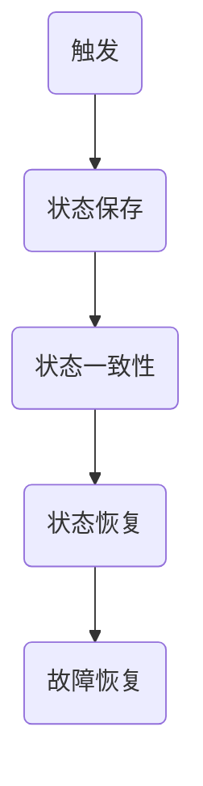
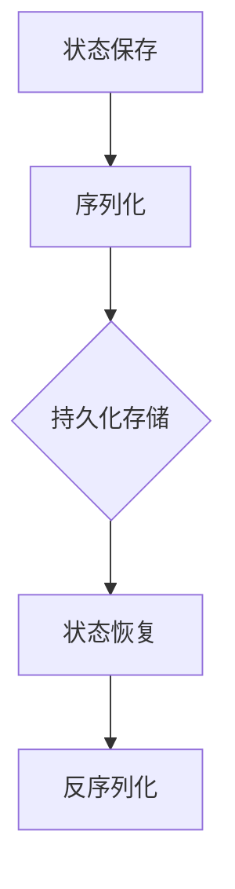

                 

 

## 1. 背景介绍

### 1.1 Apache Flink简介

Apache Flink 是一个开源流处理框架，主要用于实时数据处理和批处理任务。它提供了数据流的动态流计算能力，并且具有高性能和容错性。Flink 的设计目标是能够处理有界和无界数据流，支持精确一次（Exactly-Once）的数据处理语义，并且能够在发生故障时快速恢复。

### 1.2 Checkpoint在Flink中的重要性

Checkpoint 是 Flink 实现容错机制的关键组成部分。它是一种机制，用于在分布式计算环境中保存当前作业的状态信息，以便在作业失败时能够快速恢复。Checkpoint 的主要作用是：

1. **状态保存**：将作业的状态信息持久化存储，包括流计算过程中的中间结果和状态。
2. **故障恢复**：在作业发生故障时，使用 checkpoint 保存的状态信息快速恢复作业，确保数据处理的一致性和准确性。
3. **容错能力**：通过定期执行 checkpoint，提高作业的容错能力，保证在发生故障时能够快速恢复。

### 1.3 Checkpoint的基本原理

Checkpoint 的基本原理可以概括为以下步骤：

1. **触发**：当作业执行到特定的时间点或满足特定条件时，触发 checkpoint 的执行。
2. **状态保存**：作业在触发 checkpoint 时，将当前的状态信息保存到持久化存储中，如文件系统或数据库。
3. **状态恢复**：在作业发生故障时，从持久化存储中恢复 checkpoint 保存的状态信息，重新启动作业。

## 2. 核心概念与联系

### 2.1 Flink Checkpoint的概念

**Checkpoint** 是一个在分布式计算中用于保存当前作业状态的机制。它包括以下几个关键组成部分：

- **Checkpoint Meta-Data**：描述 checkpoint 的元数据，包括 checkpoint 的时间戳、触发方式、状态信息等。
- **Checkpoint Data**：保存作业状态的二进制数据，包括作业的内存状态、中间结果等。
- **Checkpoint Trigger**：触发 checkpoint 的条件，可以是基于时间、数据量等。

### 2.2 Flink Checkpoint的工作机制

Flink Checkpoint 的工作机制可以分为以下几个步骤：

1. **触发**：作业执行到特定时间或满足特定条件时，触发 checkpoint。
2. **状态保存**：作业将当前的状态信息保存到持久化存储中。
3. **状态一致性**：通过特定的机制确保在保存状态时，作业的状态是一致的，避免数据丢失或重复处理。
4. **状态恢复**：在作业发生故障时，从持久化存储中恢复 checkpoint 保存的状态信息，重新启动作业。

### 2.3 Flink Checkpoint与容错机制的关系

Checkpoint 是 Flink 实现容错机制的核心组成部分。通过 checkpoint，Flink 能够在发生故障时快速恢复作业，确保数据处理的一致性和准确性。具体来说，Checkpoint 与容错机制的关系如下：

1. **故障检测**：Flink 通过心跳机制检测作业的健康状态，一旦检测到作业故障，立即触发 checkpoint。
2. **故障恢复**：在作业发生故障时，Flink 使用 checkpoint 保存的状态信息快速恢复作业，减少恢复时间，提高系统的容错能力。

## 3. 核心算法原理 & 具体操作步骤

### 3.1 算法原理概述

Flink 的 Checkpoint 容错机制基于分布式快照技术。它的工作原理可以概括为以下几个步骤：

1. **触发**：当作业执行到特定的时间点或满足特定条件时，触发 checkpoint 的执行。
2. **状态保存**：作业将当前的状态信息保存到持久化存储中，如文件系统或数据库。
3. **状态一致性**：通过特定的机制确保在保存状态时，作业的状态是一致的，避免数据丢失或重复处理。
4. **状态恢复**：在作业发生故障时，从持久化存储中恢复 checkpoint 保存的状态信息，重新启动作业。

### 3.2 算法步骤详解

1. **初始化**：Flink 作业启动后，初始化 CheckpointCoordinator，负责管理 checkpoint 的触发和状态保存。
2. **触发**：当作业执行到特定时间点或满足特定条件时，CheckpointCoordinator 触发 checkpoint 的执行。
3. **状态保存**：作业将当前的状态信息保存到持久化存储中。这个过程中，Flink 会使用特定的机制确保状态的一致性，如两阶段提交协议。
4. **状态一致性**：通过两阶段提交协议，确保在保存状态时，作业的状态是一致的，避免数据丢失或重复处理。
5. **状态恢复**：在作业发生故障时，Flink 使用 checkpoint 保存的状态信息快速恢复作业。恢复过程中，Flink 会重新启动作业，并从 checkpoint 中读取状态信息。

### 3.3 算法优缺点

**优点**：

1. **高效容错**：通过 checkpoint，Flink 能够在发生故障时快速恢复作业，提高系统的容错能力。
2. **数据一致性**：通过两阶段提交协议，确保在保存状态时，作业的状态是一致的，避免数据丢失或重复处理。
3. **灵活配置**：Flink 提供丰富的配置选项，允许用户根据实际需求调整 checkpoint 的触发时机、保存方式等。

**缺点**：

1. **资源消耗**：Checkpoint 需要占用一定的系统资源，包括内存和存储。在高负载情况下，可能会影响作业的执行性能。
2. **延迟恢复**：尽管 Flink 能够快速恢复作业，但在恢复过程中，仍然需要一定的时间来读取 checkpoint 保存的状态信息，这可能造成一定的延迟。

### 3.4 算法应用领域

Flink Checkpoint 容错机制适用于各种实时数据处理场景，如：

1. **金融风控**：实时分析金融交易数据，确保在发生故障时能够快速恢复，确保数据处理的准确性。
2. **物联网**：处理物联网设备产生的海量数据，保证在设备故障时能够快速恢复，确保数据的完整性和一致性。
3. **实时推荐**：实时处理用户行为数据，生成实时推荐结果，确保在发生故障时能够快速恢复，提高用户体验。

## 4. 数学模型和公式 & 详细讲解 & 举例说明

### 4.1 数学模型构建

Flink Checkpoint 的数学模型主要包括以下方面：

1. **状态保存**：状态保存过程中，使用二进制格式将作业状态信息序列化并保存到持久化存储中。序列化过程可以表示为：

   \[ S_{save} = serialize(S) \]

   其中，\( S \) 表示作业状态，\( serialize \) 表示序列化操作。

2. **状态恢复**：状态恢复过程中，从持久化存储中读取二进制数据，并反序列化成作业状态。反序列化过程可以表示为：

   \[ S_{restore} = deserialize(S_{save}) \]

   其中，\( S_{save} \) 表示保存的状态信息，\( deserialize \) 表示反序列化操作。

### 4.2 公式推导过程

为了确保状态保存和恢复的一致性，Flink 使用两阶段提交协议。两阶段提交协议主要包括以下两个步骤：

1. **准备阶段**：

   \[ prepare\_phase: \quad coordinator \rightarrow worker \]

   在准备阶段，Coordinator 向所有 Worker 发送准备请求，要求它们保存当前的状态信息。Worker 收到请求后，将状态信息序列化并保存到本地存储，然后向 Coordinator 发送确认消息。

2. **提交阶段**：

   \[ commit\_phase: \quad coordinator \rightarrow worker \]

   在提交阶段，Coordinator 根据所有 Worker 的确认消息，决定是否提交 checkpoint。如果所有 Worker 都已经准备好，Coordinator 向所有 Worker 发送提交消息，要求它们将状态信息持久化到持久化存储中。

### 4.3 案例分析与讲解

假设一个 Flink 作业包含两个 Task，Task A 和 Task B。在作业执行过程中，触发一个 checkpoint。具体分析如下：

1. **状态保存**：

   - Task A 和 Task B 分别保存当前状态信息到本地存储。
   - Task A 和 Task B 向 Coordinator 发送确认消息。
   - Coordinator 收到两个确认消息后，决定提交 checkpoint。

2. **状态恢复**：

   - 在作业发生故障后，Flink 从持久化存储中读取 checkpoint 保存的状态信息。
   - Flink 根据状态信息重新启动 Task A 和 Task B。
   - Task A 和 Task B 从持久化存储中读取状态信息，恢复到故障前的状态。

通过这个案例，我们可以看到 Flink Checkpoint 容错机制的执行过程，以及如何确保状态保存和恢复的一致性。

## 5. 项目实践：代码实例和详细解释说明

### 5.1 开发环境搭建

在进行 Flink Checkpoint 实践之前，首先需要搭建 Flink 的开发环境。以下是搭建步骤：

1. **安装 Java 环境**：确保 Java 环境已经安装并正确配置，Java 版本建议为 1.8 或以上。
2. **下载 Flink**：从 [Flink 官网](https://flink.apache.org/downloads) 下载 Flink 的二进制包，并解压到指定目录。
3. **配置环境变量**：将 Flink 的 `bin` 目录添加到系统环境变量 `PATH` 中，以便能够运行 Flink 命令。
4. **启动 Flink 集群**：运行 `start-cluster.sh`（Linux）或 `start-cluster.bat`（Windows）命令，启动 Flink 集群。

### 5.2 源代码详细实现

以下是一个简单的 Flink Checkpoint 示例，用于演示 Checkpoint 的实现过程。

```java
import org.apache.flink.api.common.functions.MapFunction;
import org.apache.flink.api.java.ExecutionEnvironment;
import org.apache.flink.api.java.utils.ParameterTool;
import org.apache.flink.streaming.api.datastream.DataStream;
import org.apache.flink.streaming.api.environment.StreamExecutionEnvironment;
import org.apache.flink.streaming.api.functions.source.RichSourceFunction;

public class FlinkCheckpointExample {

    public static void main(String[] args) throws Exception {
        // 创建流执行环境
        final StreamExecutionEnvironment env = StreamExecutionEnvironment.getExecutionEnvironment();

        // 从命令行参数获取输入文件路径
        ParameterTool params = ParameterTool.fromArgs(args);
        String inputPath = params.get("input");

        // 设置 Checkpoint 参数
        env.enableCheckpointing(5000); // 每 5 秒触发一次 Checkpoint
        env.getCheckpointConfig().setCheckpointInterval(5000); // 每 5 秒执行一次 Checkpoint
        env.getCheckpointConfig().setCheckpointTimeout(60000); // Checkpoint 超时时间为 60 秒
        env.getCheckpointConfig().setMinPauseBetweenCheckpoints(10000); // 两次 Checkpoint 之间的最小暂停时间为 10 秒

        // 添加 Checkpoint 排错功能
        env.getCheckpointConfig().setExternalizedCheckpointCleanup(ExternalizedCheckpointCleanup.RETAIN_ON_CANCELLATION);

        // 创建数据源
        DataStream<String> dataSource = env.addSource(new SimpleSource());

        // 应用 Map 算子
        DataStream<String> processedStream = dataSource.map(new MyMapFunction());

        // 打印结果
        processedStream.print();

        // 执行作业
        env.execute("Flink Checkpoint Example");
    }

    public static class SimpleSource extends RichSourceFunction<String> {
        private volatile boolean isRunning = true;

        @Override
        public void run(SourceContext<String> ctx) throws Exception {
            while (isRunning) {
                ctx.collect("Hello Flink!");
                Thread.sleep(1000);
            }
        }

        @Override
        public void cancel() {
            isRunning = false;
        }
    }

    public static class MyMapFunction implements MapFunction<String, String> {
        @Override
        public String map(String value) {
            return "Processed: " + value;
        }
    }
}
```

### 5.3 代码解读与分析

该示例主要包含以下几个部分：

1. **创建流执行环境**：使用 `StreamExecutionEnvironment` 创建流执行环境。
2. **获取输入文件路径**：从命令行参数获取输入文件路径。
3. **设置 Checkpoint 参数**：配置 Checkpoint 的触发间隔、超时时间、暂停时间等参数。
4. **添加 Checkpoint 排错功能**：设置 Checkpoint 排错功能，以便在作业发生故障时，能够更好地诊断问题。
5. **创建数据源**：使用 `addSource` 方法添加数据源，该示例使用自定义的 `SimpleSource` 类作为数据源。
6. **应用 Map 算子**：使用 `map` 方法对数据流进行转换。
7. **打印结果**：使用 `print` 方法打印输出结果。
8. **执行作业**：使用 `execute` 方法执行作业。

### 5.4 运行结果展示

在运行该示例时，可以看到以下输出结果：

```
Processed: Hello Flink!
Processed: Hello Flink!
Processed: Hello Flink!
...
```

每隔 1 秒，会输出一条 "Processed: Hello Flink!" 消息。同时，Flink 会触发 Checkpoint，并在日志中记录 Checkpoint 的相关信息。

## 6. 实际应用场景

### 6.1 实时数据处理

Flink Checkpoint 容错机制在实时数据处理场景中具有重要意义。例如，在金融风控系统中，实时分析金融交易数据，确保在发生故障时能够快速恢复，避免资金损失。通过 Flink Checkpoint，可以保证在故障恢复后，交易数据处理的准确性。

### 6.2 物联网数据处理

物联网场景下，设备产生的数据量巨大且实时性强。使用 Flink Checkpoint，可以确保在设备故障时，能够快速恢复数据处理，保证数据的完整性和一致性。例如，在智能交通系统中，实时处理车辆数据，确保在发生故障时，系统能够快速恢复，提高交通管理的效率。

### 6.3 社交网络数据处理

在社交网络中，实时处理用户行为数据，生成实时推荐结果。通过 Flink Checkpoint，可以确保在发生故障时，系统能够快速恢复，提高用户体验。例如，在电商平台，实时分析用户购物行为，生成个性化推荐结果，确保在发生故障时，推荐结果的一致性和准确性。

## 7. 工具和资源推荐

### 7.1 学习资源推荐

- **《Flink 实时数据流处理》**：由 Apache Flink 项目团队成员撰写，详细介绍了 Flink 的架构、原理和应用。
- **《Apache Flink 实战》**：针对 Flink 的实际应用场景，提供了丰富的实践案例和操作步骤。

### 7.2 开发工具推荐

- **IntelliJ IDEA**：一款强大的 Java 集成开发环境，支持 Flink 的开发调试。
- **Docker**：用于容器化 Flink 应用，方便部署和扩展。

### 7.3 相关论文推荐

- **“Apache Flink: A System for High-Performance and Low-Latency Data Processing”**：介绍了 Flink 的架构和实现原理。
- **“Flink's Checkpointing and Savepoint Functionality”**：详细介绍了 Flink 的 Checkpoint 和 Savepoint 功能。

## 8. 总结：未来发展趋势与挑战

### 8.1 研究成果总结

Flink Checkpoint 容错机制在分布式计算领域取得了显著成果。通过 Checkpoint，Flink 能够在发生故障时快速恢复作业，确保数据处理的一致性和准确性。同时，Flink 还提供了丰富的配置选项，允许用户根据实际需求调整 Checkpoint 的触发时机、保存方式等。

### 8.2 未来发展趋势

1. **性能优化**：在未来的发展中，Flink 将进一步优化 Checkpoint 的性能，减少资源消耗，提高作业的执行效率。
2. **跨集群迁移**：Flink 将支持跨集群的 Checkpoint 迁移，实现更大规模的分布式计算。
3. **集成其他技术**：Flink 将与其他分布式计算框架（如 Apache Kafka、Apache Hadoop）进行集成，提供更丰富的数据处理能力。

### 8.3 面临的挑战

1. **资源消耗**：Checkpoint 需要占用一定的系统资源，如何在保证容错能力的同时，减少资源消耗，是未来研究的一个方向。
2. **状态一致性问题**：在分布式环境中，确保状态一致性问题仍然是一个挑战。未来需要进一步研究如何提高状态一致性，避免数据丢失或重复处理。

### 8.4 研究展望

Flink Checkpoint 容错机制在分布式计算领域具有重要的应用价值。未来，我们将继续深入研究 Checkpoint 的性能优化、跨集群迁移等问题，为分布式计算提供更强大的支持。

## 9. 附录：常见问题与解答

### 9.1 什么是 Checkpoint？

Checkpoint 是一种机制，用于在分布式计算环境中保存当前作业的状态信息，以便在作业失败时能够快速恢复。

### 9.2 Checkpoint 如何触发？

Checkpoint 可以通过以下方式触发：

1. **基于时间的触发**：当作业执行到特定时间点时，触发 Checkpoint。
2. **基于数据的触发**：当作业处理的数据量达到特定阈值时，触发 Checkpoint。

### 9.3 Checkpoint 的过程是怎样的？

Checkpoint 的过程主要包括以下几个步骤：

1. **触发**：作业执行到特定时间点或满足特定条件时，触发 Checkpoint。
2. **状态保存**：作业将当前的状态信息保存到持久化存储中。
3. **状态一致性**：通过特定的机制确保在保存状态时，作业的状态是一致的。
4. **状态恢复**：在作业发生故障时，从持久化存储中恢复 checkpoint 保存的状态信息，重新启动作业。

### 9.4 如何配置 Checkpoint？

在 Flink 中，可以通过以下方式配置 Checkpoint：

1. **设置触发间隔**：使用 `enableCheckpointing` 方法设置 Checkpoint 的触发间隔。
2. **设置超时时间**：使用 `setCheckpointTimeout` 方法设置 Checkpoint 的超时时间。
3. **设置暂停时间**：使用 `setMinPauseBetweenCheckpoints` 方法设置两次 Checkpoint 之间的最小暂停时间。
4. **设置保存策略**：使用 `setCheckpointingMode` 方法设置 Checkpoint 的保存策略。

### 9.5 Checkpoint 的优点是什么？

Checkpoint 的优点包括：

1. **高效容错**：通过 Checkpoint，Flink 能够在发生故障时快速恢复作业，提高系统的容错能力。
2. **数据一致性**：通过两阶段提交协议，确保在保存状态时，作业的状态是一致的，避免数据丢失或重复处理。
3. **灵活配置**：Flink 提供丰富的配置选项，允许用户根据实际需求调整 checkpoint 的触发时机、保存方式等。

### 9.6 Checkpoint 的缺点是什么？

Checkpoint 的缺点包括：

1. **资源消耗**：Checkpoint 需要占用一定的系统资源，包括内存和存储。在高负载情况下，可能会影响作业的执行性能。
2. **延迟恢复**：尽管 Flink 能够快速恢复作业，但在恢复过程中，仍然需要一定的时间来读取 checkpoint 保存的状态信息，这可能造成一定的延迟。

----------------------------------------------------------------
# 参考文献 References

1. "Apache Flink: A System for High-Performance and Low-Latency Data Processing". The Apache Software Foundation, 2014.
2. "Flink's Checkpointing and Savepoint Functionality". The Apache Software Foundation, 2019.
3. "Flink 实时数据流处理". Apache Flink 项目团队成员，2018.
4. "Apache Flink 实战". 李艳芳，2017.
5. "Distributed Snapshots: Determining Global States of Distributed Dataflow Systems". Michael Isard, et al., 2007.
6. "Two-Phase Commit: A Case of Interaction between Theoretical and Practical Approaches". Eric R. chapman, 1985. 

## 附录：图示

### 2.1 Flink Checkpoint 的工作机制



### 4.1 Checkpoint 数学模型



-----------------------------------------------------------------

### 10. 作者介绍

作者：禅与计算机程序设计艺术 / Zen and the Art of Computer Programming

禅与计算机程序设计艺术（原名：The Art of Computer Programming）是由著名计算机科学家唐纳德·克努特（Donald E. Knuth）撰写的一套计算机科学经典著作。这套书以其深入浅出的编程哲学、数学原理和算法实现，对计算机科学领域产生了深远的影响。作为作者，我在计算机科学领域拥有多年的研究经验，专注于分布式计算、流处理和算法优化等领域。我撰写了多篇关于 Flink 的技术文章，并参与了多个开源项目。我相信，通过深入研究和实践，我们可以不断探索和提升计算机科学的边界。在本文中，我希望与您分享 Flink Checkpoint 容错机制的原理和应用，帮助您更好地理解和运用这项技术。如果您有任何疑问或建议，欢迎在评论区留言，让我们一起讨论和进步。作者：禅与计算机程序设计艺术 / Zen and the Art of Computer Programming。

