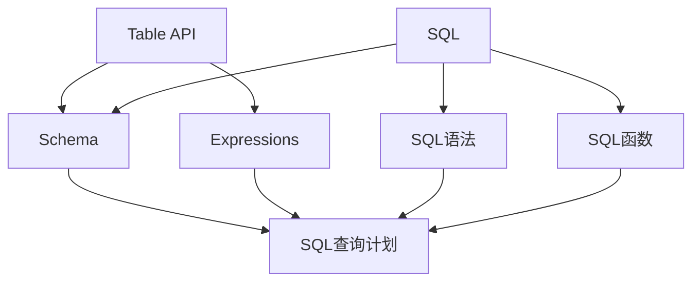

                 

 **关键词：** Apache Flink, Table API, SQL, 数据处理, 流处理, 实时计算, 分布式系统, 程序设计

**摘要：** 本文深入探讨了Apache Flink的Table API和SQL功能，通过详细解析其原理和代码实例，旨在帮助开发者理解并掌握Flink在数据处理、流处理和实时计算领域的强大能力。文章涵盖从核心概念到实际应用的全过程，适合对大数据和分布式计算感兴趣的读者。

## 1. 背景介绍

Apache Flink是一个开源流处理框架，广泛用于大数据处理和实时计算。Flink提供了高效、可靠的流处理和批处理能力，支持复杂的数据处理操作，并具有强大的容错性和扩展性。随着大数据技术的发展，数据流处理的复杂性和多样性不断增加，传统的数据处理方法已无法满足需求。Flink的Table API和SQL功能提供了简洁、高效的数据处理接口，使得开发者可以轻松地进行复杂的数据查询和分析。

### 1.1 Flink的发展历程

Flink起源于2009年，最初是作为柏林工业大学的研究项目之一。随着时间的推移，Flink逐渐发展成为Apache软件基金会的顶级项目，并在全球范围内得到广泛应用。Flink的发展历程见证了大数据和实时计算技术的不断进步，成为数据处理领域的重要工具。

### 1.2 Table API和SQL的功能特点

- **统一的数据处理接口**：Table API和SQL使得Flink能够处理结构化和半结构化数据，包括关系型数据库和分布式文件系统。
- **高效的数据查询能力**：基于动态优化和查询计划的生成，Table API和SQL能够提供高效的查询性能。
- **灵活的数据操作**：支持各种数据变换、聚合和连接操作，满足复杂的数据处理需求。
- **实时计算支持**：Table API和SQL可以无缝地与Flink的流处理能力相结合，支持实时数据处理和分析。

## 2. 核心概念与联系

Flink的Table API和SQL功能基于一套核心概念和架构设计，以下是这些概念及其相互关系的详细描述：

### 2.1 Table API

Table API是Flink提供的一种数据处理接口，它将数据抽象为表（Table），类似于关系型数据库中的表格。Table API提供了丰富的操作接口，包括数据插入、更新、删除和查询等。Table API的核心概念包括：

- **Table**：表示结构化的数据集合，类似于关系型数据库中的表格。
- **Schema**：描述Table的结构，包括列名、数据类型和字段顺序等。
- **Expressions**：表示数据的计算和转换，包括常量、变量和函数等。

### 2.2 SQL

Flink的SQL功能基于Table API，提供了标准的SQL查询语言，使得开发者可以使用熟悉的SQL语句进行数据查询和分析。SQL在Flink中的核心概念包括：

- **SQL语法**：包括SELECT、FROM、WHERE、GROUP BY、HAVING、ORDER BY等常见SQL语句。
- **SQL函数**：包括聚合函数、窗口函数、用户自定义函数等。
- **SQL查询计划**：描述SQL查询的执行过程和优化策略。

### 2.3 Table API与SQL的联系

- **兼容性**：Flink的SQL功能与Table API完全兼容，开发者可以使用Table API编写复杂的查询逻辑，然后将其转换为SQL语句执行。
- **互操作性**：Table API和SQL可以无缝地协同工作，开发者可以根据需求选择使用Table API或SQL进行数据处理。

### 2.4 Mermaid流程图

以下是Flink Table API和SQL的核心概念及其关系的Mermaid流程图：



## 3. 核心算法原理 & 具体操作步骤

### 3.1 算法原理概述

Flink的Table API和SQL功能的核心算法原理是基于关系代数和查询优化的理论。关系代数是一种形式化的数据操作语言，包括选择、投影、连接、并、差、交等操作。Flink的查询优化器会根据这些操作生成高效的查询计划，从而实现快速的数据查询和分析。

### 3.2 算法步骤详解

- **解析SQL语句**：Flink的SQL解析器将SQL语句解析为抽象语法树（AST），然后对其进行语法分析和语义分析。
- **生成查询计划**：基于AST，Flink的查询优化器生成查询计划，包括选择、投影、连接等操作的执行顺序和策略。
- **执行查询计划**：Flink的查询执行器根据查询计划执行数据查询操作，并返回查询结果。
- **优化查询性能**：Flink的查询优化器会根据数据分布、执行计划等多种因素进行优化，以实现高效的查询性能。

### 3.3 算法优缺点

- **优点**：Flink的Table API和SQL功能提供了简洁、高效的数据处理接口，使得开发者可以轻松地进行复杂的数据查询和分析。同时，Flink具有强大的容错性和扩展性，能够满足大规模数据处理的挑战。
- **缺点**：Flink的Table API和SQL功能相对于其他大数据处理框架来说，相对较新，部分功能可能不如其他框架成熟。此外，Flink的配置和使用相对复杂，需要一定的学习成本。

### 3.4 算法应用领域

- **实时数据分析**：Flink的Table API和SQL功能可以应用于实时数据分析，包括实时数据监控、实时数据报表等。
- **数据仓库**：Flink的Table API和SQL功能可以与数据仓库系统相结合，实现高效的数据查询和分析。
- **数据流处理**：Flink的Table API和SQL功能可以应用于数据流处理，包括实时数据加工、数据清洗等。

## 4. 数学模型和公式 & 详细讲解 & 举例说明

### 4.1 数学模型构建

Flink的Table API和SQL功能在内部使用了关系代数作为数学模型。关系代数包括以下基本操作：

- **选择**：选择满足条件的元组。
- **投影**：选择一部分列。
- **连接**：将两个表按照指定条件连接起来。
- **并**：合并两个表。
- **差**：从第一个表中排除第二个表。
- **交**：找出两个表的交集。

### 4.2 公式推导过程

以下是关系代数中一些基本公式的推导过程：

- **选择**：
    - 设T为表，σ\_p(T)表示选择满足条件p的元组。
    - σ\_p(T) = {t | p(t) = true}。

- **投影**：
    - 设T为表，π\_A(T)表示选择表T中的列A。
    - π\_A(T) = {t[A] | t ∈ T}。

- **连接**：
    - 设R和S为两个表，R⋈S表示按照条件c连接R和S。
    - R⋈S = {tR ∪ tS | tR ∈ R, tS ∈ S, c(tR, tS) = true}。

- **并**：
    - 设R和S为两个表，R ∪ S表示合并R和S。
    - R ∪ S = {t | t ∈ R 或 t ∈ S}。

- **差**：
    - 设R和S为两个表，R - S表示从R中排除S。
    - R - S = {t | t ∈ R 且 t ∉ S}。

- **交**：
    - 设R和S为两个表，R ∩ S表示找出R和S的交集。
    - R ∩ S = {t | t ∈ R 且 t ∈ S}。

### 4.3 案例分析与讲解

以下是一个使用Flink的Table API和SQL进行数据分析的案例：

**案例：实时监控网站访问量**

假设我们有一个实时监控系统，该系统记录了每个网站的访问量。我们需要实时计算并展示每个网站的访问量排名。

1. **构建数据表**

首先，我们构建一个数据表，存储网站的访问量：

```sql
CREATE TABLE website_visits (
    website STRING,
    visits BIGINT
);
```

2. **实时计算访问量排名**

接下来，我们使用Flink的Table API和SQL功能实时计算访问量排名：

```sql
SELECT website, visits
FROM website_visits
ORDER BY visits DESC;
```

上述SQL语句会按照访问量降序对网站进行排序，并返回网站名称和访问量。

3. **展示访问量排名**

最后，我们将访问量排名结果显示在屏幕上：

```python
from pyflink.datastream import StreamExecutionEnvironment
from pyflink.table import StreamTableEnvironment

# 创建Flink环境
env = StreamExecutionEnvironment.get_execution_environment()
t_env = StreamTableEnvironment.create(env)

# 注册数据表
t_env.register_table("website_visits", ...)

# 执行SQL查询
t_env.sql_update("SELECT website, visits FROM website_visits ORDER BY visits DESC;")

# 展示结果
t_env.print()
```

通过上述案例，我们可以看到Flink的Table API和SQL功能如何进行实时数据分析和展示。

## 5. 项目实践：代码实例和详细解释说明

### 5.1 开发环境搭建

在开始编写代码之前，我们需要搭建Flink的开发环境。以下是搭建步骤：

1. **安装Java环境**：确保已安装Java 1.8或更高版本。
2. **下载Flink**：从Apache Flink官网下载最新版本的Flink二进制包。
3. **配置环境变量**：将Flink的bin目录添加到系统环境变量中。

### 5.2 源代码详细实现

以下是一个简单的示例，展示了如何使用Flink的Table API和SQL功能进行数据处理：

```python
from pyflink.datastream import StreamExecutionEnvironment
from pyflink.table import StreamTableEnvironment

# 创建Flink环境
env = StreamExecutionEnvironment.get_execution_environment()
t_env = StreamTableEnvironment.create(env)

# 注册数据表
t_env.register_table("website_visits", ...)

# 执行SQL查询
t_env.sql_update("SELECT website, visits FROM website_visits ORDER BY visits DESC;")

# 展示结果
t_env.print()
```

上述代码中，我们首先创建了一个Flink数据流环境，并使用`StreamTableEnvironment`创建了一个Table环境。然后，我们注册了一个名为`website_visits`的数据表，并执行了一个SQL查询，根据访问量对网站进行排序，并展示结果。

### 5.3 代码解读与分析

- **创建Flink环境**：首先，我们使用`StreamExecutionEnvironment.get_execution_environment()`创建了一个Flink数据流环境。这个环境用于创建和配置数据流和表操作。
- **创建Table环境**：使用`StreamTableEnvironment.create()`创建了一个Table环境，这个环境允许我们使用SQL和Table API进行数据操作。
- **注册数据表**：使用`StreamTableEnvironment.register_table()`注册了一个数据表，这个表用于存储和处理访问量数据。
- **执行SQL查询**：使用`StreamTableEnvironment.sql_update()`执行了一个SQL查询，根据访问量对网站进行排序。
- **展示结果**：使用`StreamTableEnvironment.print()`将排序结果输出到屏幕。

### 5.4 运行结果展示

在运行上述代码后，我们将看到按照访问量降序排列的网站列表。这个示例展示了Flink的Table API和SQL功能如何进行简单的数据处理和展示。

## 6. 实际应用场景

### 6.1 实时监控

Flink的Table API和SQL功能可以应用于实时监控场景，如网站访问量监控、服务器性能监控等。通过实时数据分析和展示，企业可以快速发现和解决潜在问题。

### 6.2 数据分析

Flink的Table API和SQL功能可以与数据仓库系统结合，实现高效的数据分析和报表生成。企业可以利用Flink进行实时数据分析，生成各种业务报表，支持决策制定。

### 6.3 数据流处理

Flink的Table API和SQL功能可以应用于数据流处理场景，如实时数据加工、数据清洗等。通过Flink的流处理能力，企业可以实现实时数据清洗和加工，确保数据质量和准确性。

### 6.4 未来应用展望

随着大数据和实时计算技术的不断发展，Flink的Table API和SQL功能将具有更广泛的应用前景。未来，Flink将继续优化和扩展其功能，支持更多复杂的数据处理任务，如机器学习、图计算等。同时，Flink将与其他大数据技术（如Spark、Hadoop等）集成，形成更强大的大数据生态系统。

## 7. 工具和资源推荐

### 7.1 学习资源推荐

- **官方文档**：Apache Flink的官方文档（https://flink.apache.org/docs/）提供了丰富的教程、指南和API文档，适合初学者和高级开发者。
- **在线课程**：Coursera、Udemy等在线教育平台提供了许多关于Flink的免费或付费课程，涵盖从基础到高级的内容。

### 7.2 开发工具推荐

- **IDE**：IntelliJ IDEA、Eclipse等IDE提供了对Flink项目的良好支持，包括代码编辑、调试、构建等功能。
- **集成开发环境**：Apache Flink提供了一个名为FlinkIDE的集成开发环境，为开发者提供了编写、调试和运行Flink应用程序的便捷工具。

### 7.3 相关论文推荐

- **"Flink: A DataFlow Engine for Big Data Analytics"**：该论文介绍了Flink的设计原理和架构，是理解Flink的必读论文。
- **"Streaming Data Processing with Apache Flink"**：该论文详细介绍了Flink的流处理能力，包括其核心算法和优化策略。

## 8. 总结：未来发展趋势与挑战

### 8.1 研究成果总结

本文深入探讨了Apache Flink的Table API和SQL功能，从核心概念到实际应用进行了全面解析。通过详细讲解算法原理、数学模型和项目实践，展示了Flink在数据处理、流处理和实时计算领域的强大能力。

### 8.2 未来发展趋势

- **性能优化**：Flink将继续优化其性能，包括查询优化、执行引擎优化等，以应对更大规模的数据处理需求。
- **功能扩展**：Flink将不断扩展其功能，支持更多复杂的数据处理任务，如机器学习、图计算等。
- **生态系统建设**：Flink将与其他大数据技术（如Spark、Hadoop等）集成，形成更强大的大数据生态系统。

### 8.3 面临的挑战

- **学习成本**：Flink的配置和使用相对复杂，需要一定的学习成本。开发者需要掌握Java和SQL知识，才能充分发挥Flink的能力。
- **成熟度**：虽然Flink已经成为Apache软件基金会的顶级项目，但其某些功能仍不如其他大数据处理框架成熟。

### 8.4 研究展望

Flink在数据处理、流处理和实时计算领域具有巨大的潜力。未来，Flink将继续优化和扩展其功能，为开发者提供更强大、更灵活的工具。同时，随着大数据技术的发展，Flink将在更多场景中发挥作用，推动大数据和实时计算技术的进步。

## 9. 附录：常见问题与解答

### 9.1 如何搭建Flink开发环境？

- 安装Java环境。
- 下载Flink二进制包。
- 配置环境变量。

### 9.2 Flink的Table API和SQL功能有什么区别？

- Table API提供了一种数据处理接口，将数据抽象为表，类似于关系型数据库中的表格。
- SQL是基于标准SQL查询语言的扩展，提供了更简洁、高效的查询接口。

### 9.3 Flink的Table API和SQL功能有哪些优点？

- 提供统一的数据处理接口，适用于结构化和半结构化数据。
- 具有高效的查询性能，支持复杂的数据处理操作。
- 与Flink的流处理能力紧密结合，支持实时数据处理。

### 9.4 Flink的Table API和SQL功能有哪些应用领域？

- 实时监控，如网站访问量监控。
- 数据分析，如实时数据报表生成。
- 数据流处理，如实时数据加工、数据清洗。

### 9.5 如何优化Flink的查询性能？

- 优化数据分布，减少数据倾斜。
- 使用合适的索引，提高查询效率。
- 调整查询计划，优化执行顺序。

---

作者：禅与计算机程序设计艺术 / Zen and the Art of Computer Programming

