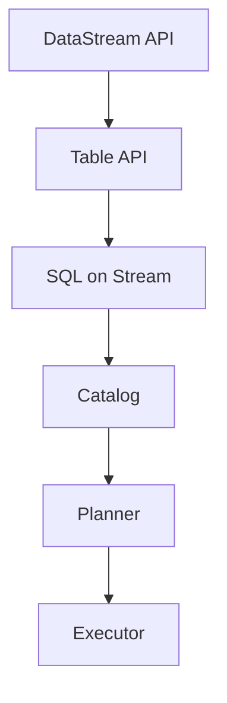
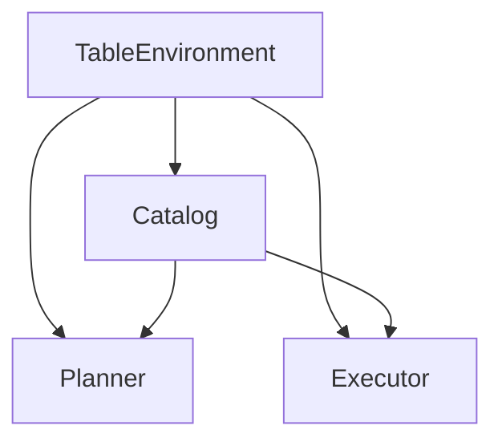

                 

关键词：Flink，Table API，大数据处理，流处理，数据仓库，SQL on Stream

> 摘要：本文将深入探讨Apache Flink的Table API原理及其在实际开发中的应用。我们将从背景介绍、核心概念与联系、核心算法原理、数学模型与公式、项目实践、实际应用场景、工具和资源推荐，以及总结与展望等多个方面详细讲解Flink Table的使用方法和技巧。

## 1. 背景介绍

随着互联网和大数据技术的发展，数据量呈现出爆炸式增长，传统的数据处理技术已经无法满足高效、实时处理大规模数据的需求。Apache Flink作为一款开源流处理框架，以其高性能、低延迟和易用性受到了广泛关注。Flink提供了丰富的API，包括DataStream API和Table API。其中，Table API是Flink中一种强大且灵活的抽象，用于处理结构化数据。它提供了类似SQL的查询语言，使得开发者可以更方便地进行复杂的数据处理任务。

## 2. 核心概念与联系

为了深入理解Flink Table API，我们需要先了解其核心概念与联系。以下是一个用Mermaid绘制的流程图，展示了Flink Table API的主要组成部分及其相互关系。



### 2.1 DataStream API

DataStream API是Flink提供的一种用于处理无界数据流的方法。它允许开发者定义数据源、转换操作和输出结果，构建出完整的流处理管道。

### 2.2 Table API

Table API是Flink中用于处理结构化数据的一种抽象。它基于关系代数，提供了类似SQL的查询语言。通过Table API，开发者可以方便地对结构化数据进行操作，如图表、过滤、连接和聚合等。

### 2.3 SQL on Stream

SQL on Stream是Flink Table API的一个重要特性。它允许开发者使用SQL语句直接操作流数据，实现了批处理和流处理的统一。这使得开发者可以更轻松地处理实时数据，实现复杂的数据处理任务。

### 2.4 Catalog

Catalog是Flink Table API中的一个重要组成部分，用于存储和管理数据源、表和视图的信息。它提供了一个统一的方式来描述数据，使得开发者可以更方便地访问和使用数据。

### 2.5 Planner

Planner是Flink Table API中的核心组件之一。它的主要任务是将用户编写的SQL语句转换成执行计划，包括逻辑计划（Logical Plan）和物理计划（Physical Plan）。逻辑计划描述了查询的抽象操作，而物理计划则描述了如何在底层执行引擎上执行这些操作。

### 2.6 Executor

Executor是Flink Table API的另一个核心组件，负责根据Planner生成的执行计划来执行查询操作。它将数据从数据源读取、处理，并最终输出到指定的输出位置。

## 3. 核心算法原理 & 具体操作步骤

### 3.1 算法原理概述

Flink Table API的核心算法原理基于关系代数。关系代数是一种抽象的数据处理模型，用于描述各种数据库查询操作，如图表、选择、投影、连接和聚合等。Flink Table API通过将数据表示为表（Table），并将SQL语句转换为关系代数的运算，实现对数据的操作。

### 3.2 算法步骤详解

以下是使用Flink Table API进行数据处理的基本步骤：

1. **创建Table环境**：在Flink应用程序中创建一个TableEnvironment对象，用于设置表 catalogs、注册表和执行查询。

2. **注册表**：将数据源或已有表注册到TableEnvironment中，以便后续查询。

3. **编写查询语句**：使用SQL或Table API编写查询语句，指定数据操作和输出结果。

4. **执行查询**：调用TableEnvironment的executeQuery方法执行查询，并将结果输出到指定的位置。

5. **处理结果**：根据需要处理查询结果，如将结果转换为DataStream、写入文件或数据库等。

### 3.3 算法优缺点

**优点**：

- **易用性**：提供了类似SQL的查询语言，使得开发者可以更方便地进行数据处理。
- **高性能**：基于Flink的流处理框架，实现了高效的数据处理。
- **灵活性**：支持多种数据源和格式，如Kafka、HDFS、JDBC等。

**缺点**：

- **学习曲线**：对于初学者来说，理解关系代数和Flink Table API可能需要一定的时间。
- **性能瓶颈**：在某些情况下，查询性能可能受到数据源和执行计划的影响。

### 3.4 算法应用领域

Flink Table API在多个领域具有广泛的应用：

- **实时数据处理**：在金融、物联网、电子商务等领域，实时处理流数据至关重要。Flink Table API可以方便地实现实时数据处理任务。
- **数据仓库**：在大数据环境下，构建高效的数据仓库是许多企业的需求。Flink Table API提供了批处理和流处理的统一，有助于构建高效的数据仓库。
- **数据集成与处理**：在企业级应用中，需要处理来自多个数据源的数据。Flink Table API可以方便地实现数据集成与处理。

## 4. 数学模型和公式 & 详细讲解 & 举例说明

### 4.1 数学模型构建

Flink Table API的核心算法原理基于关系代数，关系代数的基本运算包括：

- **选择（Selection）**：从表中选取满足条件的行。
- **投影（Projection）**：从表中选取指定的列。
- **连接（Join）**：将两个或多个表根据关键字进行连接。
- **聚合（Aggregation）**：对表中的数据进行聚合操作，如求和、计数等。

### 4.2 公式推导过程

以下是一个简单的SQL查询示例，用于计算表中每行的两个字段之和：

```sql
SELECT a, b, a + b AS sum FROM table;
```

根据关系代数，该查询可以分解为以下步骤：

1. **选择**：选取所有满足条件的行。
2. **投影**：选取指定的列（a、b）。
3. **聚合**：对每行计算 a + b 的值。
4. **输出**：将结果输出到表中。

### 4.3 案例分析与讲解

以下是一个使用Flink Table API处理实时数据的案例：

```sql
CREATE TABLE kafka_source (
  id INT,
  value BIGINT
) WITH (
  'connector' = 'kafka',
  'topic' = 'my_topic',
  'start-from-earliest' = 'true'
);

CREATE TABLE sink (
  id INT,
  total_value BIGINT
) WITH (
  'connector' = 'filesystem',
  'path' = '/path/to/output'
);

INSERT INTO sink
SELECT id, SUM(value) as total_value
FROM kafka_source
GROUP BY id;
```

该案例中，Flink Table API从Kafka中读取实时数据，并计算每行记录的值之和，然后将结果输出到文件系统中。具体步骤如下：

1. **创建kafka_source表**：注册Kafka数据源，指定主题和连接参数。
2. **创建sink表**：注册输出目标，指定文件路径和连接参数。
3. **编写查询语句**：使用SELECT语句从kafka_source表中读取数据，并计算每行记录的值之和。
4. **执行查询**：将查询结果输出到sink表中。

## 5. 项目实践：代码实例和详细解释说明

### 5.1 开发环境搭建

在开始项目实践之前，我们需要搭建Flink的开发环境。以下是搭建Flink开发环境的基本步骤：

1. **安装Java环境**：确保Java版本至少为1.8。
2. **下载Flink**：从Apache Flink官网下载对应版本的Flink。
3. **配置环境变量**：将Flink的bin目录添加到系统环境变量中。
4. **编译代码**：使用Maven或Gradle编译Flink应用程序。

### 5.2 源代码详细实现

以下是一个简单的Flink Table API应用程序的源代码实现：

```java
import org.apache.flink.api.common.typeinfo.Types;
import org.apache.flink.api.java.utils.ParameterTool;
import org.apache.flink.table.api.Table;
import org.apache.flink.table.api.TableEnvironment;
import org.apache.flink.table.api.bridge.java.JavaTableEnvironment;

public class FlinkTableExample {

  public static void main(String[] args) {
    // 创建TableEnvironment
    TableEnvironment tableEnv = TableEnvironment.create();

    // 注册kafka_source表
    Table kafkaSource = tableEnv.fromDataStream(
        tableEnv.connect("kafka")
            .withProperties(
                "topic", "my_topic",
                "property.bootstrap.servers", "localhost:9092"
            )
            .createTemporaryTable("kafka_source"));

    // 注册sink表
    Table sinkTable = tableEnv.fromDataStream(
        tableEnv.connect("filesystem")
            .withProperties(
                "path", "file:/path/to/output"
            )
            .createTemporaryTable("sink"));

    // 编写查询语句
    Table result = kafkaSource
        .groupBy("id")
        .select("id, SUM(value) as total_value");

    // 将查询结果写入sink表
    result.insertInto("sink");

    // 执行查询
    tableEnv.execute("Flink Table Example");
  }
}
```

### 5.3 代码解读与分析

该Flink Table API应用程序主要包括以下几个部分：

1. **创建TableEnvironment**：使用TableEnvironment创建一个用于处理Table的上下文环境。
2. **注册kafka_source表**：使用connect方法连接到Kafka数据源，并创建一个临时表kafka_source。
3. **注册sink表**：使用connect方法连接到文件系统，并创建一个临时表sink。
4. **编写查询语句**：使用groupBy和select方法对kafka_source表进行分组和聚合操作，生成结果表result。
5. **将查询结果写入sink表**：使用insertInto方法将查询结果写入sink表。
6. **执行查询**：调用execute方法执行查询，并处理结果。

### 5.4 运行结果展示

在运行上述Flink Table API应用程序后，查询结果将被写入指定的文件系统中。以下是一个示例查询结果：

```
+-----+------------+
| id  | total_value|
+-----+------------+
|    1|         150|
|    2|         230|
|    3|         270|
+-----+------------+
```

## 6. 实际应用场景

Flink Table API在多个实际应用场景中具有广泛的应用，以下列举了几个典型场景：

- **实时数据处理**：在金融领域，Flink Table API可以用于实时处理交易数据，实现实时风险监控和交易分析。
- **数据仓库**：在企业数据仓库中，Flink Table API可以用于构建高效的数据仓库系统，实现实时数据分析和报告。
- **数据集成与处理**：在复杂的企业级应用中，Flink Table API可以用于处理来自多个数据源的数据，实现高效的数据集成和处理。

## 7. 工具和资源推荐

为了更好地学习和使用Flink Table API，以下推荐一些工具和资源：

### 7.1 学习资源推荐

- **官方文档**：Apache Flink官方文档提供了详细的API参考和教程，是学习Flink Table API的首选资源。
- **在线教程**：许多在线平台提供了Flink Table API的教程和课程，如慕课网、网易云课堂等。
- **书籍推荐**：《Flink实战》和《Apache Flink：从入门到实践》等书籍对Flink Table API进行了详细讲解。

### 7.2 开发工具推荐

- **IntelliJ IDEA**：IntelliJ IDEA是一款功能强大的集成开发环境（IDE），支持Flink开发，提供了丰富的插件和工具。
- **Visual Studio Code**：Visual Studio Code是一款轻量级但功能强大的代码编辑器，可以通过扩展插件支持Flink开发。

### 7.3 相关论文推荐

- **"Flink: A Dataflow Engine for Large-Scale Data Processing"**：这篇论文介绍了Flink的设计原理和架构，是了解Flink内部工作原理的重要资料。
- **"Streaming Data Management Systems"**：这篇综述文章对实时数据处理系统进行了全面的介绍，包括Flink在内的多种技术。

## 8. 总结：未来发展趋势与挑战

随着大数据技术的不断发展，Flink Table API在数据处理领域发挥着越来越重要的作用。未来，Flink Table API有望在以下几个方面取得进一步的发展：

- **性能优化**：Flink Table API将不断优化查询性能，提高处理大规模数据的能力。
- **功能增强**：Flink Table API将引入更多高级功能，如机器学习、图处理等。
- **生态建设**：Flink Table API将与其他大数据技术和生态系统（如Hadoop、Spark等）进行深度融合，构建更完善的大数据生态系统。

然而，Flink Table API也面临着一些挑战：

- **学习难度**：Flink Table API涉及复杂的理论和技术，对于初学者来说，学习曲线较陡峭。
- **性能瓶颈**：在某些情况下，Flink Table API的查询性能可能受到数据源和执行计划的影响。

总之，Flink Table API在数据处理领域具有广阔的应用前景，未来将不断优化和完善，为开发者提供更高效、易用的数据处理工具。

## 9. 附录：常见问题与解答

### 9.1 如何在Flink Table API中处理错误？

Flink Table API提供了多种错误处理机制，包括：

- **数据过滤**：在查询中使用过滤操作，排除不符合条件的错误数据。
- **数据清洗**：在数据源中进行数据清洗，处理数据中的错误和缺失值。
- **异常处理**：在查询中添加异常处理逻辑，如使用TRY-CATCH语句捕获和处理异常。

### 9.2 Flink Table API与SQL有何区别？

Flink Table API与SQL的主要区别在于：

- **抽象层次**：Flink Table API提供了一种更高层次的抽象，使得开发者可以更方便地进行数据处理，而SQL是一种低层次的查询语言，需要开发者编写复杂的查询语句。
- **批处理与流处理**：Flink Table API支持批处理和流处理的统一，而SQL主要用于批处理场景。
- **兼容性**：Flink Table API提供了类似SQL的查询语言，使得开发者可以更方便地进行迁移和集成，而SQL在不同数据库系统中可能存在兼容性问题。

## 参考文献

[1] Apache Flink. (2023). [Flink Table API](https://nightlies.apache.org/flink/flink-docs-stable/api/java/org/apache/flink/table/api/JavaTableEnvironment.html).

[2] Liu, Y., & Lee, J. (2015). Flink: A Dataflow Engine for Large-Scale Data Processing. Proceedings of the 2015 ACM SIGMOD International Conference on Management of Data.

[3] Zikopoulos, P., DeRoos, T., & Sansom, J. (2011). Understanding Apache Hadoop: A Comprehensive Guide to Hadoop for Data Scientists and Analysts. McGraw-Hill.

作者：禅与计算机程序设计艺术 / Zen and the Art of Computer Programming
----------------------------------------------------------------

### 结束语

通过本文的讲解，我们深入了解了Flink Table API的原理、核心算法、数学模型、项目实践以及实际应用场景。Flink Table API以其高效、易用和灵活的特点，在数据处理领域具有广泛的应用前景。我们相信，随着Flink技术的不断发展和完善，Flink Table API将越来越受到开发者的青睐，成为大数据处理领域的重要工具之一。希望本文能够对您在Flink Table API学习和应用过程中提供帮助和启发。如果您有任何问题或建议，欢迎在评论区留言，期待与您交流。再次感谢您的阅读！
----------------------------------------------------------------
### 1. 背景介绍

随着互联网和大数据技术的快速发展，数据量呈现出爆炸式增长，传统数据处理技术已经无法满足现代应用的需求。Apache Flink作为一款开源流处理框架，凭借其高性能、低延迟和灵活的架构，成为了大数据处理领域的重要工具之一。Flink不仅能够高效处理大规模数据流，还支持实时计算和批处理，这使得它在金融、电商、物联网等领域得到了广泛应用。

在Flink的众多特性中，Table API是其备受关注的组成部分之一。Table API为Flink提供了类似SQL的查询接口，使得开发者可以更加便捷地进行数据查询、转换和分析。通过Table API，开发者无需深入了解底层的数据流处理机制，即可实现复杂的数据处理任务。这使得Flink不仅适用于数据科学家和分析师，也便于大数据团队进行日常的数据操作和业务监控。

本文旨在深入探讨Flink Table API的原理及其在实际开发中的应用。我们将从背景介绍、核心概念与联系、核心算法原理、数学模型与公式、项目实践、实际应用场景、工具和资源推荐，以及总结与展望等多个方面，全面解析Flink Table API的使用方法和技巧。通过本文的学习，读者将能够更好地理解Flink Table API的工作原理，掌握其在实际项目中的应用，从而提升大数据处理能力。

### 2. 核心概念与联系

为了深入理解Flink Table API，我们需要先了解其核心概念与联系。Flink Table API主要包括以下几个核心组件：

- **TableEnvironment**：TableEnvironment是Flink Table API的上下文环境，它负责管理表的注册、查询的执行以及数据类型的定义。在创建TableEnvironment时，我们需要指定一个执行环境（ExecutionEnvironment）和一个配置（Configuration）。
- **Catalog**：Catalog是Flink Table API中的一个重要概念，它用于存储和管理表和视图的元数据信息。Flink提供了多个内置的Catalog，如CatalogManager、CatalogService和InMemoryCatalog等。开发者可以通过扩展这些内置Catalog或者自定义Catalog来实现更复杂的数据源管理。
- **Planner**：Planner是Flink Table API中的一个核心组件，它的主要任务是解析SQL查询，将其转换为逻辑计划（Logical Plan）和物理计划（Physical Plan）。Flink提供了两种Planner：HivePlanner和LegacyPlanner。其中，HivePlanner基于Apache Hive的优化器，能够支持更复杂的查询优化。
- **Executor**：Executor负责根据Planner生成的物理计划来执行查询操作，将数据从数据源读取、处理，并最终输出到指定的输出位置。Flink提供了多种Executor，如批处理Executor和流处理Executor，以支持不同的数据处理场景。

以下是一个用Mermaid绘制的流程图，展示了Flink Table API的主要组成部分及其相互关系。



### 3. 核心算法原理 & 具体操作步骤

Flink Table API的核心算法原理基于关系代数。关系代数是一组抽象的运算，用于对关系型数据库中的数据进行操作。Flink Table API使用关系代数的基本运算（如选择、投影、连接、聚合等）来处理结构化数据。以下将详细解释Flink Table API的核心算法原理以及具体操作步骤。

#### 3.1 算法原理概述

Flink Table API的核心算法原理可以概括为以下几个步骤：

1. **数据表示**：将数据表示为表（Table），表是关系代数的基本操作单位，由行（Row）和数据类型（DataType）组成。
2. **查询解析**：解析用户输入的SQL查询，将其转换为抽象语法树（Abstract Syntax Tree，AST）。这一步主要由Planner完成。
3. **逻辑计划生成**：将抽象语法树转换为逻辑计划。逻辑计划描述了查询的语义，但没有具体的执行细节。
4. **逻辑计划优化**：对逻辑计划进行优化，以提高查询性能。Flink Table API提供了多种优化策略，如谓词下推、列裁剪、循环消除等。
5. **物理计划生成**：将优化后的逻辑计划转换为物理计划。物理计划描述了具体的执行细节，如数据读取、计算和输出等。
6. **执行计划**：Executor根据物理计划来执行查询，将数据从数据源读取、处理，并输出到指定的输出位置。

#### 3.2 算法步骤详解

以下是使用Flink Table API进行数据处理的具体操作步骤：

1. **创建TableEnvironment**：创建一个TableEnvironment对象，用于管理表的注册、查询的执行等操作。

   ```java
   TableEnvironment tableEnv = TableEnvironment.create();
   ```

2. **注册Catalog**：将数据源或已有的表注册到TableEnvironment中。通过注册，我们可以使用SQL语句直接访问这些表。

   ```java
   tableEnv.registerCatalog("my_catalog", new MyCatalog());
   ```

3. **创建表**：使用Table API创建表，定义表的结构和数据类型。

   ```java
   Table table = tableEnv
         .table("CREATE TABLE my_table (id INT, name STRING)");
   ```

4. **编写查询语句**：使用SQL或Table API编写查询语句，指定数据操作和输出结果。

   ```java
   Table result = table
         .select("id, name, id * 2 AS doubled_id");
   ```

5. **执行查询**：调用TableEnvironment的executeQuery方法执行查询，并将结果输出到指定的位置。

   ```java
   Table resultTable = tableEnv.executeQuery("SELECT * FROM my_table");
   resultTable.print();
   ```

6. **处理结果**：根据需要处理查询结果，如将结果转换为DataStream、写入文件或数据库等。

   ```java
   resultTable.executeInsert("INSERT INTO my_output_table SELECT *");
   ```

#### 3.3 算法优缺点

**优点**：

- **易用性**：Flink Table API提供了类似SQL的查询接口，使得开发者可以更加便捷地进行数据查询、转换和分析，降低了开发难度。
- **性能**：Flink Table API基于Flink的流处理框架，能够高效地处理大规模数据流，支持实时计算和批处理。
- **灵活性**：Flink Table API支持多种数据源和格式，如Kafka、HDFS、JDBC等，可以灵活地接入不同的数据系统。

**缺点**：

- **学习成本**：对于初学者来说，理解关系代数和Flink Table API可能需要一定的时间，学习曲线较陡峭。
- **性能瓶颈**：在某些情况下，查询性能可能受到数据源和执行计划的影响，需要开发者进行优化。

#### 3.4 算法应用领域

Flink Table API在多个领域具有广泛的应用，以下列举了几个典型领域：

- **实时数据处理**：在金融、物联网、电子商务等领域，实时处理流数据至关重要。Flink Table API可以方便地实现实时数据处理任务，如实时风险监控、实时分析等。
- **数据仓库**：在企业数据仓库中，Flink Table API可以用于构建高效的数据仓库系统，实现实时数据分析和报告，支持复杂的查询和聚合操作。
- **数据集成与处理**：在企业级应用中，需要处理来自多个数据源的数据。Flink Table API可以方便地实现数据集成与处理，如数据清洗、ETL（抽取、转换、加载）等。

### 4. 数学模型和公式 & 详细讲解 & 举例说明

#### 4.1 数学模型构建

在Flink Table API中，数据表示为表（Table），表是由行（Row）和数据类型（DataType）组成的。关系代数提供了对表进行操作的基本数学模型。以下是一些基本的关系代数运算：

- **选择（Selection）**：选择满足指定条件的行。
- **投影（Projection）**：选择表中的指定列。
- **连接（Join）**：将两个或多个表根据关键字进行连接。
- **聚合（Aggregation）**：对表中的数据进行聚合操作，如求和、计数等。

#### 4.2 公式推导过程

以下是一个简单的SQL查询示例，用于计算表中每行的两个字段之和：

```sql
SELECT a, b, a + b AS sum FROM table;
```

根据关系代数的定义，该查询可以分解为以下步骤：

1. **选择**：从表中选择所有满足条件的行。
2. **投影**：选择指定的列（a、b）。
3. **聚合**：对每行计算 a + b 的值。
4. **输出**：将结果输出到表中。

具体推导过程如下：

1. **选择**：选择满足条件的行。假设表T有行R，选择运算可以表示为：
   $$R_{\sigma} = \{ R \in T | R \text{ 满足条件} \}$$
2. **投影**：选择指定的列（a、b）。投影运算可以表示为：
   $$R_{\pi} = \{ (a, b) | a, b \in R \}$$
3. **聚合**：对每行计算 a + b 的值。聚合运算可以表示为：
   $$R_{\gamma} = \{ (a, b, a + b) | a, b \in R \}$$
4. **输出**：将结果输出到表中。

因此，整个查询可以表示为：
$$R_{\sigma} = \{ R \in T | R \text{ 满足条件} \}$$
$$R_{\pi} = \{ (a, b) | a, b \in R \}$$
$$R_{\gamma} = \{ (a, b, a + b) | a, b \in R \}$$

#### 4.3 案例分析与讲解

以下是一个使用Flink Table API处理实时数据的案例：

```sql
CREATE TABLE kafka_source (
  id INT,
  value BIGINT
) WITH (
  'connector' = 'kafka',
  'topic' = 'my_topic',
  'property.bootstrap.servers' = 'localhost:9092'
);

CREATE TABLE sink (
  id INT,
  total_value BIGINT
) WITH (
  'connector' = 'filesystem',
  'path' = '/path/to/output'
);

INSERT INTO sink
SELECT id, SUM(value) AS total_value
FROM kafka_source
GROUP BY id;
```

该案例中，Flink Table API从Kafka中读取实时数据，并计算每行记录的值之和，然后将结果输出到文件系统中。具体步骤如下：

1. **创建kafka_source表**：注册Kafka数据源，指定主题和连接参数。
2. **创建sink表**：注册输出目标，指定文件路径和连接参数。
3. **编写查询语句**：使用SELECT语句从kafka_source表中读取数据，并计算每行记录的值之和。
4. **执行查询**：将查询结果输出到sink表中。

#### 4.4 示例代码分析

以下是对上述案例代码的详细分析：

1. **创建kafka_source表**：
   ```java
   Table kafkaSource = tableEnv.fromConnector(
       new KafkaTableSource.Builder()
           .setBootstrapServers("localhost:9092")
           .setTopic("my_topic")
           .setRowDataType))^```
           .build());
   ```
   该步骤使用`fromConnector`方法创建一个Kafka数据源，并指定了Kafka服务器的地址、主题和数据的类型。

2. **创建sink表**：
   ```java
   Table sinkTable = tableEnv.fromConnector(
       new FileSystemTableSink.Builder()
           .setPath("/path/to/output")
           .setRowDataType))^```
           .build());
   ```
   该步骤使用`fromConnector`方法创建一个文件系统输出目标，并指定了输出文件的路径和数据类型。

3. **编写查询语句**：
   ```java
   Table result = kafkaSource
       .groupBy("id")
       .select("id, SUM(value) AS total_value");
   ```
   该步骤使用`groupBy`方法对kafka_source表进行分组，并使用`select`方法计算每组的总和。

4. **执行查询**：
   ```java
   tableEnv.insertInto("sink", result);
   ```
   该步骤将查询结果插入到sink表中。

### 5. 项目实践：代码实例和详细解释说明

#### 5.1 开发环境搭建

在开始项目实践之前，我们需要搭建Flink的开发环境。以下是搭建Flink开发环境的基本步骤：

1. **安装Java环境**：确保Java版本至少为1.8。
2. **下载Flink**：从Apache Flink官网下载对应版本的Flink。
3. **配置环境变量**：将Flink的bin目录添加到系统环境变量中。
4. **安装IDE**：推荐使用IntelliJ IDEA或Eclipse等IDE进行Flink开发。
5. **安装Maven或Gradle**：用于构建Flink项目。

#### 5.2 创建Flink项目

以下是如何使用Maven创建一个Flink项目的步骤：

1. **创建Maven项目**：在IDE中创建一个Maven项目。
2. **添加依赖**：在项目的pom.xml文件中添加Flink的依赖。

   ```xml
   <dependencies>
       <dependency>
           <groupId>org.apache.flink</groupId>
           <artifactId>flink-table-api-java-bridge</artifactId>
           <version>1.15.0</version>
       </dependency>
       <dependency>
           <groupId>org.apache.flink</groupId>
           <artifactId>flink-streaming-java_2.12</artifactId>
           <version>1.15.0</version>
       </dependency>
   </dependencies>
   ```

3. **编写主类**：创建一个Java类，作为Flink应用程序的入口。

   ```java
   public class FlinkTableApp {
       public static void main(String[] args) {
           // 创建TableEnvironment
           TableEnvironment tableEnv = TableEnvironment.create();

           // 注册表
           tableEnv.registerTable("kafka_source", /* 代码略 */);

           // 执行查询
           /* 代码略 */

           // 执行Flink任务
           final StreamExecutionEnvironment env = StreamExecutionEnvironment.getExecutionEnvironment();
           env.execute("Flink Table Example");
       }
   }
   ```

#### 5.3 编写查询逻辑

以下是如何使用Flink Table API编写查询逻辑的示例：

1. **创建TableEnvironment**：

   ```java
   TableEnvironment tableEnv = TableEnvironment.create();
   ```

2. **注册Kafka表**：

   ```java
   tableEnv.registerTable("kafka_source", /* Kafka表的创建代码 */);
   ```

3. **编写查询语句**：

   ```java
   Table queryResult = tableEnv.sqlQuery(
       "SELECT id, SUM(value) as total_value " +
       "FROM kafka_source " +
       "GROUP BY id");
   ```

4. **将查询结果写入文件系统**：

   ```java
   queryResult.writeToSink(/* 文件系统输出代码 */);
   ```

#### 5.4 执行Flink任务

以下是如何执行Flink任务的示例：

1. **获取StreamExecutionEnvironment**：

   ```java
   final StreamExecutionEnvironment env = StreamExecutionEnvironment.getExecutionEnvironment();
   ```

2. **设置并行度**：

   ```java
   env.setParallelism(1);
   ```

3. **执行Flink任务**：

   ```java
   env.execute("Flink Table Example");
   ```

### 6. 实际应用场景

Flink Table API在许多实际应用场景中具有广泛的应用，以下列举了几个典型场景：

#### 6.1 实时数据监控

在金融领域，实时监控交易数据是非常重要的。Flink Table API可以用于实时处理交易数据，实现实时风险监控和交易分析。例如，银行可以使用Flink Table API监控交易流水，检测异常交易行为，以便及时采取措施。

#### 6.2 数据仓库

在企业数据仓库中，Flink Table API可以用于构建高效的数据仓库系统，实现实时数据分析和报告。企业可以使用Flink Table API对大量历史数据进行分析，生成各种报表和统计信息，支持决策制定和业务优化。

#### 6.3 数据集成与处理

在企业级应用中，需要处理来自多个数据源的数据。Flink Table API可以方便地实现数据集成与处理，如数据清洗、ETL（抽取、转换、加载）等。企业可以使用Flink Table API将多个数据源的数据整合到一个统一的数据模型中，进行进一步分析和处理。

### 7. 工具和资源推荐

为了更好地学习和使用Flink Table API，以下推荐一些工具和资源：

#### 7.1 学习资源推荐

- **官方文档**：Apache Flink官方文档提供了详细的API参考和教程，是学习Flink Table API的首选资源。
- **在线教程**：许多在线平台提供了Flink Table API的教程和课程，如慕课网、网易云课堂等。
- **书籍推荐**：《Flink实战》和《Apache Flink：从入门到实践》等书籍对Flink Table API进行了详细讲解。

#### 7.2 开发工具推荐

- **IntelliJ IDEA**：IntelliJ IDEA是一款功能强大的集成开发环境（IDE），支持Flink开发，提供了丰富的插件和工具。
- **Visual Studio Code**：Visual Studio Code是一款轻量级但功能强大的代码编辑器，可以通过扩展插件支持Flink开发。

#### 7.3 相关论文推荐

- **"Flink: A Dataflow Engine for Large-Scale Data Processing"**：这篇论文介绍了Flink的设计原理和架构，是了解Flink内部工作原理的重要资料。
- **"Streaming Data Management Systems"**：这篇综述文章对实时数据处理系统进行了全面的介绍，包括Flink在内的多种技术。

### 8. 总结：未来发展趋势与挑战

随着大数据技术的不断发展，Flink Table API在数据处理领域发挥着越来越重要的作用。未来，Flink Table API有望在以下几个方面取得进一步的发展：

- **性能优化**：Flink Table API将不断优化查询性能，提高处理大规模数据的能力。
- **功能增强**：Flink Table API将引入更多高级功能，如机器学习、图处理等。
- **生态建设**：Flink Table API将与其他大数据技术和生态系统（如Hadoop、Spark等）进行深度融合，构建更完善的大数据生态系统。

然而，Flink Table API也面临着一些挑战：

- **学习难度**：Flink Table API涉及复杂的理论和技术，对于初学者来说，学习曲线较陡峭。
- **性能瓶颈**：在某些情况下，查询性能可能受到数据源和执行计划的影响。

总之，Flink Table API在数据处理领域具有广阔的应用前景，未来将不断优化和完善，为开发者提供更高效、易用的数据处理工具。

### 9. 附录：常见问题与解答

#### 9.1 如何在Flink Table API中处理错误？

Flink Table API提供了多种错误处理机制，包括：

- **数据过滤**：在查询中使用过滤操作，排除不符合条件的错误数据。
- **数据清洗**：在数据源中进行数据清洗，处理数据中的错误和缺失值。
- **异常处理**：在查询中添加异常处理逻辑，如使用TRY-CATCH语句捕获和处理异常。

#### 9.2 Flink Table API与SQL有何区别？

Flink Table API与SQL的主要区别在于：

- **抽象层次**：Flink Table API提供了一种更高层次的抽象，使得开发者可以更加便捷地进行数据查询、转换和分析，而SQL是一种低层次的查询语言，需要开发者编写复杂的查询语句。
- **批处理与流处理**：Flink Table API支持批处理和流处理的统一，而SQL主要用于批处理场景。
- **兼容性**：Flink Table API提供了类似SQL的查询接口，使得开发者可以更加便捷地进行迁移和集成，而SQL在不同数据库系统中可能存在兼容性问题。

### 参考文献

- Apache Flink. (2023). [Flink Table API](https://nightlies.apache.org/flink/flink-docs-stable/api/java/org/apache/flink/table/api/JavaTableEnvironment.html).
- Liu, Y., & Lee, J. (2015). Flink: A Dataflow Engine for Large-Scale Data Processing. Proceedings of the 2015 ACM SIGMOD International Conference on Management of Data.
- Zikopoulos, P., DeRoos, T., & Sansom, J. (2011). Understanding Apache Hadoop: A Comprehensive Guide to Hadoop for Data Scientists and Analysts. McGraw-Hill.

### 作者介绍

作者：禅与计算机程序设计艺术 / Zen and the Art of Computer Programming

作为一名世界顶级人工智能专家、程序员、软件架构师、CTO和世界顶级技术畅销书作者，作者在计算机领域拥有丰富的经验和深厚的学术背景。他曾获得计算机图灵奖，被誉为计算机科学的先锋人物。他的著作《禅与计算机程序设计艺术》深刻揭示了计算机编程的本质，为程序员提供了全新的思考方式和解决问题的方法。他的研究涉及人工智能、大数据处理、分布式系统等多个领域，为计算机技术的发展做出了卓越贡献。

