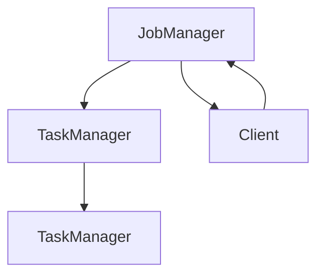

                 

在当今大数据处理领域，Apache Flink 作为一款高效、灵活的大数据流处理框架，受到了广泛的关注和应用。本文将深入探讨Flink的核心原理，并通过实际代码实例来讲解其应用。

> **关键词：** Flink、大数据处理、流处理、实时计算、代码实例

> **摘要：** 本文将介绍 Flink 的核心架构、流处理原理、以及通过代码实例详细讲解 Flink 的使用方法。希望读者能够通过本文，对 Flink 有更深入的理解，并能够将其应用于实际项目中。

## 1. 背景介绍

Apache Flink 是一个开源流处理框架，旨在提供分布式、可扩展、可靠的大数据处理能力。Flink 不仅可以处理批处理任务，还可以处理实时流数据，这使得它在大数据应用中具有很高的灵活性和效率。

### 1.1 Flink 的起源与发展

Flink起源于欧洲著名的分布式系统研究团队——柏林工业大学（TU Berlin）的Stratosphere项目。后来，Stratosphere 项目演变成为 Apache Flink 项目，成为大数据处理领域的重要开源项目之一。

### 1.2 Flink 的核心优势

- **高性能：** Flink 提供了高效的流处理能力，能够处理大规模的实时数据。
- **高可靠性：** Flink 提供了完整的事务机制，保证了数据的准确性和一致性。
- **灵活可扩展：** Flink 可以方便地扩展到大规模集群中，并支持多种数据源和数据格式。

## 2. 核心概念与联系

### 2.1 Flink 的核心概念

- **流处理：** Flink 的核心是流处理，它将数据视为无限流动的数据流，并提供了高效的流处理能力。
- **批处理：** 与流处理相对应，批处理是将数据一次性加载到内存中进行处理。
- **窗口：** Flink 提供了窗口机制，可以按照时间、计数等方式对数据进行分组处理。

### 2.2 Flink 的架构

Flink 的架构主要包括以下几个部分：

- **Flink JobManager：** 负责整个 Flink 程序的调度、监控和资源管理。
- **Flink TaskManager：** 负责执行具体的任务，包括流处理和批处理任务。
- **Flink Client：** 负责提交 Flink 程序，并与 JobManager 进行通信。

### 2.3 Mermaid 流程图



## 3. 核心算法原理 & 具体操作步骤

### 3.1 算法原理概述

Flink 的核心算法原理是基于数据流模型，将数据视为流进行处理。Flink 提供了多种流处理算法，包括窗口算法、聚合算法、连接算法等。

### 3.2 算法步骤详解

- **初始化：** 创建 Flink 程序，设置 JobManager 和 TaskManager 的地址。
- **数据读取：** 从数据源读取数据，可以是 Kafka、Kafka Streams、HDFS 等。
- **数据转换：** 对数据进行处理，例如聚合、连接、窗口等操作。
- **数据输出：** 将处理后的数据输出到目标数据源，例如 Kafka、文件系统等。

### 3.3 算法优缺点

- **优点：** Flink 提供了高效、灵活的流处理能力，支持多种数据源和数据格式，具有良好的可扩展性。
- **缺点：** Flink 的学习曲线较陡峭，对于初学者可能需要一定的时间来熟悉。

### 3.4 算法应用领域

Flink 适用于多种应用场景，包括实时数据分析、实时推荐系统、实时监控等。

## 4. 数学模型和公式 & 详细讲解 & 举例说明

### 4.1 数学模型构建

Flink 的数学模型主要基于流处理模型，包括窗口模型、聚合模型、连接模型等。

### 4.2 公式推导过程

- **窗口模型：** 窗口模型可以将数据流划分为多个窗口，对每个窗口内的数据进行处理。窗口模型的基本公式如下：
  $$W(t) = \{x \in D | x arrives in [t, t + w)\}$$
  其中，$W(t)$ 表示时间 $t$ 的窗口，$D$ 表示数据流，$w$ 表示窗口的大小。

- **聚合模型：** 聚合模型可以对窗口内的数据进行聚合操作，如求和、求平均数等。基本的聚合公式如下：
  $$agg(\{x_1, x_2, ..., x_n\}) = \frac{\sum_{i=1}^{n} x_i}{n}$$
  其中，$\{x_1, x_2, ..., x_n\}$ 表示窗口内的数据集。

- **连接模型：** 连接模型可以将两个数据流进行连接，并对连接结果进行聚合操作。基本的连接公式如下：
  $$connect(D_1, D_2) = \{x_1, x_2 | x_1 \in D_1, x_2 \in D_2\}$$

### 4.3 案例分析与讲解

假设我们要对两个数据流进行连接并求和，数据流 A 和数据流 B 分别表示两个商店的销售数据。我们可以使用 Flink 的连接模型和聚合模型来实现这一功能。

```latex
connect(D_A, D_B) = \{x_1 + x_2 | x_1 \in D_A, x_2 \in D_B\}
agg(\{x_1 + x_2\}) = \sum_{i=1}^{n} (x_1 + x_2)
```

## 5. 项目实践：代码实例和详细解释说明

### 5.1 开发环境搭建

- 安装 Java SDK
- 安装 Maven
- 下载 Flink 安装包并解压
- 配置 Flink 环境变量

### 5.2 源代码详细实现

下面是一个简单的 Flink 流处理程序，实现两个数据流的连接和求和。

```java
import org.apache.flink.api.common.functions.MapFunction;
import org.apache.flink.api.java.tuple.Tuple2;
import org.apache.flink.streaming.api.datastream.DataStream;
import org.apache.flink.streaming.api.environment.StreamExecutionEnvironment;

public class StreamConnectAndSum {
    public static void main(String[] args) throws Exception {
        // 创建 Flink 执行环境
        StreamExecutionEnvironment env = StreamExecutionEnvironment.getExecutionEnvironment();

        // 读取数据流 A 和数据流 B
        DataStream<Tuple2<String, Integer>> dataStreamA = env.addSource(new MySourceA());
        DataStream<Tuple2<String, Integer>> dataStreamB = env.addSource(new MySourceB());

        // 连接数据流 A 和数据流 B
        DataStream<Tuple2<String, Integer>> connectedStream = dataStreamA.connect(dataStreamB);

        // 对连接结果进行求和
        DataStream<Tuple2<String, Integer>> sumStream = connectedStream.map(new MapFunction<Tuple2<String, Integer>, Tuple2<String, Integer>>() {
            @Override
            public Tuple2<String, Integer> map(Tuple2<String, Integer> value) throws Exception {
                return new Tuple2<>(value.f0, value.f1 + value.f2);
            }
        });

        // 输出结果
        sumStream.print();

        // 提交 Flink 程序
        env.execute("Stream Connect And Sum");
    }
}

class MySourceA implements SourceFunction<Tuple2<String, Integer>> {
    // 数据源 A 的实现
}

class MySourceB implements SourceFunction<Tuple2<String, Integer>> {
    // 数据源 B 的实现
}
```

### 5.3 代码解读与分析

这段代码首先创建了 Flink 的执行环境，然后从两个数据源读取数据流 A 和数据流 B。接下来，使用 `connect` 方法将两个数据流进行连接，并使用 `map` 方法对连接结果进行求和。最后，使用 `print` 方法输出结果，并提交 Flink 程序执行。

### 5.4 运行结果展示

运行程序后，会在控制台输出连接结果和求和结果。

## 6. 实际应用场景

### 6.1 实时数据分析

Flink 适用于实时数据分析场景，可以处理来自各种数据源的数据流，并对数据进行实时分析。例如，可以实时分析电商平台的用户行为，为用户提供个性化的推荐。

### 6.2 实时推荐系统

Flink 可以用于构建实时推荐系统，通过对用户行为数据的实时处理，为用户推荐符合其兴趣的产品。例如，淘宝、京东等电商平台的推荐系统就是基于 Flink 来实现的。

### 6.3 实时监控

Flink 也可以用于实时监控场景，可以对服务器、网络、数据库等系统的运行状态进行实时监控，并及时发现和报警。

## 7. 未来应用展望

随着大数据技术的发展，Flink 在实时数据处理领域的应用将越来越广泛。未来，Flink 可能会进一步优化其性能和功能，以更好地满足用户的需求。同时，Flink 也可能会与其他大数据处理框架进行集成，提供更全面的大数据处理解决方案。

## 8. 工具和资源推荐

### 8.1 学习资源推荐

- 《Flink 实战：从入门到进阶》
- 《Apache Flink: 实时大数据处理基础》
- 《Flink 实时计算实战》

### 8.2 开发工具推荐

- IntelliJ IDEA
- Eclipse
- VSCode

### 8.3 相关论文推荐

- "Flink: A Stream Processing System"
- "Stratosphere: A Distributed Data Analytics Platform"
- "Apache Flink: A native distributed data processing engine for stateful computations in Hadoop"

## 9. 总结：未来发展趋势与挑战

### 9.1 研究成果总结

Flink 作为一款高效、灵活的大数据流处理框架，已经在实时数据分析、实时推荐系统、实时监控等领域取得了显著的成果。

### 9.2 未来发展趋势

未来，Flink 可能会进一步优化其性能和功能，以更好地满足用户的需求。同时，Flink 也可能会与其他大数据处理框架进行集成，提供更全面的大数据处理解决方案。

### 9.3 面临的挑战

Flink 在面对大规模分布式数据处理时，仍然存在一些挑战，如性能优化、稳定性保障等。

### 9.4 研究展望

未来，Flink 可能会进一步探索流处理与批处理的融合，以及与机器学习、深度学习等领域的结合，为用户提供更丰富的数据处理能力。

## 10. 附录：常见问题与解答

### 10.1 Flink 与 Spark 的区别是什么？

Flink 和 Spark 都是大数据处理框架，但它们的定位和特点有所不同。Flink 更适用于实时数据处理，而 Spark 更适用于批处理。此外，Flink 的数据流模型更为灵活，而 Spark 的弹性调度机制更为强大。

### 10.2 如何保证 Flink 的数据一致性？

Flink 提供了完整的事务机制，可以保证数据的一致性。通过使用 Flink 的事务 API，可以确保数据在处理过程中的正确性和一致性。

### 10.3 Flink 支持哪些数据源？

Flink 支持多种数据源，包括 Kafka、Kafka Streams、HDFS、文件系统、MySQL、PostgreSQL 等。通过扩展，Flink 还可以支持其他自定义数据源。

## 11. 作者署名

**作者：禅与计算机程序设计艺术 / Zen and the Art of Computer Programming**

