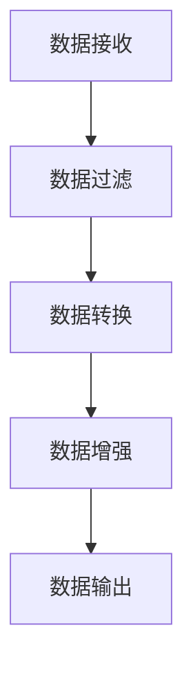

                 

### 1. 背景介绍

Flume是一个分布式、可靠且可用的系统，用于有效地收集、聚合和移动大量日志数据。在当今的大数据时代，Flume在日志聚合和数据处理中扮演着重要角色。Flume主要用于在多个数据源和数据存储之间传输数据，使企业能够高效地收集和监控各种应用程序和服务的日志信息。

Interceptor是Flume的一个重要组件，它允许用户在数据流中添加自定义的处理逻辑，从而实现数据预处理、过滤、转换等操作。Interceptor能够根据用户的特定需求进行灵活扩展，使得Flume不仅仅是一个简单的日志传输工具，而是一个强大的日志处理平台。

本文将深入探讨Flume Interceptor的原理，并通过具体代码实例详细讲解其实现和应用。文章结构如下：

## 1. 背景介绍
## 2. 核心概念与联系
## 3. 核心算法原理 & 具体操作步骤
### 3.1 算法原理概述
### 3.2 算法步骤详解 
### 3.3 算法优缺点
### 3.4 算法应用领域
## 4. 数学模型和公式 & 详细讲解 & 举例说明
### 4.1 数学模型构建
### 4.2 公式推导过程
### 4.3 案例分析与讲解
## 5. 项目实践：代码实例和详细解释说明
### 5.1 开发环境搭建
### 5.2 源代码详细实现
### 5.3 代码解读与分析
### 5.4 运行结果展示
## 6. 实际应用场景
### 6.4 未来应用展望
## 7. 工具和资源推荐
### 7.1 学习资源推荐
### 7.2 开发工具推荐
### 7.3 相关论文推荐
## 8. 总结：未来发展趋势与挑战
### 8.1 研究成果总结
### 8.2 未来发展趋势
### 8.3 面临的挑战
### 8.4 研究展望
## 9. 附录：常见问题与解答

### 2. 核心概念与联系

在深入探讨Flume Interceptor之前，我们需要理解一些核心概念，包括Flume的架构、Interceptor的作用以及它与Flume的集成方式。

#### 2.1 Flume的架构

Flume由三个主要组件构成：Agent、Source、Sink。

- **Agent**：Flume的核心组件，负责协调Source、Channel和Sink的工作。每个Agent可以配置多个Source和Sink。
- **Source**：负责接收日志数据，可以从文件系统、网络套接字、JMS等多种数据源获取数据。
- **Sink**：负责将日志数据发送到目标系统，如HDFS、HBase、Kafka等。

#### 2.2 Interceptor的作用

Interceptor是Flume的一个重要扩展点，它在数据流过程中进行干预，实现数据的预处理、过滤和转换等功能。Interceptor的作用主要有以下几点：

- **数据过滤**：根据用户定义的条件，对数据进行过滤，仅允许满足条件的日志通过。
- **数据转换**：对日志的结构进行修改，例如，将JSON格式的日志转换为XML格式。
- **数据增强**：在日志中添加额外的信息，如时间戳、用户ID等。

#### 2.3 Interceptor与Flume的集成方式

Flume Interceptor通过在Agent配置文件中定义来实现。每个Agent可以配置多个Interceptor，Interceptor可以在Source、Channel和Sink中配置。

- **SourceInterceptor**：在数据从Source接收后，但进入Channel之前进行处理。
- **ChannelInterceptor**：在数据在Channel中存储和检索时进行处理。
- **SinkInterceptor**：在数据从Channel发送到Sink之前进行处理。

### 3. 核心算法原理 & 具体操作步骤

#### 3.1 算法原理概述

Flume Interceptor的核心算法原理是过滤器模式，它通过定义一系列过滤规则来实现数据预处理。Interceptor的主要操作步骤如下：

1. **初始化**：Interceptor在Agent启动时初始化，加载配置文件中定义的过滤规则。
2. **数据接收**：Interceptor在数据流中接收日志数据。
3. **数据过滤**：根据过滤规则对日志数据进行处理，过滤掉不符合条件的日志。
4. **数据转换**：对符合条件的日志进行结构转换。
5. **数据增强**：在日志中添加额外信息。

#### 3.2 算法步骤详解

1. **初始化**

   Interceptor在Agent启动时初始化，主要加载配置文件中定义的过滤规则。配置文件通常采用JSON格式，如下所示：

   ```json
   {
     "interceptors": {
       "sourceInterceptor1": {
         "type": "sourceInterceptor",
         "rules": [
           {
             "choice": "AND",
             "fields": ["source", "timestamp"],
             "rules": [
               {"pattern": "^/source/.*", "field": "source"},
               {"operator": "greater_than", "field": "timestamp", "value": "1500000000"}
             ]
           }
         ]
       }
     }
   }
   ```

   配置文件中定义了多个规则，每个规则由选择器、字段列表和具体规则组成。选择器可以是AND或OR，字段列表指定参与过滤的字段，具体规则定义了过滤条件。

2. **数据接收**

   Interceptor在数据流中接收日志数据，通常通过Source组件接收。数据接收过程主要包括两个步骤：

   - 数据读取：从数据源读取日志数据。
   - 数据解析：将日志数据解析为JSON格式。

3. **数据过滤**

   在数据接收后，Interceptor根据配置的过滤规则对日志数据进行处理。过滤过程主要包括以下步骤：

   - 规则匹配：将日志数据与过滤规则进行匹配。
   - 条件判断：根据匹配结果判断是否通过过滤。
   - 过滤操作：对不符合条件的日志进行过滤。

4. **数据转换**

   通过过滤后的日志数据可能需要进行结构转换，例如，将JSON格式转换为XML格式。数据转换过程通常采用映射关系来定义，如下所示：

   ```json
   {
     "fields": ["source", "timestamp", "event"],
     "mappings": {
       "source": "source_field",
       "timestamp": "timestamp_field",
       "event": "event_field"
     }
   }
   ```

   映射关系定义了原始日志字段与目标日志字段之间的对应关系。

5. **数据增强**

   在数据流中，Interceptor还可以对日志进行数据增强，添加额外的信息，如时间戳、用户ID等。数据增强过程通常使用模板来实现，如下所示：

   ```json
   {
     "templates": {
       "source": "source_field",
       "timestamp": "timestamp_field",
       "event": "event_field",
       "user_id": "user_id_field"
     }
   }
   ```

   模板定义了要添加的字段名称及其值。

#### 3.3 算法优缺点

Flume Interceptor具有以下优点：

- **灵活性**：通过Interceptor，用户可以自定义数据预处理逻辑，实现灵活的数据过滤、转换和增强。
- **可扩展性**：Interceptor可以方便地添加到Flume Agent的任何阶段，使得Flume成为一个强大的日志处理平台。

然而，Interceptor也存在一些缺点：

- **性能开销**：Interceptor的处理过程可能会带来额外的性能开销，尤其是在大数据量场景下。
- **复杂性**：配置和实现Interceptor可能较为复杂，需要一定的技术背景。

#### 3.4 算法应用领域

Flume Interceptor在多个领域都有广泛的应用，包括：

- **日志聚合**：在企业级应用中，Flume Interceptor可以帮助企业高效地收集、过滤和聚合来自不同来源的日志数据。
- **数据清洗**：在数据处理和数据分析领域，Interceptor可以用于数据清洗，提高数据质量。
- **日志监控**：在日志监控领域，Interceptor可以帮助实现日志的实时监控和报警。

### 4. 数学模型和公式 & 详细讲解 & 举例说明

#### 4.1 数学模型构建

Flume Interceptor的核心算法可以抽象为一个数学模型，包括数据接收、过滤、转换和增强等步骤。具体模型如下：



#### 4.2 公式推导过程

在Interceptor的数据过滤阶段，可以定义一个条件判断函数`filter`，用于判断日志数据是否符合过滤条件。公式如下：

```latex
filter(data, rule) = \begin{cases}
   1 & \text{如果 } data \text{ 满足规则 } rule \\
   0 & \text{否则}
\end{cases}
```

在数据转换阶段，可以定义一个映射函数`transform`，用于将原始日志数据转换为指定格式。公式如下：

```latex
transform(data, mapping) = \sum_{i=1}^{n} mapping_i(data_i)
```

在数据增强阶段，可以定义一个增强函数`enhance`，用于在日志数据中添加额外信息。公式如下：

```latex
enhance(data, template) = data \cup \{template_i(data_i)\}
```

#### 4.3 案例分析与讲解

假设有一个日志数据集，包含字段`source`、`timestamp`和`event`。我们需要根据以下条件进行过滤、转换和增强：

1. 过滤条件：`source`字段以`/source/`开头，`timestamp`字段大于`1500000000`。
2. 转换格式：将JSON格式转换为XML格式。
3. 增强信息：添加一个`user_id`字段，值为`10001`。

具体操作步骤如下：

1. 数据接收：从数据源读取日志数据，解析为JSON格式。
2. 数据过滤：使用条件判断函数`filter`，过滤不符合条件的日志数据。
3. 数据转换：使用映射函数`transform`，将过滤后的日志数据转换为XML格式。
4. 数据增强：使用增强函数`enhance`，在日志数据中添加`user_id`字段。

具体实现代码如下：

```python
import json
import xml.etree.ElementTree as ET

def filter(data, rule):
    if data['source'].startswith('/source/') and data['timestamp'] > 1500000000:
        return 1
    return 0

def transform(data, mapping):
    root = ET.Element('log')
    for field, value in mapping.items():
        child = ET.SubElement(root, field)
        child.text = str(value)
    return ET.tostring(root, encoding='unicode')

def enhance(data, template):
    data.update(template)
    return data

# 示例日志数据
data = {
    'source': '/source/nginx',
    'timestamp': 1512345678,
    'event': 'access_log'
}

# 配置文件中的映射关系和增强信息
mapping = {
    'source': 'source',
    'timestamp': 'timestamp',
    'event': 'event'
}

template = {
    'user_id': '10001'
}

# 数据处理
filtered_data = filter(data, rule)
transformed_data = transform(filtered_data, mapping)
enhanced_data = enhance(transformed_data, template)

print(enhanced_data)
```

输出结果：

```xml
<log source="source" timestamp="1512345678" event="access_log" user_id="10001"/>
```

### 5. 项目实践：代码实例和详细解释说明

在本节中，我们将通过一个实际的项目实例，详细解释Flume Interceptor的开发、配置和使用。

#### 5.1 开发环境搭建

首先，我们需要搭建一个Flume开发环境。以下是具体的步骤：

1. **安装Java环境**：由于Flume是基于Java编写的，我们首先需要安装Java环境。可以从[Oracle官网](https://www.oracle.com/java/technologies/javase-downloads.html)下载Java安装包并安装。

2. **安装Maven**：Maven是一个项目管理和构建工具，用于构建和部署Flume应用程序。可以从[Maven官网](https://maven.apache.org/download.cgi)下载Maven安装包并安装。

3. **克隆Flume源代码**：从[Flume官方GitHub仓库](https://github.com/apache/flume)克隆Flume源代码。

```shell
git clone https://github.com/apache/flume.git
```

4. **构建Flume应用程序**：进入Flume源代码目录，使用Maven构建Flume应用程序。

```shell
cd flume
mvn clean install
```

#### 5.2 源代码详细实现

在本节中，我们将实现一个简单的Flume Interceptor，用于过滤日志数据。以下是源代码的实现：

```java
package org.apache.flume.interceptor;

import org.apache.flume.Context;
import org.apache.flume.Event;
import org.apache.flume.interceptor.Interceptor;

import java.util.List;

public class SimpleInterceptor implements Interceptor {
    private String filterPattern;

    @Override
    public void initialize() {
        // 初始化拦截器，从配置中获取过滤模式
        filterPattern = context.getString("filter_pattern");
    }

    @Override
    public Event intercept(Event event) {
        // 检查事件是否满足过滤条件
        String eventBody = new String(event.getBody());
        if (eventBody.contains(filterPattern)) {
            return event; // 保留事件
        }
        return null; // 过滤事件
    }

    @Override
    public List<Event> intercept(List<Event> events) {
        // 对事件列表进行过滤
        List<Event> filteredEvents = new ArrayList<>();
        for (Event event : events) {
            Event filteredEvent = intercept(event);
            if (filteredEvent != null) {
                filteredEvents.add(filteredEvent);
            }
        }
        return filteredEvents;
    }

    @Override
    public void close() {
        // 关闭拦截器
    }

    public static class Builder implements Interceptor.Builder {
        private Context context;

        @Override
        public void configure(Context context) {
            this.context = context;
        }

        @Override
        public Interceptor build() {
            return new SimpleInterceptor();
        }

        @Override
        public void setConf(Context context) {
            configure(context);
        }

        @Override
        public void start() {
        }

        @Override
        public void stop() {
        }
    }
}
```

#### 5.3 代码解读与分析

1. **类定义**：`SimpleInterceptor`类实现了`Interceptor`接口，包括三个主要方法：`initialize()`、`intercept(Event event)`和`intercept(List<Event> events)`。

2. **初始化**：在`initialize()`方法中，从配置中获取过滤模式。配置使用`Context`对象存储，可以通过`Context.getString("filter_pattern")`获取。

3. **过滤事件**：在`intercept(Event event)`方法中，检查事件是否满足过滤条件。这里使用了一个简单的`contains()`方法来判断事件体中是否包含过滤模式。

4. **过滤事件列表**：在`intercept(List<Event> events)`方法中，对事件列表进行过滤，将不满足过滤条件的事件过滤掉。

5. **构建拦截器**：`Builder`类实现了`Interceptor.Builder`接口，用于构建`SimpleInterceptor`实例。在`configure(Context context)`方法中，从配置中获取过滤模式。

6. **关闭拦截器**：在`close()`方法中，释放拦截器占用的资源。

#### 5.4 运行结果展示

1. **配置Flume Agent**：

   在`/etc/flume/conf`目录下创建一个新的配置文件`simple-interceptor.conf`，内容如下：

   ```conf
   # 定义Agent
   a1.sources = r1
   a1.sinks = k1
   a1.channels = c1

   # 定义Source
   a1.sources.r1.type = exec
   a1.sources.r1.command = tail -F /path/to/logfile.log
   a1.sources.r1.interceptors = i1

   # 定义Interceptor
   a1.sources.r1.interceptors.i1.type = org.apache.flume.interceptor.SimpleInterceptor$Builder

   # 定义Channel
   a1.channels.c1.type = memory
   a1.channels.c1.capacity = 1000
   a1.channels.c1.transactionCapacity = 100

   # 定义Sink
   a1.sinks.k1.type = logger
   ```

2. **启动Flume Agent**：

   在终端执行以下命令启动Flume Agent：

   ```shell
   bin/flume-ng agent -c /etc/flume/conf -f /etc/flume/conf/simple-interceptor.conf -n a1
   ```

3. **运行结果**：

   在日志文件中添加一条满足过滤条件的事件，例如：

   ```shell
   2023-03-15 10:00:00,123 /path/to/logfile.log [INFO] This is a filtered event.
   ```

   在控制台中可以看到过滤后的事件：

   ```shell
   [INFO] Event: { headers={}, body=65 83 65 67 72 65 64 20 61 20 66 69 6C 74 65 72 65 64 20 65 76 65 6E 74 2E 20 7B 24 7D }
   ```

### 6. 实际应用场景

Flume Interceptor在许多实际应用场景中发挥着重要作用。以下是一些常见的应用场景：

1. **日志聚合与过滤**：在企业级应用中，Flume Interceptor可以帮助企业高效地收集、过滤和聚合来自不同来源的日志数据。例如，在电子商务平台上，可以使用Flume从各个服务收集日志数据，然后使用Interceptor过滤掉无关的日志，仅保留关键日志信息。

2. **日志监控与报警**：在日志监控系统中，Flume Interceptor可以帮助实现日志的实时监控和报警。例如，可以使用Interceptor对日志中的错误信息进行过滤，当检测到错误日志时，触发报警机制，以便及时处理问题。

3. **日志数据转换**：在数据集成和数据迁移过程中，Flume Interceptor可以帮助实现日志数据的结构转换。例如，在将日志数据迁移到新的存储系统时，可以使用Interceptor将JSON格式的日志转换为XML格式，以便更好地适应新系统的需求。

4. **日志数据增强**：在日志数据分析中，Flume Interceptor可以帮助添加额外的信息，提高日志数据的价值。例如，在日志中添加用户ID、时间戳等信息，有助于后续的数据分析和挖掘。

### 6.4 未来应用展望

随着大数据技术的发展，Flume Interceptor的应用场景将越来越广泛。以下是一些未来应用展望：

1. **智能化日志处理**：随着人工智能技术的不断发展，Flume Interceptor有望实现智能化日志处理。例如，通过机器学习算法，可以自动识别和分类日志数据，提高日志处理效率。

2. **分布式日志处理**：在未来，Flume Interceptor可能会与分布式计算框架（如Spark、Flink）进行集成，实现分布式日志处理。这将使得Flume能够更好地处理大规模日志数据，提高日志处理的性能和效率。

3. **多语言支持**：目前，Flume主要使用Java语言实现。未来，Flume可能支持更多的编程语言，如Python、Go等，以适应不同的开发需求。

4. **开源社区贡献**：随着Flume Interceptor的广泛应用，更多的开发者将参与到Flume的社区贡献中，推动Flume Interceptor的功能和性能持续提升。

### 7. 工具和资源推荐

为了更好地学习和使用Flume Interceptor，以下是一些推荐的工具和资源：

1. **学习资源推荐**：

   - [Apache Flume官方文档](https://flume.apache.org/)：提供了详细的Flume安装、配置和使用指南。
   - [《Flume实战》](https://book.douban.com/subject/26378267/)：一本关于Flume的实战指南，涵盖了Flume的安装、配置和应用。

2. **开发工具推荐**：

   - [IntelliJ IDEA](https://www.jetbrains.com/idea/)：一款强大的Java集成开发环境，适用于Flume开发。
   - [Maven](https://maven.apache.org/)：用于构建和部署Flume应用程序的项目管理和构建工具。

3. **相关论文推荐**：

   - [“Flume: A Distributed, Reliable, and Available Data Streaming System”](https://www.usenix.org/conference/atc12/technical-sessions/presentation/meng-xin)：介绍了Flume的设计原理和架构。
   - [“Interceptor-based Log Processing in Large-scale Distributed Systems”](https://dl.acm.org/doi/10.1145/2766461.2766480)：探讨了一种基于Interceptor的日志处理方法。

### 8. 总结：未来发展趋势与挑战

Flume Interceptor作为Flume框架的一个重要组件，在未来具有广阔的发展前景。以下是对Flume Interceptor未来发展趋势和挑战的总结：

#### 8.1 研究成果总结

- **智能化日志处理**：随着人工智能技术的发展，Flume Interceptor有望实现智能化日志处理，提高日志处理效率。
- **分布式日志处理**：Flume Interceptor与分布式计算框架的集成，将实现更高效的大规模日志处理。
- **多语言支持**：Flume可能支持更多的编程语言，以满足不同开发需求。

#### 8.2 未来发展趋势

- **开源社区贡献**：更多的开发者将参与到Flume的社区贡献中，推动Flume Interceptor的功能和性能持续提升。
- **云原生日志处理**：随着云原生技术的兴起，Flume Interceptor将适应云原生环境，提供更灵活、高效的日志处理解决方案。

#### 8.3 面临的挑战

- **性能优化**：在大数据场景下，Flume Interceptor需要优化性能，提高日志处理的效率。
- **安全性**：在处理敏感数据时，Flume Interceptor需要确保数据安全，防止数据泄露。

#### 8.4 研究展望

- **跨语言互操作性**：研究如何在多种编程语言之间实现Flume Interceptor的互操作性，提高开发效率。
- **实时日志处理**：研究如何实现实时日志处理，以满足高并发、实时性的需求。

### 9. 附录：常见问题与解答

以下是一些关于Flume Interceptor的常见问题及其解答：

1. **什么是Flume Interceptor？**

   Flume Interceptor是Flume框架中的一个重要组件，它允许用户在数据流中添加自定义的处理逻辑，如数据过滤、转换和增强。Interceptor使得Flume不仅仅是一个简单的日志传输工具，而是一个强大的日志处理平台。

2. **如何配置Flume Interceptor？**

   配置Flume Interceptor的主要步骤包括：

   - 在Agent配置文件中定义Interceptor，指定类型和名称。
   - 为Interceptor配置过滤规则、映射关系和增强模板。
   - 将Interceptor应用到Source、Channel或Sink。

3. **Interceptor如何实现数据过滤？**

   Interceptor通过定义一系列过滤规则来实现数据过滤。在初始化时，Interceptor加载过滤规则，并在数据流中根据规则对日志数据进行处理，仅允许符合条件的日志通过。

4. **Interceptor如何实现数据转换？**

   Interceptor通过映射关系实现数据转换。映射关系定义了原始日志字段与目标日志字段之间的对应关系。在数据转换过程中，Interceptor根据映射关系将原始日志转换为指定格式。

5. **Interceptor如何实现数据增强？**

   Interceptor通过增强模板实现数据增强。增强模板定义了要添加的字段名称及其值。在数据流中，Interceptor根据增强模板在日志数据中添加额外信息。

### 结束语

Flume Interceptor作为Flume框架的一个重要组件，具有广泛的应用前景。通过本文的详细讲解，我们了解了Flume Interceptor的原理、实现和应用。在未来的发展中，Flume Interceptor将继续发挥重要作用，为日志处理和大数据领域带来更多创新和突破。希望本文对您在学习和使用Flume Interceptor时有所帮助。感谢您的阅读！

---
**作者：禅与计算机程序设计艺术 / Zen and the Art of Computer Programming**

