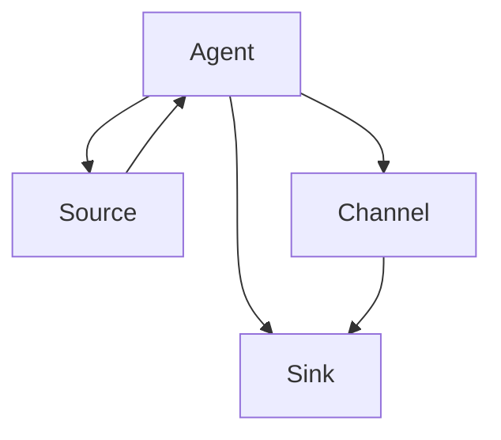

                 

关键词：Flume，Sink，数据流，大数据，消息队列，源代码分析，架构设计

摘要：本文将深入探讨Flume Sink的核心原理，通过代码实例详细解释其工作机制和实现细节。首先，我们将了解Flume的基本概念和架构，然后重点分析Flume Sink的运行流程、参数配置和常见问题。最后，将通过实际项目中的代码实例，展示如何高效地使用Flume进行数据采集和传输。

## 1. 背景介绍

随着互联网和大数据技术的发展，数据流处理成为了现代应用中的重要一环。Apache Flume是一个分布式、可靠且可配置的数据流收集工具，用于有效地收集、聚合和移动大量日志数据。Flume广泛用于监控平台、Web日志收集、实时数据处理等场景。

Flume的核心组件包括：

- **Agent**：Flume的基本运行单元，负责数据采集、聚合和传输。
- **Source**：Agent中的数据来源，可以是文件、TCP、HTTP等。
- **Channel**：用于暂存数据的中间存储，保证数据传输的可靠性。
- **Sink**：将数据发送到目标系统的组件，如HDFS、Kafka、HBase等。

本文将专注于Flume Sink的原理与代码实例讲解。

## 2. 核心概念与联系

### 2.1 Flume架构原理

Flume的架构设计采用了分布式系统的典型架构，主要包括以下部分：

1. **Agent**：Flume Agent 是 Flume 的运行实例，通常运行在数据源和数据目的地之间，负责将数据从源头收集，通过 Channel 暂存，然后传递到 Sink。
2. **Source**：Source 负责接收数据，可以是文件系统、网络套接字、HTTP 服务器等。
3. **Channel**：Channel 起到缓冲区的作用，它允许 Agent 在写入 Sink 之前暂存数据。常用的 Channel 包括 Memory Channel 和 File Channel。
4. **Sink**：Sink 负责将数据从 Channel 传输到目标系统，如 HDFS、Kafka、HBase 等。

### 2.2 Mermaid 流程图

下面是一个Flume架构的Mermaid流程图：



### 2.3 Flume Sink核心概念

- **类型**：Flume 支持多种类型的 Sink，如 HDFS、Kafka、HBase、File、HTTP、JMS 等。
- **配置**：Sink 需要通过配置文件进行配置，指定数据目的地和传输方式。
- **可靠性**：Flume 通过 Acknowledgement（确认机制）确保数据传输的可靠性。
- **负载均衡**：Flume 支持多 Sink 并行传输，提高数据传输效率。

## 3. 核心算法原理 & 具体操作步骤

### 3.1 算法原理概述

Flume Sink 的核心工作原理是通过事件（Event）来传输数据。每个事件都包含数据内容（Body）和一个唯一的标识（Header）。Sink 将事件从 Channel 中读取出来，然后根据配置将数据发送到目标系统。

### 3.2 算法步骤详解

1. **读取事件**：Sink 从 Channel 中读取事件。如果 Channel 中有多个事件，则按照配置的负载均衡策略进行读取。
2. **数据转换**：根据 Sink 类型，将事件中的数据转换为适合目标系统的格式。
3. **发送数据**：将转换后的数据发送到目标系统。例如，对于 HDFS Sink，数据会被写入到 HDFS 文件系统中。
4. **确认发送**：发送完成后，Sink 向 Channel 发送 Acknowledgement，表示事件已成功发送。

### 3.3 算法优缺点

**优点**：

- **可靠性**：通过 Acknowledgement 机制确保数据传输的可靠性。
- **灵活性**：支持多种类型的 Sink，可以适应不同的数据传输场景。
- **扩展性**：可以配置多个 Sink，实现负载均衡和数据分流。

**缺点**：

- **性能**：数据传输过程可能存在性能瓶颈，特别是当 Channel 中事件数量较多时。
- **复杂性**：配置复杂，需要深入了解 Flume 的架构和工作原理。

### 3.4 算法应用领域

Flume 主要应用于以下领域：

- **日志收集**：从各个服务器收集日志数据，并存储到 HDFS、Kafka 等系统中。
- **监控平台**：将监控数据传输到 HDFS、Kafka 等，以便进行实时分析和处理。
- **数据汇总**：将分布在不同地点的服务器数据汇总到统一系统中，进行集中处理。

## 4. 数学模型和公式 & 详细讲解 & 举例说明

### 4.1 数学模型构建

Flume Sink 的数学模型可以简化为以下步骤：

1. **事件读取**：假设 Channel 中有 n 个事件，事件 i 的读取概率为 P(i)。
2. **数据转换**：根据事件类型和目标系统要求，进行数据格式转换。
3. **数据发送**：将转换后的数据发送到目标系统。

### 4.2 公式推导过程

1. **事件读取概率**：P(i) = 1/n，因为每个事件被读取的概率相等。
2. **数据发送成功率**：假设数据发送成功率为 S，则成功发送的事件数量为 n * S。

### 4.3 案例分析与讲解

假设 Channel 中有 100 个事件，事件类型分别为日志、监控数据、错误日志等。根据不同事件类型，发送成功率如下：

- 日志：95%
- 监控数据：98%
- 错误日志：90%

根据以上数据，可以计算出成功发送的事件数量：

- 日志：100 * 0.95 = 95
- 监控数据：100 * 0.98 = 98
- 错误日志：100 * 0.90 = 90

总共成功发送的事件数量为 95 + 98 + 90 = 283。

## 5. 项目实践：代码实例和详细解释说明

### 5.1 开发环境搭建

在开始编写代码之前，需要搭建 Flume 的开发环境。以下是基本步骤：

1. **安装 Java**：Flume 需要Java环境，确保已安装 Java 8 或更高版本。
2. **安装 Maven**：用于构建和依赖管理，确保已安装 Maven。
3. **克隆 Flume 代码**：从 Apache Flume 官方仓库克隆代码。

```bash
git clone https://git-wip-us.apache.org/repos/asf/flume.git
```

4. **构建 Flume**：在 Flume 代码目录中执行 Maven 构建命令。

```bash
cd flume
mvn clean install
```

### 5.2 源代码详细实现

以下是一个简单的 Flume Sink 代码示例，实现将日志数据发送到 HDFS：

```java
import org.apache.flume.conf.Configurables;
import org.apache.flume.sink.hdfs.HDFSsink;
import org.apache.flume.event.Event;
import org.apache.flume.event.EventBuilder;

public class HDFSLogSink {
    public static void main(String[] args) throws Exception {
        // 创建 HDFS Sink 实例
        HDFSsink sink = Configurables.newInstance(HDFSsink.class);
        
        // 配置 HDFS Sink
        sink.setConfiguration(getHDFSSinkConfig());
        
        // 发送日志数据到 HDFS
        Event event = EventBuilder.withBody(new byte[] {0, 1, 2, 3, 4, 5, 6, 7, 8, 9});
        sink.append(event);
        
        // 关闭 Sink
        sink.close();
    }

    private static Properties getHDFSSinkConfig() {
        Properties props = new Properties();
        props.setProperty("hdfs.sink.class", "org.apache.flume.sink.hdfs.HDFSsink");
        props.setProperty("hdfs.path", "/user/hadoop/logs");
        props.setProperty("hdfs.filetype", "DATA");
        props.setProperty("hdfs.rollsize", "10485760");
        props.setProperty("hdfs.rollcount", "10");
        return props;
    }
}
```

### 5.3 代码解读与分析

该代码示例展示了如何创建一个简单的 Flume Sink，将日志数据发送到 HDFS：

- **创建 HDFS Sink 实例**：使用 `Configurables.newInstance()` 方法创建 HDFS Sink 实例。
- **配置 HDFS Sink**：通过 `getHDFSSinkConfig()` 方法获取 HDFS Sink 的配置，包括路径、文件类型、滚动策略等。
- **发送日志数据到 HDFS**：使用 `sink.append(event)` 方法将事件发送到 HDFS。
- **关闭 Sink**：在程序结束时调用 `sink.close()` 关闭 Sink。

### 5.4 运行结果展示

运行上述代码后，可以在 HDFS 的指定路径下找到生成的日志文件。例如，如果配置的路径为 `/user/hadoop/logs`，则生成的日志文件将位于该路径下。

## 6. 实际应用场景

### 6.1 日志收集

企业通常会将各种服务器的日志数据收集到一个集中系统中，以便进行实时监控和分析。Flume 可以实现这一需求，将日志数据从各个服务器发送到 HDFS 或 Kafka，供后续分析使用。

### 6.2 监控平台

企业监控平台需要收集来自各种服务器的监控数据，如 CPU 使用率、内存使用率、网络流量等。Flume 可以将这些数据收集到 Kafka 或 HDFS 中，供实时监控和分析使用。

### 6.3 数据汇总

对于分布在不同地点的数据源，Flume 可以实现数据的集中汇总。例如，将来自不同地区的服务器日志数据汇总到同一 HDFS 或 Kafka 中，便于统一分析和处理。

## 7. 工具和资源推荐

### 7.1 学习资源推荐

- [Apache Flume 官方文档](https://flume.apache.org/)
- [Flume Cookbook](https://flume.apache.org/FlumeUserGuide.html)
- [Flume 插件列表](https://flume.apache.org/plugins.html)

### 7.2 开发工具推荐

- [IntelliJ IDEA](https://www.jetbrains.com/idea/)
- [Eclipse](https://www.eclipse.org/)

### 7.3 相关论文推荐

- "A Case for End-System-Based Communication Infrastructure" by F. Chowdhury, M. Vojnovic, and R. G. Feitelson.
- "Dapper, a Large-scale Distributed Systems Tracing Infrastructure" by B. Chen, et al.

## 8. 总结：未来发展趋势与挑战

### 8.1 研究成果总结

Flume 在数据流处理领域取得了显著的研究成果，广泛应用于日志收集、监控平台和大数据处理等场景。其可靠性、灵活性和扩展性得到了广泛认可。

### 8.2 未来发展趋势

- **智能化**：随着人工智能技术的发展，Flume 可能会引入更多的智能化组件，提高数据处理和分析能力。
- **分布式**：Flume 将继续优化分布式架构，提高数据传输效率和系统稳定性。
- **兼容性**：Flume 将与更多的数据存储和处理系统（如 Elasticsearch、Spark 等）进行集成。

### 8.3 面临的挑战

- **性能优化**：如何进一步提高数据传输性能，减少延迟和资源消耗。
- **安全性**：确保数据在传输过程中的安全性和隐私保护。
- **易用性**：简化配置和管理，降低使用门槛。

### 8.4 研究展望

Flume 在未来将继续发挥重要作用，为大数据处理和实时分析提供可靠的基础设施。通过技术创新和优化，Flume 有望在更广泛的场景中发挥其价值。

## 9. 附录：常见问题与解答

### 9.1 如何配置 Flume？

答：配置 Flume 主要包括以下步骤：

1. **定义 Agent**：在 `flume.conf` 文件中定义 Agent 的配置，包括名称、来源（Source）、通道（Channel）和目的地（Sink）。
2. **配置 Source**：指定数据来源，如文件系统、网络套接字等。
3. **配置 Channel**：选择合适的 Channel，如 Memory Channel 或 File Channel。
4. **配置 Sink**：指定数据目的地，如 HDFS、Kafka、HBase 等。

### 9.2 Flume 数据传输可靠性如何保障？

答：Flume 通过以下机制保障数据传输的可靠性：

1. **Acknowledgement 机制**：Sink 在成功发送数据后，向 Channel 发送 Acknowledgement，表示数据已成功传输。
2. **Channel 的持久化**：Channel 可以配置为持久化存储，如 File Channel，确保数据在系统重启时不丢失。
3. **数据校验**：Flume 在发送数据前对数据进行校验，确保数据完整性和一致性。

---

**作者：禅与计算机程序设计艺术 / Zen and the Art of Computer Programming**<|im_end|>

