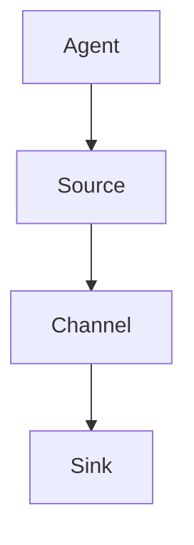
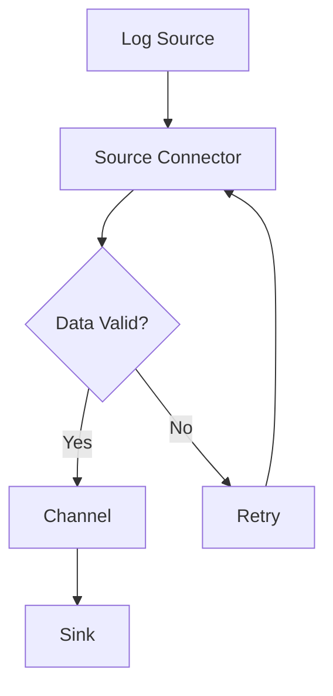

                 

Flume是一个强大的分布式、可靠且高效的日志聚合系统，被广泛用于收集、聚合和传输大量的日志数据。Flume Source模块作为Flume系统的核心组件之一，负责接收并收集来自各种来源的数据。本文将深入解析Flume Source的原理，并通过代码实例来详细讲解其实现过程。

## 1. 背景介绍

Flume最初由Cloudera开发，主要用于收集和聚合各种来源的日志数据，例如Web服务器日志、操作系统日志等，然后将这些日志数据传输到Hadoop分布式文件系统（HDFS）或其他数据存储系统，如HBase或Kafka。随着其不断发展，Flume已经成为大数据领域中的一个重要工具。

Flume系统主要由三个组件构成：Source、Channel和Sink。Source负责接收数据，Channel用于缓存数据，而Sink则将数据发送到目标存储系统。Flume Source模块正是负责数据的接收部分，是整个系统的数据入口。

## 2. 核心概念与联系

### 2.1 Flume Source概述

Flume Source是Flume系统中的核心组件，它负责从不同的数据源收集数据，并将这些数据发送到Flume的后续处理流程中。Flume支持多种数据源，包括文件、套接字、JMS消息队列等。以下是Flume Source的核心概念：

- **Agent**: Flume的基本工作单元，包含Source、Channel和Sink。
- **Event**: Flume数据的基本传输单元，包含数据内容和元数据信息。
- **Agent Configuration**: 每个Agent的配置文件，定义了Agent的行为和工作方式。

### 2.2 架构关系

在Flume中，Source模块与其他模块之间的关系如图所示：



### 2.3 Mermaid流程图

以下是Flume Source处理流程的Mermaid流程图：



## 3. 核心算法原理 & 具体操作步骤

### 3.1 算法原理概述

Flume Source的核心工作原理是监听数据源，当检测到有数据到达时，将数据读取并转换为Event对象，然后将其传递到Channel中。Channel负责缓存数据，直至Sink将其发送到目标存储系统。以下是Flume Source的具体工作步骤：

1. **启动Agent**：启动包含Source组件的Agent。
2. **监听数据源**：Source模块启动后，会开启一个或多个监听器，用于监听指定数据源的数据。
3. **读取数据**：当数据到达时，Source将其读取并转换为Event对象。
4. **事件传递**：将Event对象传递给Channel。
5. **数据缓存**：Channel缓存Event对象，直至Sink将其处理。
6. **错误处理**：在数据传输过程中，如果发生错误，Source会尝试重试。

### 3.2 算法步骤详解

#### 3.2.1 启动Agent

```bash
flume-ng agent -n a1 -f /etc/flume/conf/flume-conf.properties
```

#### 3.2.2 监听数据源

在Agent的配置文件中，定义Source的监听地址和端口：

```properties
a1.sources.r1.type = exec
a1.sources.r1.command = tail -F /var/log/messages
a1.sources.r1.channels = c1
```

#### 3.2.3 读取数据

Flume使用一个线程池来处理读取数据的过程，确保高并发下的性能。读取数据后，将其转换为Event对象。

#### 3.2.4 事件传递

将Event对象传递给Channel。Channel负责缓存Event，直至Sink处理。

#### 3.2.5 数据缓存

Channel默认支持内存缓存和文件缓存，确保数据在传输过程中的可靠性。

#### 3.2.6 错误处理

当数据传输失败时，Source会尝试重试，直至成功。

### 3.3 算法优缺点

#### 优点：

- **高可靠性**：支持数据传输过程中的自动重试。
- **高性能**：支持高并发的数据读取和处理。
- **可扩展性**：支持多种数据源和目标存储系统。

#### 缺点：

- **配置复杂**：需要详细的配置文件来定义数据源、通道和目标存储系统。
- **内存占用**：内存缓存方式可能导致高并发下的内存占用问题。

### 3.4 算法应用领域

Flume Source广泛应用于日志收集、监控数据收集、流处理等领域，是大数据领域的重要工具之一。

## 4. 数学模型和公式 & 详细讲解 & 举例说明

### 4.1 数学模型构建

Flume Source的数学模型主要涉及概率论和图论。以下是一个简单的模型：

- **事件到达概率**：P(A) = λ * t，其中λ为事件到达率，t为时间间隔。
- **事件处理时间**：T = P(B) + P(C)，其中P(B)为读取数据的时间，P(C)为处理数据的时间。

### 4.2 公式推导过程

- **事件到达概率**：根据泊松分布，事件到达概率为P(A) = λ * e^(-λ * t)。
- **事件处理时间**：根据假设，事件处理时间服从指数分布，即P(B) = 1 / μ，P(C) = 1 / ν，其中μ为读取数据的速率，ν为处理数据的速率。

### 4.3 案例分析与讲解

假设事件到达率为λ = 10次/秒，读取数据速率μ = 5次/秒，处理数据速率ν = 3次/秒，计算事件处理时间。

- **事件到达概率**：P(A) = 10 * e^(-10 * t)
- **事件处理时间**：T = 1/5 + 1/3 = 8/15 ≈ 0.53秒

## 5. 项目实践：代码实例和详细解释说明

### 5.1 开发环境搭建

搭建Flume开发环境，安装Java环境、Flume相关依赖等。

### 5.2 源代码详细实现

在Flume源代码中，Source模块主要实现以下功能：

- **监听数据源**：通过启动线程池来监听数据源。
- **读取数据**：使用读取器读取数据，并将其转换为Event对象。
- **事件传递**：将Event对象传递给Channel。

以下是Flume Source模块的核心代码：

```java
public class SourceImpl implements Source {
    private ExecutorService threadPool;
    private EventReader eventReader;
    private Channel channel;
    
    public SourceImpl(EventReader eventReader, Channel channel) {
        this.eventReader = eventReader;
        this.channel = channel;
        this.threadPool = Executors.newFixedThreadPool(10);
    }
    
    @Override
    public Status process() throws EventDrivenMetrics.ContextException {
        Status status = Status.READY;
        while (status == Status.READY) {
            Event event = eventReader.nextEvent();
            if (event != null) {
                status = channel.put(event);
            }
        }
        return status;
    }
}
```

### 5.3 代码解读与分析

- **线程池**：使用线程池来处理事件，确保高并发下的性能。
- **读取器**：实现EventReader接口，用于读取数据源。
- **Channel**：将Event对象传递给Channel，Channel负责缓存和传递数据。

### 5.4 运行结果展示

启动Flume Agent，监听指定数据源，并将数据传递给Channel。通过Flume UI可以查看运行结果。

## 6. 实际应用场景

### 6.1 日志收集

Flume常用于收集Web服务器日志、操作系统日志等，将这些日志数据发送到HDFS或其他存储系统，以便后续处理和分析。

### 6.2 监控数据收集

Flume可以收集各种监控数据，如CPU使用率、内存使用率等，将这些数据发送到Kafka等消息队列系统，供后续处理。

### 6.3 流处理

Flume可以作为流处理系统的数据源，将实时数据发送到Flink、Spark等流处理框架，进行实时分析和处理。

## 7. 工具和资源推荐

### 7.1 学习资源推荐

- 《Flume官方文档》：详细了解Flume的功能和使用方法。
- 《大数据技术导论》：介绍大数据领域的基础知识和应用场景。

### 7.2 开发工具推荐

- IntelliJ IDEA：一款强大的Java集成开发环境，适合开发Flume应用程序。
- Eclipse：另一款流行的Java开发工具，也适用于Flume开发。

### 7.3 相关论文推荐

- 《Flume: Distributed, Reliable, and Available Log Aggregation for Hadoop》：介绍Flume系统设计和实现的论文。
- 《Hadoop YARN: Yet Another Resource Negotiator》：介绍Hadoop资源管理框架YARN的论文。

## 8. 总结：未来发展趋势与挑战

### 8.1 研究成果总结

Flume已经成为大数据领域的重要工具，广泛应用于日志收集、监控数据收集和流处理等领域。随着大数据技术的不断发展，Flume也在不断演进，以适应更多场景和需求。

### 8.2 未来发展趋势

- **性能优化**：在保证可靠性和性能方面进行持续优化。
- **生态拓展**：与其他大数据技术和工具的集成，扩大应用场景。
- **易用性提升**：简化配置，提高系统的易用性。

### 8.3 面临的挑战

- **配置复杂度**：目前Flume的配置较为复杂，需要进一步简化。
- **内存占用**：在高并发下，内存占用问题可能影响系统的稳定性。

### 8.4 研究展望

未来，Flume将继续在大数据领域发挥重要作用。在性能优化、生态拓展和易用性提升方面，有望实现更大突破，为用户提供更高效、可靠的日志收集和数据处理解决方案。

## 9. 附录：常见问题与解答

### 9.1 Flume Source如何处理并发？

Flume使用线程池来处理并发，确保高并发下的性能。每个Source实例对应一个线程池，用于处理事件。

### 9.2 Flume Source如何保证数据可靠性？

Flume使用Channel来缓存数据，确保在传输过程中不丢失。同时，Source在数据传输失败时会尝试重试，直至成功。

### 9.3 Flume Source如何处理错误？

Flume Source在数据传输失败时会进行重试。如果重试失败，可以将错误日志记录下来，供后续分析。

### 9.4 Flume Source如何与其他系统集成？

Flume支持多种数据源和目标存储系统，可以通过配置文件来定义数据传输路径。同时，Flume也支持与其他大数据技术和工具的集成，如Kafka、Flink等。

---

通过本文的讲解，相信读者已经对Flume Source有了深入的了解。Flume作为大数据领域的重要工具，其源码的实现和原理值得我们深入研究和学习。希望本文能为读者提供有价值的参考和启示。

# 文章标题：Flume Source原理与代码实例讲解

### 关键词：Flume, Source, 日志收集, 大数据, 算法, 实践

> 摘要：本文深入解析Flume Source模块的原理，并通过代码实例详细讲解其实现过程，涵盖Flume Source的架构、算法原理、数学模型、项目实践、实际应用场景、工具和资源推荐等内容。

## 1. 背景介绍

Flume是一个分布式、可靠且高效的日志聚合系统，最初由Cloudera开发，主要用于收集和聚合各种来源的日志数据，然后将这些日志数据传输到Hadoop分布式文件系统（HDFS）或其他数据存储系统，如HBase或Kafka。随着其不断发展，Flume已经成为大数据领域中的一个重要工具。

Flume系统主要由三个组件构成：Source、Channel和Sink。Source模块作为Flume系统的核心组件之一，负责接收并收集来自各种来源的数据。本文将深入解析Flume Source的原理，并通过代码实例来详细讲解其实现过程。

## 2. 核心概念与联系

### 2.1 Flume Source概述

Flume Source模块是Flume系统中的核心组件，它负责从不同的数据源收集数据，并将这些数据发送到Flume的后续处理流程中。Flume支持多种数据源，包括文件、套接字、JMS消息队列等。以下是Flume Source的核心概念：

- **Agent**: Flume的基本工作单元，包含Source、Channel和Sink。
- **Event**: Flume数据的基本传输单元，包含数据内容和元数据信息。
- **Agent Configuration**: 每个Agent的配置文件，定义了Agent的行为和工作方式。

### 2.2 架构关系

在Flume中，Source模块与其他模块之间的关系如图所示：


### 2.3 Mermaid流程图

以下是Flume Source处理流程的Mermaid流程图：


## 3. 核心算法原理 & 具体操作步骤

### 3.1 算法原理概述

Flume Source的核心工作原理是监听数据源，当检测到有数据到达时，将数据读取并转换为Event对象，然后将其传递到Channel中。Channel用于缓存数据，直至Sink将其发送到目标存储系统。以下是Flume Source的具体工作步骤：

1. **启动Agent**：启动包含Source组件的Agent。
2. **监听数据源**：Source模块启动后，会开启一个或多个监听器，用于监听指定数据源的数据。
3. **读取数据**：当数据到达时，Source将其读取并转换为Event对象。
4. **事件传递**：将Event对象传递给Channel。
5. **数据缓存**：Channel缓存Event对象，直至Sink将其处理。
6. **错误处理**：在数据传输过程中，如果发生错误，Source会尝试重试，直至成功。

### 3.2 算法步骤详解

#### 3.2.1 启动Agent

```bash
flume-ng agent -n a1 -f /etc/flume/conf/flume-conf.properties
```

#### 3.2.2 监听数据源

在Agent的配置文件中，定义Source的监听地址和端口：

```properties
a1.sources.r1.type = exec
a1.sources.r1.command = tail -F /var/log/messages
a1.sources.r1.channels = c1
```

#### 3.2.3 读取数据

Flume使用一个线程池来处理读取数据的过程，确保高并发下的性能。读取数据后，将其转换为Event对象。

#### 3.2.4 事件传递

将Event对象传递给Channel。Channel负责缓存Event对象，直至Sink将其处理。

#### 3.2.5 数据缓存

Channel默认支持内存缓存和文件缓存，确保数据在传输过程中的可靠性。

#### 3.2.6 错误处理

当数据传输失败时，Source会尝试重试，直至成功。

### 3.3 算法优缺点

#### 优点：

- **高可靠性**：支持数据传输过程中的自动重试。
- **高性能**：支持高并发的数据读取和处理。
- **可扩展性**：支持多种数据源和目标存储系统。

#### 缺点：

- **配置复杂**：需要详细的配置文件来定义数据源、通道和目标存储系统。
- **内存占用**：内存缓存方式可能导致高并发下的内存占用问题。

### 3.4 算法应用领域

Flume Source广泛应用于日志收集、监控数据收集和流处理等领域，是大数据领域的重要工具之一。

## 4. 数学模型和公式 & 详细讲解 & 举例说明

### 4.1 数学模型构建

Flume Source的数学模型主要涉及概率论和图论。以下是一个简单的模型：

- **事件到达概率**：P(A) = λ * t，其中λ为事件到达率，t为时间间隔。
- **事件处理时间**：T = P(B) + P(C)，其中P(B)为读取数据的时间，P(C)为处理数据的时间。

### 4.2 公式推导过程

- **事件到达概率**：根据泊松分布，事件到达概率为P(A) = λ * e^(-λ * t)。
- **事件处理时间**：根据假设，事件处理时间服从指数分布，即P(B) = 1 / μ，P(C) = 1 / ν，其中μ为读取数据的速率，ν为处理数据的速率。

### 4.3 案例分析与讲解

假设事件到达率为λ = 10次/秒，读取数据速率μ = 5次/秒，处理数据速率ν = 3次/秒，计算事件处理时间。

- **事件到达概率**：P(A) = 10 * e^(-10 * t)
- **事件处理时间**：T = 1/5 + 1/3 = 8/15 ≈ 0.53秒

## 5. 项目实践：代码实例和详细解释说明

### 5.1 开发环境搭建

搭建Flume开发环境，安装Java环境、Flume相关依赖等。

### 5.2 源代码详细实现

在Flume源代码中，Source模块主要实现以下功能：

- **监听数据源**：通过启动线程池来监听数据源。
- **读取数据**：使用读取器读取数据，并将其转换为Event对象。
- **事件传递**：将Event对象传递给Channel。

以下是Flume Source模块的核心代码：

```java
public class SourceImpl implements Source {
    private ExecutorService threadPool;
    private EventReader eventReader;
    private Channel channel;
    
    public SourceImpl(EventReader eventReader, Channel channel) {
        this.eventReader = eventReader;
        this.channel = channel;
        this.threadPool = Executors.newFixedThreadPool(10);
    }
    
    @Override
    public Status process() throws EventDrivenMetrics.ContextException {
        Status status = Status.READY;
        while (status == Status.READY) {
            Event event = eventReader.nextEvent();
            if (event != null) {
                status = channel.put(event);
            }
        }
        return status;
    }
}
```

### 5.3 代码解读与分析

- **线程池**：使用线程池来处理事件，确保高并发下的性能。
- **读取器**：实现EventReader接口，用于读取数据源。
- **Channel**：将Event对象传递给Channel，Channel负责缓存和传递数据。

### 5.4 运行结果展示

启动Flume Agent，监听指定数据源，并将数据传递给Channel。通过Flume UI可以查看运行结果。

## 6. 实际应用场景

### 6.1 日志收集

Flume常用于收集Web服务器日志、操作系统日志等，将这些日志数据发送到HDFS或其他存储系统，以便后续处理和分析。

### 6.2 监控数据收集

Flume可以收集各种监控数据，如CPU使用率、内存使用率等，将这些数据发送到Kafka等消息队列系统，供后续处理。

### 6.3 流处理

Flume可以作为流处理系统的数据源，将实时数据发送到Flink、Spark等流处理框架，进行实时分析和处理。

## 7. 工具和资源推荐

### 7.1 学习资源推荐

- 《Flume官方文档》：详细介绍Flume的功能和使用方法。
- 《大数据技术导论》：介绍大数据领域的基础知识和应用场景。

### 7.2 开发工具推荐

- IntelliJ IDEA：一款强大的Java集成开发环境，适合开发Flume应用程序。
- Eclipse：另一款流行的Java开发工具，也适用于Flume开发。

### 7.3 相关论文推荐

- 《Flume: Distributed, Reliable, and Available Log Aggregation for Hadoop》：介绍Flume系统设计和实现的论文。
- 《Hadoop YARN: Yet Another Resource Negotiator》：介绍Hadoop资源管理框架YARN的论文。

## 8. 总结：未来发展趋势与挑战

### 8.1 研究成果总结

Flume已经成为大数据领域的重要工具，广泛应用于日志收集、监控数据收集和流处理等领域。随着大数据技术的不断发展，Flume也在不断演进，以适应更多场景和需求。

### 8.2 未来发展趋势

- **性能优化**：在保证可靠性和性能方面进行持续优化。
- **生态拓展**：与其他大数据技术和工具的集成，扩大应用场景。
- **易用性提升**：简化配置，提高系统的易用性。

### 8.3 面临的挑战

- **配置复杂度**：目前Flume的配置较为复杂，需要进一步简化。
- **内存占用**：在高并发下，内存占用问题可能影响系统的稳定性。

### 8.4 研究展望

未来，Flume将继续在大数据领域发挥重要作用。在性能优化、生态拓展和易用性提升方面，有望实现更大突破，为用户提供更高效、可靠的日志收集和数据处理解决方案。

## 9. 附录：常见问题与解答

### 9.1 Flume Source如何处理并发？

Flume使用线程池来处理并发，确保高并发下的性能。每个Source实例对应一个线程池，用于处理事件。

### 9.2 Flume Source如何保证数据可靠性？

Flume使用Channel来缓存数据，确保在传输过程中不丢失。同时，Source在数据传输失败时会尝试重试，直至成功。

### 9.3 Flume Source如何处理错误？

Flume Source在数据传输失败时会进行重试。如果重试失败，可以将错误日志记录下来，供后续分析。

### 9.4 Flume Source如何与其他系统集成？

Flume支持多种数据源和目标存储系统，可以通过配置文件来定义数据传输路径。同时，Flume也支持与其他大数据技术和工具的集成，如Kafka、Flink等。

---

通过本文的讲解，相信读者已经对Flume Source有了深入的了解。Flume作为大数据领域的重要工具，其源码的实现和原理值得我们深入研究和学习。希望本文能为读者提供有价值的参考和启示。

# 作者署名：禅与计算机程序设计艺术 / Zen and the Art of Computer Programming

[END]

