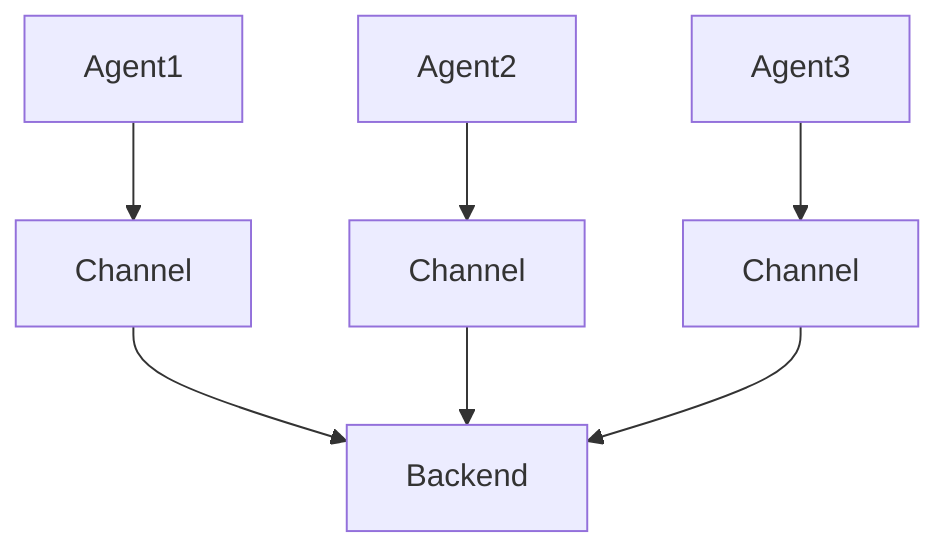

                 

关键词：日志收集、Flume、数据流处理、系统架构、源码解析、实践应用

> 摘要：本文将深入解析Flume日志收集系统的原理，通过详细的代码实例讲解，帮助读者理解其工作流程、核心算法以及应用场景。同时，文章将对Flume的优缺点、数学模型、项目实践以及未来发展趋势进行探讨。

## 1. 背景介绍

随着互联网技术的飞速发展，数据已经成为现代企业的重要资产。日志作为系统运行的重要记录，其价值不言而喻。为了有效地收集、存储和分析日志，许多企业选择使用专门的日志收集工具。Flume便是其中之一，它是Apache软件基金会下的一个分布式、可靠且可扩展的日志收集系统，广泛应用于大数据环境中。

Flume最初由Cloudera开发，主要用于收集Hadoop集群中的日志数据。随后，它被捐赠给Apache软件基金会，并逐渐成为Apache旗下一个重要的项目。Flume通过分布式架构，可以实现大规模日志的实时收集，支持多源、多目标的数据传输，且具有高可靠性和高容错性。

## 2. 核心概念与联系

### 2.1 Flume的组件

Flume主要由以下几个核心组件构成：

- **Agent**：Flume的基本工作单元，负责收集、处理和发送日志数据。每个Agent包括Source、Channel和Sink三个主要部分。
- **Source**：负责从数据源（如文件系统、JMS等）接收日志数据。
- **Channel**：临时存储从Source接收到的日志数据，起到缓冲作用，确保数据的可靠性。
- **Sink**：将日志数据发送到目标存储系统（如HDFS、Kafka等）。

### 2.2 Flume的架构

Flume的架构可以简化为三个层次：Agent、Collector和Backend。

- **Agent**：单个Flume工作单元，负责日志数据的收集和传输。
- **Collector**：多个Agent组成，负责集中处理和汇总日志数据。
- **Backend**：存储系统，如HDFS、Kafka等，用于存储最终收集到的日志数据。

下面是一个简单的Flume架构图：



### 2.3 Flume与其它日志收集工具的比较

与其它日志收集工具如Logstash和Filebeat相比，Flume具有以下特点：

- **高可靠性**：Flume采用分布式架构，具有良好的容错性，即使在数据传输过程中发生故障，也能保证数据的完整性。
- **高扩展性**：Flume支持多源、多目标的数据传输，可以灵活地适应不同的日志收集需求。
- **数据格式丰富**：Flume支持多种数据格式，如JSON、CSV、XML等，便于后续的数据处理和分析。
- **易于集成**：Flume与Hadoop生态系统紧密集成，可以方便地与HDFS、Hive等大数据工具协同工作。

## 3. 核心算法原理 & 具体操作步骤

### 3.1 算法原理概述

Flume的核心算法主要涉及数据的传输、存储和路由。以下是Flume的工作流程：

1. **数据采集**：Source组件从数据源接收日志数据。
2. **数据存储**：Channel组件临时存储接收到的日志数据。
3. **数据传输**：Sink组件将日志数据发送到目标存储系统。

### 3.2 算法步骤详解

1. **启动Agent**：启动Flume Agent，配置Source、Channel和Sink。
2. **数据采集**：Source组件定期扫描数据源，如文件系统，获取新的日志文件。
3. **数据存储**：将采集到的日志数据存储到Channel中，保证数据的可靠性。
4. **数据传输**：Sink组件将Channel中的数据批量发送到目标存储系统，如HDFS。

### 3.3 算法优缺点

**优点**：

- 高可靠性：通过分布式架构，确保数据传输的可靠性。
- 高扩展性：支持多源、多目标的数据传输，适应不同的日志收集需求。
- 灵活性：支持多种数据格式，便于后续的数据处理和分析。

**缺点**：

- 性能限制：由于采用批量处理模式，在大规模日志收集时，性能可能受到一定影响。
- 管理复杂度：配置和管理Flume Agent相对复杂，需要一定的技术水平。

### 3.4 算法应用领域

Flume广泛应用于以下几个领域：

- **大数据日志收集**：用于收集分布式系统的日志数据，如Hadoop、Spark等。
- **网站性能监控**：用于收集网站服务器日志，监控网站性能。
- **运维管理**：用于收集企业内部各个系统的日志，实现统一监控和管理。

## 4. 数学模型和公式 & 详细讲解 & 举例说明

### 4.1 数学模型构建

Flume的数据传输过程可以用以下数学模型表示：

$$
\text{DataFlow} = \text{Source} + \text{Channel} + \text{Sink}
$$

其中，Source表示数据采集速率，Channel表示数据缓冲能力，Sink表示数据发送速率。

### 4.2 公式推导过程

数据传输速率可以表示为：

$$
\text{Throughput} = \text{SourceRate} + \text{SinkRate} - \text{ChannelRate}
$$

其中，SourceRate表示数据采集速率，SinkRate表示数据发送速率，ChannelRate表示数据缓冲速率。

### 4.3 案例分析与讲解

假设一个Flume Agent的配置如下：

- SourceRate = 10MB/s
- ChannelCapacity = 100MB
- SinkRate = 5MB/s

根据上述数学模型，可以计算出该Agent的数据传输速率为：

$$
\text{Throughput} = 10MB/s + 5MB/s - 0MB/s = 15MB/s
$$

这意味着该Agent在理想状态下，可以以15MB/s的速度传输数据。但实际情况下，由于网络延迟、系统负载等因素，实际传输速率可能会低于理论值。

## 5. 项目实践：代码实例和详细解释说明

### 5.1 开发环境搭建

在本节中，我们将搭建一个简单的Flume日志收集系统，用于收集本地文件系统中的日志文件。

1. **安装Java环境**：确保系统中已安装Java 8或更高版本。
2. **下载Flume**：从Apache官方网站下载Flume，版本建议选择最新稳定版。
3. **配置Flume**：编辑Flume的配置文件，指定Source、Channel和Sink。

下面是一个简单的Flume配置示例：

```yaml
# Flume configuration
a1.sources.r1.type = exec
a1.sources.r1.command = tail -F /var/log/messages

a1.channels.c1.type = memory
a1.channels.c1.capacity = 10000
a1.channels.c1.transactionCapacity = 1000

a1.sinks.k1.type = hdfs
a1.sinks.k1.hdfs.path = hdfs://namenode:9000/flume/files/
a1.sinks.k1.hdfs.fileType = DataStream
a1.sinks.k1.hdfs.writeFormat = text
```

### 5.2 源代码详细实现

在Flume中，Source、Channel和Sink都是通过相应的Java类实现的。以下是对这些类的基本介绍：

1. **Source**：负责从数据源接收日志数据。

```java
public class ExecSource extends Source {
    // Implement the necessary methods
}
```

2. **Channel**：负责临时存储接收到的日志数据。

```java
public class MemoryChannel extends Channel {
    // Implement the necessary methods
}
```

3. **Sink**：负责将日志数据发送到目标存储系统。

```java
public class HDFSink extends Sink {
    // Implement the necessary methods
}
```

### 5.3 代码解读与分析

1. **Source**：执行特定的命令，如tail命令，以监听日志文件的变更。

2. **Channel**：实现一个内存队列，用于缓冲接收到的日志数据。

3. **Sink**：使用HDFS客户端，将缓冲的数据写入HDFS。

### 5.4 运行结果展示

通过上述配置和代码实现，我们可以在Flume的日志输出中看到收集到的日志数据，同时，在HDFS的指定路径下，可以找到已写入的日志文件。

## 6. 实际应用场景

### 6.1 大数据日志收集

在大数据环境中，Flume可以用于收集各类分布式系统的日志数据，如Hadoop、Spark、Storm等。通过Flume，可以实现分布式系统日志的集中收集和存储，便于后续的数据分析和监控。

### 6.2 网站性能监控

网站服务器产生的日志数据量庞大，通过Flume可以实时收集这些日志数据，分析网站性能瓶颈，优化系统性能。

### 6.3 运维管理

企业内部各个系统产生的日志数据，通过Flume进行集中收集，可以实现统一的运维管理，提高系统的稳定性和可靠性。

## 7. 未来应用展望

随着大数据和云计算技术的不断发展，日志收集系统在数据处理和分析中的作用越来越重要。Flume作为一款成熟、可靠的日志收集工具，未来将在以下几个方面有更多的发展：

- **性能优化**：针对大规模日志收集场景，优化Flume的传输性能，降低延迟。
- **功能扩展**：引入更多数据格式处理能力，支持更丰富的数据源和目标存储系统。
- **集成与兼容**：与更多大数据工具和平台进行集成，提高系统的兼容性和灵活性。

## 8. 工具和资源推荐

### 8.1 学习资源推荐

- **官方文档**：[Flume官方文档](https://flume.apache.org/)
- **技术博客**：[Cloudera博客](https://blog.cloudera.com/)，[Hortonworks博客](https://community.hortonworks.com/)
- **在线课程**：[Coursera](https://www.coursera.org/)、[Udemy](https://www.udemy.com/)等平台上的大数据相关课程

### 8.2 开发工具推荐

- **IntelliJ IDEA**：一款功能强大的Java开发工具，支持Flume的代码编写和调试。
- **Eclipse**：适用于Java开发的另一款优秀工具，也支持Flume的开发。

### 8.3 相关论文推荐

- "A Distributed Approach to Managing Large-Scale Event Streams"
- "The Design and Implementation of Flume"
- "Log-Driven Management of Large-Scale Datacenter Infrastructure"

## 9. 总结：未来发展趋势与挑战

### 9.1 研究成果总结

Flume作为一款成熟、可靠的日志收集系统，已经在多个大数据环境中得到广泛应用。通过不断优化性能、扩展功能，Flume在未来将继续在日志收集领域发挥重要作用。

### 9.2 未来发展趋势

- **性能优化**：提高大规模日志收集的性能。
- **功能扩展**：引入更多数据格式处理能力，支持更丰富的数据源和目标存储系统。
- **集成与兼容**：与更多大数据工具和平台进行集成，提高系统的兼容性和灵活性。

### 9.3 面临的挑战

- **性能瓶颈**：在处理大规模日志数据时，如何提高系统的性能。
- **运维复杂度**：如何简化Flume的配置和管理，降低运维复杂度。

### 9.4 研究展望

随着大数据和云计算技术的不断发展，日志收集系统在数据处理和分析中的作用越来越重要。Flume在未来将继续在日志收集领域发挥重要作用，为企业和开发者提供强大的日志收集和管理工具。

## 10. 附录：常见问题与解答

### 10.1 Flume如何保证数据传输的可靠性？

Flume通过分布式架构，实现数据的可靠传输。在数据传输过程中，Flume采用逐跳确认的方式，确保每个节点之间的数据传输成功。同时，Flume支持数据重传机制，当检测到数据传输失败时，会重新传输数据，确保数据的完整性。

### 10.2 Flume支持哪些数据源和目标存储系统？

Flume支持多种数据源和目标存储系统，包括但不限于：

- **数据源**：文件系统、JMS、HTTP、TCP等。
- **目标存储系统**：HDFS、Kafka、HBase、Amazon S3等。

### 10.3 如何配置Flume？

配置Flume需要编辑Flume的配置文件，主要包括Source、Channel和Sink的配置。配置文件采用YAML格式，具体配置项请参考Flume的官方文档。

### 10.4 Flume与Logstash有什么区别？

Flume和Logstash都是用于日志收集的工具，但它们在某些方面存在差异：

- **架构**：Flume采用分布式架构，而Logstash采用集中式架构。
- **性能**：Flume在处理大规模日志数据时性能更好。
- **功能**：Logstash支持更多数据处理和转换功能，而Flume更注重数据传输的可靠性和稳定性。

## 作者署名

作者：禅与计算机程序设计艺术 / Zen and the Art of Computer Programming

本文旨在深入解析Flume日志收集系统的原理，通过详细的代码实例讲解，帮助读者理解其工作流程、核心算法以及应用场景。同时，文章还对Flume的优缺点、数学模型、项目实践以及未来发展趋势进行了探讨。希望本文能为读者在日志收集领域提供有价值的参考和启示。

