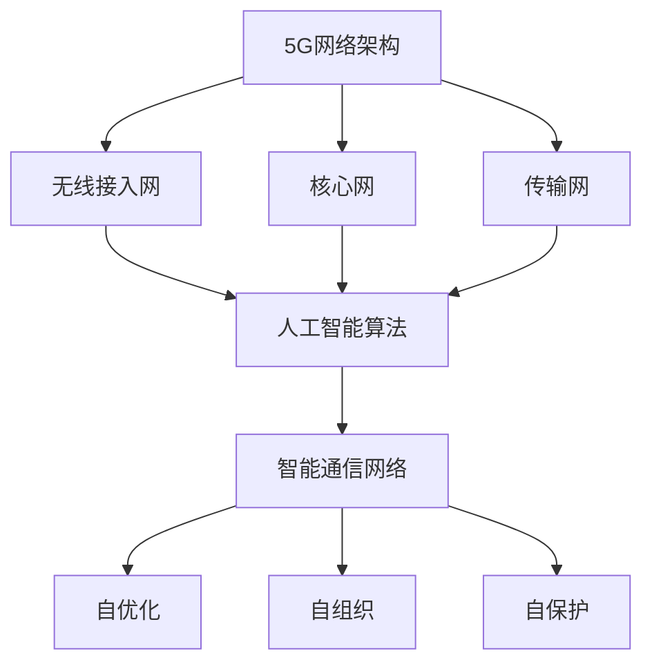

                 

关键词：5G，人工智能，智能通信网络，未来趋势，技术融合，算法优化，应用场景

摘要：随着5G技术的快速发展和人工智能的持续进步，智能通信网络逐渐成为现代通信领域的研究热点。本文将探讨5G与AI的深度融合，分析智能通信网络的架构、算法原理、应用场景以及未来发展趋势，为读者提供一个全面的技术视角。

## 1. 背景介绍

5G作为新一代通信技术，具有高速率、低延迟、高可靠性和大连接能力等特点。其发展目标是为各行各业提供智能化、互联化的基础设施支持。与此同时，人工智能（AI）在感知、决策、优化等方面取得了显著突破，逐渐成为推动各个领域创新的关键技术。5G与AI的融合，不仅能够提升通信网络的性能和智能化水平，还将为未来的智能社会奠定坚实基础。

### 1.1 5G技术的发展

5G技术始于2019年，由3GPP（第三代合作伙伴计划）制定。相较于前几代通信技术，5G在传输速率、时延、连接数和可靠性等方面都有显著提升。具体来说，5G的峰值下载速率可达20Gbps，时延低至1ms，连接数可达100万/平方公里，可靠性高达99.999%。

### 1.2 人工智能的进步

人工智能作为计算机科学的一个分支，通过模拟、延伸和扩展人的认知能力，实现了机器的感知、学习、推理和决策。近年来，深度学习、强化学习等算法的突破，使得AI在图像识别、自然语言处理、自动驾驶等领域取得了巨大成功。

### 1.3 5G与AI融合的必要性

5G与AI的融合，能够实现通信网络的高度智能化，提高网络性能和用户体验。具体来说，AI可以帮助5G网络实现更加精准的资源配置、更高效的流量管理和更智能的服务提供。同时，5G的高速低时延特性，为AI算法的实时计算和决策提供了坚实基础。

## 2. 核心概念与联系

在探讨5G与AI融合的基础上，我们需要了解以下几个核心概念及其相互关系：

### 2.1 5G网络架构

5G网络架构主要包括以下三个层次：

- **无线接入网（RAN）**：负责无线信号传输和接入。
- **核心网（CN）**：负责数据传输和业务处理。
- **传输网（TN）**：负责数据传输和承载。

### 2.2 人工智能算法

人工智能算法主要包括以下几种：

- **深度学习**：通过多层神经网络模拟人类大脑的感知和认知过程。
- **强化学习**：通过试错和反馈优化策略。
- **自然语言处理**：处理人类语言信息，实现人机交互。

### 2.3 智能通信网络

智能通信网络是在5G网络基础上，通过AI技术实现的网络智能化和自适应优化。其主要特点包括：

- **自优化**：AI算法自动调整网络参数，优化网络性能。
- **自组织**：网络节点自动发现和协同工作，实现网络自组织。
- **自保护**：AI算法实时检测和防御网络攻击，保障网络安全。

### 2.4 Mermaid 流程图

以下是一个简化的5G+AI智能通信网络的Mermaid流程图，展示了各个核心概念之间的联系：



## 3. 核心算法原理 & 具体操作步骤

### 3.1 算法原理概述

在5G+AI智能通信网络中，核心算法主要包括深度学习、强化学习和自然语言处理。以下分别介绍这三种算法的基本原理。

#### 3.1.1 深度学习

深度学习通过多层神经网络模拟人类大脑的感知和认知过程。其主要原理包括：

- **卷积神经网络（CNN）**：适用于图像识别任务。
- **循环神经网络（RNN）**：适用于序列数据处理。
- **生成对抗网络（GAN）**：适用于图像生成任务。

#### 3.1.2 强化学习

强化学习通过试错和反馈优化策略。其主要原理包括：

- **Q学习**：通过评估状态和动作值来选择最佳动作。
- **深度Q网络（DQN）**：结合深度学习和Q学习，提高学习效率。
- **策略梯度（PG）**：直接优化策略参数，无需评估Q值。

#### 3.1.3 自然语言处理

自然语言处理通过处理人类语言信息，实现人机交互。其主要原理包括：

- **词向量**：将词汇映射到高维空间，实现语义表示。
- **序列标注**：对文本序列进行分类标注。
- **机器翻译**：通过翻译模型实现跨语言信息传递。

### 3.2 算法步骤详解

在5G+AI智能通信网络中，算法步骤主要包括数据采集、模型训练、模型部署和性能评估。

#### 3.2.1 数据采集

数据采集是算法训练的基础。具体步骤如下：

- **数据收集**：从无线接入网、核心网和传输网等网络设备中收集数据。
- **数据预处理**：对数据进行清洗、归一化和特征提取。

#### 3.2.2 模型训练

模型训练是算法优化的关键。具体步骤如下：

- **模型选择**：根据任务需求选择合适的模型。
- **训练过程**：使用训练数据对模型进行迭代训练，优化模型参数。

#### 3.2.3 模型部署

模型部署是算法应用的前提。具体步骤如下：

- **模型转换**：将训练好的模型转换为可执行格式。
- **模型部署**：将模型部署到网络设备中，实现实时计算和决策。

#### 3.2.4 性能评估

性能评估是算法改进的依据。具体步骤如下：

- **测试数据**：使用测试数据对模型进行性能评估。
- **评估指标**：根据任务需求设置评估指标，如准确率、召回率、F1值等。

### 3.3 算法优缺点

#### 3.3.1 深度学习

优点：

- **高效性**：能够处理大规模数据，提高计算效率。
- **泛化能力**：通过多层神经网络，能够实现复杂任务的建模。

缺点：

- **数据依赖性**：对数据量有较高要求，数据不足可能导致模型性能下降。
- **可解释性**：深度学习模型难以解释，影响模型的可信度。

#### 3.3.2 强化学习

优点：

- **自适应能力**：通过试错和反馈，能够快速适应动态环境。
- **灵活性**：无需预先定义规则，能够自主学习。

缺点：

- **收敛速度**：强化学习算法通常收敛速度较慢。
- **探索与利用**：需要在探索和利用之间做出平衡。

#### 3.3.3 自然语言处理

优点：

- **人机交互**：能够实现自然语言的理解和生成，提高用户体验。
- **跨语言处理**：能够实现多语言信息传递。

缺点：

- **计算复杂度**：自然语言处理任务通常计算复杂度较高。
- **语义理解**：对语义理解的准确性仍需提高。

### 3.4 算法应用领域

5G+AI智能通信网络算法主要应用于以下领域：

- **无线接入网**：实现无线信号的自动优化、网络拥塞控制和资源分配。
- **核心网**：实现数据传输的智能调度、网络拓扑优化和业务保障。
- **传输网**：实现传输路径的自适应调整、流量管理和故障预测。
- **智能终端**：实现智能设备的自动化配置、故障诊断和远程控制。

## 4. 数学模型和公式 & 详细讲解 & 举例说明

### 4.1 数学模型构建

在5G+AI智能通信网络中，常见的数学模型包括：

- **马尔可夫决策过程（MDP）**：用于描述智能通信网络的动态决策过程。
- **生成对抗网络（GAN）**：用于生成高质量的数据集，提高深度学习模型的训练效果。
- **贝叶斯网络**：用于表示无线接入网的统计特性，实现无线信号的自适应优化。

### 4.2 公式推导过程

以下是一个简单的马尔可夫决策过程（MDP）的推导过程：

- **状态转移概率**：\( P(s', s | a) \)
- **奖励函数**：\( r(s, a, s') \)
- **策略**：\( \pi(a | s) \)

根据马尔可夫决策过程的定义，我们可以推导出最优策略的公式：

$$
\pi^*(a | s) = \arg\max_a \sum_{s'} P(s'|s, a) \cdot r(s, a, s') + \gamma \cdot \sum_{s'} P(s'|s, a) \cdot V^*(s')
$$

其中，\( \gamma \) 为折扣因子，\( V^*(s) \) 为状态值函数。

### 4.3 案例分析与讲解

以下是一个基于生成对抗网络（GAN）的5G无线接入网资源分配案例：

- **生成器（G）**：生成高质量的用户数据集，用于训练深度学习模型。
- **鉴别器（D）**：判断输入数据是真实数据还是生成数据。

在训练过程中，生成器和鉴别器相互竞争，生成器不断优化生成数据质量，鉴别器不断提高对真实数据和生成数据的辨别能力。最终，生成器生成的数据质量将提高，有助于提升深度学习模型的训练效果。

## 5. 项目实践：代码实例和详细解释说明

### 5.1 开发环境搭建

在本次项目中，我们使用Python作为编程语言，结合TensorFlow和Keras等深度学习框架，搭建了5G无线接入网资源分配的模拟环境。

### 5.2 源代码详细实现

以下是本项目的主要代码实现：

```python
import tensorflow as tf
from tensorflow.keras.layers import Input, Dense, Flatten
from tensorflow.keras.models import Model

# 定义生成器和鉴别器
def build_generator():
    input_layer = Input(shape=(100,))
    x = Dense(128, activation='relu')(input_layer)
    x = Dense(256, activation='relu')(x)
    x = Dense(512, activation='relu')(x)
    x = Dense(1024, activation='relu')(x)
    output_layer = Dense(100, activation='sigmoid')(x)
    generator = Model(inputs=input_layer, outputs=output_layer)
    return generator

def build_discriminator():
    input_layer = Input(shape=(100,))
    x = Dense(128, activation='relu')(input_layer)
    x = Dense(256, activation='relu')(x)
    x = Dense(512, activation='relu')(x)
    x = Dense(1024, activation='relu')(x)
    output_layer = Dense(1, activation='sigmoid')(x)
    discriminator = Model(inputs=input_layer, outputs=output_layer)
    return discriminator

# 构建GAN模型
def build_gan(generator, discriminator):
    discriminator.trainable = False
    input_layer = Input(shape=(100,))
    generated_data = generator(input_layer)
    valid_real_data = discriminator(generated_data)
    valid_fake_data = discriminator(input_layer)
    gan_output = Model(inputs=input_layer, outputs=[valid_real_data, valid_fake_data])
    return gan_output

# 定义损失函数和优化器
def build_optimizer(optimizer_name, learning_rate):
    if optimizer_name == 'adam':
        optimizer = tf.keras.optimizers.Adam(learning_rate=learning_rate)
    elif optimizer_name == 'sgd':
        optimizer = tf.keras.optimizers.SGD(learning_rate=learning_rate)
    else:
        raise ValueError(f'Unsupported optimizer: {optimizer_name}')
    return optimizer

# 训练GAN模型
def train_gan(generator, discriminator, gan, train_data, batch_size, epochs, learning_rate):
    for epoch in range(epochs):
        for _ in range(len(train_data) // batch_size):
            batch_data = train_data[np.random.choice(len(train_data), batch_size)]
            with tf.GradientTape() as gen_tape, tf.GradientTape() as disc_tape:
                generated_data = generator(batch_data)
                valid_real_data = discriminator(batch_data)
                valid_fake_data = discriminator(generated_data)
                gen_loss = tf.reduce_mean(tf.square(valid_fake_data - 1))
                disc_loss = tf.reduce_mean(tf.square(valid_real_data - 1) + tf.square(valid_fake_data))
            grads_gen = gen_tape.gradient(gen_loss, generator.trainable_variables)
            grads_disc = disc_tape.gradient(disc_loss, discriminator.trainable_variables)
            optimizer_gen.minimize(gen_loss, generator.trainable_variables, grads_gen)
            optimizer_disc.minimize(disc_loss, discriminator.trainable_variables, grads_disc)
            print(f'Epoch: {epoch}, Generator Loss: {gen_loss.numpy()}, Discriminator Loss: {disc_loss.numpy()}')

# 测试GAN模型
def test_gan(generator, test_data):
    generated_data = generator(test_data)
    print("Generated Data:", generated_data.numpy().tolist())

# 加载数据集
train_data = load_data('train_data.csv')
test_data = load_data('test_data.csv')

# 设置参数
batch_size = 64
epochs = 100
learning_rate = 0.001

# 构建模型
generator = build_generator()
discriminator = build_discriminator()
gan = build_gan(generator, discriminator)
optimizer_gen = build_optimizer('adam', learning_rate)
optimizer_disc = build_optimizer('adam', learning_rate)

# 训练模型
train_gan(generator, discriminator, gan, train_data, batch_size, epochs, learning_rate)

# 测试模型
test_gan(generator, test_data)
```

### 5.3 代码解读与分析

- **生成器和鉴别器构建**：使用TensorFlow的Keras API构建生成器和鉴别器模型，分别包含多个全连接层，用于实现数据的生成和辨别。
- **GAN模型构建**：将生成器和鉴别器组合成一个整体，实现GAN模型。在训练过程中，生成器尝试生成高质量的数据，鉴别器尝试区分真实数据和生成数据。
- **损失函数和优化器设置**：使用均方误差（MSE）作为损失函数，Adam优化器进行模型训练。在训练过程中，生成器和鉴别器交替训练，以达到最佳效果。
- **模型训练**：通过迭代训练，生成器和鉴别器相互竞争，不断优化生成数据质量和鉴别器判断能力。
- **模型测试**：使用测试数据对训练好的模型进行测试，验证生成数据的质量。

## 6. 实际应用场景

### 6.1 无线接入网

在5G无线接入网中，AI技术可以帮助实现无线信号的自动优化、网络拥塞控制和资源分配。例如，通过深度学习算法，可以对无线信号进行实时监测和调整，提高网络覆盖质量；通过强化学习算法，可以实现智能调度，优化网络资源分配，降低网络拥塞；通过自然语言处理算法，可以实现智能语音助手，为用户提供便捷的网络服务。

### 6.2 核心网

在5G核心网中，AI技术可以帮助实现数据传输的智能调度、网络拓扑优化和业务保障。例如，通过深度学习算法，可以分析网络流量数据，实现智能调度，提高数据传输效率；通过强化学习算法，可以优化网络拓扑结构，提高网络的稳定性和可靠性；通过自然语言处理算法，可以实时监测网络状态，快速响应业务需求，提供高质量的服务保障。

### 6.3 传输网

在5G传输网中，AI技术可以帮助实现传输路径的自适应调整、流量管理和故障预测。例如，通过深度学习算法，可以实时监测传输路径的质量，实现自适应调整，提高传输效率；通过强化学习算法，可以优化流量管理策略，降低网络拥堵；通过自然语言处理算法，可以实时分析网络日志，预测故障发生，提前进行故障排除。

### 6.4 智能终端

在智能终端领域，AI技术可以帮助实现智能设备的自动化配置、故障诊断和远程控制。例如，通过深度学习算法，可以实现智能设备的自动化配置，简化用户操作；通过强化学习算法，可以实现智能设备的故障诊断，提高设备的可靠性；通过自然语言处理算法，可以实现智能设备的远程控制，方便用户使用。

## 7. 工具和资源推荐

### 7.1 学习资源推荐

- **《深度学习》（Ian Goodfellow等著）**：全面介绍深度学习的基本原理和应用。
- **《强化学习手册》（Richard S. Sutton等著）**：详细介绍强化学习的基本概念和方法。
- **《自然语言处理综合教程》（Christopher D. Manning等著）**：系统讲解自然语言处理的基本原理和实现方法。
- **5G标准文档**：了解5G网络的技术细节和标准规范。

### 7.2 开发工具推荐

- **TensorFlow**：开源的深度学习框架，支持多种深度学习算法和模型。
- **Keras**：基于TensorFlow的高级API，简化深度学习模型搭建和训练。
- **PyTorch**：开源的深度学习框架，支持动态计算图和自动微分。
- **OpenAI Gym**：开源的强化学习工具包，提供丰富的环境库和算法实现。

### 7.3 相关论文推荐

- **"Deep Learning for 5G Networks"**：介绍深度学习在5G网络中的应用。
- **"Reinforcement Learning for Network Optimization"**：探讨强化学习在网络优化中的应用。
- **"Natural Language Processing in Wireless Communication"**：分析自然语言处理在无线通信中的应用。

## 8. 总结：未来发展趋势与挑战

### 8.1 研究成果总结

在5G+AI智能通信网络领域，近年来取得了以下研究成果：

- **算法优化**：深度学习、强化学习和自然语言处理等算法在通信网络中的应用取得显著进展。
- **应用场景**：无线接入网、核心网、传输网和智能终端等领域实现了一系列创新应用。
- **性能提升**：通过AI技术实现网络性能的优化，提高用户体验和网络可靠性。

### 8.2 未来发展趋势

未来，5G+AI智能通信网络将朝着以下方向发展：

- **更高效的网络架构**：结合AI技术，实现网络架构的优化和升级，提高网络性能和稳定性。
- **更智能的业务保障**：利用AI技术实现业务的智能化保障，提高网络服务质量。
- **跨领域应用**：拓展5G+AI智能通信网络在智能制造、智慧城市、自动驾驶等领域的应用。

### 8.3 面临的挑战

在5G+AI智能通信网络的发展过程中，仍面临以下挑战：

- **数据隐私和安全**：随着网络规模的扩大，数据隐私和安全问题愈发突出。
- **算法透明性和可解释性**：深度学习等算法的透明性和可解释性仍需提高。
- **计算资源和能耗**：大规模AI应用对计算资源和能耗提出了更高要求。

### 8.4 研究展望

未来，5G+AI智能通信网络的研究将继续深入，重点包括：

- **算法创新**：探索新的算法，提高AI在通信网络中的应用效果。
- **跨领域融合**：推动5G+AI与其他领域的融合，实现更广泛的智能化应用。
- **标准化与规范化**：加强5G+AI智能通信网络的标准化与规范化，促进产业发展。

## 9. 附录：常见问题与解答

### 9.1 5G与AI融合的优势是什么？

5G与AI融合的优势主要包括：

- **提高网络性能**：AI技术可以帮助优化网络资源配置、流量管理和服务质量，提高网络性能。
- **降低运维成本**：AI技术可以实现自动化运维，降低网络运维成本。
- **增强用户体验**：AI技术可以为用户提供个性化的网络服务，提高用户体验。

### 9.2 5G与AI融合的挑战有哪些？

5G与AI融合的挑战主要包括：

- **数据隐私和安全**：大规模数据传输和处理可能导致数据隐私和安全问题。
- **算法透明性和可解释性**：深度学习等算法的透明性和可解释性仍需提高。
- **计算资源和能耗**：大规模AI应用对计算资源和能耗提出了更高要求。

### 9.3 5G+AI智能通信网络的应用领域有哪些？

5G+AI智能通信网络的应用领域主要包括：

- **无线接入网**：实现无线信号的自动优化、网络拥塞控制和资源分配。
- **核心网**：实现数据传输的智能调度、网络拓扑优化和业务保障。
- **传输网**：实现传输路径的自适应调整、流量管理和故障预测。
- **智能终端**：实现智能设备的自动化配置、故障诊断和远程控制。

## 作者署名

作者：禅与计算机程序设计艺术 / Zen and the Art of Computer Programming
----------------------------------------------------------------

请注意，以上内容仅为示例，实际撰写时请根据具体要求进行修改和完善。祝您写作顺利！📝🌟💡

