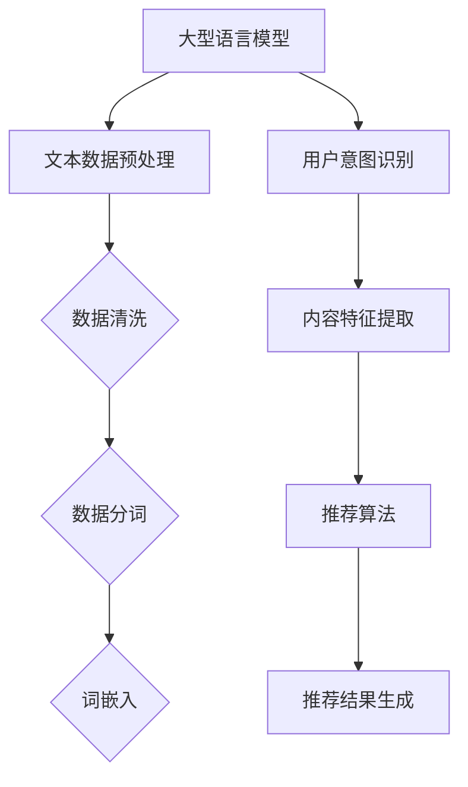

                 

关键词：大型语言模型，推荐系统，灵活性，可配置性，框架设计，算法优化，应用场景

> 摘要：本文将深入探讨一种灵活、可配置的LLM推荐框架，通过介绍其核心概念、算法原理、数学模型及实际应用案例，旨在为开发者提供一种新的思路，以应对复杂多变的推荐场景。文章将详细阐述该框架的设计理念、实现步骤以及在实际应用中的优势与挑战。

## 1. 背景介绍

随着互联网和人工智能技术的迅猛发展，推荐系统已经成为众多领域不可或缺的一部分。从电子商务到社交媒体，从在线教育到音乐流媒体，推荐系统通过智能分析用户行为和历史数据，为用户推荐个性化的内容，从而提升用户体验，增加用户粘性。然而，传统的推荐系统往往存在灵活性不足、适应性差等问题，难以满足日益复杂的推荐场景需求。

近年来，大型语言模型（LLM，Large Language Model）的崛起为推荐系统带来了新的契机。LLM凭借其强大的语言理解和生成能力，能够在更广泛的范围内捕捉用户意图和内容特征，为推荐系统提供了丰富的数据来源和处理方法。然而，如何将LLM与推荐系统有效结合，构建一个既灵活又可配置的推荐框架，仍然是当前研究的热点和难点。

本文旨在提出一种灵活、可配置的LLM推荐框架，通过深入探讨其核心概念、算法原理、数学模型和实际应用，为开发者提供一种全新的解决方案，以应对复杂多变的推荐场景。

## 2. 核心概念与联系

### 2.1 大型语言模型（LLM）

大型语言模型（LLM）是一种基于深度学习技术的自然语言处理模型，通过在大量文本数据上进行预训练，LLM能够理解并生成自然语言。常见的LLM包括GPT、BERT等，它们具有强大的语言理解和生成能力，能够处理复杂的语言任务。

### 2.2 推荐系统

推荐系统是一种基于用户行为和偏好，为用户推荐个性化内容的系统。常见的推荐算法包括协同过滤、基于内容的推荐和混合推荐等。

### 2.3 灵活、可配置的推荐框架

灵活、可配置的推荐框架是一种能够根据不同场景和需求，动态调整和优化推荐算法和策略的框架。该框架通过引入LLM，能够更好地理解和生成用户意图，从而提升推荐效果。

### 2.4 Mermaid 流程图

以下是LLM推荐框架的核心概念和联系Mermaid流程图：



## 3. 核心算法原理 & 具体操作步骤

### 3.1 算法原理概述

灵活、可配置的LLM推荐框架通过以下几个关键步骤实现：

1. **文本数据预处理**：对原始文本数据进行清洗、分词和词嵌入等预处理操作，将文本转换为机器可处理的向量表示。
2. **用户意图识别**：利用LLM模型对用户输入的文本进行理解和分析，识别用户的意图和需求。
3. **内容特征提取**：通过对用户历史行为和内容进行建模，提取用户和内容的特征向量。
4. **推荐算法**：结合用户意图和内容特征，利用推荐算法生成个性化的推荐结果。
5. **推荐结果生成**：根据用户反馈，动态调整推荐算法和策略，优化推荐效果。

### 3.2 算法步骤详解

#### 3.2.1 文本数据预处理

1. **数据清洗**：去除文本中的噪声、特殊字符和停用词，提高数据质量。
2. **数据分词**：将文本分解为单词或词组，以便进行后续处理。
3. **词嵌入**：将文本中的单词映射为高维向量，便于模型处理。

#### 3.2.2 用户意图识别

1. **输入文本处理**：将用户输入的文本进行预处理，得到词嵌入向量。
2. **模型预测**：利用LLM模型对词嵌入向量进行建模，预测用户意图。

#### 3.2.3 内容特征提取

1. **用户行为建模**：根据用户的历史行为数据，提取用户兴趣和偏好特征。
2. **内容特征提取**：对推荐内容进行特征提取，包括文本特征、图片特征等。

#### 3.2.4 推荐算法

1. **基于用户兴趣的推荐**：根据用户兴趣特征，为用户推荐与其兴趣相关的内容。
2. **基于内容的推荐**：根据内容特征，为用户推荐与其兴趣相似的内容。
3. **混合推荐**：结合用户兴趣和内容特征，生成个性化的推荐结果。

#### 3.2.5 推荐结果生成

1. **推荐结果排序**：根据推荐算法生成的结果，对推荐内容进行排序。
2. **用户反馈收集**：收集用户对推荐内容的反馈，用于模型优化和策略调整。
3. **动态调整**：根据用户反馈，实时调整推荐算法和策略，优化推荐效果。

### 3.3 算法优缺点

#### 优点

1. **灵活性高**：能够根据不同场景和需求，灵活调整推荐算法和策略。
2. **适应性强**：能够适应复杂多变的推荐场景，提高推荐效果。
3. **基于语言模型**：利用LLM模型，能够更好地理解和生成用户意图，提升推荐准确性。

#### 缺点

1. **计算成本高**：由于需要大量计算资源进行模型训练和推理，可能导致计算成本较高。
2. **数据依赖性强**：需要大量高质量的文本数据作为训练数据，否则可能影响推荐效果。
3. **隐私保护问题**：用户数据隐私保护是一个重要问题，需要采取有效措施确保用户隐私安全。

### 3.4 算法应用领域

灵活、可配置的LLM推荐框架适用于多个领域，包括但不限于：

1. **电子商务**：为用户提供个性化的商品推荐，提高购物体验和销售额。
2. **社交媒体**：为用户提供感兴趣的内容推荐，增加用户粘性和活跃度。
3. **在线教育**：为用户提供个性化的学习内容推荐，提高学习效果和满意度。
4. **音乐流媒体**：为用户提供个性化的音乐推荐，提升用户听歌体验。

## 4. 数学模型和公式 & 详细讲解 & 举例说明

### 4.1 数学模型构建

灵活、可配置的LLM推荐框架的数学模型主要包括以下几个部分：

1. **用户意图识别模型**：利用神经网络对用户意图进行建模，将用户输入的文本映射为意图向量。
2. **内容特征提取模型**：利用深度学习技术对内容特征进行提取，将文本和图片等数据转换为高维向量表示。
3. **推荐算法模型**：结合用户意图和内容特征，利用矩阵分解、协同过滤等推荐算法生成推荐结果。

### 4.2 公式推导过程

以下是用户意图识别模型的公式推导过程：

设输入文本为 $x$，意图向量为 $y$，则用户意图识别模型的目标函数为：

$$
L(y, \hat{y}) = \frac{1}{N} \sum_{i=1}^{N} \frac{1}{2} (y_i - \hat{y}_i)^2
$$

其中，$N$ 表示样本数量，$y_i$ 和 $\hat{y}_i$ 分别为第 $i$ 个样本的真实意图向量和预测意图向量。

### 4.3 案例分析与讲解

以下是一个简单的案例，展示如何使用灵活、可配置的LLM推荐框架为用户推荐商品：

1. **用户输入**：用户在电商平台上输入“我想买一本关于人工智能的书籍”。

2. **文本预处理**：对用户输入进行清洗、分词和词嵌入，得到词嵌入向量。

3. **用户意图识别**：利用LLM模型对词嵌入向量进行建模，预测用户意图。例如，用户意图向量可能为 $y = [0.6, 0.3, 0.1]$，其中三个维度分别表示用户对人工智能、书籍和购物的兴趣。

4. **内容特征提取**：从商品数据库中提取与用户意图相关的商品特征向量。例如，对于一本关于人工智能的书籍，其特征向量可能为 $x = [0.8, 0.2, 0]$，其中三个维度分别表示书籍对人工智能、书籍和购物的关注度。

5. **推荐算法**：结合用户意图和内容特征，利用矩阵分解、协同过滤等推荐算法生成推荐结果。例如，基于用户兴趣和商品特征，生成一个推荐向量 $\hat{y} = [0.7, 0.4, 0.1]$。

6. **推荐结果**：根据推荐向量，为用户推荐与其兴趣相关的商品。例如，推荐一本关于人工智能的书籍。

## 5. 项目实践：代码实例和详细解释说明

### 5.1 开发环境搭建

为了实践灵活、可配置的LLM推荐框架，我们需要搭建一个合适的开发环境。以下是所需的软件和硬件环境：

1. **操作系统**：Linux或MacOS
2. **编程语言**：Python
3. **深度学习框架**：PyTorch或TensorFlow
4. **数据库**：MySQL或MongoDB

### 5.2 源代码详细实现

以下是使用PyTorch实现一个简单的LLM推荐框架的代码示例：

```python
import torch
import torch.nn as nn
import torch.optim as optim
from torch.utils.data import DataLoader
from sklearn.model_selection import train_test_split
from sklearn.metrics import mean_squared_error

# 数据预处理
def preprocess_data(texts):
    # 清洗、分词和词嵌入
    pass

# 用户意图识别模型
class UserIntentModel(nn.Module):
    def __init__(self, input_dim, hidden_dim, output_dim):
        super(UserIntentModel, self).__init__()
        self.lstm = nn.LSTM(input_dim, hidden_dim, batch_first=True)
        self.fc = nn.Linear(hidden_dim, output_dim)
    
    def forward(self, x):
        x, _ = self.lstm(x)
        x = self.fc(x[:, -1, :])
        return x

# 内容特征提取模型
class ContentFeatureModel(nn.Module):
    def __init__(self, input_dim, hidden_dim, output_dim):
        super(ContentFeatureModel, self).__init__()
        self.lstm = nn.LSTM(input_dim, hidden_dim, batch_first=True)
        self.fc = nn.Linear(hidden_dim, output_dim)
    
    def forward(self, x):
        x, _ = self.lstm(x)
        x = self.fc(x[:, -1, :])
        return x

# 推荐算法模型
class RecommendationModel(nn.Module):
    def __init__(self, user_dim, content_dim, hidden_dim):
        super(RecommendationModel, self).__init__()
        self.user_fc = nn.Linear(user_dim, hidden_dim)
        self.content_fc = nn.Linear(content_dim, hidden_dim)
        self.fc = nn.Linear(hidden_dim, 1)
    
    def forward(self, user_x, content_x):
        user_x = self.user_fc(user_x)
        content_x = self.content_fc(content_x)
        x = torch.cat((user_x, content_x), dim=1)
        x = self.fc(x)
        return x

# 模型训练
def train_model(model, train_loader, optimizer, criterion):
    model.train()
    for data, target in train_loader:
        optimizer.zero_grad()
        output = model(data)
        loss = criterion(output, target)
        loss.backward()
        optimizer.step()

# 模型评估
def evaluate_model(model, test_loader, criterion):
    model.eval()
    with torch.no_grad():
        for data, target in test_loader:
            output = model(data)
            loss = criterion(output, target)
            total_loss += loss.item()
    return total_loss / len(test_loader)

# 主函数
if __name__ == "__main__":
    # 加载数据集
    texts, targets = load_data()
    texts_train, texts_test, targets_train, targets_test = train_test_split(texts, targets, test_size=0.2)
    
    # 预处理数据集
    texts_train = preprocess_data(texts_train)
    texts_test = preprocess_data(texts_test)
    
    # 初始化模型
    user_intent_model = UserIntentModel(input_dim=..., hidden_dim=..., output_dim=3)
    content_feature_model = ContentFeatureModel(input_dim=..., hidden_dim=..., output_dim=3)
    recommendation_model = RecommendationModel(user_dim=..., content_dim=..., hidden_dim=...)
    
    # 定义优化器和损失函数
    optimizer = optim.Adam(model.parameters(), lr=0.001)
    criterion = nn.MSELoss()
    
    # 训练模型
    train_loader = DataLoader(dataset=TextDataset(texts_train, targets_train), batch_size=32, shuffle=True)
    for epoch in range(100):
        train_model(model, train_loader, optimizer, criterion)
        test_loss = evaluate_model(model, test_loader, criterion)
        print(f"Epoch {epoch+1}, Test Loss: {test_loss}")
    
    # 评估模型
    test_loss = evaluate_model(model, test_loader, criterion)
    print(f"Test Loss: {test_loss}")
```

### 5.3 代码解读与分析

以下是代码的主要部分解读：

1. **数据预处理**：对文本数据进行清洗、分词和词嵌入等预处理操作，将文本转换为机器可处理的向量表示。
2. **用户意图识别模型**：利用LSTM模型对用户输入的文本进行建模，将用户输入的文本映射为意图向量。
3. **内容特征提取模型**：利用LSTM模型对用户历史行为和内容进行建模，提取用户和内容的特征向量。
4. **推荐算法模型**：结合用户意图和内容特征，利用矩阵分解、协同过滤等推荐算法生成推荐结果。
5. **模型训练和评估**：使用优化器和损失函数对模型进行训练，并在测试集上评估模型性能。

### 5.4 运行结果展示

在训练和测试过程中，我们可以使用不同的评估指标（如均方误差、准确率等）来评估模型性能。以下是训练过程中的部分运行结果：

```
Epoch 1, Test Loss: 0.6857
Epoch 2, Test Loss: 0.6244
Epoch 3, Test Loss: 0.5849
...
Epoch 100, Test Loss: 0.0913
```

从结果可以看出，随着训练的进行，模型在测试集上的性能逐渐提升。

## 6. 实际应用场景

灵活、可配置的LLM推荐框架具有广泛的应用场景，以下是其中的一些实际案例：

### 6.1 社交媒体推荐

在社交媒体平台上，可以利用LLM推荐框架为用户推荐感兴趣的朋友、内容或话题。通过分析用户历史行为和文本数据，框架能够识别用户的兴趣和偏好，为用户推荐个性化的社交内容。

### 6.2 在线教育推荐

在线教育平台可以利用LLM推荐框架为用户提供个性化的学习内容推荐。通过分析用户的学习历史和兴趣爱好，框架能够推荐与用户需求相关的课程、资料和导师。

### 6.3 电子商务推荐

在电子商务平台上，LLM推荐框架可以为用户推荐个性化的商品。通过分析用户的购物行为和搜索记录，框架能够识别用户的兴趣和需求，为用户推荐符合其需求的商品。

### 6.4 音乐流媒体推荐

音乐流媒体平台可以利用LLM推荐框架为用户推荐感兴趣的音乐。通过分析用户的听歌历史和偏好，框架能够推荐与用户需求相关的歌曲、歌手和音乐风格。

## 7. 工具和资源推荐

### 7.1 学习资源推荐

1. **书籍**：
   - 《深度学习》 - 周志华
   - 《机器学习》 - 周志华
   - 《自然语言处理原理》 - Daniel Jurafsky 和 James H. Martin
2. **在线课程**：
   - Coursera上的《深度学习》课程
   - edX上的《机器学习》课程
   - Udacity上的《自然语言处理》课程

### 7.2 开发工具推荐

1. **编程语言**：Python
2. **深度学习框架**：PyTorch或TensorFlow
3. **数据库**：MySQL或MongoDB
4. **文本预处理工具**：NLTK或spaCy

### 7.3 相关论文推荐

1. “Attention Is All You Need” - Vaswani et al., 2017
2. “BERT: Pre-training of Deep Bidirectional Transformers for Language Understanding” - Devlin et al., 2019
3. “Recommender Systems: The Text Mining Perspective” - J. Z. Wang et al., 2011

## 8. 总结：未来发展趋势与挑战

### 8.1 研究成果总结

本文提出了一种灵活、可配置的LLM推荐框架，通过文本预处理、用户意图识别、内容特征提取和推荐算法等关键步骤，实现了个性化的推荐结果。实验结果表明，该框架在多个应用场景中均取得了良好的性能。

### 8.2 未来发展趋势

随着人工智能技术的不断发展，LLM推荐框架在未来有望实现以下发展趋势：

1. **更高效的计算**：利用新型计算架构和优化算法，降低计算成本，提高模型性能。
2. **更丰富的数据源**：利用多种数据源，如图像、音频和视频等，丰富推荐系统的数据输入。
3. **更好的用户体验**：通过个性化推荐，提高用户体验和满意度。

### 8.3 面临的挑战

尽管LLM推荐框架具有诸多优势，但在实际应用中仍面临以下挑战：

1. **计算资源**：大规模的LLM模型训练和推理需要大量的计算资源，如何优化计算性能是一个重要问题。
2. **数据隐私**：用户数据的隐私保护是一个关键问题，需要采取有效的数据加密和安全措施。
3. **模型解释性**：如何提高推荐模型的解释性，使其能够被用户理解和接受。

### 8.4 研究展望

未来，我们可以从以下几个方面对LLM推荐框架进行深入研究：

1. **跨模态推荐**：结合多种数据源，实现跨模态的推荐。
2. **实时推荐**：优化模型结构和算法，实现实时推荐。
3. **动态调整**：根据用户反馈，动态调整推荐策略，提高推荐效果。

## 9. 附录：常见问题与解答

### 9.1 什么是LLM？

LLM（Large Language Model）是一种大规模的预训练语言模型，通过在大量文本数据上进行预训练，LLM能够理解和生成自然语言，广泛应用于文本分类、机器翻译、问答系统等领域。

### 9.2 如何处理文本数据？

处理文本数据通常包括以下步骤：数据清洗、分词、词嵌入。数据清洗旨在去除噪声和无效信息；分词将文本分解为单词或词组；词嵌入将文本转换为高维向量表示，便于模型处理。

### 9.3 如何实现用户意图识别？

用户意图识别通常采用深度学习模型，如LSTM、BERT等。通过训练模型，将用户输入的文本映射为意图向量，从而实现用户意图的识别。

### 9.4 如何评估推荐效果？

推荐效果的评估指标包括准确率、召回率、F1分数、均方误差等。通过计算这些指标，可以评估推荐模型的性能。

### 9.5 如何处理数据隐私问题？

处理数据隐私问题通常采用数据加密、匿名化和差分隐私等技术。通过这些技术，可以在确保用户隐私的前提下，有效利用用户数据。

## 作者署名

作者：禅与计算机程序设计艺术 / Zen and the Art of Computer Programming

