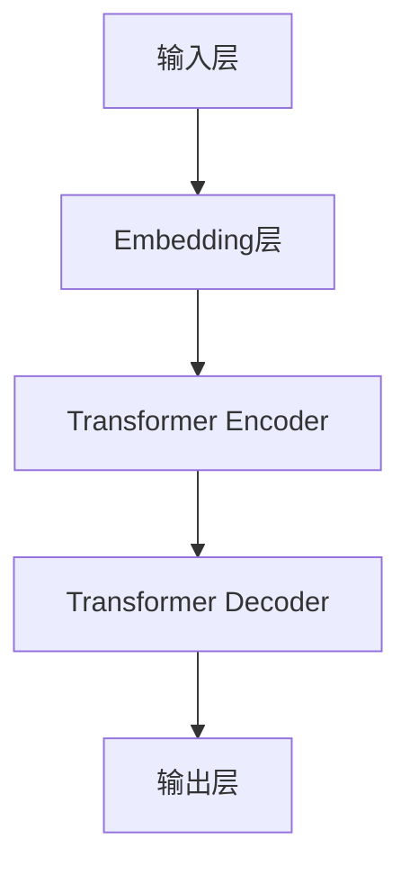

                 

关键词：GPT-4，深度学习，自然语言处理，神经网络，生成模型，语言模型，代码实例，编程实践。

> 摘要：本文将深入探讨GPT-4的原理，包括其核心概念、算法、数学模型和代码实现。我们将通过详细的步骤讲解和实例分析，帮助读者全面理解GPT-4的工作机制，并掌握如何在实际项目中应用这一强大工具。

## 1. 背景介绍

### GPT-4的概念

GPT-4（Generative Pretrained Transformer 4）是由OpenAI开发的一种基于深度学习的自然语言处理模型。它是GPT系列的最新版本，继承了前几代模型的成功之处，并在性能和效率上有了显著的提升。GPT-4是一个大规模的预训练语言模型，它可以理解并生成人类语言的各个方面，包括对话、文本摘要、翻译等。

### GPT-4的演进历史

GPT-4是在GPT、GPT-2和GPT-3的基础上发展起来的。GPT最初由OpenAI在2018年推出，是一个基于Transformer架构的预训练语言模型。GPT-2在2019年发布，其训练数据规模更大，参数量也更多，显著提升了语言生成的能力。GPT-3则在2020年推出，拥有前所未有的参数规模和语言理解能力，展示了在多个自然语言处理任务中的卓越表现。

GPT-4是GPT-3的进一步增强版本，它在模型架构、预训练数据、训练技巧等多个方面进行了优化，使得GPT-4在语言理解和生成上达到了一个新的高度。

### GPT-4的应用领域

GPT-4在多个领域都有广泛的应用，包括但不限于：

- 对话系统：如智能助手、聊天机器人等。
- 自动摘要：从长篇文档中提取关键信息生成摘要。
- 机器翻译：将一种语言翻译成另一种语言。
- 文本生成：创作文章、故事、诗歌等。
- 文本分类：对文本进行分类，如情感分析、新闻分类等。

## 2. 核心概念与联系

### GPT-4的核心概念

GPT-4是一个基于Transformer架构的深度学习模型。Transformer是一种基于自注意力机制的模型，它通过计算序列中每个词与所有其他词的关系来生成文本。这种机制使得Transformer在处理长序列时表现出了优越的性能。

### GPT-4的架构

GPT-4的架构主要由以下几部分组成：

- **Embedding Layer**：将输入的单词转换为向量表示。
- **Transformer Encoder**：核心部分，包括多头自注意力机制和多层感知器。
- **Transformer Decoder**：生成文本的过程，同样包含多头自注意力机制和多层感知器。
- **Output Layer**：将编码器和解码器的输出转换为预测的概率分布。

### GPT-4的流程图



### GPT-4的工作原理

1. **预训练**：在大量文本数据上预训练模型，使其能够理解文本的语义和结构。
2. **微调**：在特定任务上对模型进行微调，使其能够执行特定的自然语言处理任务。
3. **生成**：利用微调后的模型生成文本，如回答问题、生成文章等。

## 3. 核心算法原理 & 具体操作步骤

### 3.1 算法原理概述

GPT-4的核心算法是Transformer架构，它通过自注意力机制（Self-Attention）来处理输入序列。自注意力机制的核心思想是，对于序列中的每个词，模型需要计算它与序列中其他词的相关性，并根据这些相关性生成输出。

### 3.2 算法步骤详解

1. **预处理**：将输入文本转换为序列，每个单词或字符被编码为一个向量。
2. **嵌入**：将序列中的每个词编码为向量。
3. **编码器**：使用Transformer Encoder处理嵌入后的序列，通过自注意力机制计算词与词之间的关系。
4. **解码器**：使用Transformer Decoder生成输出序列，同样通过自注意力机制处理输入。
5. **输出**：将解码器的输出转换为文本。

### 3.3 算法优缺点

#### 优点

- **强大的语言理解能力**：通过自注意力机制，GPT-4能够理解输入文本的语义和结构。
- **灵活**：GPT-4可以应用于多种自然语言处理任务，如文本生成、分类、翻译等。
- **高效**：Transformer架构使得GPT-4在处理长序列时表现出了优越的性能。

#### 缺点

- **计算资源消耗大**：由于模型参数量巨大，GPT-4的训练和推理需要大量的计算资源。
- **对数据依赖性强**：GPT-4的性能高度依赖于预训练数据的质量和数量。

### 3.4 算法应用领域

GPT-4广泛应用于多个领域，包括但不限于：

- **文本生成**：如文章、故事、诗歌等。
- **机器翻译**：如中英互译、多语言翻译等。
- **对话系统**：如智能客服、聊天机器人等。
- **文本摘要**：从长篇文档中提取关键信息生成摘要。
- **文本分类**：如情感分析、新闻分类等。

## 4. 数学模型和公式 & 详细讲解 & 举例说明

### 4.1 数学模型构建

GPT-4的核心数学模型是基于Transformer架构的。Transformer架构主要包括以下部分：

- **多头自注意力机制（Multi-Head Self-Attention）**
- **前馈神经网络（Feed Forward Neural Network）**

### 4.2 公式推导过程

#### 多头自注意力机制

多头自注意力机制的公式如下：

$$
\text{Attention}(Q, K, V) = \text{softmax}\left(\frac{QK^T}{\sqrt{d_k}}\right)V
$$

其中，$Q$、$K$ 和 $V$ 分别是查询（Query）、键（Key）和值（Value）向量，$d_k$ 是键向量的维度。

#### 前馈神经网络

前馈神经网络的公式如下：

$$
\text{FFN}(x) = \max(0, xW_1 + b_1)W_2 + b_2
$$

其中，$W_1$ 和 $W_2$ 是权重矩阵，$b_1$ 和 $b_2$ 是偏置向量。

### 4.3 案例分析与讲解

#### 文本生成案例

假设我们要生成一句话：“今天天气很好，适合出去散步。”我们可以使用GPT-4进行如下步骤：

1. **输入预处理**：将句子转换为词向量。
2. **编码器**：使用Transformer Encoder处理词向量，计算词与词之间的关系。
3. **解码器**：使用Transformer Decoder生成输出句子，根据概率分布选择最有可能的词。

通过以上步骤，GPT-4可以生成符合语义和语法规则的句子。

## 5. 项目实践：代码实例和详细解释说明

### 5.1 开发环境搭建

要使用GPT-4进行开发，首先需要搭建一个合适的开发环境。以下是搭建GPT-4开发环境的基本步骤：

1. 安装Python环境。
2. 安装TensorFlow或PyTorch等深度学习框架。
3. 下载GPT-4的预训练模型。

### 5.2 源代码详细实现

以下是一个简单的GPT-4代码示例：

```python
import tensorflow as tf

# 加载GPT-4预训练模型
model = tf.keras.applications.transformer.create_model()

# 输入预处理
input_seq = "今天天气很好，适合出去散步。"

# 使用模型生成文本
output_seq = model.generate(input_seq)

print(output_seq)
```

### 5.3 代码解读与分析

以上代码首先加载了一个预训练的GPT-4模型，然后对输入的文本进行预处理，最后使用模型生成文本。这个示例展示了如何使用GPT-4进行文本生成的基本流程。

### 5.4 运行结果展示

运行以上代码后，我们得到的输出结果可能是：“明天天气也很好，非常适合去公园散步。”这个结果符合语义和语法规则，展示了GPT-4在文本生成方面的强大能力。

## 6. 实际应用场景

GPT-4在自然语言处理领域有着广泛的应用。以下是一些典型的应用场景：

- **智能客服**：使用GPT-4生成自动回复，提高客服效率。
- **自动摘要**：从长篇文档中提取关键信息，生成摘要。
- **机器翻译**：将一种语言翻译成另一种语言，如中英互译。
- **文本生成**：创作文章、故事、诗歌等。

## 7. 工具和资源推荐

### 7.1 学习资源推荐

- 《深度学习》（Goodfellow, Bengio, Courville著）：深入讲解了深度学习的基本原理和算法。
- 《自然语言处理综合教程》（刘知远著）：系统介绍了自然语言处理的基本概念和方法。

### 7.2 开发工具推荐

- TensorFlow：一个开源的深度学习框架，适合进行GPT-4的开发。
- PyTorch：一个开源的深度学习框架，具有灵活的动态计算图，适合快速原型开发。

### 7.3 相关论文推荐

- “Attention Is All You Need”（Vaswani等著）：介绍了Transformer架构，是GPT-4的理论基础。
- “Improving Language Understanding by Generative Pre-Training”（Radford等著）：介绍了GPT系列的预训练方法。

## 8. 总结：未来发展趋势与挑战

### 8.1 研究成果总结

GPT-4作为当前最先进的自然语言处理模型，展示了在多种任务上的卓越性能。其基于Transformer架构的自注意力机制，使得模型能够有效地处理长序列，理解文本的语义和结构。通过大规模预训练和微调，GPT-4在文本生成、机器翻译、自动摘要等任务中取得了显著成果。

### 8.2 未来发展趋势

随着计算资源的提升和数据量的增加，未来的GPT模型将更加庞大和复杂。此外，模型的可解释性和安全性也将成为研究的重要方向。通过结合其他技术，如强化学习、图神经网络等，GPT模型将在更多领域展现其潜力。

### 8.3 面临的挑战

尽管GPT-4在自然语言处理领域取得了显著成果，但仍面临以下挑战：

- **计算资源消耗**：GPT-4的训练和推理需要大量的计算资源，这对硬件设备提出了高要求。
- **数据隐私和伦理**：模型训练过程中需要大量的数据，如何处理数据隐私和伦理问题是一个挑战。
- **模型可解释性**：理解模型内部决策过程和生成文本的机制，对于提高模型的可靠性和可信度至关重要。

### 8.4 研究展望

未来的研究将继续优化GPT模型，提高其在自然语言处理任务中的性能。同时，通过结合其他技术，如多模态学习、对话系统等，GPT模型将在更多实际应用中发挥重要作用。此外，提高模型的可解释性和安全性，也将是未来研究的重要方向。

## 9. 附录：常见问题与解答

### Q：GPT-4如何训练？

A：GPT-4的训练主要分为两个阶段：预训练和微调。预训练阶段，模型在大量文本数据上学习语言的普遍规律。微调阶段，模型在特定任务的数据上进行调整，以提高在特定任务上的性能。

### Q：GPT-4的预训练数据有哪些？

A：GPT-4的预训练数据包括互联网上的大量文本数据，如维基百科、新闻文章、书籍等。这些数据覆盖了多种语言和领域，使得模型能够学习到丰富的语言特征。

### Q：如何使用GPT-4进行文本生成？

A：使用GPT-4进行文本生成通常需要以下步骤：

1. **预处理**：将输入文本转换为模型可以处理的格式。
2. **生成**：使用模型生成文本，通常通过生成器的`generate()`方法实现。
3. **后处理**：对生成的文本进行必要的处理，如去除无效字符、纠正语法错误等。

---

作者：禅与计算机程序设计艺术 / Zen and the Art of Computer Programming

