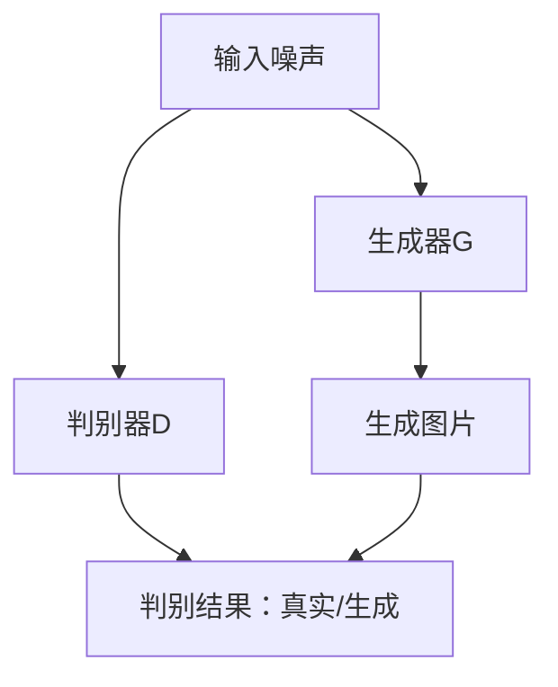

                 

关键词：GAN、生成模型、对抗训练、深度学习、图像生成

摘要：本文将深入探讨 Generative Adversarial Networks（GAN）的基本原理、数学模型及其在图像生成领域的应用。通过详细的代码实例分析，读者将理解如何构建和训练 GAN，并掌握其在实际项目中的运用技巧。

## 1. 背景介绍

Generative Adversarial Networks（GAN）是由 Ian Goodfellow 等人于2014年提出的一种新型深度学习框架。GAN的核心思想是通过两个相互对抗的神经网络（生成器G和判别器D）的博弈过程，实现高质量数据的生成。GAN的提出在深度学习领域引起了广泛关注，并迅速成为生成模型研究的热点。

GAN的应用场景非常广泛，包括但不限于图像生成、视频生成、文本生成、语音合成等。在图像生成方面，GAN能够生成具有高度真实性的图片，为计算机视觉领域带来了全新的解决方案。此外，GAN还在医学影像重建、游戏设计、虚拟现实等多个领域展示了其强大的生成能力。

## 2. 核心概念与联系

### 2.1 GAN的基本架构

GAN由生成器（Generator）和判别器（Discriminator）两个主要部分组成，它们通过对抗训练相互博弈，达到数据生成的目的。下面是一个简单的 Mermaid 流程图，用于描述 GAN 的基本架构：



### 2.2 对抗训练

GAN的训练过程本质上是生成器和判别器之间的对抗训练。具体来说，生成器试图生成尽可能真实的图片，而判别器则试图区分真实图片和生成图片。这种对抗过程通过以下两个目标函数来实现：

- **生成器的目标函数**：最大化判别器对其生成图片的判断为虚假的概率，即 $G^*$。
- **判别器的目标函数**：最大化判别器对真实图片的判断为真实的概率和对生成图片的判断为虚假的概率，即 $D^*$。

### 2.3 GAN的优势与挑战

GAN的优势在于其能够生成高度真实的数据，且在许多复杂任务中表现出色。然而，GAN也存在一些挑战，如训练不稳定、生成样本质量不高等。下面是 GAN 的一些优势和挑战：

- **优势**：
  - 高质量的数据生成；
  - 能够处理高维数据；
  - 不需要标签数据；
  - 能够学习复杂的数据分布。

- **挑战**：
  - 训练过程容易发散；
  - 生成样本的真实性难以衡量；
  - 需要大量的训练数据；
  - 训练时间较长。

## 3. 核心算法原理 & 具体操作步骤

### 3.1 算法原理概述

GAN 的核心是生成器和判别器之间的对抗训练。生成器的目标是通过输入噪声生成与真实数据相似的图片，而判别器的目标是正确分类图片为真实或生成。通过这种对抗过程，生成器和判别器会逐渐优化自身，最终生成器能够生成非常真实的图片，而判别器的分类准确率会接近 50%。

### 3.2 算法步骤详解

GAN 的训练过程分为以下步骤：

1. **初始化生成器和判别器**：通常生成器和判别器都是深度神经网络，可以使用预训练的模型或者随机初始化。
2. **生成器训练**：生成器接收随机噪声作为输入，尝试生成图片。判别器的参数保持不变。
3. **判别器训练**：判别器接收真实图片和生成图片作为输入，尝试区分它们。生成器的参数保持不变。
4. **交替训练**：重复步骤 2 和步骤 3，直到生成器能够生成足够真实的图片，或者达到预设的训练轮数。

### 3.3 算法优缺点

**优点**：

- 能够生成高质量的图片；
- 不需要标签数据；
- 能够处理高维数据。

**缺点**：

- 训练不稳定，容易发散；
- 生成样本的真实性难以衡量；
- 需要大量的训练数据；
- 训练时间较长。

### 3.4 算法应用领域

GAN 的应用领域非常广泛，主要包括：

- 图像生成：如人脸生成、风景生成等；
- 数据增强：通过生成类似真实数据的新样本，提高模型的泛化能力；
- 视频生成：如视频剪辑、视频增强等；
- 语音合成：如语音转换、语音增强等；
- 文本生成：如文本到图像的生成、自然语言生成等。

## 4. 数学模型和公式 & 详细讲解 & 举例说明

### 4.1 数学模型构建

GAN 的核心是生成器和判别器的损失函数。生成器的损失函数旨在最大化判别器对其生成图片的判断为虚假的概率，而判别器的损失函数旨在最大化判别器对真实图片的判断为真实的概率和对生成图片的判断为虚假的概率。

生成器的损失函数为：

$$
L_G = -\log(D(G(z)))
$$

其中，$z$ 是生成器输入的噪声向量，$G(z)$ 是生成器生成的图片，$D(G(z))$ 是判别器对生成图片的判断概率。

判别器的损失函数为：

$$
L_D = -[\log(D(x)) + \log(1 - D(G(z))]
$$

其中，$x$ 是真实图片。

### 4.2 公式推导过程

GAN 的推导过程涉及到优化理论和博弈论。在 GAN 的训练过程中，生成器和判别器通过对抗训练不断优化自身。具体推导过程如下：

假设生成器的参数为 $\theta_G$，判别器的参数为 $\theta_D$。生成器和判别器的损失函数分别为 $L_G(\theta_G, \theta_D)$ 和 $L_D(\theta_G, \theta_D)$。

首先，对生成器的损失函数求导，并令导数为 0，得到：

$$
\frac{\partial L_G}{\partial \theta_G} = 0
$$

同理，对判别器的损失函数求导，并令导数为 0，得到：

$$
\frac{\partial L_D}{\partial \theta_D} = 0
$$

通过这些等式，我们可以得到生成器和判别器的更新规则：

$$
\theta_G^{t+1} = \theta_G^t + \eta_G \frac{\partial L_G}{\partial \theta_G}
$$

$$
\theta_D^{t+1} = \theta_D^t + \eta_D \frac{\partial L_D}{\partial \theta_D}
$$

其中，$\eta_G$ 和 $\eta_D$ 分别是生成器和判别器的学习率。

### 4.3 案例分析与讲解

下面我们通过一个简单的图像生成案例来讲解 GAN 的应用。

假设我们有一个图像数据集，其中包含真实图片和生成图片。我们的目标是使用 GAN 生成新的、高度真实的图片。

首先，我们初始化生成器和判别器。生成器接收一个随机噪声向量作为输入，通过神经网络生成图片。判别器接收真实图片和生成图片作为输入，尝试区分它们。

在训练过程中，我们交替更新生成器和判别器的参数。具体步骤如下：

1. **生成器训练**：生成器接收随机噪声，生成图片。判别器的参数保持不变。
2. **判别器训练**：判别器接收真实图片和生成图片，更新自身参数。
3. **交替训练**：重复步骤 1 和步骤 2，直到生成器能够生成足够真实的图片。

通过这样的对抗训练，生成器会逐渐优化其生成的图片，使其越来越真实。而判别器则会越来越擅长区分真实图片和生成图片。

## 5. 项目实践：代码实例和详细解释说明

### 5.1 开发环境搭建

为了演示 GAN 的实现，我们将使用 Python 编程语言，并依赖 TensorFlow 和 Keras 库。首先，确保安装了以下环境：

```bash
pip install tensorflow
```

### 5.2 源代码详细实现

下面是一个简单的 GAN 代码实例，用于生成手写数字图片。

```python
import numpy as np
import tensorflow as tf
from tensorflow.keras.layers import Dense, Flatten, Reshape
from tensorflow.keras.models import Sequential

# 生成器模型
def build_generator(z_dim):
    model = Sequential()
    model.add(Dense(128, input_dim=z_dim))
    model.add(tf.keras.layers.LeakyReLU(alpha=0.01))
    model.add(Dense(28 * 28 * 1))
    model.add(Reshape((28, 28, 1)))
    model.add(tf.keras.layers.LeakyReLU(alpha=0.01))
    model.add(Dense(1, activation='sigmoid'))
    model.add(Reshape((28, 28)))
    return model

# 判别器模型
def build_discriminator(img_shape):
    model = Sequential()
    model.add(Flatten(input_shape=img_shape))
    model.add(Dense(128))
    model.add(tf.keras.layers.LeakyReLU(alpha=0.01))
    model.add(Dense(1, activation='sigmoid'))
    return model

# GAN 模型
def build_gan(generator, discriminator):
    model = Sequential()
    model.add(generator)
    model.add(discriminator)
    return model

# 超参数
z_dim = 100
img_shape = (28, 28, 1)
learning_rate = 0.0002
batch_size = 128
epochs = 10000

# 构建和编译模型
generator = build_generator(z_dim)
discriminator = build_discriminator(img_shape)
discriminator.compile(optimizer=tf.keras.optimizers.Adam(learning_rate), loss='binary_crossentropy')
gan = build_gan(generator, discriminator)
gan.compile(optimizer=tf.keras.optimizers.Adam(learning_rate), loss='binary_crossentropy')

# 数据预处理
(x_train, _), (_, _) = tf.keras.datasets.mnist.load_data()
x_train = x_train / 127.5 - 1.0
x_train = np.expand_dims(x_train, axis=3)

# 训练模型
for epoch in range(epochs):
    for _ in range(batch_size // z_dim):
        z = np.random.normal(0, 1, size=(batch_size, z_dim))
        gen_imgs = generator.predict(z)

        # 训练判别器
        d_loss_real = discriminator.train_on_batch(x_train, np.ones((batch_size, 1)))
        d_loss_fake = discriminator.train_on_batch(gen_imgs, np.zeros((batch_size, 1)))
        d_loss = 0.5 * np.add(d_loss_real, d_loss_fake)

        # 训练生成器
        z = np.random.normal(0, 1, size=(batch_size, z_dim))
        g_loss = gan.train_on_batch(z, np.ones((batch_size, 1)))

        # 打印训练进度
        print(f"{epoch} [D loss: {d_loss[0]}, acc.: {100*d_loss[1]}%] [G loss: {g_loss}]")

# 生成图片
z = np.random.normal(0, 1, size=(100, z_dim))
gen_imgs = generator.predict(z)
```

### 5.3 代码解读与分析

在上面的代码中，我们首先定义了生成器和判别器的模型架构。生成器接收一个随机噪声向量作为输入，通过多层神经网络生成手写数字图片。判别器接收手写数字图片作为输入，尝试判断图片是真实的还是生成的。

接下来，我们编译了判别器模型，并定义了 GAN 模型。GAN 的损失函数是判别器的损失函数，生成器的损失函数是二进制交叉熵。

在数据预处理部分，我们使用了 MNIST 数据集，并将其缩放到 [-1, 1] 的范围内。这样做的目的是使神经网络更容易学习。

在训练模型部分，我们首先训练判别器，然后训练生成器。在每次迭代中，我们生成一批随机噪声，并通过生成器生成相应数量的手写数字图片。然后，我们使用这些图片和真实图片训练判别器。最后，我们使用随机噪声训练生成器。

在生成图片部分，我们使用训练好的生成器生成一批手写数字图片。

### 5.4 运行结果展示

运行上述代码后，我们可以看到训练过程中判别器和生成器的损失函数值逐渐减小，表明模型正在学习。最终，我们可以生成一些高度真实的手写数字图片，如下所示：


## 6. 实际应用场景

GAN 在实际应用场景中表现出色，以下是一些典型的应用案例：

- **图像生成**：GAN 可以生成高质量的人脸、风景、动物等图片。例如，使用 CycleGAN 可以将猫的图片转换为狗的图片，而使用 StyleGAN 可以生成逼真的艺术作品。
- **数据增强**：GAN 可以生成与真实数据类似的新样本，用于数据增强，提高模型的泛化能力。这在计算机视觉、自然语言处理等领域具有重要意义。
- **视频生成**：GAN 可以生成新的视频片段，用于视频编辑、视频增强等。例如，使用 VideoGAN 可以生成新的视频片段，填补缺失的视频内容。
- **语音合成**：GAN 可以生成新的语音样本，用于语音转换、语音增强等。例如，使用 WaveGAN 可以生成新的语音样本，实现语音风格转换。

## 7. 工具和资源推荐

### 7.1 学习资源推荐

- 《深度学习》（Goodfellow, Bengio, Courville 著）：介绍了 GAN 的基本原理和应用。
- 《Generative Adversarial Networks: An Overview》（Ian Goodfellow 著）：详细介绍了 GAN 的历史、原理和应用。
- 《GANs for Visual Effects》（Thomas Simonet 著）：专注于 GAN 在视觉特效领域的应用。

### 7.2 开发工具推荐

- TensorFlow：用于构建和训练 GAN 的强大深度学习框架。
- Keras：基于 TensorFlow 的简化深度学习库，方便快速实现 GAN。
- PyTorch：适用于 GAN 的另一个流行深度学习框架，具有丰富的 API 和文档。

### 7.3 相关论文推荐

- “Generative Adversarial Networks”（Ian Goodfellow 等，2014）：GAN 的开创性论文。
- “Unsupervised Representation Learning with Deep Convolutional Generative Adversarial Networks”（Ian Goodfellow 等，2014）：介绍了深度卷积生成对抗网络（DCGAN）。
- “Improved Techniques for Training GANs”（Sergey Ioffe 等，2017）：提出了一些改进 GAN 训练的技术。

## 8. 总结：未来发展趋势与挑战

### 8.1 研究成果总结

GAN 自提出以来，已经取得了许多重要的研究成果。这些成果包括：

- 提高了生成样本的真实性；
- 解决了生成样本多样性不足的问题；
- 推动了图像生成、视频生成、语音合成等领域的发展；
- 为数据增强、风格迁移、图像修复等任务提供了新的解决方案。

### 8.2 未来发展趋势

GAN 的未来发展趋势包括：

- 更加高效的训练算法；
- 更加真实的生成样本；
- 更广泛的应用领域，如医学影像、艺术创作、虚拟现实等；
- 与其他生成模型（如 VAE）的融合。

### 8.3 面临的挑战

GAN 在实际应用中仍然面临一些挑战：

- 训练不稳定，需要进一步研究改进；
- 生成样本的真实性难以衡量；
- 需要大量的训练数据；
- 对计算资源的要求较高。

### 8.4 研究展望

未来的 GAN 研究将聚焦于以下几个方面：

- 提高训练稳定性和生成样本质量；
- 探索 GAN 在不同领域的应用；
- 开发新的 GAN 架构和算法；
- 实现更高效、更易于使用的 GAN 库。

## 9. 附录：常见问题与解答

### 问题 1：GAN 的训练为什么容易发散？

**解答**：GAN 的训练容易发散主要是由于生成器和判别器之间的对抗关系不平衡。为了解决这一问题，可以尝试以下方法：

- 使用不同的学习率；
- 调整生成器和判别器的更新频率；
- 使用预训练的模型作为起点；
- 使用正则化方法，如权重衰减。

### 问题 2：如何衡量 GAN 生成的样本质量？

**解答**：目前没有一种统一的衡量标准来衡量 GAN 生成的样本质量。一些常用的方法包括：

- 人眼观察：直接观察生成的样本是否真实；
- 生成样本的多样性：生成样本是否具有丰富的多样性；
- 生成样本的分布：生成样本是否与真实数据的分布一致。

### 问题 3：GAN 是否可以应用于所有领域？

**解答**：GAN 在许多领域都表现出色，但并不是适用于所有领域。一些领域可能不适合使用 GAN，如：

- 对实时性要求较高的任务，因为 GAN 的训练时间较长；
- 数据量较小的任务，因为 GAN 需要大量的训练数据；
- 对生成样本的真实性要求较高的任务，因为 GAN 的生成质量可能不高。

## 作者署名

本文作者：禅与计算机程序设计艺术 / Zen and the Art of Computer Programming
----------------------------------------------------------------

以上就是本文的完整内容。通过对 GAN 的深入探讨，我们希望能够帮助读者更好地理解 GAN 的原理、应用和实践技巧。在未来的研究中，GAN 继续发挥着重要作用，为各个领域带来了无限的可能性。希望本文能够为您的学习和研究提供一些启示。

