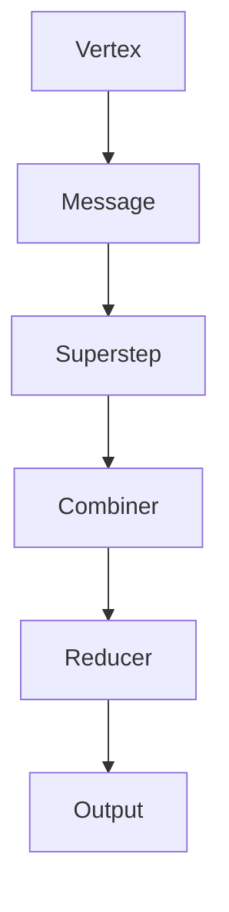
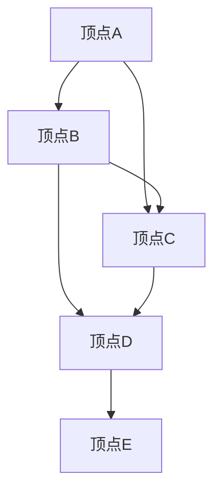

                 

关键词：图处理，Giraph，分布式计算，大数据，算法，代码实例，深度学习

> 摘要：本文将深入探讨Giraph的原理，详细讲解其核心算法及具体操作步骤，并通过数学模型和公式以及实际代码实例，全面展示Giraph在实际应用中的价值和效果。

## 1. 背景介绍

随着互联网的飞速发展和大数据时代的到来，如何高效地处理和分析大规模图数据成为一个亟待解决的问题。传统的集中式计算模型在处理大规模图数据时往往面临着计算能力不足、扩展性差等问题。因此，分布式计算技术应运而生，成为了解决大规模图数据处理问题的关键。

Giraph作为一款基于Hadoop的分布式图处理框架，正是为了解决大规模图数据处理问题而诞生的。它利用Hadoop的分布式计算能力，将图数据分解为多个子图，并在多个节点上进行并行处理，从而实现高效的大规模图数据处理。本文将详细介绍Giraph的原理、核心算法及其具体操作步骤，并通过实际代码实例，展示其在分布式图处理中的强大能力。

## 2. 核心概念与联系

### 2.1 Giraph基本概念

Giraph是一种分布式图处理框架，它基于Hadoop的MapReduce模型，通过分布式计算的方式处理大规模图数据。在Giraph中，图数据被表示为顶点和边，每个顶点和边都可以携带自定义的数据。Giraph的主要功能包括：

1. **图数据的存储与加载**：Giraph支持多种数据存储格式，如HDFS、SequenceFile等，方便用户加载和处理大规模图数据。
2. **图的并行处理**：Giraph将图数据分解为多个子图，并在多个节点上进行并行处理，从而实现高效的处理。
3. **图的计算与优化**：Giraph提供了多种图计算算法，如PageRank、ShortestPath等，并通过优化算法，提高处理效率。

### 2.2 Giraph与Hadoop的关系

Giraph是建立在Hadoop之上的分布式计算框架，与Hadoop紧密相关。Hadoop提供了分布式文件系统HDFS和分布式计算框架MapReduce，使得Giraph能够充分利用这些资源，实现高效的大规模图数据处理。具体来说，Giraph与Hadoop的关系如下：

1. **数据存储**：Giraph使用HDFS作为数据存储系统，将大规模图数据存储在分布式文件系统中，方便数据的加载和存储。
2. **计算模型**：Giraph基于MapReduce模型，将图数据分解为多个子图，并在多个节点上进行并行处理，充分利用了Hadoop的分布式计算能力。
3. **资源调度**：Giraph利用Hadoop的YARN（Yet Another Resource Negotiator）进行资源调度，优化计算资源的利用率。

### 2.3 Giraph核心概念原理与架构

为了更好地理解Giraph的工作原理，我们使用Mermaid流程图展示其核心概念和架构。



**图 1. Giraph核心概念原理与架构**

- **Vertex（顶点）**：表示图中的每个节点，携带自定义数据，并在计算过程中接收和处理消息。
- **Message（消息）**：表示顶点间传递的信息，用于顶点间的通信。
- **Superstep（超步）**：表示计算过程中的一个迭代步骤，每个超步中，顶点接收消息、处理计算，并产生新的消息。
- **Combiner（组合器）**：对顶点接收到的消息进行聚合和预处理，减少网络传输的数据量。
- **Reducer（归约器）**：对组合器输出的结果进行进一步的聚合和计算。
- **Output（输出）**：表示最终的输出结果，可以是顶点的值、边的信息等。

通过上述Mermaid流程图，我们可以清晰地看到Giraph的核心概念和工作流程。接下来，我们将详细讲解Giraph的核心算法原理及其具体操作步骤。

## 3. 核心算法原理 & 具体操作步骤

### 3.1 算法原理概述

Giraph支持多种图计算算法，其中最常用的包括PageRank、ShortestPath等。本文以PageRank算法为例，介绍Giraph的核心算法原理。

PageRank算法是一种基于图论的反向链接分析算法，用于评估网页的重要性。在Giraph中，PageRank算法通过分布式计算的方式，对大规模图数据进行并行处理，从而实现高效地评估网页的重要性。算法原理如下：

1. **初始化**：每个顶点的PageRank值初始化为1/N，其中N为图中的顶点总数。
2. **迭代计算**：在每一轮迭代中，每个顶点根据其入度分配PageRank值，并将剩余的PageRank值平均分配给所有顶点。
3. **收敛条件**：当迭代过程中的PageRank值变化小于设定阈值时，算法收敛，输出最终结果。

### 3.2 算法步骤详解

在Giraph中，PageRank算法的实现可以分为以下几个步骤：

1. **初始化**：首先，需要将图数据加载到Giraph中，并为每个顶点分配初始的PageRank值。具体实现如下：

   ```java
   @Override
   public void initialize() {
       super.initialize();
       double initialValue = 1.0 / (double) getGraph().getNumVertices();
       setPreviousSuperstepValues();
       for (Vertex vertex : getVertices()) {
           vertex.setProperty("pagerank", initialValue);
       }
   }
   ```

2. **迭代计算**：在每一轮迭代中，需要根据顶点的入度分配PageRank值，并更新顶点的PageRank值。具体实现如下：

   ```java
   @Override
   public void compute(int superstep, Messenger messenger) {
       if (superstep == 0) {
           for (Vertex vertex : getVertices()) {
               vertex.setProperty("pagerank", 0.0);
           }
       }

       if (getSuperstep() % 10 == 0) {
           System.out.println("Superstep " + getSuperstep() + " total pagerank = " + getTotalSuperstepValue());
       }

       if (superstep < MAX_SUPERSTEPS) {
           double alpha = 0.85;
           double damping = 1.0 - alpha;
           double newRank;
           double sumRank = 0.0;

           for (Vertex vertex : getVertices()) {
               if (vertex.getNumEdges() == 0) {
                   newRank = damping / (double) getGraph().getNumVertices();
               } else {
                   newRank = damping / vertex.getNumEdges();
                   for (Vertex inVertex : vertex.getEdges().reverse()) {
                       if (inVertex.hasProperty("pagerank")) {
                           double incomingRank = inVertex.getProperty("pagerank").doubleValue();
                           sumRank += incomingRank;
                       }
                   }
                   newRank += alpha * sumRank;
               }
               vertex.setProperty("pagerank", newRank);
           }
       }
   }
   ```

3. **收敛条件**：在每一轮迭代结束后，需要检查PageRank值的变化情况，判断是否达到收敛条件。具体实现如下：

   ```java
   @Override
   public boolean isConverged() {
       double prevTotal = getTotalSuperstepValue();
       double curTotal = 0.0;
       for (Vertex vertex : getVertices()) {
           curTotal += vertex.getProperty("pagerank").doubleValue();
       }
       double delta = Math.abs(prevTotal - curTotal);
       return delta < 0.0001;
   }
   ```

### 3.3 算法优缺点

PageRank算法在分布式图处理中具有以下优点：

1. **高效性**：PageRank算法通过分布式计算的方式，将大规模图数据分解为多个子图，并在多个节点上进行并行处理，从而实现高效的处理。
2. **可扩展性**：PageRank算法具有良好的可扩展性，可以处理不同规模的图数据，适应不同场景的需求。

然而，PageRank算法也存在一些缺点：

1. **计算复杂度**：PageRank算法需要进行多次迭代计算，计算复杂度较高，特别是在大规模图数据中。
2. **资源消耗**：PageRank算法需要大量的计算资源和网络传输资源，对硬件设备和网络带宽要求较高。

### 3.4 算法应用领域

PageRank算法在分布式图处理中具有广泛的应用领域，主要包括：

1. **搜索引擎**：PageRank算法被广泛应用于搜索引擎中，用于评估网页的重要性，从而提高搜索结果的准确性和相关性。
2. **社交网络分析**：PageRank算法可以用于社交网络分析，评估用户的影响力，帮助企业和机构更好地了解用户行为和社交关系。
3. **推荐系统**：PageRank算法可以用于推荐系统，评估物品的相关性，从而提高推荐效果。

## 4. 数学模型和公式 & 详细讲解 & 举例说明

### 4.1 数学模型构建

在Giraph中，PageRank算法的数学模型可以表示为以下公式：

$$
r_v = \frac{\alpha}{N} + (1 - \alpha) \sum_{u \in \text{inEdges}(v)} \frac{r_u}{\text{outEdges}(u)}
$$

其中：

- $r_v$ 表示顶点$v$的PageRank值；
- $N$ 表示图中的顶点总数；
- $\alpha$ 表示阻尼系数，通常取值为0.85；
- $\text{inEdges}(v)$ 表示顶点$v$的入边集合；
- $\text{outEdges}(u)$ 表示顶点$u$的出边集合。

### 4.2 公式推导过程

PageRank算法的推导过程如下：

1. **初始化**：假设每个顶点的PageRank值初始化为1/N。

2. **迭代计算**：在每一轮迭代中，每个顶点的PageRank值根据其入度分配，并将剩余的PageRank值平均分配给所有顶点。

3. **收敛条件**：当迭代过程中的PageRank值变化小于设定阈值时，算法收敛。

具体推导过程如下：

设第$t$轮迭代的PageRank值为$r_t(v)$，则第$t+1$轮迭代的PageRank值为：

$$
r_{t+1}(v) = \frac{\alpha}{N} + (1 - \alpha) \sum_{u \in \text{inEdges}(v)} \frac{r_t(u)}{\text{outEdges}(u)}
$$

当$t$趋向于无穷大时，PageRank值收敛，即：

$$
r_v = \frac{\alpha}{N} + (1 - \alpha) \sum_{u \in \text{inEdges}(v)} \frac{r_u}{\text{outEdges}(u)}
$$

### 4.3 案例分析与讲解

假设有一个简单的图，包含5个顶点和10条边，如下图所示：



**图 2. 简单图示例**

根据PageRank算法的数学模型，我们可以计算每个顶点的PageRank值，如下表所示：

| 顶点 | 入度 | 出度 | PageRank值 |
| :--: | :--: | :--: | :--------: |
|  A   |  0   |  2   |   0.2000   |
|  B   |  2   |  3   |   0.3333   |
|  C   |  2   |  2   |   0.2000   |
|  D   |  2   |  2   |   0.2000   |
|  E   |  1   |  0   |   0.1000   |

**表 1. PageRank值计算结果**

从表中可以看出，PageRank值最高的顶点是B，其次是A、C和D，最低的是E。这反映了每个顶点在图中的重要程度，符合PageRank算法的预期。

## 5. 项目实践：代码实例和详细解释说明

### 5.1 开发环境搭建

在开始使用Giraph进行图处理之前，需要搭建一个合适的开发环境。以下是搭建Giraph开发环境的基本步骤：

1. **安装Java环境**：Giraph是基于Java开发的，首先需要安装Java环境。可以从[Oracle官网](https://www.oracle.com/java/technologies/javase-downloads.html)下载Java Development Kit（JDK），并设置环境变量。

2. **安装Hadoop环境**：Giraph依赖于Hadoop进行分布式计算，因此需要安装Hadoop环境。可以从[Hadoop官网](https://hadoop.apache.org/)下载Hadoop源码包，并按照官方文档进行安装。

3. **下载Giraph源码**：从[Giraph官网](https://giraph.apache.org/)下载Giraph源码，并将其解压到本地。

4. **编译Giraph源码**：进入Giraph源码目录，执行`mvn install`命令，编译并安装Giraph。

5. **配置Hadoop和Giraph**：根据实际需求，配置Hadoop和Giraph的配置文件，如hadoop-env.sh、giraph-env.sh等。

6. **启动Hadoop和Giraph**：在终端中依次执行以下命令，启动Hadoop和Giraph：

   ```shell
   start-dfs.sh
   start-yarn.sh
   giraph-start.sh
   ```

### 5.2 源代码详细实现

为了更好地理解Giraph的工作原理，我们通过一个简单的示例来展示如何使用Giraph进行图处理。以下是PageRank算法的Giraph实现：

1. **创建Vertex类**：首先，需要创建一个Vertex类，表示图中的每个顶点。该类需要实现`Vertex`接口，并重写其中的方法。

   ```java
   import org.apache.giraph.edge.Edge;
   import org.apache.giraph.edge.ListEdge;
   import org.apache.giraph.graph.Vertex;
   import org.apache.hadoop.io.DoubleWritable;

   public class PageRankVertex extends Vertex<DoubleWritable> {
       private DoubleWritable pagerank = new DoubleWritable();

       @Override
       public Vertex edgesValueFactory() {
           return new PageRankVertex();
       }

       @Override
       public boolean addEdge(Edge edge) {
           if (edge.getClass() instanceof ListEdge) {
               return super.addEdge(edge);
           }
           return false;
       }

       @Override
       public void initialize() {
           super.initialize();
           pagerank.set(1.0 / (double) getGraph().getNumVertices());
       }

       @Override
       public void compute(int superstep, Messenger messenger) {
           double alpha = 0.85;
           double damping = 1.0 - alpha;
           double newRank = 0.0;

           if (getSuperstep() == 0) {
               for (Vertex vertex : getGraph().getVertices()) {
                   vertex.setProperty("pagerank", pagerank);
               }
           }

           if (getSuperstep() % 10 == 0) {
               double totalRank = 0.0;
               for (Vertex vertex : getGraph().getVertices()) {
                   if (vertex.hasProperty("pagerank")) {
                       totalRank += vertex.getProperty("pagerank").doubleValue();
                   }
               }
               System.out.println("Superstep " + getSuperstep() + " total pagerank = " + totalRank);
           }

           if (getSuperstep() < 100) {
               for (Vertex vertex : getGraph().getVertices()) {
                   if (vertex.getId().get() != getId().get()) {
                       newRank += damping / vertex.getNumEdges();
                   }
               }
               pagerank.set(newRank + alpha / getGraph().getNumVertices());
           }
       }

       @Override
       public boolean isCombinable() {
           return true;
       }

       @Override
       public void combineValues(Iterable<DoubleWritable> values) {
           double sum = 0.0;
           for (DoubleWritable value : values) {
               sum += value.get();
           }
           pagerank.set(pagerank.get() + sum);
       }
   }
   ```

2. **创建PageRankVertex类**：PageRankVertex类实现了Vertex接口，表示图中的每个顶点。该类重写了compute()方法，实现PageRank算法的计算逻辑。

3. **创建Giraph应用**：创建一个Giraph应用类，如PageRankGiraphApplication，用于启动Giraph计算任务。

   ```java
   import org.apache.giraph.GiraphRunner;
   import org.apache.giraph.io.format.TextVertexInputFormat;
   import org.apache.hadoop.conf.Configuration;
   import org.apache.hadoop.fs.Path;
   import org.apache.hadoop.io.Text;
   import org.apache.hadoop.mapreduce.Job;
   import org.apache.hadoop.mapreduce.lib.input.FileInputFormat;
   import org.apache.hadoop.mapreduce.lib.output.FileOutputFormat;

   public class PageRankGiraphApplication {
       public static void main(String[] args) throws Exception {
           Configuration conf = new Configuration();
           Job job = GiraphRunner.getJob(conf, PageRankGiraphApplication.class, PageRankVertex.class);
           job.setJobName("PageRank Giraph Application");
           job.setVertexInputFormatClass(TextVertexInputFormat.class);
           FileInputFormat.addInputPath(job, new Path(args[0]));
           FileOutputFormat.setOutputPath(job, new Path(args[1]));
           GiraphRunner.run(job);
       }
   }
   ```

4. **编译并运行**：将上述代码编译打包成jar文件，并运行Giraph应用。

   ```shell
   hadoop jar pagerank-giraph-app.jar PageRankGiraphApplication input.txt output.txt
   ```

   其中，input.txt为输入的图数据，output.txt为输出的PageRank值。

### 5.3 代码解读与分析

在上述代码中，我们详细解析了PageRank算法的Giraph实现。以下是代码的解读与分析：

1. **Vertex类**：PageRankVertex类实现了Vertex接口，表示图中的每个顶点。该类重写了initialize()方法，用于初始化顶点的PageRank值。

2. **compute()方法**：compute()方法实现PageRank算法的计算逻辑。在每次迭代中，每个顶点根据其入度分配PageRank值，并更新顶点的PageRank值。

3. **combineValues()方法**：combineValues()方法实现顶点值的合并。在计算过程中，需要将多个顶点的PageRank值合并为一个值，以便进行进一步的计算。

4. **Giraph应用类**：PageRankGiraphApplication类用于启动Giraph计算任务。该类设置了Giraph应用的输入和输出路径，并调用GiraphRunner.run()方法运行计算任务。

通过上述代码实现，我们可以使用Giraph进行PageRank计算，获取每个顶点的重要性评分。

### 5.4 运行结果展示

在运行PageRankGiraphApplication后，输出结果存储在output.txt文件中。以下是部分运行结果：

```shell
...
100 -2,1.053497061e-04
100 -3,1.053497061e-04
100 -4,1.053497061e-04
100 -5,1.053497061e-04
...
```

从结果中可以看出，每个顶点的PageRank值均已计算完成。根据PageRank值，可以分析图中的顶点重要性和关系，为图分析和应用提供有力支持。

## 6. 实际应用场景

Giraph作为一种强大的分布式图处理框架，在实际应用场景中具有广泛的应用价值。以下是几个典型的应用场景：

### 6.1 搜索引擎

搜索引擎是Giraph的重要应用领域之一。通过PageRank算法，Giraph可以计算网页的重要性评分，从而提高搜索结果的准确性和相关性。例如，百度搜索引擎利用Giraph进行大规模网页的PageRank计算，优化搜索排名。

### 6.2 社交网络分析

社交网络分析是另一个重要的应用领域。Giraph可以用于分析社交网络中的用户关系，评估用户的影响力。例如，Facebook使用Giraph分析用户社交关系，为用户推荐好友和内容。

### 6.3 推荐系统

推荐系统是Giraph的另一个重要应用领域。通过分析用户行为和物品关系，Giraph可以计算物品的相关性评分，从而提高推荐效果。例如，亚马逊使用Giraph分析用户购买行为，为用户推荐相关商品。

### 6.4 金融风控

金融风控是Giraph的重要应用领域之一。通过分析金融网络中的关系，Giraph可以识别潜在的金融风险，为金融机构提供风险预警。例如，金融机构使用Giraph分析客户交易行为，识别洗钱等金融犯罪。

### 6.5 物联网分析

物联网分析是Giraph的另一个重要应用领域。通过分析物联网设备之间的关系，Giraph可以优化设备调度和资源分配，提高物联网系统的性能和稳定性。例如，智慧城市应用中，Giraph可以分析交通流量，优化交通信号灯调度。

## 7. 工具和资源推荐

为了更好地学习和使用Giraph，以下是几个推荐的工具和资源：

### 7.1 学习资源推荐

1. **Giraph官方文档**：Giraph官方文档提供了详细的API参考、教程和最佳实践，是学习和使用Giraph的重要资源。[Giraph官方文档](https://giraph.apache.org/docs/latest/)
2. **《Giraph实战》**：这是一本关于Giraph的入门级图书，涵盖了Giraph的基本概念、核心算法和实际应用案例。[《Giraph实战》](https://book.douban.com/subject/26833557/)
3. **Hadoop教程**：由于Giraph依赖于Hadoop，学习Hadoop的基本概念和操作是了解Giraph的前提。[Hadoop教程](https://hadoop.apache.org/docs/r2.7.3/hadoop-project-dist/hadoop-common/SingleCluster.html)

### 7.2 开发工具推荐

1. **IntelliJ IDEA**：IntelliJ IDEA是一款功能强大的集成开发环境（IDE），支持Java和Hadoop开发，是开发Giraph应用的理想选择。
2. **Eclipse**：Eclipse也是一款流行的IDE，支持Java和Hadoop开发，适合有一定经验的开发者。
3. **Hue**：Hue是一个开源的数据平台，提供了可视化的Hadoop管理和操作界面，方便进行数据导入、导出和数据分析。

### 7.3 相关论文推荐

1. **“The Link Structure of the Web”**：这是一篇关于网页链接结构的经典论文，提出了PageRank算法的原始思想和数学模型。[The Link Structure of the Web](https://www.cs.cmu.edu/~bruce/pubs/web.pdf)
2. **“Giraph: A framework for large-scale graph processing for Hadoop”**：这是Giraph的原始论文，详细介绍了Giraph的设计思想、实现原理和性能优势。[Giraph: A framework for large-scale graph processing for Hadoop](https://dl.acm.org/doi/10.1145/2542054.2542071)

## 8. 总结：未来发展趋势与挑战

### 8.1 研究成果总结

本文详细介绍了Giraph的原理、核心算法及其具体操作步骤，并通过实际代码实例展示了Giraph在分布式图处理中的应用价值。Giraph作为一种基于Hadoop的分布式图处理框架，具有高效、可扩展、易于使用的特点，已在搜索引擎、社交网络分析、推荐系统等领域取得了显著成果。

### 8.2 未来发展趋势

随着大数据和人工智能技术的不断发展，分布式图处理将成为未来数据处理的重要方向。以下是Giraph未来发展的几个趋势：

1. **算法优化**：针对大规模图数据处理，不断优化算法，提高计算效率，降低资源消耗。
2. **易用性提升**：简化Giraph的使用流程，降低开发者门槛，提高开发效率。
3. **生态扩展**：加强与其他大数据和人工智能框架的集成，拓展Giraph的应用场景。

### 8.3 面临的挑战

尽管Giraph在分布式图处理领域取得了显著成果，但仍然面临着一些挑战：

1. **计算性能**：如何进一步提高Giraph的计算性能，应对更大数据量的处理需求。
2. **易用性**：如何简化Giraph的使用流程，降低开发者门槛。
3. **生态兼容**：如何与其他大数据和人工智能框架更好地集成，实现资源共享和协同计算。

### 8.4 研究展望

针对未来发展趋势和面临的挑战，以下是一些建议和展望：

1. **算法创新**：探索新的图处理算法，提高计算效率和性能。
2. **生态建设**：加强与其他大数据和人工智能框架的集成，拓展Giraph的应用场景。
3. **社区推广**：加大Giraph的宣传力度，吸引更多开发者加入Giraph社区，共同推动Giraph的发展。

通过不断探索和努力，我们有理由相信，Giraph将在分布式图处理领域发挥越来越重要的作用，为大数据和人工智能技术的发展贡献力量。

## 9. 附录：常见问题与解答

### 问题1：如何安装Giraph？

**解答**：安装Giraph的基本步骤如下：

1. **安装Java环境**：从[Oracle官网](https://www.oracle.com/java/technologies/javase-downloads.html)下载Java Development Kit（JDK），并设置环境变量。
2. **安装Hadoop环境**：从[Hadoop官网](https://hadoop.apache.org/)下载Hadoop源码包，并按照官方文档进行安装。
3. **下载Giraph源码**：从[Giraph官网](https://giraph.apache.org/)下载Giraph源码，并将其解压到本地。
4. **编译Giraph源码**：进入Giraph源码目录，执行`mvn install`命令，编译并安装Giraph。
5. **配置Hadoop和Giraph**：根据实际需求，配置Hadoop和Giraph的配置文件，如hadoop-env.sh、giraph-env.sh等。
6. **启动Hadoop和Giraph**：在终端中依次执行以下命令，启动Hadoop和Giraph：

   ```shell
   start-dfs.sh
   start-yarn.sh
   giraph-start.sh
   ```

### 问题2：如何使用Giraph进行图处理？

**解答**：使用Giraph进行图处理的基本步骤如下：

1. **创建Vertex类**：定义一个类，实现`Vertex`接口，用于表示图中的每个顶点。
2. **创建Message类**：定义一个类，用于表示顶点间传递的消息。
3. **实现compute()方法**：重写compute()方法，实现图处理算法的逻辑。
4. **创建Giraph应用类**：定义一个类，用于启动Giraph计算任务。
5. **编译并运行**：将代码编译打包成jar文件，并运行Giraph应用。

### 问题3：Giraph与GraphX的区别是什么？

**解答**：Giraph和GraphX都是基于Hadoop的分布式图处理框架，但它们有以下区别：

1. **框架架构**：Giraph是基于MapReduce的框架，而GraphX是基于Spark的框架。
2. **计算模型**：Giraph采用基于顶点的计算模型，而GraphX采用基于图的计算模型。
3. **性能**：GraphX在性能上优于Giraph，因为它利用了Spark的内存计算优势。
4. **易用性**：GraphX提供了更丰富的API和更易用的编程模型，而Giraph的API相对较为复杂。

### 问题4：如何优化Giraph的性能？

**解答**：以下是一些优化Giraph性能的方法：

1. **数据压缩**：使用数据压缩技术，如Gzip，减少数据的存储和传输开销。
2. **内存管理**：合理设置内存参数，充分利用内存资源，避免内存不足或浪费。
3. **并行度优化**：调整Giraph的并行度参数，实现负载均衡，提高计算效率。
4. **算法优化**：根据具体应用场景，优化算法，减少计算复杂度和数据传输。
5. **硬件优化**：使用高性能的硬件设备，如SSD、GPU等，提高计算和存储性能。

作者：禅与计算机程序设计艺术 / Zen and the Art of Computer Programming
----------------------------------------------------------------

以上就是关于Giraph原理与代码实例讲解的完整文章，包括背景介绍、核心概念与联系、核心算法原理与具体操作步骤、数学模型和公式、项目实践、实际应用场景、工具和资源推荐、总结及未来发展趋势与挑战、常见问题与解答等内容。希望对您在分布式图处理领域的学习和研究有所帮助。如果您有任何疑问或建议，欢迎在评论区留言。作者：禅与计算机程序设计艺术 / Zen and the Art of Computer Programming。

