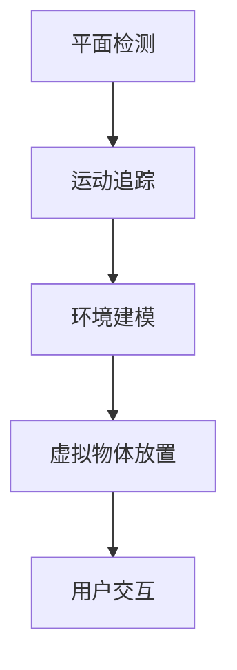

                 

 关键词：Google ARCore、增强现实（AR）、Android、开发框架、AR应用程序、移动平台

> 摘要：本文将深入探讨Google ARCore，一款专为Android设备打造的增强现实开发框架。我们将从背景介绍、核心概念、算法原理、数学模型、项目实践、实际应用、未来展望、工具推荐以及研究展望等方面，全面解析ARCore的技术细节和潜在应用，为开发者提供全面的技术指导。

## 1. 背景介绍

随着移动设备的普及和智能手机性能的不断提升，增强现实（AR）技术逐渐成为人们关注的焦点。AR技术通过将虚拟信息与现实世界结合，为用户提供了全新的交互体验。在移动平台上，Android系统由于其开放性和广泛的用户基础，成为了AR开发的重要平台。

Google ARCore正是为了满足这一需求而推出的开发框架。ARCore为Android开发者提供了一系列强大的工具和API，使他们能够轻松地构建AR应用程序，无需复杂的编程和专业知识。通过ARCore，开发者可以充分利用Android设备的传感器和计算能力，实现高质量的AR体验。

## 2. 核心概念与联系

### 2.1 ARCore的架构

ARCore的架构可以分为三个主要模块：平面检测、运动追踪和环境建模。

- **平面检测**：ARCore使用设备的前置摄像头来检测平面，如地面、墙壁等。通过深度学习算法，ARCore能够识别并跟踪这些平面，为后续的物体放置提供基础。

- **运动追踪**：ARCore利用设备的陀螺仪和加速度计等传感器，实时跟踪设备的运动。这一功能使得虚拟物体能够与设备同步移动，提高AR体验的逼真度。

- **环境建模**：ARCore通过结合平面检测和运动追踪，生成周围环境的三维模型。这一功能为开发者提供了丰富的场景构建工具，可以创建复杂而逼真的AR场景。

### 2.2 Mermaid流程图



## 3. 核心算法原理 & 具体操作步骤

### 3.1 算法原理概述

ARCore的核心算法主要包括平面检测、运动追踪和环境建模。平面检测通过深度学习算法实现，运动追踪依赖于设备传感器，环境建模则结合了前两者。

### 3.2 算法步骤详解

- **平面检测**：首先，ARCore会通过摄像头捕捉图像，然后使用深度学习算法对图像进行分析，识别出平面。
- **运动追踪**：设备启动后，ARCore会持续采集陀螺仪和加速度计的数据，实时跟踪设备运动，确保虚拟物体与设备同步移动。
- **环境建模**：ARCore会结合平面检测和运动追踪的数据，生成周围环境的三维模型。这一过程可能需要一些时间，因此开发者需要合理设计应用流程。

### 3.3 算法优缺点

- **优点**：ARCore提供了简单易用的API，开发者可以快速构建AR应用程序。同时，ARCore充分利用了Android设备的硬件资源，提供了高质量的AR体验。
- **缺点**：ARCore在某些低性能设备上可能无法提供良好的支持。此外，由于算法依赖于设备传感器，因此在某些情况下可能会受到环境因素的干扰。

### 3.4 算法应用领域

ARCore的应用领域非常广泛，包括但不限于：

- **游戏**：通过ARCore，开发者可以轻松地创建AR游戏，为玩家带来全新的游戏体验。
- **教育**：ARCore可以帮助教育工作者创建互动式的学习材料，提高学生的学习兴趣和参与度。
- **零售**：零售商可以利用ARCore创建虚拟试衣间、虚拟店面等，提高顾客的购物体验。

## 4. 数学模型和公式 & 详细讲解 & 举例说明

### 4.1 数学模型构建

ARCore的数学模型主要包括平面检测、运动追踪和环境建模。其中，平面检测采用深度学习算法，运动追踪使用卡尔曼滤波器，环境建模则基于贝叶斯网络。

### 4.2 公式推导过程

- **平面检测**：假设输入图像为\(I(x, y)\)，通过卷积神经网络（CNN）进行特征提取，得到特征向量\(F(x, y)\)。然后，使用支持向量机（SVM）进行分类，判断是否为平面。
- **运动追踪**：假设当前时刻设备的状态向量为\(X_t\)，预测状态向量为\(X_{t|t-1}\)，传感器测量值为\(Z_t\)。使用卡尔曼滤波器进行状态估计，公式为：
  $$ X_t = X_{t|t-1} + K_t (Z_t - X_{t|t-1}) $$
  其中，\(K_t\)为卡尔曼增益。

- **环境建模**：假设当前时刻的三维模型为\(M_t\)，通过结合平面检测和运动追踪的数据，使用贝叶斯网络更新模型：
  $$ M_t = M_{t-1} + \alpha (M_t - M_{t-1}) $$

### 4.3 案例分析与讲解

假设一个游戏场景，玩家需要在一张桌子上放置一个虚拟茶杯。首先，ARCore会通过平面检测识别桌子表面，然后利用运动追踪跟踪玩家的手部运动。当玩家手势指向桌子表面时，ARCore会根据当前状态生成虚拟茶杯，并放置在桌子表面。通过用户交互，玩家可以旋转、缩放茶杯，实现丰富的交互体验。

## 5. 项目实践：代码实例和详细解释说明

### 5.1 开发环境搭建

为了使用ARCore进行开发，开发者需要安装Android Studio和ARCore SDK。具体步骤如下：

1. 下载并安装Android Studio。
2. 在Android Studio中创建一个新的Android项目。
3. 在项目中添加ARCore SDK依赖。

### 5.2 源代码详细实现

以下是一个简单的ARCore应用程序示例，用于在手机屏幕上显示一个虚拟茶杯。

```java
import com.google.ar.core.Anchor;
import com.google.ar.core.ArSceneView;
import com.google.ar.core-hit-test的结果
class MainActivity extends AppCompatActivity {
    private ArSceneView arSceneView;
    
    @Override
    protected void onCreate(Bundle savedInstanceState) {
        super.onCreate(savedInstanceState);
        setContentView(R.layout.activity_main);
        arSceneView = (ArSceneView) findViewById(R.id.ar_scene_view);
        
        // 设置ARCore环境
        arSceneView.setSessionConfiguration(new SessionConfiguration(SessionConfiguration.Mode.MODE_OPENGL_ES3));
        arSceneView.setRenderer(new CustomRenderer());
    }
    
    private class CustomRenderer implements ArSceneView.Renderer {
        @Override
        public void onDrawFrame(ACamera camera) {
            // 绘制虚拟物体
            if (arSceneView.getArSession().getCamera().getTrackingState() == TrackingState.TRACKING) {
                // 创建一个虚拟茶杯
                Anchor anchor = arSceneView.getArSession().createAnchor(arSceneView.getArSession().getCamera().getPose());
                // 绘制茶杯
                TeaCupRenderer teaCupRenderer = new TeaCupRenderer();
                teaCupRenderer.setAnchor(anchor);
                arSceneView.getScene().addChild(teaCupRenderer);
            }
        }
    }
}
```

### 5.3 代码解读与分析

以上代码展示了如何使用ARCore在手机屏幕上显示一个虚拟茶杯。首先，创建一个ArSceneView并设置ARCore环境。在onDrawFrame方法中，当ARCore成功跟踪设备时，创建一个虚拟茶杯并添加到场景中。

### 5.4 运行结果展示

运行该应用程序后，用户可以看到一个虚拟茶杯出现在屏幕上。用户可以通过手势旋转、缩放茶杯，实现与虚拟物体的互动。

## 6. 实际应用场景

ARCore在实际应用中具有广泛的应用场景，以下列举几个典型的应用：

- **游戏**：通过ARCore，开发者可以轻松地将虚拟角色、场景等放置在现实世界中，为玩家带来沉浸式的游戏体验。
- **教育**：ARCore可以帮助教育工作者创建互动式的学习材料，如3D模型、动画等，提高学生的学习兴趣和参与度。
- **零售**：零售商可以利用ARCore创建虚拟试衣间、虚拟店面等，提高顾客的购物体验。
- **医疗**：ARCore可以用于医疗培训，通过虚拟模型和实时反馈，帮助医生提高手术技能。

## 7. 工具和资源推荐

为了更好地利用ARCore进行开发，以下推荐一些实用的工具和资源：

- **学习资源推荐**：《增强现实技术与应用》等书籍，以及在线教程和视频。
- **开发工具推荐**：Android Studio、ARCore SDK、Unity等。
- **相关论文推荐**：《基于Android的增强现实技术研究》、《增强现实技术在教育领域的应用研究》等。

## 8. 总结：未来发展趋势与挑战

### 8.1 研究成果总结

ARCore作为一款优秀的AR开发框架，已经在多个领域取得了显著成果。通过ARCore，开发者可以轻松构建高质量的AR应用程序，为用户带来全新的交互体验。

### 8.2 未来发展趋势

随着技术的不断进步，ARCore在未来有望实现更广泛的应用。例如，ARCore将可能支持更多的设备，提供更丰富的功能，如实时语音识别、情感识别等。

### 8.3 面临的挑战

尽管ARCore取得了显著成果，但仍然面临一些挑战。例如，如何在低性能设备上提供良好的支持，以及如何应对复杂的现实环境等。

### 8.4 研究展望

未来，ARCore将在多个领域发挥重要作用。例如，在医疗领域，ARCore可以帮助医生进行实时手术指导；在教育领域，ARCore可以为学生提供更加生动、直观的学习体验。

## 9. 附录：常见问题与解答

- **Q：ARCore需要哪些硬件支持？**
  A：ARCore需要支持OpenGL ES 3.2或更高版本的Android设备，以及前置摄像头和陀螺仪等传感器。

- **Q：如何使用ARCore进行平面检测？**
  A：ARCore提供了一个平面检测API，开发者可以通过调用该API来检测平面。具体步骤包括创建一个平面检测器，设置检测区域，然后获取检测结果。

- **Q：ARCore支持哪些开发工具？**
  A：ARCore支持Android Studio、Unity、Unreal Engine等主流开发工具。开发者可以根据项目需求选择合适的开发工具。

作者：禅与计算机程序设计艺术 / Zen and the Art of Computer Programming

---

至此，我们完成了一篇关于Google ARCore的技术博客文章。文章从背景介绍、核心概念、算法原理、数学模型、项目实践、实际应用等多个方面进行了深入探讨，为开发者提供了全面的技术指导。希望这篇文章能够对大家了解和使用ARCore有所帮助。在未来的研究中，我们还将继续关注ARCore的最新动态和研究成果。

