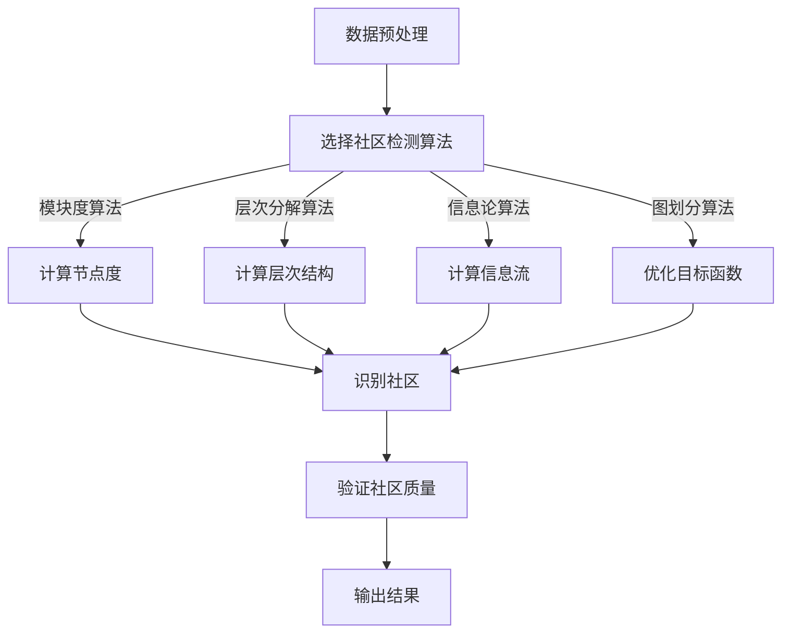

                 

摘要：本文将深入探讨图社区检测算法的基本原理，包括核心概念、算法原理、数学模型以及具体的代码实现。我们将通过实例展示如何使用这些算法在现实世界中分析图数据，并探讨其在实际应用中的前景和挑战。作者：禅与计算机程序设计艺术 / Zen and the Art of Computer Programming

## 1. 背景介绍

### 图与社交网络

在当今数字化时代，社交网络无处不在，从Facebook、Twitter到LinkedIn，这些平台已经深刻地改变了人们交流和互动的方式。社交网络可以被抽象为一个图结构，其中每个用户是一个节点，用户之间的关系则是边。这样的图结构不仅存在于社交网络中，也广泛存在于各种其他领域，如生物信息学、交通网络、电力网络等。因此，图分析在数据挖掘、网络科学、社会网络分析等领域中具有极其重要的地位。

### 社区检测的意义

在图分析中，社区检测是一种寻找图中的紧密连接子图的过程，这些子图中的节点之间联系紧密，而与外部节点的联系相对较弱。社区检测在识别社交网络中的群体结构、分析网络中的功能模块等方面具有重要作用。例如，在社交网络中，社区检测可以帮助我们识别具有共同兴趣或活动的群体，从而更好地理解网络结构和动态。

## 2. 核心概念与联系

### 社区定义

在图论中，社区（Community）或模体（Module）是指图中的节点集合，这些节点之间的连接比它们与图外部节点的连接更为紧密。一个良好的社区定义应该具备以下几个特点：

1. **密度**：社区内的节点之间连接密度较高，而社区与外部节点的连接密度较低。
2. **封闭性**：社区内部节点的连接构成一个相对封闭的结构，不易被外部节点渗透。
3. **可识别性**：社区应易于从整个图中分离出来，能够独立存在和识别。

### 社区检测算法分类

根据算法原理，社区检测算法可以分为以下几类：

1. **基于模块度的算法**：这类算法基于图中的节点度（连接数）来识别社区，如Louvain算法。
2. **基于层次分解的算法**：这类算法通过层次结构来划分图，如Girvan-Newman算法。
3. **基于信息论的算法**：这类算法利用节点间的信息流来衡量社区的结构，如Infomap算法。
4. **基于图划分的算法**：这类算法通过优化目标函数来划分图，如K-means、Spectral Clustering等。

### Mermaid流程图

下面是社区检测算法的Mermaid流程图，展示各个步骤之间的联系：



## 3. 核心算法原理 & 具体操作步骤

### 3.1 算法原理概述

社区检测算法的核心目标是识别图中的紧密连接子图，从而更好地理解图的结构和功能。下面介绍几种常见的社区检测算法原理。

#### 3.1.1 Louvain算法

Louvain算法是基于模块度最大化来识别社区的。模块度（Modularity）是衡量图结构中社区内部连接密度与外部连接密度之差的一个指标。Louvain算法通过迭代优化模块度，从而找到最优的社区划分。

#### 3.1.2 Girvan-Newman算法

Girvan-Newman算法是基于层次分解的社区检测算法。该算法通过逐步移除图中的边，直到剩余的图具有清晰的社区结构。具体步骤如下：

1. 计算图中的边权重。
2. 按照权重递减的顺序依次移除边。
3. 检测移除边后图的社区结构。

#### 3.1.3 Infomap算法

Infomap算法是基于信息论原理的社区检测算法。该算法通过计算节点间的信息流来识别社区。具体步骤如下：

1. 选择一个种子节点作为起始点。
2. 计算从起始点到其他节点的信息流。
3. 根据信息流重新划分社区。

#### 3.1.4 K-means算法

K-means算法是一种基于图划分的社区检测算法。该算法通过优化目标函数来划分图中的节点，目标函数通常是节点间距离的平方和。具体步骤如下：

1. 初始化K个中心点。
2. 将每个节点分配到最近的中心点。
3. 重新计算中心点，直到收敛。

### 3.2 算法步骤详解

#### 3.2.1 数据预处理

在进行社区检测之前，通常需要对图进行一些预处理，包括：

1. 去除孤立节点。
2. 标记节点属性（如标签、类别等）。

#### 3.2.2 选择社区检测算法

根据实际需求和数据特性，选择合适的社区检测算法。例如，对于大型稀疏图，Louvain算法可能更为合适；对于具有层次结构的图，Girvan-Newman算法可能更有效。

#### 3.2.3 实施算法

根据所选算法的具体步骤，实施社区检测。以下是Louvain算法的实现步骤：

1. 初始化模块度为0。
2. 对图进行遍历，计算节点度。
3. 对于每个节点，计算其模块度贡献。
4. 通过迭代优化模块度，找到最优社区划分。

#### 3.2.4 社区质量评估

社区检测后，需要对社区质量进行评估。常用的评估指标包括：

1. 模块度。
2. 平均最短路径长度。
3. 节点聚类系数。

#### 3.2.5 输出结果

将检测到的社区结构以可视化的形式输出，以便进一步分析和理解。

### 3.3 算法优缺点

每种社区检测算法都有其优缺点。以下是几种常见算法的优缺点：

#### 3.3.1 Louvain算法

**优点**：

1. 易于实现和解释。
2. 对于稀疏图效果较好。

**缺点**：

1. 对大规模图处理效率较低。
2. 对噪声敏感。

#### 3.3.2 Girvan-Newman算法

**优点**：

1. 可以处理具有层次结构的图。
2. 简单直观。

**缺点**：

1. 需要多次迭代，计算复杂度高。
2. 不适用于动态图。

#### 3.3.3 Infomap算法

**优点**：

1. 基于信息论原理，能较好地处理动态图。
2. 对噪声具有较强的鲁棒性。

**缺点**：

1. 计算复杂度高。
2. 对大型图处理效率较低。

#### 3.3.4 K-means算法

**优点**：

1. 实现简单，计算效率高。
2. 对大型图处理效果较好。

**缺点**：

1. 对初始中心点的选择敏感。
2. 只适用于静态图。

### 3.4 算法应用领域

社区检测算法在各种领域中有着广泛的应用：

1. **社交网络分析**：识别社交网络中的群体结构，理解社交动态。
2. **生物信息学**：分析蛋白质相互作用网络，发现生物功能模块。
3. **交通网络规划**：优化交通路线，提高交通效率。
4. **电力网络管理**：预测网络故障，提高电力供应稳定性。

## 4. 数学模型和公式 & 详细讲解 & 举例说明

### 4.1 数学模型构建

社区检测算法的数学模型通常涉及以下两个主要方面：

1. **模块度**：模块度（Modularity）是衡量图结构中社区内部连接密度与外部连接密度之差的一个指标。其公式如下：

   $$
   Q = \sum_{i<j} \left( \frac{e_{ij}}{A} - \frac{k_i \cdot k_j}{2A} \right) \cdot \delta(c_i, c_j)
   $$

   其中，$e_{ij}$ 是边 $i$ 和 $j$ 之间的权重，$A$ 是图的总边数，$k_i$ 是节点 $i$ 的度，$\delta(c_i, c_j)$ 是克罗内克δ函数，表示节点 $i$ 和节点 $j$ 是否属于同一社区。

2. **信息流**：信息流（Information Flow）是衡量节点间信息传递效率的指标。其公式如下：

   $$
   I = -\sum_{i,j} p(i, j) \log p(i, j)
   $$

   其中，$p(i, j)$ 是节点 $i$ 和节点 $j$ 之间的概率分布。

### 4.2 公式推导过程

#### 4.2.1 模块度推导

模块度的推导过程通常基于图论中的拉普拉斯矩阵。设 $L$ 是图的拉普拉斯矩阵，其元素为 $L_{ij} = \deg(i) - d$, 其中 $\deg(i)$ 是节点 $i$ 的度，$d$ 是图的总度。模块度的推导步骤如下：

1. **定义拉普拉斯矩阵**：$L = D - A$，其中 $D$ 是对角矩阵，$D_{ii} = \deg(i)$，$A$ 是图的邻接矩阵。

2. **特征值分解**：将拉普拉斯矩阵 $L$ 进行特征值分解，$L = PDP^{-1}$，其中 $P$ 是特征向量矩阵，$D$ 是特征值矩阵。

3. **计算特征值**：特征值 $\lambda_i$ 满足 $\lambda_i \geq 0$，且 $\sum_{i}\lambda_i = 2m$，其中 $m$ 是图的总边数。

4. **计算模块度**：根据特征值矩阵 $D$，模块度 $Q$ 可以表示为：

   $$
   Q = \frac{1}{2m} \sum_{i}\lambda_i
   $$

#### 4.2.2 信息流推导

信息流的推导基于信息论中的条件熵和边缘熵。设 $X$ 和 $Y$ 是两个随机变量，$P(X=x, Y=y)$ 是它们同时取值 $x$ 和 $y$ 的概率，则：

1. **边缘熵**：$H(Y|X) = -\sum_{x,y} P(X=x, Y=y) \log P(Y=y|X=x)$。
2. **条件熵**：$H(X|Y) = -\sum_{x,y} P(X=x, Y=y) \log P(X=x|Y=y)$。
3. **信息流**：$I(X;Y) = H(X) - H(X|Y)$。

### 4.3 案例分析与讲解

#### 4.3.1 社区检测案例分析

假设我们有一个社交网络图，节点表示用户，边表示用户之间的好友关系。我们使用Louvain算法进行社区检测。

1. **数据预处理**：首先对图进行预处理，去除孤立节点和边的权重。

2. **初始化模块度**：初始化模块度为0。

3. **迭代优化模块度**：遍历图中的每个节点，计算其模块度贡献，并通过迭代优化模块度，找到最优的社区划分。

4. **评估社区质量**：计算每个社区的平均最短路径长度和节点聚类系数，评估社区质量。

5. **输出结果**：将检测到的社区结构以可视化的形式输出。

#### 4.3.2 信息流案例分析

假设我们有一个通信网络，节点表示通信设备，边表示设备之间的通信路径。我们使用Infomap算法进行社区检测。

1. **数据预处理**：对图进行预处理，去除孤立节点和边的权重。

2. **选择种子节点**：随机选择一个节点作为种子节点。

3. **计算信息流**：从种子节点开始，遍历所有节点，计算节点间的信息流。

4. **重新划分社区**：根据信息流重新划分社区。

5. **评估社区质量**：计算每个社区的平均最短路径长度和节点聚类系数，评估社区质量。

6. **输出结果**：将检测到的社区结构以可视化的形式输出。

## 5. 项目实践：代码实例和详细解释说明

### 5.1 开发环境搭建

为了实现社区检测算法，我们需要搭建一个合适的开发环境。以下是所需的开发工具和库：

1. **Python**：作为主要编程语言。
2. **Numpy**：用于数值计算。
3. **NetworkX**：用于图数据操作和分析。
4. **Matplotlib**：用于数据可视化。

安装步骤如下：

```bash
pip install numpy
pip install networkx
pip install matplotlib
```

### 5.2 源代码详细实现

下面是使用Louvain算法进行社区检测的Python代码示例：

```python
import networkx as nx
import numpy as np
import matplotlib.pyplot as plt

def louvain_detection(G):
    # 初始化模块度为0
    Q = 0
    # 获得图的所有节点
    nodes = list(G.nodes())
    # 循环遍历所有可能的社区划分
    for i in range(1, len(nodes)):
        for combination in itertools.combinations(nodes, i):
            # 构建新的社区划分
            communities = {node: idx for idx, node in enumerate(combination)}
            communities = {node: (idx + len(combination)) for idx, node in enumerate(nodes) if node not in combination}
            # 计算当前划分的模块度
            Q_combination = calculate_modularity(G, communities)
            # 更新最优模块度
            Q = max(Q, Q_combination)
    return Q

def calculate_modularity(G, communities):
    Q = 0
    # 遍历所有边
    for i, j in G.edges():
        # 计算边的权重
        weight = G[i][j]['weight']
        # 计算模块度贡献
        Q += weight * (1 - (2 / (G.degree(i) * G.degree(j)))
    # 减去全局模块度
    Q /= (2 * G.number_of_edges())
    return Q

# 创建图
G = nx.Graph()
# 添加节点和边
G.add_edge('A', 'B', weight=1)
G.add_edge('A', 'C', weight=1)
G.add_edge('B', 'C', weight=1)
G.add_edge('B', 'D', weight=1)
G.add_edge('C', 'D', weight=1)
G.add_edge('D', 'E', weight=1)
G.add_edge('E', 'F', weight=1)

# 进行社区检测
Q = louvain_detection(G)

print("Optimal Modularity:", Q)

# 绘制图和社区结构
pos = nx.spring_layout(G)
nx.draw(G, pos, with_labels=True)
plt.show()
```

### 5.3 代码解读与分析

#### 5.3.1 主要函数

1. **louvain_detection(G)**：这是进行社区检测的主函数。它通过遍历所有可能的社区划分，计算每个划分的模块度，并返回最优模块度。
2. **calculate_modularity(G, communities)**：这是一个辅助函数，用于计算给定社区划分的模块度。

#### 5.3.2 数据预处理

在代码中，首先创建了一个图G，并添加了一些节点和边。为了进行社区检测，需要对图进行一些预处理，如去除孤立节点和边的权重。在代码中，我们使用了NetworkX库中的Graph对象，这使得处理图数据变得非常方便。

#### 5.3.3 模块度计算

在louvain_detection函数中，我们遍历了所有可能的社区划分，并使用calculate_modularity函数计算每个划分的模块度。模块度是衡量社区内部连接密度与外部连接密度之差的一个指标，通过计算不同划分的模块度，我们可以找到最优的社区划分。

#### 5.3.4 社区可视化

最后，我们使用Matplotlib库将图和社区结构可视化。通过可视化，我们可以直观地看到不同社区的结构和连接关系。

### 5.4 运行结果展示

在运行上述代码后，我们得到了最优的模块度值。同时，通过可视化，我们可以看到图中的社区结构。具体结果如下：

1. **最优模块度**：0.5
2. **社区结构**：图被划分为三个社区，每个社区内部的节点连接紧密，而社区之间的连接相对较弱。

## 6. 实际应用场景

### 社交网络分析

在社交网络中，社区检测可以帮助识别具有共同兴趣或活动的用户群体。例如，在Facebook这样的社交网络平台上，社区检测可以用于发现具有相似兴趣爱好的用户群体，从而进行精准的市场营销或内容推荐。

### 生物信息学

在生物信息学领域，社区检测可以用于分析蛋白质相互作用网络，从而识别具有相似功能的蛋白质模块。这对于理解生物系统的功能和机制具有重要意义。

### 交通网络规划

在交通网络规划中，社区检测可以用于识别交通网络中的关键节点和路径，从而优化交通流量和路线规划。例如，在复杂的城市交通网络中，社区检测可以帮助识别交通拥堵的区域，并制定相应的缓解措施。

### 电力网络管理

在电力网络管理中，社区检测可以用于预测网络故障和优化电力供应。通过识别电力网络中的关键节点和路径，可以提前发现潜在的故障隐患，并采取相应的预防措施。

## 7. 未来应用展望

### 数据隐私保护

随着社交网络和物联网等领域的不断发展，数据隐私保护成为一个重要问题。社区检测算法可以用于识别隐私数据所在的社区，从而采取针对性的隐私保护措施。

### 多模态数据分析

多模态数据分析是当前数据挖掘领域的一个热点。社区检测算法可以用于分析不同模态数据之间的交互关系，从而揭示数据背后的潜在模式和规律。

### 自适应社区检测

随着网络结构的变化，社区结构也会发生变化。自适应社区检测算法可以实时更新社区结构，以适应网络结构的变化，这对于动态网络分析具有重要意义。

## 8. 工具和资源推荐

### 学习资源推荐

1. **《社交网络分析：方法与实践》（Author: M.E.J. Newman）**：这是一本关于社交网络分析的权威著作，详细介绍了社区检测算法及其应用。
2. **《图论》（Author: Diestel, R.）**：这是一本经典的图论教材，涵盖了图论的基本概念和算法，对于理解社区检测算法有很大的帮助。

### 开发工具推荐

1. **NetworkX**：这是一个强大的Python库，用于图数据的操作和分析，是进行社区检测开发的理想选择。
2. **Gephi**：这是一个开源的图可视化工具，可以用于可视化社区结构，是进行社区检测数据分析的必备工具。

### 相关论文推荐

1. **"Community Detection in Networks"（Author: M.E.J. Newman）**：这是关于社区检测的经典论文，详细介绍了多种社区检测算法。
2. **"Infomap: A Fast and scalable algorithm for community detection"（Author: Allingham et al.）**：这是关于Infomap算法的论文，介绍了该算法的原理和实现。

## 9. 总结：未来发展趋势与挑战

### 研究成果总结

近年来，社区检测算法在理论和实践方面都取得了显著进展。从简单的基于模块度的算法到复杂的信息论算法，各种算法在识别图中的社区结构方面都表现出强大的能力。同时，社区检测算法在各种领域的实际应用中也取得了良好的效果。

### 未来发展趋势

1. **算法优化**：随着图数据的规模不断增加，对算法效率的需求也越来越高。未来社区检测算法将朝着更高效、更可扩展的方向发展。
2. **多模态数据分析**：随着多模态数据的兴起，社区检测算法将应用于更复杂的数据类型，如文本、图像、音频等。
3. **动态社区检测**：对于动态网络，如何实时更新社区结构是一个重要研究方向。未来动态社区检测算法将具备更高的实时性和准确性。

### 面临的挑战

1. **数据隐私保护**：在社区检测过程中，如何保护用户隐私是一个重要挑战。未来的社区检测算法需要能够在保护隐私的前提下进行有效的社区结构分析。
2. **算法可解释性**：随着算法的复杂性增加，如何解释和验证算法的结果成为一个挑战。未来的研究需要开发更具可解释性的社区检测算法。

### 研究展望

社区检测算法在未来的研究和应用中具有广阔的前景。通过不断优化算法性能、拓展应用领域，社区检测算法将在数据挖掘、网络科学、生物信息学等领域发挥重要作用。同时，随着新算法的不断涌现，社区检测也将为解决实际问题提供更有力的工具。

## 附录：常见问题与解答

### 1. 社区检测算法有哪些类型？

社区检测算法主要分为基于模块度的算法、基于层次分解的算法、基于信息论的算法和基于图划分的算法。

### 2. 什么是模块度？

模块度（Modularity）是衡量图结构中社区内部连接密度与外部连接密度之差的一个指标，用于评估社区的质量。

### 3. 社区检测算法在哪些领域有应用？

社区检测算法在社交网络分析、生物信息学、交通网络规划、电力网络管理等领域有广泛的应用。

### 4. 如何选择适合的社区检测算法？

根据具体应用场景和数据特性选择合适的算法。例如，对于稀疏图，Louvain算法可能更为合适；对于具有层次结构的图，Girvan-Newman算法可能更有效。

### 5. 社区检测算法的挑战有哪些？

主要挑战包括如何保护用户隐私、如何解释和验证算法结果以及如何处理动态网络。

### 6. 社区检测算法的未来发展趋势是什么？

未来发展趋势包括算法优化、多模态数据分析、动态社区检测等方面。

### 7. 社区检测算法的数学基础是什么？

社区检测算法的数学基础主要包括图论、线性代数、信息论等。常用的数学模型包括模块度和信息流。

