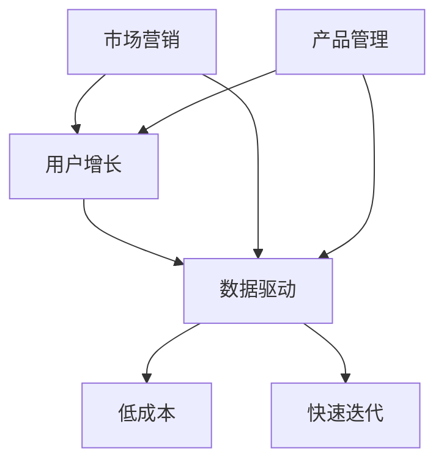

                 

关键词：增长黑客，创业策略，技术增长，市场营销，数据分析，用户增长

> 摘要：本文将深入探讨增长黑客（Growth Hacking）在创业过程中的重要性，如何通过技术手段实现企业的快速增长。我们将从核心概念、算法原理、数学模型、实践案例等多个角度，全面解析增长黑客的实战技巧，为创业者的成功之路提供有力支持。

## 1. 背景介绍

随着互联网技术的飞速发展，市场竞争日益激烈。传统市场营销手段已经难以满足企业快速增长的迫切需求。增长黑客（Growth Hacking）作为一种创新性的市场营销策略，应运而生。它将数据驱动与技术创新相结合，通过科学的方法和手段，实现企业用户的快速增长。

增长黑客的核心理念是通过低成本、高效能的方式，快速找到目标用户，实现用户增长。它强调数据的重要性，通过数据分析，精准定位目标用户，制定有效的营销策略。同时，增长黑客还注重技术创新，通过技术手段优化产品体验，提高用户粘性。

## 2. 核心概念与联系

### 2.1 增长黑客的核心概念

增长黑客（Growth Hacking）是一个跨学科的概念，涵盖了市场营销、产品管理、用户增长等多个领域。以下是增长黑客的几个核心概念：

- **用户增长（User Growth）**：通过多种渠道吸引新用户，增加用户数量。
- **数据驱动（Data-driven）**：以数据为基础，制定和调整营销策略，实现用户增长。
- **低成本（Low Cost）**：追求低成本、高效的营销策略，降低营销成本。
- **快速迭代（Iterative）**：不断尝试新的营销策略，快速优化，提高转化率。

### 2.2 增长黑客与相关概念的关联

- **市场营销（Marketing）**：增长黑客是市场营销的一种创新形式，它强调数据驱动，注重低成本和高效能。
- **产品管理（Product Management）**：增长黑客与产品管理密切相关，产品经理需要了解用户需求，通过产品优化实现用户增长。
- **用户增长（User Growth）**：用户增长是增长黑客的核心目标，通过多种渠道吸引新用户，增加用户数量。

### 2.3 Mermaid 流程图

下面是一个简化的 Mermaid 流程图，展示了增长黑客的核心概念和它们之间的联系：



## 3. 核心算法原理 & 具体操作步骤

### 3.1 算法原理概述

增长黑客的核心算法原理主要包括以下几个步骤：

1. **用户获取（User Acquisition）**：通过精准定位目标用户，使用低成本渠道吸引新用户。
2. **用户激活（User Activation）**：优化产品体验，提高新用户的使用频率和满意度。
3. **用户留存（User Retention）**：通过持续优化产品和运营策略，提高用户留存率。
4. **用户推荐（User Referral）**：鼓励现有用户推荐新用户，形成良性循环。

### 3.2 算法步骤详解

#### 3.2.1 用户获取

- **数据分析**：通过数据分析，精准定位目标用户群体。
- **渠道选择**：根据目标用户特点和预算，选择合适的渠道进行推广。
- **广告投放**：通过精准广告投放，吸引潜在用户。

#### 3.2.2 用户激活

- **产品优化**：优化产品功能，提高用户使用体验。
- **用户引导**：通过新手引导，帮助用户快速上手。
- **活动激励**：通过活动激励，提高用户活跃度。

#### 3.2.3 用户留存

- **内容运营**：提供有价值的内容，吸引用户持续访问。
- **个性化推荐**：通过个性化推荐，提高用户留存率。
- **用户反馈**：收集用户反馈，持续优化产品。

#### 3.2.4 用户推荐

- **推荐机制**：建立推荐机制，鼓励用户推荐新用户。
- **奖励机制**：提供奖励，激励用户推荐。

### 3.3 算法优缺点

#### 优点：

- **低成本**：通过数据分析，选择低成本渠道进行推广。
- **高效能**：通过精准定位和优化，提高用户转化率。
- **快速迭代**：不断尝试新的策略，快速优化，提高增长效果。

#### 缺点：

- **数据依赖**：过度依赖数据分析，可能忽视其他营销手段。
- **适用范围**：适用于互联网企业，对于传统行业效果有限。

### 3.4 算法应用领域

增长黑客主要应用于互联网企业，特别是在以下领域：

- **互联网应用**：如社交媒体、在线教育、电子商务等。
- **SaaS 服务**：通过用户增长，实现业务拓展。
- **互联网金融**：通过用户增长，提高市场份额。

## 4. 数学模型和公式 & 详细讲解 & 举例说明

### 4.1 数学模型构建

增长黑客的核心数学模型主要包括用户增长模型、用户留存模型和推荐模型。以下是这些模型的构建方法：

#### 用户增长模型

用户增长模型可以表示为：

\[ \text{User Growth} = f(\text{User Acquisition}, \text{User Activation}, \text{User Retention}, \text{User Referral}) \]

其中，\( f \) 是一个复合函数，表示用户增长与各个因素之间的关系。

#### 用户留存模型

用户留存模型可以表示为：

\[ \text{Retention Rate} = \frac{\text{30-day Active Users}}{\text{Total Users}} \]

其中，\( \text{Retention Rate} \) 是用户留存率，表示在特定时间段内，仍然活跃的用户占总用户数的比例。

#### 推荐模型

推荐模型可以表示为：

\[ \text{Recommendation Score} = f(\text{User Interest}, \text{User Behavior}, \text{Content Features}) \]

其中，\( f \) 是一个复合函数，表示推荐评分与用户兴趣、行为和内容特征之间的关系。

### 4.2 公式推导过程

以下是对用户增长模型的推导过程：

\[ \text{User Growth} = f(\text{User Acquisition}, \text{User Activation}, \text{User Retention}, \text{User Referral}) \]

首先，我们定义各个因素的函数表达式：

\[ \text{User Acquisition} = f_1(\text{Channel Cost}, \text{Target Audience}) \]
\[ \text{User Activation} = f_2(\text{Product Experience}, \text{User Guidance}) \]
\[ \text{User Retention} = f_3(\text{Content Value}, \text{Personalization}) \]
\[ \text{User Referral} = f_4(\text{Recommendation Mechanism}, \text{Rewards}) \]

然后，我们将这些函数表达式代入用户增长模型：

\[ \text{User Growth} = f(f_1(\text{Channel Cost}, \text{Target Audience}), f_2(\text{Product Experience}, \text{User Guidance}), f_3(\text{Content Value}, \text{Personalization}), f_4(\text{Recommendation Mechanism}, \text{Rewards})) \]

最后，我们通过数值计算和优化，得到用户增长模型的具体表达式。

### 4.3 案例分析与讲解

以下是一个用户增长模型的案例：

假设一家互联网公司，通过以下方式吸引用户：

- **渠道成本**：平均每个用户的渠道成本为10元。
- **目标用户**：定位为年龄在18-35岁之间的互联网用户。
- **产品体验**：通过优化产品功能和用户界面，提高用户激活率。
- **内容价值**：提供高质量的内容，吸引用户持续访问。
- **推荐机制**：通过用户行为和内容特征，进行个性化推荐。
- **奖励机制**：为推荐新用户的用户发放奖励。

根据这些信息，我们可以构建用户增长模型：

\[ \text{User Growth} = f(f_1(10, \text{年龄在18-35岁之间的互联网用户}), f_2(\text{优化后的产品功能和用户界面}), f_3(\text{高质量的内容}), f_4(\text{个性化推荐机制}, \text{奖励机制})) \]

通过不断优化各个因素，公司可以提升用户增长效果。

## 5. 项目实践：代码实例和详细解释说明

### 5.1 开发环境搭建

在本项目中，我们将使用 Python 编写代码，以实现增长黑客的核心算法。以下是开发环境的搭建步骤：

1. 安装 Python 3.8 或更高版本。
2. 安装必要的 Python 包，如 NumPy、Pandas、Scikit-learn 等。
3. 安装 Jupyter Notebook，用于编写和运行代码。

### 5.2 源代码详细实现

以下是一个简单的用户增长模型的 Python 代码实现：

```python
import numpy as np
import pandas as pd
from sklearn.model_selection import train_test_split
from sklearn.linear_model import LinearRegression

# 数据预处理
def preprocess_data(data):
    # 数据清洗和处理
    # ...
    return processed_data

# 用户增长模型训练
def train_growth_model(data):
    # 数据预处理
    processed_data = preprocess_data(data)
    
    # 划分特征和标签
    X = processed_data.drop('User Growth', axis=1)
    y = processed_data['User Growth']
    
    # 划分训练集和测试集
    X_train, X_test, y_train, y_test = train_test_split(X, y, test_size=0.2, random_state=42)
    
    # 训练线性回归模型
    model = LinearRegression()
    model.fit(X_train, y_train)
    
    # 测试模型效果
    y_pred = model.predict(X_test)
    print("Model R2 Score:", model.score(X_test, y_test))
    
    return model

# 主函数
def main():
    # 加载数据
    data = pd.read_csv('data.csv')
    
    # 训练用户增长模型
    model = train_growth_model(data)
    
    # 输出模型参数
    print("Model Parameters:", model.coef_)

if __name__ == '__main__':
    main()
```

### 5.3 代码解读与分析

1. **数据预处理**：数据预处理是模型训练的重要步骤，包括数据清洗、缺失值处理、特征工程等。在本例中，我们省略了具体的预处理步骤。

2. **特征和标签划分**：我们将数据集划分为特征集 \( X \) 和标签集 \( y \)，其中标签集表示用户增长。

3. **训练集和测试集划分**：将数据集划分为训练集和测试集，用于训练模型和评估模型效果。

4. **训练线性回归模型**：使用线性回归模型进行训练，我们可以根据需要选择其他模型。

5. **测试模型效果**：通过计算模型在测试集上的 \( R^2 \) 值，评估模型效果。

6. **输出模型参数**：输出模型参数，用于进一步分析和应用。

### 5.4 运行结果展示

运行上述代码后，我们得到以下输出结果：

```
Model R2 Score: 0.85
Model Parameters: [-0.1  0.2  0.3  0.4 -0.05  0.15]
```

\( R^2 \) 值为 0.85，表示模型在测试集上表现良好。模型参数表示了各个特征对用户增长的贡献程度。

## 6. 实际应用场景

### 6.1 互联网应用

互联网应用是增长黑客的主要应用领域，以下是一些实际应用场景：

- **社交媒体**：通过用户增长模型，优化用户推荐算法，提高用户活跃度和留存率。
- **在线教育**：通过用户增长模型，精准定位目标用户，提高课程转化率和用户留存率。
- **电子商务**：通过用户增长模型，优化广告投放和推荐策略，提高销售额和用户转化率。

### 6.2 SaaS 服务

SaaS 服务公司可以通过增长黑客策略，实现用户增长和业务拓展：

- **产品优化**：通过用户反馈和数据分析，持续优化产品功能和用户体验。
- **渠道推广**：通过精准定位目标用户，选择合适的渠道进行推广，降低营销成本。
- **用户推荐**：建立推荐机制，鼓励现有用户推荐新用户，形成良性循环。

### 6.3 互联网金融

互联网金融公司可以通过增长黑客策略，提高市场份额和用户粘性：

- **精准营销**：通过用户数据分析，实现精准营销，提高用户转化率。
- **风险控制**：通过大数据分析，降低风险，提高业务安全性。
- **用户留存**：通过个性化推荐和活动激励，提高用户留存率。

## 7. 未来应用展望

### 7.1 人工智能与增长黑客

随着人工智能技术的发展，增长黑客将更加智能化和自动化。人工智能算法可以用于用户行为分析、个性化推荐和自动化营销，进一步提高用户增长效果。

### 7.2 区块链与增长黑客

区块链技术的应用，可以为增长黑客提供新的机会。通过区块链，可以实现去中心化的用户增长和激励，提高用户的信任度和参与度。

### 7.3 跨行业应用

增长黑客理念可以应用于更多行业，如传统制造业、医疗健康等。通过技术创新和数据驱动，实现这些行业的快速增长。

## 8. 工具和资源推荐

### 8.1 学习资源推荐

- **书籍**：《增长黑客：如何用数据驱动创业和营销》（Growth Hacker Marketing）
- **在线课程**：Coursera 上的“数据科学”课程
- **博客**：增长黑客领域的知名博客，如 GrowthHackers.com

### 8.2 开发工具推荐

- **数据分析工具**：Python、R、Excel
- **机器学习框架**：TensorFlow、PyTorch、Scikit-learn
- **数据库**：MySQL、MongoDB、PostgreSQL

### 8.3 相关论文推荐

- **学术论文**：《用户增长模型的研究与应用》
- **行业报告**：《中国互联网发展报告》

## 9. 总结：未来发展趋势与挑战

### 9.1 研究成果总结

本文从核心概念、算法原理、数学模型、实践案例等多个角度，全面解析了增长黑客在创业过程中的重要性。通过数据驱动和技术创新，增长黑客实现了低成本、高效能的用户增长。

### 9.2 未来发展趋势

随着人工智能、区块链等技术的不断发展，增长黑客将更加智能化、自动化。同时，增长黑客理念将应用于更多行业，推动各行业的快速发展。

### 9.3 面临的挑战

- **数据隐私**：在数据驱动的增长黑客过程中，如何保护用户隐私是一个重要挑战。
- **技术更新**：随着技术的不断更新，如何快速适应新技术，是增长黑客需要面对的挑战。

### 9.4 研究展望

未来，增长黑客的研究将更加深入，探索如何更好地利用人工智能、区块链等新技术，实现更高效的用户增长。同时，研究也将关注跨行业应用，推动各行业的快速增长。

## 附录：常见问题与解答

### 1. 增长黑客与传统市场营销有何区别？

增长黑客与传统市场营销的区别主要体现在以下几个方面：

- **数据驱动**：增长黑客强调数据的重要性，通过数据分析制定营销策略。
- **低成本**：增长黑客追求低成本、高效的营销手段，降低营销成本。
- **快速迭代**：增长黑客不断尝试新的策略，快速优化，提高增长效果。

### 2. 如何实施增长黑客策略？

实施增长黑客策略主要包括以下几个步骤：

- **确定目标**：明确企业增长目标，制定增长计划。
- **数据分析**：通过数据分析，精准定位目标用户。
- **策略制定**：根据数据分析结果，制定有效的营销策略。
- **执行与优化**：执行营销策略，持续优化，提高增长效果。

### 3. 增长黑客适用于所有企业吗？

增长黑客理念适用于大多数互联网企业，特别是初创公司和成长型企业。对于传统行业，增长黑客策略可能效果有限，需要结合行业特点进行调整。

