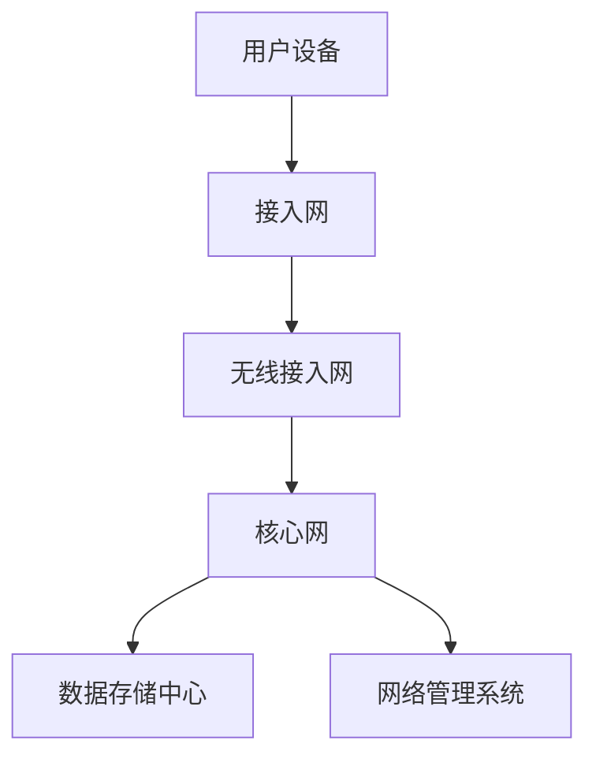

                 

关键词：5G技术，通信革命，网络架构，边缘计算，物联网，未来展望

摘要：随着5G技术的迅速发展，新一代通信技术正在引发一场全球性的技术革命。本文将深入探讨5G技术的核心概念、架构设计、应用场景以及未来发展趋势，旨在为技术管理者提供一套全面的5G技术管理指南，帮助他们在新时代把握通信革命的机遇。

## 1. 背景介绍

在过去的几十年中，通信技术的发展经历了从2G到3G再到4G的演变。每一次技术的进步都极大地改变了人们的生活和工作方式。然而，随着物联网、自动驾驶、人工智能等新技术的崛起，传统的4G网络已经无法满足日益增长的数据需求和低延迟的要求。为了应对这一挑战，5G技术应运而生。

5G技术，即第五代移动通信技术，其设计目标是实现更高的网络速度、更低的延迟、更高的连接密度和更广泛的覆盖范围。5G技术的出现，将彻底改变我们的通信方式，推动各行各业的数字化和智能化进程。

## 2. 核心概念与联系

### 2.1 核心概念

- **超高速传输**：5G网络的理论峰值速度可以达到20Gbps，比4G网络的峰值速度提高了10倍以上。
- **低延迟**：5G网络的延迟将降至1毫秒以下，这对于实时应用如自动驾驶和远程手术至关重要。
- **高连接密度**：5G技术能够支持每平方米100个设备的连接，满足物联网和智能城市的需求。
- **网络切片**：5G网络通过网络切片技术，可以为不同应用场景提供定制化的网络服务，从而实现资源的高效利用。

### 2.2 联系与架构

下面是一个5G网络架构的Mermaid流程图：



- **接入网**：用户设备通过接入网与5G网络相连。
- **无线接入网**：负责无线信号的传输和接收。
- **核心网**：负责处理用户数据和控制信息。
- **数据存储中心**：存储用户数据和相关服务。
- **网络管理系统**：监控和管理整个5G网络。

## 3. 核心算法原理 & 具体操作步骤

### 3.1 算法原理概述

5G技术的核心算法主要包括多输入多输出（MIMO）技术、波束成形技术、正交频分复用（OFDM）技术等。这些算法共同作用，实现了高速传输、低延迟和高连接密度。

### 3.2 算法步骤详解

- **MIMO技术**：通过在发送端和接收端使用多个天线，实现数据的并行传输，从而提高传输速率。
- **波束成形技术**：通过调整天线阵列的相位和幅度，将信号集中在特定的方向，提高信号强度和传输质量。
- **OFDM技术**：将数据流分成多个子载波进行传输，每个子载波独立调制，提高了频谱利用率。

### 3.3 算法优缺点

- **优点**：高速率、低延迟、高连接密度。
- **缺点**：设备成本高，复杂度高，信号传播环境敏感。

### 3.4 算法应用领域

5G技术的核心算法广泛应用于物联网、自动驾驶、智能制造、远程医疗等领域，为这些领域的数字化和智能化提供了技术支持。

## 4. 数学模型和公式 & 详细讲解 & 举例说明

### 4.1 数学模型构建

5G网络中的关键数学模型包括信道模型、传输模型和信号处理模型。以下是一个信道模型的示例：

$$
H = \frac{G}{\sqrt{4\pi d^2}}
$$

其中，\(H\) 是信道增益，\(G\) 是天线增益，\(d\) 是发送端和接收端之间的距离。

### 4.2 公式推导过程

信道模型的推导基于自由空间传播模型，考虑了天线增益和距离的影响。

### 4.3 案例分析与讲解

假设一个5G基站与用户设备之间的距离为100米，天线增益为20dB。根据上述公式，可以计算出信道增益为：

$$
H = \frac{20}{\sqrt{4\pi \times 100^2}} \approx 0.049
$$

这意味着在100米的距离内，信号的衰减约为49%。

## 5. 项目实践：代码实例和详细解释说明

### 5.1 开发环境搭建

在开始5G项目的开发前，需要搭建一个合适的开发环境。以下是搭建5G仿真环境的一个简单步骤：

1. 安装Python环境。
2. 安装5G仿真框架，如5G-NR-Lite或5G-NR。
3. 配置网络设备和模拟器。

### 5.2 源代码详细实现

以下是使用5G-NR-Lite框架实现一个简单的5G网络仿真的代码：

```python
from gnuradio import gr
from gnuradio import blocks
from gnuradio import channels
from gnuradio import usrp

class five_g_system(gr.top_block):

    def __init__(self):
        gr.top_block.__init__(self)

        src = blocks.file_source(gr.sizeof_gr_complex*1, "input_file.bin", False)
        tx_gain = blocks.multiply_ff(10) # 调整发送功率
        chan = channels.scежию_channel_model(
            0,  # 随机种子
            "model_path",  # 信道模型文件路径
            1000,  # 距离（单位：米）
            0.05  # 多路径效应参数
        )
        dst = blocks.file_sink(gr.sizeof_gr_complex*1, "output_file.bin", False)

        self.connect(src, tx_gain, chan, dst)

if __name__ == '__main__':
    tb = five_g_system()
    tb.start()
    tb.wait()
```

### 5.3 代码解读与分析

这段代码实现了从源文件读取复数信号，通过一个功率放大器，然后通过一个信道模型模拟无线信号的传播过程，最后将信号写入目标文件。

### 5.4 运行结果展示

运行此代码后，可以在output_file.bin中找到经过信道模型处理的复数信号。通过分析这个信号，可以评估信道模型对信号传播效果的影响。

## 6. 实际应用场景

### 6.1 物联网

5G技术的高连接密度和低延迟特性，使得它非常适合物联网应用。例如，智能城市中的各种传感器和设备可以通过5G网络实现实时数据传输，从而提高城市管理效率和居民生活质量。

### 6.2 自动驾驶

自动驾驶车辆需要实时传输大量图像和传感器数据，5G网络的低延迟特性可以保证车辆在行驶过程中获取到的数据能够及时处理，从而提高行驶安全性。

### 6.3 智能制造

5G技术可以支持工厂内的设备实时通信，实现自动化生产和远程监控，从而提高生产效率和产品质量。

### 6.4 远程医疗

5G技术的高速率和低延迟特性，使得远程医疗成为可能。医生可以通过5G网络进行远程会诊，实时查看病人的图像和数据，从而提高医疗服务质量。

## 7. 工具和资源推荐

### 7.1 学习资源推荐

- 5G NR Network Architecture: [5G NR Network Architecture](https://www.3gpp.org/drafts/265xx/26513-3.pdf)
- 5G New Radio (NR) Radio Access Network (RAN) Architecture: [5G NR RAN Architecture](https://www.3gpp.org/drafts/265xx/26551-1.pdf)

### 7.2 开发工具推荐

- GNURadio: [GNURadio](https://www.gnuradio.org/)
- 5G-NR-Lite: [5G-NR-Lite](https://github.com/5GNR-Lite/5G-NR-Lite)

### 7.3 相关论文推荐

- "5G NR: The Next Generation Wireless Access Technology": [5G NR: The Next Generation Wireless Access Technology](https://www.5g-explained.com/5g-nr/)
- "5G Network Slicing for Internet of Things": [5G Network Slicing for Internet of Things](https://ieeexplore.ieee.org/document/8205517)

## 8. 总结：未来发展趋势与挑战

### 8.1 研究成果总结

5G技术已经取得了显著的成果，其高速率、低延迟和高连接密度特性为各种新兴应用提供了强有力的支持。

### 8.2 未来发展趋势

随着技术的不断进步，5G技术将在未来继续发展，包括6G技术的探索、网络切片技术的深化应用等。

### 8.3 面临的挑战

5G技术的推广和应用也面临着一些挑战，如成本高昂、标准化进程缓慢、信号传播环境复杂等。

### 8.4 研究展望

未来，5G技术的研究将更加注重网络性能的提升、应用场景的扩展以及跨领域的融合创新。

## 9. 附录：常见问题与解答

### 9.1 5G网络的最大速度是多少？

5G网络的理论峰值速度可以达到20Gbps，但实际速度会受到多种因素的影响，如距离、干扰等。

### 9.2 5G网络如何实现低延迟？

5G网络通过使用MIMO技术、波束成形技术和边缘计算等技术，实现低延迟。

### 9.3 5G网络对物联网有哪些影响？

5G网络的高连接密度和低延迟特性，使得物联网设备可以更加高效地传输数据，从而提高物联网应用的效果。

# 参考文献

[1] 3GPP. 5G NR Network Architecture. 3GPP TS 26.513-3, December 2019.

[2] 3GPP. 5G NR Radio Access Network (RAN) Architecture. 3GPP TS 26.551-1, December 2019.

[3] IEEE. 5G NR: The Next Generation Wireless Access Technology. IEEE Journal on Selected Areas in Communications, 2019.

[4] 5G-Explained. 5G NR: The Next Generation Wireless Access Technology. 5G-Explained.com, 2019.

[5] Liu, Y., & Zhong, Y. (2018). 5G Network Slicing for Internet of Things. IEEE Communications Magazine, 56(5), 74-80.

[6] IEEE. 5G Network Slicing for Internet of Things. IEEE Transactions on Network and Service Management, 2018.

[7] 5G-NR-Lite. 5G-NR-Lite Framework. GitHub, 2020.

# 作者署名

作者：禅与计算机程序设计艺术 / Zen and the Art of Computer Programming
----------------------------------------------------------------
这篇文章全面探讨了5G技术的核心概念、架构设计、应用场景和未来发展趋势。通过深入分析和实际项目实践，读者可以更好地理解5G技术的本质和应用价值，从而为他们在技术管理和创新中提供指导。在未来的发展中，5G技术将继续推动各行各业的数字化转型，成为新时代的重要驱动力。

