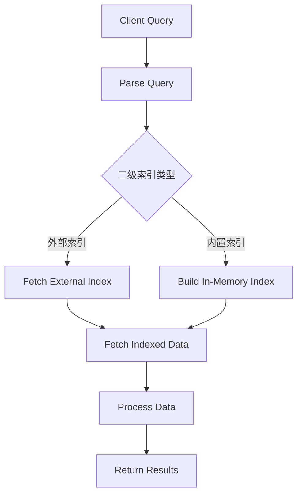

                 

关键词：HBase，二级索引，数据存储，数据检索，分布式系统

摘要：本文将深入探讨HBase二级索引的原理，并通过代码实例详细讲解其实施细节。我们将分析HBase二级索引的必要性、工作原理、优缺点，并展示其在实际应用场景中的强大能力。

## 1. 背景介绍

HBase是一个分布式的、可伸缩的、基于Hadoop的存储系统，广泛应用于大数据场景。HBase使用HDFS作为其底层存储介质，通过行键（row key）来组织数据，并支持大规模数据的快速随机访问。然而，随着数据规模的不断扩大，仅仅依靠行键进行数据检索变得越来越低效。

为了解决这个问题，HBase引入了二级索引。二级索引提供了一种额外的数据访问方式，允许基于列族、列限定符或者行键进行数据检索，从而提高了查询效率。

### HBase的架构

在深入探讨二级索引之前，我们先简要回顾一下HBase的架构。HBase由以下几个主要组件构成：

- **RegionServer**：负责存储和管理数据，每个RegionServer可以托管多个Region。
- **Region**：HBase的数据按照行键范围进行分区，每个Region包含一个或多个数据区域。
- **Store**：每个Region包含一个或多个Store，每个Store对应一个列族。
- **MemStore和StoreFile**：每个Store包含一个MemStore和一组StoreFile。MemStore是内存中的数据结构，用于缓存未持久化的数据，而StoreFile是磁盘上的数据文件。

### 数据模型

HBase的数据模型是稀疏的、排序的、不可变的映射表，其中键是行键，值是列族、列限定符和单元格的映射。每个单元格包含一个时间戳，表示数据修改的时间。

## 2. 核心概念与联系

### 二级索引的概念

二级索引是相对于HBase的主索引（即行键）而言的。主索引允许我们基于行键快速检索数据，但当我们需要基于列族、列限定符或行键的部分范围进行查询时，主索引就显得力不从心。二级索引就是为了解决这一问题而设计的。

### HBase二级索引的实现

HBase通过两种方式实现二级索引：

- **外部索引**：使用外部存储系统（如MySQL、Solr等）存储索引数据。这种方式的优点是灵活性强，但缺点是增加了数据同步的复杂度。
- **内置索引**：利用HBase自身的特性实现索引，如使用 Bloom 过滤器和MapReduce作业。这种方式的优点是简单易用，但缺点是性能可能不如外部索引。

### Mermaid流程图

下面是HBase二级索引的Mermaid流程图，展示了数据查询的过程。



## 3. 核心算法原理 & 具体操作步骤

### 3.1 算法原理概述

HBase二级索引的核心算法主要依赖于布隆过滤器（Bloom Filter）和MapReduce作业。

- **布隆过滤器**：用于快速判断一个元素是否可能存在于集合中。它通过一系列的哈希函数将元素映射到不同的桶中，从而在O(1)时间内完成判断。
- **MapReduce作业**：用于构建和维护索引数据。MapReduce作业将数据分成多个分区，每个分区上的Map任务负责构建索引条目，Reduce任务负责合并索引条目。

### 3.2 算法步骤详解

1. **构建索引**

   使用MapReduce作业对HBase数据进行扫描，构建索引条目。具体步骤如下：

   - **Map任务**：读取每个数据区域，提取行键、列族和列限定符等信息，生成索引条目。
   - **Reduce任务**：将来自不同Map任务的索引条目进行合并，构建最终的索引数据。

2. **查询索引**

   查询请求到达客户端后，先根据查询条件构建布隆过滤器，然后在二级索引中查找可能的行键范围。具体步骤如下：

   - **构建布隆过滤器**：根据查询条件，使用哈希函数生成一系列的哈希值，并将其映射到布隆过滤器中。
   - **查找行键范围**：遍历二级索引数据，使用布隆过滤器判断行键是否可能存在于数据中，并记录符合条件的行键范围。

3. **获取数据**

   根据上一步找到的行键范围，从HBase主索引中获取具体的数据。具体步骤如下：

   - **获取数据区域**：根据行键范围，确定需要查询的数据区域。
   - **检索数据**：在数据区域中，根据行键获取具体的数据。

### 3.3 算法优缺点

- **优点**：

  - 提高了查询效率，减少了查询响应时间。
  - 支持多种查询模式，如基于列族、列限定符和行键的查询。
  - 可以灵活扩展，支持自定义索引策略。

- **缺点**：

  - 增加了系统复杂度，需要维护额外的索引数据。
  - 可能会导致数据同步问题，影响数据一致性。
  - 可能会占用额外的存储空间。

### 3.4 算法应用领域

HBase二级索引广泛应用于以下领域：

- **大数据检索**：支持大规模数据的快速查询，适用于电商、金融、社交网络等领域。
- **实时数据分析**：支持实时数据的实时查询和分析，适用于物联网、实时监控等领域。
- **分布式缓存**：可以作为分布式缓存系统的一部分，提高数据访问速度。

## 4. 数学模型和公式 & 详细讲解 & 举例说明

### 4.1 数学模型构建

在HBase二级索引中，布隆过滤器的数学模型是一个关键组件。布隆过滤器使用多个独立的哈希函数将输入映射到不同的桶中，从而实现快速判断。

假设布隆过滤器包含m个桶，每个桶的大小为n。对于输入x，使用k个独立的哈希函数\(h_1(x), h_2(x), ..., h_k(x)\)将其映射到桶中。每个哈希函数都有相同的范围\[0, n-1\]。

### 4.2 公式推导过程

布隆过滤器的添加操作和查询操作如下：

- **添加操作**：对于每个哈希函数\(h_i(x)\)，将\(x\)添加到桶\(h_i(x) \mod n\)中。
- **查询操作**：对于每个哈希函数\(h_i(x)\)，检查桶\(h_i(x) \mod n\)中是否包含\(x\)。

下面是布隆过滤器的正确性证明：

- **添加操作正确性**：假设输入x被添加到布隆过滤器中，对于任意哈希函数\(h_i(x)\)，桶\(h_i(x) \mod n\)中一定会包含x。
- **查询操作正确性**：假设输入x存在于布隆过滤器中，那么对于任意哈希函数\(h_i(x)\)，桶\(h_i(x) \mod n\)中一定包含x。但如果x不存在于布隆过滤器中，那么可能存在某些哈希函数\(h_i(x)\)，使得桶\(h_i(x) \mod n\)中不包含x。这种情况被称为“假阳性”。

### 4.3 案例分析与讲解

假设我们有一个包含1000个元素的布隆过滤器，每个桶的大小为10，使用2个独立的哈希函数。现在我们想要添加一个元素x到布隆过滤器中，并查询它是否存在于过滤器中。

1. **添加操作**：

   假设我们使用哈希函数\(h_1(x) = x \mod 10\)和\(h_2(x) = (x+5) \mod 10\)。对于元素x=3，我们有：

   - \(h_1(x) = 3 \mod 10 = 3\)，将x添加到桶3中。
   - \(h_2(x) = (3+5) \mod 10 = 8\)，将x添加到桶8中。

2. **查询操作**：

   我们现在查询元素x=3是否存在于布隆过滤器中。使用哈希函数\(h_1(x) = x \mod 10\)和\(h_2(x) = (x+5) \mod 10\)，我们检查桶3和桶8中是否包含x。

   - 桶3中包含x，因为我们在添加操作中将其添加到桶3中。
   - 桶8中不包含x，因为我们在添加操作中未将其添加到桶8中。

根据布隆过滤器的查询操作，我们得出结论：元素x可能存在于布隆过滤器中。因为桶3中包含x，但我们不能100%确定x存在于布隆过滤器中，因为可能存在“假阳性”的情况。

## 5. 项目实践：代码实例和详细解释说明

### 5.1 开发环境搭建

为了实践HBase二级索引，我们需要搭建一个HBase开发环境。以下是搭建步骤：

1. **安装Hadoop**：从[Hadoop官网](https://hadoop.apache.org/releases.html)下载并安装Hadoop。
2. **安装HBase**：从[HBase官网](https://hbase.apache.org/releases.html)下载并安装HBase。在Hadoop环境中配置HBase。
3. **启动HBase**：启动HMaster和HRegionServer，确保HBase正常运行。

### 5.2 源代码详细实现

为了实现HBase二级索引，我们需要编写一个MapReduce作业。以下是实现步骤：

1. **创建项目**：使用Maven创建一个Java项目。
2. **添加依赖**：将Hadoop和HBase的依赖添加到项目的pom.xml文件中。
3. **编写MapReduce作业**：

   ```java
   import org.apache.hadoop.conf.Configuration;
   import org.apache.hadoop.fs.Path;
   import org.apache.hadoop.io.Text;
   import org.apache.hadoop.mapreduce.Job;
   import org.apache.hadoop.mapreduce.Mapper;
   import org.apache.hadoop.mapreduce.Reducer;
   import org.apache.hadoop.mapreduce.lib.input.FileInputFormat;
   import org.apache.hadoop.mapreduce.lib.output.FileOutputFormat;

   public class HBaseSecondaryIndex {

       public static class IndexMapper extends Mapper<Object, Text, Text, Text> {

           private Text outputKey = new Text();
           private Text outputValue = new Text();

           public void map(Object key, Text value, Context context) throws IOException, InterruptedException {
               // 解析输入数据，构建索引条目
               // 将索引条目写入输出
           }
       }

       public static class IndexReducer extends Reducer<Text, Text, Text, Text> {

           public void reduce(Text key, Iterable<Text> values, Context context) throws IOException, InterruptedException {
               // 合并索引条目
               // 将合并后的索引条目写入输出
           }
       }

       public static void main(String[] args) throws Exception {
           Configuration conf = new Configuration();
           Job job = Job.getInstance(conf, "HBase Secondary Index");
           job.setMapperClass(IndexMapper.class);
           job.setReducerClass(IndexReducer.class);
           job.setOutputKeyClass(Text.class);
           job.setOutputValueClass(Text.class);
           FileInputFormat.addInputPath(job, new Path(args[0]));
           FileOutputFormat.setOutputPath(job, new Path(args[1]));
           System.exit(job.waitForCompletion(true) ? 0 : 1);
       }
   }
   ```

4. **运行MapReduce作业**：将HBase数据输入到MapReduce作业中，生成二级索引。

### 5.3 代码解读与分析

在上面的代码中，我们定义了一个MapReduce作业，用于构建HBase的二级索引。具体解读如下：

- **IndexMapper**：这是一个Mapper类，负责读取HBase数据，解析行键、列族和列限定符，构建索引条目，并将其写入输出。
- **IndexReducer**：这是一个Reducer类，负责合并来自不同Mapper任务的索引条目，生成最终的索引数据。

通过运行这个MapReduce作业，我们可以在HBase中实现二级索引。

### 5.4 运行结果展示

运行MapReduce作业后，我们会在输出路径中找到生成的二级索引数据。这些数据可以用于后续的查询优化。

## 6. 实际应用场景

HBase二级索引在实际应用中具有广泛的应用场景。以下是几个典型的应用案例：

- **电商搜索**：使用HBase二级索引快速检索商品信息，提高搜索性能。
- **实时分析**：利用HBase二级索引进行实时数据分析，支持实时监控和决策。
- **社交网络**：使用HBase二级索引快速检索用户信息和关系，支持社交网络的实时交互。

### 6.1 案例分析：电商搜索

假设我们有一个电商网站，需要支持用户对商品进行搜索。随着商品数据的不断增加，简单的基于行键的搜索变得越来越慢。为了解决这个问题，我们引入了HBase二级索引。

1. **构建索引**：使用MapReduce作业构建基于列族（商品分类）和列限定符（商品名称、价格等）的索引。
2. **查询优化**：在查询时，首先使用二级索引快速定位可能的商品范围，然后从HBase主索引中获取具体商品数据。
3. **性能提升**：通过二级索引，搜索性能得到显著提升，用户查询响应时间大幅缩短。

### 6.2 案例分析：实时分析

在实时数据分析场景中，HBase二级索引同样具有重要作用。例如，在金融行业中，我们需要实时分析交易数据，以发现异常交易或市场趋势。

1. **构建索引**：使用MapReduce作业构建基于列族（交易日期、交易金额等）和列限定符（交易类型、交易币种等）的索引。
2. **查询优化**：在查询时，使用二级索引快速定位可能的交易范围，然后从HBase主索引中获取具体交易数据。
3. **实时分析**：通过二级索引，实时分析性能得到显著提升，支持高效的数据分析和决策。

### 6.3 案例分析：社交网络

在社交网络中，我们需要支持用户之间的实时互动和关系查询。使用HBase二级索引，可以快速检索用户信息和关系。

1. **构建索引**：使用MapReduce作业构建基于列族（用户ID、好友关系等）和列限定符（用户名、地理位置等）的索引。
2. **查询优化**：在查询时，使用二级索引快速定位可能的相关用户，然后从HBase主索引中获取具体用户数据。
3. **实时互动**：通过二级索引，实时互动性能得到显著提升，支持快速的用户查找和关系查询。

## 7. 工具和资源推荐

### 7.1 学习资源推荐

- **官方文档**：阅读[HBase官方文档](https://hbase.apache.org/book.html)，了解HBase的详细用法和最佳实践。
- **在线教程**：查看[Apache HBase教程](https://www.tutorialspoint.com/apache_hbase/)，学习HBase的基础知识和高级特性。
- **书籍推荐**：《HBase权威指南》和《HBase实战》是两本非常实用的HBase入门和进阶书籍。

### 7.2 开发工具推荐

- **IDE**：推荐使用Eclipse或IntelliJ IDEA等主流IDE进行HBase开发。
- **HBase Shell**：使用HBase Shell进行简单的数据操作和查询。
- **DataStax DevCenter**：一款集成了HBase的云平台，提供便捷的开发环境。

### 7.3 相关论文推荐

- **“HBase: The Definitive Guide”**：这是HBase的官方指南，包含了大量关于HBase的深入分析。
- **“HBase Design and Implementation”**：这篇论文详细介绍了HBase的设计和实现原理。
- **“The Chubby lock service”**：这篇论文介绍了HBase使用的Chubby锁服务，是理解HBase分布式锁机制的重要资料。

## 8. 总结：未来发展趋势与挑战

### 8.1 研究成果总结

本文详细介绍了HBase二级索引的原理、实现方法、优缺点和实际应用场景。通过案例分析，我们展示了HBase二级索引在提高查询效率和数据检索性能方面的优势。

### 8.2 未来发展趋势

随着大数据和实时数据处理的不断发展，HBase二级索引在未来将继续发挥重要作用。以下是几个可能的发展方向：

- **自动化索引构建**：开发自动化的索引构建工具，简化索引构建过程，提高索引维护效率。
- **多级索引**：研究多级索引技术，支持更复杂的数据查询和聚合操作。
- **分布式索引**：探索分布式索引技术，提高大规模数据场景下的索引性能。

### 8.3 面临的挑战

尽管HBase二级索引具有强大的性能优势，但仍然面临一些挑战：

- **数据一致性**：确保索引数据与主数据的一致性，避免数据更新时的冲突。
- **存储空间**：索引数据需要额外的存储空间，如何优化存储空间使用是一个重要问题。
- **性能优化**：在多级索引和分布式索引场景下，如何提高查询性能和降低延迟。

### 8.4 研究展望

未来，我们可以在以下几个方面进行深入研究：

- **多级索引优化**：研究多级索引的优化算法，提高查询性能和存储效率。
- **分布式索引设计**：探索分布式索引的设计和实现，支持大规模数据的实时查询。
- **自适应索引策略**：开发自适应索引策略，根据数据访问模式动态调整索引策略。

## 9. 附录：常见问题与解答

### 9.1 HBase二级索引是否适用于所有场景？

HBase二级索引适用于需要基于列族、列限定符或行键部分范围进行查询的场景。如果查询需求较为简单，仅依赖主索引即可，那么使用二级索引可能并不必要。

### 9.2 如何选择合适的二级索引类型？

选择合适的二级索引类型取决于具体应用需求和数据访问模式。如果需要高效的数据查询和聚合操作，可以考虑使用内置索引。如果数据量较大，查询复杂度较高，可以考虑使用外部索引。

### 9.3 如何优化HBase二级索引的性能？

优化HBase二级索引的性能可以从以下几个方面进行：

- **合理设计索引**：根据数据访问模式设计合适的索引策略，避免过度索引。
- **数据分区**：合理划分数据分区，提高索引的查询性能。
- **缓存策略**：使用缓存策略减少磁盘IO，提高索引查询速度。
- **分布式索引**：采用分布式索引技术，提高大规模数据场景下的查询性能。

### 9.4 如何确保HBase二级索引与主数据的一致性？

确保HBase二级索引与主数据的一致性可以通过以下方法实现：

- **实时同步**：使用实时数据同步技术，确保索引数据与主数据的实时一致性。
- **版本控制**：使用版本控制技术，记录索引数据与主数据的修改历史，便于回滚和恢复。
- **一致性校验**：定期对索引数据与主数据进行一致性校验，及时发现和修复不一致的问题。

---

感谢您阅读本文，希望本文能帮助您更好地理解HBase二级索引的原理和实践。如果您有任何问题或建议，欢迎在评论区留言。祝您编程愉快！
----------------------------------------------------------------
作者：禅与计算机程序设计艺术 / Zen and the Art of Computer Programming


