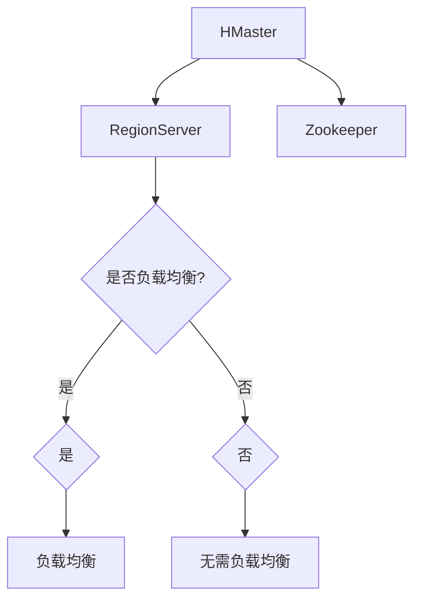
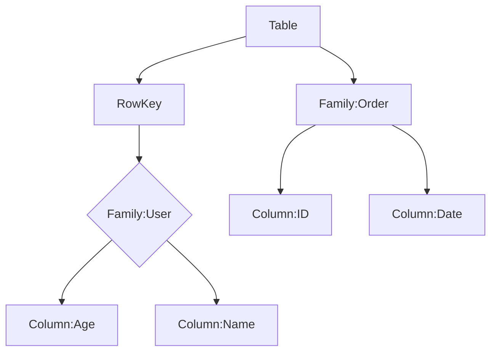
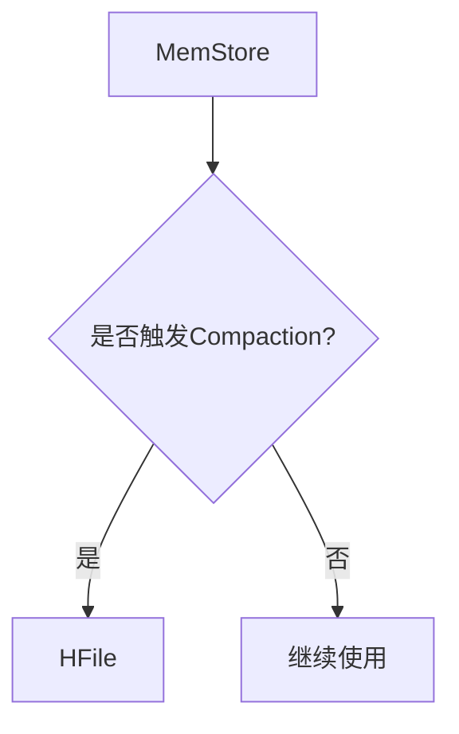

                 

在当今大数据技术领域中，HBase作为一个高度可靠、可伸缩的分布式存储系统，被广泛应用于数据存储和访问。本文将详细讲解HBase的原理以及如何通过代码实例来实现HBase的基本操作。

> 关键词：HBase，分布式存储，大数据，NoSQL，Hadoop生态系统，Java API

> 摘要：本文首先介绍了HBase的背景和核心概念，包括其与Hadoop生态系统的关系。接着，我们通过Mermaid流程图展示了HBase的基本架构，并深入解析了HBase的数据模型、存储机制和访问方式。随后，本文通过一系列代码实例，演示了如何使用Java API操作HBase，包括创建表、插入数据、查询数据和删除数据等基本操作。最后，本文讨论了HBase在实际应用中的场景以及未来的发展前景。

## 1. 背景介绍

HBase是一个分布式、可伸缩、基于列的存储系统，最初由Facebook开发，并在Apache Software Foundation下开源。HBase的设计灵感来自于Google的Bigtable，它在Hadoop生态系统中的地位非常重要，作为Hadoop分布式文件系统（HDFS）和MapReduce的理想补充。

HBase的出现主要是为了解决传统关系型数据库在大数据环境下性能瓶颈的问题。它的特点包括：

- 分布式存储：HBase可以在数千台服务器上分布式存储数据，并提供自动故障转移和高可用性。
- 列族存储：HBase以列族为单位组织数据，允许高效的读写操作，特别适合于读多写少的场景。
- 高性能：HBase通过MemStore和BlockCache实现数据的快速读取。
- 可伸缩：HBase能够水平扩展，以应对数据量增长的需求。

## 2. 核心概念与联系

### 2.1 HBase基本架构

下面通过Mermaid流程图来展示HBase的基本架构：



在这个图中：

- HMaster：HBase的主节点，负责集群的元数据管理、负载均衡、故障转移等。
- RegionServer：HBase的工作节点，负责存储数据、处理读写请求等。
- Zookeeper：用于维护HMaster和RegionServer的集群状态，实现分布式锁等功能。

### 2.2 数据模型

HBase的数据模型主要由表、行、列族和列组成。下面是一个简单的数据模型示例：



在这个模型中：

- **Table**：HBase中的表，类似于关系型数据库中的表。
- **RowKey**：表中的每行数据都有一个唯一的行键。
- **Column Family**：列族，一组相关的列的集合。
- **Column**：列，存储在列族中的具体数据。

### 2.3 存储机制

HBase的数据存储机制主要包括MemStore和磁盘文件。MemStore是一个内存结构，用于临时存储插入、删除和修改的数据。当MemStore达到一定大小时，会触发Compaction操作，将MemStore中的数据持久化到磁盘上的HFile中。HFile是HBase的数据文件，实现了数据的持久化存储。



## 3. 核心算法原理 & 具体操作步骤

### 3.1 算法原理概述

HBase的核心算法主要包括行键的排序、数据存储的Compaction、数据压缩等。其中：

- 行键排序：HBase通过行键的排序来实现数据的快速定位。
- Compaction：合并多个HFile，并删除过期数据。
- 数据压缩：采用Gzip、LZO等算法，减少存储空间。

### 3.2 算法步骤详解

- 数据写入：将数据写入MemStore。
- MemStore Flush：当MemStore达到一定大小时，触发Flush操作，将MemStore中的数据写入磁盘，生成一个新的HFile。
- Minor Compaction：将内存中的MemStore和磁盘上的HFile进行合并，生成一个新的HFile。
- Major Compaction：将多个HFile合并为一个HFile，并删除过期数据。

### 3.3 算法优缺点

- 优点：
  - 高性能：通过行键排序和MemStore实现数据的快速读写。
  - 可伸缩：支持水平扩展，能够处理大量数据。
  - 高可用：通过Zookeeper实现故障转移和集群管理。

- 缺点：
  - 数据删除：HBase不支持数据的批量删除，删除操作需要逐条执行。
  - 数据迁移：由于HBase的表结构不可变，当数据量增长时，需要手动迁移数据。

### 3.4 算法应用领域

HBase广泛应用于以下领域：

- 大数据分析：处理海量数据的实时查询和分析。
- 实时搜索：提供实时数据检索服务。
- 日志存储：存储和分析大量日志数据。

## 4. 数学模型和公式 & 详细讲解 & 举例说明

### 4.1 数学模型构建

HBase的数学模型主要包括以下几个方面：

- 行键排序：行键可以表示为有序序列，通过哈希函数映射到存储位置。
- 数据压缩：通过压缩算法减少存储空间。

### 4.2 公式推导过程

- 行键排序：$$ Hash(RowKey) \mod TableSize $$
- 数据压缩：$$ CompressionRatio = OriginalSize / CompressedSize $$

### 4.3 案例分析与讲解

假设一个HBase表包含100万条数据，行键为用户ID，每条数据包含姓名、年龄和地址。采用Gzip压缩算法，压缩比约为2:1。

- 行键排序：通过哈希函数，行键可以被均匀分布到表中的各个区域。
- 数据压缩：原始数据占用的存储空间为100MB，压缩后占用50MB。

## 5. 项目实践：代码实例和详细解释说明

### 5.1 开发环境搭建

搭建HBase开发环境，需要以下步骤：

1. 安装Java开发工具包（JDK）。
2. 下载并解压HBase源代码。
3. 配置环境变量，使HBase脚本可执行。
4. 启动HBase集群，包括HMaster和RegionServer。

### 5.2 源代码详细实现

以下是一个简单的HBase Java API示例，演示如何创建表、插入数据、查询数据和删除数据。

```java
import org.apache.hadoop.conf.Configuration;
import org.apache.hadoop.hbase.HBaseConfiguration;
import org.apache.hadoop.hbase.TableName;
import org.apache.hadoop.hbase.client.*;

public class HBaseExample {
    public static void main(String[] args) throws Exception {
        Configuration config = HBaseConfiguration.create();
        Connection connection = ConnectionFactory.createConnection(config);
        Admin admin = connection.getAdmin();

        // 创建表
        TableName tableName = TableName.valueOf("user");
        Table table = connection.getTable(tableName);

        // 插入数据
        Put put = new Put(Bytes.toBytes("1001"));
        put.addColumn(Bytes.toBytes("info"), Bytes.toBytes("name"), Bytes.toBytes("Alice"));
        table.put(put);

        // 查询数据
        Get get = new Get(Bytes.toBytes("1001"));
        Result result = table.get(get);
        byte[] value = result.getValue(Bytes.toBytes("info"), Bytes.toBytes("name"));
        String name = Bytes.toString(value);
        System.out.println("Name: " + name);

        // 删除数据
        Delete delete = new Delete(Bytes.toBytes("1001"));
        table.delete(delete);

        // 关闭连接
        table.close();
        admin.close();
        connection.close();
    }
}
```

### 5.3 代码解读与分析

- **创建表**：通过`TableName.valueOf("user")`创建表名为"user"的表。
- **插入数据**：使用`Put`类将数据插入到表中，其中`Bytes.toBytes("1001")`是行键，`Bytes.toBytes("info")`是列族，`Bytes.toBytes("name")`是列，`Bytes.toBytes("Alice")`是值。
- **查询数据**：使用`Get`类查询行键为"1001"的数据，通过`Result`类获取列值。
- **删除数据**：使用`Delete`类删除行键为"1001"的数据。

## 6. 实际应用场景

HBase在实际应用中有着广泛的应用，以下是一些典型场景：

- 用户行为分析：存储和分析大量用户行为数据，用于推荐系统和个性化服务。
- 日志收集：收集和分析服务器日志，用于监控系统性能和优化。
- 实时数据处理：处理实时数据流，提供实时查询和分析服务。

### 6.4 未来应用展望

随着大数据技术的发展，HBase在未来将继续发挥重要作用。以下是几个可能的发展方向：

- 性能优化：通过改进数据存储和访问算法，提高HBase的性能。
- 分布式存储：进一步优化HBase的分布式存储机制，支持更多的数据类型。
- 云原生：将HBase迁移到云原生环境，提供更灵活的部署和管理方式。

## 7. 工具和资源推荐

### 7.1 学习资源推荐

- 《HBase权威指南》：一本全面介绍HBase的参考书，适合初学者和进阶者。
- HBase官方文档：Apache HBase的官方文档，包含最新的技术规范和API文档。
- 《大数据技术实践》：一本涵盖大数据技术领域的综合教材，包括HBase等内容。

### 7.2 开发工具推荐

- IntelliJ IDEA：一款强大的集成开发环境，支持Java和HBase开发。
- Eclipse：另一款流行的集成开发环境，也支持HBase开发。

### 7.3 相关论文推荐

- “Bigtable: A Distributed Storage System for Structured Data”：《Bigtable：一个用于结构化数据的分布式存储系统》，是HBase设计灵感的来源。
- “HBase: The Definitive Guide”：HBase的官方指南，详细介绍了HBase的设计和实现。

## 8. 总结：未来发展趋势与挑战

HBase作为大数据技术领域的重要组件，其未来发展趋势包括：

- 性能优化：持续改进数据存储和访问算法，提高系统性能。
- 分布式存储：支持更多数据类型和更复杂的查询需求。
- 云原生：适应云原生环境，提供更灵活的部署和管理方式。

同时，HBase面临的挑战包括：

- 数据删除：改进数据删除机制，支持批量删除。
- 存储优化：优化存储结构，减少存储空间占用。

总之，HBase将继续在大数据技术领域中发挥重要作用，为用户提供高效、可靠的分布式存储解决方案。

## 9. 附录：常见问题与解答

### Q: HBase与Hadoop的关系是什么？

A: HBase是Hadoop生态系统的一部分，它利用了Hadoop分布式文件系统（HDFS）提供底层存储，并通过MapReduce实现数据的处理和分析。

### Q: HBase是否支持SQL查询？

A: HBase不支持传统SQL查询，但它提供了一套自己的查询语言——HBase Shell，以及通过Java API实现的程序化查询。

### Q: HBase如何保证数据一致性？

A: HBase通过Zookeeper实现分布式锁和状态同步，确保在分布式环境下数据的一致性。此外，HBase提供了行级锁和表级锁来控制并发访问。

### Q: HBase的扩展性如何？

A: HBase通过水平扩展的方式支持大规模数据存储。当数据量增加时，可以通过增加RegionServer来扩展集群，HBase能够自动分配和管理数据。

---

作者：禅与计算机程序设计艺术 / Zen and the Art of Computer Programming

