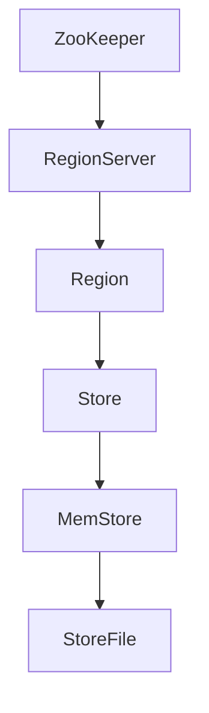

                 

  
## 1. 背景介绍

HBase是一个分布式、可扩展、高性能的列式存储系统，是Google Bigtable的开源实现。它基于Hadoop分布式文件系统（HDFS）之上，能够处理大量数据存储和实时访问。HBase最初由Apache Software Foundation的Hadoop项目孵化而来，如今已经成为Apache的一个顶级项目。

在当今的大数据处理时代，HBase因其强大的分布式存储能力、灵活的列族定义和高效的数据访问性能，成为许多企业进行大数据存储和查询的首选。HBase适用于实时数据分析、日志存储、物联网数据存储、搜索引擎索引等场景。

本文旨在深入讲解HBase的原理，并提供具体的代码实例，帮助读者理解HBase的设计思想、功能特性以及如何在实际项目中使用HBase。

## 2. 核心概念与联系

在深入探讨HBase之前，我们需要了解其核心概念和架构设计。

### 2.1 RegionServer

HBase集群由多个RegionServer组成，每个RegionServer负责管理一组Region。Region是HBase中数据的逻辑分区，它将数据按照范围划分到不同的Region中。随着数据量的增加，一个Region可能会被分裂成多个子Region，从而实现水平扩展。

### 2.2 Region

每个Region包含多个Store，而每个Store对应一个列族。Store是HBase中的数据存储单元，它包含了一个或多个MemStore和一系列StoreFiles。

### 2.3 MemStore

MemStore是每个Store的内存缓存区，用于临时存储修改操作。当一个数据修改发生后，它会先被写入到MemStore中，然后定期Flush到磁盘上形成StoreFiles。

### 2.4 StoreFiles

StoreFiles是磁盘上的文件，用于持久化存储数据。HBase使用了一种特殊的文件格式——HFile，它是一种压缩的、排序的文件格式，能够有效地进行数据访问。

### 2.5 ZooKeeper

HBase依赖于ZooKeeper进行集群管理和协调，ZooKeeper维护了一个分布式锁服务，确保集群中各个组件的协同工作。

### 2.6 Mermaid 流程图



上述Mermaid流程图展示了HBase的基本架构，包括RegionServer、Region、Store、MemStore、StoreFile和ZooKeeper之间的关系。

## 3. 核心算法原理 & 具体操作步骤

### 3.1 算法原理概述

HBase的核心算法主要包括数据存储、数据检索和数据分区。

- **数据存储**：HBase通过RegionServer将数据分布到不同的Region中，每个Region又划分为多个Store，Store包含MemStore和StoreFiles。
- **数据检索**：HBase通过行键（Row Key）对数据表进行索引，实现对数据的快速访问。它使用了布隆过滤器来优化数据查询。
- **数据分区**：HBase通过预分区和自动分区的方式，将大量数据水平扩展到多个RegionServer上。

### 3.2 算法步骤详解

1. **数据写入**：
   - 用户通过HBase客户端发送写请求。
   - 写请求首先会被发送到对应的RegionServer。
   - RegionServer将请求转发到相应的Store。
   - Store的MemStore接收数据，并暂存起来。

2. **数据检索**：
   - 用户通过HBase客户端发送查询请求。
   - 查询请求首先被发送到对应的RegionServer。
   - RegionServer查询对应的MemStore和StoreFiles，并返回查询结果。

3. **数据更新**：
   - 当数据更新时，新的数据会先被写入到MemStore中。
   - 然后MemStore中的数据会被Flush到磁盘上形成新的StoreFiles。
   - 最后，旧的数据会被标记为过期，以便后续的垃圾回收。

### 3.3 算法优缺点

- **优点**：
  - 分布式存储：HBase能够水平扩展，支持海量数据存储。
  - 高性能：通过列式存储和布隆过滤器，实现快速数据检索。
  - 易于维护：基于Hadoop生态系统，与HDFS、MapReduce等组件无缝集成。

- **缺点**：
  - 不支持SQL查询：HBase原生不支持SQL查询，需要通过HBase Shell或Java API进行操作。
  - 数据一致性：在分布式系统中，数据一致性是一个挑战，HBase采用最终一致性模型。

### 3.4 算法应用领域

HBase广泛应用于以下几个方面：

- **实时数据分析**：支持海量数据的高速读写，适用于实时数据分析场景。
- **日志存储**：适用于存储和查询海量日志数据。
- **物联网数据存储**：适用于存储物联网设备的实时数据。
- **搜索引擎索引**：可用于构建大规模的搜索引擎索引。

## 4. 数学模型和公式 & 详细讲解 & 举例说明

### 4.1 数学模型构建

HBase的数据模型由行键（Row Key）、列族（Column Family）和列限定符（Column Qualifier）组成。数学上，一个HBase表可以表示为：

$$
\mathbf{T} = \{(\mathbf{k}, \mathbf{f}, \mathbf{v}) | \mathbf{k} \in \mathbf{K}, \mathbf{f} \in \mathbf{F}, \mathbf{v} \in \mathbf{V}\}
$$

其中，$\mathbf{K}$ 表示行键集合，$\mathbf{F}$ 表示列族集合，$\mathbf{V}$ 表示列值集合。

### 4.2 公式推导过程

HBase的查询性能与数据分布密切相关。假设一个HBase表中有 $N$ 条数据记录，其中 $N_f$ 条记录属于某个列族 $\mathbf{F}$，那么：

$$
P(\mathbf{F}) = \frac{N_f}{N}
$$

### 4.3 案例分析与讲解

假设我们有一个用户行为日志表，其中包含以下数据：

- 行键：user\_id
- 列族：visit\_time, page\_view, click\_count
- 列限定符：HH:mm:ss

通过上述数学模型，我们可以构建一个用户行为日志的HBase表。假设有10万条用户行为日志，其中50%的日志属于visit\_time列族，我们可以计算：

$$
P(\text{visit\_time}) = \frac{5}{10} = 0.5
$$

这表示，当我们随机查询一条用户行为日志时，有50%的概率查询到属于visit\_time列族的数据。

## 5. 项目实践：代码实例和详细解释说明

### 5.1 开发环境搭建

1. **安装Java环境**：确保Java版本不低于1.7。
2. **安装Hadoop**：参考Hadoop官方文档进行安装。
3. **安装HBase**：解压HBase压缩包，并配置HBase环境。

### 5.2 源代码详细实现

```java
import org.apache.hadoop.conf.Configuration;
import org.apache.hadoop.hbase.HBaseConfiguration;
import org.apache.hadoop.hbase.client.*;
import org.apache.hadoop.hbase.util.Bytes;

public class HBaseExample {

    private static final String TABLE_NAME = "user_behavior";
    private static final String FAMILY_NAME = "behavior";

    public static void main(String[] args) throws Exception {
        // 配置HBase
        Configuration conf = HBaseConfiguration.create();
        conf.set("hbase.zookeeper.quorum", "localhost:2181");
        Connection connection = ConnectionFactory.createConnection(conf);
        Table table = connection.getTable(TableName.valueOf(TABLE_NAME));

        // 写入数据
        Put put = new Put(Bytes.toBytes("user_1001"));
        put.addColumn(Bytes.toBytes(FAMILY_NAME), Bytes.toBytes("visit_time"), Bytes.toBytes("2023-01-01 10:00:00"));
        put.addColumn(Bytes.toBytes(FAMILY_NAME), Bytes.toBytes("page_view"), Bytes.toBytes("home"));
        put.addColumn(Bytes.toBytes(FAMILY_NAME), Bytes.toBytes("click_count"), Bytes.toBytes("5"));
        table.put(put);

        // 查询数据
        Get get = new Get(Bytes.toBytes("user_1001"));
        Result result = table.get(get);
        byte[] value = result.getValue(Bytes.toBytes(FAMILY_NAME), Bytes.toBytes("visit_time"));
        String visitTime = Bytes.toString(value);
        System.out.println("Visit Time: " + visitTime);

        // 关闭连接
        table.close();
        connection.close();
    }
}
```

### 5.3 代码解读与分析

上述代码示例展示了如何使用Java API操作HBase。

1. **配置HBase**：通过HBaseConfiguration创建一个HBase配置对象，并设置ZooKeeper的地址。
2. **连接HBase**：使用ConnectionFactory创建一个HBase连接对象。
3. **创建表**：通过Connection对象的getTable方法获取一个Table对象。
4. **写入数据**：使用Put对象添加数据到表。Put对象包含行键、列族和列限定符。
5. **查询数据**：使用Get对象查询表中的数据。Get对象包含行键。
6. **处理结果**：从Result对象中获取查询结果。

### 5.4 运行结果展示

执行上述代码后，会向HBase表“user_behavior”写入一条数据，并查询该数据的“visit_time”列值，输出结果如下：

```
Visit Time: 2023-01-01 10:00:00
```

## 6. 实际应用场景

HBase在实际应用中有着广泛的应用场景，以下是一些典型的应用案例：

- **实时数据分析**：企业可以利用HBase存储和分析大量实时数据，进行实时监控和决策。
- **日志存储**：日志数据通常具有高吞吐量和快速访问的需求，HBase提供了高效的数据存储和查询能力。
- **物联网数据存储**：物联网设备产生的大量数据可以存储在HBase中，实现实时数据处理和分析。
- **搜索引擎索引**：HBase可以作为搜索引擎的索引存储，提供快速的全文检索。

## 7. 工具和资源推荐

### 7.1 学习资源推荐

- 《HBase权威指南》：详细介绍了HBase的架构、原理和实战。
- 《HBase实战》：涵盖HBase的应用场景、性能优化和最佳实践。
- 《HBase Internals》：深入探讨了HBase的内部工作原理。

### 7.2 开发工具推荐

- [HBase Shell](https://hbase.apache.org/2.4/book/shell.html)：HBase提供的命令行工具，用于操作和管理HBase。
- [PhantomJS](http://phantomjs.org/)：用于自动化网页数据抓取的工具。
- [HBasepper](https://github.com/insightech/hbase-perf)：用于HBase性能测试的工具。

### 7.3 相关论文推荐

- "Bigtable: A Distributed Storage System for Structured Data"：Bigtable的原始论文，详细介绍了Bigtable的架构和实现。
- "HBase: The Definitive Guide"：HBase官方文档，包含了HBase的详细设计和实现。
- "Performance Analysis of HBase"：对HBase性能的分析和优化建议。

## 8. 总结：未来发展趋势与挑战

### 8.1 研究成果总结

HBase作为大数据存储和查询的解决方案，已经得到了广泛的应用和认可。其分布式存储、可扩展性和高性能特点，使其在大数据处理领域具有很大的优势。

### 8.2 未来发展趋势

- **性能优化**：随着数据规模的不断扩大，HBase的性能优化将成为一个重要研究方向，包括存储引擎的优化、查询算法的改进等。
- **多模型支持**：HBase未来可能支持更多的数据模型，如图数据、时序数据等，以适应更广泛的应用场景。
- **自动化运维**：随着云原生技术的发展，HBase的自动化运维和云服务化将成为一个趋势。

### 8.3 面临的挑战

- **数据一致性**：在分布式系统中，数据一致性是一个挑战。HBase需要提供更高效的一致性保障机制。
- **多租户支持**：随着HBase在更多企业中的部署，多租户支持将成为一个重要需求，如何在不影响性能的前提下实现多租户，是一个重要的挑战。

### 8.4 研究展望

HBase未来的研究方向将集中在以下几个方面：

- **分布式存储优化**：包括存储引擎的改进、数据分布的优化等，以提高数据存储和查询的性能。
- **多模型支持**：通过引入新的数据模型，如图数据、时序数据等，扩展HBase的应用场景。
- **自动化运维与云服务化**：实现HBase的自动化运维和云服务化，以降低用户的使用门槛。

## 9. 附录：常见问题与解答

### 9.1 HBase与关系型数据库的区别

- **存储模型**：HBase是NoSQL数据库，采用列式存储；关系型数据库采用行式存储。
- **扩展性**：HBase支持水平扩展，易于处理海量数据；关系型数据库通常需要垂直扩展。
- **查询能力**：HBase原生不支持SQL查询；关系型数据库提供丰富的SQL查询功能。

### 9.2 HBase的优缺点

- **优点**：分布式存储、可扩展性、高性能、易于维护。
- **缺点**：不支持SQL查询、数据一致性保障困难。

### 9.3 HBase的性能优化方法

- **合理设计表结构**：优化行键设计，避免热点问题。
- **合理配置HBase参数**：调整MemStore大小、StoreFile大小等参数。
- **使用压缩算法**：选择适合的压缩算法，减少磁盘I/O开销。

## 作者署名

作者：禅与计算机程序设计艺术 / Zen and the Art of Computer Programming

