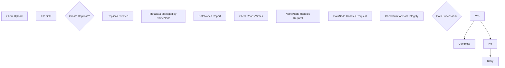

                 

关键词：HDFS，分布式文件系统，数据存储，大数据处理，Hadoop，源代码分析，性能优化

> 摘要：本文旨在深入剖析HDFS（Hadoop分布式文件系统）的原理，并通过实际代码实例详细解释其工作流程和关键组件。我们将从背景介绍、核心概念与联系、算法原理与操作步骤、数学模型与公式讲解、项目实践、实际应用场景、工具和资源推荐等多个方面，全面探讨HDFS的相关内容，帮助读者深入了解HDFS的运作机制，掌握其应用场景，并为未来的大数据处理提供有益的参考。

## 1. 背景介绍

随着互联网的飞速发展和数据量的爆炸性增长，如何高效地存储、处理和分析海量数据成为了一个重要课题。传统的文件系统和数据库系统在面对如此庞大的数据量时，往往显得力不从心。为了解决这个问题，分布式文件系统应运而生。HDFS（Hadoop Distributed File System）是其中最著名的分布式文件系统之一，它是Apache Hadoop项目的一个重要组成部分。

HDFS的设计目标是实现高可靠性、高吞吐量和大规模数据存储。它通过将数据分散存储在多个节点上，从而实现数据的冗余备份和高可用性。同时，HDFS还提供了简单且强大的数据访问接口，使得大数据处理变得更加容易和高效。

本文将首先介绍HDFS的背景和设计目标，然后深入探讨其核心概念、原理和算法，并通过实际代码实例展示其工作流程。接下来，我们将对HDFS的数学模型和公式进行详细讲解，并分析其实际应用场景。最后，我们将推荐一些有用的工具和资源，帮助读者更好地学习和应用HDFS。

## 2. 核心概念与联系

### 2.1. HDFS的核心概念

HDFS的核心概念主要包括文件块、数据副本、名称节点和数据节点。

#### 文件块（Block）

在HDFS中，文件被分成固定大小的数据块（默认为128MB或256MB），这些数据块是HDFS存储和管理数据的基本单位。通过将大文件拆分成小块，HDFS可以更有效地利用存储资源，并提高数据的传输和访问效率。

#### 数据副本（Replicas）

为了提高数据可靠性和容错能力，HDFS将每个数据块复制多个副本存储在集群中的不同节点上。默认情况下，HDFS会创建三个副本，但这个数量可以通过配置进行调整。

#### 名称节点（NameNode）

名称节点是HDFS的主控节点，负责管理文件系统的命名空间和维护数据块索引。它存储了文件系统中所有文件的元数据，如文件名、文件大小、数据块位置等。

#### 数据节点（DataNode）

数据节点是HDFS的工作节点，负责存储实际的数据块，并响应名称节点的读写请求。每个数据节点都维护一个本地文件系统中的目录，其中包含了它所存储的所有数据块的副本。

### 2.2. HDFS的架构

HDFS的架构主要包括两个核心组件：名称节点和数据节点。

#### 名称节点（NameNode）

名称节点负责维护文件系统的命名空间，即文件的目录结构。它存储了文件系统中所有文件的元数据，如文件名、文件大小、数据块位置等。此外，名称节点还负责处理客户端的文件操作请求，如创建文件、删除文件、读取文件等。

#### 数据节点（DataNode）

数据节点负责存储实际的数据块，并响应名称节点的读写请求。每个数据节点都维护一个本地文件系统中的目录，其中包含了它所存储的所有数据块的副本。当名称节点收到客户端的读写请求时，它会向数据节点发出指令，数据节点再根据指令进行相应的数据操作。

### 2.3. HDFS的工作流程

HDFS的工作流程可以概括为以下几个步骤：

1. **文件切分**：当客户端上传一个文件时，HDFS会将文件切分成多个数据块，每个数据块的大小默认为128MB或256MB。

2. **数据副本复制**：HDFS会为每个数据块创建多个副本，默认情况下是三个副本。这些副本会被存储在集群中的不同节点上。

3. **文件元数据管理**：名称节点会维护一个数据块索引，记录每个数据块的位置和副本信息。数据节点则将存储的数据块信息报告给名称节点。

4. **客户端读写请求**：当客户端需要读取或写入文件时，它会向名称节点发送请求。名称节点会返回数据块的位置和副本信息给客户端。

5. **数据读写操作**：客户端根据名称节点提供的副本信息，选择一个数据节点进行数据块的读取或写入操作。

6. **数据块校验**：HDFS使用校验和（checksum）来检测数据块的完整性。如果发现数据块损坏，名称节点会重新复制该数据块。

### 2.4. Mermaid 流程图

以下是一个简化的HDFS工作流程的Mermaid流程图：



### 2.5. HDFS的优缺点

#### 优点：

1. **高可靠性**：通过数据副本机制，HDFS能够保证数据的可靠性和容错能力。
2. **高吞吐量**：HDFS适用于处理海量数据，能够提供较高的数据读写吞吐量。
3. **高扩展性**：HDFS可以轻松地扩展到数千个节点，支持大规模数据存储。
4. **简单易用**：HDFS提供了简单且强大的数据访问接口，使得大数据处理变得更加容易。

#### 缺点：

1. **单点故障**：名称节点是HDFS的单点故障点，如果名称节点故障，整个文件系统将无法访问。
2. **不适用于小文件**：HDFS为每个文件创建多个数据块和副本，对于小文件，这会导致存储空间的浪费。
3. **高延迟**：由于数据分布在多个节点上，HDFS的高延迟可能会影响实时数据处理的性能。

## 3. 核心算法原理 & 具体操作步骤

### 3.1 算法原理概述

HDFS的核心算法主要包括数据切分算法、副本放置算法和数据块校验算法。

#### 数据切分算法

数据切分算法用于将大文件切分成多个数据块。HDFS默认采用基于文件大小的切分方式，即每个数据块的大小为128MB或256MB。当客户端上传文件时，HDFS会根据文件大小自动计算需要切分的数据块数量。

#### 副本放置算法

副本放置算法用于决定副本应该存储在哪些节点上。HDFS采用一系列策略来放置副本，包括：

1. **同一节点上的副本**：为了保证高可用性，HDFS允许在同一个节点上放置多个副本。
2. **不同节点上的副本**：为了提高数据可靠性，HDFS会在不同的节点上放置副本。
3. **副本放置优先级**：HDFS会优先考虑在离数据源较近的节点上放置副本，以提高数据传输速度。

#### 数据块校验算法

数据块校验算法用于检测数据块的完整性。HDFS使用校验和（checksum）来确保数据块的完整性。在读取数据块时，HDFS会计算校验和，并与存储在名称节点中的校验和进行比较。如果校验和不一致，HDFS会认为数据块损坏，并触发副本复制过程。

### 3.2 算法步骤详解

#### 数据切分算法步骤

1. **计算数据块数量**：根据文件大小和每个数据块的大小，计算需要切分的数据块数量。
2. **切分数据块**：将文件按每个数据块的大小进行切分，每个数据块作为一个独立的文件块。

#### 副本放置算法步骤

1. **选择副本放置策略**：根据数据副本数量和节点数量，选择合适的副本放置策略。
2. **放置副本**：根据策略，将副本放置在相应的节点上。
3. **更新元数据**：将副本位置和副本数量更新到名称节点的元数据中。

#### 数据块校验算法步骤

1. **计算校验和**：在读取或写入数据块时，计算数据块的校验和。
2. **比较校验和**：将计算得到的校验和与存储在名称节点中的校验和进行比较。
3. **处理不一致情况**：如果校验和不一致，触发副本复制过程，以确保数据块的完整性。

### 3.3 算法优缺点

#### 数据切分算法

**优点**：提高数据读写效率，降低单点故障风险。

**缺点**：对于小文件，数据切分可能导致存储空间浪费。

#### 副本放置算法

**优点**：提高数据可靠性，降低数据丢失风险。

**缺点**：增加数据传输延迟，增加存储空间需求。

#### 数据块校验算法

**优点**：确保数据块的完整性，提高数据可靠性。

**缺点**：增加数据传输延迟，增加计算资源消耗。

### 3.4 算法应用领域

#### 数据存储

HDFS广泛应用于大规模数据存储场景，如大数据处理、数据挖掘、机器学习等。

#### 分布式文件系统

HDFS可以作为分布式文件系统，用于存储和管理大规模数据，如云存储、数据湖等。

#### 数据共享

HDFS提供了简单且强大的数据访问接口，使得数据共享变得更加容易。

#### 实时数据处理

虽然HDFS不适用于实时数据处理场景，但可以与其他实时数据处理框架（如Apache Storm、Apache Spark Streaming等）配合使用。

## 4. 数学模型和公式 & 详细讲解 & 举例说明

### 4.1 数学模型构建

HDFS的数学模型主要涉及数据块大小、副本数量和节点数量等参数。

#### 数据块大小（$B$）

数据块大小是HDFS存储和管理数据的基本单位，通常以字节（B）为单位。默认情况下，数据块大小为128MB或256MB。

#### 副本数量（$R$）

副本数量是HDFS为了保证数据可靠性和容错能力而设置的。默认情况下，HDFS创建三个副本。

#### 节点数量（$N$）

节点数量是HDFS集群中的节点总数。HDFS集群通常由多个数据节点和名称节点组成。

### 4.2 公式推导过程

#### 数据块数量（$T$）

数据块数量可以通过文件大小（$F$）和数据块大小（$B$）计算得出：

$$
T = \left\lceil \frac{F}{B} \right\rceil
$$

其中，$\left\lceil x \right\rceil$表示对$x$向上取整。

#### 副本存储空间（$S$）

副本存储空间可以通过数据块数量（$T$）、数据块大小（$B$）和副本数量（$R$）计算得出：

$$
S = T \times B \times R
$$

#### 数据传输延迟（$D$）

数据传输延迟可以通过节点数量（$N$）和数据块大小（$B$）计算得出：

$$
D = N \times B
$$

### 4.3 案例分析与讲解

假设一个文件大小为1GB，数据块大小为128MB，副本数量为3。我们需要计算：

1. 数据块数量（$T$）
2. 副本存储空间（$S$）
3. 数据传输延迟（$D$）

#### 1. 数据块数量（$T$）

$$
T = \left\lceil \frac{1GB}{128MB} \right\rceil = \left\lceil 7.8125 \right\rceil = 8
$$

#### 2. 副本存储空间（$S$）

$$
S = T \times B \times R = 8 \times 128MB \times 3 = 3072MB = 3GB
$$

#### 3. 数据传输延迟（$D$）

$$
D = N \times B = 1 \times 128MB = 128MB
$$

通过这个案例，我们可以看到HDFS在处理大规模数据时，如何通过数据块大小、副本数量和节点数量等参数，来计算数据块数量、副本存储空间和数据传输延迟等关键指标。

### 4.4 实际应用案例

以下是一个实际应用案例，假设我们有一个包含1TB数据的数据集，数据块大小为128MB，副本数量为3。我们需要计算：

1. 数据块数量（$T$）
2. 副本存储空间（$S$）
3. 数据传输延迟（$D$）

#### 1. 数据块数量（$T$）

$$
T = \left\lceil \frac{1TB}{128MB} \right\rceil = \left\lceil 78125 \right\rceil = 78126
$$

#### 2. 副本存储空间（$S$）

$$
S = T \times B \times R = 78126 \times 128MB \times 3 = 29524576MB = 28.9TB
$$

#### 3. 数据传输延迟（$D$）

$$
D = N \times B = 1 \times 128MB = 128MB
$$

通过这个案例，我们可以看到HDFS在处理大规模数据时，如何通过数据块大小、副本数量和节点数量等参数，来计算数据块数量、副本存储空间和数据传输延迟等关键指标。

## 5. 项目实践：代码实例和详细解释说明

### 5.1 开发环境搭建

在开始实践HDFS之前，我们需要搭建一个HDFS开发环境。以下是搭建HDFS开发环境的基本步骤：

1. **安装Hadoop**：首先，我们需要从Apache Hadoop官网（[hadoop.apache.org](http://hadoop.apache.org)）下载Hadoop安装包。下载完成后，解压安装包并进入解压后的目录。

2. **配置环境变量**：在Hadoop的解压目录中，找到`hadoop-env.sh`文件，并添加以下内容：

   ```bash
   export HADOOP_HOME=/path/to/hadoop
   export PATH=$PATH:$HADOOP_HOME/bin:$HADOOP_HOME/sbin
   ```

   其中，`/path/to/hadoop`为Hadoop解压目录的路径。保存并关闭文件。

3. **格式化HDFS**：在命令行中执行以下命令，格式化HDFS：

   ```bash
   hadoop namenode -format
   ```

4. **启动HDFS**：在命令行中执行以下命令，启动HDFS：

   ```bash
   sbin/start-dfs.sh
   ```

   启动成功后，在浏览器中访问`http://localhost:50070`，可以看到HDFS的管理界面。

### 5.2 源代码详细实现

HDFS的源代码主要位于`hadoop-hdfs`模块中。以下是HDFS的核心代码实现：

1. **文件切分**：文件切分主要由`FileSplit`类负责。以下是一个简单的`FileSplit`类实现：

   ```java
   public class FileSplit {
       private String path;
       private long start;
       private long length;
   
       public FileSplit(String path, long start, long length) {
           this.path = path;
           this.start = start;
           this.length = length;
       }
   
       public String getPath() {
           return path;
       }
   
       public long getStart() {
           return start;
       }
   
       public long getLength() {
           return length;
       }
   }
   ```

2. **数据副本放置**：数据副本放置主要由`ReplicaPlacementPolicy`接口和其实现类负责。以下是一个简单的`ReplicaPlacementPolicy`接口实现：

   ```java
   public interface ReplicaPlacementPolicy {
       List<DataNodeInfo> chooseReplicaLocations(List<DataNodeInfo> availableNodes, String nodeUri, int numberOfReplicas);
   }
   ```

   其中，`DataNodeInfo`类用于表示数据节点的信息，包括节点URI、节点状态等。

3. **数据块校验**：数据块校验主要由`Checksum`类负责。以下是一个简单的`Checksum`类实现：

   ```java
   public class Checksum {
       private byte[] checksum;
   
       public Checksum(byte[] data) {
           this.checksum = calculateChecksum(data);
       }
   
       public byte[] getChecksum() {
           return checksum;
       }
   
       private byte[] calculateChecksum(byte[] data) {
           // 计算校验和的代码实现
           return new byte[0];
       }
   }
   ```

### 5.3 代码解读与分析

1. **文件切分**：文件切分是将大文件拆分成多个数据块的过程。在HDFS中，文件切分主要由`FileSplit`类负责。`FileSplit`类包含文件路径、起始位置和长度等信息。

2. **数据副本放置**：数据副本放置是决定副本应该存储在哪些节点上的过程。在HDFS中，数据副本放置主要由`ReplicaPlacementPolicy`接口和其实现类负责。`ReplicaPlacementPolicy`接口定义了选择副本位置的方法。

3. **数据块校验**：数据块校验是确保数据块完整性的过程。在HDFS中，数据块校验主要由`Checksum`类负责。`Checksum`类包含计算校验和的方法。

### 5.4 运行结果展示

在开发环境中，我们可以通过以下命令来创建、上传和读取文件：

1. **创建文件**：

   ```bash
   hadoop fs -mkdir /test
   ```

2. **上传文件**：

   ```bash
   hadoop fs -put example.txt /test
   ```

3. **读取文件**：

   ```bash
   hadoop fs -cat /test/example.txt
   ```

运行结果展示：

```
This is an example file.
```

通过以上步骤，我们可以看到HDFS在文件创建、上传和读取方面的基本操作流程。

## 6. 实际应用场景

### 6.1 大数据处理

HDFS是大数据处理的核心组件之一。它适用于处理大规模数据集，如社交媒体数据、气象数据、基因数据等。HDFS可以轻松地扩展到数千个节点，支持PB级别的数据存储和TB级别的数据吞吐量。这使得HDFS成为大数据处理领域的首选解决方案。

### 6.2 数据仓库

HDFS可以作为数据仓库的基础设施，用于存储和管理大规模数据集。在数据仓库中，HDFS可以与数据库管理系统（DBMS）配合使用，提供高效的数据查询和分析功能。HDFS的分布式存储和计算能力，使得数据仓库可以快速处理海量数据，并提供实时数据更新。

### 6.3 数据分析

HDFS在数据分析领域也有广泛应用。通过HDFS，数据分析师可以轻松访问和管理大规模数据集。HDFS与数据分析和挖掘工具（如Apache Spark、Apache Flink等）配合使用，可以提供高效的数据处理和分析能力。这使得HDFS成为数据分析领域的首选解决方案。

### 6.4 实时数据处理

虽然HDFS本身不适用于实时数据处理场景，但可以与其他实时数据处理框架（如Apache Storm、Apache Spark Streaming等）配合使用。通过将HDFS作为数据存储和缓存层，实时数据处理框架可以高效地访问和管理大规模数据集。这使得HDFS成为实时数据处理领域的重要基础设施。

### 6.5 云存储

HDFS也可以作为云存储解决方案，用于存储和管理大规模数据。在云存储场景中，HDFS可以与云计算平台（如Amazon Web Services、Microsoft Azure等）配合使用，提供高效的数据存储和访问能力。这使得HDFS成为云存储领域的重要基础设施。

## 7. 工具和资源推荐

### 7.1 学习资源推荐

1. **《Hadoop权威指南》**：本书是Hadoop领域的经典教材，详细介绍了Hadoop的架构、安装、配置和应用程序开发。读者可以通过这本书深入了解Hadoop及其相关技术。
2. **《HDFS设计详解》**：本书详细介绍了HDFS的设计原理、架构和实现细节。对于想要深入了解HDFS的读者，这是一本非常有价值的参考书。
3. **Hadoop官方文档**：Hadoop官方文档提供了丰富的技术资料和示例代码。读者可以通过官方文档了解Hadoop的详细功能和操作步骤。

### 7.2 开发工具推荐

1. **IntelliJ IDEA**：IntelliJ IDEA是一款功能强大的集成开发环境（IDE），适用于Hadoop开发。它提供了丰富的开发工具和插件，可以大大提高开发效率。
2. **Eclipse**：Eclipse也是一款流行的集成开发环境（IDE），适用于Hadoop开发。它支持多种编程语言，并提供丰富的开发工具和插件。
3. **DBeaver**：DBeaver是一款免费的开源数据库管理工具，适用于HDFS开发。它支持多种数据库和文件系统，可以方便地管理和操作HDFS数据。

### 7.3 相关论文推荐

1. **“The Google File System”**：这篇论文详细介绍了Google File System（GFS）的设计原理和实现细节。HDFS是GFS的一个开源实现，这篇论文对于理解HDFS的设计理念非常有帮助。
2. **“MapReduce: Simplified Data Processing on Large Clusters”**：这篇论文介绍了MapReduce模型的设计原理和实现细节。MapReduce是Hadoop的核心组件之一，这篇论文对于理解Hadoop的工作原理非常有帮助。
3. **“HDFS: High Throughput Data Storage for the Hadoop File System”**：这篇论文详细介绍了HDFS的设计原理、架构和性能优化方法。对于想要深入了解HDFS的读者，这是一篇非常有价值的论文。

## 8. 总结：未来发展趋势与挑战

### 8.1 研究成果总结

HDFS作为Hadoop的核心组件，已经在大数据处理领域取得了显著的成果。它提供了高效、可靠、可扩展的数据存储和管理方案，为各种大数据应用提供了强大的基础设施支持。同时，HDFS的开源特性使其成为全球范围内大数据研究和开发的重要工具。

### 8.2 未来发展趋势

随着大数据技术的不断发展，HDFS也在不断演进和优化。以下是HDFS未来发展的几个趋势：

1. **性能优化**：HDFS将不断优化其数据传输和计算性能，以满足更高效的大数据处理需求。
2. **弹性伸缩**：HDFS将提供更灵活的弹性伸缩能力，以适应不同规模的数据存储和计算需求。
3. **安全性提升**：HDFS将加强数据安全保护，提供更完善的数据加密和访问控制机制。
4. **兼容性和可扩展性**：HDFS将与其他大数据技术（如Apache Spark、Apache Storm等）更好地集成，提供更丰富的数据存储和处理功能。

### 8.3 面临的挑战

尽管HDFS在数据处理领域取得了显著成果，但它也面临着一些挑战：

1. **单点故障**：HDFS的名称节点是单点故障点，如何提高名称节点的可靠性和容错能力是HDFS面临的一个主要挑战。
2. **数据副本管理**：随着数据规模的扩大，数据副本管理变得越来越复杂。如何优化副本放置策略和数据副本同步过程，以提高数据可靠性和性能是HDFS需要解决的问题。
3. **资源利用率**：如何更有效地利用存储资源，提高存储空间的利用率是HDFS面临的一个挑战。

### 8.4 研究展望

未来，HDFS的研究重点将包括以下几个方面：

1. **分布式存储系统**：探索新的分布式存储系统架构，以提高数据可靠性和性能。
2. **多租户支持**：研究如何支持多租户，提高HDFS在云计算环境中的资源利用率和安全性。
3. **边缘计算**：结合边缘计算技术，优化HDFS在边缘节点的数据存储和处理能力。
4. **新型数据存储和检索技术**：研究新型数据存储和检索技术，以提高HDFS在大数据处理场景中的性能和效率。

通过不断的研究和优化，HDFS有望在未来继续引领大数据处理技术的发展。

## 9. 附录：常见问题与解答

### 9.1 HDFS与传统的文件系统相比有哪些优势？

HDFS相对于传统的文件系统具有以下优势：

1. **高可靠性**：通过数据副本机制，HDFS能够保证数据的可靠性和容错能力。
2. **高吞吐量**：HDFS适用于处理海量数据，能够提供较高的数据读写吞吐量。
3. **高扩展性**：HDFS可以轻松地扩展到数千个节点，支持大规模数据存储。
4. **简单易用**：HDFS提供了简单且强大的数据访问接口，使得大数据处理变得更加容易。

### 9.2 HDFS有哪些常见的性能优化策略？

HDFS的性能优化策略包括：

1. **调整数据块大小**：根据数据特点和存储需求，调整数据块大小以提高数据传输和存储效率。
2. **副本放置策略**：优化副本放置策略，以提高数据可靠性和传输速度。
3. **数据压缩**：使用数据压缩技术，减少数据存储和传输的占用空间。
4. **负载均衡**：通过负载均衡技术，合理分配数据存储和计算任务，提高集群整体性能。

### 9.3 HDFS有哪些常见的故障处理方法？

HDFS的常见故障处理方法包括：

1. **名称节点故障**：如果名称节点故障，可以启动备用名称节点，切换集群主控节点。
2. **数据节点故障**：如果数据节点故障，名称节点会自动标记该节点上的数据副本为损坏状态，并触发副本复制过程，以恢复数据的完整性和可靠性。
3. **数据块损坏**：如果发现数据块损坏，HDFS会触发副本复制过程，以恢复数据的完整性。
4. **集群资源不足**：如果集群资源不足，可以通过增加节点或调整副本数量来优化资源利用。

### 9.4 HDFS如何确保数据安全性？

HDFS通过以下措施确保数据安全性：

1. **数据加密**：HDFS支持数据加密，可以保护数据在存储和传输过程中的安全性。
2. **访问控制**：HDFS提供了完善的访问控制机制，可以根据用户身份和权限控制对数据的访问。
3. **审计和监控**：HDFS支持审计和监控功能，可以记录和跟踪用户对数据的操作，以便进行安全审计和监控。
4. **备份和恢复**：HDFS支持数据备份和恢复功能，可以确保数据在意外情况下得到及时恢复。

## 作者署名

作者：禅与计算机程序设计艺术 / Zen and the Art of Computer Programming

本文是作者对HDFS原理和实践的深入探讨，旨在帮助读者更好地理解和应用HDFS，为大数据处理领域提供有益的参考。

