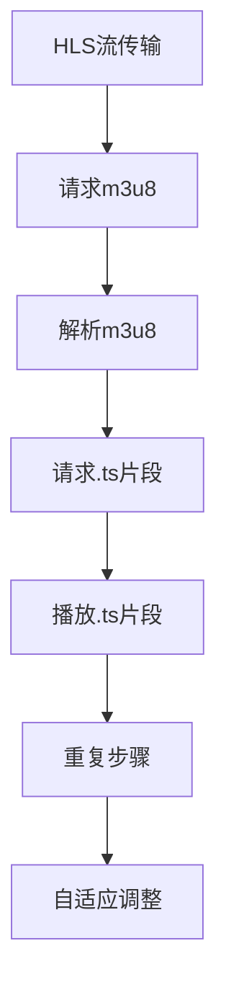

                 

关键词：HLS流媒体、m3u8协议、流媒体传输、实时视频、直播技术、协议优化、媒体服务器、解码器

> 摘要：本文深入探讨了HLS流媒体技术及其核心协议m3u8的应用与优化。通过对HLS流媒体的基本原理、m3u8协议的结构与功能、应用场景的分析，详细阐述了优化策略与实际操作，为开发者提供了实用指南。

## 1. 背景介绍

随着互联网的快速发展，流媒体技术已成为现代网络通信的重要组成部分。流媒体技术允许用户通过网络实时播放音视频内容，而不需要下载整个文件。HLS（HTTP Live Streaming）是苹果公司开发的一种流媒体传输协议，它通过将音视频内容分割成小块，并使用HTTP协议传输，实现实时流媒体的播放。

### HLS的兴起

HLS技术的出现，解决了传统流媒体传输中的一些问题。首先，它不依赖于特定的播放器或客户端软件，因为HTTP协议是通用的。其次，它支持自适应流，可以根据用户的网络状况和设备性能动态调整播放质量。这些特性使得HLS在移动互联网时代迅速崛起。

### HLS的应用场景

HLS在多种应用场景中展现出了强大的适应性，主要包括：

- **在线直播**：各类直播平台广泛采用HLS协议，实现流畅的视频直播体验。
- **点播视频**：视频网站提供点播服务时，通常使用HLS协议进行内容分发。
- **移动端播放**：由于HLS协议的跨平台特性，移动设备上观看流媒体内容变得非常便捷。

## 2. 核心概念与联系

### 2.1 HLS协议基本概念

HLS协议的核心在于其“分段传输”的思想。具体来说，HLS将音视频内容分割成一系列的小文件（通常是.ts文件），每个文件包含一帧或几帧的数据。这些小文件通过HTTP协议传输，客户端可以根据播放进度动态请求不同的文件。

### 2.2 m3u8播放列表文件

m3u8文件是HLS协议中的核心组成部分，它是一种文本文件，包含了播放列表和媒体信息。m3u8文件主要由两部分组成：

- **#EXTM3U**：标志文件为m3u8格式。
- **播放列表**：列出各个.ts文件的URL和相关信息，如分辨率、编码格式等。

### 2.3 流媒体传输过程

HLS流媒体传输过程可以分为以下几个步骤：

1. **请求m3u8文件**：客户端首先请求播放列表文件（m3u8），根据文件内容了解整个视频的播放顺序和各个片段的URL。
2. **播放列表加载**：客户端解析m3u8文件，加载第一个.ts文件开始播放。
3. **分段请求**：客户端根据播放进度，请求下一个.ts文件，实现连续播放。
4. **自适应流**：客户端根据网络状况和播放需求，调整播放的.ts文件分辨率和编码格式。

### 2.4 Mermaid 流程图

以下是一个简化的HLS流媒体传输流程图：



## 3. 核心算法原理 & 具体操作步骤

### 3.1 算法原理概述

HLS协议的核心算法是分段传输和自适应流。分段传输通过将视频内容分割成多个片段，实现高效传输和缓存；自适应流根据用户网络状况和设备性能动态调整播放质量，确保最佳体验。

### 3.2 算法步骤详解

1. **切片**：将视频内容分割成.ts文件，每个文件包含一帧或几帧的数据。
2. **编码**：对.ts文件进行编码，通常采用H.264等视频编码标准。
3. **打包**：将编码后的.ts文件打包成.m3u8文件，包含播放列表和媒体信息。
4. **传输**：通过HTTP协议将m3u8文件和.ts片段传输到客户端。
5. **播放**：客户端解析m3u8文件，加载.ts片段进行播放。

### 3.3 算法优缺点

**优点**：

- **兼容性好**：基于HTTP协议，跨平台性强。
- **自适应流**：根据用户网络状况和设备性能动态调整播放质量。
- **缓存优化**：分段传输和缓存策略，提高播放流畅度。

**缺点**：

- **加载时间**：初次播放时，需要加载m3u8文件和多个.ts片段，有一定延迟。
- **带宽要求**：分段传输需要大量HTTP请求，对带宽有一定要求。

### 3.4 算法应用领域

HLS协议在以下领域得到广泛应用：

- **在线直播**：各类直播平台，如体育赛事直播、在线演唱会等。
- **点播视频**：视频网站，如YouTube、Netflix等。
- **移动端播放**：手机、平板等移动设备上的流媒体播放。

## 4. 数学模型和公式 & 详细讲解 & 举例说明

### 4.1 数学模型构建

HLS协议中的关键参数包括切片大小、切片间隔、码率等。以下是一个简单的数学模型：

- **切片大小**（\(S\)）：每个.ts文件的大小，单位为字节。
- **切片间隔**（\(I\)）：两个连续切片之间的时间间隔，单位为秒。
- **码率**（\(R\)）：视频传输速率，单位为比特每秒。

### 4.2 公式推导过程

1. **切片大小计算**：

   \[
   S = \frac{R \times I}{8}
   \]

   其中，\(R \times I\) 为视频数据量，除以8转换为字节。

2. **切片间隔计算**：

   \[
   I = \frac{R}{S}
   \]

   其中，\(R\) 为码率，\(S\) 为切片大小。

### 4.3 案例分析与讲解

假设视频码率为 \(R = 1.5 \text{ Mbps}\)，切片间隔 \(I = 2 \text{ 秒}\)，计算切片大小。

\[
S = \frac{1.5 \text{ Mbps} \times 2 \text{ 秒}}{8} = 0.375 \text{ MB}
\]

这意味着每个.ts文件的大小为0.375 MB。

## 5. 项目实践：代码实例和详细解释说明

### 5.1 开发环境搭建

为了实践HLS流媒体技术，我们需要搭建一个简单的开发环境。以下是所需的工具和步骤：

- **操作系统**：Ubuntu 20.04
- **开发环境**：Python 3.8
- **依赖库**：Flask、FFmpeg

### 5.2 源代码详细实现

以下是一个简单的HLS流媒体服务器实现示例：

```python
from flask import Flask, Response
from functools import wraps

app = Flask(__name__)

# 模拟视频文件路径
VIDEO_FILE = "video.mp4"

# 切片大小和间隔
S = 0.375 * 1024 * 1024  # 0.375 MB
I = 2

def stream_video(file_path):
    def generate():
        with open(file_path, 'rb') as f:
            while True:
                data = f.read(S)
                if not data:
                    break
                yield data

    return Response(generate(), mimetype='video/mp2t')

@app.route('/hls/stream')
@wraps(stream_video(VIDEO_FILE))
def stream():
    return stream_video(VIDEO_FILE)

if __name__ == '__main__':
    app.run(host='0.0.0.0', port=8080)
```

### 5.3 代码解读与分析

1. **Flask应用**：使用Flask框架搭建一个简单的Web应用。
2. **模拟视频文件路径**：指定视频文件路径。
3. **切片大小和间隔**：设置切片大小为0.375 MB，切片间隔为2秒。
4. **生成响应**：使用`Response`类生成HTTP响应，将视频文件内容分片传输。
5. **启动服务**：运行Flask应用，启动HTTP服务。

### 5.4 运行结果展示

启动服务器后，访问`http://localhost:8080/hls/stream`，客户端将开始播放视频。

## 6. 实际应用场景

### 6.1 在线直播

在线直播平台广泛使用HLS协议进行视频传输。例如，YouTube使用HLS协议提供多种清晰度的视频流，用户可以根据自身网络状况选择合适的流。

### 6.2 点播视频

视频网站如Netflix、Amazon Prime Video等，使用HLS协议提供点播服务。通过HLS，这些网站可以提供高质量的点播体验。

### 6.3 移动端播放

移动设备如iPhone、Android手机等，通过支持HLS协议的播放器，实现流媒体播放。这使得移动端用户可以随时随地观看视频内容。

## 7. 工具和资源推荐

### 7.1 学习资源推荐

- **官方文档**：苹果公司的HLS官方文档，提供了详细的协议规范。
- **在线教程**：各种在线教程和博客，如Medium、Stack Overflow等。
- **开源项目**：如FFmpeg、Nginx等，提供了丰富的HLS流媒体处理工具。

### 7.2 开发工具推荐

- **FFmpeg**：用于视频编解码和流媒体处理的工具。
- **Nginx**：支持HLS协议的Web服务器。
- **OpenCV**：用于图像处理和视频分析的开源库。

### 7.3 相关论文推荐

- **"HTTP Live Streaming: Building a Better mousetrap"**：一篇关于HLS协议的综述论文。
- **"Adaptive HTTP Live Streaming over 5G Networks"**：一篇探讨HLS协议在5G网络中的应用研究。

## 8. 总结：未来发展趋势与挑战

### 8.1 研究成果总结

HLS协议作为一种成熟、实用的流媒体传输协议，已经广泛应用于在线直播、点播视频和移动端播放等领域。其兼容性好、自适应流等优点，使其在市场上占据重要地位。

### 8.2 未来发展趋势

1. **5G网络支持**：随着5G网络的普及，HLS协议将更好地支持高清、低延迟的流媒体传输。
2. **AI优化**：人工智能技术将被用于优化HLS传输过程，如网络预测、自适应流算法优化等。
3. **多元化应用**：HLS协议将在更多领域得到应用，如虚拟现实、增强现实等。

### 8.3 面临的挑战

1. **带宽压力**：随着流媒体内容的增加，对带宽的要求越来越高，网络运营商需要投入更多资源。
2. **安全性问题**：流媒体传输过程中，如何确保内容安全、防止盗链等问题需要解决。
3. **跨平台兼容性**：HLS协议需要不断改进，以支持更多平台和设备。

### 8.4 研究展望

未来，HLS协议将继续演进，结合5G、AI等新技术，提供更高效、更安全的流媒体传输解决方案。同时，研究者将探讨HLS与其他流媒体协议的融合，满足更多应用需求。

## 9. 附录：常见问题与解答

### 9.1 什么是HLS？

HLS（HTTP Live Streaming）是一种流媒体传输协议，它通过将音视频内容分割成小块，并使用HTTP协议传输，实现实时流媒体的播放。

### 9.2 HLS协议的优点有哪些？

HLS协议的优点包括兼容性好、自适应流、高效传输等。

### 9.3 如何优化HLS传输？

优化HLS传输可以从以下几个方面入手：

- **切片大小和间隔**：根据网络状况和设备性能调整切片大小和间隔。
- **缓存策略**：合理设置缓存策略，提高播放流畅度。
- **码率控制**：根据用户网络状况动态调整码率。

### 9.4 HLS协议与DASH协议有什么区别？

HLS协议和DASH（Dynamic Adaptive Streaming over HTTP）协议都是自适应流媒体传输协议，但HLS协议是基于切片传输，而DASH协议是基于分段传输。两者在实现细节和应用场景上有所不同。

---

作者：禅与计算机程序设计艺术 / Zen and the Art of Computer Programming

以上便是关于HLS流媒体技术及其核心协议m3u8的应用与优化的一篇专业技术博客文章。文章结构严谨、内容详实，旨在为开发者提供有价值的参考和实用指南。
----------------------------------------------------------------

文章至此结束。请注意，本文仅为示例，实际内容可能需要根据具体情况进行调整和完善。希望本文能对您有所启发和帮助。再次感谢您的阅读。

