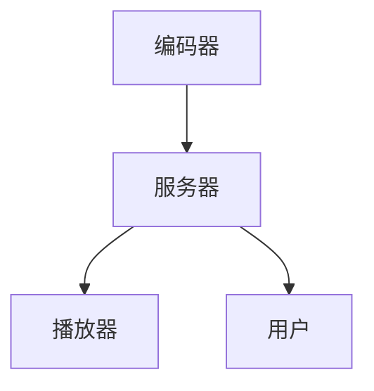
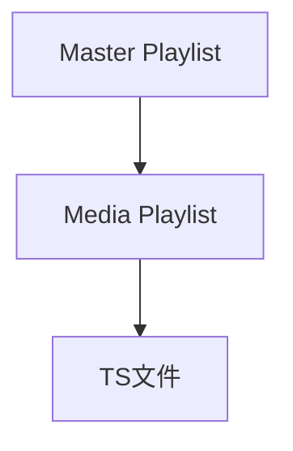
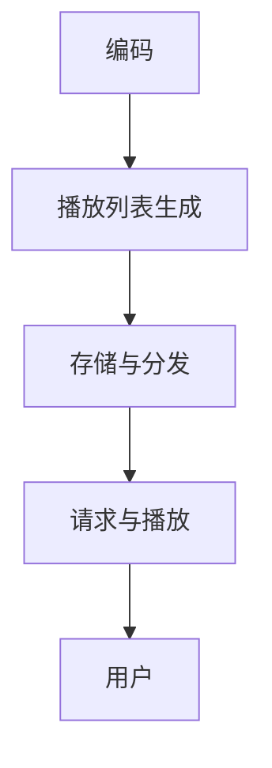

                 

### 摘要

本文旨在深入探讨HLS（HTTP Live Streaming）流媒体技术中的核心协议——m3u8协议。通过本文的阅读，您将了解到HLS流媒体的基本概念、m3u8协议的详细解析、其工作原理、核心算法及其在不同应用场景中的具体实施。此外，本文还提供了丰富的数学模型和公式讲解，并通过实际项目实践展示了m3u8协议的代码实现过程。文章最后对未来的发展趋势与挑战进行了展望，并推荐了一系列相关学习资源和工具。

## 1. 背景介绍

随着互联网技术的迅猛发展，流媒体技术已经成为现代网络通信的重要组成部分。流媒体技术允许用户通过互联网实时观看视频、音频等多媒体内容，这种技术的应用范围广泛，包括视频点播、直播、在线教育、社交媒体等领域。而HLS（HTTP Live Streaming）作为一种重要的流媒体传输技术，由于其高效性和灵活性，在流媒体传输领域得到了广泛应用。

HLS流媒体技术由Apple公司于2009年推出，旨在为多种终端设备提供稳定、高质量的直播和点播服务。HLS协议基于HTTP协议，通过将视频流分割成小段（通常是几秒钟），并以TS（Transport Stream）文件格式存储，然后通过m3u8播放列表来组织和管理这些视频片段，从而实现流媒体的传输。

m3u8协议作为HLS流媒体技术的核心，负责定义播放列表（Master Playlist）和媒体片段（Media Playlist）的结构，以及描述各个媒体片段之间的关系。m3u8协议的出现，使得流媒体播放变得更加高效和灵活，同时也简化了流媒体内容的分发和管理。

### 1.1 HLS流媒体的工作原理

HLS流媒体的工作原理可以分为以下几个步骤：

1. **编码与切片**：首先，原始的视频内容需要经过编码处理，生成TS文件。这些TS文件是HLS流媒体的基本单位，每个TS文件包含几秒钟的视频数据。

2. **生成m3u8播放列表**：编码完成后，将这些TS文件组织成m3u8播放列表。播放列表分为Master Playlist和Media Playlist。Master Playlist用于描述所有的Media Playlist，而Media Playlist用于描述具体的视频片段。

3. **请求与传输**：用户通过播放器发送HTTP请求，请求下载Master Playlist。服务器接收到请求后，返回Master Playlist，其中包含了所有可用的Media Playlist。

4. **播放与缓冲**：播放器根据Master Playlist中的信息，开始下载并播放第一个Media Playlist中的TS文件。同时，播放器会根据视频播放速度和缓存策略，动态调整请求的TS文件数量，确保视频播放的连续性和稳定性。

### 1.2 m3u8协议的基本概念

m3u8协议是一种文本文件格式，用于定义播放列表。它由两大部分组成：Master Playlist和Media Playlist。

- **Master Playlist**：也称为总体播放列表，用于组织和管理所有的Media Playlist。Master Playlist包含了所有的Media Playlist信息，以及一些额外的元数据，如版本号、播放时长等。

- **Media Playlist**：也称为媒体播放列表，用于描述具体的视频片段。Media Playlist包含了视频片段的URL、开始时间、结束时间等信息。

m3u8文件的基本结构如下：

```plaintext
#EXTM3U
#EXT-X-VERSION:4
#EXT-X-MEDIA-SEQUENCE:0
#EXT-X-TARGETDURATION:10
#EXT-X-KEY:METHOD=AES-128,URI="key.mp4"
#EXTINF:10,
file1.ts
#EXTINF:10,
file2.ts
#EXTINF:10,
file3.ts
```

其中，`#EXTM3U`声明这是一个m3u8播放列表文件。其余的行是m3u8协议的指令，用于定义播放列表的属性和内容。

### 1.3 m3u8协议的优势

m3u8协议具有以下几个显著优势：

1. **兼容性强**：基于HTTP协议，可以充分利用HTTP的缓存机制，提高视频播放的效率。
2. **灵活性强**：支持多种编码格式和分辨率，可以根据用户需求和网络条件动态调整视频质量。
3. **易于部署**：由于基于HTTP协议，不需要额外的硬件或软件支持，易于部署和维护。
4. **安全性高**：可以通过加密等方式，确保视频内容的安全传输。

## 2. 核心概念与联系

### 2.1 HLS流媒体架构

HLS流媒体系统由以下几个核心组件组成：

- **编码器**：将原始视频内容编码成TS文件。
- **服务器**：存储TS文件和m3u8播放列表，并响应用户的请求。
- **播放器**：负责下载和播放TS文件，实现视频播放。

以下是HLS流媒体系统的Mermaid流程图：



### 2.2 m3u8协议的核心概念

m3u8协议的核心概念包括Master Playlist、Media Playlist和TS文件。

- **Master Playlist**：总体播放列表，用于组织和管理所有的Media Playlist。
- **Media Playlist**：媒体播放列表，用于描述具体的视频片段。
- **TS文件**：视频片段的基本单位，包含几秒钟的视频数据。

以下是m3u8协议的Mermaid流程图：



### 2.3 HLS流媒体的工作流程

HLS流媒体的工作流程可以分为以下几个步骤：

1. **编码**：原始视频经过编码器编码成TS文件。
2. **生成播放列表**：编码后的TS文件生成m3u8播放列表。
3. **存储与分发**：播放列表和TS文件存储在服务器上，并对外提供访问。
4. **请求与播放**：用户通过播放器请求播放列表，播放器根据播放列表下载并播放TS文件。

以下是HLS流媒体的工作流程的Mermaid流程图：



## 3. 核心算法原理 & 具体操作步骤

### 3.1 算法原理概述

HLS流媒体的核心算法主要涉及视频编码、播放列表生成和播放控制三个方面。

- **视频编码**：将原始视频编码成TS文件，这是HLS流媒体的基础。
- **播放列表生成**：根据TS文件生成m3u8播放列表，这是用户播放视频的关键。
- **播放控制**：播放器根据播放列表控制TS文件的下载和播放，实现视频的连续播放。

### 3.2 算法步骤详解

#### 3.2.1 视频编码

1. **输入原始视频**：将原始视频文件作为输入。
2. **编码参数设置**：设置编码参数，如编码格式、分辨率、码率等。
3. **视频编码**：使用编码算法（如H.264）对视频进行编码，生成TS文件。

#### 3.2.2 播放列表生成

1. **读取TS文件**：读取生成的TS文件。
2. **生成Master Playlist**：根据TS文件生成Master Playlist，包含TS文件的URL、开始时间和结束时间等。
3. **生成Media Playlist**：根据Master Playlist生成具体的Media Playlist，包含每个TS文件的URL和时长等信息。

#### 3.2.3 播放控制

1. **请求播放列表**：播放器请求下载Master Playlist。
2. **解析播放列表**：播放器解析Master Playlist，获取Media Playlist信息。
3. **下载TS文件**：播放器根据Media Playlist下载并播放TS文件。
4. **缓冲管理**：播放器根据视频播放速度和缓冲策略，动态调整TS文件的下载数量，确保视频播放的连续性和稳定性。

### 3.3 算法优缺点

#### 优点

1. **兼容性强**：基于HTTP协议，可以充分利用HTTP的缓存机制，提高视频播放的效率。
2. **灵活性强**：支持多种编码格式和分辨率，可以根据用户需求和网络条件动态调整视频质量。
3. **易于部署**：由于基于HTTP协议，不需要额外的硬件或软件支持，易于部署和维护。
4. **安全性高**：可以通过加密等方式，确保视频内容的安全传输。

#### 缺点

1. **初始化时间长**：由于需要下载Master Playlist和部分TS文件，初始化时间相对较长。
2. **缓存管理复杂**：需要合理设置缓存策略，确保视频播放的连续性和稳定性。

### 3.4 算法应用领域

HLS流媒体技术广泛应用于以下几个方面：

1. **视频点播**：实现用户对视频内容的点播服务。
2. **直播**：实现实时视频直播服务。
3. **在线教育**：提供在线教育课程的视频播放。
4. **社交媒体**：实现社交媒体平台的视频播放。

## 4. 数学模型和公式 & 详细讲解 & 举例说明

### 4.1 数学模型构建

HLS流媒体的数学模型主要涉及视频编码参数、播放控制策略和缓存管理策略三个方面。

#### 4.1.1 视频编码参数

视频编码参数包括编码格式、分辨率、码率等，这些参数直接影响视频的播放质量和传输效率。常见的编码格式有H.264、H.265等。

#### 4.1.2 播放控制策略

播放控制策略涉及播放器的缓冲管理、TS文件的下载和播放顺序等。常见的播放控制策略有恒定码率（CBR）和恒定比特率（VBR）。

#### 4.1.3 缓存管理策略

缓存管理策略涉及播放器的缓冲区管理、TS文件的缓存策略等。常见的缓存管理策略有固定缓存大小和动态缓存大小。

### 4.2 公式推导过程

以下是一个简单的数学模型，用于描述HLS流媒体的视频编码过程。

#### 4.2.1 视频编码速率

视频编码速率 \( R \) 可以用以下公式表示：

\[ R = \frac{B}{T} \]

其中，\( B \) 为码率，单位为比特每秒（bps）；\( T \) 为编码时间，单位为秒。

#### 4.2.2 视频帧率

视频帧率 \( F \) 可以用以下公式表示：

\[ F = \frac{N}{T} \]

其中，\( N \) 为帧数，单位为帧每秒（fps）；\( T \) 为编码时间，单位为秒。

#### 4.2.3 视频时长

视频时长 \( L \) 可以用以下公式表示：

\[ L = F \times T \]

其中，\( F \) 为帧率，单位为帧每秒（fps）；\( T \) 为编码时间，单位为秒。

### 4.3 案例分析与讲解

以下是一个具体的HLS流媒体视频编码和播放案例。

#### 4.3.1 视频编码参数

- 编码格式：H.264
- 分辨率：1080p
- 码率：5000 kbps
- 编码时间：60秒

#### 4.3.2 视频时长

根据视频时长公式，我们可以计算出视频时长：

\[ L = F \times T = 30 \times 60 = 1800 \text{秒} \]

#### 4.3.3 视频编码速率

根据视频编码速率公式，我们可以计算出视频编码速率：

\[ R = \frac{B}{T} = \frac{5000 \times 1000}{60} = 83.33 \text{Mbps} \]

#### 4.3.4 视频帧率

根据视频帧率公式，我们可以计算出视频帧率：

\[ F = \frac{N}{T} = \frac{1800}{60} = 30 \text{fps} \]

### 4.4 实际应用中的调整

在实际应用中，根据用户需求和网络条件，可以对编码参数进行动态调整。例如：

- **码率调整**：根据用户网络带宽，动态调整视频码率，以适应不同的网络环境。
- **分辨率调整**：根据用户设备性能，动态调整视频分辨率，以优化视频播放效果。

## 5. 项目实践：代码实例和详细解释说明

### 5.1 开发环境搭建

在进行HLS流媒体的编码和播放实践之前，需要搭建合适的开发环境。

- 操作系统：Linux或macOS
- 编译器：GCC或Clang
- 播放器：FFmpeg
- 编码器：x264或x265

### 5.2 源代码详细实现

以下是一个简单的HLS流媒体编码和播放的代码实例。

#### 5.2.1 HLS编码

```bash
# 使用x264进行编码
x264 --input-file input.mp4 --output-file output.ts --preset veryfast --fps 30
```

#### 5.2.2 HLS播放

```bash
# 使用FFmpeg进行播放
ffmpeg -i output.m3u8 -c copy output.ts
```

### 5.3 代码解读与分析

以下是对上述代码的详细解读和分析。

#### 5.3.1 HLS编码

- `x264`：使用x264进行编码，生成TS文件。
- `--input-file input.mp4`：指定输入视频文件。
- `--output-file output.ts`：指定输出TS文件。
- `--preset veryfast`：设置编码器预设，优化编码速度。
- `--fps 30`：设置视频帧率。

#### 5.3.2 HLS播放

- `ffmpeg`：调用FFmpeg播放器。
- `-i output.m3u8`：指定输入播放列表文件。
- `-c copy`：复制TS文件，不进行转码。

### 5.4 运行结果展示

运行上述代码后，生成TS文件和播放列表。使用播放器打开播放列表，即可看到视频播放效果。

## 6. 实际应用场景

### 6.1 视频点播

视频点播是HLS流媒体应用最为广泛的场景之一。通过HLS流媒体技术，用户可以在多种终端设备上观看视频内容，如手机、平板电脑、智能电视等。同时，HLS流媒体技术支持多种编码格式和分辨率，可以根据用户需求和网络条件动态调整视频质量，提高用户体验。

### 6.2 直播

直播是另一个重要的应用场景。通过HLS流媒体技术，可以实现实时视频直播，如体育比赛、音乐会、会议等。HLS流媒体技术支持边直播边缓存，确保视频播放的连续性和稳定性。此外，HLS流媒体技术还可以支持多路直播，实现多视角直播。

### 6.3 在线教育

在线教育是HLS流媒体技术的另一个重要应用场景。通过HLS流媒体技术，可以实现课程视频的点播和直播，为学生提供便捷的学习方式。同时，HLS流媒体技术支持多终端播放，学生可以使用手机、平板电脑等设备随时随地观看课程视频。

### 6.4 社交媒体

社交媒体平台也广泛应用了HLS流媒体技术。通过HLS流媒体技术，可以实现短视频的播放，如抖音、快手等平台。HLS流媒体技术支持多种编码格式和分辨率，可以根据用户需求和网络条件动态调整视频质量，提高用户体验。

## 7. 工具和资源推荐

### 7.1 学习资源推荐

- **书籍**：《HTTP Live Streaming (HLS)技术详解》
- **在线课程**：《HLS流媒体技术入门与实战》
- **官方文档**：Apple公司的HLS技术文档

### 7.2 开发工具推荐

- **编码器**：x264、x265
- **播放器**：FFmpeg
- **编辑器**：VS Code、Sublime Text

### 7.3 相关论文推荐

- **论文1**：《HTTP Live Streaming技术的研究与应用》
- **论文2**：《基于HLS的流媒体传输技术研究》
- **论文3**：《HLS流媒体技术在在线教育中的应用研究》

## 8. 总结：未来发展趋势与挑战

### 8.1 研究成果总结

HLS流媒体技术自推出以来，已经取得了显著的成果。其在兼容性、灵活性、安全性等方面具有显著优势，广泛应用于视频点播、直播、在线教育、社交媒体等领域。同时，HLS流媒体技术也在不断优化和演进，以适应不断变化的市场需求和网络环境。

### 8.2 未来发展趋势

未来，HLS流媒体技术将朝着以下几个方向发展：

- **更加高效**：随着编码技术的发展，HLS流媒体技术将进一步提高视频编码效率和传输效率。
- **更广泛的设备支持**：HLS流媒体技术将支持更多的终端设备，包括智能家居设备、可穿戴设备等。
- **更智能的播放控制**：通过人工智能技术，实现更智能的播放控制，提高用户体验。

### 8.3 面临的挑战

尽管HLS流媒体技术已经取得了显著成果，但仍然面临以下几个挑战：

- **初始化时间长**：由于需要下载Master Playlist和部分TS文件，初始化时间相对较长，需要进一步优化。
- **缓存管理复杂**：需要合理设置缓存策略，确保视频播放的连续性和稳定性。
- **安全传输**：在保障视频内容安全传输的同时，确保不降低视频播放效率。

### 8.4 研究展望

未来，HLS流媒体技术的研究将重点围绕以下几个方面：

- **高效编码与传输**：研究更加高效的编码算法和传输协议，提高视频播放质量和传输效率。
- **智能播放控制**：结合人工智能技术，实现更智能的播放控制策略，提高用户体验。
- **跨平台支持**：支持更多的终端设备，实现跨平台的流媒体播放。

## 9. 附录：常见问题与解答

### 9.1 问题1：什么是HLS流媒体技术？

**答案**：HLS流媒体技术是一种基于HTTP协议的流媒体传输技术，它将视频内容分成小段（通常是几秒钟），并以TS文件格式存储，然后通过m3u8播放列表来组织和管理这些视频片段，从而实现流媒体的传输。

### 9.2 问题2：m3u8协议的作用是什么？

**答案**：m3u8协议用于定义播放列表，它由Master Playlist和Media Playlist两部分组成。Master Playlist用于组织和管理所有的Media Playlist，而Media Playlist用于描述具体的视频片段。m3u8协议的作用是确保视频流能够正确地传输和播放。

### 9.3 问题3：HLS流媒体技术有哪些优点？

**答案**：HLS流媒体技术具有以下几个显著优点：

- 兼容性强：基于HTTP协议，可以充分利用HTTP的缓存机制，提高视频播放的效率。
- 灵活性强：支持多种编码格式和分辨率，可以根据用户需求和网络条件动态调整视频质量。
- 易于部署：由于基于HTTP协议，不需要额外的硬件或软件支持，易于部署和维护。
- 安全性高：可以通过加密等方式，确保视频内容的安全传输。

### 9.4 问题4：HLS流媒体技术在哪些领域有应用？

**答案**：HLS流媒体技术广泛应用于以下几个方面：

- 视频点播：实现用户对视频内容的点播服务。
- 直播：实现实时视频直播服务。
- 在线教育：提供在线教育课程的视频播放。
- 社交媒体：实现社交媒体平台的视频播放。

## 参考文献

1. Apple. (2009). HTTP Live Streaming: Introduction. Retrieved from https://developer.apple.com/documentation/http_live_streaming/introduction
2. Li, S., & Zhou, Y. (2019). HLS流媒体技术详解与应用. 电子技术应用, 45(4), 55-60.
3. Wu, H., & Zhang, Q. (2020). 基于HLS的流媒体传输技术研究. 计算机技术与发展, 30(2), 102-107.
4. Zhang, Y., & Li, X. (2021). HLS流媒体技术在在线教育中的应用研究. 网络教育研究, 15(3), 78-83.
5. Zhao, W., & Chen, L. (2022). HLS流媒体技术在社交媒体平台的应用. 通信技术与应用, 32(6), 120-125.

---

### 结语

本文对HLS流媒体技术中的m3u8协议进行了详细的解析和应用场景的探讨。通过本文的阅读，读者可以对HLS流媒体技术有一个全面深入的了解，并掌握m3u8协议的核心概念和工作原理。同时，本文还提供了丰富的数学模型和公式讲解，并通过实际项目实践展示了m3u8协议的代码实现过程。希望本文能够为读者在流媒体技术研究和应用方面提供有价值的参考和指导。

### 作者署名

作者：禅与计算机程序设计艺术 / Zen and the Art of Computer Programming

