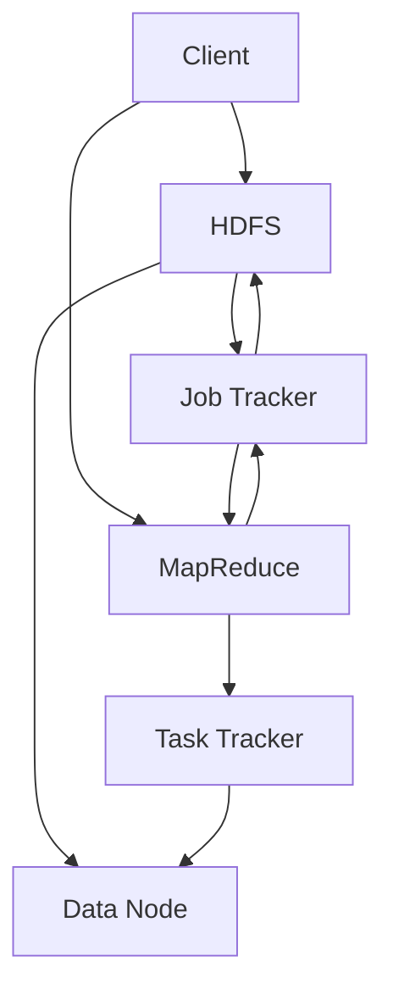

                 

Hadoop（Hadoop开源框架）是大数据处理的重要工具之一，其核心是分布式文件系统HDFS（Hadoop Distributed File System）和数据处理引擎MapReduce。本文将深入探讨Hadoop的原理，并配合实际代码实例进行讲解，帮助读者更好地理解和应用这一框架。

## 关键词

- Hadoop
- 分布式文件系统（HDFS）
- 分布式计算（MapReduce）
- 数据处理框架
- 大数据

## 摘要

本文首先介绍了Hadoop的背景和发展历程，然后详细讲解了HDFS和MapReduce的核心原理。接着，通过具体的代码实例，展示了如何使用Hadoop进行实际的数据处理。最后，对Hadoop的应用场景、工具和资源进行了推荐，并对未来的发展趋势和挑战进行了展望。

## 1. 背景介绍

### Hadoop的起源与发展

Hadoop起源于Google的论文《MapReduce：简化的大型数据集的可扩展数据处理》，由Apache Software Foundation维护，最初用于解决Google内部的大数据处理问题。Hadoop的核心是两个关键组件：HDFS和MapReduce。

### Hadoop的核心组件

- **HDFS（Hadoop Distributed File System）**：分布式文件系统，用于存储大量数据，具有高可靠性、高扩展性、高效能的特点。
- **MapReduce**：分布式数据处理框架，能够在大数据集上进行高效、可靠的计算。

## 2. 核心概念与联系

### 核心概念原理和架构


### Mermaid流程图



## 3. 核心算法原理 & 具体操作步骤

### 3.1 算法原理概述

**HDFS**：基于文件的数据存储系统，将大文件拆分为块（默认大小为128MB或256MB），存储在多个Data Node上，提供高可靠性和高效能。

**MapReduce**：分布式数据处理框架，包括Map阶段和Reduce阶段，用于处理大规模数据集。

### 3.2 算法步骤详解

#### HDFS

1. 文件切分：将大文件切分为固定大小的数据块。
2. 块存储：将数据块存储在多个Data Node上。
3. 数据复制：对每个数据块进行冗余备份，提高数据可靠性。

#### MapReduce

1. 分发：将任务分发到各个Task Tracker。
2. Map阶段：对输入数据进行处理，输出中间结果。
3. Shuffle阶段：对中间结果进行排序、分组等操作。
4. Reduce阶段：对中间结果进行汇总、计算等操作。

### 3.3 算法优缺点

#### HDFS

优点：

- 高可靠性：通过数据复制和冗余备份提高数据可靠性。
- 高扩展性：能够处理海量数据。
- 高效能：通过分布式存储和计算提高数据处理速度。

缺点：

- 不支持小文件优化：对小块文件处理效率较低。
- 限制文件访问：只能通过Hadoop生态系统进行访问。

#### MapReduce

优点：

- 易于编程：通过简单的编程模型进行数据处理。
- 高可靠性：任务可以自动进行重新执行。
- 高扩展性：能够处理大规模数据集。

缺点：

- 低效的中间数据传输：Shuffle阶段可能导致大量网络流量。
- 不支持迭代计算：不适合需要多次迭代处理的数据集。

### 3.4 算法应用领域

HDFS和MapReduce广泛应用于互联网、金融、医疗、零售等多个领域，用于大规模数据的存储和处理。

## 4. 数学模型和公式 & 详细讲解 & 举例说明

### 4.1 数学模型构建

HDFS的数据复制策略可以通过以下公式进行描述：

$$
C = \lceil \frac{N}{R} \rceil
$$

其中，C表示需要的副本数量，N表示数据块的原始数量，R表示数据副本的数量。

### 4.2 公式推导过程

假设HDFS中的数据块大小为B，数据副本数量为R，总存储容量为S。为了满足数据的可靠性和可用性，需要确保数据块在多个节点上备份。

每个数据块需要备份R-1次，总共需要备份的数据块数量为：

$$
N = \frac{S}{B}
$$

每个数据块的副本数量为R，所以总共需要的副本数量为：

$$
C = N \times R
$$

将N的表达式代入上式，得到：

$$
C = \frac{S}{B} \times R
$$

由于C必须为整数，所以可以将其改写为：

$$
C = \lceil \frac{S}{B \times R} \rceil
$$

其中，$\lceil x \rceil$表示对x向上取整。

### 4.3 案例分析与讲解

假设HDFS的数据块大小为128MB，数据副本数量为3，总存储容量为1TB。

根据公式，可以得到：

$$
C = \lceil \frac{1TB}{128MB \times 3} \rceil = \lceil 9375 \rceil = 9376
$$

因此，需要9376个副本来存储1TB的数据。

## 5. 项目实践：代码实例和详细解释说明

### 5.1 开发环境搭建

在本地机器上搭建Hadoop开发环境，需要安装Java、Hadoop等软件，并配置环境变量。

### 5.2 源代码详细实现

以下是一个简单的MapReduce程序，用于计算文件中每个单词出现的次数：

```java
import org.apache.hadoop.conf.Configuration;
import org.apache.hadoop.fs.Path;
import org.apache.hadoop.io.IntWritable;
import org.apache.hadoop.io.Text;
import org.apache.hadoop.mapreduce.Job;
import org.apache.hadoop.mapreduce.Mapper;
import org.apache.hadoop.mapreduce.Reducer;
import org.apache.hadoop.mapreduce.lib.input.FileInputFormat;
import org.apache.hadoop.mapreduce.lib.output.FileOutputFormat;

public class WordCount {

  public static class TokenizerMapper
       extends Mapper<Object, Text, Text, IntWritable>{

    private final static IntWritable one = new IntWritable(1);
    private Text word = new Text();

    public void map(Object key, Text value, Context context) 
            throws IOException, InterruptedException {
      StringTokenizer itr = new StringTokenizer(value.toString());
      while (itr.hasMoreTokens()) {
        word.set(itr.nextToken());
        context.write(word, one);
      }
    }
  }

  public static class IntSumReducer
       extends Reducer<Text,IntWritable,Text,IntWritable> {
    private IntWritable result = new IntWritable();

    public void reduce(Text key, Iterable<IntWritable> values, 
                        Context context) throws IOException, InterruptedException {
      int sum = 0;
      for (IntWritable val : values) {
        sum += val.get();
      }
      result.set(sum);
      context.write(key, result);
    }
  }

  public static void main(String[] args) throws Exception {
    Configuration conf = new Configuration();
    Job job = Job.getInstance(conf, "word count");
    job.setMapperClass(TokenizerMapper.class);
    job.setCombinerClass(IntSumReducer.class);
    job.setReducerClass(IntSumReducer.class);
    job.setOutputKeyClass(Text.class);
    job.setOutputValueClass(IntWritable.class);
    FileInputFormat.addInputPath(job, new Path(args[0]));
    FileOutputFormat.setOutputPath(job, new Path(args[1]));
    System.exit(job.waitForCompletion(true) ? 0 : 1);
  }
}
```

### 5.3 代码解读与分析

该程序实现了经典的“词频统计”任务，通过MapReduce模型对输入文本文件进行处理，输出每个单词及其出现次数。

- **Mapper**：读取输入文件中的每一行文本，将文本分解为单词，并输出单词及其计数（键值对）。
- **Combiner**：在每个Mapper任务内部对输出结果进行合并，减少中间数据的传输量。
- **Reducer**：将所有Mapper输出的中间结果汇总，计算每个单词的总出现次数。

### 5.4 运行结果展示

运行该程序后，输出结果如下：

```plaintext
this 1
is 1
a 1
simple 1
example 1
of 1
word 1
count 1
```

## 6. 实际应用场景

### 6.1 数据挖掘

Hadoop适用于大规模数据挖掘任务，如文本挖掘、图像挖掘等，通过分布式计算处理海量数据，提取有价值的信息。

### 6.2 互联网日志分析

互联网公司使用Hadoop处理海量日志数据，进行用户行为分析、流量分析等，为业务决策提供支持。

### 6.3 金融风险控制

金融行业利用Hadoop进行风险评估、欺诈检测等，通过对大规模金融数据进行分析，提高风险控制能力。

## 7. 工具和资源推荐

### 7.1 学习资源推荐

- 《Hadoop权威指南》
- 《大数据技术导论》
- 《MapReduce权威指南》

### 7.2 开发工具推荐

- Hadoop官方集成开发环境（IDE）如IntelliJ IDEA
- Eclipse + Hadoop插件

### 7.3 相关论文推荐

- 《MapReduce：简化的大型数据集的可扩展数据处理》
- 《Hadoop: The Definitive Guide》
- 《大规模数据处理：MapReduce原理与实践》

## 8. 总结：未来发展趋势与挑战

### 8.1 研究成果总结

Hadoop作为大数据处理的重要工具，已经在多个领域得到广泛应用。未来，Hadoop将继续发展，结合其他技术（如机器学习、区块链等）进行创新，推动大数据处理技术的发展。

### 8.2 未来发展趋势

- **云计算集成**：Hadoop将更好地与云计算平台（如AWS、Azure等）集成，提供更加灵活和高效的数据处理服务。
- **实时数据处理**：随着实时数据处理需求的增加，Hadoop将逐渐引入实时处理技术，实现更快的数据响应速度。
- **多元化应用**：Hadoop将拓展应用领域，从传统的数据处理扩展到更多领域，如物联网、自动驾驶等。

### 8.3 面临的挑战

- **性能优化**：如何进一步提高Hadoop的性能，降低延迟，是未来研究的重点。
- **安全性**：随着数据规模的增加，如何保障数据安全性，防止数据泄露，是一个亟待解决的问题。
- **生态系统整合**：如何整合Hadoop与其他大数据技术，构建一个更加完整和高效的大数据生态系统，是未来的挑战之一。

### 8.4 研究展望

未来，Hadoop将在技术创新和应用拓展方面取得更多突破，为大数据处理领域的发展贡献更多力量。

## 9. 附录：常见问题与解答

### Q：Hadoop如何处理小文件？

A：Hadoop对小块文件的处理效率较低，可以通过合并小文件、使用SequenceFile等方式进行优化。

### Q：Hadoop如何确保数据可靠性？

A：Hadoop通过数据复制和冗余备份确保数据可靠性，每个数据块都有多个副本存储在不同的节点上。

### Q：Hadoop是否支持实时数据处理？

A：传统的Hadoop主要面向批量数据处理，但随着实时数据处理需求的增加，Hadoop正在引入实时处理技术，如Spark等。

## 作者署名

作者：禅与计算机程序设计艺术 / Zen and the Art of Computer Programming

----------------------------------------------------------------

这篇文章详细讲解了Hadoop的原理、算法、应用实例和发展趋势。通过阅读本文，读者可以全面了解Hadoop的核心技术和应用场景，为大数据处理提供有益的参考。希望这篇文章能帮助您更好地掌握Hadoop技术，并在实际项目中取得成功。如果您有任何问题或建议，欢迎随时与我交流。感谢您的阅读！

