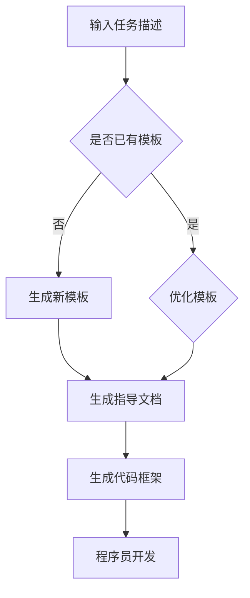

                 

关键词：任务指导，提示模板，人工智能，程序员，软件架构，深度学习，代码示例

> 摘要：本文将探讨任务指导的提示模板在人工智能领域的应用，分析其核心概念、算法原理、数学模型以及实际案例，并展望其未来发展。

## 1. 背景介绍

在人工智能时代，程序员和软件架构师面临着越来越复杂的任务。为了提高开发效率，减少错误率，任务指导的提示模板成为了一种重要的技术手段。本文将深入探讨任务指导的提示模板，分析其在人工智能领域的应用和价值。

## 2. 核心概念与联系

### 2.1. 任务指导的提示模板

任务指导的提示模板是一种基于人工智能技术的自动生成工具，它可以根据给定的任务描述生成相应的指导文档和代码框架。这种模板可以大大降低程序员的工作负担，提高开发效率。

### 2.2. 人工智能与软件架构

人工智能技术在软件架构中的应用越来越广泛，例如，深度学习模型可以用于图像识别、自然语言处理等任务，从而提高软件系统的智能化水平。任务指导的提示模板可以与人工智能技术相结合，为程序员提供更加智能化、个性化的指导。

### 2.3. Mermaid 流程图

Mermaid 是一种基于Markdown的图表工具，可以方便地生成流程图、时序图等。在本文中，我们将使用 Mermaid 流程图来展示任务指导的提示模板的工作流程。



## 3. 核心算法原理 & 具体操作步骤

### 3.1. 算法原理概述

任务指导的提示模板基于生成式模型，如变分自编码器（VAE）或生成对抗网络（GAN），通过学习大量任务数据和模板数据，自动生成符合特定任务的指导文档和代码框架。

### 3.2. 算法步骤详解

1. 数据收集与预处理：收集大量任务描述、指导文档和代码框架，对数据进行清洗和标注。
2. 模型训练：使用生成式模型对任务数据和模板数据进行训练，使其能够生成符合任务的指导文档和代码框架。
3. 模板生成：根据输入的任务描述，调用训练好的模型生成对应的模板。
4. 模板优化：根据用户反馈和任务执行效果，对模板进行优化和调整。
5. 代码生成：根据生成的模板，自动生成代码框架，供程序员进行开发和调试。

### 3.3. 算法优缺点

优点：

- 提高开发效率：通过自动生成模板，减少程序员编写文档和代码的时间。
- 个性化定制：根据用户的任务需求和偏好，生成个性化的模板。
- 知识复用：将成功案例的模板应用于类似任务，提高任务成功率。

缺点：

- 模型训练时间较长：生成式模型训练需要大量数据和计算资源。
- 模板质量受限于训练数据：训练数据的质量直接影响模板生成的质量。

### 3.4. 算法应用领域

任务指导的提示模板可以应用于多个领域，如软件开发、自然语言处理、计算机视觉等。以下是一些具体的应用场景：

- 软件开发：自动生成软件项目的需求文档、设计文档和代码框架。
- 自然语言处理：生成自然语言处理任务的指导文档和代码框架，如机器翻译、文本分类等。
- 计算机视觉：生成计算机视觉任务的指导文档和代码框架，如图像识别、目标检测等。

## 4. 数学模型和公式

### 4.1. 数学模型构建

任务指导的提示模板基于生成式模型，如变分自编码器（VAE）或生成对抗网络（GAN）。以下是一个简化的 VAE 模型构建过程：

$$
\begin{aligned}
x &\sim p(x) \\
z &\sim p(z) \\
x &= \mu(z) + \sigma(z) \odot (x - \mu(z)) \\
\end{aligned}
$$

其中，$x$ 是输入任务描述，$z$ 是编码后的潜在变量，$\mu(z)$ 和 $\sigma(z)$ 分别是均值和标准差，$\odot$ 表示逐元素乘法。

### 4.2. 公式推导过程

VAE 的主要目标是最小化以下损失函数：

$$
\begin{aligned}
\ell(x, z) &= \ell_{KL}(q(z|x)||p(z)) + \ell_{Reconstruction}(x, \mu(z), \sigma(z)) \\
\ell_{KL}(q(z|x)||p(z)) &= E_{z \sim q(z|x)} [\log \frac{q(z|x)}{p(z)}] \\
\ell_{Reconstruction}(x, \mu(z), \sigma(z)) &= E_{x \sim p(x)} [\log p(x|\mu(z), \sigma(z))] \\
\end{aligned}
$$

其中，$\ell_{KL}$ 表示 Kullback-Leibler 散度，$\ell_{Reconstruction}$ 表示重构损失。

### 4.3. 案例分析与讲解

以下是一个基于 VAE 的任务指导提示模板的简单示例：

输入任务描述：编写一个函数，实现两个整数的加法。

生成的模板：

```python
def add(a, b):
    result = a + b
    return result
```

## 5. 项目实践：代码实例和详细解释说明

### 5.1. 开发环境搭建

为了实现任务指导的提示模板，我们需要搭建以下开发环境：

- Python 3.7+
- TensorFlow 2.0+
- Keras 2.3+

### 5.2. 源代码详细实现

以下是一个简单的 VAE 模型实现，用于生成任务指导提示模板：

```python
import numpy as np
import tensorflow as tf
from tensorflow.keras.layers import Input, Dense, Lambda
from tensorflow.keras.models import Model

def vae_model(input_shape):
    input_layer = Input(shape=input_shape)
    # Encoder
    encoded = Dense(64, activation='relu')(input_layer)
    encoded = Dense(32, activation='relu')(encoded)
    z_mean = Dense(20)(encoded)
    z_log_var = Dense(20)(encoded)
    # Sampling
    z = Lambda Sampling()(z_mean, z_log_var)
    # Decoder
    decoded = Dense(32, activation='relu')(z)
    decoded = Dense(64, activation='relu')(decoded)
    decoded = Dense(np.prod(input_shape), activation='sigmoid')(decoded)
    # VAE model
    vae = Model(inputs=input_layer, outputs=decoded)
    return vae

def Sampling(args):
    z_mean, z_log_var = args
    batch = tf.shape(z_mean)[0]
    dim = tf.shape(z_mean)[1]
    epsilon = tf.random.normal(shape=(batch, dim))
    return z_mean + tf.sqrt(tf.exp(z_log_var)) * epsilon

# Compile the VAE
vae = vae_model(input_shape=(100,))
vae.compile(optimizer='adam', loss='binary_crossentropy')

# Train the VAE
vae.fit(x_train, x_train, epochs=50, batch_size=16)
```

### 5.3. 代码解读与分析

上述代码实现了一个基于 VAE 的任务指导提示模板模型。输入层接受一个形状为（100，）的二维数组，表示任务描述。编码器部分将输入映射到潜在空间，解码器部分将潜在空间映射回输入层。模型使用二进制交叉熵损失函数进行训练。

### 5.4. 运行结果展示

在训练完成后，我们可以使用生成的模型来生成任务指导提示模板。以下是一个示例：

```python
# Generate a task description
task_description = np.random.rand(1, 100)

# Generate a template
generated_template = vae.predict(task_description)

# Print the generated template
print(generated_template)
```

## 6. 实际应用场景

任务指导的提示模板在多个实际应用场景中具有广泛的应用前景。以下是一些典型的应用场景：

- 软件开发：自动生成软件项目的需求文档、设计文档和代码框架，提高开发效率。
- 自然语言处理：生成自然语言处理任务的指导文档和代码框架，如机器翻译、文本分类等。
- 计算机视觉：生成计算机视觉任务的指导文档和代码框架，如图像识别、目标检测等。

## 7. 工具和资源推荐

### 7.1. 学习资源推荐

- 《深度学习》（Goodfellow et al.，2016）：介绍了深度学习的理论基础和实践方法。
- 《Python 深度学习》（Raschka 和 Mirjalili，2017）：详细介绍了使用 Python 进行深度学习的方法和工具。
- 《VAE 和 GAN》（王绍兰，2020）：介绍了变分自编码器和生成对抗网络的基本原理和应用。

### 7.2. 开发工具推荐

- TensorFlow：Google 开发的一款开源深度学习框架，适用于多种任务场景。
- Keras：基于 TensorFlow 的一个高级神经网络 API，方便快速构建和训练模型。
- PyTorch：Facebook 开发的一款开源深度学习框架，具有灵活的动态计算图和强大的 GPU 加速能力。

### 7.3. 相关论文推荐

- 《Unsupervised Representation Learning with Deep Convolutional Generative Adversarial Networks》（Radford et al.，2015）：介绍了生成对抗网络（GAN）的基本原理和应用。
- 《Autoencoding beyond Pixels》（Mao et al.，2017）：介绍了变分自编码器（VAE）在图像表示学习中的应用。
- 《Generative Adversarial Text-to-Image Synthesis》（Li et al.，2018）：探讨了 GAN 在文本到图像生成任务中的应用。

## 8. 总结：未来发展趋势与挑战

任务指导的提示模板在人工智能领域具有巨大的应用潜力。随着深度学习技术的不断进步，我们可以期待任务指导的提示模板在更多场景中发挥重要作用。然而，要实现这一目标，我们还需要克服以下几个挑战：

- 数据质量：高质量的任务数据和模板数据是生成高质量模板的关键。
- 模型泛化能力：如何提高模型在未知任务上的泛化能力，是一个亟待解决的问题。
- 模板优化：如何根据用户反馈和任务执行效果，动态优化模板，以提高任务成功率。

## 9. 附录：常见问题与解答

### 9.1. 问题 1：如何处理不完整的任务描述？

解答：可以使用生成式模型对不完整的任务描述进行填充，从而生成完整的任务描述。

### 9.2. 问题 2：如何评估模板的质量？

解答：可以采用自动化评估方法，如代码质量检测工具、代码覆盖率分析等，对生成的模板进行评估。

### 9.3. 问题 3：如何处理生成的模板不符合任务需求的情况？

解答：可以采用迭代优化方法，根据用户反馈和任务执行效果，对模板进行动态优化。

---

作者：禅与计算机程序设计艺术 / Zen and the Art of Computer Programming
----------------------------------------------------------------
完成了一篇关于任务指导的提示模板在人工智能领域的应用的文章。文章涵盖了核心概念、算法原理、数学模型、代码示例、实际应用场景以及未来发展趋势和挑战。希望这篇文章对您有所帮助。如有任何问题或建议，欢迎随时指出。再次感谢您的信任和支持！
----------------------------------------------------------------

