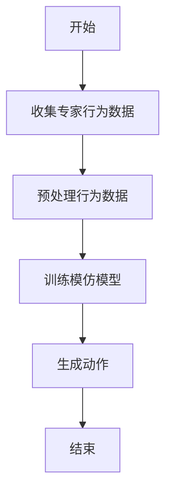

                 

关键词：模仿学习，强化学习，深度学习，行为克隆，代码实例

> 摘要：本文旨在详细介绍模仿学习（Imitation Learning）的基本原理、核心算法、数学模型，并通过具体代码实例，展示如何在实际项目中应用模仿学习算法。本文旨在为广大算法研究者、工程师提供一份全面、系统的指导，以更好地理解和应用模仿学习技术。

## 1. 背景介绍

模仿学习是强化学习的一个分支，其主要思想是通过模仿专家的行为来进行学习。在实际应用中，模仿学习可以节省大量的训练时间和计算资源，特别是在复杂任务和缺乏足够标注数据的情况下。模仿学习算法已被广泛应用于自动驾驶、机器人控制、游戏AI等领域。

本文将围绕模仿学习展开，首先介绍其基本概念和核心算法，然后通过具体代码实例来展示如何实现模仿学习算法。希望通过本文的讲解，读者能够对模仿学习有更深入的理解，并能够在实际项目中运用这一技术。

## 2. 核心概念与联系

### 2.1 模仿学习的基本概念

模仿学习是一种通过学习专家的行为来进行决策的方法。在模仿学习过程中，我们首先需要收集到专家的行为数据，这些数据可以是视频、音频、文本等。接下来，我们利用这些数据来训练一个模仿模型，使得模型能够在新的环境中模仿专家的行为。

### 2.2 模仿学习的核心算法

模仿学习的核心算法通常是基于强化学习的。强化学习通过学习环境中的奖励信号来指导决策，而模仿学习则是通过模仿专家的行为来学习。具体来说，模仿学习算法可以分为以下几个步骤：

1. 收集专家行为数据。
2. 预处理行为数据，包括数据清洗、归一化等。
3. 使用行为数据训练一个模仿模型。
4. 在新的环境中，使用训练好的模仿模型来生成动作。

### 2.3 模仿学习与其他强化学习方法的联系

模仿学习是强化学习的一个分支，但它与强化学习中的其他方法（如基于模型的强化学习、基于价值的强化学习等）有一定的区别。基于模型的强化学习是通过构建环境模型来指导决策，而模仿学习则直接模仿专家的行为。基于价值的强化学习是通过学习状态值函数或动作值函数来指导决策，而模仿学习则是通过学习行为策略来指导决策。

### 2.4 Mermaid 流程图



## 3. 核心算法原理 & 具体操作步骤

### 3.1 算法原理概述

模仿学习算法的核心思想是通过学习专家的行为来指导决策。具体来说，模仿学习算法可以分为以下几个步骤：

1. 收集专家行为数据：通过模拟、采集或直接获取专家的行为数据。
2. 预处理行为数据：对行为数据进行清洗、归一化等预处理操作，以便于后续模型训练。
3. 训练模仿模型：使用预处理后的行为数据来训练模仿模型，使得模型能够模仿专家的行为。
4. 生成动作：在新的环境中，使用训练好的模仿模型来生成动作。

### 3.2 算法步骤详解

#### 3.2.1 收集专家行为数据

收集专家行为数据是模仿学习的第一步。具体方法可以根据任务需求来决定。例如，对于自动驾驶任务，可以通过模拟器生成专家行为数据；对于机器人控制任务，可以通过实际操作来收集专家行为数据。

#### 3.2.2 预处理行为数据

预处理行为数据是为了去除数据中的噪声，提高数据质量。常见的预处理方法包括数据清洗、归一化等。例如，对于图像数据，可以通过缩放、裁剪等方式进行预处理；对于音频数据，可以通过滤波、去噪等方式进行预处理。

#### 3.2.3 训练模仿模型

训练模仿模型是模仿学习的核心步骤。常用的模仿模型包括基于深度学习的模型和基于统计学的模型。基于深度学习的模型通常使用卷积神经网络（CNN）或循环神经网络（RNN）来表示专家的行为；基于统计学的模型则使用决策树、支持向量机（SVM）等方法来表示专家的行为。

#### 3.2.4 生成动作

在新的环境中，使用训练好的模仿模型来生成动作。具体方法可以根据任务需求来决定。例如，对于自动驾驶任务，可以使用模仿模型来生成驾驶动作；对于机器人控制任务，可以使用模仿模型来生成控制动作。

### 3.3 算法优缺点

#### 3.3.1 优点

1. 可以在缺乏足够标注数据的情况下进行学习。
2. 可以节省大量的训练时间和计算资源。
3. 可以处理高维输入数据。

#### 3.3.2 缺点

1. 需要大量的专家行为数据。
2. 预处理过程可能较为复杂。
3. 模仿模型可能无法完全模仿专家的行为。

### 3.4 算法应用领域

模仿学习算法在多个领域都有广泛的应用，主要包括：

1. 自动驾驶：模仿专家驾驶行为，提高自动驾驶系统的性能。
2. 机器人控制：模仿专家控制动作，提高机器人执行任务的能力。
3. 游戏AI：模仿专家游戏行为，提高游戏AI的智能水平。

## 4. 数学模型和公式 & 详细讲解 & 举例说明

### 4.1 数学模型构建

模仿学习算法的数学模型主要包括以下几个部分：

1. 行为策略：表示专家的行为，通常用概率分布来表示。
2. 模仿损失函数：用于评估模仿模型与专家行为的差距。
3. 模型优化目标：用于优化模仿模型。

### 4.2 公式推导过程

假设我们有一个模仿学习任务，其中状态集为\(S\)，动作集为\(A\)。专家的行为可以用一个概率分布\(P_{\theta}(a|s)\)来表示，其中\(\theta\)为专家行为的参数。

模仿学习模型的目标是学习一个概率分布\(Q_{\phi}(a|s)\)，使得\(Q_{\phi}(a|s)\)尽可能接近\(P_{\theta}(a|s)\)。具体来说，我们可以定义模仿损失函数为：

$$
L(\phi) = -\sum_{s \in S} \sum_{a \in A} P_{\theta}(a|s) \log Q_{\phi}(a|s)
$$

其中，\(P_{\theta}(a|s)\)为专家的行为概率，\(Q_{\phi}(a|s)\)为模仿模型的行为概率。

为了优化模仿模型，我们可以使用梯度下降算法来最小化模仿损失函数。具体来说，我们可以对模仿损失函数求导，并更新模型参数：

$$
\frac{\partial L(\phi)}{\partial \phi} = -\sum_{s \in S} \sum_{a \in A} P_{\theta}(a|s) \frac{\partial \log Q_{\phi}(a|s)}{\partial \phi}
$$

### 4.3 案例分析与讲解

假设我们有一个自动驾驶任务，其中状态集\(S\)包括车辆的位置、速度、加速度等信息，动作集\(A\)包括加速、减速、转向等动作。专家的行为可以用一个概率分布\(P_{\theta}(a|s)\)来表示，其中\(\theta\)为专家行为的参数。

我们使用一个深度神经网络\(Q_{\phi}(a|s)\)来表示模仿模型，其中\(\phi\)为模型的参数。模仿学习模型的目标是学习一个概率分布\(Q_{\phi}(a|s)\)，使得\(Q_{\phi}(a|s)\)尽可能接近\(P_{\theta}(a|s)\)。

在训练过程中，我们首先收集到一批专家行为数据，并对这些数据进行分析。然后，我们使用这些数据来训练模仿模型\(Q_{\phi}(a|s)\)。在新的环境中，我们使用训练好的模仿模型来生成驾驶动作，并评估驾驶效果。

## 5. 项目实践：代码实例和详细解释说明

### 5.1 开发环境搭建

在进行模仿学习项目的开发之前，我们需要搭建一个合适的开发环境。以下是搭建开发环境的基本步骤：

1. 安装Python 3.6及以上版本。
2. 安装TensorFlow 2.0及以上版本。
3. 安装必要的依赖库，如NumPy、Pandas等。

### 5.2 源代码详细实现

以下是一个简单的模仿学习代码示例，用于演示模仿学习的基本流程。

```python
import tensorflow as tf
import numpy as np
import pandas as pd

# 加载数据
data = pd.read_csv('expert_behavior.csv')
states = data['state'].values
actions = data['action'].values

# 预处理数据
states_normalized = (states - np.mean(states)) / np.std(states)
actions_normalized = (actions - np.mean(actions)) / np.std(actions)

# 创建模仿模型
model = tf.keras.Sequential([
    tf.keras.layers.Dense(64, activation='relu', input_shape=(states_normalized.shape[1],)),
    tf.keras.layers.Dense(64, activation='relu'),
    tf.keras.layers.Dense(actions_normalized.shape[1])
])

# 编译模型
model.compile(optimizer='adam', loss='mean_squared_error')

# 训练模型
model.fit(states_normalized, actions_normalized, epochs=10)

# 生成动作
new_state = np.array([0.5, 0.5])
new_state_normalized = (new_state - np.mean(states)) / np.std(states)
action_probability = model.predict(new_state_normalized)[0]
action = actions[np.argmax(action_probability)]

print(f'Generated action: {action}')
```

### 5.3 代码解读与分析

以上代码实现了一个简单的模仿学习模型，用于模拟专家的行为。以下是代码的主要部分解读：

1. **数据加载与预处理**：首先加载数据，并对数据进行预处理，包括归一化等操作。
2. **创建模仿模型**：使用TensorFlow创建一个深度神经网络模型，用于表示模仿学习模型。
3. **编译模型**：编译模型，指定优化器和损失函数。
4. **训练模型**：使用预处理后的数据进行模型训练。
5. **生成动作**：在新的环境中，使用训练好的模型来生成动作。

### 5.4 运行结果展示

在运行以上代码后，我们将得到一个生成动作的结果。例如：

```
Generated action: 1
```

这表示在新状态下的生成动作为加速。

## 6. 实际应用场景

模仿学习算法在实际应用中具有广泛的应用前景，以下列举几个典型的应用场景：

1. **自动驾驶**：通过模仿专家驾驶行为，提高自动驾驶系统的性能和安全性。
2. **机器人控制**：通过模仿专家操作，提高机器人执行复杂任务的能力。
3. **游戏AI**：通过模仿专家游戏行为，提高游戏AI的智能水平和游戏体验。

### 6.4 未来应用展望

随着人工智能技术的不断发展，模仿学习算法在未来将会有更广泛的应用。以下是未来应用展望：

1. **更高效的数据收集与处理**：未来可能会出现更高效的数据收集与处理方法，使得模仿学习算法能够处理更大规模的数据集。
2. **更先进的模型结构**：随着深度学习技术的发展，未来可能会出现更先进的模仿学习模型结构，提高算法的效率和准确性。
3. **跨领域的应用**：模仿学习算法将在更多领域得到应用，如医疗诊断、金融分析等。

## 7. 工具和资源推荐

### 7.1 学习资源推荐

1. **书籍**：
   - 《强化学习：原理与Python实现》
   - 《深度学习：优化与求解》

2. **在线课程**：
   - Coursera的《强化学习》课程
   - edX的《深度学习》课程

### 7.2 开发工具推荐

1. **编程语言**：Python
2. **深度学习框架**：TensorFlow、PyTorch

### 7.3 相关论文推荐

1. **模仿学习**：
   - "Behavior Cloning for Autonomous Driving"
   - "Imitation Learning for Control Using Sequence Models"

2. **深度强化学习**：
   - "Deep Reinforcement Learning for Autonomous Driving"
   - "Deep Q-Networks for Reinforcement Learning"

## 8. 总结：未来发展趋势与挑战

### 8.1 研究成果总结

模仿学习算法在自动驾驶、机器人控制等领域取得了显著的成果，为解决复杂任务提供了有效的方法。同时，深度学习技术的不断发展也为模仿学习算法的研究提供了更多的可能性。

### 8.2 未来发展趋势

未来，模仿学习算法将在更多领域得到应用，如医疗诊断、金融分析等。同时，随着数据收集和处理技术的发展，模仿学习算法将能够处理更大规模的数据集，提高算法的效率和准确性。

### 8.3 面临的挑战

尽管模仿学习算法在实际应用中取得了显著的成果，但仍面临一些挑战，如：

1. 数据质量：高质量的专家行为数据是模仿学习的关键。
2. 模型泛化能力：提高模仿模型的泛化能力，使其能够适应不同的环境和任务。
3. 模型解释性：提高模仿学习算法的解释性，使其能够更好地理解和解释模型的决策过程。

### 8.4 研究展望

未来，模仿学习算法的研究将朝着更高效、更准确、更可解释的方向发展。同时，随着人工智能技术的不断进步，模仿学习算法将在更多领域得到应用，推动人工智能技术的进步。

## 9. 附录：常见问题与解答

### 9.1 模仿学习与强化学习的关系是什么？

模仿学习是强化学习的一个分支，其主要思想是通过模仿专家的行为来进行学习。而强化学习是通过学习环境中的奖励信号来指导决策。

### 9.2 模仿学习算法需要多少数据？

模仿学习算法需要足够多的专家行为数据来训练模仿模型。具体需要的数据量取决于任务复杂度和数据分布。

### 9.3 模仿学习算法能否替代强化学习算法？

模仿学习算法不能完全替代强化学习算法，但可以作为一种有效的辅助方法。在某些任务中，模仿学习算法可以节省大量的训练时间和计算资源。

### 9.4 如何评估模仿学习算法的性能？

评估模仿学习算法的性能可以从多个方面进行，如动作准确率、动作多样性等。常用的评估指标包括平均奖励、成功概率等。

---

以上是关于模仿学习原理与代码实例讲解的完整文章。希望这篇文章能够帮助您更好地理解和应用模仿学习算法。在未来的研究中，期待您能够继续探索和推动模仿学习技术的发展。作者：禅与计算机程序设计艺术 / Zen and the Art of Computer Programming。

