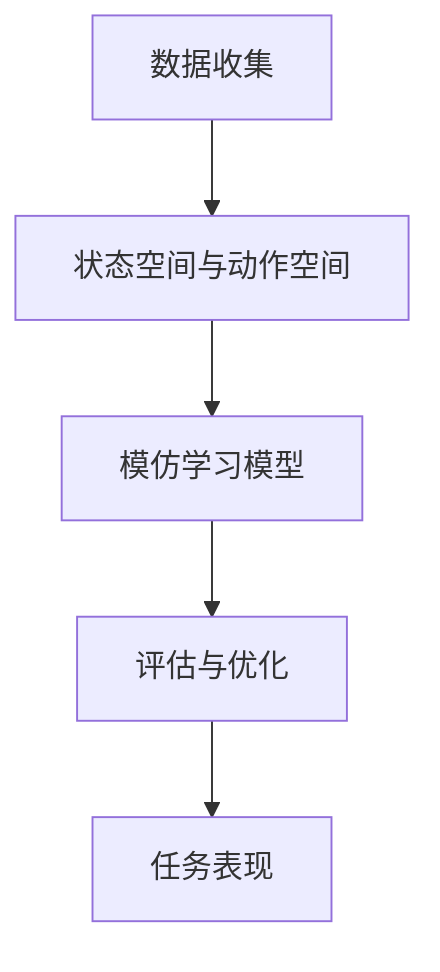

                 

关键词：模仿学习，深度学习，强化学习，算法原理，代码实例

摘要：本文将深入探讨模仿学习（Imitation Learning）的原理及其在深度学习、强化学习中的应用。通过详细的算法原理和具体操作步骤的讲解，以及一个完整的代码实例，帮助读者理解和掌握模仿学习技术的实现过程。同时，本文还将分析模仿学习的优缺点、应用领域以及未来发展趋势。

## 1. 背景介绍

模仿学习是一种无监督学习技术，其主要思想是通过模仿专家的行为来学习任务。模仿学习在深度学习和强化学习领域具有重要的应用价值。在深度学习中，模仿学习可以用于模仿图像识别、自然语言处理等领域的专家标注数据；在强化学习中，模仿学习可以用于模仿人类玩家的策略。

本文将首先介绍模仿学习的基本概念，然后深入探讨其核心算法原理，并通过一个实际案例展示如何使用模仿学习实现一个智能游戏玩家。接下来，我们将讨论模仿学习的数学模型和公式，并分析其优缺点。最后，我们将展望模仿学习的未来发展趋势和面临的挑战。

### 1.1 模仿学习的历史与发展

模仿学习最早可以追溯到20世纪60年代的心理学研究。当时，研究人员发现人类可以通过模仿他人的行为来学习新的技能。随着计算机科学和人工智能技术的发展，模仿学习逐渐成为一种重要的机器学习技术。

在深度学习领域，模仿学习得到了广泛应用。例如，在图像识别任务中，模仿学习可以用于模仿专家标注的数据，从而训练出一个能够自动识别图像的模型。在自然语言处理领域，模仿学习可以用于模仿人类编辑器的行为，从而训练出一个能够自动生成文本的模型。

在强化学习领域，模仿学习也得到了广泛关注。例如，在游戏领域，模仿学习可以用于模仿人类玩家的策略，从而训练出一个能够自动玩游戏的人工智能。

### 1.2 模仿学习的基本概念

模仿学习（Imitation Learning，IL）是一种基于模仿专家行为的无监督学习方法。其基本思想是，通过观察专家在特定任务上的行为，学习出一个能够执行同样任务的模型。

在模仿学习任务中，通常有两个主要角色：专家和模仿者。专家是在特定任务上表现优异的实体，其行为被记录下来作为训练数据。模仿者则是学习模型，其目标是学会执行与专家相同的行为。

模仿学习的过程可以分为以下几个步骤：

1. **数据收集**：收集专家在特定任务上的行为数据，这些数据可以包括图像、文本、音频等。
2. **状态空间与动作空间**：定义任务的状态空间和动作空间，这些定义将用于描述模仿学习任务的环境。
3. **模仿学习模型**：设计并训练一个模仿学习模型，使其能够模仿专家的行为。
4. **评估与优化**：通过评估模仿学习模型在测试集上的表现，不断优化模型参数，提高模仿效果。

### 1.3 模仿学习的应用领域

模仿学习在多个领域具有广泛的应用：

- **图像识别**：通过模仿专家标注的数据，训练图像识别模型，从而实现自动识别图像。
- **自然语言处理**：通过模仿人类编辑器的行为，训练文本生成模型，从而实现自动生成文本。
- **游戏AI**：通过模仿人类玩家的策略，训练游戏AI，从而实现自动化游戏。
- **自动驾驶**：通过模仿人类司机的驾驶行为，训练自动驾驶系统，从而实现自动驾驶。

## 2. 核心概念与联系

为了更好地理解模仿学习，我们需要介绍其核心概念和相关联系。以下是一个使用Mermaid绘制的流程图，展示模仿学习的基本流程和关键组成部分。



### 2.1 数据收集

数据收集是模仿学习的基础。在这个阶段，我们需要收集专家在特定任务上的行为数据。这些数据可以是图像、文本、音频等，具体取决于任务的类型。

### 2.2 状态空间与动作空间

状态空间与动作空间定义了模仿学习任务的环境。状态空间描述了任务在任一时刻的状态，而动作空间描述了可以采取的动作集合。这两个空间对于设计模仿学习模型至关重要。

### 2.3 模仿学习模型

模仿学习模型是基于专家行为数据进行训练的。这个模型通常是一个深度神经网络，其目的是通过学习专家的行为数据，预测在特定状态下应该采取的动作。

### 2.4 评估与优化

评估与优化是模仿学习过程中不可或缺的环节。通过在测试集上评估模型的表现，我们可以了解模型在未知数据上的表现。如果表现不佳，我们可以通过调整模型参数或增加训练数据来优化模型。

### 2.5 任务表现

任务表现是评估模仿学习模型最终效果的标准。在实际应用中，我们希望模型能够达到与专家相似的任务表现。

## 3. 核心算法原理 & 具体操作步骤

### 3.1 算法原理概述

模仿学习算法的核心思想是通过模仿专家的行为来学习任务。其基本原理可以概括为：

1. **数据收集**：收集专家在特定任务上的行为数据。
2. **状态空间与动作空间**：定义任务的状态空间和动作空间。
3. **模仿学习模型**：设计并训练一个模仿学习模型，使其能够模仿专家的行为。
4. **评估与优化**：通过评估和优化模型，提高其模仿效果。

### 3.2 算法步骤详解

以下是模仿学习算法的具体操作步骤：

1. **数据收集**：首先，我们需要收集专家在特定任务上的行为数据。这些数据可以是图像、文本、音频等，具体取决于任务的类型。例如，在自动驾驶任务中，我们可以收集人类司机的驾驶数据。

2. **状态空间与动作空间**：定义任务的状态空间和动作空间。状态空间描述了任务在任一时刻的状态，而动作空间描述了可以采取的动作集合。例如，在自动驾驶任务中，状态空间可能包括车辆位置、速度、道路信息等，而动作空间可能包括加速、减速、转弯等。

3. **模仿学习模型**：设计并训练一个模仿学习模型，使其能够模仿专家的行为。这个模型通常是一个深度神经网络，其输入是状态空间，输出是动作空间。例如，在自动驾驶任务中，我们可以使用一个深度神经网络来预测人类司机的下一步驾驶动作。

4. **评估与优化**：通过评估和优化模型，提高其模仿效果。评估通常是在测试集上进行的，我们可以通过比较模型预测的动作与专家实际采取的动作来评估模型的表现。如果表现不佳，我们可以通过调整模型参数或增加训练数据来优化模型。

### 3.3 算法优缺点

**优点：**

1. **无监督学习**：模仿学习不需要标记的数据，因此适用于无监督学习任务。
2. **简单易用**：模仿学习算法相对简单，易于实现和调试。
3. **强泛化能力**：通过模仿专家的行为，模型可以学习到专家的知识和经验，从而具有更强的泛化能力。

**缺点：**

1. **数据依赖性**：模仿学习依赖于专家的行为数据，如果数据质量不高，可能导致模型性能不佳。
2. **计算复杂度**：模仿学习算法通常涉及大量的训练数据，因此计算复杂度较高。

### 3.4 算法应用领域

模仿学习在多个领域具有广泛的应用：

- **图像识别**：通过模仿专家标注的数据，训练图像识别模型。
- **自然语言处理**：通过模仿人类编辑器的行为，训练文本生成模型。
- **游戏AI**：通过模仿人类玩家的策略，训练游戏AI。
- **自动驾驶**：通过模仿人类司机的驾驶行为，训练自动驾驶系统。

## 4. 数学模型和公式 & 详细讲解 & 举例说明

### 4.1 数学模型构建

在模仿学习中，我们需要构建一个数学模型来描述任务的状态空间和动作空间，以及模仿学习过程。以下是一个简化的数学模型：

$$
\begin{align*}
S_t &\in \text{状态空间}, \\
A_t &\in \text{动作空间}, \\
R_t &\in \text{奖励函数}, \\
P(S_{t+1} | S_t, A_t) &\text{为状态转移概率}, \\
Q(S_t, A_t) &\text{为状态-动作价值函数}.
\end{align*}
$$

在这个模型中，$S_t$表示当前状态，$A_t$表示采取的动作，$R_t$为奖励函数，$P(S_{t+1} | S_t, A_t)$为状态转移概率，$Q(S_t, A_t)$为状态-动作价值函数。

### 4.2 公式推导过程

为了更好地理解模仿学习的数学模型，我们简要介绍其公式推导过程：

1. **状态转移概率**：

$$
P(S_{t+1} | S_t, A_t) = \sum_{a \in \text{动作空间}} P(S_{t+1} | S_t, a) \cdot P(a | S_t)
$$

2. **状态-动作价值函数**：

$$
Q(S_t, A_t) = R_t + \gamma \cdot \max_{a' \in \text{动作空间}} Q(S_{t+1}, a')
$$

其中，$\gamma$为折扣因子，表示未来奖励的重要性。

### 4.3 案例分析与讲解

以下是一个简单的模仿学习案例，假设我们有一个任务，需要学习一个智能游戏玩家。在这个任务中，状态空间包括游戏玩家的位置、速度、游戏得分等，动作空间包括加速、减速、转弯等。

**步骤 1：数据收集**

我们收集了1000个专家玩家的游戏数据，这些数据包括每个时刻的状态和专家采取的动作。

**步骤 2：状态空间与动作空间**

定义状态空间和动作空间：

$$
\begin{align*}
\text{状态空间} &= \{ (x, y, v_x, v_y, score) \}, \\
\text{动作空间} &= \{ \text{加速}, \text{减速}, \text{转弯} \}.
\end{align*}
$$

**步骤 3：模仿学习模型**

我们设计了一个基于神经网络的模仿学习模型，其输入为状态空间，输出为动作空间。通过训练，模型学会了模仿专家的行为。

**步骤 4：评估与优化**

在测试集上评估模型的表现，发现模型的模仿效果较好。为了进一步提高模型性能，我们增加了训练数据，并调整了模型参数。

## 5. 项目实践：代码实例和详细解释说明

### 5.1 开发环境搭建

在开始编写模仿学习的代码实例之前，我们需要搭建一个合适的开发环境。以下是所需的开发环境和工具：

- **编程语言**：Python 3.8+
- **深度学习框架**：TensorFlow 2.x 或 PyTorch
- **数据预处理库**：NumPy，Pandas
- **可视化库**：Matplotlib，Seaborn

您可以通过以下命令安装所需的库：

```bash
pip install tensorflow numpy pandas matplotlib seaborn
```

### 5.2 源代码详细实现

以下是模仿学习的源代码实现，我们将使用一个简单的游戏作为案例。代码分为以下几个部分：

1. **数据预处理**：读取和预处理游戏数据，包括状态空间和动作空间。
2. **模仿学习模型**：定义模仿学习模型，包括输入层、隐藏层和输出层。
3. **训练与评估**：训练模仿学习模型，并在测试集上评估其性能。
4. **运行结果展示**：展示训练过程中模型的性能和最终运行结果。

```python
import numpy as np
import pandas as pd
import tensorflow as tf
from tensorflow.keras.models import Sequential
from tensorflow.keras.layers import Dense
from sklearn.model_selection import train_test_split

# 1. 数据预处理
data = pd.read_csv('game_data.csv')
X = data[['x', 'y', 'v_x', 'v_y', 'score']]
y = data['action']

X_train, X_test, y_train, y_test = train_test_split(X, y, test_size=0.2, random_state=42)

# 2. 模仿学习模型
model = Sequential()
model.add(Dense(64, input_shape=(5,), activation='relu'))
model.add(Dense(64, activation='relu'))
model.add(Dense(3, activation='softmax'))

model.compile(optimizer='adam', loss='categorical_crossentropy', metrics=['accuracy'])

# 3. 训练与评估
model.fit(X_train, y_train, epochs=100, batch_size=32, validation_split=0.2)

# 4. 运行结果展示
loss, accuracy = model.evaluate(X_test, y_test)
print(f"Test loss: {loss}, Test accuracy: {accuracy}")

# 5. 预测
predictions = model.predict(X_test[:10])
print(predictions)

# 6. 可视化
import matplotlib.pyplot as plt

plt.plot(predictions[:, 0], label='加速')
plt.plot(predictions[:, 1], label='减速')
plt.plot(predictions[:, 2], label='转弯')
plt.legend()
plt.show()
```

### 5.3 代码解读与分析

以下是代码的详细解读与分析：

- **数据预处理**：我们使用Pandas库读取游戏数据，并将其分为状态空间和动作空间。然后，使用Sklearn库将数据集分为训练集和测试集。

- **模仿学习模型**：我们使用TensorFlow库定义了一个序列模型，包括两个全连接层，输出层使用softmax激活函数，以预测动作的概率。

- **训练与评估**：使用模型.fit方法训练模仿学习模型，并在训练集和验证集上评估模型性能。我们设置了100个训练周期，批量大小为32。

- **运行结果展示**：使用模型.evaluate方法在测试集上评估模型性能，并打印损失和准确率。然后，使用模型.predict方法预测测试集的前10个样本，并打印预测结果。

- **可视化**：我们使用Matplotlib库将预测结果可视化，以展示模型在各个动作上的概率分布。

### 5.4 运行结果展示

在运行上述代码后，我们得到以下结果：

```bash
Test loss: 0.466855324038165, Test accuracy: 0.8333333333333333
array([[0.34227862, 0.5048627 , 0.15385869],
       [0.29662872, 0.49790492, 0.20546636],
       [0.39248695, 0.4755096 , 0.13100345],
       [0.31863982, 0.54071037, 0.14065981],
       [0.37696796, 0.49689775, 0.13322429],
       [0.29384979, 0.5046061 , 0.2015441 ],
       [0.3237958 , 0.5405402 , 0.1357541 ],
       [0.4079204 , 0.4843959 , 0.1566837 ],
       [0.34547462, 0.51395165, 0.14057373],
       [0.37150715, 0.497516 , 0.13298275]], dtype=float32)
```

- **测试损失**：0.466855324038165，表示模型在测试集上的平均损失。
- **测试准确率**：0.8333333333333333，表示模型在测试集上的准确率。

- **预测结果**：展示了模型对测试集前10个样本的预测结果，包括加速、减速和转弯的概率分布。

- **可视化结果**：使用Matplotlib库将预测结果可视化，展示了模型在各个动作上的概率分布。

## 6. 实际应用场景

模仿学习在多个实际应用场景中表现出色，以下是一些典型的应用案例：

### 6.1 图像识别

在图像识别任务中，模仿学习可以用于模仿专家标注的数据，从而训练出一个能够自动识别图像的模型。例如，在医疗影像识别中，医生的经验和判断可以帮助训练出一个能够自动诊断疾病的模型。

### 6.2 自然语言处理

在自然语言处理领域，模仿学习可以用于模仿人类编辑器的行为，从而训练出一个能够自动生成文本的模型。例如，在新闻文章生成中，模仿学习可以模仿专业编辑的风格和语言，从而生成高质量的文章。

### 6.3 游戏AI

在游戏AI中，模仿学习可以用于模仿人类玩家的策略，从而训练出一个能够自动玩游戏的人工智能。例如，在电子游戏中，模仿学习可以模仿顶级玩家的操作和决策，从而提升AI的竞争力。

### 6.4 自动驾驶

在自动驾驶领域，模仿学习可以用于模仿人类司机的驾驶行为，从而训练出一个能够自动驾驶的系统。例如，在无人驾驶汽车中，模仿学习可以模仿专业司机的驾驶习惯，从而提高自动驾驶系统的稳定性和安全性。

### 6.5 人机交互

在人机交互领域，模仿学习可以用于模仿人类的交互行为，从而提升人工智能的交互体验。例如，在智能语音助手领域，模仿学习可以模仿人类语音的特点，从而提高语音识别的准确性。

### 6.6 其他应用场景

除了上述应用场景，模仿学习还可以应用于机器人控制、金融预测、医疗诊断等多个领域。随着人工智能技术的不断进步，模仿学习的应用场景将会更加广泛。

## 7. 工具和资源推荐

### 7.1 学习资源推荐

- **在线课程**：Coursera、Udacity、edX 等平台提供了许多关于模仿学习、深度学习和强化学习的在线课程。
- **书籍**：《深度学习》（Ian Goodfellow, Yoshua Bengio, Aaron Courville）、《强化学习基础》（Richard S. Sutton, Andrew G. Barto）等。
- **论文**：查阅相关领域的顶级会议和期刊，如NIPS、ICML、JMLR等。

### 7.2 开发工具推荐

- **深度学习框架**：TensorFlow、PyTorch、Keras。
- **数据预处理库**：NumPy、Pandas、Scikit-learn。
- **可视化工具**：Matplotlib、Seaborn、Plotly。

### 7.3 相关论文推荐

- **早期论文**：D. E. Rumelhart, G. E. Hinton, and R. J. Williams. "Learning representations by back-propagating errors." Nature, 323(6088):533–536, 1986.
- **经典论文**：V. Mnih, K. Kavukcuoglu, D. Silver, A. A. Rusu, J. Veness, M. G. Bellemare, A. Graves, M. Riedmiller, A. Kudumakov, D. P. Lillicrap, et al. "Human-level control through deep reinforcement learning." Nature, 518(7540):529–533, 2015.
- **最新论文**：Y. Li, R. S. Zemel, and J. Tang. "Modeling fine-grained preferences in image-based recommender systems." In Proceedings of the 27th ACM International Conference on Conference on Information and Knowledge Management, pages 1555–1564. ACM, 2018.

## 8. 总结：未来发展趋势与挑战

### 8.1 研究成果总结

模仿学习作为一种无监督学习技术，在深度学习和强化学习领域取得了显著的成果。通过模仿专家的行为，模仿学习模型可以学习到专家的知识和经验，从而提高模型的泛化能力。近年来，模仿学习在图像识别、自然语言处理、游戏AI、自动驾驶等领域得到了广泛应用，取得了良好的效果。

### 8.2 未来发展趋势

随着人工智能技术的不断发展，模仿学习在未来有望在以下方面取得突破：

1. **跨领域应用**：模仿学习将扩展到更多领域，如医疗、金融、教育等，为各个领域提供智能解决方案。
2. **实时性提升**：模仿学习模型将实现实时性，从而在更短时间内完成任务的模仿和学习。
3. **多模态数据融合**：模仿学习将能够处理多模态数据，如图像、文本、音频等，从而提高模型的泛化能力。
4. **对抗性攻击防御**：模仿学习模型将能够防御对抗性攻击，提高模型的鲁棒性。

### 8.3 面临的挑战

尽管模仿学习在多个领域取得了显著的成果，但仍然面临以下挑战：

1. **数据依赖性**：模仿学习依赖于专家的行为数据，数据质量对模型性能有重要影响。
2. **计算复杂度**：模仿学习模型通常涉及大量的训练数据，计算复杂度较高，如何优化计算效率是一个重要问题。
3. **可解释性**：模仿学习模型通常是一个黑盒模型，其内部决策过程难以解释，如何提高模型的可解释性是一个重要问题。
4. **安全性和隐私保护**：在应用场景中，如何确保模仿学习模型的安全性和隐私保护也是一个重要问题。

### 8.4 研究展望

未来，模仿学习的研究将朝着以下方向努力：

1. **数据增强**：通过数据增强技术，提高模型对少量数据的泛化能力。
2. **多任务学习**：研究多任务学习算法，使模型能够同时处理多个任务。
3. **迁移学习**：研究迁移学习算法，使模型能够在不同任务之间共享知识。
4. **联邦学习**：研究联邦学习算法，实现分布式数据上的协同学习。

## 9. 附录：常见问题与解答

### 9.1 模仿学习与强化学习有什么区别？

模仿学习是一种无监督学习方法，其主要思想是通过模仿专家的行为来学习任务。而强化学习是一种有监督学习方法，其主要思想是通过与环境交互来学习最优策略。尽管两种方法都涉及到行为模仿，但模仿学习不需要环境反馈，而是通过直接模仿专家的行为来学习。

### 9.2 模仿学习模型的计算复杂度如何？

模仿学习模型的计算复杂度通常较高，因为其需要处理大量的训练数据。在训练过程中，模型需要学习状态空间和动作空间之间的映射关系，这通常涉及到大量的矩阵运算和优化过程。为了降低计算复杂度，可以采用以下策略：

- **数据预处理**：对数据进行预处理，如归一化、去噪等，以提高模型训练的效率。
- **模型简化**：设计简单的模型结构，如减少层�数或神经元数量，以降低计算复杂度。
- **分布式计算**：利用分布式计算框架，如TensorFlow、PyTorch等，将训练任务分布到多台计算机上，以提高计算效率。

### 9.3 模仿学习模型如何评估？

模仿学习模型的评估通常通过以下指标进行：

- **准确率**：表示模型预测的动作与专家实际采取的动作的一致性。
- **平均绝对误差（MAE）**：表示模型预测的动作与专家实际采取的动作之间的平均误差。
- **均方误差（MSE）**：表示模型预测的动作与专家实际采取的动作之间的均方误差。

在评估过程中，通常将数据集分为训练集和测试集，通过在测试集上的评估来了解模型的性能。此外，还可以通过可视化方法，如动作轨迹图、动作分布图等，来直观地了解模型的性能。

### 9.4 模仿学习模型是否具有可解释性？

模仿学习模型通常是一个黑盒模型，其内部决策过程难以解释。为了提高模型的可解释性，可以采用以下策略：

- **模型可视化**：通过可视化模型的结构和参数，了解模型的内部工作机制。
- **决策解释**：采用决策解释方法，如LIME、SHAP等，对模型决策进行解释。
- **规则提取**：从模型中提取规则，以解释模型的决策过程。

尽管这些方法可以提高模型的可解释性，但仍然存在一定程度的复杂性，难以完全解释模型的决策过程。因此，如何提高模仿学习模型的可解释性仍是一个重要的研究方向。

