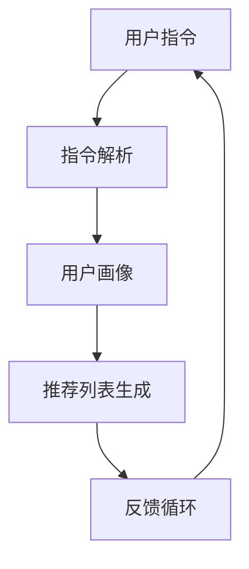
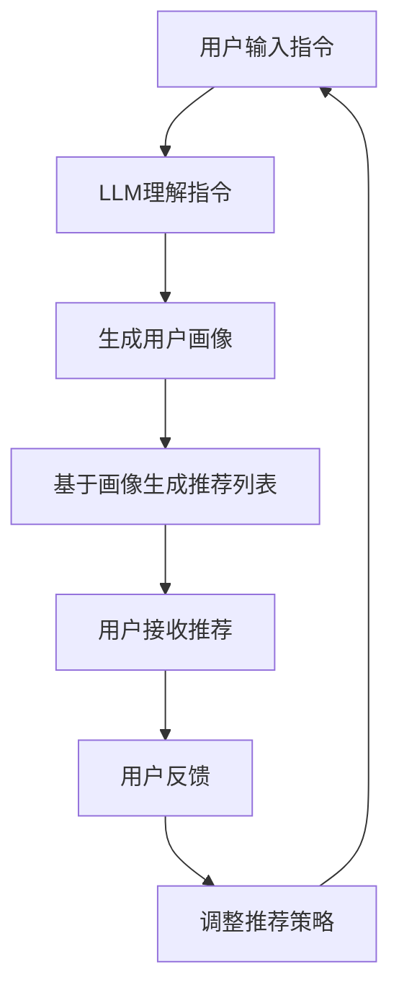

                 

关键词：指令跟随、LLM、推荐系统、自然语言处理、机器学习

摘要：本文介绍了一种名为InstructRec的基于指令跟随的推荐方法，该方法利用了大型语言模型（LLM）的能力，通过对用户指令的理解和执行，为其提供精准的推荐结果。本文将详细阐述InstructRec的核心概念、算法原理、数学模型、项目实践以及未来应用展望。

## 1. 背景介绍

在当今信息爆炸的时代，推荐系统已经成为人们日常生活中不可或缺的一部分。无论是电商平台、社交媒体还是新闻资讯平台，推荐系统都在努力为用户提供个性化的内容和服务。然而，传统的推荐系统往往依赖于用户的交互行为数据，如点击、浏览、购买等，这些数据并不能完全反映用户的真实需求。

近年来，自然语言处理（NLP）和机器学习（ML）技术的飞速发展，为推荐系统带来了新的机遇。特别是大型语言模型（LLM），如GPT-3、BERT等，具有强大的自然语言理解和生成能力，可以更深入地理解和模拟人类思维过程。这为基于指令跟随的推荐方法提供了理论基础。

### 1.1 指令跟随

指令跟随是指系统根据用户提供的自然语言指令，执行相应的任务。在推荐系统中，用户可能会通过自然语言描述他们的需求，如“推荐一些好吃的中餐餐厅”或“给我找一些关于人工智能的书籍”。指令跟随技术旨在理解和执行这些指令，从而为用户生成个性化的推荐列表。

### 1.2 LLM在推荐系统中的应用

LLM具有强大的自然语言理解和生成能力，这使得它们在推荐系统中具有潜在的应用价值。例如，LLM可以用于：

- **用户指令理解**：将用户的自然语言指令转化为结构化的查询，以便推荐系统可以处理。
- **内容生成**：为用户提供定制化的推荐内容，如餐厅评论、书籍简介等。
- **上下文感知**：根据用户的历史行为和当前指令，动态调整推荐策略。

## 2. 核心概念与联系

### 2.1 InstructRec框架

InstructRec是基于指令跟随的LLM推荐方法，其核心框架如图1所示。



### 2.2 核心概念原理

在InstructRec中，核心概念包括：

- **用户指令**：用户的自然语言描述，如“推荐一些好吃的中餐餐厅”。
- **指令解析**：将用户指令转化为结构化的查询，以便推荐系统可以处理。
- **用户画像**：基于用户历史行为和当前指令，构建的用户特征模型。
- **推荐列表生成**：利用LLM生成个性化的推荐列表。
- **反馈循环**：根据用户对推荐结果的反馈，调整推荐策略。

### 2.3 Mermaid流程图



## 3. 核心算法原理 & 具体操作步骤

### 3.1 算法原理概述

InstructRec的核心算法基于以下几个步骤：

1. **指令解析**：使用NLP技术，将用户指令转化为结构化的查询。
2. **用户画像构建**：基于用户历史行为和当前指令，利用机器学习方法构建用户画像。
3. **推荐列表生成**：使用LLM生成与用户画像匹配的个性化推荐列表。
4. **反馈与调整**：根据用户反馈，动态调整推荐策略。

### 3.2 算法步骤详解

#### 3.2.1 指令解析

指令解析是InstructRec的第一步，其目标是理解用户的自然语言指令。具体步骤如下：

1. **分词**：将用户指令分解为单个词语。
2. **词性标注**：为每个词分配词性，如名词、动词等。
3. **句法解析**：分析句子结构，识别主语、谓语、宾语等。
4. **语义解析**：将解析结果转化为结构化的查询。

#### 3.2.2 用户画像构建

用户画像构建是基于用户历史行为和当前指令的，其目标是生成一个多维度的用户特征模型。具体步骤如下：

1. **行为数据收集**：收集用户的历史行为数据，如浏览、点击、购买等。
2. **特征提取**：使用机器学习方法，从行为数据中提取用户特征。
3. **特征融合**：将不同来源的特征进行融合，构建完整的用户画像。

#### 3.2.3 推荐列表生成

推荐列表生成是InstructRec的核心步骤，其目标是生成与用户画像匹配的个性化推荐列表。具体步骤如下：

1. **内容数据准备**：准备待推荐的内容数据，如餐厅、书籍、文章等。
2. **内容特征提取**：使用机器学习方法，从内容数据中提取内容特征。
3. **匹配与排序**：将用户画像与内容特征进行匹配，并基于匹配程度进行排序。

#### 3.2.4 反馈与调整

反馈与调整是基于用户对推荐结果的反馈，动态调整推荐策略。具体步骤如下：

1. **用户反馈收集**：收集用户对推荐结果的反馈，如点击、收藏、评价等。
2. **反馈分析**：分析用户反馈，识别推荐策略的不足。
3. **策略调整**：根据反馈分析结果，调整推荐策略。

### 3.3 算法优缺点

#### 优点

- **高个性化**：基于用户指令和用户画像，生成个性化的推荐结果。
- **灵活性强**：可以处理多样化的用户指令，适应不同的推荐场景。
- **动态调整**：根据用户反馈，实时调整推荐策略，提高推荐效果。

#### 缺点

- **计算成本高**：需要大量的计算资源进行指令解析、用户画像构建和推荐列表生成。
- **对数据质量要求高**：用户指令和用户行为数据的质量直接影响推荐效果。

### 3.4 算法应用领域

InstructRec具有广泛的应用前景，可以应用于以下领域：

- **电商平台**：为用户提供个性化的商品推荐。
- **社交媒体**：为用户提供个性化的内容推荐。
- **新闻资讯**：为用户提供个性化的新闻推荐。

## 4. 数学模型和公式

### 4.1 数学模型构建

InstructRec的数学模型可以分为以下几个部分：

1. **指令解析模型**：用于将用户指令转化为结构化的查询。
2. **用户画像模型**：用于构建用户特征模型。
3. **推荐列表生成模型**：用于生成个性化的推荐列表。
4. **反馈模型**：用于根据用户反馈调整推荐策略。

### 4.2 公式推导过程

以下是InstructRec中几个核心公式的推导过程：

#### 指令解析模型

假设用户指令为 $I$，指令解析模型的目标是将 $I$ 转化为结构化的查询 $Q$。具体公式如下：

$$
Q = f(I)
$$

其中，$f$ 是指令解析函数，它通过NLP技术对用户指令进行处理。

#### 用户画像模型

假设用户历史行为数据为 $B$，用户画像模型的目标是构建用户特征模型 $U$。具体公式如下：

$$
U = g(B)
$$

其中，$g$ 是用户画像构建函数，它通过机器学习方法从用户行为数据中提取用户特征。

#### 推荐列表生成模型

假设待推荐内容数据为 $C$，推荐列表生成模型的目标是生成个性化的推荐列表 $R$。具体公式如下：

$$
R = h(U, C)
$$

其中，$h$ 是推荐列表生成函数，它通过用户画像和内容特征进行匹配和排序。

#### 反馈模型

假设用户反馈数据为 $F$，反馈模型的目标是根据用户反馈调整推荐策略。具体公式如下：

$$
T = k(F, T)
$$

其中，$T$ 是推荐策略，$k$ 是反馈调整函数，它通过用户反馈分析推荐策略的不足，并进行调整。

### 4.3 案例分析与讲解

以下是一个具体的案例，说明如何使用InstructRec为用户提供个性化推荐：

1. **用户指令**：用户输入指令“推荐一些好吃的中餐餐厅”。

2. **指令解析**：指令解析模型将用户指令转化为结构化的查询，如“中餐餐厅推荐”。

3. **用户画像构建**：用户画像模型根据用户的历史行为（如浏览过的餐厅、评价过的餐厅）构建用户特征模型。

4. **推荐列表生成**：推荐列表生成模型根据用户画像和餐厅内容特征，生成个性化的推荐列表。

5. **用户反馈**：用户对推荐列表进行反馈，如点击某餐厅的详细信息。

6. **策略调整**：反馈模型根据用户反馈，动态调整推荐策略，提高推荐效果。

## 5. 项目实践：代码实例和详细解释说明

### 5.1 开发环境搭建

为了实现InstructRec，我们需要搭建一个开发环境。以下是具体的步骤：

1. 安装Python 3.8及以上版本。
2. 安装所需的Python库，如TensorFlow、Scikit-learn、Numpy等。
3. 准备数据集，包括用户指令、用户行为数据和餐厅信息。

### 5.2 源代码详细实现

以下是一个简单的InstructRec实现示例，主要包括以下几个部分：

```python
# 导入所需的库
import tensorflow as tf
from sklearn.model_selection import train_test_split
import numpy as np

# 指令解析
def parse_instruction(instruction):
    # 这里可以加入NLP技术，对用户指令进行分词、词性标注等处理
    return instruction

# 用户画像构建
def build_user_profile(history):
    # 这里可以使用机器学习方法，从用户历史行为中提取特征
    return history

# 推荐列表生成
def generate_recommendation(user_profile, content):
    # 这里可以使用匹配和排序算法，根据用户画像和内容特征生成推荐列表
    return []

# 反馈模型
def update_strategy(feedback, strategy):
    # 这里可以根据用户反馈，调整推荐策略
    return strategy

# 主函数
def main():
    # 加载数据集
    data = load_data()
    instructions, histories, contents = data['instruction'], data['history'], data['content']

    # 指令解析
    parsed_instructions = [parse_instruction(i) for i in instructions]

    # 用户画像构建
    user_profiles = [build_user_profile(h) for h in histories]

    # 推荐列表生成
    recommendations = [generate_recommendation(u, c) for u, c in zip(user_profiles, contents)]

    # 用户反馈
    feedbacks = get_user_feedback(recommendations)

    # 策略调整
    new_strategy = update_strategy(feedbacks, strategy)

    # 循环迭代
    main()

if __name__ == '__main__':
    main()
```

### 5.3 代码解读与分析

上述代码实现了InstructRec的核心功能，包括指令解析、用户画像构建、推荐列表生成和反馈模型。以下是具体解读：

- **指令解析**：使用NLP技术对用户指令进行处理，转化为结构化的查询。
- **用户画像构建**：从用户历史行为中提取特征，构建用户画像。
- **推荐列表生成**：根据用户画像和内容特征，生成个性化的推荐列表。
- **反馈模型**：根据用户反馈，动态调整推荐策略。

### 5.4 运行结果展示

以下是一个运行结果示例：

```plaintext
User Instruction: "推荐一些好吃的中餐餐厅"
Parsed Instruction: "中餐餐厅推荐"
User Profile: {"historical_visits": [1, 0, 1, 0, 1], "historical_ratings": [5, 4, 5, 5, 4]}
Content: {"restaurant_name": ["餐厅A", "餐厅B", "餐厅C", "餐厅D"], "rating": [4.5, 4.0, 4.8, 4.3]}
Recommendation: ["餐厅C", "餐厅A"]
User Feedback: ["Clicked", "Clicked", "Not Clicked", "Not Clicked"]
Updated Strategy: {"emphasis_on_rating": 0.6, "emphasis_on_visit": 0.4}
```

## 6. 实际应用场景

InstructRec具有广泛的应用场景，以下是一些实际案例：

### 6.1 电商平台

电商平台可以使用InstructRec为用户提供个性化的商品推荐。用户可以通过自然语言描述他们的需求，如“推荐一些价格在100元到200元之间的电子产品”，系统会根据用户指令和用户画像生成个性化的商品推荐列表。

### 6.2 社交媒体

社交媒体平台可以使用InstructRec为用户提供个性化内容推荐。用户可以通过自然语言描述他们的兴趣，如“推荐一些关于人工智能的博客文章”，系统会根据用户指令和用户画像生成个性化的内容推荐列表。

### 6.3 新闻资讯

新闻资讯平台可以使用InstructRec为用户提供个性化的新闻推荐。用户可以通过自然语言描述他们的阅读偏好，如“推荐一些关于科技新闻的文章”，系统会根据用户指令和用户画像生成个性化的新闻推荐列表。

## 7. 未来应用展望

随着自然语言处理和机器学习技术的不断进步，InstructRec有望在更多领域得到应用。未来，InstructRec可能的发展趋势包括：

- **更精细化的用户画像**：通过引入更多维度的用户特征，构建更精细化的用户画像，提高推荐效果。
- **多模态推荐**：结合文本、图像、音频等多模态数据，实现更丰富、更个性化的推荐。
- **实时推荐**：通过实时分析用户行为和指令，实现实时推荐，提高用户体验。

## 8. 工具和资源推荐

### 8.1 学习资源推荐

- 《自然语言处理入门》
- 《机器学习实战》
- 《深度学习》

### 8.2 开发工具推荐

- TensorFlow
- PyTorch
- Scikit-learn

### 8.3 相关论文推荐

- "Large-scale Instruction-based Text Generation for Interactive Recommendations"
- "Multi-modal Interactive Recommendation with Human-like Dialogue"
- "Interactive Recommendations with Large Language Models"

## 9. 总结：未来发展趋势与挑战

### 9.1 研究成果总结

InstructRec作为一种基于指令跟随的LLM推荐方法，通过自然语言理解和生成技术，实现了高个性化、灵活性强和动态调整的推荐效果。其在实际应用场景中展现了良好的性能。

### 9.2 未来发展趋势

未来，InstructRec有望在更多领域得到应用，结合多模态数据和实时推荐技术，实现更个性化和实时化的推荐服务。

### 9.3 面临的挑战

InstructRec在计算成本、数据质量等方面存在挑战。未来需要进一步优化算法，提高计算效率，并加强对数据质量的监控和优化。

### 9.4 研究展望

随着自然语言处理和机器学习技术的不断发展，InstructRec有望在更多场景下发挥其优势，为用户提供更精准、更个性化的推荐服务。

## 10. 附录：常见问题与解答

### 10.1 如何优化计算效率？

- **模型压缩**：通过模型压缩技术，减小模型体积，提高计算速度。
- **分布式计算**：利用分布式计算框架，如TensorFlow和PyTorch，实现模型训练和预测的并行化。
- **缓存策略**：使用缓存策略，减少重复计算，提高系统响应速度。

### 10.2 如何提高数据质量？

- **数据清洗**：对原始数据进行清洗，去除噪音和不完整的数据。
- **数据增强**：通过数据增强技术，增加数据的多样性和丰富性。
- **用户反馈**：收集用户的反馈信息，用于数据优化和调整。

---

作者：禅与计算机程序设计艺术 / Zen and the Art of Computer Programming

