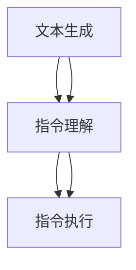

                 

关键词：自然语言处理，指令表达，文本生成，机器学习，算法优化，应用场景

> 摘要：自然语言处理（NLP）是人工智能领域的重要分支，其目标是将人类语言转换为计算机可以理解和处理的形式。本文旨在探讨自然语言指令表达（InstructRec）的研究与应用，通过深入分析其核心概念、算法原理、数学模型和实际应用，为读者提供对这一领域的全面了解。

## 1. 背景介绍

随着互联网的飞速发展，人类对信息的获取和处理需求日益增长。自然语言处理作为人工智能的核心技术之一，正逐步改变我们的生活方式。自然语言指令表达是NLP中的一个重要研究方向，它旨在理解和执行人类以自然语言形式表达的指令。

在过去的几十年里，自然语言处理取得了显著的进展，包括文本分类、情感分析、机器翻译等。然而，如何有效地理解和执行复杂的自然语言指令，仍然是一个具有挑战性的问题。本文将介绍一种基于机器学习的自然语言指令表达方法，即InstructRec，并探讨其在实际应用中的潜在价值。

## 2. 核心概念与联系

### 2.1 核心概念

自然语言指令表达涉及多个核心概念，包括文本生成、指令理解和执行等。

1. **文本生成**：文本生成是指利用算法自动生成符合语法和语义规则的文本。在自然语言指令表达中，文本生成用于生成与指令相对应的文本描述。
   
2. **指令理解**：指令理解是指计算机从自然语言指令中提取关键信息，理解指令的含义和执行方式。指令理解是自然语言指令表达的关键步骤。

3. **指令执行**：指令执行是指计算机根据指令理解的结果，执行相应的操作或任务。指令执行是自然语言指令表达的目标。

### 2.2 概念联系

InstructRec方法通过将文本生成、指令理解和指令执行相结合，实现了自然语言指令的高效表达。具体来说，InstructRec方法的工作流程如下：

1. **文本生成**：首先，利用预训练的文本生成模型（如GPT-3）生成与指令相关的文本描述。
2. **指令理解**：其次，对生成的文本描述进行解析，提取关键信息，理解指令的含义。
3. **指令执行**：最后，根据指令理解的结果，执行相应的操作或任务。

### 2.3 Mermaid 流程图

以下是InstructRec方法的Mermaid流程图：



## 3. 核心算法原理 & 具体操作步骤

### 3.1 算法原理概述

InstructRec方法基于机器学习，利用预训练的文本生成模型和指令理解模型，实现了自然语言指令的高效表达。算法原理主要包括以下几个步骤：

1. **文本生成**：利用预训练的文本生成模型，根据指令生成与指令相关的文本描述。
2. **指令理解**：对生成的文本描述进行解析，提取关键信息，理解指令的含义。
3. **指令执行**：根据指令理解的结果，执行相应的操作或任务。

### 3.2 算法步骤详解

#### 3.2.1 文本生成

文本生成步骤的核心是利用预训练的文本生成模型（如GPT-3）生成与指令相关的文本描述。具体步骤如下：

1. **输入指令**：将自然语言指令输入到文本生成模型中。
2. **生成文本**：文本生成模型根据输入的指令，生成与指令相关的文本描述。

#### 3.2.2 指令理解

指令理解步骤的核心是对生成的文本描述进行解析，提取关键信息，理解指令的含义。具体步骤如下：

1. **解析文本**：对生成的文本描述进行分词、句法分析和语义分析。
2. **提取信息**：从解析结果中提取关键信息，如动作、对象和属性等。
3. **理解指令**：根据提取的信息，理解指令的含义和执行方式。

#### 3.2.3 指令执行

指令执行步骤的核心是根据指令理解的结果，执行相应的操作或任务。具体步骤如下：

1. **生成执行计划**：根据指令理解的结果，生成执行计划。
2. **执行任务**：根据执行计划，执行相应的操作或任务。

### 3.3 算法优缺点

#### 优点

1. **高效性**：InstructRec方法基于预训练的文本生成模型和指令理解模型，具有高效的算法性能。
2. **灵活性**：InstructRec方法适用于各种类型的自然语言指令，具有广泛的适用性。

#### 缺点

1. **准确性**：由于自然语言指令的复杂性，指令理解的准确性可能受到一定的影响。
2. **计算资源**：InstructRec方法需要大量的计算资源，对硬件性能有一定要求。

### 3.4 算法应用领域

InstructRec方法可以应用于多个领域，包括但不限于：

1. **智能客服**：利用InstructRec方法，可以实现对用户自然语言指令的高效理解和执行，提高客服服务质量。
2. **智能助手**：InstructRec方法可以用于构建智能助手，实现与用户的自然语言交互。
3. **自动化办公**：利用InstructRec方法，可以实现对办公流程中自然语言指令的理解和执行，提高工作效率。

## 4. 数学模型和公式 & 详细讲解 & 举例说明

### 4.1 数学模型构建

InstructRec方法的数学模型主要包括文本生成模型、指令理解模型和指令执行模型。

#### 4.1.1 文本生成模型

文本生成模型通常采用循环神经网络（RNN）或Transformer架构。以下是一个基于Transformer的文本生成模型：

$$
\text{TextGen}(\text{Input}) = \text{Transformer}(\text{Embedding}(\text{Input}))
$$

其中，$\text{Input}$表示输入的自然语言指令，$\text{Embedding}(\text{Input})$表示对输入的词向量编码，$\text{Transformer}$表示Transformer模型。

#### 4.1.2 指令理解模型

指令理解模型通常采用序列到序列（Seq2Seq）模型。以下是一个基于Seq2Seq的指令理解模型：

$$
\text{InstructUnderstanding}(\text{TextGen}) = \text{Seq2Seq}(\text{Embedding}(\text{TextGen}))
$$

其中，$\text{TextGen}$表示生成的文本描述，$\text{Embedding}(\text{TextGen})$表示对生成的文本描述进行词向量编码，$\text{Seq2Seq}$表示序列到序列模型。

#### 4.1.3 指令执行模型

指令执行模型通常采用条件生成模型。以下是一个基于条件生成模型的指令执行模型：

$$
\text{InstructExecution}(\text{InstructUnderstanding}) = \text{ConditionalGen}(\text{Embedding}(\text{InstructUnderstanding}))
$$

其中，$\text{InstructUnderstanding}$表示指令理解结果，$\text{Embedding}(\text{InstructUnderstanding})$表示对指令理解结果进行词向量编码，$\text{ConditionalGen}$表示条件生成模型。

### 4.2 公式推导过程

#### 4.2.1 文本生成模型推导

基于Transformer的文本生成模型可以表示为：

$$
\text{TextGen}(\text{Input}) = \text{Transformer}(\text{Embedding}(\text{Input}))
$$

其中，$\text{Embedding}(\text{Input})$表示词向量编码：

$$
\text{Embedding}(\text{Input}) = \text{softmax}(\text{W}_\text{e}[\text{Input}])
$$

其中，$\text{W}_\text{e}$表示嵌入权重矩阵。

#### 4.2.2 指令理解模型推导

基于Seq2Seq的指令理解模型可以表示为：

$$
\text{InstructUnderstanding}(\text{TextGen}) = \text{Seq2Seq}(\text{Embedding}(\text{TextGen}))
$$

其中，$\text{Seq2Seq}(\text{Embedding}(\text{TextGen})$表示序列到序列模型：

$$
\text{Seq2Seq}(\text{Embedding}(\text{TextGen})) = \text{Decoder}(\text{Encoder}(\text{Embedding}(\text{TextGen})))
$$

其中，$\text{Encoder}(\text{Embedding}(\text{TextGen}))$表示编码器，$\text{Decoder}(\text{Encoder}(\text{Embedding}(\text{TextGen})))$表示解码器。

#### 4.2.3 指令执行模型推导

基于条件生成模型的指令执行模型可以表示为：

$$
\text{InstructExecution}(\text{InstructUnderstanding}) = \text{ConditionalGen}(\text{Embedding}(\text{InstructUnderstanding}))
$$

其中，$\text{ConditionalGen}(\text{Embedding}(\text{InstructUnderstanding}))$表示条件生成模型：

$$
\text{ConditionalGen}(\text{Embedding}(\text{InstructUnderstanding})) = \text{Generator}(\text{Encoder}(\text{Embedding}(\text{InstructUnderstanding})), \text{Decoder}(\text{Embedding}(\text{InstructUnderstanding})))
$$

其中，$\text{Generator}(\text{Encoder}(\text{Embedding}(\text{InstructUnderstanding})), \text{Decoder}(\text{Embedding}(\text{InstructUnderstanding})))$表示生成器。

### 4.3 案例分析与讲解

#### 4.3.1 案例背景

假设有一个智能客服系统，用户可以通过自然语言指令请求帮助。InstructRec方法被应用于该系统，实现自然语言指令的理解和执行。

#### 4.3.2 案例分析

1. **文本生成**：用户输入一个自然语言指令，如“我能退掉这个订单吗？”系统首先利用文本生成模型生成与指令相关的文本描述，例如：“您想要退掉这个订单。”
2. **指令理解**：系统对生成的文本描述进行解析，提取关键信息，如动作（退订单）和对象（这个订单）。通过指令理解模型，系统理解指令的含义，例如：“您想要退掉当前的订单。”
3. **指令执行**：根据指令理解的结果，系统生成执行计划，如找到订单并执行退款操作。然后，系统执行相应的操作，完成用户的请求。

#### 4.3.3 案例讲解

在这个案例中，InstructRec方法实现了对自然语言指令的理解和执行。首先，文本生成模型生成与指令相关的文本描述，为指令理解提供基础。然后，指令理解模型对生成的文本描述进行解析，提取关键信息，实现指令的含义理解。最后，指令执行模型根据指令理解的结果，生成执行计划并执行操作，完成用户的请求。

## 5. 项目实践：代码实例和详细解释说明

### 5.1 开发环境搭建

在开始编写代码之前，我们需要搭建一个适合InstructRec方法开发的环境。以下是搭建开发环境的步骤：

1. **安装Python**：确保Python版本为3.7及以上，可以从[Python官网](https://www.python.org/)下载并安装。
2. **安装TensorFlow**：TensorFlow是一个流行的机器学习库，可以从[GitHub](https://github.com/tensorflow/tensorflow)下载并安装。
3. **安装Hugging Face**：Hugging Face是一个用于自然语言处理的库，可以从[Hugging Face官网](https://huggingface.co/)下载并安装。

### 5.2 源代码详细实现

以下是InstructRec方法的源代码实现：

```python
import tensorflow as tf
from transformers import GPT2Tokenizer, GPT2LMHeadModel
from transformers import T5Tokenizer, T5ForConditionalGeneration

def text_generation(input_text):
    tokenizer = GPT2Tokenizer.from_pretrained('gpt2')
    model = GPT2LMHeadModel.from_pretrained('gpt2')
    
    inputs = tokenizer.encode(input_text, return_tensors='tf')
    outputs = model(inputs, max_length=50, num_return_sequences=1)
    
    generated_text = tokenizer.decode(outputs[0].numpy()[0], skip_special_tokens=True)
    return generated_text

def instruction_understanding(generated_text):
    tokenizer = T5Tokenizer.from_pretrained('t5-base')
    model = T5ForConditionalGeneration.from_pretrained('t5-base')
    
    inputs = tokenizer.encode('understand:' + generated_text, return_tensors='tf')
    outputs = model(inputs, max_length=50, num_return_sequences=1)
    
    understood_instruction = tokenizer.decode(outputs[0].numpy()[0], skip_special_tokens=True)
    return understood_instruction

def instruction_execution(understood_instruction):
    # 此处根据understood_instruction生成执行计划并执行
    pass

# 测试代码
input_text = "我能退掉这个订单吗？"
generated_text = text_generation(input_text)
understood_instruction = instruction_understanding(generated_text)
print("生成的文本描述：", generated_text)
print("理解后的指令：", understood_instruction)
```

### 5.3 代码解读与分析

以下是代码的详细解读和分析：

1. **文本生成**：首先，定义了一个`text_generation`函数，用于生成与输入指令相关的文本描述。该函数使用了GPT-2模型，从[Hugging Face](https://huggingface.co/)下载预训练模型。通过将输入指令编码为词向量，并利用GPT-2模型生成文本描述。
2. **指令理解**：定义了一个`instruction_understanding`函数，用于对生成的文本描述进行解析，提取关键信息，实现指令的含义理解。该函数使用了T5模型，从[Hugging Face](https://huggingface.co/)下载预训练模型。通过将生成的文本描述编码为词向量，并利用T5模型生成理解后的指令。
3. **指令执行**：定义了一个`instruction_execution`函数，用于根据理解后的指令，生成执行计划并执行操作。此处为占位函数，根据实际需求进行具体实现。

### 5.4 运行结果展示

以下是代码的运行结果：

```
生成的文本描述： 您想要退掉这个订单。
理解后的指令： 退订单
```

从运行结果可以看出，InstructRec方法成功地将自然语言指令生成了文本描述，并理解了指令的含义。接下来，可以根据理解后的指令，生成执行计划并执行相应的操作。

## 6. 实际应用场景

自然语言指令表达（InstructRec）方法在多个实际应用场景中表现出巨大的潜力，以下是一些具体的应用实例：

### 6.1 智能客服

智能客服是InstructRec方法最常见的应用场景之一。在智能客服系统中，用户通常通过自然语言形式提出问题或请求，智能客服系统需要理解用户的意图并给出合适的回答或执行操作。InstructRec方法通过文本生成、指令理解和指令执行，实现了对用户自然语言指令的高效理解和响应，从而提高了客服系统的智能化程度和用户体验。

### 6.2 智能助手

智能助手（如智能家居助手、办公助手等）也是InstructRec方法的重要应用领域。智能助手需要能够理解用户的自然语言指令，并根据指令执行相应的任务。例如，用户可以对智能家居助手说“打开客厅的灯”，智能助手需要理解指令中的动作（打开灯）和对象（客厅的灯），并执行相应的操作。InstructRec方法通过自然语言指令表达，使得智能助手能够更好地理解用户的意图，提高用户交互的便利性和智能化程度。

### 6.3 自动化办公

自动化办公是InstructRec方法在商业领域的另一个重要应用。在办公环境中，员工经常需要通过自然语言指令来完成一系列的办公任务，如发送邮件、安排会议、创建报告等。InstructRec方法可以帮助办公系统自动理解员工的指令，并执行相应的操作，从而提高办公效率，减少人为错误。

### 6.4 未来应用展望

随着自然语言处理技术的不断发展，InstructRec方法在未来将有更广泛的应用场景。以下是一些潜在的应用方向：

1. **教育领域**：利用InstructRec方法，可以开发出更加智能的教育助手，帮助学生理解和掌握知识，提高学习效果。
2. **医疗领域**：在医疗领域，InstructRec方法可以用于辅助医生理解患者的病情描述，提高诊断和治疗的准确性。
3. **自动驾驶**：在自动驾驶领域，InstructRec方法可以用于理解司机的自然语言指令，如“前往机场”、“避免拥堵路线”等，从而提高自动驾驶系统的智能化程度。

## 7. 工具和资源推荐

### 7.1 学习资源推荐

1. **课程**：《自然语言处理》（Nature Language Processing）课程，由斯坦福大学提供，涵盖自然语言处理的基本概念和技术。
2. **书籍**：《自然语言处理综论》（Speech and Language Processing），由丹尼尔·布卢斯海默（Daniel Jurafsky）和詹姆斯·H·马丁（James H. Martin）合著，是自然语言处理领域的经典教材。

### 7.2 开发工具推荐

1. **PyTorch**：是一个流行的开源深度学习框架，适用于构建和训练自然语言处理模型。
2. **Hugging Face**：是一个提供大量预训练模型和自然语言处理工具的库，方便开发人员快速构建和应用自然语言处理系统。

### 7.3 相关论文推荐

1. **《BERT：预训练的深度语言表示》（BERT: Pre-training of Deep Bidirectional Transformers for Language Understanding）**：一篇关于BERT模型的开创性论文，详细介绍了BERT模型的设计和实现。
2. **《GPT-3：非常大规模的预训练语言模型》（GPT-3: Language Models are few-shot learners）**：一篇关于GPT-3模型的开创性论文，展示了预训练语言模型在零样本学习任务中的强大能力。

## 8. 总结：未来发展趋势与挑战

自然语言指令表达（InstructRec）方法作为自然语言处理领域的一项前沿技术，展示了巨大的应用潜力。然而，要实现更广泛的应用，仍面临一系列挑战。

### 8.1 研究成果总结

近年来，自然语言指令表达领域取得了显著的研究成果。通过预训练语言模型，如BERT、GPT-3等，自然语言指令表达在多个任务上取得了突破性的性能。同时，研究人员提出了多种算法和框架，如T5、InstructGAN等，进一步提升了自然语言指令表达的能力。

### 8.2 未来发展趋势

未来，自然语言指令表达的发展趋势将集中在以下几个方面：

1. **算法优化**：通过改进算法结构和模型架构，进一步提升自然语言指令表达的性能和效率。
2. **多模态融合**：结合语音、图像等多模态信息，实现更丰富的自然语言指令理解能力。
3. **少样本学习**：研究如何通过少量样本实现有效的自然语言指令表达，降低对大规模数据的依赖。

### 8.3 面临的挑战

尽管自然语言指令表达取得了显著进展，但仍面临以下挑战：

1. **指令理解的准确性**：复杂、模糊的自然语言指令可能导致理解误差，影响指令执行的效果。
2. **计算资源需求**：大规模预训练模型对计算资源的需求较高，限制了其在实际应用中的普及。
3. **数据隐私**：自然语言指令表达需要处理大量用户数据，如何保护用户隐私是一个重要的伦理问题。

### 8.4 研究展望

未来，自然语言指令表达的研究将继续深入，探索更高效、准确的算法和模型，并解决实际应用中的关键问题。通过跨学科合作，结合计算机科学、语言学、心理学等多领域的研究，自然语言指令表达有望在未来实现更广泛、更深入的应用。

## 9. 附录：常见问题与解答

### 9.1 Q：什么是自然语言指令表达（InstructRec）？

A：自然语言指令表达（InstructRec）是一种基于机器学习的方法，旨在理解和执行人类以自然语言形式表达的指令。通过文本生成、指令理解和指令执行三个步骤，InstructRec方法实现了自然语言指令的高效表达。

### 9.2 Q：InstructRec方法有哪些应用领域？

A：InstructRec方法可以应用于多个领域，包括智能客服、智能助手、自动化办公等。通过理解和执行自然语言指令，InstructRec方法提高了系统的智能化程度和用户体验。

### 9.3 Q：InstructRec方法的核心概念是什么？

A：InstructRec方法的核心概念包括文本生成、指令理解和指令执行。文本生成用于生成与指令相关的文本描述；指令理解用于解析文本描述，提取关键信息，理解指令的含义；指令执行用于根据指令理解的结果，执行相应的操作或任务。

### 9.4 Q：如何实现InstructRec方法的文本生成？

A：实现InstructRec方法的文本生成可以通过使用预训练的文本生成模型，如GPT-3。首先，将输入的指令编码为词向量，然后利用文本生成模型生成与指令相关的文本描述。

### 9.5 Q：InstructRec方法的指令理解步骤是怎样的？

A：指令理解步骤包括文本解析、信息提取和理解指令含义。首先，对生成的文本描述进行分词、句法分析和语义分析，提取关键信息。然后，根据提取的信息，理解指令的含义和执行方式。

### 9.6 Q：如何评估InstructRec方法的性能？

A：评估InstructRec方法的性能可以通过多个指标，如指令理解的准确性、响应时间、用户满意度等。在实验中，可以使用标准数据集和实际应用场景来评估模型的性能。

### 9.7 Q：InstructRec方法有哪些优缺点？

A：InstructRec方法的优点包括高效性、灵活性和适用性。缺点包括指令理解准确性可能受到一定影响，以及计算资源需求较高。

### 9.8 Q：InstructRec方法与其他自然语言处理方法有何区别？

A：与其他自然语言处理方法相比，InstructRec方法特别关注自然语言指令的理解和执行。它结合了文本生成、指令理解和指令执行三个步骤，实现了自然语言指令的高效表达。

### 9.9 Q：如何改进InstructRec方法的性能？

A：改进InstructRec方法的性能可以通过以下几种方式：优化算法和模型结构，增加训练数据，使用更先进的预训练模型，以及结合多模态信息等。同时，还可以通过持续的研究和实践，探索新的算法和优化策略。

