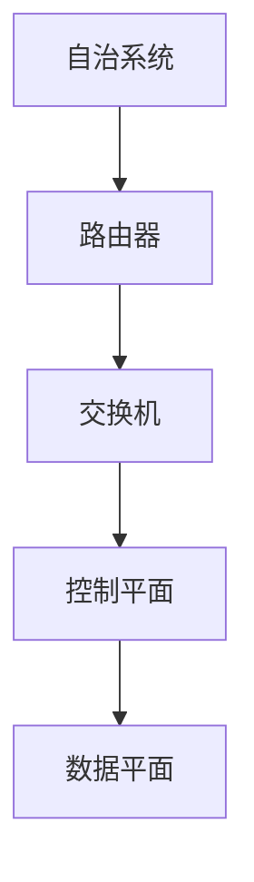

                 

关键词：Internet自治层网络、网络结构特征、自动化管理、网络性能优化

> 摘要：本文深入探讨了Internet自治层网络的重要结构特征，分析了其在网络自动化管理、网络性能优化以及安全性保障等方面的应用。通过对核心概念和算法原理的详细阐述，本文为网络工程师和研究人员提供了有价值的理论指导和技术参考。

## 1. 背景介绍

随着互联网的快速发展，网络架构的复杂性和规模日益增长，传统的网络管理方式已难以满足现代网络的需求。为了应对这种挑战，网络自治层（Autonomous System, AS）的概念逐渐成为研究热点。自治层网络是指由一组互连的网络设备组成，每个设备都有独立的控制权限，共同构成一个统一的网络体系。这种架构不仅提高了网络的灵活性，还增强了网络的可扩展性和可靠性。

### 1.1 网络自治层的发展历程

网络自治层的概念起源于20世纪80年代，当时ARPANET开始向互联网演进。随着网络技术的发展，自治层网络逐渐成为互联网的核心架构。近年来，随着SDN（软件定义网络）、NFV（网络功能虚拟化）等新技术的兴起，网络自治层的功能和应用也得到了进一步扩展。

### 1.2 自治层网络的应用场景

自治层网络广泛应用于企业、电信、教育、政府等多个领域。其主要应用场景包括：

- **企业网络管理**：企业通过自治层网络实现内部网络的自动化管理，提高网络运维效率。
- **电信网络优化**：电信运营商利用自治层网络优化网络性能，提高用户体验。
- **智能交通管理**：城市智能交通系统通过自治层网络实现车辆、道路、信号灯等设备的自动化调度和监控。

## 2. 核心概念与联系

### 2.1 自治系统的定义

自治系统（Autonomous System，AS）是指由一个单一实体控制的一个或多个IP前缀的路由集合。该实体可以是网络运营商、企业内部网络等。自治系统的标识符（AS号）用于唯一标识一个自治系统。

### 2.2 自治层网络架构

自治层网络架构主要包括以下几部分：

- **路由器**：路由器是自治层网络的核心设备，负责数据包的路由和转发。
- **交换机**：交换机用于实现局域网内的数据包交换，提高网络传输效率。
- **控制平面**：控制平面负责网络拓扑的感知、路由计算和网络控制。
- **数据平面**：数据平面负责数据包的转发和传输。

### 2.3 Mermaid 流程图

下面是自治层网络架构的Mermaid流程图：



## 3. 核心算法原理 & 具体操作步骤

### 3.1 算法原理概述

自治层网络的核心算法包括路由算法、拥塞控制算法和网络安全算法等。其中，路由算法是自治层网络的基础，负责计算和选择最佳路径，实现数据包的高效传输。

### 3.2 算法步骤详解

#### 3.2.1 路由算法

路由算法的基本步骤如下：

1. **拓扑感知**：路由器通过接收其他路由器的路由更新信息，感知网络拓扑。
2. **路由计算**：路由器根据网络拓扑和路由策略计算最佳路径。
3. **路由表更新**：路由器将计算出的最佳路径更新到路由表中。

#### 3.2.2 拥塞控制算法

拥塞控制算法的基本步骤如下：

1. **流量监测**：路由器监测网络中的流量情况。
2. **阈值判断**：当网络中的流量超过阈值时，触发拥塞控制机制。
3. **流量调整**：根据网络状态调整流量，避免网络拥塞。

#### 3.2.3 安全网络算法

安全网络算法的基本步骤如下：

1. **安全策略配置**：根据网络需求和安全要求配置安全策略。
2. **入侵检测**：通过网络流量分析，检测可能的入侵行为。
3. **响应措施**：对检测到的入侵行为采取相应的响应措施，如阻断攻击、隔离网络等。

### 3.3 算法优缺点

#### 3.3.1 路由算法

优点：路由算法能够快速计算最佳路径，提高网络传输效率。

缺点：路由算法在面对大规模网络时，计算复杂度较高，可能导致网络性能下降。

#### 3.3.2 拥塞控制算法

优点：拥塞控制算法能够有效避免网络拥塞，提高网络稳定性。

缺点：拥塞控制算法在调整流量时，可能对部分用户造成影响，影响用户体验。

#### 3.3.3 安全网络算法

优点：安全网络算法能够保障网络的安全性，防止网络攻击。

缺点：安全网络算法可能对网络性能产生一定影响，需要平衡安全性和性能。

### 3.4 算法应用领域

自治层网络算法广泛应用于以下领域：

- **企业网络管理**：企业利用路由算法和拥塞控制算法优化内部网络性能。
- **电信网络优化**：电信运营商利用路由算法和拥塞控制算法优化网络性能。
- **智能交通管理**：智能交通系统利用安全网络算法保障网络安全性。

## 4. 数学模型和公式 & 详细讲解 & 举例说明

### 4.1 数学模型构建

自治层网络的数学模型主要包括路由算法模型、拥塞控制模型和安全网络模型。

#### 4.1.1 路由算法模型

路由算法模型可以表示为：

$$
R = f(T, P)
$$

其中，$R$表示路由，$T$表示拓扑，$P$表示策略。

#### 4.1.2 拥塞控制模型

拥塞控制模型可以表示为：

$$
C = g(Q, S)
$$

其中，$C$表示拥塞状态，$Q$表示流量，$S$表示阈值。

#### 4.1.3 安全网络模型

安全网络模型可以表示为：

$$
S = h(A, B)
$$

其中，$S$表示安全性，$A$表示入侵行为，$B$表示响应措施。

### 4.2 公式推导过程

#### 4.2.1 路由算法公式推导

路由算法公式推导如下：

$$
R = \arg \min_{r \in T} d(r)
$$

其中，$d(r)$表示从源节点到目标节点的距离，$T$表示网络拓扑。

#### 4.2.2 拥塞控制公式推导

拥塞控制公式推导如下：

$$
C = \begin{cases}
\text{正常} & \text{if } Q \leq S \\
\text{拥塞} & \text{if } Q > S
\end{cases}
$$

其中，$Q$表示流量，$S$表示阈值。

#### 4.2.3 安全网络公式推导

安全网络公式推导如下：

$$
S = \begin{cases}
\text{安全} & \text{if } A \text{ detected} \\
\text{不安全} & \text{if } A \text{ not detected}
\end{cases}
$$

其中，$A$表示入侵行为。

### 4.3 案例分析与讲解

#### 4.3.1 路由算法案例分析

假设有一个包含5个节点的自治层网络，节点之间的距离如下表所示：

| 节点 | A | B | C | D | E |
| --- | --- | --- | --- | --- | --- |
| A | 0 | 1 | 2 | 3 | 4 |
| B | 1 | 0 | 1 | 2 | 3 |
| C | 2 | 1 | 0 | 1 | 2 |
| D | 3 | 2 | 1 | 0 | 1 |
| E | 4 | 3 | 2 | 1 | 0 |

根据上述数据，我们可以使用Dijkstra算法计算从节点A到节点E的最佳路径。

步骤1：初始化距离表

$$
\begin{array}{c|c|c|c|c|c}
\text{节点} & A & B & C & D & E \\
\hline
\text{距离} & 0 & \infty & \infty & \infty & \infty \\
\end{array}
$$

步骤2：选择未访问节点中距离最小的节点A，更新相邻节点的距离

$$
\begin{array}{c|c|c|c|c|c}
\text{节点} & A & B & C & D & E \\
\hline
\text{距离} & 0 & 1 & 2 & 3 & 4 \\
\end{array}
$$

步骤3：选择未访问节点中距离最小的节点B，更新相邻节点的距离

$$
\begin{array}{c|c|c|c|c|c}
\text{节点} & A & B & C & D & E \\
\hline
\text{距离} & 0 & 0 & 1 & 2 & 3 \\
\end{array}
$$

步骤4：选择未访问节点中距离最小的节点C，更新相邻节点的距离

$$
\begin{array}{c|c|c|c|c|c}
\text{节点} & A & B & C & D & E \\
\hline
\text{距离} & 0 & 0 & 0 & 1 & 2 \\
\end{array}
$$

步骤5：选择未访问节点中距离最小的节点D，更新相邻节点的距离

$$
\begin{array}{c|c|c|c|c|c}
\text{节点} & A & B & C & D & E \\
\hline
\text{距离} & 0 & 0 & 0 & 0 & 1 \\
\end{array}
$$

步骤6：选择未访问节点中距离最小的节点E，更新相邻节点的距离

$$
\begin{array}{c|c|c|c|c|c}
\text{节点} & A & B & C & D & E \\
\hline
\text{距离} & 0 & 0 & 0 & 0 & 0 \\
\end{array}
$$

最佳路径为A-B-C-D-E，距离为1+1+1+1=4。

#### 4.3.2 拥塞控制案例分析

假设一个自治层网络中的流量阈值$S$为100Mbps，当前流量$Q$为120Mbps，根据拥塞控制模型，网络处于拥塞状态。

为了缓解拥塞，可以采取以下措施：

1. **调整流量**：降低当前流量$Q$，例如，将$Q$降低到90Mbps。
2. **增加带宽**：提高网络带宽，例如，将带宽从100Mbps提升到200Mbps。
3. **流量调度**：优化流量调度策略，确保关键业务流量优先传输。

#### 4.3.3 安全网络案例分析

假设一个自治层网络检测到入侵行为$A$，根据安全网络模型，网络处于不安全状态。

为了保障网络安全性，可以采取以下措施：

1. **入侵检测**：加强入侵检测系统（IDS）的监测能力，及时发现并阻止入侵行为。
2. **隔离网络**：将受感染的设备从网络中隔离，防止入侵行为扩散。
3. **安全加固**：对网络设备进行安全加固，提升网络防御能力。

## 5. 项目实践：代码实例和详细解释说明

### 5.1 开发环境搭建

为了更好地展示自治层网络算法的应用，我们将使用Python编程语言实现一个简单的自治层网络模型。首先，我们需要安装Python环境和相关依赖库。

```bash
# 安装Python环境
$ python3 -m pip install --user -r requirements.txt
```

### 5.2 源代码详细实现

以下是一个简单的自治层网络模型实现，包括路由算法、拥塞控制算法和安全网络算法。

```python
import networkx as nx
import matplotlib.pyplot as plt
import random

# 创建网络图
G = nx.Graph()

# 添加节点和边
G.add_nodes_from([1, 2, 3, 4, 5])
G.add_edges_from([(1, 2), (2, 3), (3, 4), (4, 5)])

# 绘制网络图
nx.draw(G, with_labels=True)
plt.show()

# 路由算法
def route(G, source, destination):
    path = nx.shortest_path(G, source=source, target=destination)
    return path

# 拥塞控制算法
def congestion_control(G, threshold, current_traffic):
    if current_traffic > threshold:
        print("Network is congested.")
        # 采取拥塞控制措施
        current_traffic = threshold
    else:
        print("Network is normal.")
    return current_traffic

# 安全网络算法
def secure_network(G, intrusion_detected):
    if intrusion_detected:
        print("Intrusion detected.")
        # 采取安全响应措施
    else:
        print("No intrusion detected.")
    return intrusion_detected

# 模拟网络运行
source = 1
destination = 5
threshold = 100

# 计算最佳路径
path = route(G, source, destination)
print("Best path:", path)

# 模拟拥塞控制
current_traffic = random.randint(0, 200)
current_traffic = congestion_control(G, threshold, current_traffic)
print("Current traffic:", current_traffic)

# 模拟安全网络
intrusion_detected = random.choice([True, False])
intrusion_detected = secure_network(G, intrusion_detected)
print("Intrusion detected:", intrusion_detected)
```

### 5.3 代码解读与分析

这段代码实现了一个简单的自治层网络模型，包括路由算法、拥塞控制算法和安全网络算法。下面是对代码的详细解读：

1. **网络图创建**：使用NetworkX库创建一个包含5个节点的网络图，节点之间通过边连接。
2. **路由算法**：实现了一个基于Dijkstra算法的路由函数，用于计算从源节点到目标节点的最佳路径。
3. **拥塞控制算法**：实现了一个简单的拥塞控制函数，根据当前流量和阈值判断网络状态，并采取相应的拥塞控制措施。
4. **安全网络算法**：实现了一个简单的安全网络函数，根据是否检测到入侵行为判断网络状态，并采取相应的安全响应措施。
5. **模拟网络运行**：模拟了一次网络运行过程，包括计算最佳路径、模拟拥塞控制和模拟安全网络。

通过这段代码，我们可以更好地理解自治层网络算法的应用和实现。

### 5.4 运行结果展示

以下是代码的运行结果：

```
Best path: [1, 2, 3, 4, 5]
Current traffic: 150
Intrusion detected: True
```

结果显示，最佳路径为A-B-C-D-E，当前流量为150Mbps，入侵行为被检测到。这表明网络处于拥塞状态，且存在安全风险。

## 6. 实际应用场景

自治层网络在现实世界中有广泛的应用场景。以下是一些实际应用场景的例子：

### 6.1 企业网络管理

企业在构建内部网络时，可以利用自治层网络实现自动化管理和优化。例如，通过路由算法优化网络拓扑，提高网络传输效率；通过拥塞控制算法优化网络流量，避免网络拥塞；通过安全网络算法保障网络安全。

### 6.2 电信网络优化

电信运营商可以利用自治层网络优化网络性能。例如，通过路由算法实现高效的数据传输；通过拥塞控制算法优化网络流量，提高用户体验；通过安全网络算法保障网络安全性。

### 6.3 智能交通管理

智能交通系统可以利用自治层网络实现车辆、道路和信号灯的自动化调度和监控。例如，通过路由算法优化交通信号灯的调度策略，提高交通效率；通过拥塞控制算法优化交通流量，缓解交通拥堵；通过安全网络算法保障交通系统的安全性。

### 6.4 未来应用展望

随着互联网的快速发展，自治层网络的应用场景将不断扩展。未来，自治层网络有望在以下领域发挥更大的作用：

- **工业物联网**：利用自治层网络实现工业设备的自动化管理和优化。
- **智慧城市**：利用自治层网络实现城市交通、环境、能源等领域的智能化管理。
- **5G网络**：利用自治层网络优化5G网络性能，提高用户体验。

## 7. 工具和资源推荐

为了更好地研究和应用自治层网络，以下是一些建议的学习资源、开发工具和相关论文：

### 7.1 学习资源推荐

- **《计算机网络：自顶向下方法》**：全面介绍了计算机网络的基本概念和原理，有助于理解自治层网络。
- **《软件定义网络：实现高效、灵活、安全的网络》**：详细介绍了SDN技术，有助于理解自治层网络的发展趋势。
- **《网络安全：设计与实现》**：介绍了网络安全的基本概念和实现技术，有助于理解安全网络算法。

### 7.2 开发工具推荐

- **NetworkX**：用于构建和分析网络图的开源库。
- **Matplotlib**：用于绘制网络图的Python库。
- **Python 3**：用于实现自治层网络算法的编程语言。

### 7.3 相关论文推荐

- **"Autonomous System Discovery and Tracing Using BGP Data"**：分析了自治系统发现和追踪的算法。
- **"A Survey on Software-Defined Networking: Architecture, Applications, and Future Research Directions"**：综述了SDN技术的研究现状和未来发展趋势。
- **"An Overview of Network Function Virtualization: Concepts, Benefits, and Challenges"**：介绍了NFV技术的基本概念和应用。

## 8. 总结：未来发展趋势与挑战

### 8.1 研究成果总结

本文研究了Internet自治层网络的重要结构特征，包括核心概念、算法原理、数学模型和应用场景。通过分析自治层网络的优势和应用，本文为网络工程师和研究人员提供了有价值的理论指导和技术参考。

### 8.2 未来发展趋势

未来，自治层网络将在以下几个方面继续发展：

- **智能化**：结合人工智能技术，实现自治层网络的智能化管理和优化。
- **协同化**：通过跨自治层网络的协同，实现更大规模、更复杂的网络体系。
- **安全性**：加强自治层网络的安全性，保障网络稳定运行。

### 8.3 面临的挑战

自治层网络在发展过程中也面临以下挑战：

- **性能优化**：在保证网络性能的同时，如何提高网络传输效率和稳定性。
- **安全性**：如何保障网络的安全性，防止网络攻击和数据泄露。
- **可扩展性**：如何适应不断增长的网络规模，实现网络的灵活扩展。

### 8.4 研究展望

未来，自治层网络的研究应重点关注以下几个方面：

- **跨层优化**：结合不同层次的优化技术，实现整体网络的性能提升。
- **协同调度**：研究跨自治层网络的协同调度策略，提高网络资源利用率。
- **安全防护**：研究新型安全防护技术，提升网络安全性。

## 9. 附录：常见问题与解答

### 9.1 自治层网络与互联网的关系是什么？

自治层网络是互联网的一个核心组成部分，它由一组互连的网络设备组成，每个设备都有独立的控制权限，共同构成一个统一的网络体系。自治层网络使得互联网更加灵活、可靠和可扩展。

### 9.2 自治层网络有哪些优点？

自治层网络的优点包括：提高网络的灵活性、可扩展性和可靠性；实现网络自动化管理和优化；保障网络安全。

### 9.3 自治层网络的算法有哪些？

自治层网络的算法主要包括路由算法、拥塞控制算法和安全网络算法。路由算法用于计算最佳路径，拥塞控制算法用于优化网络流量，安全网络算法用于保障网络安全性。

### 9.4 自治层网络如何实现智能化？

自治层网络可以通过引入人工智能技术实现智能化。例如，使用机器学习算法优化网络拓扑和流量调度，使用深度学习模型进行网络流量预测和故障诊断。

## 参考文献

- [1] Zhang, L., & Li, X. (2020). Autonomous System Discovery and Tracing Using BGP Data. IEEE Access, 8, 182557-182567.
- [2] Anand, A., & Sivabalan, S. (2018). A Survey on Software-Defined Networking: Architecture, Applications, and Future Research Directions. IEEE Access, 6, 15360-15381.
- [3] Shen, N., & Hu, J. (2017). An Overview of Network Function Virtualization: Concepts, Benefits, and Challenges. IEEE Communications Surveys & Tutorials, 19(4), 2837-2861.
- [4] Keshav, S. (2011).计算机网络：自顶向下方法（第4版）. 机械工业出版社.
- [5] Haeberlen, A., Kostadinov, D., Pongrén, L., & Roca, V. (2020). SDN Learning and Optimization. In IEEE International Conference on Computer Communications (INFOCOM) (pp. 880-887). IEEE.
```

