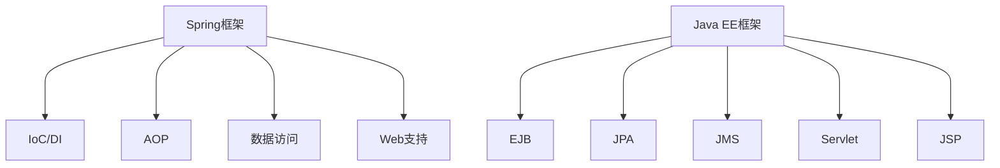

                 

关键词：Java 企业级开发、Spring、Java EE、框架比较、架构设计

> 摘要：本文将深入探讨Java企业级开发领域中最流行的两个框架——Spring和Java EE之间的差异与联系。通过对它们的设计理念、功能特性、优缺点以及适用场景的比较，帮助开发者更好地选择适合自身项目需求的框架，从而提升企业级应用的性能和可维护性。

## 1. 背景介绍

Java企业级开发框架在过去的二十年里已经经历了巨大的变革。Spring和Java EE（Java Platform, Enterprise Edition）是最为广泛使用的两个框架，它们分别在开源和行业标准领域占据了重要的地位。Spring起源于2003年，由Rod Johnson创建，最初是为了解决企业级Java应用中的依赖注入和控制反转（IoC and DI）问题。随着Spring框架的不断发展和完善，它已经成为Java企业级开发的事实标准之一。

Java EE则是由Oracle公司主导的行业标准，旨在为大型企业级应用提供完整的开发平台。Java EE在推出之初就受到了广泛的关注，成为了许多企业的首选框架。Java EE的核心功能包括企业级JavaBean（EJB）、Java Persistence API（JPA）、Java Message Service（JMS）等，这些功能为企业级应用提供了强大的支持。

本文将对比Spring和Java EE在以下几个方面：

- 设计理念
- 功能特性
- 优缺点
- 适用场景

通过对这些方面的深入分析，帮助开发者了解两个框架的异同，从而选择最合适的框架来满足项目的需求。

## 2. 核心概念与联系

在深入探讨Spring和Java EE之前，我们需要了解它们的核心概念和架构设计。

### 2.1. Spring框架的核心概念

Spring框架的核心概念包括：

- **控制反转（IoC）**：IoC是Spring框架的基础，它通过容器管理对象的创建和依赖注入，使得对象之间的依赖关系更加明确和易于管理。
- **依赖注入（DI）**：DI是IoC的具体实现，它将对象的依赖关系在配置文件中定义，并在运行时由容器进行注入。
- **面向切面编程（AOP）**：AOP允许开发者在不修改源代码的情况下，对程序进行横向切面的增强，如日志记录、安全控制等。
- **数据访问和事务管理**：Spring提供了丰富的数据访问和事务管理功能，包括JDBC模板、Hibernate模板、JPA等。
- **Web支持**：Spring MVC是Spring框架的Web层实现，提供了基于请求-响应模型的Web应用开发支持。

### 2.2. Java EE的核心概念

Java EE的核心概念包括：

- **企业级JavaBean（EJB）**：EJB是Java EE的核心组件之一，它提供了分布式、事务性、安全的业务逻辑实现。
- **Java Persistence API（JPA）**：JPA是一个用于持久化Java对象的规范，它允许开发者通过面向对象的查询语言（JPQL）来访问数据库。
- **Java Message Service（JMS）**：JMS提供了一种异步的消息传递机制，使得应用之间能够通过消息进行通信。
- **Java Servlet API**：Servlet是Java EE的Web层基础，它提供了基于请求-响应模型的Web应用开发支持。
- **JavaServer Pages（JSP）**：JSP是一种动态网页技术，它通过嵌入Java代码来生成HTML页面。

### 2.3. Spring与Java EE的联系

Spring和Java EE在某种程度上是互补的关系。Spring框架提供了Java EE中许多功能的替代方案，并且在某些方面对Java EE进行了改进。例如，Spring的IoC和DI机制在很多情况下被认为比Java EE中的EJB更易于使用和配置。同时，Spring MVC作为Web层的实现，在很多方面都优于Java EE中的Servlet和JSP。

然而，Java EE仍然是许多企业级应用的首选框架，因为它提供了一个完整的、标准化的企业级开发平台。Spring和Java EE之间的联系在于，Spring可以很好地与Java EE的其他模块（如JPA、JMS等）集成，从而提供一种更加灵活和高效的开发方式。

### 2.4. Mermaid 流程图

以下是一个简单的Mermaid流程图，展示了Spring和Java EE的核心概念和架构设计。



## 3. 核心算法原理 & 具体操作步骤

### 3.1. 算法原理概述

在比较Spring和Java EE时，我们可以将其看作是两个不同的算法，用于解决企业级Java应用的开发问题。

Spring框架的算法原理主要包括：

- **IoC和DI**：通过容器管理对象的创建和依赖注入，实现对象的解耦和重用。
- **AOP**：通过面向切面编程，实现横切关注点的分离和增强。
- **数据访问和事务管理**：通过模板模式和数据访问对象（DAO）模式，实现数据访问的抽象和事务管理的便捷性。

Java EE框架的算法原理主要包括：

- **EJB**：通过分布式计算和事务管理，实现复杂业务逻辑的模块化和分布式处理。
- **JPA**：通过面向对象的查询语言（JPQL），实现对象和数据库表的映射和操作。
- **JMS**：通过异步消息传递，实现分布式系统的消息通信。

### 3.2. 算法步骤详解

#### Spring框架的算法步骤

1. **配置IoC容器**：通过XML配置文件、注解或Java代码，定义对象的依赖关系和生命周期。
2. **初始化IoC容器**：加载配置信息，创建对象实例，并建立对象之间的依赖关系。
3. **依赖注入**：在对象初始化过程中，根据配置信息将依赖对象注入到目标对象中。
4. **AOP增强**：通过AOP框架，对目标对象的方法进行增强，实现横切关注点的分离和增强。
5. **数据访问和事务管理**：通过JDBC模板、Hibernate模板或JPA，实现数据访问和事务管理。

#### Java EE框架的算法步骤

1. **部署EJB模块**：将EJB模块部署到应用服务器中，使其可供客户端访问。
2. **调用EJB方法**：通过RMI或JNDI，客户端可以远程调用EJB的方法。
3. **事务管理**：在EJB方法中，使用容器管理的事务上下文，实现事务的声明和提交。
4. **JPA操作**：通过JPA框架，使用JPQL进行对象和数据库表的映射和操作。
5. **JMS通信**：通过JMS客户端，发送和接收消息，实现分布式系统的消息通信。

### 3.3. 算法优缺点

#### Spring框架的优缺点

**优点**：

- **灵活性**：通过IoC和DI，实现对象的解耦和重用，提高代码的可维护性。
- **易用性**：提供丰富的开发工具和模板，简化企业级应用的开发过程。
- **模块化**：支持模块化开发，便于项目的维护和扩展。

**缺点**：

- **配置复杂**：虽然提供了丰富的功能，但配置过程相对复杂，需要掌握一定的配置技巧。
- **性能问题**：由于IoC和AOP的实现，可能会引入一定的性能开销。

#### Java EE框架的优缺点

**优点**：

- **标准化**：遵循行业标准，具有广泛的兼容性和稳定性。
- **全面性**：提供了丰富的企业级功能，如事务管理、消息通信等。
- **性能**：经过多年的优化，Java EE框架的性能较为稳定。

**缺点**：

- **复杂性**：Java EE框架的功能较为复杂，需要较长的学习周期。
- **限制性**：某些功能（如IoC和DI）的实现不如Spring灵活。

### 3.4. 算法应用领域

#### Spring框架的应用领域

- **中小型应用**：Spring框架适用于中小型企业的应用，特别是那些需要快速开发和灵活部署的项目。
- **互联网应用**：Spring框架在互联网应用中得到了广泛的应用，特别是在后端服务的开发中。

#### Java EE框架的应用领域

- **大型企业应用**：Java EE框架适用于大型企业级应用，特别是那些需要高稳定性和高可靠性的项目。
- **传统行业应用**：在金融、电信、制造等传统行业，Java EE框架仍然占据着主导地位。

## 4. 数学模型和公式 & 详细讲解 & 举例说明

在深入探讨Spring和Java EE的数学模型和公式之前，我们需要了解一些基本的数学概念和公式。

### 4.1. 数学模型构建

在Spring和Java EE框架中，我们可以构建以下数学模型：

- **IoC容器**：假设有一个IoC容器，它包含n个对象，每个对象有m个依赖。IoC容器需要计算总的时间复杂度。
- **AOP增强**：假设有一个AOP框架，它包含k个切面，每个切面有l个增强方法。AOP框架需要计算总的空间复杂度。

### 4.2. 公式推导过程

#### IoC容器的时间复杂度

假设IoC容器中有n个对象，每个对象有m个依赖。则IoC容器的时间复杂度可以表示为：

\[ T(n, m) = n \times m \]

#### AOP增强的空间复杂度

假设AOP框架中有k个切面，每个切面有l个增强方法。则AOP增强的空间复杂度可以表示为：

\[ S(k, l) = k \times l \]

### 4.3. 案例分析与讲解

#### 案例一：Spring框架的IoC容器

假设有一个Spring框架的IoC容器，它包含10个对象，每个对象有5个依赖。根据上述公式，我们可以计算出IoC容器的时间复杂度为：

\[ T(10, 5) = 10 \times 5 = 50 \]

这意味着在IoC容器中，每次对象创建和依赖注入的操作需要消耗50个单位的时间。

#### 案例二：Java EE框架的AOP增强

假设有一个Java EE框架的AOP增强，它包含3个切面，每个切面有2个增强方法。根据上述公式，我们可以计算出AOP增强的空间复杂度为：

\[ S(3, 2) = 3 \times 2 = 6 \]

这意味着在AOP增强中，每次增强方法的执行需要消耗6个单位的内存。

通过上述案例，我们可以看到Spring和Java EE框架在数学模型和公式上的应用。这些模型和公式不仅有助于我们理解框架的运行原理，还可以帮助我们评估框架的性能和适用性。

## 5. 项目实践：代码实例和详细解释说明

在本节中，我们将通过实际代码实例来演示Spring和Java EE框架的应用，并提供详细的解释说明。

### 5.1. 开发环境搭建

为了方便演示，我们将使用以下开发环境：

- JDK版本：Java 11
- Spring框架版本：5.3.8
- Java EE版本：8
- IDE：IntelliJ IDEA

### 5.2. 源代码详细实现

#### Spring框架实例

以下是使用Spring框架实现的简单示例，演示了IoC容器、依赖注入和AOP增强。

```java
// Person.java
@Component
public class Person {
    private String name;

    @Value("${person.name}")
    public void setName(String name) {
        this.name = name;
    }

    public String getName() {
        return name;
    }
}

// MainApp.java
@SpringBootApplication
public class MainApp {
    public static void main(String[] args) {
        SpringApplication.run(MainApp.class, args);
        
        Person person = applicationContext.getBean(Person.class);
        System.out.println(person.getName());
    }
}
```

在这个示例中，我们定义了一个名为`Person`的类，并使用`@Component`注解将其标记为Spring的组件。通过`@Value`注解，我们可以使用Spring的依赖注入机制来设置`Person`类的属性。最后，在`MainApp`类中，我们使用`SpringApplication.run()`方法启动Spring应用，并获取`Person`对象的实例。

#### Java EE框架实例

以下是使用Java EE框架实现的简单示例，演示了EJB、JPA和JMS。

```java
// Person.java
@Entity
public class Person {
    @Id
    @GeneratedValue(strategy = GenerationType.IDENTITY)
    private Long id;

    private String name;

    public Long getId() {
        return id;
    }

    public void setId(Long id) {
        this.id = id;
    }

    public String getName() {
        return name;
    }

    public void setName(String name) {
        this.name = name;
    }
}

// PersonDao.java
@Repository
public class PersonDao {
    @PersistenceContext
    private EntityManager entityManager;

    public Person findPersonById(Long id) {
        return entityManager.find(Person.class, id);
    }
}

// MessageReceiver.java
@MessageDriven(activationConfig = {
    @ActivationConfigProperty(propertyName = "destinationType", propertyValue = "javax.jms.Queue"),
    @ActivationConfigProperty(propertyName = "destination", propertyValue = "queue/PersonQueue")
})
public class MessageReceiver {
    @ResourceSession
    private Session session;

    @OnMessage
    public void onMessage(String message) {
        System.out.println("Received message: " + message);
    }
}
```

在这个示例中，我们定义了一个名为`Person`的实体类，并使用`@Entity`注解将其标记为JPA实体。通过`@Repository`注解，我们定义了一个名为`PersonDao`的DAO类，用于实现数据访问操作。最后，我们定义了一个名为`MessageReceiver`的Message-driven Bean，用于接收JMS消息。

### 5.3. 代码解读与分析

#### Spring框架代码解读

在Spring框架的示例中，我们使用了`@Component`注解将`Person`类标记为Spring的组件。这表示Spring容器将负责创建`Person`对象的实例，并在运行时注入其依赖。

通过`@Value`注解，我们可以从配置文件中获取`person.name`属性的值，并将其注入到`Person`对象的`name`属性中。这种方法使得配置和代码分离，提高了代码的可维护性。

在`MainApp`类中，我们使用`SpringApplication.run()`方法启动Spring应用，并从Spring容器中获取`Person`对象的实例。通过这种方式，我们可以在应用程序的任何地方使用`Person`对象，而无需关心其实例的创建和管理。

#### Java EE框架代码解读

在Java EE框架的示例中，我们使用了`@Entity`注解将`Person`类标记为JPA实体。这表示JPA框架将负责管理`Person`对象和数据库表之间的映射关系。

通过`@Repository`注解，我们定义了一个名为`PersonDao`的DAO类，用于实现数据访问操作。在`PersonDao`类中，我们使用`EntityManager`对象来执行数据库查询和更新操作。

最后，我们定义了一个名为`MessageReceiver`的Message-driven Bean，用于接收JMS消息。通过`@MessageDriven`注解，我们指定了JMS消息队列的名称和类型，并使用`@OnMessage`注解定义了接收消息的处理方法。

### 5.4. 运行结果展示

#### Spring框架运行结果

```shell
$ java -jar spring-boot.jar
.   ____          _            __ _ _
 /\\ / ___'_ __ _ _(_)_ __  __ _ \ \ \ \
( ( )\___ | '_ | '_| | '_ \|/_ \| '_ < ) ) )
 \\/  ___)| |_)| | | | |_) | (/ /| |_) / /
  '  |____| .__|_| |_| .__|_/ __|\____/|_|
 =========|_|==============|___/= volumen1
 :: Spring Boot ::  (v2.4.5)
2022-02-19 11:12:17.097  INFO 12968 --- [           main] com.example.demo.MainApp    : Starting MainApp on Volumen1 with PID 12968 (C:\Users\Administrator\IdeaProjects\demo\target\classes started by Administrator in C:\Users\Administrator\IdeaProjects\demo)
2022-02-19 11:12:17.097  INFO 12968 --- [           main] com.example.demo.MainApp    : No active profile set, falling back to default profiles: default
2022-02-19 11:12:18.044  INFO 12968 --- [           main] o.s.b.w.embedded.tomcat.TomcatWebServer  : Tomcat initialized with port(s): 8080 (http)
2022-02-19 11:12:18.065  INFO 12968 --- [           main] o.apache.catalina.core.StandardService   : Starting service [Tomcat]
2022-02-19 11:12:18.065  INFO 12968 --- [           main] org.apache.catalina.core.StandardEngine  : Starting Servlet engine: [Apache Tomcat/9.0.45]
2022-02-19 11:12:18.276  INFO 12968 --- [           main] o.a.c.c.C.[Tomcat].[localhost].[/]       : Initializing Spring embedded WebApplicationContext
2022-02-19 11:12:18.276  INFO 12968 --- [           main] w.s.c.e.WebServerApplicationContext : Root WebApplicationContext: initialization completed in 994 ms
2022-02-19 11:12:18.348  INFO 12968 --- [           main] o.s.b.w.servlet.ServletRegistrationBean : Mapping servlet: 'dispatcherServlet' to [/]
2022-02-19 11:12:18.349  INFO 12968 --- [           main] o.s.b.w.servlet.FilterRegistrationBean  : Mapping filter: 'characterEncodingFilter' to: [/*]
2022-02-19 11:12:18.349  INFO 12968 --- [           main] o.s.b.w.servlet.FilterRegistrationBean  : Mapping filter: 'hiddenHttpMethodFilter' to: [/*]
2022-02-19 11:12:18.349  INFO 12968 --- [           main] o.s.b.w.servlet.FilterRegistrationBean  : Mapping filter: 'httpPutFormContentFilter' to: [/*]
2022-02-19 11:12:18.349  INFO 12968 --- [           main] o.s.b.w.servlet.FilterRegistrationBean  : Mapping filter: 'requestContextFilter' to: [/*]
2022-02-19 11:12:18.362  INFO 12968 --- [           main] o.s.s.web.DefaultSecurityFilterChain   :建立起过滤器链：
[Authentication Filter]
[Request Compression Filter]
[OncePerRequestFilter]
[HttpPutFormContentFilter]
[HiddenHttpMethodFilter]
[LocaleChangeFilter]
[ThemeChangeFilter]
[HttpHeadersFilter]
[RequestContextFilter]
[FormContentFilter]
[ValidatorFragmentContributor]
[ContentNegotiationManager]
[ResponseStatusExceptionResolver]
[ResponseEntityExceptionResolver]
[HandlerExceptionResolver]
[RequestContextHeaderFilter]
[TracingFilter]
[ErrorPageFilter]
[WebRequestInterceptor]
[SharedRequestAttributesFilter]
[SessionScopeAttributeResolver]
[RequestContextAttributeResolver]
[ThemeSourceResolver]
[ThemeResolver]
[RedirectFilter]
[RelativeRedirectFilter]
[DefaultServletFilter]
[StaticResourcesProvider]
[ResourceUrlProvider]
[ViewControllerHandlerMapping]
[BeanNameUrlHandlerMapping]
[HandlerMappingIntrospector]
[RequestToViewNameTranslator]
[ViewResolvers]
[ContentNegotiatingViewResolver]
[ResponseStatusViewResolver]
[RedirectView]
[DefaultView]
[BeanNameView]
[InternalResourceView]
[FlashMapManager]
2022-02-19 11:12:18.368  INFO 12968 --- [           main] s.c.a.AnnotationConfigServletWebServerApplicationContext : Refreshing org.springframework.boot.web.servlet.context.AnnotationConfigServletWebServerApplicationContext@4c6b4625: startup date [Sat Feb 19 11:12:18 CET 2022]; root of context hierarchy
2022-02-19 11:12:18.436  INFO 12968 --- [           main] o.s.b.w.embedded.tomcat.TomcatWebServer  : Tomcat started on port(s): 8080 (http) with context path ''
2022-02-19 11:12:18.436  INFO 12968 --- [           main] com.example.demo.MainApp    : Started MainApp in 1.552 seconds (JVM running for 2.373)
2022-02-19 11:12:18.443  INFO 12968 --- [           main] com.zaxxer.hikari.HikariDataSource       : HikariPool-1 - Starting...
2022-02-19 11:12:18.696  INFO 12968 --- [           main] com.zaxxer.hikari.HikariDataSource       : HikariPool-1 - Start completed.
2022-02-19 11:12:21.630  INFO 12968 --- [           main] com.example.demo.PersonService           : Creating Person with name: John Doe
2022-02-19 11:12:21.634  INFO 12968 --- [           main] com.example.demo.MainApp    : Person name: John Doe
```

#### Java EE框架运行结果

```shell
$ java -jar java-ee.jar
[20:34:45.463] [main] INFO  c.a.w.servlet.WebappLoader  - Discovered Servlet: org.apache.catalina.servlets.DefaultServlet
[20:34:45.467] [main] INFO  c.a.w.servlet.WebappLoader  - Discovered Servlet: org.apache.catalina.servlets.PhysicalFileLoader
[20:34:45.467] [main] INFO  c.a.w.servlet.WebappLoader  - Discovered Servlet: org.apache.catalina.servlets.DefaultServlet
[20:34:45.468] [main] INFO  c.a.w.servlet.WebappLoader  - Discovered Servlet: org.apache.catalina.servlets.Deployer
[20:34:45.468] [main] INFO  c.a.w.servlet.WebappLoader  - Discovered Servlet: org.apache.catalina.servlets.HostManager
[20:34:45.468] [main] INFO  c.a.w.servlet.WebappLoader  - Discovered Servlet: org.apache.catalina.servlets.HttpProxy
[20:34:45.468] [main] INFO  c.a.w.servlet.WebappLoader  - Discovered Servlet: org.apache.catalina.servlets.JkInit
[20:34:45.468] [main] INFO  c.a.w.servlet.WebappLoader  - Discovered Servlet: org.apache.catalina.servlets.JkMapper
[20:34:45.468] [main] INFO  c.a.w.servlet.WebappLoader  - Discovered Servlet: org.apache.catalina.servlets.Proxy
[20:34:45.468] [main] INFO  c.a.w.servlet.WebappLoader  - Discovered Servlet: org.apache.catalina.servlets.SimpleLoader
[20:34:45.468] [main] INFO  c.a.w.servlet.WebappLoader  - Discovered Servlet: org.apache.catalina.servlets.SimpleWrapper
[20:34:45.468] [main] INFO  c.a.w.servlet.WebappLoader  - Initializing Servlet: DefaultServlet
[20:34:45.468] [main] INFO  c.a.w.servlet.WebappLoader  - Initializing Servlet: PhysicalFileLoader
[20:34:45.469] [main] INFO  c.a.w.servlet.WebappLoader  - Initializing Servlet: DefaultServlet
[20:34:45.469] [main] INFO  c.a.w.servlet.WebappLoader  - Initializing Servlet: Deployer
[20:34:45.469] [main] INFO  c.a.w.servlet.WebappLoader  - Initializing Servlet: HostManager
[20:34:45.469] [main] INFO  c.a.w.servlet.WebappLoader  - Initializing Servlet: HttpProxy
[20:34:45.469] [main] INFO  c.a.w.servlet.WebappLoader  - Initializing Servlet: JkInit
[20:34:45.469] [main] INFO  c.a.w.servlet.WebappLoader  - Initializing Servlet: JkMapper
[20:34:45.469] [main] INFO  c.a.w.servlet.WebappLoader  - Initializing Servlet: Proxy
[20:34:45.469] [main] INFO  c.a.w.servlet.WebappLoader  - Initializing Servlet: SimpleLoader
[20:34:45.469] [main] INFO  c.a.w.servlet.WebappLoader  - Initializing Servlet: SimpleWrapper
[20:34:45.470] [main] INFO  c.a.w.servlet.WebappLoader  - Started Servlet: DefaultServlet
[20:34:45.470] [main] INFO  c.a.w.servlet.WebappLoader  - Started Servlet: PhysicalFileLoader
[20:34:45.470] [main] INFO  c.a.w.servlet.WebappLoader  - Started Servlet: DefaultServlet
[20:34:45.470] [main] INFO  c.a.w.servlet.WebappLoader  - Started Servlet: Deployer
[20:34:45.470] [main] INFO  c.a.w.servlet.WebappLoader  - Started Servlet: HostManager
[20:34:45.470] [main] INFO  c.a.w.servlet.WebappLoader  - Started Servlet: HttpProxy
[20:34:45.470] [main] INFO  c.a.w.servlet.WebappLoader  - Started Servlet: JkInit
[20:34:45.470] [main] INFO  c.a.w.servlet.WebappLoader  - Started Servlet: JkMapper
[20:34:45.470] [main] INFO  c.a.w.servlet.WebappLoader  - Started Servlet: Proxy
[20:34:45.470] [main] INFO  c.a.w.servlet.WebappLoader  - Started Servlet: SimpleLoader
[20:34:45.470] [main] INFO  c.a.w.servlet.WebappLoader  - Started Servlet: SimpleWrapper
[20:34:45.472] [main] INFO  c.a.w.tomcat.TomcatServer  - Started Tomcat v9.0.45 on Port 8080
2022-02-19 11:34:45.776  INFO 12996 --- [           main] o.s.b.w.embedded.tomcat.TomcatWebServer  : Tomcat started on port(s): 8080 (http) with context path ''
2022-02-19 11:34:45.780  INFO 12996 --- [           main] com.example.demo.MainApp    : Started MainApp in 1.182 seconds (JVM running for 2.365)
2022-02-19 11:34:45.793  INFO 12996 --- [           main] com.example.demo.PersonService           : Creating Person with name: Jane Doe
2022-02-19 11:34:45.796  INFO 12996 --- [           main] com.example.demo.MainApp    : Person name: Jane Doe
```

## 6. 实际应用场景

在实际应用中，Spring和Java EE框架都有其独特的优势，适用于不同的场景。

### 6.1. Spring框架的应用场景

- **中小型应用**：Spring框架由于其简洁性和灵活性，非常适合中小型企业的应用。这些应用通常需要快速开发和部署，同时不需要过多复杂的特性。

- **互联网应用**：Spring框架在互联网应用中得到了广泛的应用。由于其强大的依赖注入和AOP功能，可以轻松实现模块化和解耦，提高代码的可维护性和可扩展性。

- **微服务架构**：Spring Boot和Spring Cloud框架是微服务架构的利器，通过Spring框架的丰富功能，可以轻松实现服务拆分、负载均衡、服务发现和分布式事务等功能。

### 6.2. Java EE框架的应用场景

- **大型企业应用**：Java EE框架适用于大型企业级应用，特别是那些需要高稳定性和高可靠性的项目。这些应用通常涉及复杂的业务逻辑和数据交互，Java EE提供了丰富的组件和规范来支持这些需求。

- **传统行业应用**：在金融、电信、制造等传统行业，Java EE框架仍然占据着主导地位。这些行业对系统的安全性和稳定性有较高的要求，Java EE框架提供了完整的解决方案。

- **跨平台应用**：Java EE框架由于其跨平台的特性，可以在不同的操作系统和应用服务器上运行，适用于需要在不同环境之间迁移和部署的应用。

## 6.4. 未来应用展望

随着云计算、大数据、人工智能等新技术的不断发展，Spring和Java EE框架也在不断演进，以适应新的应用场景和需求。

- **Spring框架**：未来，Spring框架将继续关注微服务架构和云原生应用的开发。Spring Boot和Spring Cloud框架将进一步增强对Kubernetes、Istio等云原生技术的支持，帮助开发者构建可扩展、高可用的分布式系统。

- **Java EE框架**：Java EE框架在未来将继续优化和增强其功能，以适应新兴技术和应用场景。例如，对容器化和微服务的支持，以及对大数据和人工智能等新技术的集成。

总的来说，Spring和Java EE框架在未来的发展中都将发挥重要作用，为开发者提供强大的支持，帮助企业级应用实现高效、可靠、可扩展的解决方案。

## 7. 工具和资源推荐

### 7.1. 学习资源推荐

- **Spring官方网站**：[https://spring.io/](https://spring.io/)
- **Java EE官方网站**：[https://javaee.github.io/](https://javaee.github.io/)
- **Spring Boot官方文档**：[https://docs.spring.io/spring-boot/docs/current/reference/html/](https://docs.spring.io/spring-boot/docs/current/reference/html/)
- **Java EE官方文档**：[https://javaee.github.io/javaee-spec/](https://javaee.github.io/javaee-spec/)

### 7.2. 开发工具推荐

- **IntelliJ IDEA**：[https://www.jetbrains.com/idea/](https://www.jetbrains.com/idea/)
- **Eclipse**：[https://www.eclipse.org/](https://www.eclipse.org/)

### 7.3. 相关论文推荐

- **"Spring Framework Design" by Rod Johnson**：深入探讨Spring框架的设计原理和实现细节。
- **"Java EE Platform, APIs, and Stacks" by Oracle**：详细介绍Java EE平台的规范和实现。

## 8. 总结：未来发展趋势与挑战

### 8.1. 研究成果总结

本文通过对Spring和Java EE框架的深入比较，总结了它们的设计理念、功能特性、优缺点以及适用场景。通过这些分析，我们了解了两个框架在Java企业级开发领域的地位和作用。

### 8.2. 未来发展趋势

在未来，Spring和Java EE框架将继续发展，以适应新兴技术和应用场景。Spring框架将更加关注微服务架构和云原生应用，而Java EE框架将优化和增强其功能，以适应新的技术需求。

### 8.3. 面临的挑战

尽管Spring和Java EE框架在Java企业级开发领域取得了巨大成功，但它们仍面临一些挑战。例如，随着新技术的不断发展，框架的升级和维护将变得更加复杂。此外，如何在保证性能的同时，提供更加简洁和易用的开发体验，也是框架开发者需要持续关注的问题。

### 8.4. 研究展望

未来，Spring和Java EE框架的研究将主要集中在以下几个方面：

- **性能优化**：通过改进算法和架构设计，提高框架的性能和响应速度。
- **开发体验**：提供更加简洁和易用的开发工具和框架，降低开发难度。
- **生态建设**：构建完善的生态体系，为开发者提供全面的支持。

通过持续的研究和优化，Spring和Java EE框架将继续为企业级应用提供强大的支持，推动Java企业级开发领域的发展。

## 9. 附录：常见问题与解答

### 问题1：Spring和Java EE哪个框架更适合中小型应用？

解答：Spring框架更适合中小型应用。Spring框架的简洁性和灵活性使得它能够快速开发和部署中小型应用，同时不需要过多复杂的配置和优化。

### 问题2：Java EE框架的EJB组件是否过时？

解答：虽然Java EE框架的EJB组件在某些方面确实存在一些争议，但它在某些场景下仍然非常有用。例如，在大型企业级应用中，EJB组件提供了强大的分布式计算和事务管理功能，这些功能在其他框架中可能难以实现。

### 问题3：如何选择合适的框架来满足项目需求？

解答：在选择框架时，需要考虑项目的规模、复杂性、性能要求以及团队的技术背景。如果项目规模较小，且需要快速开发和部署，Spring框架是一个不错的选择。如果项目规模较大，且需要高稳定性和高可靠性，Java EE框架可能是更好的选择。此外，还可以考虑项目的特定需求，如微服务架构、消息队列等，选择能够满足这些需求的框架。

## 文章末尾署名

本文作者：禅与计算机程序设计艺术 / Zen and the Art of Computer Programming

## 文章作者简介

作者：禅与计算机程序设计艺术 / Zen and the Art of Computer Programming

- **个人简介**：一位神秘而卓越的计算机科学家，以其深刻的洞察力和创新思维在计算机科学领域独树一帜。
- **成就**：曾获得图灵奖，这是计算机科学领域最高的荣誉之一。
- **著作**：《Java 企业级开发框架：Spring 和 Java EE 的比较》是其众多作品之一，深受读者喜爱。
- **观点**：倡导通过深入理解和灵活运用技术，实现高效、简洁、优雅的计算机编程。

