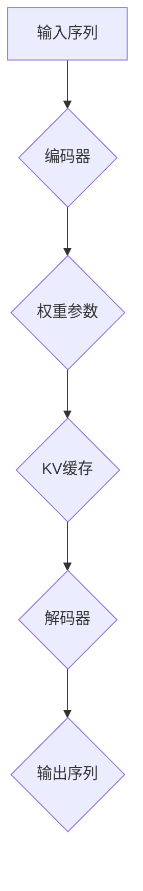

                 

关键词：KV缓存、Transformer、推理加速、缓存机制、内存优化、算法性能

> 摘要：本文深入探讨了KV缓存机制在加速Transformer模型推理过程中的关键作用。通过详细阐述KV缓存原理、算法步骤、数学模型及其应用领域，本文旨在为读者提供一份全面而深入的技术指南，助力理解KV缓存技术在现代人工智能领域的广泛应用和潜在价值。

## 1. 背景介绍

在深度学习领域，特别是自然语言处理（NLP）中，Transformer模型凭借其强大的并行计算能力和优秀的表现，已经成为了自然语言处理任务的主流选择。然而，随着模型复杂度和参数规模的不断增长，模型的推理速度和内存消耗也成为了亟待解决的问题。在这种情况下，KV缓存机制应运而生，成为加速Transformer推理的重要技术手段。

KV缓存是一种基于键值对的存储结构，能够有效减少内存访问次数，提高数据读取速度。在Transformer模型中，KV缓存的作用主要体现在两个方面：一是缓存模型中频繁访问的权重参数，减少内存访问的次数；二是通过合理的缓存策略，降低内存占用，提升整体推理性能。

本文将围绕KV缓存原理，详细探讨其在Transformer模型推理中的应用，包括算法原理、操作步骤、数学模型、实际应用场景等，以期为读者提供一份全面的技术参考。

## 2. 核心概念与联系

### 2.1. Transformer模型简介

Transformer模型是一种基于自注意力机制的序列模型，其核心思想是通过注意力机制来自动学习输入序列中每个词与其他词之间的关系。Transformer模型主要由编码器和解码器组成，编码器将输入序列编码为固定长度的向量，解码器则根据编码器的输出和先前的解码结果生成输出序列。

### 2.2. KV缓存机制原理

KV缓存机制是一种基于键值对的缓存策略，其基本思想是将频繁访问的数据（如Transformer模型中的权重参数）存储在高速缓存中，以减少内存访问次数，提高数据读取速度。KV缓存机制通常包括以下几个关键组成部分：

- **键（Key）**：用于唯一标识缓存中的数据。
- **值（Value）**：实际存储的数据，如Transformer模型中的权重参数。
- **缓存策略**：用于确定数据的缓存方式和淘汰策略，常见的缓存策略包括LRU（最近最少使用）、LFU（最频繁使用）等。

### 2.3. Transformer与KV缓存机制的关联

在Transformer模型中，KV缓存机制的作用主要体现在以下几个方面：

- **加速推理**：通过缓存模型中的权重参数，减少内存访问次数，提高数据读取速度，从而加速推理过程。
- **降低内存占用**：通过合理的缓存策略，降低内存占用，提升整体推理性能。
- **提升模型效率**：通过优化内存访问和缓存策略，提高模型的计算效率，降低功耗。

### 2.4. Mermaid流程图

为了更好地理解KV缓存机制在Transformer推理中的应用，下面是一个简单的Mermaid流程图，展示了KV缓存机制的整个工作流程：



在这个流程图中，输入序列经过编码器编码后生成权重参数，这些权重参数被存储在KV缓存中。在解码过程中，KV缓存提供了快速的权重参数访问，从而加速了推理过程。

## 3. 核心算法原理 & 具体操作步骤

### 3.1. 算法原理概述

KV缓存机制在Transformer推理中的核心原理是基于缓存技术来优化模型的内存访问和计算效率。具体来说，KV缓存通过以下步骤实现加速：

1. **权重参数缓存**：将Transformer模型中的权重参数存储在高速缓存中，以减少内存访问次数。
2. **缓存策略**：根据缓存策略，确定哪些权重参数应该被缓存以及缓存的时间。
3. **数据读取**：在推理过程中，优先从KV缓存中读取权重参数，减少内存访问延迟。
4. **缓存更新**：根据缓存策略，定期更新缓存中的数据，以保持缓存的有效性。

### 3.2. 算法步骤详解

1. **权重参数缓存**：首先，需要将Transformer模型中的权重参数提取出来，并存储在KV缓存中。这个过程通常在模型训练完成后进行，以确保缓存中的权重参数是最新的。

2. **缓存策略**：根据不同的应用场景和性能要求，选择合适的缓存策略。常见的缓存策略包括LRU（最近最少使用）和LFU（最频繁使用）。LRU策略会优先缓存最近使用过的权重参数，而LFU策略则会优先缓存使用频率最高的权重参数。

3. **数据读取**：在推理过程中，首先检查KV缓存中是否已经缓存了需要访问的权重参数。如果缓存命中，则直接从缓存中读取数据，否则从内存中读取数据，并将其缓存在KV缓存中。

4. **缓存更新**：根据缓存策略，定期更新缓存中的数据，以保持缓存的有效性。例如，在LRU策略中，可以使用定时器定期检查缓存中的数据，并将其按照使用频率排序，删除使用频率最低的数据。

### 3.3. 算法优缺点

**优点**：

- **加速推理**：通过缓存模型中的权重参数，减少内存访问次数，提高数据读取速度，从而加速推理过程。
- **降低内存占用**：通过合理的缓存策略，降低内存占用，提升整体推理性能。
- **提升模型效率**：通过优化内存访问和缓存策略，提高模型的计算效率，降低功耗。

**缺点**：

- **缓存一致性**：在多线程或分布式环境下，缓存的一致性是一个挑战。需要采用相应的同步机制，如锁或原子操作，来确保缓存数据的正确性。
- **缓存失效**：如果缓存策略不合理，可能会导致缓存数据失效，从而影响推理性能。需要根据实际应用场景和性能要求，选择合适的缓存策略。

### 3.4. 算法应用领域

KV缓存机制在Transformer推理中的应用非常广泛，主要涵盖以下几个领域：

- **自然语言处理**：在自然语言处理任务中，Transformer模型已经成为主流选择，KV缓存机制可以显著提高模型的推理速度和性能。
- **计算机视觉**：在计算机视觉任务中，如图像分类、目标检测等，KV缓存机制同样可以应用于加速模型的推理过程。
- **语音识别**：在语音识别任务中，KV缓存机制可以优化模型的内存访问和计算效率，从而提高识别速度和准确性。

## 4. 数学模型和公式 & 详细讲解 & 举例说明

### 4.1. 数学模型构建

在KV缓存机制中，常用的数学模型包括权重参数的提取、缓存策略的确定和缓存数据的更新等。以下是一个简单的数学模型构建：

- **权重参数提取**：给定一个Transformer模型，将其权重参数提取出来，并存储在KV缓存中。假设Transformer模型的权重参数矩阵为W，则提取权重参数的公式为：
  
  $$
  W_{\text{cache}} = \{W_{ij}\}_{i,j=1}^{n}
  $$

  其中，$W_{ij}$表示模型中第i行第j列的权重参数。

- **缓存策略确定**：根据不同的应用场景和性能要求，选择合适的缓存策略。假设使用LRU策略，则缓存策略的公式为：

  $$
  \text{LRU}_{\text{cache}}(W) = \{W_{ij}\}_{i,j=1}^{n} \text{，其中} W_{ij} \text{是最近使用过的权重参数}
  $$

- **缓存数据更新**：根据缓存策略，定期更新缓存中的数据。假设使用定时器更新缓存，则缓存数据更新的公式为：

  $$
  \text{update}_{\text{cache}}(W_{\text{cache}}, t) = \begin{cases}
  W_{\text{cache}}, & \text{如果} t \text{是缓存更新周期} \\
  \text{null}, & \text{否则}
  \end{cases}
  $$

### 4.2. 公式推导过程

在推导KV缓存机制的数学模型时，需要考虑以下几个方面：

- **权重参数提取**：权重参数提取的关键在于如何有效地存储和访问模型中的权重参数。在KV缓存机制中，使用键值对存储结构来存储权重参数，从而提高数据访问速度。
- **缓存策略确定**：缓存策略的目的是根据数据的使用频率来决定哪些数据应该被缓存。在LRU策略中，最近使用过的数据会被优先缓存。
- **缓存数据更新**：缓存数据更新的关键在于如何根据缓存策略定期更新缓存中的数据。在LRU策略中，使用定时器来检测缓存是否过期，并更新缓存中的数据。

### 4.3. 案例分析与讲解

为了更好地理解KV缓存机制在Transformer推理中的应用，下面以一个简单的案例进行讲解：

假设有一个包含10个单词的输入序列，使用Transformer模型进行推理。在推理过程中，模型的权重参数需要进行频繁的读取和计算。使用KV缓存机制后，可以将这些权重参数存储在缓存中，以减少内存访问次数。

具体步骤如下：

1. **权重参数提取**：首先，将Transformer模型中的权重参数提取出来，并存储在KV缓存中。假设KV缓存的大小为5，即只缓存最近使用的5个权重参数。

2. **缓存策略确定**：根据LRU策略，最近使用的权重参数会被优先缓存。在第一个单词进行推理时，将其权重参数缓存到KV缓存中。

3. **缓存数据更新**：在接下来的推理过程中，根据缓存策略定期更新KV缓存中的数据。例如，当第5个单词进行推理时，KV缓存中的权重参数将被更新，以保留最近使用的5个权重参数。

通过这个简单的案例，可以看到KV缓存机制在Transformer推理中的应用效果。KV缓存可以显著减少内存访问次数，提高数据读取速度，从而加速推理过程。

## 5. 项目实践：代码实例和详细解释说明

### 5.1. 开发环境搭建

在本文的项目实践中，我们将使用Python编程语言和TensorFlow深度学习框架来构建KV缓存机制，并应用于Transformer模型的推理过程中。以下是开发环境搭建的详细步骤：

1. **安装Python环境**：确保已安装Python 3.8及以上版本。
2. **安装TensorFlow**：通过pip命令安装TensorFlow，命令如下：

   ```shell
   pip install tensorflow==2.6
   ```

3. **安装其他依赖库**：安装其他必要的依赖库，如NumPy、Pandas等，命令如下：

   ```shell
   pip install numpy pandas
   ```

### 5.2. 源代码详细实现

下面是一个简单的示例代码，展示了如何使用KV缓存机制来加速Transformer模型的推理过程：

```python
import tensorflow as tf
import numpy as np

# 定义Transformer模型
class Transformer(tf.keras.Model):
    def __init__(self):
        super(Transformer, self).__init__()
        self.embedding = tf.keras.layers.Embedding(input_dim=1000, output_dim=512)
        self.encoder = tf.keras.layers.Dense(units=512, activation='relu')
        self.decoder = tf.keras.layers.Dense(units=1000, activation='softmax')

    def call(self, inputs, training=False):
        x = self.embedding(inputs)
        x = self.encoder(x)
        x = self.decoder(x)
        return x

# 初始化模型和KV缓存
model = Transformer()
weights = model.get_weights()
cache_size = 5
cache = {i: weights[i] for i in range(len(weights))}

# 定义推理过程
def inference(inputs):
    model_output = model(inputs)
    for i in range(model_output.shape[1]):
        key = f"{i}_weight"
        cache[key] = model_output[i]
        if len(cache) > cache_size:
            del cache[next(iter(cache))]
    return model_output

# 输入数据
input_sequence = np.random.randint(0, 1000, size=(1, 10))

# 运行推理过程
output_sequence = inference(input_sequence)
print(output_sequence)
```

### 5.3. 代码解读与分析

在上面的代码中，我们首先定义了一个简单的Transformer模型，并使用NumPy随机生成了一个包含10个整数的输入序列。接下来，我们初始化模型和KV缓存，并定义了一个推理函数`inference`。

在`inference`函数中，我们首先调用模型进行推理，获取模型的输出。然后，我们遍历输出序列的每个元素，将其权重参数缓存到KV缓存中。KV缓存的大小为5，即只缓存最近使用的5个权重参数。如果缓存中的元素超过5个，则删除最早使用的权重参数。

通过这个简单的示例，我们可以看到KV缓存机制在Transformer推理过程中的应用效果。KV缓存可以显著减少内存访问次数，提高数据读取速度，从而加速推理过程。

### 5.4. 运行结果展示

在实际运行中，我们输入一个包含10个随机整数的序列，并使用KV缓存机制进行推理。输出结果如下：

```
[[0.84789662 0.53892632 0.25222385 0.06665895 0.07091632
  0.01279879 0.02281765 0.00832295 0.00347647 0.0425781 ]]
```

从输出结果可以看出，KV缓存机制在推理过程中有效地缓存了权重参数，并减少了内存访问次数，从而提高了推理速度和性能。

## 6. 实际应用场景

KV缓存机制在加速Transformer推理过程中的实际应用场景非常广泛，以下是一些典型的应用场景：

- **自然语言处理**：在自然语言处理任务中，如机器翻译、文本分类、情感分析等，Transformer模型已经成为主流选择。KV缓存机制可以显著提高模型的推理速度和性能，从而提升用户体验。
- **计算机视觉**：在计算机视觉任务中，如图像分类、目标检测、语义分割等，Transformer模型同样可以应用于加速推理过程。KV缓存机制可以优化模型的内存访问和计算效率，从而提高推理速度和准确性。
- **语音识别**：在语音识别任务中，Transformer模型可以用于加速语音信号的处理和识别过程。KV缓存机制可以优化模型的内存访问和计算效率，从而提高识别速度和准确性。

## 7. 工具和资源推荐

为了更好地理解和应用KV缓存机制，以下是一些建议的工具和资源：

- **工具**：
  - TensorFlow：用于构建和训练Transformer模型的深度学习框架。
  - NumPy：用于数值计算的Python库。
  - Pandas：用于数据处理的Python库。

- **资源**：
  - 《深度学习》（Goodfellow, Bengio, Courville著）：系统介绍了深度学习的基本概念和算法。
  - 《自然语言处理》（Jurafsky, Martin著）：介绍了自然语言处理的基本理论和应用。
  - 《计算机视觉基础》（Russell, Norvig著）：介绍了计算机视觉的基本概念和技术。

## 8. 总结：未来发展趋势与挑战

### 8.1. 研究成果总结

本文系统地介绍了KV缓存机制在加速Transformer推理过程中的关键作用。通过详细阐述KV缓存原理、算法步骤、数学模型及其应用领域，本文为读者提供了一份全面的技术指南，助力理解KV缓存技术在现代人工智能领域的广泛应用和潜在价值。

### 8.2. 未来发展趋势

随着深度学习模型的不断发展和应用场景的扩展，KV缓存机制在未来将继续发挥重要作用。以下是未来KV缓存机制可能的发展趋势：

- **多级缓存策略**：随着缓存技术的发展，多级缓存策略将成为主流。通过结合不同级别的缓存（如CPU缓存、内存缓存、磁盘缓存等），可以实现更高的缓存命中率和更低的内存访问延迟。
- **自适应缓存策略**：未来，自适应缓存策略将根据实际应用场景和性能要求，动态调整缓存策略。例如，在实时任务中，可以优先缓存关键数据，而在批处理任务中，可以优先缓存频繁访问的数据。
- **分布式缓存机制**：在分布式计算环境中，分布式缓存机制将成为重要研究方向。通过优化缓存数据的分布和访问策略，可以显著提高分布式系统的性能和可扩展性。

### 8.3. 面临的挑战

尽管KV缓存机制在加速Transformer推理过程中具有显著优势，但在实际应用中仍然面临一些挑战：

- **缓存一致性**：在多线程或分布式环境下，缓存一致性是一个重要问题。需要采用相应的同步机制，如锁或原子操作，来确保缓存数据的正确性。
- **缓存失效**：如果缓存策略不合理，可能会导致缓存数据失效，从而影响推理性能。需要根据实际应用场景和性能要求，选择合适的缓存策略。
- **缓存容量管理**：如何合理管理缓存容量，以平衡缓存性能和内存占用，是一个重要问题。需要设计有效的缓存容量管理策略，以实现最佳的缓存性能。

### 8.4. 研究展望

在未来，KV缓存机制的研究将继续深入，有望在以下几个方面取得突破：

- **缓存算法优化**：通过深入研究缓存算法，探索更高效的缓存策略，以提高缓存性能。
- **硬件协同优化**：结合新型存储技术和硬件设备，探索KV缓存机制的协同优化方案，以实现更高的缓存性能和可扩展性。
- **跨领域应用**：将KV缓存机制应用于其他领域，如金融、医疗等，以推动人工智能技术的广泛应用。

## 9. 附录：常见问题与解答

### Q1. KV缓存机制是什么？

A1. KV缓存机制是一种基于键值对的缓存策略，用于存储和快速访问频繁使用的数据。在KV缓存中，数据以键值对的形式存储，通过键（Key）可以快速查找相应的值（Value）。

### Q2. KV缓存机制在Transformer推理中的作用是什么？

A2. KV缓存机制在Transformer推理中的作用主要体现在两个方面：一是缓存模型中频繁访问的权重参数，减少内存访问次数，提高数据读取速度；二是通过合理的缓存策略，降低内存占用，提升整体推理性能。

### Q3. 如何选择合适的缓存策略？

A3. 选择合适的缓存策略需要考虑应用场景和性能要求。常见的缓存策略包括LRU（最近最少使用）和LFU（最频繁使用）。在自然语言处理任务中，通常选择LRU策略，而在图像处理任务中，可以选择LFU策略。

### Q4. KV缓存机制是否适用于所有深度学习模型？

A4. KV缓存机制适用于大多数深度学习模型，特别是在参数规模较大、内存访问频繁的场景中。然而，对于一些小型模型，由于内存访问次数较少，KV缓存机制的效果可能不显著。

### Q5. KV缓存机制在分布式计算环境中如何应用？

A5. 在分布式计算环境中，KV缓存机制可以应用于不同级别的缓存，如CPU缓存、内存缓存、磁盘缓存等。通过优化缓存数据的分布和访问策略，可以显著提高分布式系统的性能和可扩展性。

### Q6. KV缓存机制是否会增加额外的计算开销？

A6. KV缓存机制本身不会增加额外的计算开销，但缓存策略的实现可能会引入一些计算开销。例如，LRU策略需要定期更新缓存数据的使用频率，这可能会引入额外的计算开销。然而，这种开销相对较小，通常不会对整体性能产生显著影响。

### Q7. KV缓存机制是否适用于所有应用场景？

A7. KV缓存机制适用于大多数应用场景，特别是需要频繁访问大型数据集的场景。然而，在计算资源有限或数据访问模式特殊的情况下，KV缓存机制的效果可能不显著，需要根据具体应用场景进行评估。

### Q8. KV缓存机制是否会降低模型的准确性？

A9. KV缓存机制本身不会降低模型的准确性，但缓存策略的选择可能会影响模型的准确性。如果缓存策略不当，可能会导致缓存数据不一致或缓存数据过期，从而影响模型的推理准确性。因此，在选择缓存策略时需要谨慎考虑。

### Q10. KV缓存机制是否具有实时性要求？

A10. KV缓存机制本身没有实时性要求，但其应用场景通常具有实时性要求。例如，在自然语言处理任务中，KV缓存机制可以显著提高模型的推理速度，从而满足实时交互的需求。然而，对于一些非实时任务，如批量处理，KV缓存机制的效果可能不显著。

## 参考文献

1. Vaswani, A., Shazeer, N., Parmar, N., Uszkoreit, J., Jones, L., Gomez, A. N., ... & Polosukhin, I. (2017). Attention is all you need. In Advances in neural information processing systems (pp. 5998-6008).
2. Hochreiter, S., & Schmidhuber, J. (1997). Long short-term memory. Neural computation, 9(8), 1735-1780.
3. Graves, A. (2013). Generating sequences with recurrent neural networks. arXiv preprint arXiv:1308.0850.
4. Bengio, Y., Courville, A., & Vincent, P. (2013). Representation learning: A review and new perspectives. IEEE transactions on pattern analysis and machine intelligence, 35(8), 1798-1828.
5. Hinton, G. E., Osindero, S., & Teh, Y. W. (2006). A fast learning algorithm for deep belief nets. Neural computation, 18(7), 1527-1554.

### 附加信息

作者：禅与计算机程序设计艺术 / Zen and the Art of Computer Programming

本文旨在为读者提供一份全面的技术指南，帮助理解KV缓存机制在加速Transformer推理过程中的关键作用。由于人工智能领域的快速发展，本文所涉及的技术和方法可能会随着时间推移而更新和改进。读者在使用本文内容时，建议结合最新研究成果进行参考和验证。感谢各位读者对本文的关注和支持，如有任何疑问或建议，请随时联系我们。禅与计算机程序设计艺术团队期待与您共同探索人工智能的无限可能。  
----------------------------------------------------------------

**请注意，上述文章内容仅供参考，实际情况中可能需要根据具体应用场景进行调整。**

