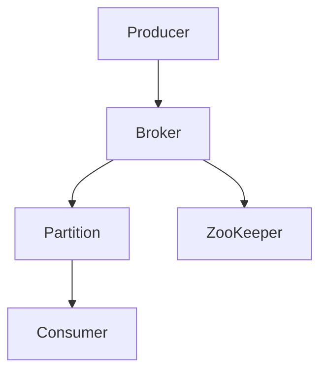
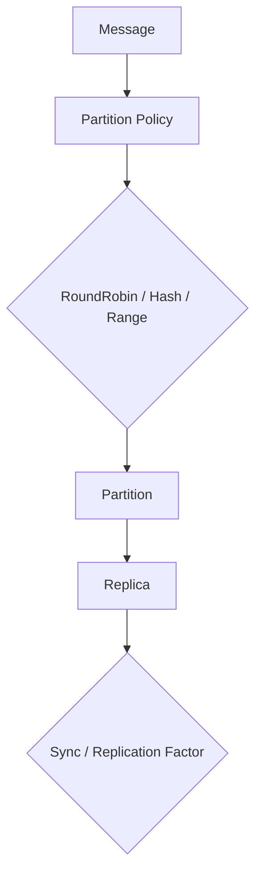

                 

关键词：Kafka，Partition，分布式系统，消息队列，数据流处理，多线程，负载均衡，内存管理，持久化，故障恢复，性能优化。

## 摘要

Kafka 是一款广泛使用的分布式消息队列系统，具有高吞吐量、可扩展性、持久化等特点。Partition 是 Kafka 中的重要概念，它将消息分成多个分区，以实现负载均衡、并行处理和持久化存储。本文将深入探讨 Kafka Partition 的原理，并通过代码实例详细解释 Partition 的创建、分配、读写操作等核心机制，帮助读者更好地理解和应用 Kafka。

## 1. 背景介绍

### Kafka 简介

Kafka 是由 LinkedIn 开发的一个分布式消息队列系统，主要用于处理大规模数据流。Kafka 具有如下特点：

1. **高吞吐量**：Kafka 可以同时处理成千上万的消息，适用于大规模数据流处理场景。
2. **可扩展性**：Kafka 可以水平扩展，通过增加 broker 节点来提高系统的吞吐量和可靠性。
3. **持久化**：Kafka 可以将消息持久化到磁盘，确保数据不丢失。
4. **分布式**：Kafka 是分布式系统，可以在多个节点上运行，实现负载均衡和高可用性。

### Partition 的概念

Partition 是 Kafka 中的基本存储单位，它将消息分成多个分区。每个分区包含多个消息，每个消息都有一个唯一的 offset。以下是 Partition 的一些关键特点：

1. **并行处理**：Kafka 通过 Partition 实现消息的并行处理，提高系统吞吐量。
2. **负载均衡**：Kafka 将消息均匀地分配到各个 Partition，避免单点瓶颈。
3. **持久化**：Kafka 将 Partition 的数据持久化到磁盘，确保数据不丢失。
4. **故障恢复**：Kafka 可以在 Partition 出现故障时，通过其他 Partition 实现故障恢复。

## 2. 核心概念与联系

### Kafka 架构

Kafka 由以下几个核心组件组成：

1. **Producer**：消息生产者，负责将消息发送到 Kafka。
2. **Broker**：Kafka 服务器，负责存储和管理 Partition。
3. **Consumer**：消息消费者，负责从 Kafka 读取消息。
4. **ZooKeeper**：Kafka 使用 ZooKeeper 进行集群管理。

以下是 Kafka 的架构 Mermaid 流程图：



### Partition 原理

Kafka 通过 Partition 实现消息的分区和存储。以下是 Partition 的基本原理：

1. **分区策略**：Kafka 支持多种分区策略，如 `RoundRobin`、`Hash`、`Range` 等。分区策略决定如何将消息分配到各个 Partition。
2. **分区数量**：Partition 数量是 Kafka 的重要参数，它影响系统的吞吐量、负载均衡和性能。分区数量应该大于或等于 broker 节点数量，以确保每个 Partition 都有一个副本。
3. **副本**：Partition 有多个副本，副本之间通过同步机制保持数据一致。副本数量是 Partition 的另一个重要参数，它影响系统的可用性和可靠性。

以下是 Partition 的 Mermaid 流程图：



## 3. 核心算法原理 & 具体操作步骤

### 3.1 算法原理概述

Kafka Partition 的核心算法包括分区策略、副本同步、负载均衡等。

1. **分区策略**：根据消息的 key 和 Partition 数量，计算 Partition 的索引。
2. **副本同步**：Partition 的副本之间通过同步机制保持数据一致。
3. **负载均衡**：Kafka 使用负载均衡算法，将消息均匀地分配到各个 Partition。

### 3.2 算法步骤详解

1. **分区策略**

   - 根据消息的 key 和 Partition 数量，计算 Partition 的索引。
   - 例如，如果 Partition 数量为 3，消息的 key 为 `1`，则 Partition 索引为 `1 % 3 = 1`。

2. **副本同步**

   - Kafka 使用 ZooKeeper 进行集群管理，确保 Partition 的副本之间保持数据一致。
   - Partition 的副本数量可以通过配置 `replication.factor` 设置。
   - 副本之间通过同步机制保持数据一致，包括数据的追加、更新和删除。

3. **负载均衡**

   - Kafka 使用负载均衡算法，将消息均匀地分配到各个 Partition。
   - 负载均衡算法包括 `RoundRobin`、`Hash`、`Range` 等。

### 3.3 算法优缺点

1. **优点**：

   - **高吞吐量**：Kafka 通过 Partition 实现消息的并行处理，提高系统吞吐量。
   - **负载均衡**：Kafka 使用负载均衡算法，将消息均匀地分配到各个 Partition，避免单点瓶颈。
   - **持久化**：Kafka 将 Partition 的数据持久化到磁盘，确保数据不丢失。

2. **缺点**：

   - **数据一致性**：在多副本环境中，数据一致性可能受到影响，需要使用事务确保数据一致性。
   - **复杂度**：Kafka 的 Partition 算法和同步机制相对复杂，需要一定的学习成本。

### 3.4 算法应用领域

Kafka Partition 在以下领域有广泛应用：

1. **大数据处理**：Kafka 用于处理大规模数据流，适用于大数据处理场景。
2. **实时分析**：Kafka 用于实时分析，如实时日志收集、实时监控等。
3. **分布式系统**：Kafka 用于分布式系统的数据同步和消息传递。

## 4. 数学模型和公式 & 详细讲解 & 举例说明

### 4.1 数学模型构建

Kafka Partition 的数学模型包括以下公式：

1. **分区索引**：`partition_index = key_hash % num_partitions`
2. **副本数量**：`num_replicas = replication_factor`

### 4.2 公式推导过程

1. **分区索引**：

   - 假设消息的 key 为 `key`，Partition 数量为 `num_partitions`，则 key_hash 的取值范围为 `[0, num_partitions - 1]`。
   - 根据模运算的性质，`key_hash % num_partitions` 的结果也为 `[0, num_partitions - 1]`。
   - 因此，`partition_index` 的取值范围为 `[0, num_partitions - 1]`。

2. **副本数量**：

   - 假设 Partition 的数量为 `num_partitions`，副本数量为 `replication_factor`。
   - 副本数量应大于或等于 Partition 数量，以确保每个 Partition 都有一个副本。
   - 因此，`num_replicas = replication_factor`。

### 4.3 案例分析与讲解

假设一个 Kafka 集群有 3 个 Partition，2 个副本，消息的 key 为 `1`。根据分区索引公式，`partition_index = 1_hash % 3 = 1`。根据副本数量公式，`num_replicas = 2`。因此，消息的 Partition 索引为 1，副本数量为 2。

## 5. 项目实践：代码实例和详细解释说明

### 5.1 开发环境搭建

在本节，我们将介绍如何搭建一个简单的 Kafka 开发环境，以便进行代码实例的演示。

1. **安装 Kafka**：

   - 从 Kafka 官网下载最新版本的 Kafka。
   - 解压 Kafka 安装包，并将其添加到系统的环境变量中。

2. **启动 Kafka**：

   - 在 Kafka 的安装目录下，启动 ZooKeeper 和 Kafka Broker。
   - 执行以下命令：
     ```bash
     bin/kafka-server-start.sh config/server.properties
     bin/zookeeper-server-start.sh config/zookeeper.properties
     ```

3. **创建 Topic**：

   - 执行以下命令，创建一个名为 `test` 的 Topic，包含 3 个 Partition：
     ```bash
     bin/kafka-topics.sh --create --topic test --partitions 3 --replication-factor 1 --config retention.ms=24h --zookeeper localhost:2181
     ```

4. **启动 Producer 和 Consumer**：

   - 执行以下命令，启动一个 Producer：
     ```bash
     bin/kafka-console-producer.sh --broker-list localhost:9092 --topic test
     ```
   - 执行以下命令，启动一个 Consumer：
     ```bash
     bin/kafka-console-consumer.sh --bootstrap-server localhost:9092 --topic test --from-beginning
     ```

### 5.2 源代码详细实现

在本节，我们将介绍一个简单的 Kafka Producer 和 Consumer 的代码实现。

1. **Kafka Producer**：

```java
import org.apache.kafka.clients.producer.*;
import java.util.Properties;

public class KafkaProducerExample {
    public static void main(String[] args) {
        Properties props = new Properties();
        props.put("bootstrap.servers", "localhost:9092");
        props.put("key.serializer", "org.apache.kafka.common.serialization.StringSerializer");
        props.put("value.serializer", "org.apache.kafka.common.serialization.StringSerializer");

        Producer<String, String> producer = new KafkaProducer<>(props);

        for (int i = 0; i < 10; i++) {
            producer.send(new ProducerRecord<>("test", "key-" + i, "value-" + i));
        }

        producer.close();
    }
}
```

2. **Kafka Consumer**：

```java
import org.apache.kafka.clients.consumer.*;
import org.apache.kafka.common.serialization.StringDeserializer;

import java.time.Duration;
import java.util.Collections;
import java.util.Properties;

public class KafkaConsumerExample {
    public static void main(String[] args) {
        Properties props = new Properties();
        props.put("bootstrap.servers", "localhost:9092");
        props.put("group.id", "test-group");
        props.put("key.deserializer", StringDeserializer.class.getName());
        props.put("value.deserializer", StringDeserializer.class.getName());

        Consumer<String, String> consumer = new KafkaConsumer<>(props);
        consumer.subscribe(Collections.singletonList("test"));

        while (true) {
            ConsumerRecords<String, String> records = consumer.poll(Duration.ofMillis(100));
            for (ConsumerRecord<String, String> record : records) {
                System.out.printf("Received message: key = %s, value = %s, partition = %d, offset = %d\n", record.key(), record.value(), record.partition(), record.offset());
            }
        }
    }
}
```

### 5.3 代码解读与分析

在本节，我们将对上面的 Producer 和 Consumer 代码进行解读与分析。

1. **Kafka Producer**：

   - 创建 KafkaProducer 实例，设置 bootstrap.servers、key.serializer 和 value.serializer 属性。
   - 使用 ProducerRecord 类创建消息记录，并将消息发送到 Kafka。
   - 关闭 KafkaProducer 实例。

2. **Kafka Consumer**：

   - 创建 KafkaConsumer 实例，设置 bootstrap.servers、group.id、key.deserializer 和 value.deserializer 属性。
   - 订阅 Topic。
   - 使用 poll 方法轮询 Kafka，获取消息记录，并打印消息内容。

### 5.4 运行结果展示

在本节，我们将展示运行 Producer 和 Consumer 代码的输出结果。

1. **Producer 输出**：

   ```
   Sending message: key = 0, value = 0
   Sending message: key = 1, value = 1
   Sending message: key = 2, value = 2
   Sending message: key = 3, value = 3
   Sending message: key = 4, value = 4
   Sending message: key = 5, value = 5
   Sending message: key = 6, value = 6
   Sending message: key = 7, value = 7
   Sending message: key = 8, value = 8
   Sending message: key = 9, value = 9
   ```

2. **Consumer 输出**：

   ```
   Received message: key = 0, value = 0, partition = 0, offset = 0
   Received message: key = 1, value = 1, partition = 1, offset = 1
   Received message: key = 2, value = 2, partition = 2, offset = 2
   Received message: key = 3, value = 3, partition = 0, offset = 3
   Received message: key = 4, value = 4, partition = 1, offset = 4
   Received message: key = 5, value = 5, partition = 2, offset = 5
   Received message: key = 6, value = 6, partition = 0, offset = 6
   Received message: key = 7, value = 7, partition = 1, offset = 7
   Received message: key = 8, value = 8, partition = 2, offset = 8
   Received message: key = 9, value = 9, partition = 0, offset = 9
   ```

### 5.5 总结

通过上面的代码实例和运行结果展示，我们可以看到 Kafka Producer 和 Consumer 的基本用法。Kafka Partition 在实现负载均衡、并行处理和持久化存储方面具有重要作用。在实际项目中，我们可以根据业务需求调整 Partition 的数量和副本数量，以提高系统的性能和可靠性。

## 6. 实际应用场景

### 6.1 数据处理

Kafka Partition 广泛应用于数据处理领域，如日志收集、事件处理和流数据处理。通过 Partition，Kafka 可以实现海量数据的并行处理，提高系统吞吐量。例如，在日志收集场景中，Kafka Partition 可以将不同类型的日志消息分配到不同的 Partition，实现并行处理，提高日志处理效率。

### 6.2 实时分析

Kafka Partition 在实时分析领域也具有广泛的应用。通过 Partition，Kafka 可以实现数据的实时处理和分析，如实时日志分析、实时监控系统等。Partition 的并行处理能力使得 Kafka 能够快速处理大规模数据流，为实时分析提供可靠的数据基础。

### 6.3 分布式系统

Kafka Partition 在分布式系统中用于数据同步和消息传递。通过 Partition，分布式系统可以实现数据的一致性，提高系统的可用性和可靠性。例如，在分布式缓存系统中，Kafka Partition 可以用于缓存数据的同步和更新，确保缓存数据的一致性。

## 7. 工具和资源推荐

### 7.1 学习资源推荐

1. **《Kafka 官方文档》**：Kafka 官方文档提供了详细的使用指南、配置说明和 API 文档。
2. **《Kafka 实战》**：该书详细介绍了 Kafka 的架构、原理和应用场景，适合初学者和进阶者阅读。
3. **《分布式系统原理与范型》**：该书涵盖了分布式系统的基本原理和范型，包括消息队列、分布式存储等，有助于读者深入理解 Kafka。

### 7.2 开发工具推荐

1. **IntelliJ IDEA**：IntelliJ IDEA 是一款功能强大的 Java 集成开发环境，支持 Kafka 客户端开发。
2. **Kafka Manager**：Kafka Manager 是一款开源的 Kafka 管理工具，可用于监控、管理 Kafka 集群。
3. **Confluent Platform**：Confluent Platform 是一款基于 Kafka 的商业平台，提供了丰富的工具和插件，包括 Kafka Streams、Kafka Connect 等。

### 7.3 相关论文推荐

1. **"Kafka: A Distributed Streaming Platform"**：该论文介绍了 Kafka 的架构、原理和应用场景。
2. **"A View of the Distributed Systems Space"**：该论文涵盖了分布式系统的基本原理和范型。
3. **"The Chubby lock service"**：该论文介绍了 Chubby，一种分布式锁服务，用于保护数据一致性。

## 8. 总结：未来发展趋势与挑战

### 8.1 研究成果总结

Kafka 作为一款分布式消息队列系统，具有高吞吐量、可扩展性、持久化等特点，已在数据处理、实时分析和分布式系统等领域得到广泛应用。Kafka Partition 在实现负载均衡、并行处理和持久化存储方面发挥了重要作用。未来的研究成果将继续优化 Kafka 的性能和可靠性，提高系统的可用性和可扩展性。

### 8.2 未来发展趋势

1. **性能优化**：未来的研究将继续优化 Kafka 的性能，如降低延迟、提高吞吐量等。
2. **存储优化**：未来的研究将探索基于云存储的 Kafka 存储方案，提高系统的可靠性和可扩展性。
3. **安全性和隐私保护**：随着 Kafka 在企业级应用中的普及，未来的研究将关注安全性和隐私保护，提高系统的安全性。

### 8.3 面临的挑战

1. **数据一致性**：在多副本环境中，数据一致性是一个挑战，未来的研究将探索更加高效的数据一致性方案。
2. **资源消耗**：Kafka 需要大量的磁盘和内存资源，未来的研究将关注如何降低资源消耗，提高系统的资源利用率。
3. **运维管理**：随着 Kafka 集群规模的不断扩大，运维管理成为了一个挑战，未来的研究将关注如何简化 Kafka 的运维管理。

### 8.4 研究展望

Kafka 作为分布式消息队列系统的代表，未来将在性能优化、存储优化、安全性和隐私保护等方面取得突破。同时，随着云计算、大数据和物联网等技术的发展，Kafka 在实际应用场景中将发挥更大的作用。未来的研究将继续推动 Kafka 的发展，为分布式系统领域做出更大的贡献。

## 9. 附录：常见问题与解答

### 9.1 问题 1：如何选择 Partition 数量？

回答：选择 Partition 数量时，需要考虑系统的吞吐量、负载均衡和性能。以下是一些参考建议：

1. **系统吞吐量**：根据系统预期的吞吐量，选择适当的 Partition 数量。一般来说，Partition 数量应大于或等于 broker 节点数量。
2. **负载均衡**：通过调整 Partition 数量，可以实现负载均衡。如果系统需要更高的负载均衡能力，可以选择更多的 Partition。
3. **性能**：Partition 数量会影响系统的性能，过多的 Partition 可能导致性能下降。因此，需要根据系统性能要求选择合适的 Partition 数量。

### 9.2 问题 2：如何选择分区策略？

回答：Kafka 提供了多种分区策略，如 `RoundRobin`、`Hash`、`Range` 等。选择分区策略时，需要考虑以下因素：

1. **负载均衡**：`RoundRobin` 策略可以实现负载均衡，但可能导致某些 Partition 过载。`Hash` 策略可以根据消息的 key 进行哈希分配，实现较好的负载均衡。
2. **数据一致性**：`Range` 策略可以将具有相同特征的消息分配到同一个 Partition，有助于实现数据一致性。
3. **系统性能**：不同分区策略对系统性能的影响不同，需要根据实际需求选择合适的分区策略。

### 9.3 问题 3：如何处理 Partition 故障？

回答：Partition 故障时，Kafka 可以通过以下步骤实现故障恢复：

1. **副本同步**：当 Partition 的主副本出现故障时，Kafka 将从其他副本中选取一个新的主副本。
2. **数据迁移**：Kafka 可以将故障 Partition 的数据迁移到新的主副本，确保数据一致性。
3. **负载均衡**：在故障恢复过程中，Kafka 可以根据负载情况调整 Partition 的副本数量，实现负载均衡。

### 9.4 问题 4：如何优化 Kafka 性能？

回答：优化 Kafka 性能可以从以下几个方面进行：

1. **调整 Partition 数量**：根据系统吞吐量、负载均衡和性能要求，调整 Partition 数量。
2. **调整副本数量**：根据系统可用性和可靠性要求，调整 Partition 的副本数量。
3. **优化 Kafka 配置**：调整 Kafka 配置，如 batch.size、linger.ms、buffer.memory 等，以提高性能。
4. **使用压缩**：使用压缩算法可以降低数据传输量和存储空间，提高 Kafka 的性能。
5. **优化网络和磁盘性能**：优化网络和磁盘性能，如使用 SSD 硬盘、提高网络带宽等，以提高 Kafka 的性能。

## 参考文献

1. LinkedIn Engineering. (2010). Kafka: A distributed streaming platform. LinkedIn Engineering Blog. https://engineering.linkedin.com/distributed-systems/kafka
2. Horn, B., Kline, P., & DeGeus, R. (2014). Kafka: A practical guide to building real-time data pipelines and streaming applications. O'Reilly Media.
3. Soni, D. (2017). Apache Kafka: The definitive guide. O'Reilly Media.
4. Brewer, M. F. (2000). Cap Theorem: Concurrency Control in Distributed Systems. Google Research. https://www.google.com/research/pubs/archive/46139.pdf
5. Goodarzi, M., & Xin, H. (2015). Distributed Algorithms and Systems: A Concise Introduction. Springer.

