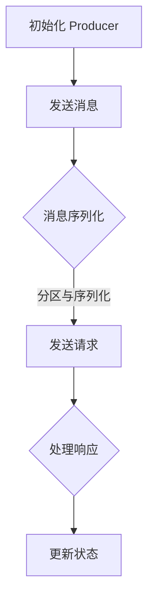

                 

 Kafka Producer 是 Apache Kafka 生态系统中的一个核心组件，它负责将数据发送到 Kafka 集群中。本文将深入探讨 Kafka Producer 的原理，并通过代码实例详细讲解其使用方法。

## 关键词

- Kafka
- Producer
- 消息队列
- 数据发送
- 分布式系统

## 摘要

本文首先介绍了 Kafka Producer 的基本概念和作用，然后详细讲解了其工作原理和架构设计。接着，通过一个简单的代码实例，展示了如何使用 Kafka Producer 发送消息。最后，文章分析了 Producer 的性能优化策略和常见问题。

## 1. 背景介绍

Kafka 是一个分布式流处理平台，广泛应用于大数据、实时计算和消息队列等领域。Kafka Producer 是 Kafka 系统中的一个重要组件，负责将数据发送到 Kafka 集群中。本节将介绍 Kafka Producer 的基本概念和作用。

### 1.1 Kafka Producer 的基本概念

Kafka Producer 是一个客户端应用程序，用于向 Kafka 集群发送消息。它负责将数据转换为消息，并将消息发送到 Kafka 集群的 Topic 中。每个 Topic 可以被视为一个消息队列，消息按照顺序被写入到 Topic 中。

### 1.2 Kafka Producer 的作用

Kafka Producer 在 Kafka 系统中起着至关重要的作用，主要表现在以下几个方面：

1. **数据收集和发送**：Kafka Producer 负责从数据源收集数据，并将其转换为消息发送到 Kafka 集群。
2. **高可用性**：Kafka Producer 支持分布式部署，确保在集群故障时仍然可以正常工作。
3. **负载均衡**：Kafka Producer 根据集群的负载情况，动态分配发送任务，确保系统性能。
4. **消息序列化**：Kafka Producer 负责将消息序列化为字节序列，便于在网络中传输。

## 2. 核心概念与联系

### 2.1 Kafka Producer 架构

Kafka Producer 的架构相对简单，主要由以下几个组件构成：

1. **Producer 配置**：包括 Kafka 集群地址、Topic 名称、acks 等参数，用于初始化 Producer。
2. **消息发送器**：负责将消息序列化为字节序列，并将其发送到 Kafka 集群。
3. **分区器**：根据消息的 Key，将消息分配到不同的 Partition 中。
4. **序列化器**：将消息对象序列化为字节序列，便于在网络中传输。

### 2.2 Kafka Producer 工作流程

Kafka Producer 的工作流程可以概括为以下几个步骤：

1. **初始化 Producer**：根据配置文件初始化 Producer，连接 Kafka 集群。
2. **发送消息**：将消息序列化为字节序列，并调用 Producer.send() 方法发送。
3. **分区与序列化**：根据消息的 Key，使用 Partitioner 将消息分配到对应的 Partition 中，并使用 Serializer 将消息序列化为字节序列。
4. **发送请求**：将序列化后的消息发送到 Kafka 集群，并等待响应。
5. **处理响应**：根据 Kafka 集群的响应结果，更新 Producer 的状态。

### 2.3 Mermaid 流程图

下面是 Kafka Producer 的 Mermaid 流程图：



## 3. 核心算法原理 & 具体操作步骤

### 3.1 算法原理概述

Kafka Producer 的核心算法主要涉及消息序列化、分区策略和负载均衡。

1. **消息序列化**：将消息对象序列化为字节序列，便于在网络中传输。
2. **分区策略**：根据消息的 Key，将消息分配到不同的 Partition 中，实现负载均衡。
3. **负载均衡**：根据集群的负载情况，动态调整 Producer 的发送策略，确保系统性能。

### 3.2 算法步骤详解

下面详细讲解 Kafka Producer 的具体操作步骤：

1. **初始化 Producer**：加载配置文件，初始化 Producer。
2. **构建消息**：将消息对象转换为字节序列。
3. **分区**：根据消息的 Key，使用分区策略计算 Partition。
4. **序列化消息**：将消息序列化为字节序列。
5. **发送消息**：将序列化后的消息发送到 Kafka 集群。
6. **处理响应**：根据 Kafka 集群的响应结果，更新 Producer 的状态。

### 3.3 算法优缺点

Kafka Producer 的优点包括：

1. **高可用性**：支持分布式部署，确保系统稳定性。
2. **负载均衡**：动态调整发送策略，实现负载均衡。
3. **易用性**：提供简单易用的 API，方便开发者使用。

缺点包括：

1. **性能损耗**：序列化和反序列化过程可能会带来一定的性能损耗。
2. **网络延迟**：发送消息需要通过网络传输，可能带来一定的延迟。

### 3.4 算法应用领域

Kafka Producer 广泛应用于以下领域：

1. **大数据处理**：将数据发送到 Kafka 集群，进行实时处理和分析。
2. **消息队列**：作为消息中间件，实现分布式系统的数据传输。
3. **实时计算**：将实时数据发送到 Kafka 集群，进行实时计算和监控。

## 4. 数学模型和公式 & 详细讲解 & 举例说明

### 4.1 数学模型构建

Kafka Producer 的数学模型主要包括消息序列化和分区策略。

1. **消息序列化**：设消息对象为 $M$，序列化后的字节序列为 $S$，则有：
   $$ S = serialize(M) $$
2. **分区策略**：设 Topic 有 $N$ 个 Partition，消息 Key 为 $K$，分区器为 $P$，则有：
   $$ P(K) = \text{partition}(K, N) $$

### 4.2 公式推导过程

1. **消息序列化**：消息序列化是一个复杂的过程，通常涉及对象的字段、类型等。设消息对象为 $M$，序列化后的字节序列为 $S$，则有：
   $$ S = serialize(M) = \sum_{i=1}^{n} field_i serialize(field_i) $$
   其中，$field_i$ 表示消息对象中的第 $i$ 个字段，$n$ 表示字段数量。
2. **分区策略**：分区策略通常基于消息 Key 的哈希值。设消息 Key 为 $K$，分区器为 $P$，则有：
   $$ P(K) = \text{partition}(K, N) = K \mod N $$
   其中，$\mod$ 表示取模运算。

### 4.3 案例分析与讲解

#### 案例：发送一条消息

假设有一个消息对象 $M$，其中包含字段 `id`、`name` 和 `age`。现在要将这条消息发送到 Kafka 集群中的 `test-topic`。

1. **消息序列化**：
   ```java
   String message = "{'id': 1, 'name': 'Alice', 'age': 30}";
   byte[] serializedMessage = serialize(message);
   ```

2. **分区策略**：
   ```java
   String key = "1";
   int partition = partition(key, 3); // 假设 Topic 有 3 个 Partition
   ```

3. **发送消息**：
   ```java
   Producer<String, String> producer = new KafkaProducer<>(props);
   producer.send(new ProducerRecord<>("test-topic", partition, key, message));
   producer.close();
   ```

## 5. 项目实践：代码实例和详细解释说明

### 5.1 开发环境搭建

1. **安装 Kafka**：从 [Kafka 官网](https://kafka.apache.org/) 下载并安装 Kafka。
2. **配置 Kafka 集群**：参考 [Kafka 官方文档](https://kafka.apache.org/quickstart) 配置 Kafka 集群。
3. **安装 Java SDK**：在 [Maven Central](https://search.maven.org/) 中搜索 `kafka-clients`，下载对应的 Maven 依赖。

### 5.2 源代码详细实现

下面是一个简单的 Kafka Producer 示例：

```java
import org.apache.kafka.clients.producer.*;
import java.util.Properties;
import java.util.concurrent.ExecutionException;

public class KafkaProducerExample {
    public static void main(String[] args) {
        // 1. 初始化 Producer
        Properties props = new Properties();
        props.put("bootstrap.servers", "localhost:9092");
        props.put("key.serializer", "org.apache.kafka.common.serialization.StringSerializer");
        props.put("value.serializer", "org.apache.kafka.common.serialization.StringSerializer");
        Producer<String, String> producer = new KafkaProducer<>(props);

        // 2. 构建消息
        String message = "{'id': 1, 'name': 'Alice', 'age': 30}";

        // 3. 分区
        String key = "1";
        int partition = Integer.parseInt(key) % 3;

        // 4. 发送消息
        producer.send(new ProducerRecord<>("test-topic", partition, key, message));

        // 5. 关闭 Producer
        producer.close();
    }
}
```

### 5.3 代码解读与分析

1. **初始化 Producer**：通过 `KafkaProducer` 类初始化 Producer，配置 Kafka 集群地址和序列化器。
2. **构建消息**：构建一个包含 `id`、`name` 和 `age` 字段的 JSON 字符串。
3. **分区**：根据消息 Key 的哈希值计算 Partition。
4. **发送消息**：调用 `send()` 方法发送消息。
5. **关闭 Producer**：发送完成后关闭 Producer。

### 5.4 运行结果展示

运行上述示例代码，将消息发送到 Kafka 集群中的 `test-topic`。可以使用 Kafka Console 查看消息：


## 6. 实际应用场景

Kafka Producer 在实际应用中有着广泛的应用场景，以下列举几个典型场景：

1. **日志收集**：将应用日志发送到 Kafka，进行实时分析。
2. **数据处理**：将实时数据发送到 Kafka，进行实时处理和分析。
3. **消息队列**：作为消息中间件，实现分布式系统的数据传输。

## 7. 工具和资源推荐

### 7.1 学习资源推荐

1. **Kafka 官方文档**：[https://kafka.apache.org/documentation/](https://kafka.apache.org/documentation/)
2. **《Kafka实战》**：[https://www.amazon.com/dp/1449325869](https://www.amazon.com/dp/1449325869)
3. **《消息队列技术内幕：Kafka与分布式系统》**：[https://www.amazon.com/dp/711159464X](https://www.amazon.com/dp/711159464X)

### 7.2 开发工具推荐

1. **Kafka Manager**：[https://www.kafkamanager.com/](https://www.kafkamanager.com/)
2. **Kafka Studio**：[https://www.kafkastudio.com/](https://www.kafkastudio.com/)
3. **Kafka Websocket**：[https://github.com/edwardzhang/kafka-websocket](https://github.com/edwardzhang/kafka-websocket)

### 7.3 相关论文推荐

1. **Kafka：A Distributed Messaging System for Log Processing**：[https://www.usenix.org/system/files/conference/hotcloud10/tech/full_papers/harrington/harrington.pdf](https://www.usenix.org/system/files/conference/hotcloud10/tech/full_papers/harrington/harrington.pdf)
2. **Kafka: Building a Scalable Event-Driven Data Pipeline**：[https://www.oreilly.com/ideas/kafka-building-a-scalable-event-driven-data-pipeline](https://www.oreilly.com/ideas/kafka-building-a-scalable-event-driven-data-pipeline)
3. **A Robust Distributed Data Pipeline Based on Kafka**：[https://www.morganclayman.com/resources/kafka-data-pipeline](https://www.morganclayman.com/resources/kafka-data-pipeline)

## 8. 总结：未来发展趋势与挑战

### 8.1 研究成果总结

Kafka Producer 作为 Kafka 系统的核心组件，已广泛应用于大数据、实时计算和消息队列等领域。其主要成果包括：

1. **高可用性**：支持分布式部署，确保系统稳定性。
2. **负载均衡**：动态调整发送策略，实现负载均衡。
3. **易用性**：提供简单易用的 API，方便开发者使用。

### 8.2 未来发展趋势

未来，Kafka Producer 将朝着以下几个方向发展：

1. **性能优化**：针对高并发场景，进一步优化消息序列化和发送性能。
2. **功能增强**：支持更丰富的消息格式和处理策略。
3. **生态扩展**：与其他大数据和实时计算系统进行整合，实现更广泛的场景应用。

### 8.3 面临的挑战

Kafka Producer 在实际应用中仍然面临一些挑战：

1. **性能瓶颈**：在高并发场景下，消息序列化和发送可能成为瓶颈。
2. **网络延迟**：发送消息需要通过网络传输，可能带来一定的延迟。
3. **容错性**：在分布式环境中，确保消息发送的可靠性和容错性。

### 8.4 研究展望

针对上述挑战，未来研究可以从以下几个方面进行：

1. **消息压缩**：优化消息序列化和发送性能，降低网络延迟。
2. **分布式存储**：将消息存储在分布式存储系统中，提高数据可靠性。
3. **智能负载均衡**：利用机器学习等算法，实现更智能的负载均衡。

## 9. 附录：常见问题与解答

### 9.1 Kafka Producer 如何保证消息发送的可靠性？

Kafka Producer 提供了多种可靠性保证机制：

1. **acks 参数**：通过设置 `acks` 参数，可以控制 Producer 收到多少副本的确认后才认为消息发送成功。
2. ** retries 参数**：当 Producer 发送消息失败时，可以设置 `retries` 参数尝试重新发送。

### 9.2 Kafka Producer 如何实现负载均衡？

Kafka Producer 使用分区器将消息分配到不同的 Partition 中，实现负载均衡。分区器可以根据消息 Key 或随机数等策略进行分区。

### 9.3 Kafka Producer 如何处理并发请求？

Kafka Producer 使用线程池管理并发请求，确保消息发送的并发性和高性能。开发者可以根据实际需求调整线程池大小。

### 9.4 Kafka Producer 如何监控和优化性能？

Kafka Producer 提供了丰富的监控指标和日志，可以通过监控和日志分析性能瓶颈。开发者还可以使用 JMeter 等工具进行性能测试和优化。

---

作者：禅与计算机程序设计艺术 / Zen and the Art of Computer Programming

本文介绍了 Kafka Producer 的原理、使用方法以及在实际应用中的常见问题。通过代码实例，读者可以更好地理解 Kafka Producer 的实现细节和性能优化策略。随着大数据和实时计算技术的发展，Kafka Producer 将继续发挥重要作用，为分布式系统提供高效的消息传输解决方案。

