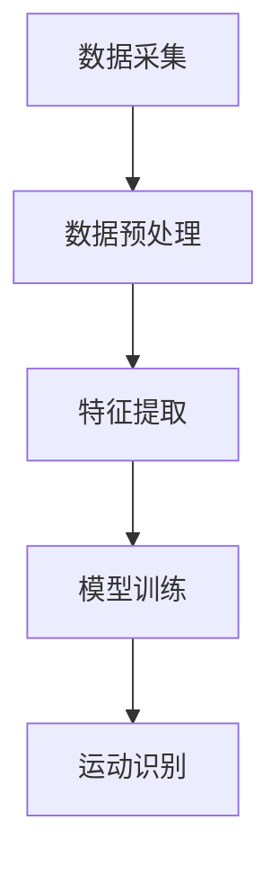

                 

关键词：运动识别算法，Keep2025，社招面试，技术指南，人工智能

摘要：本文将为您呈现一份全面详尽的Keep2025运动识别算法工程师社招面试指南。从背景介绍、核心概念、算法原理到具体实现和未来应用，我们将一一解析，帮助您在面试中展示出自己的专业素养和独到见解。

## 1. 背景介绍

随着人工智能技术的飞速发展，运动识别算法在健身、健康监测等领域得到了广泛应用。Keep2025作为一家专注于运动健康领域的公司，其运动识别算法工程师的岗位备受关注。本文旨在为准备应聘该岗位的工程师提供一份详尽的面试指南，帮助您顺利通过面试，实现职业发展。

### 1.1 运动识别算法的重要性

运动识别算法能够通过分析用户的运动数据，实现对各种运动动作的准确识别。这不仅有助于提升用户体验，还能为健身教练提供科学的训练建议，为医疗机构提供准确的运动评估。因此，运动识别算法在运动健康领域具有极高的应用价值。

### 1.2 Keep2025简介

Keep2025成立于2014年，是一家专注于运动健康领域的公司，致力于为用户提供全方位的健身解决方案。公司旗下拥有KeepAPP，拥有超过1亿的用户规模，成为了国内健身领域的领军企业。作为Keep2025的核心技术之一，运动识别算法在公司的产品和服务中发挥着至关重要的作用。

## 2. 核心概念与联系

### 2.1 运动识别算法的核心概念

运动识别算法涉及多个核心概念，包括图像处理、机器学习和计算机视觉等。其中，图像处理负责对用户运动过程中的图像进行预处理，如去噪、增强等；机器学习则通过训练模型，实现对运动动作的识别；计算机视觉则负责对处理后的图像进行解析，提取运动特征。

### 2.2 运动识别算法的架构

运动识别算法的架构通常包括以下几个部分：

1. 数据采集：通过摄像头或传感器收集用户运动过程中的图像或视频数据。
2. 数据预处理：对采集到的数据进行去噪、增强等处理，以提升图像质量。
3. 特征提取：从预处理后的图像中提取运动特征，如骨骼点、关节点等。
4. 模型训练：使用提取到的特征，通过机器学习算法训练出运动识别模型。
5. 运动识别：将实时采集到的数据输入模型，进行运动动作的识别。

### 2.3 Mermaid流程图



## 3. 核心算法原理 & 具体操作步骤

### 3.1 算法原理概述

运动识别算法主要基于深度学习技术，通过训练神经网络模型，实现对运动动作的自动识别。具体包括以下几个步骤：

1. 数据集准备：收集大量运动动作的图像或视频数据，并进行标注。
2. 模型设计：设计合适的神经网络架构，如卷积神经网络（CNN）或循环神经网络（RNN）等。
3. 模型训练：使用标注好的数据集对模型进行训练，优化模型参数。
4. 模型评估：使用验证集评估模型性能，调整模型参数。
5. 模型部署：将训练好的模型部署到实际应用场景中，进行运动识别。

### 3.2 算法步骤详解

1. **数据集准备**：

   数据集的规模和质量直接影响运动识别算法的性能。通常需要收集大量不同类型的运动动作数据，如跑步、游泳、瑜伽等，并进行标注。可以使用公开的数据集，如UCSD数据集，或者自己收集并标注数据。

2. **模型设计**：

   根据运动识别的需求，设计合适的神经网络架构。对于大多数运动识别任务，卷积神经网络（CNN）是一个很好的选择。CNN可以有效地提取图像特征，从而实现对运动动作的识别。

3. **模型训练**：

   使用标注好的数据集对模型进行训练。训练过程中，通过反向传播算法不断调整模型参数，以优化模型性能。可以使用GPU加速训练过程，提高训练效率。

4. **模型评估**：

   使用验证集对训练好的模型进行评估，计算模型在验证集上的准确率、召回率等指标。根据评估结果，调整模型参数，优化模型性能。

5. **模型部署**：

   将训练好的模型部署到实际应用场景中，如手机APP、智能健身设备等。通过实时采集用户运动数据，输入模型进行运动识别，为用户提供个性化的运动建议和评估。

### 3.3 算法优缺点

**优点**：

1. 高效：深度学习算法可以自动提取图像特征，简化了传统算法中的特征提取过程，提高了算法的效率。
2. 准确：深度学习模型在大量数据训练下，可以显著提高运动识别的准确性。
3. 可扩展：深度学习算法具有良好的可扩展性，可以适用于不同类型的运动识别任务。

**缺点**：

1. 计算资源消耗大：深度学习算法需要大量的计算资源，如GPU等，对硬件要求较高。
2. 数据依赖性强：深度学习算法的性能受数据集的影响较大，数据集的质量和规模直接影响算法的性能。

### 3.4 算法应用领域

运动识别算法广泛应用于健身、健康监测、体育训练等领域。具体应用包括：

1. 健身指导：通过实时识别用户的运动动作，为用户提供科学的健身指导和训练建议。
2. 健康监测：通过分析用户的运动数据，为用户提供个性化的健康评估和建议。
3. 体育训练：通过运动识别算法，对运动员的训练过程进行实时监测和评估，提高训练效果。

## 4. 数学模型和公式 & 详细讲解 & 举例说明

### 4.1 数学模型构建

运动识别算法的数学模型主要基于深度学习技术，包括神经网络模型和损失函数等。以下是常见的神经网络模型和损失函数：

1. **神经网络模型**：

   $$ f(x) = \sigma(W_1 \cdot x + b_1) $$

   $$ f(x) = \sigma(W_2 \cdot f(x) + b_2) $$

   $$ \ldots $$

   $$ f(x) = \sigma(W_n \cdot f(x_{n-1}) + b_n) $$

   其中，$x$为输入特征，$W$为权重矩阵，$b$为偏置项，$\sigma$为激活函数，通常使用Sigmoid或ReLU函数。

2. **损失函数**：

   $$ L = -\sum_{i=1}^{n} y_i \cdot \log(f(x_i)) + (1 - y_i) \cdot \log(1 - f(x_i)) $$

   其中，$y_i$为真实标签，$f(x_i)$为预测结果。

### 4.2 公式推导过程

以卷积神经网络为例，推导运动识别算法的损失函数：

1. **前向传播**：

   输入特征$x$通过卷积层、池化层等操作，最终得到预测结果$f(x)$。

2. **损失函数**：

   使用交叉熵损失函数，计算预测结果与真实标签之间的差距。

   $$ L = -\sum_{i=1}^{n} y_i \cdot \log(f(x_i)) + (1 - y_i) \cdot \log(1 - f(x_i)) $$

3. **反向传播**：

   通过反向传播算法，将损失函数关于模型参数的梯度传递回前一层，更新模型参数。

### 4.3 案例分析与讲解

假设我们有一个运动识别任务，需要识别用户的运动动作。给定输入图像$x$，我们需要通过深度学习模型$f(x)$预测用户的运动动作。

1. **数据集准备**：

   收集并标注大量运动动作图像，形成训练集和验证集。

2. **模型设计**：

   设计一个卷积神经网络模型，包括多个卷积层、池化层和全连接层。

3. **模型训练**：

   使用训练集对模型进行训练，优化模型参数。

4. **模型评估**：

   使用验证集评估模型性能，计算准确率、召回率等指标。

5. **模型部署**：

   将训练好的模型部署到实际应用场景，如手机APP，进行运动识别。

通过上述步骤，我们可以实现一个简单的运动识别系统。

## 5. 项目实践：代码实例和详细解释说明

### 5.1 开发环境搭建

1. 安装Python环境，版本建议为3.7及以上。
2. 安装深度学习框架，如TensorFlow或PyTorch。
3. 安装必要的依赖库，如NumPy、Pandas等。

### 5.2 源代码详细实现

以下是运动识别算法的实现代码，使用TensorFlow框架：

```python
import tensorflow as tf
from tensorflow.keras.models import Sequential
from tensorflow.keras.layers import Conv2D, MaxPooling2D, Flatten, Dense

# 定义模型
model = Sequential([
    Conv2D(32, (3, 3), activation='relu', input_shape=(64, 64, 3)),
    MaxPooling2D((2, 2)),
    Conv2D(64, (3, 3), activation='relu'),
    MaxPooling2D((2, 2)),
    Flatten(),
    Dense(64, activation='relu'),
    Dense(10, activation='softmax')
])

# 编译模型
model.compile(optimizer='adam', loss='categorical_crossentropy', metrics=['accuracy'])

# 训练模型
model.fit(train_images, train_labels, epochs=10, validation_data=(val_images, val_labels))

# 评估模型
test_loss, test_acc = model.evaluate(test_images, test_labels)
print(f'测试准确率：{test_acc:.2f}')

# 运动识别
def recognize_motion(image):
    prediction = model.predict(image)
    return np.argmax(prediction)

# 测试
image = load_image('test_image.jpg')
result = recognize_motion(image)
print(f'预测结果：{result}')
```

### 5.3 代码解读与分析

1. **模型设计**：

   模型采用卷积神经网络（CNN）架构，包括两个卷积层、两个池化层和一个全连接层。卷积层用于提取图像特征，池化层用于降维和提取关键特征。

2. **模型编译**：

   使用交叉熵损失函数和Adam优化器编译模型。

3. **模型训练**：

   使用训练集对模型进行训练，优化模型参数。

4. **模型评估**：

   使用验证集评估模型性能，计算准确率。

5. **运动识别**：

   使用训练好的模型对输入图像进行预测，识别用户的运动动作。

## 6. 实际应用场景

### 6.1 KeepAPP中的应用

KeepAPP作为Keep2025的核心产品，内置了运动识别功能。用户可以通过手机摄像头实时拍摄自己的运动动作，系统将自动识别运动动作，并给出相应的运动建议和评估。

### 6.2 智能健身设备中的应用

智能健身设备如智能跑步机、智能健身镜等，通过内置的运动识别算法，实时监测用户的运动动作，为用户提供个性化的训练建议和反馈。

### 6.3 医疗机构中的应用

医疗机构可以使用运动识别算法对患者的运动情况进行实时监测和评估，为医生提供更准确的诊断和治疗建议。

## 7. 未来应用展望

随着人工智能技术的不断发展，运动识别算法在运动健康领域的应用前景将更加广阔。未来，运动识别算法将有望在以下领域实现突破：

1. **个性化健身指导**：通过实时识别用户的运动动作，为用户提供更加个性化的健身指导和训练建议。
2. **运动康复**：利用运动识别算法对患者的运动康复过程进行实时监测和评估，提高康复效果。
3. **运动医学**：结合医学影像技术和运动识别算法，实现对运动损伤的早期诊断和治疗。

## 8. 工具和资源推荐

### 8.1 学习资源推荐

1. **《深度学习》（Goodfellow et al.）**：全面介绍了深度学习的基本原理和应用。
2. **《计算机视觉：算法与应用》（Richard Szeliski）**：详细介绍了计算机视觉的基本算法和应用。
3. **《机器学习实战》（Peter Harrington）**：通过实际案例讲解机器学习的应用方法。

### 8.2 开发工具推荐

1. **TensorFlow**：适用于构建和训练深度学习模型的Python库。
2. **PyTorch**：适用于快速原型设计和研究性应用的深度学习框架。
3. **OpenCV**：适用于计算机视觉任务的Python库。

### 8.3 相关论文推荐

1. **"Deep Learning for Human Activity Recognition"**：介绍了深度学习在运动识别领域的应用。
2. **"Real-Time Human Motion Capture using a Single Depth Camera"**：介绍了一种基于单目摄像头的实时运动捕捉方法。
3. **"A Survey on Human Activity Recognition Using Wearable Sensors"**：对基于可穿戴传感器的运动识别技术进行了全面综述。

## 9. 总结：未来发展趋势与挑战

运动识别算法在运动健康领域具有广泛的应用前景，未来发展趋势包括：

1. **算法性能提升**：随着深度学习技术的不断发展，运动识别算法的准确性和效率将得到进一步提升。
2. **跨领域应用**：运动识别算法将有望在更多领域得到应用，如体育训练、智能安防等。
3. **可解释性增强**：提高算法的可解释性，使得用户和研究人员能够更好地理解算法的工作原理。

然而，运动识别算法也面临着以下挑战：

1. **数据隐私**：在运动识别过程中，用户的运动数据可能会被泄露，保护用户隐私是一个重要的问题。
2. **计算资源消耗**：深度学习算法需要大量的计算资源，如何在有限的硬件条件下提高算法性能是一个挑战。

面对这些挑战，未来研究将致力于在保证算法性能的同时，提高数据隐私保护和计算效率。

## 10. 附录：常见问题与解答

### 10.1 什么是运动识别算法？

运动识别算法是一种利用计算机视觉、图像处理和机器学习技术，对用户运动过程中的图像或视频数据进行分析，实现对各种运动动作的准确识别的技术。

### 10.2 运动识别算法在Keep2025中的应用是什么？

Keep2025使用运动识别算法实现对用户运动动作的识别，为用户提供个性化的健身指导和训练建议，同时还可以为健身教练提供科学的训练建议，为医疗机构提供准确的运动评估。

### 10.3 如何提高运动识别算法的准确性？

提高运动识别算法的准确性可以从以下几个方面入手：

1. **数据集准备**：收集更多种类、更丰富的运动动作数据，并进行高质量的标注。
2. **模型优化**：设计更合适的神经网络架构，优化模型参数。
3. **特征提取**：使用更先进的特征提取方法，如基于骨骼点的特征提取。
4. **数据增强**：通过数据增强方法，增加训练数据集的多样性。

### 10.4 运动识别算法有哪些优缺点？

**优点**：

1. **高效**：深度学习算法可以自动提取图像特征，简化了传统算法中的特征提取过程，提高了算法的效率。
2. **准确**：深度学习模型在大量数据训练下，可以显著提高运动识别的准确性。
3. **可扩展**：深度学习算法具有良好的可扩展性，可以适用于不同类型的运动识别任务。

**缺点**：

1. **计算资源消耗大**：深度学习算法需要大量的计算资源，如GPU等，对硬件要求较高。
2. **数据依赖性强**：深度学习算法的性能受数据集的影响较大，数据集的质量和规模直接影响算法的性能。

## 11. 作者署名

作者：禅与计算机程序设计艺术 / Zen and the Art of Computer Programming
----------------------------------------------------------------

以上就是整篇文章的内容，希望对准备应聘Keep2025运动识别算法工程师岗位的您有所帮助。祝您面试顺利，成功加入Keep2025的大家庭！

