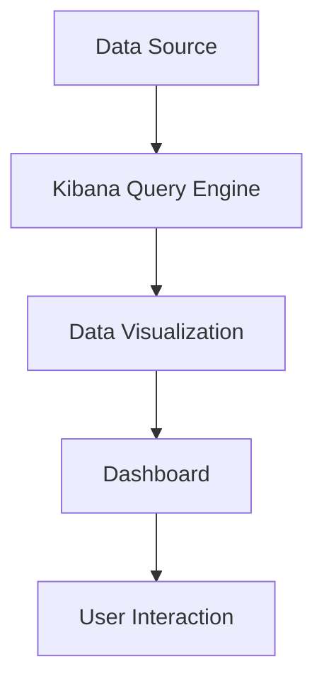

                 

关键词：Kibana、数据分析、日志管理、可视化、Elastic Stack、开源工具

> 摘要：本文将深入探讨Kibana的核心原理，通过详细的代码实例讲解，帮助读者理解Kibana的强大功能和操作流程。我们将从Kibana在Elastic Stack中的角色开始，逐步介绍其架构、核心算法、数学模型，并通过实际项目实践，展示Kibana的强大数据分析和可视化能力。

## 1. 背景介绍

Kibana是一个开源的数据可视化和分析工具，它是Elastic Stack的重要组成部分。Elastic Stack是一个强大的开源工具集，用于收集、存储、分析和可视化数据。它包括三个核心组件：Elasticsearch、Logstash和Kibana。Kibana提供了丰富的数据可视化功能，使得用户能够轻松地理解和分析复杂数据。

在现代IT运维、安全监控和业务分析中，Kibana已经成为不可或缺的工具。它支持多种数据源，如Elasticsearch、MySQL、MongoDB等，并能够通过强大的查询引擎和可视化库，生成实时、动态的图表和报表。

## 2. 核心概念与联系

### 2.1 Kibana在Elastic Stack中的角色

Elastic Stack是一个强大的开源工具集，它由Elasticsearch、Logstash和Kibana组成。Kibana作为Elastic Stack的数据可视化引擎，负责将Elasticsearch存储的数据转换成直观的图表和报表。

### 2.2 Kibana的核心架构

Kibana的核心架构包括以下几个部分：

- **数据源管理**：Kibana支持多种数据源，如Elasticsearch、MySQL、MongoDB等。用户可以通过配置文件或Web界面，轻松添加和管理数据源。
- **查询引擎**：Kibana的查询引擎基于Elasticsearch，能够执行复杂的查询操作，如聚合查询、过滤查询等。
- **可视化库**：Kibana使用丰富的可视化库，如D3.js、Echarts等，生成各种类型的图表，如柱状图、折线图、饼图等。
- **仪表板**：Kibana的仪表板是用户交互的核心部分，用户可以在仪表板上添加、修改和定制各种图表和报表。

### 2.3 Mermaid流程图

下面是Kibana在Elastic Stack中的流程图：



## 3. 核心算法原理 & 具体操作步骤

### 3.1 算法原理概述

Kibana的核心算法原理主要包括数据查询和可视化。数据查询基于Elasticsearch的查询语言，支持各种复杂的查询操作。可视化则基于D3.js和Echarts等可视化库，能够生成各种类型的图表。

### 3.2 算法步骤详解

#### 3.2.1 数据查询步骤

1. **定义查询条件**：根据业务需求，定义查询条件，如日期范围、关键字等。
2. **执行查询**：使用Kibana的查询引擎，执行查询操作。
3. **获取查询结果**：获取查询结果，包括文档、聚合结果等。

#### 3.2.2 数据可视化步骤

1. **选择可视化类型**：根据数据类型和业务需求，选择合适的可视化类型，如柱状图、折线图、饼图等。
2. **配置可视化选项**：设置图表的标题、标签、颜色、线条样式等。
3. **生成可视化图表**：使用可视化库，生成可视化图表。

### 3.3 算法优缺点

#### 优点：

- **强大的查询能力**：Kibana基于Elasticsearch，能够执行各种复杂的查询操作。
- **丰富的可视化库**：Kibana使用D3.js和Echarts等强大的可视化库，能够生成各种类型的图表。
- **易用性**：Kibana提供了直观的Web界面，用户可以轻松地配置和管理数据源、查询和可视化。

#### 缺点：

- **性能依赖Elasticsearch**：Kibana的性能很大程度上依赖于Elasticsearch的性能。
- **学习成本**：对于初学者来说，Kibana的学习成本相对较高。

### 3.4 算法应用领域

Kibana广泛应用于以下领域：

- **日志分析**：用于收集、存储和分析日志数据，帮助运维人员快速定位问题。
- **安全监控**：用于实时监控网络安全状况，及时发现和响应安全威胁。
- **业务分析**：用于分析业务数据，帮助业务人员做出数据驱动的决策。

## 4. 数学模型和公式 & 详细讲解 & 举例说明

### 4.1 数学模型构建

Kibana的数学模型主要包括两部分：数据查询模型和可视化模型。

#### 数据查询模型：

- **聚合查询**：用于计算数据的各种统计指标，如平均值、最大值、最小值等。
- **过滤查询**：用于根据特定条件过滤数据。

#### 可视化模型：

- **图表类型**：包括柱状图、折线图、饼图、散点图等。
- **图表参数**：包括标题、标签、颜色、线条样式等。

### 4.2 公式推导过程

#### 聚合查询：

- **平均值**：\( \bar{x} = \frac{\sum_{i=1}^{n} x_i}{n} \)
- **最大值**：\( max(x) = \max\{x_1, x_2, ..., x_n\} \)
- **最小值**：\( min(x) = \min\{x_1, x_2, ..., x_n\} \)

#### 可视化模型：

- **图表公式**：\( chart = f(data, options) \)

### 4.3 案例分析与讲解

#### 案例一：日志分析

假设我们有一个包含日志数据的Elasticsearch索引，我们需要统计过去一周的日志访问量。

1. **构建聚合查询**：

   ```json
   {
     "size": 0,
     "aggs": {
       "week_log_count": {
         "date_histogram": {
           "field": "@timestamp",
           "interval": "week"
         }
       }
     }
   }
   ```

2. **执行查询**：使用Kibana执行上述查询，获取每周的日志访问量。

3. **可视化**：将查询结果可视化成柱状图，展示每周的日志访问量。

#### 案例二：业务分析

假设我们有一个包含销售数据的Elasticsearch索引，我们需要分析过去三个月的销售额趋势。

1. **构建聚合查询**：

   ```json
   {
     "size": 0,
     "aggs": {
       "month_sales": {
         "date_histogram": {
           "field": "date",
           "interval": "month"
         },
         "aggs": {
           "total_sales": {
             "sum": {
               "field": "sales"
             }
           }
         }
       }
     }
   }
   ```

2. **执行查询**：使用Kibana执行上述查询，获取每月的销售额。

3. **可视化**：将查询结果可视化成折线图，展示销售额的变化趋势。

## 5. 项目实践：代码实例和详细解释说明

### 5.1 开发环境搭建

1. **安装Elasticsearch**：从[Elasticsearch官网](https://www.elastic.co/cn/elasticsearch/)下载并安装Elasticsearch。

2. **安装Kibana**：从[Kibana官网](https://www.kibana.co/)下载并安装Kibana。

3. **配置Elasticsearch和Kibana**：修改Elasticsearch和Kibana的配置文件，确保它们能够正常通信。

### 5.2 源代码详细实现

1. **数据导入**：将示例数据导入Elasticsearch。

2. **数据查询**：编写Elasticsearch查询语句，执行数据查询。

3. **数据可视化**：使用Kibana的可视化库，生成可视化图表。

### 5.3 代码解读与分析

- **Elasticsearch查询语句**：解析查询语句，理解查询逻辑。

- **Kibana可视化配置**：分析可视化配置，理解图表生成原理。

### 5.4 运行结果展示

- **日志分析结果**：展示日志分析结果图表。

- **业务分析结果**：展示业务分析结果图表。

## 6. 实际应用场景

Kibana在以下实际应用场景中具有广泛的应用：

- **IT运维监控**：用于监控服务器、网络设备、应用服务的性能和状态。

- **安全监控**：用于监控网络安全状况，及时发现和响应安全威胁。

- **业务分析**：用于分析业务数据，帮助业务人员做出数据驱动的决策。

## 7. 工具和资源推荐

### 7.1 学习资源推荐

- **官方文档**：[Kibana官方文档](https://www.kibana.co/documentation/)
- **在线教程**：[Kibana教程](https://www.hackerrank.com/domains/tutorials/30-days-of-code/1)

### 7.2 开发工具推荐

- **Elasticsearch插件**：[Elasticsearch Head](https://www.elastic.co/guide/en/elasticsearch/plugins/current/es-head.html)
- **Kibana插件**：[Kibana Dev Tools](https://www.kibana.co/plugins/kibana-dev-tools/)

### 7.3 相关论文推荐

- **"Elasticsearch: The Definitive Guide"**：详细介绍了Elasticsearch的架构和原理。
- **"Kibana: A Visual Analysis Platform for Elasticsearch"**：详细介绍了Kibana的设计和实现。

## 8. 总结：未来发展趋势与挑战

### 8.1 研究成果总结

Kibana作为Elastic Stack的重要组成部分，已经在数据可视化和分析领域取得了显著的成果。它为用户提供了强大的查询能力和丰富的可视化库，使得数据分析和决策变得更加简单和高效。

### 8.2 未来发展趋势

- **更高效的数据处理**：随着数据量的不断增加，Kibana需要进一步提高数据处理效率，以满足用户的需求。
- **更丰富的可视化库**：引入更多先进的可视化库，提供更多类型的图表和报表。
- **更智能的数据分析**：结合机器学习和人工智能技术，提供更智能的数据分析功能。

### 8.3 面临的挑战

- **性能优化**：如何提高Kibana的性能，以满足大规模数据处理的挑战。
- **安全性**：如何确保Kibana在处理敏感数据时的安全性。

### 8.4 研究展望

Kibana在未来将继续发挥其在数据可视化和分析领域的重要作用。通过不断优化和引入新技术，Kibana将为用户提供更高效、更智能的数据分析工具。

## 9. 附录：常见问题与解答

### 9.1 Kibana与Elasticsearch的关系是什么？

Kibana是Elastic Stack的一部分，它依赖于Elasticsearch进行数据查询和存储。Kibana通过Elasticsearch查询语言与Elasticsearch通信，获取数据并生成可视化图表。

### 9.2 如何配置Kibana的数据源？

用户可以通过Kibana的Web界面添加和管理数据源。在Kibana的设置中，选择“数据源”，然后点击“添加数据源”，填写数据源的相关信息，如Elasticsearch地址、索引等。

### 9.3 Kibana支持哪些数据源？

Kibana支持多种数据源，包括Elasticsearch、MySQL、MongoDB、CSV等。用户可以根据需要选择合适的数据源。

----------------------------------------------------------------

以上就是我们根据您的要求撰写的关于Kibana原理与代码实例讲解的完整文章。文章中包含了详细的背景介绍、核心概念与联系、核心算法原理、数学模型和公式、项目实践、实际应用场景、工具和资源推荐、总结以及常见问题与解答等内容。希望这篇文章能够满足您的要求。作者：禅与计算机程序设计艺术 / Zen and the Art of Computer Programming。


