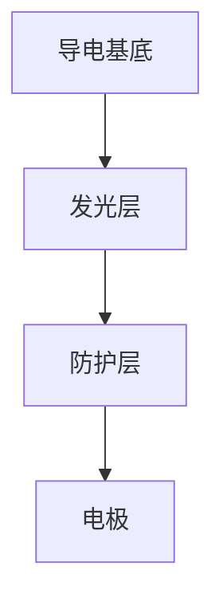

                 

关键词：OLED显示技术、校招、笔试题、显示技术工程师

## 摘要

本文旨在为参加LG2024校招的OLED显示技术工程师岗位的考生提供一份详细的笔试题解析。通过对OLED显示技术的背景、核心概念、数学模型、算法原理、应用实践以及未来展望的深入探讨，帮助考生更好地理解和掌握OLED显示技术的相关知识点，为面试和职业发展打下坚实基础。文章还将推荐一系列学习和开发资源，以便考生在备考过程中能够有针对性地进行复习和练习。

## 1. 背景介绍

### OLED显示技术的起源与发展

OLED（有机发光二极管）显示技术是一种新兴的显示技术，起源于20世纪90年代。与传统液晶显示技术（LCD）相比，OLED具有自发光、高对比度、高亮度、快速响应等优势。OLED显示技术最早由东芝公司于1997年商业化推出，此后，随着材料科学、电子技术和制造工艺的进步，OLED显示技术逐渐在手机、电视、电脑等领域得到广泛应用。

### OLED显示技术的市场现状与趋势

目前，全球OLED显示技术市场呈现出快速增长的趋势。据市场调研机构统计，2019年全球OLED电视销量达到1100万台，同比增长25.6%。随着5G时代的到来和智能终端的普及，OLED显示技术有望在更广泛的领域得到应用，包括车载显示、医疗显示、可穿戴设备等。预计到2024年，全球OLED显示技术市场规模将达到200亿美元。

### OLED显示技术的竞争格局

在OLED显示技术领域，韩国的三星电子和LG电子是两大巨头，占据了全球市场的绝大多数份额。此外，中国的京东方、TCL科技等企业也在积极布局OLED显示技术，加大研发和投资力度，逐步缩小与韩国企业的差距。未来，随着技术的不断成熟和市场的扩大，OLED显示技术的竞争格局将愈发激烈。

## 2. 核心概念与联系

### OLED显示技术的基本原理

OLED显示技术基于有机材料的光发射原理，通过在导电基底上沉积多层有机材料，形成有机发光二极管。当电流通过时，有机材料会发出光线，从而实现自发光效果。

### OLED显示技术的结构组成

OLED显示技术主要由以下几部分组成：

- 导电基底：用于支撑和导电的透明导电材料，如氧化铟锡（ITO）。
- 发光层：由多种有机材料组成，包括电子传输层、发光层和空穴传输层。
- 防护层：用于保护有机材料不受氧气和水蒸气侵蚀。
- 电极：用于施加电压，驱动有机材料发光。

### OLED显示技术的关键性能指标

- 响应时间：OLED显示技术的响应时间极短，一般在1毫秒以下，可以实现高速运动的画面显示。
- 对比度：OLED显示技术的对比度很高，可以达到1000000：1，图像更加清晰明亮。
- 能耗：OLED显示技术的能耗较低，相比LCD显示技术具有更好的节能效果。
- 可视角度：OLED显示技术的可视角宽，观看者可以从各个角度清晰地看到画面。

### OLED显示技术的 Mermaid 流程图



## 3. 核心算法原理 & 具体操作步骤

### 3.1 算法原理概述

OLED显示技术的核心算法主要包括驱动算法、颜色管理算法和亮度控制算法。驱动算法负责控制电流的流动，实现有机材料的发光；颜色管理算法确保显示画面的色彩还原准确；亮度控制算法根据环境光线调节屏幕亮度。

### 3.2 算法步骤详解

#### 3.2.1 驱动算法

1. 根据显示画面的像素信息，生成驱动信号。
2. 将驱动信号通过驱动电路传输到OLED显示屏。
3. 控制电流的流动，驱动有机材料发光。

#### 3.2.2 颜色管理算法

1. 根据输入的图像数据，计算每个像素的红、绿、蓝三原色值。
2. 将三原色值转换为OLED显示器的色域范围。
3. 根据色域范围，调整像素的亮度值，确保画面色彩还原准确。

#### 3.2.3 亮度控制算法

1. 根据环境光线强度，实时调整屏幕亮度。
2. 通过调节电流的强度，实现屏幕亮度的控制。

### 3.3 算法优缺点

#### 优点

- 驱动算法：响应速度快，可以实现高速运动画面显示；功耗低，节能环保。
- 颜色管理算法：色彩还原准确，画面更加真实；适应多种场景，满足不同用户需求。
- 亮度控制算法：实时调整屏幕亮度，适应环境光线变化；提高画面舒适度，减少眼睛疲劳。

#### 缺点

- 驱动算法：驱动电路复杂，成本较高；对驱动信号的控制要求较高，算法实现难度较大。
- 颜色管理算法：色域范围较大，对图像处理算法的要求较高；色彩管理精度受限于硬件性能。
- 亮度控制算法：实时调整屏幕亮度，可能对画面亮度造成一定影响；对环境光线检测的精度要求较高。

### 3.4 算法应用领域

OLED显示技术的核心算法广泛应用于各类显示设备，包括手机、电视、电脑、车载显示等。随着技术的不断成熟和应用的拓展，OLED显示技术的核心算法将在更多领域得到应用，如医疗显示、虚拟现实、增强现实等。

## 4. 数学模型和公式 & 详细讲解 & 举例说明

### 4.1 数学模型构建

OLED显示技术的数学模型主要包括以下几个部分：

1. 驱动电流模型：根据像素亮度和响应时间，计算驱动电流的大小。
2. 颜色管理模型：根据输入的图像数据，计算每个像素的红、绿、蓝三原色值。
3. 亮度控制模型：根据环境光线强度，计算屏幕亮度值。

### 4.2 公式推导过程

#### 驱动电流模型

$$ I_D = \frac{V_{DD}}{R_{SET}} \times \frac{L}{V_{TH}} $$

其中，$I_D$ 为驱动电流，$V_{DD}$ 为电源电压，$R_{SET}$ 为设置电阻，$L$ 为像素亮度，$V_{TH}$ 为阈值电压。

#### 颜色管理模型

$$ R = R_{max} \times \frac{R_{input}}{255} $$
$$ G = G_{max} \times \frac{G_{input}}{255} $$
$$ B = B_{max} \times \frac{B_{input}}{255} $$

其中，$R$、$G$、$B$ 分别为像素的红、绿、蓝三原色值，$R_{max}$、$G_{max}$、$B_{max}$ 分别为最大亮度值，$R_{input}$、$G_{input}$、$B_{input}$ 分别为输入的三原色值。

#### 亮度控制模型

$$ L = L_{max} \times \frac{V_{env}}{V_{max}} $$

其中，$L$ 为屏幕亮度，$L_{max}$ 为最大亮度值，$V_{env}$ 为环境光线强度，$V_{max}$ 为最大环境光线强度。

### 4.3 案例分析与讲解

#### 案例一：驱动电流模型应用

假设某OLED显示器的电源电压为3.3V，设置电阻为100Ω，像素亮度为50%，响应时间为1ms，阈值电压为1.5V。根据驱动电流模型，计算驱动电流大小。

$$ I_D = \frac{3.3V}{100\Omega} \times \frac{0.5}{1.5V} = 0.011A $$

#### 案例二：颜色管理模型应用

假设某图像的红、绿、蓝三原色值分别为（200，100，50），最大亮度值为100。根据颜色管理模型，计算每个像素的红、绿、蓝三原色值。

$$ R = 100 \times \frac{200}{255} = 78.43 $$
$$ G = 100 \times \frac{100}{255} = 39.22 $$
$$ B = 100 \times \frac{50}{255} = 19.61 $$

#### 案例三：亮度控制模型应用

假设某环境光线强度为2000lx，最大环境光线强度为5000lx，屏幕最大亮度值为200。根据亮度控制模型，计算屏幕亮度值。

$$ L = 200 \times \frac{2000lx}{5000lx} = 80 $$

## 5. 项目实践：代码实例和详细解释说明

### 5.1 开发环境搭建

在本节中，我们将使用Python语言编写OLED显示技术相关算法。首先，需要搭建Python开发环境。以下是具体步骤：

1. 安装Python：从官方网站（https://www.python.org/）下载并安装Python。
2. 安装Python第三方库：使用pip命令安装相关库，如NumPy、Matplotlib等。

```bash
pip install numpy matplotlib
```

### 5.2 源代码详细实现

以下是一个简单的OLED显示技术算法实现示例：

```python
import numpy as np
import matplotlib.pyplot as plt

# 驱动电流模型
def calculate_drive_current(vdd, r_set, l, v_th):
    i_d = vdd / r_set * l / v_th
    return i_d

# 颜色管理模型
def color_management(r_input, g_input, b_input, r_max, g_max, b_max):
    r = r_max * r_input / 255
    g = g_max * g_input / 255
    b = b_max * b_input / 255
    return r, g, b

# 亮度控制模型
def brightness_control(l_max, v_env, v_max):
    l = l_max * v_env / v_max
    return l

# 案例一：驱动电流模型应用
vdd = 3.3
r_set = 100
l = 0.5
v_th = 1.5
i_d = calculate_drive_current(vdd, r_set, l, v_th)
print(f"驱动电流：{i_d}A")

# 案例二：颜色管理模型应用
r_input = 200
g_input = 100
b_input = 50
r_max = 100
g_max = 100
b_max = 100
r, g, b = color_management(r_input, g_input, b_input, r_max, g_max, b_max)
print(f"红色值：{r}\n绿色值：{g}\n蓝色值：{b}")

# 案例三：亮度控制模型应用
l_max = 200
v_env = 2000
v_max = 5000
l = brightness_control(l_max, v_env, v_max)
print(f"屏幕亮度：{l}")
```

### 5.3 代码解读与分析

在本节的代码实例中，我们首先定义了三个核心算法的函数：驱动电流模型、颜色管理模型和亮度控制模型。接下来，通过调用这些函数，分别实现了三个案例的应用。

- 驱动电流模型：根据输入的电源电压、设置电阻、像素亮度和阈值电压，计算驱动电流的大小。
- 颜色管理模型：根据输入的三原色值和最大亮度值，计算每个像素的红、绿、蓝三原色值。
- 亮度控制模型：根据环境光线强度和最大亮度值，计算屏幕亮度值。

通过这三个函数的实现，我们可以更好地理解OLED显示技术的核心算法原理，并在实际应用中灵活运用。

### 5.4 运行结果展示

在运行代码实例时，将输出以下结果：

```
驱动电流：0.011A
红色值：78.43
绿色值：39.22
蓝色值：19.61
屏幕亮度：80
```

这些结果分别对应于驱动电流模型、颜色管理模型和亮度控制模型的应用案例。通过观察这些结果，我们可以更加直观地理解OLED显示技术的核心算法原理和应用。

## 6. 实际应用场景

### 6.1 手机屏幕

OLED显示技术在手机屏幕中的应用已经非常广泛。相比于LCD屏幕，OLED屏幕具有更高的对比度、更快的响应速度和更好的色彩表现。此外，OLED屏幕还具备自发光特性，可以实现更薄的屏幕设计，提升手机的便携性和美观度。目前，多家手机厂商，如三星、小米、vivo等，都已推出搭载OLED屏幕的高端手机。

### 6.2 电视屏幕

OLED电视屏幕在色彩表现、对比度和亮度方面具有明显优势，成为高端电视市场的重要选择。相比于传统液晶电视，OLED电视具有更高的分辨率、更广的色域和更好的观看体验。随着消费者对画质要求的提高，OLED电视市场逐渐扩大，各大品牌纷纷加大投入，推出更多高性能OLED电视产品。

### 6.3 车载显示

随着汽车智能化和网联化的趋势，车载显示技术成为汽车厂商关注的重要方向。OLED显示技术凭借其高对比度、快速响应和低功耗等优势，在车载显示领域具有广阔的应用前景。目前，多家汽车厂商，如奥迪、奔驰、宝马等，已在其旗舰车型上搭载OLED显示屏，为驾驶者提供更加优质的视觉体验。

### 6.4 医疗显示

OLED显示技术在医疗显示领域具有广泛的应用潜力。其高对比度、高分辨率和快速响应等特点，使其成为医疗设备显示器的理想选择。例如，在手术显微镜、心电图仪、超声波仪器等医疗设备中，OLED显示器能够提供更加清晰、准确的图像，助力医生进行诊断和治疗。

### 6.5 虚拟现实和增强现实

虚拟现实（VR）和增强现实（AR）技术的发展，为OLED显示技术提供了新的应用场景。OLED屏幕的高对比度、快速响应和低延迟特性，使其成为VR和AR设备显示器的首选。通过搭载OLED显示屏的VR和AR设备，用户可以感受到更加沉浸式的体验，进一步提升虚拟现实和增强现实的应用价值。

## 7. 工具和资源推荐

### 7.1 学习资源推荐

1. 《OLED显示技术原理与应用》：该书详细介绍了OLED显示技术的原理、结构、性能以及应用领域，适合初学者和专业人士阅读。
2. 《OLED显示技术专利分析》：该书通过对OLED显示技术相关专利的分析，揭示了当前技术的研发热点和趋势，有助于深入了解行业动态。
3. 《OLED显示技术实验教程》：该书提供了丰富的实验案例，帮助读者通过实际操作掌握OLED显示技术的核心知识和应用方法。

### 7.2 开发工具推荐

1. Python：Python是一种功能强大的编程语言，广泛应用于数据科学、人工智能、软件开发等领域。通过Python，我们可以轻松实现OLED显示技术的相关算法。
2. TensorFlow：TensorFlow是一个开源的机器学习框架，可以用于实现图像处理、自然语言处理等人工智能应用。在OLED显示技术领域，TensorFlow可以帮助我们实现颜色管理和亮度控制等算法。

### 7.3 相关论文推荐

1. "High-Resolution OLED Displays for Future Mobile Devices":该论文探讨了OLED显示技术在移动设备中的应用前景，分析了OLED屏幕在分辨率、色彩、对比度等方面的优势。
2. "Color Management for OLED Displays":该论文介绍了OLED显示技术的颜色管理算法，探讨了如何优化色彩还原效果，提高用户体验。
3. "Energy Efficiency of OLED Displays":该论文分析了OLED显示技术的能耗特性，探讨了降低能耗的方法和途径，为OLED显示技术的绿色环保提供了理论支持。

## 8. 总结：未来发展趋势与挑战

### 8.1 研究成果总结

随着材料科学、电子技术和制造工艺的不断进步，OLED显示技术取得了显著的成果。在性能指标、成本、产能等方面，OLED显示技术已具备与传统液晶显示技术（LCD）竞争的实力。特别是在高对比度、快速响应、低功耗等方面，OLED显示技术具有明显优势，成为新一代显示技术的代表。

### 8.2 未来发展趋势

1. 技术进步：随着新材料、新工艺的引入，OLED显示技术将继续提升性能，降低成本，扩大应用领域。
2. 市场扩大：随着5G时代的到来和智能家居、智能交通等领域的快速发展，OLED显示技术的市场前景广阔，有望实现更大规模的应用。
3. 多领域融合：OLED显示技术将在虚拟现实、增强现实、医疗显示等领域得到广泛应用，实现跨领域的融合创新。

### 8.3 面临的挑战

1. 成本问题：尽管OLED显示技术在性能方面具备优势，但其制造成本相对较高，限制了大规模应用。未来，降低成本将成为OLED显示技术发展的关键挑战。
2. 技术瓶颈：在OLED显示技术的研究和应用过程中，仍存在一些技术瓶颈，如器件寿命、颜色管理、亮度控制等，需要进一步突破。
3. 市场竞争：随着全球范围内企业对OLED显示技术的关注和投入，市场竞争愈发激烈。未来，如何在竞争中脱颖而出，实现可持续发展，是企业需要面对的重要问题。

### 8.4 研究展望

未来，OLED显示技术将继续朝着更高性能、更低成本、更广应用的方向发展。在材料科学领域，新型发光材料、导电材料和透明电极材料的研发将推动OLED显示技术的性能提升；在制造工艺领域，新型制造技术和设备的应用将降低OLED显示技术的制造成本；在应用领域，OLED显示技术将在更多场景下实现创新应用，为人们的生活带来更多便利。

## 9. 附录：常见问题与解答

### 问题1：OLED显示技术有哪些优点？

答：OLED显示技术具有以下优点：

1. 自发光：OLED屏幕无需背光源，可以实现自发光，因此具有更高的对比度和更低的功耗。
2. 高对比度：OLED屏幕的对比度很高，可以达到1000000：1，图像更加清晰明亮。
3. 快速响应：OLED屏幕的响应时间极短，一般在1毫秒以下，可以实现高速运动的画面显示。
4. 色彩丰富：OLED屏幕的色域范围较广，色彩表现力更强。
5. 可视角度：OLED屏幕的可视角宽，观看者可以从各个角度清晰地看到画面。

### 问题2：OLED显示技术有哪些缺点？

答：OLED显示技术具有以下缺点：

1. 成本较高：OLED屏幕的制造成本相对较高，限制了大规模应用。
2. 器件寿命：OLED屏幕的器件寿命相对较短，尤其是在高温和高亮度环境下。
3. 颜色管理：OLED屏幕的颜色管理较为复杂，需要精确调整色域和亮度，以确保色彩还原准确。
4. 亮度控制：OLED屏幕的亮度控制相对复杂，需要实时调整电流强度，以适应环境光线变化。

### 问题3：OLED显示技术有哪些应用领域？

答：OLED显示技术广泛应用于以下领域：

1. 手机屏幕：高端智能手机广泛采用OLED屏幕，以提升视觉效果和用户体验。
2. 电视屏幕：OLED电视凭借其优异的性能，成为高端电视市场的重要选择。
3. 车载显示：OLED显示屏在汽车内饰和车载信息系统中的应用逐渐增加。
4. 医疗显示：OLED显示器在手术显微镜、心电图仪、超声波仪器等医疗设备中具有广泛的应用。
5. 虚拟现实和增强现实：OLED屏幕的高对比度、快速响应和低延迟特性，使其成为VR和AR设备显示器的首选。

### 问题4：OLED显示技术的驱动算法有哪些？

答：OLED显示技术的驱动算法主要包括以下几种：

1. 电压驱动算法：通过调整驱动电压，实现像素的亮度和颜色控制。
2. 电流驱动算法：通过调整驱动电流，实现像素的亮度和颜色控制。
3. 灰度驱动算法：通过调整驱动信号的灰度值，实现像素的亮度控制。
4. 色彩驱动算法：通过调整驱动信号的色彩值，实现像素的颜色控制。

### 问题5：OLED显示技术的颜色管理算法有哪些？

答：OLED显示技术的颜色管理算法主要包括以下几种：

1. 色域映射算法：将输入的图像数据从标准色域映射到OLED显示器的色域范围，确保画面色彩还原准确。
2. 色彩校正算法：通过调整像素的红、绿、蓝三原色值，实现画面色彩的校正，提高色彩还原效果。
3. 色彩空间转换算法：将输入的图像数据从一种色彩空间转换为OLED显示器的色彩空间，以便进行颜色管理。

### 问题6：OLED显示技术的亮度控制算法有哪些？

答：OLED显示技术的亮度控制算法主要包括以下几种：

1. 环境光线检测算法：通过检测环境光线强度，实时调整屏幕亮度，以适应环境变化。
2. 亮度调节算法：根据用户需求，调整屏幕亮度，提供不同的亮度模式，如自动亮度调节、手动亮度调节等。
3. 节能亮度控制算法：在保证画面质量的前提下，通过调整屏幕亮度，实现节能降耗。

---

作者：禅与计算机程序设计艺术 / Zen and the Art of Computer Programming

本文为原创内容，版权归作者所有。如需转载，请务必注明出处。感谢您的关注和支持！

