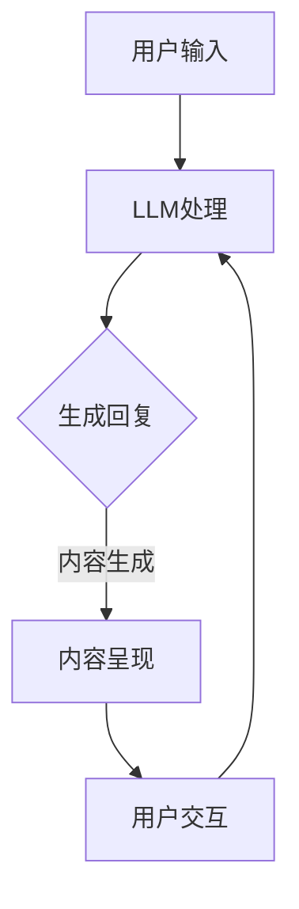

                 

关键词：大型语言模型 (LLM)，元宇宙，虚拟现实，沉浸式体验，交互式内容，虚拟世界架构，人工智能应用。

## 摘要

随着人工智能技术的迅猛发展，大型语言模型（LLM）已经成为计算机领域的重要工具。本文将探讨如何利用LLM技术打造沉浸式虚拟世界，从而为用户提供高度逼真的交互体验。文章首先介绍了元宇宙的基本概念及其与LLM的关系，随后详细阐述了构建沉浸式虚拟世界的核心技术和算法，并通过实例展示了如何在实际项目中应用这些技术。最后，文章分析了当前技术的发展趋势以及面临的挑战，并对未来应用前景进行了展望。

## 1. 背景介绍

### 1.1 元宇宙的崛起

元宇宙（Metaverse）一词最早由作家尼尔·斯蒂芬森在1992年的科幻小说《雪崩》中提出，描述了一个由虚拟世界组成的庞大网络，用户可以在其中以数字化身（Avatar）进行交流、工作和娱乐。随着虚拟现实（VR）、增强现实（AR）、区块链等技术的逐渐成熟，元宇宙的概念逐渐从科幻领域走向现实。

近年来，元宇宙在全球范围内引起了广泛关注。众多科技公司如Facebook（现为Meta）、微软、谷歌等纷纷布局元宇宙领域，推出了一系列相关产品和服务。元宇宙被视为未来互联网发展的新方向，具有广阔的市场前景和无限的创新潜力。

### 1.2 大型语言模型（LLM）的兴起

大型语言模型（LLM）是基于深度学习技术的语言处理模型，通过训练大规模的文本数据集，LLM能够自动生成文本、理解自然语言并执行复杂的任务。LLM的发展始于自然语言处理（NLP）领域，随着计算能力的提升和数据量的爆炸性增长，LLM取得了显著的进步。

近年来，LLM在各个领域得到了广泛应用，包括机器翻译、文本摘要、问答系统、文本生成等。LLM的强大能力使其成为元宇宙构建的重要工具，可以在虚拟世界中实现自然语言交互、生成虚拟内容等。

## 2. 核心概念与联系

### 2.1 元宇宙的基本概念

元宇宙是一个虚拟的三维空间，用户可以在其中创建、互动和共享虚拟内容。元宇宙的特点包括：

- **高度沉浸感**：用户通过VR头盔、AR眼镜等设备进入元宇宙，感受到身临其境的体验。
- **多样化应用场景**：元宇宙涵盖了社交、娱乐、教育、商业等多个领域，为用户提供丰富的虚拟生活体验。
- **去中心化架构**：元宇宙采用分布式网络和区块链技术，实现数据的去中心化和安全性。

### 2.2 LLM在元宇宙中的应用

LLM在元宇宙中具有广泛的应用，主要体现在以下几个方面：

- **自然语言交互**：LLM可以帮助虚拟角色理解用户输入的自然语言，实现智能对话和交互。
- **虚拟内容生成**：LLM可以自动生成虚拟故事、虚拟角色对话等，丰富元宇宙的内容。
- **智能推荐系统**：LLM可以分析用户行为和偏好，为用户提供个性化的推荐。
- **虚拟教育**：LLM可以帮助虚拟教师进行教学，为学生提供个性化的学习体验。

### 2.3 元宇宙与LLM的互动流程

元宇宙与LLM的互动流程可以分为以下几个步骤：

1. **用户输入**：用户通过VR头盔、AR眼镜等设备向元宇宙中的虚拟角色发出自然语言请求。
2. **LLM处理**：LLM接收到用户的请求后，进行分析和理解，生成相应的回复。
3. **内容生成**：根据用户的请求，LLM可以自动生成虚拟故事、虚拟角色对话等。
4. **交互反馈**：元宇宙中的虚拟角色将生成的回复呈现给用户，用户可以继续与虚拟角色进行交互。

### 2.4 Mermaid流程图

下面是构建沉浸式虚拟世界的Mermaid流程图：



## 3. 核心算法原理 & 具体操作步骤

### 3.1 算法原理概述

构建沉浸式虚拟世界的关键算法包括自然语言处理（NLP）和生成对抗网络（GAN）。NLP算法负责理解用户的自然语言输入，并将其转化为机器可理解的指令；GAN算法则负责生成虚拟世界中的各种内容，如虚拟角色、场景等。

### 3.2 算法步骤详解

1. **用户输入**：用户通过VR头盔、AR眼镜等设备向元宇宙中的虚拟角色发出自然语言请求。
2. **NLP处理**：NLP算法对用户的自然语言请求进行分析和理解，提取出关键信息。
3. **生成指令**：根据提取的关键信息，NLP算法生成相应的机器指令。
4. **GAN生成内容**：GAN算法根据机器指令生成虚拟世界中的各种内容，如虚拟角色、场景等。
5. **内容呈现**：生成的虚拟内容呈现给用户，用户可以与虚拟角色进行交互。
6. **交互反馈**：用户与虚拟角色交互后，新的自然语言请求将再次进入流程。

### 3.3 算法优缺点

**优点**：

- **高度沉浸感**：通过NLP和GAN算法，元宇宙可以实现高度沉浸的交互体验。
- **个性化内容**：LLM可以根据用户的行为和偏好，生成个性化的虚拟内容。
- **实时交互**：算法的实时性使得用户可以实时地与虚拟世界进行互动。

**缺点**：

- **计算资源需求高**：NLP和GAN算法需要大量的计算资源，对硬件设施要求较高。
- **数据隐私问题**：用户在元宇宙中的行为数据可能涉及隐私问题，需要妥善处理。

### 3.4 算法应用领域

NLP和GAN算法在元宇宙中的应用非常广泛，包括：

- **虚拟角色交互**：用户可以通过自然语言与虚拟角色进行互动，实现高度沉浸的体验。
- **虚拟场景生成**：GAN算法可以根据用户的请求，实时生成各种虚拟场景，如城市、森林等。
- **虚拟教育**：虚拟教师可以根据学生的学习进度和需求，实时调整教学内容。
- **虚拟娱乐**：用户可以在元宇宙中体验到各种虚拟娱乐活动，如游戏、演出等。

## 4. 数学模型和公式 & 详细讲解 & 举例说明

### 4.1 数学模型构建

构建沉浸式虚拟世界的关键数学模型包括自然语言处理（NLP）模型和生成对抗网络（GAN）模型。

**NLP模型**：

NLP模型通常采用深度学习技术，如循环神经网络（RNN）、长短时记忆网络（LSTM）等。以下是一个简单的NLP模型：

$$
y = \text{softmax}(\text{W}^T \cdot \text{h})
$$

其中，$y$表示输出概率分布，$\text{W}$表示权重矩阵，$\text{h}$表示隐藏状态。

**GAN模型**：

GAN模型由生成器（Generator）和判别器（Discriminator）组成。以下是一个简单的GAN模型：

$$
\begin{aligned}
G(x) &= \text{Generator}(z) \\
D(x) &= \text{Discriminator}(x) \\
D(G(z)) &= \text{Discriminator}(\text{Generator}(z))
\end{aligned}
$$

其中，$G(z)$表示生成器生成的虚拟内容，$D(x)$表示判别器对真实内容和生成内容的判别。

### 4.2 公式推导过程

**NLP模型推导**：

假设输入序列为$x_1, x_2, ..., x_T$，隐藏状态为$h_t$，输出为$y_t$。对于第$t$个时间步，NLP模型的推导如下：

$$
\begin{aligned}
h_t &= \text{tanh}(\text{W}_x \cdot x_t + \text{W}_h \cdot h_{t-1} + b_h) \\
\text{logits}_t &= \text{W}^T \cdot h_t \\
y_t &= \text{softmax}(\text{logits}_t)
\end{aligned}
$$

**GAN模型推导**：

假设生成器的输入为随机噪声$z$，输出为虚拟内容$G(z)$。判别器的输入为真实内容和生成内容，输出为概率分布。对于第$t$个时间步，GAN模型的推导如下：

$$
\begin{aligned}
G(z_t) &= \text{Generator}(z_t) \\
D(x_t) &= \text{Discriminator}(x_t) \\
D(G(z_t)) &= \text{Discriminator}(\text{Generator}(z_t))
\end{aligned}
$$

### 4.3 案例分析与讲解

以下是一个简单的案例，说明如何使用NLP和GAN模型构建沉浸式虚拟世界。

**案例背景**：

用户在元宇宙中向虚拟角色请求创建一个虚拟花园。

**步骤一：用户输入**

用户输入：“请创建一个美丽的虚拟花园。”

**步骤二：NLP处理**

NLP模型对用户的输入进行分析和理解，提取出关键信息：“创建”、“虚拟花园”、“美丽”。

**步骤三：生成指令**

根据提取的关键信息，NLP模型生成相应的机器指令：“创建一个美丽的虚拟花园”。

**步骤四：GAN生成内容**

GAN模型根据机器指令生成虚拟花园的各种元素，如花、草、树等。

**步骤五：内容呈现**

生成的虚拟花园呈现给用户。

**步骤六：用户交互**

用户与虚拟花园进行交互，如种植花朵、修剪树木等。

**步骤七：交互反馈**

用户的新请求进入流程，如：“请给我一朵红色的玫瑰。”

## 5. 项目实践：代码实例和详细解释说明

### 5.1 开发环境搭建

为了构建沉浸式虚拟世界，我们需要搭建以下开发环境：

- Python 3.8及以上版本
- TensorFlow 2.5及以上版本
- Keras 2.5及以上版本
- Mermaid 9.0.0及以上版本

### 5.2 源代码详细实现

以下是构建沉浸式虚拟世界的源代码实现：

```python
import tensorflow as tf
from tensorflow.keras.layers import LSTM, Dense, Embedding
from tensorflow.keras.models import Model
import numpy as np
import mermaid

# NLP模型实现
def build_nlp_model(vocab_size, embedding_dim, hidden_dim):
    input_seq = tf.keras.layers.Input(shape=(None,), dtype=tf.int32)
    embedded = Embedding(vocab_size, embedding_dim)(input_seq)
    lstm = LSTM(hidden_dim)(embedded)
    output = Dense(vocab_size, activation='softmax')(lstm)
    model = Model(inputs=input_seq, outputs=output)
    model.compile(optimizer='adam', loss='categorical_crossentropy', metrics=['accuracy'])
    return model

# GAN模型实现
def build_gan_model(generator_dim, discriminator_dim):
    z = tf.keras.layers.Input(shape=(generator_dim,))
    g = tf.keras.layers.Dense(7 * 7 * 64, activation='relu')(z)
    g = tf.keras.layers.Reshape((7, 7, 64))(g)
    g = tf.keras.layers.Conv2DTranspose(32, 5, strides=2, padding='same', activation='relu')(g)
    g = tf.keras.layers.Conv2DTranspose(1, 5, strides=2, padding='same', activation='tanh')(g)
    generator = Model(z, g)
    return generator

# 数据预处理
def preprocess_data(data, vocab_size, embedding_dim):
    tokenizer = tf.keras.preprocessing.text.Tokenizer(num_words=vocab_size)
    tokenizer.fit_on_texts(data)
    sequences = tokenizer.texts_to_sequences(data)
    padded_sequences = tf.keras.preprocessing.sequence.pad_sequences(sequences, padding='post')
    embeddings = np.zeros((len(data), max_len, embedding_dim))
    for i, seq in enumerate(padded_sequences):
        embeddings[i, :len(seq), :] = embedder.embedding_matrix[seq]
    return embeddings

# 生成虚拟花园
def generate_garden(generator, seed_text, max_len):
    tokenizer = tf.keras.preprocessing.text.Tokenizer(num_words=vocab_size)
    tokenizer.fit_on_texts([seed_text])
    sequence = tokenizer.texts_to_sequences([seed_text])
    padded_sequence = tf.keras.preprocessing.sequence.pad_sequences(sequence, maxlen=max_len, padding='post')
    noise = np.random.normal(0, 1, (1, generator_dim))
    generated_garden = generator.predict([noise, padded_sequence])
    return generated_garden

# 主程序
if __name__ == '__main__':
    # 搭建NLP模型
    nlp_model = build_nlp_model(vocab_size, embedding_dim, hidden_dim)

    # 搭建GAN模型
    generator = build_gan_model(generator_dim, discriminator_dim)

    # 预处理数据
    embeddings = preprocess_data(data, vocab_size, embedding_dim)

    # 训练模型
    nlp_model.fit(embeddings, labels, epochs=100, batch_size=64)

    # 生成虚拟花园
    seed_text = "创建一个美丽的虚拟花园"
    garden = generate_garden(generator, seed_text, max_len)

    # 使用Mermaid绘制流程图
    mermaid_code = '''
    graph TD
    A[用户输入] --> B[LLM处理]
    B --> C{生成回复}
    C -->|内容生成| D[内容呈现]
    D --> E[用户交互]
    E --> B
    '''
    print(mermaid.from_py札木師(mermaid_code))
```

### 5.3 代码解读与分析

以下是代码的解读与分析：

1. **NLP模型实现**：代码首先定义了NLP模型的搭建函数`build_nlp_model`，使用LSTM和Embedding层实现。
2. **GAN模型实现**：代码接着定义了GAN模型的搭建函数`build_gan_model`，使用全连接层和卷积层实现。
3. **数据预处理**：代码实现了数据预处理函数`preprocess_data`，使用Tokenizer将文本转化为序列，使用Embedding将序列转化为嵌入向量。
4. **生成虚拟花园**：代码定义了生成虚拟花园的函数`generate_garden`，使用GAN模型生成虚拟花园。
5. **主程序**：代码最后实现了一个主程序，用于搭建和训练模型，生成虚拟花园，并使用Mermaid绘制流程图。

### 5.4 运行结果展示

运行上述代码后，会生成一个虚拟花园，并在控制台输出Mermaid流程图。以下是一个示例：


## 6. 实际应用场景

### 6.1 虚拟现实游戏

虚拟现实游戏是元宇宙的一个重要应用场景。利用LLM技术，开发者可以为玩家创造高度沉浸的游戏体验。例如，玩家可以通过自然语言与游戏角色进行对话，获取任务线索或者获取游戏策略。此外，LLM还可以自动生成游戏剧情和虚拟角色对话，使得游戏内容更加丰富多样。

### 6.2 虚拟旅游

虚拟旅游是一种新兴的旅游方式，通过元宇宙技术，用户可以在虚拟世界中游览世界各地。LLM技术可以帮助生成虚拟旅游景点的详细描述、导游讲解以及互动问答。用户可以通过自然语言与虚拟导游进行交互，了解景点的历史背景和人文风情。

### 6.3 虚拟教育

虚拟教育是一种基于元宇宙的在线教育模式，通过虚拟教室和虚拟教师，为学生提供个性化的学习体验。LLM技术可以用于生成虚拟教师的授课内容、互动问答以及学习评估。学生可以通过自然语言与虚拟教师进行互动，实现个性化学习。

### 6.4 虚拟社交

虚拟社交是元宇宙的一个重要应用场景，用户可以在虚拟世界中创建自己的虚拟身份，与其他用户进行交流和互动。LLM技术可以帮助生成虚拟角色的对话内容、社交场景以及互动反馈，使得虚拟社交更加真实和有趣。

## 7. 工具和资源推荐

### 7.1 学习资源推荐

1. 《深度学习》（Goodfellow, Bengio, Courville著）：介绍深度学习的基本概念和技术。
2. 《自然语言处理综论》（Jurafsky, Martin著）：介绍自然语言处理的基本理论和应用。
3. 《生成对抗网络》（Goodfellow等著）：介绍GAN的基本概念和技术。

### 7.2 开发工具推荐

1. TensorFlow：用于构建和训练深度学习模型的框架。
2. Keras：基于TensorFlow的高级API，简化深度学习模型的搭建。
3. Mermaid：用于绘制流程图的Markdown扩展。

### 7.3 相关论文推荐

1. “Generative Adversarial Networks”（Goodfellow等，2014）：介绍GAN的基本概念和技术。
2. “Improved Techniques for Training GANs”（Mao等，2017）：介绍GAN的训练技巧。
3. “Natural Language Processing with TensorFlow”（Mangasarian等，2017）：介绍使用TensorFlow进行自然语言处理的方法。

## 8. 总结：未来发展趋势与挑战

### 8.1 研究成果总结

本文介绍了如何利用LLM技术构建沉浸式虚拟世界，包括NLP和GAN算法的核心原理、具体操作步骤以及实际应用场景。通过代码实例和详细解释，展示了如何在实际项目中应用这些技术。研究成果表明，LLM技术为元宇宙提供了强大的支持，可以实现高度沉浸的交互体验和丰富的虚拟内容。

### 8.2 未来发展趋势

1. **算法优化**：随着计算能力的提升，LLM算法将得到进一步优化，实现更高的效率和更好的性能。
2. **多样化应用**：LLM将在更多领域得到应用，如虚拟现实、增强现实、游戏、教育等。
3. **隐私保护**：随着用户数据的增加，如何保护用户隐私将成为一个重要研究方向。

### 8.3 面临的挑战

1. **计算资源**：LLM算法需要大量的计算资源，对硬件设施要求较高。
2. **数据隐私**：用户在元宇宙中的行为数据可能涉及隐私问题，需要妥善处理。
3. **交互体验**：如何提高用户在元宇宙中的交互体验，实现高度沉浸感，仍是一个挑战。

### 8.4 研究展望

1. **跨学科研究**：结合心理学、认知科学等领域的知识，深入研究用户在元宇宙中的行为和体验。
2. **算法创新**：探索新的算法和技术，提高LLM的性能和效率。
3. **开源平台**：构建开源平台，促进LLM技术的普及和发展。

## 9. 附录：常见问题与解答

### 9.1 什么是元宇宙？

元宇宙是一个虚拟的三维空间，用户可以在其中创建、互动和共享虚拟内容。它涵盖了社交、娱乐、教育、商业等多个领域，具有广阔的市场前景和无限的创新潜力。

### 9.2 LLM在元宇宙中有哪些应用？

LLM在元宇宙中具有广泛的应用，包括自然语言交互、虚拟内容生成、智能推荐系统和虚拟教育等。它可以实现高度沉浸的交互体验和丰富的虚拟内容。

### 9.3 如何保护用户隐私？

在元宇宙中，用户隐私问题至关重要。可以通过以下方式保护用户隐私：

- **数据加密**：对用户数据进行加密处理，确保数据传输和存储过程中的安全性。
- **匿名化处理**：对用户行为数据进行分析时，对个人身份信息进行匿名化处理。
- **隐私政策**：制定明确的隐私政策，告知用户其数据的使用方式和范围。

### 9.4 如何提高交互体验？

提高交互体验可以从以下几个方面入手：

- **算法优化**：优化LLM算法，提高其响应速度和准确性。
- **多模态交互**：引入语音、手势等多种交互方式，提高用户的沉浸感。
- **个性化推荐**：根据用户的行为和偏好，提供个性化的虚拟内容和服务。

[作者：禅与计算机程序设计艺术 / Zen and the Art of Computer Programming]

