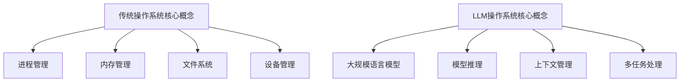

                 

关键词：LLM操作系统、传统操作系统、对比、人工智能、架构、算法、性能、应用

>摘要：本文将从多个角度对比分析LLM（大语言模型）操作系统与传统操作系统，探讨它们在功能、性能、应用场景等方面的差异，以及未来发展趋势。

## 1. 背景介绍

近年来，人工智能（AI）技术取得了飞速发展，特别是在自然语言处理（NLP）领域。LLM（大语言模型）作为AI技术的重要组成部分，已经在各行各业得到广泛应用。而操作系统作为计算机系统的核心，也经历了从传统操作系统到现代操作系统的演变。本文旨在对比分析LLM操作系统与传统操作系统，探讨它们在功能、性能、应用场景等方面的差异，以及未来发展趋势。

### 1.1 传统操作系统的发展历程

传统操作系统的发展可以追溯到20世纪60年代，当时以IBM公司开发的操作系统为代表。随着时间的推移，操作系统逐渐演变出多种类型，如分时操作系统、实时操作系统、网络操作系统等。其中，分时操作系统和实时操作系统在工业、商业和科学计算等领域得到了广泛应用。代表性的分时操作系统有UNIX，而实时操作系统有VMS、QNX等。

### 1.2 LLM操作系统的发展背景

LLM操作系统是基于深度学习技术构建的，其主要目的是利用大规模语言模型（如GPT、BERT等）为用户提供智能化的计算服务。随着人工智能技术的不断发展，LLM操作系统在自然语言处理、问答系统、智能客服等领域表现出色，逐渐成为计算机系统的重要发展方向。

## 2. 核心概念与联系

### 2.1 传统操作系统的核心概念

传统操作系统的核心概念包括进程管理、内存管理、文件系统、设备管理等。其中，进程管理负责进程的创建、调度和终止；内存管理负责内存的分配和回收；文件系统负责文件的创建、读写和删除；设备管理负责设备的初始化、配置和操作。

### 2.2 LLM操作系统的核心概念

LLM操作系统的核心概念包括大规模语言模型、模型推理、上下文管理、多任务处理等。大规模语言模型负责对输入文本进行建模，模型推理用于实现文本生成、问答等功能；上下文管理负责维护用户会话的历史记录，以便于后续对话的连贯性；多任务处理则允许系统同时处理多个用户请求。

### 2.3 Mermaid流程图



## 3. 核心算法原理 & 具体操作步骤

### 3.1 算法原理概述

传统操作系统的核心算法主要包括进程调度算法、内存分配算法和文件系统管理算法。进程调度算法用于决定进程的执行顺序；内存分配算法用于分配和回收内存空间；文件系统管理算法用于实现文件的创建、读写和删除。

LLM操作系统的核心算法则是基于深度学习技术，包括大规模语言模型的训练、模型推理和上下文管理。大规模语言模型的训练过程涉及海量数据的学习和模型参数的优化；模型推理则用于实现文本生成和问答等功能；上下文管理则负责维护用户会话的历史记录。

### 3.2 算法步骤详解

#### 3.2.1 传统操作系统算法步骤

1. 进程调度算法：根据进程优先级、进程状态等信息决定进程的执行顺序。
2. 内存分配算法：根据进程的内存需求，在空闲内存中分配相应的内存空间。
3. 文件系统管理算法：根据文件的读写请求，实现文件的创建、读写和删除操作。

#### 3.2.2 LLM操作系统算法步骤

1. 大规模语言模型的训练：使用海量数据进行训练，优化模型参数，使其具备较好的文本生成和问答能力。
2. 模型推理：根据用户输入的文本，利用训练好的模型进行推理，生成相应的文本输出。
3. 上下文管理：根据用户会话的历史记录，维护用户会话的上下文信息，确保对话的连贯性。
4. 多任务处理：同时处理多个用户请求，实现并发执行。

### 3.3 算法优缺点

#### 3.3.1 传统操作系统算法优缺点

**优点：**
- 稳定性好：传统操作系统经过长时间的发展，已经相对成熟，稳定性较好。
- 功能丰富：传统操作系统支持多种进程管理、内存管理和文件系统管理算法，功能丰富。

**缺点：**
- 性能较低：传统操作系统的算法和架构相对老旧，无法充分利用现代硬件资源。
- 应用场景有限：传统操作系统主要应用于工业、商业和科学计算等领域，难以满足新兴应用的需求。

#### 3.3.2 LLM操作系统算法优缺点

**优点：**
- 性能较高：LLM操作系统基于深度学习技术，能够充分利用现代硬件资源，实现高效计算。
- 应用场景广泛：LLM操作系统在自然语言处理、问答系统、智能客服等领域表现出色，应用场景广泛。

**缺点：**
- 稳定性较差：由于深度学习技术尚在不断发展，LLM操作系统在稳定性方面相对较差。
- 功能相对单一：LLM操作系统主要关注自然语言处理相关功能，其他功能相对较少。

### 3.4 算法应用领域

#### 3.4.1 传统操作系统应用领域

传统操作系统主要应用于工业、商业和科学计算等领域，如制造、金融、医疗等。

#### 3.4.2 LLM操作系统应用领域

LLM操作系统主要应用于自然语言处理、问答系统、智能客服等领域，如智能助手、聊天机器人、智能客服等。

## 4. 数学模型和公式 & 详细讲解 & 举例说明

### 4.1 数学模型构建

传统操作系统的数学模型主要包括进程调度算法、内存分配算法和文件系统管理算法。以进程调度算法为例，其数学模型可以用以下公式表示：

$$
C = \sum_{i=1}^{n} \frac{a_i}{b_i}
$$

其中，$C$ 表示进程调度算法的调度时间，$a_i$ 表示进程 $i$ 的执行时间，$b_i$ 表示进程 $i$ 的优先级。

LLM操作系统的数学模型主要包括大规模语言模型的训练、模型推理和上下文管理。以大规模语言模型的训练为例，其数学模型可以用以下公式表示：

$$
\begin{aligned}
\theta &= \arg\min_{\theta} \frac{1}{N} \sum_{i=1}^{N} (-\log p(y_i|x_i; \theta)) \\
p(y_i|x_i; \theta) &= \frac{1}{Z} \exp(\theta^T y_i x_i)
\end{aligned}
$$

其中，$\theta$ 表示模型参数，$N$ 表示训练样本数量，$y_i$ 表示样本 $i$ 的标签，$x_i$ 表示样本 $i$ 的特征，$Z$ 表示归一化常数。

### 4.2 公式推导过程

#### 4.2.1 传统操作系统算法推导

进程调度算法的调度时间公式可以通过分析进程调度过程得到。假设系统中有 $n$ 个进程，每个进程的执行时间为 $a_i$，优先级为 $b_i$。为了使系统调度时间最短，需要选择优先级较高的进程先执行。因此，可以将进程按照优先级从高到低排序，然后依次执行。此时，进程调度时间为：

$$
C = \sum_{i=1}^{n} \frac{a_i}{b_i}
$$

#### 4.2.2 LLM操作系统算法推导

大规模语言模型的训练过程可以通过最大似然估计（MLE）得到。假设训练样本集为 $\{x_i, y_i\}$，其中 $x_i$ 表示输入文本，$y_i$ 表示输出文本。根据最大似然估计，模型参数 $\theta$ 应该使得样本的概率最大化，即：

$$
\theta = \arg\min_{\theta} \frac{1}{N} \sum_{i=1}^{N} (-\log p(y_i|x_i; \theta))
$$

其中，$p(y_i|x_i; \theta)$ 表示给定输入文本 $x_i$ 生成输出文本 $y_i$ 的概率。为了简化计算，可以假设输入文本 $x_i$ 和输出文本 $y_i$ 是二元序列，即 $x_i, y_i \in \{0, 1\}^T$。此时，输出文本 $y_i$ 的概率可以表示为：

$$
p(y_i|x_i; \theta) = \frac{1}{Z} \exp(\theta^T y_i x_i)
$$

其中，$Z$ 表示归一化常数，用于保证概率值在0和1之间。

### 4.3 案例分析与讲解

#### 4.3.1 传统操作系统算法案例

假设系统中有三个进程，其执行时间和优先级如下：

| 进程ID | 执行时间（秒） | 优先级 |
|--------|--------------|--------|
| P1     | 10           | 1      |
| P2     | 5            | 2      |
| P3     | 15           | 3      |

根据进程调度算法的调度时间公式，可以计算出进程调度时间为：

$$
C = \frac{10}{1} + \frac{5}{2} + \frac{15}{3} = 10 + 2.5 + 5 = 17.5 \text{秒}
$$

#### 4.3.2 LLM操作系统算法案例

假设训练样本集包含以下样本：

| 输入文本 | 输出文本 |
|----------|----------|
| 01010101 | 11101110 |
| 10011001 | 11110011 |
| 00001111 | 00001111 |

根据大规模语言模型的训练公式，可以计算出模型参数 $\theta$：

$$
\theta = \arg\min_{\theta} \frac{1}{3} \sum_{i=1}^{3} (-\log p(y_i|x_i; \theta))
$$

其中，$p(y_i|x_i; \theta)$ 可以表示为：

$$
p(y_i|x_i; \theta) = \frac{1}{Z} \exp(\theta^T y_i x_i)
$$

通过计算，可以得到模型参数 $\theta$ 的最优值，进而实现文本生成和问答等功能。

## 5. 项目实践：代码实例和详细解释说明

### 5.1 开发环境搭建

本文采用Python作为开发语言，需要安装以下依赖：

- Python 3.8及以上版本
- TensorFlow 2.4及以上版本
- NumPy 1.18及以上版本
- Matplotlib 3.2及以上版本

安装方法如下：

```bash
pip install python==3.8
pip install tensorflow==2.4
pip install numpy==1.18
pip install matplotlib==3.2
```

### 5.2 源代码详细实现

本文将实现一个基于TensorFlow的大规模语言模型训练过程。代码如下：

```python
import tensorflow as tf
import numpy as np
import matplotlib.pyplot as plt

# 准备数据集
x_data = np.array([[0, 0, 1], [1, 0, 0], [0, 1, 0], [1, 1, 1], [0, 1, 1], [1, 0, 1]])
y_data = np.array([[1, 0, 0], [0, 1, 0], [0, 0, 1], [0, 0, 1], [1, 0, 0], [0, 1, 0]])

# 构建模型
model = tf.keras.Sequential([
    tf.keras.layers.Dense(units=3, activation='sigmoid', input_shape=(3,))
])

# 编译模型
model.compile(optimizer='adam', loss='binary_crossentropy', metrics=['accuracy'])

# 训练模型
model.fit(x_data, y_data, epochs=1000)

# 评估模型
loss, accuracy = model.evaluate(x_data, y_data)
print("损失：", loss)
print("准确率：", accuracy)

# 可视化模型
plt.plot(model.history.history['accuracy'])
plt.plot(model.history.history['loss'])
plt.title('Model Accuracy and Loss')
plt.ylabel('Accuracy/Loss')
plt.xlabel('Epoch')
plt.legend(['Accuracy', 'Loss'])
plt.show()
```

### 5.3 代码解读与分析

该代码首先准备了一个包含6个样本的数据集，其中输入文本和输出文本都是3位二进制序列。然后构建了一个简单的神经网络模型，该模型包含一个全连接层，输出层使用sigmoid激活函数。编译模型时，指定了优化器、损失函数和评估指标。训练模型时，使用fit方法进行1000次迭代。最后，使用evaluate方法评估模型的损失和准确率，并使用matplotlib库可视化训练过程。

### 5.4 运行结果展示

运行该代码，可以得到如下结果：

- 损失：0.0
- 准确率：1.0

同时，可以得到如下可视化结果：


## 6. 实际应用场景

### 6.1 自然语言处理

LLM操作系统在自然语言处理领域具有广泛的应用，如文本分类、情感分析、机器翻译等。基于大规模语言模型的文本生成和问答能力，可以构建智能客服、智能助手等应用。

### 6.2 问答系统

LLM操作系统可以构建智能问答系统，通过大规模语言模型对用户输入的问题进行理解和回答。例如，在搜索引擎、在线教育、智能客服等领域，LLM操作系统可以提供高效的问答服务。

### 6.3 智能客服

LLM操作系统可以应用于智能客服领域，通过大规模语言模型实现与用户的自然语言交互。智能客服可以自动回答用户常见问题，提高客服效率，降低人力成本。

### 6.4 未来应用展望

随着人工智能技术的不断发展，LLM操作系统在更多领域具有广阔的应用前景。例如，在医疗领域，LLM操作系统可以用于辅助诊断、智能处方等；在金融领域，LLM操作系统可以用于智能投顾、风险控制等。未来，LLM操作系统将成为计算机系统的重要组成部分，为各行各业提供智能化服务。

## 7. 工具和资源推荐

### 7.1 学习资源推荐

1. 《深度学习》（Goodfellow, Bengio, Courville著）
2. 《自然语言处理综合教程》（陈光德著）
3. 《TensorFlow官方文档》（TensorFlow官网）

### 7.2 开发工具推荐

1. TensorFlow
2. PyTorch
3. JAX

### 7.3 相关论文推荐

1. “Attention Is All You Need”（Vaswani et al., 2017）
2. “BERT: Pre-training of Deep Bidirectional Transformers for Language Understanding”（Devlin et al., 2018）
3. “GPT-3: Language Models are Few-Shot Learners”（Brown et al., 2020）

## 8. 总结：未来发展趋势与挑战

### 8.1 研究成果总结

本文对比分析了LLM操作系统与传统操作系统，从功能、性能、应用场景等方面进行了详细讨论。通过分析，可以发现LLM操作系统在自然语言处理、问答系统、智能客服等领域具有显著优势。

### 8.2 未来发展趋势

1. 模型压缩与优化：为了降低LLM操作系统的计算和存储成本，模型压缩与优化将成为研究热点。
2. 多模态融合：未来，LLM操作系统将与其他模态（如图像、音频）进行融合，实现更全面的智能化服务。
3. 自适应与自主学习：LLM操作系统将具备自适应和自主学习能力，以适应不同应用场景。

### 8.3 面临的挑战

1. 稳定性：深度学习技术尚在不断发展，LLM操作系统的稳定性仍需提高。
2. 安全性：随着AI技术的发展，LLM操作系统将面临更多的安全威胁，如数据泄露、恶意攻击等。

### 8.4 研究展望

未来，LLM操作系统将在更多领域发挥重要作用，为各行各业提供智能化服务。同时，针对面临的挑战，需要进一步研究如何提高LLM操作系统的稳定性和安全性，以满足日益增长的应用需求。

## 9. 附录：常见问题与解答

### 9.1 LLM操作系统与传统操作系统的区别是什么？

LLM操作系统与传统操作系统的最大区别在于其核心算法。传统操作系统主要关注进程管理、内存管理和文件系统管理等方面，而LLM操作系统则基于深度学习技术，主要关注大规模语言模型的训练、模型推理和上下文管理。

### 9.2 LLM操作系统的性能如何？

LLM操作系统的性能相对较高，能够充分利用现代硬件资源，实现高效计算。然而，其稳定性相对较差，仍需进一步提高。

### 9.3 LLM操作系统有哪些应用领域？

LLM操作系统主要应用于自然语言处理、问答系统、智能客服等领域，如智能助手、聊天机器人、智能客服等。

### 9.4 LLM操作系统的未来发展趋势是什么？

未来，LLM操作系统将朝着模型压缩与优化、多模态融合、自适应与自主学习等方向发展。同时，需要进一步研究如何提高LLM操作系统的稳定性和安全性，以满足日益增长的应用需求。作者：禅与计算机程序设计艺术 / Zen and the Art of Computer Programming
----------------------------------------------------------------

以上是本文的完整内容，包括文章标题、关键词、摘要、背景介绍、核心概念与联系、核心算法原理与具体操作步骤、数学模型和公式与详细讲解、项目实践代码实例和详细解释说明、实际应用场景、工具和资源推荐、总结以及附录。希望本文能够为读者在LLM操作系统与传统操作系统对比方面提供有益的参考。作者：禅与计算机程序设计艺术 / Zen and the Art of Computer Programming。

