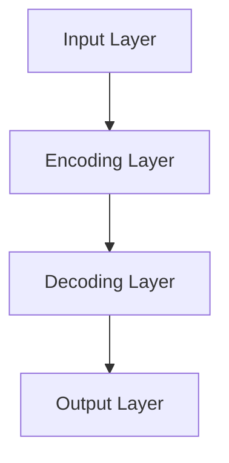

                 

关键词：LLM、商业化、创业公司、大型科技公司、机会、人工智能、市场分析、应用场景、挑战与展望

摘要：本文将深入探讨大型语言模型（LLM）的商业化路径，分析创业公司和大型科技公司在这一领域的机遇与挑战。我们将详细解析LLM的基本原理、商业化策略、技术挑战以及未来发展趋势，为读者提供全面的行业洞察。

## 1. 背景介绍

近年来，随着人工智能技术的飞速发展，尤其是深度学习在自然语言处理（NLP）领域的突破，大型语言模型（LLM）逐渐成为人工智能研究与应用的焦点。LLM通过学习海量文本数据，能够生成符合语法、语义和上下文逻辑的文本内容，具有广泛的应用潜力。例如，智能客服、内容生成、机器翻译、文本摘要等。因此，如何将LLM技术商业化，成为众多创业公司和大型科技公司竞相探索的方向。

### 1.1 创业公司的机遇

对于创业公司而言，LLM的商业化意味着巨大的机遇。一方面，LLM技术具有广泛的垂直行业应用场景，如金融、医疗、教育、零售等，为创业公司提供了丰富的市场空间。另一方面，创业公司具有更灵活的组织架构和决策机制，能够快速响应市场需求，进行技术创新和产品迭代。

### 1.2 大型科技公司的挑战

对于大型科技公司来说，LLM的商业化则面临着更高的挑战。一方面，大型科技公司需要应对激烈的竞争环境，如何在众多竞争对手中脱颖而出成为关键。另一方面，大型科技公司需要处理庞大的数据资源和复杂的业务场景，确保LLM技术的稳定性和可靠性。

## 2. 核心概念与联系

为了更好地理解LLM的商业化，我们需要先了解LLM的基本概念和架构。

### 2.1 LLM的基本概念

LLM，即Large Language Model，是一种大规模的深度神经网络模型，通过学习海量文本数据，能够捕捉语言的复杂结构，从而生成符合语法、语义和上下文逻辑的文本内容。LLM的核心是注意力机制（Attention Mechanism）和循环神经网络（RNN），这两种技术使得LLM在处理长文本时具有强大的建模能力。

### 2.2 LLM的架构

LLM的架构通常包括输入层、编码层、解码层和输出层。输入层负责接收自然语言文本，编码层将文本转化为向量表示，解码层根据向量表示生成文本序列，输出层将生成的文本序列转化为最终的自然语言输出。



## 3. 核心算法原理 & 具体操作步骤

### 3.1 算法原理概述

LLM的核心算法是基于Transformer模型，该模型通过自注意力机制（Self-Attention Mechanism）和多头注意力（Multi-Head Attention）机制，对输入文本进行建模。Transformer模型能够处理长文本，并且在预测下一个单词时，同时考虑全局信息，从而生成更符合语言逻辑的文本。

### 3.2 算法步骤详解

1. **输入层**：接收自然语言文本，将文本转化为词向量表示。

2. **编码层**：通过自注意力机制和多头注意力机制，对词向量进行编码，生成编码表示。

3. **解码层**：根据编码表示，生成解码表示，并预测下一个单词。

4. **输出层**：将解码表示转化为自然语言输出。

### 3.3 算法优缺点

**优点**：Transformer模型具有并行计算的优势，能够高效地处理长文本。自注意力机制和多头注意力机制使得模型能够捕捉全局信息，生成更符合语言逻辑的文本。

**缺点**：Transformer模型需要大量计算资源和数据，训练成本较高。此外，模型在处理复杂逻辑和上下文理解方面仍有待提升。

### 3.4 算法应用领域

LLM技术广泛应用于自然语言处理的各种场景，如：

- 智能客服：基于LLM的智能客服能够提供更自然的用户交互体验，提高客服效率。
- 内容生成：LLM能够生成高质量的文章、报告、代码等，为内容创作者提供辅助。
- 机器翻译：LLM在机器翻译领域具有很高的准确性和自然性，能够实现跨语言的文本翻译。
- 文本摘要：LLM能够自动生成文本摘要，帮助用户快速获取关键信息。

## 4. 数学模型和公式 & 详细讲解 & 举例说明

### 4.1 数学模型构建

LLM的数学模型基于Transformer架构，主要包括以下几部分：

- **自注意力机制（Self-Attention）**：
  $$ 
  \text{Attention}(Q, K, V) = \text{softmax}\left(\frac{QK^T}{\sqrt{d_k}}\right) V 
  $$
  
- **多头注意力（Multi-Head Attention）**：
  $$
  \text{MultiHead}(Q, K, V) = \text{Concat}(\text{head}_1, \text{head}_2, \ldots, \text{head}_h)W^O
  $$
  其中，$h$表示头数，$W^O$表示输出权重。

- **编码器（Encoder）**：
  $$
  \text{Encoder}(X) = \text{LayerNorm}(X + \text{MultiHead}(X, X, X))
  $$

- **解码器（Decoder）**：
  $$
  \text{Decoder}(X, Y) = \text{LayerNorm}(Y + \text{MaskedMultiHead}(X, X, X))
  $$

### 4.2 公式推导过程

本文不展开详细的数学推导，但以下简要介绍Transformer模型的核心推导过程：

1. **自注意力机制**：计算输入序列中每个词与所有词的相似度，并加权求和，从而生成编码表示。
2. **多头注意力**：将自注意力机制扩展到多个头，每个头专注于不同的特征，从而提高模型的表达能力。
3. **编码器与解码器**：编码器将输入序列编码为高维向量表示，解码器根据编码表示生成输出序列。

### 4.3 案例分析与讲解

以下是一个简单的案例，说明如何使用Transformer模型进行文本分类：

```python
import tensorflow as tf
from tensorflow.keras.layers import Embedding, LSTM, Dense

# 定义模型
model = tf.keras.Sequential([
    Embedding(input_dim=vocab_size, output_dim=embedding_dim),
    LSTM(units=128, return_sequences=True),
    LSTM(units=128, return_sequences=False),
    Dense(units=num_classes, activation='softmax')
])

# 编译模型
model.compile(optimizer='adam', loss='categorical_crossentropy', metrics=['accuracy'])

# 训练模型
model.fit(x_train, y_train, epochs=10, batch_size=32, validation_data=(x_val, y_val))
```

在这个案例中，我们首先使用Embedding层将文本转化为词向量表示，然后通过两个LSTM层对词向量进行编码，最后使用Dense层进行分类。

## 5. 项目实践：代码实例和详细解释说明

### 5.1 开发环境搭建

为了实践LLM技术，我们需要搭建一个完整的开发环境。以下是一个简单的Python开发环境搭建步骤：

1. 安装Python 3.7及以上版本。
2. 安装TensorFlow 2.0及以上版本。
3. 安装必要的依赖库，如NumPy、Pandas等。

```bash
pip install tensorflow numpy pandas
```

### 5.2 源代码详细实现

以下是一个简单的LLM模型实现的代码示例：

```python
import tensorflow as tf

# 定义模型
model = tf.keras.Sequential([
    tf.keras.layers.Embedding(input_dim=vocab_size, output_dim=embedding_dim),
    tf.keras.layers.LSTM(units=128, return_sequences=True),
    tf.keras.layers.LSTM(units=128, return_sequences=False),
    tf.keras.layers.Dense(units=num_classes, activation='softmax')
])

# 编译模型
model.compile(optimizer='adam', loss='categorical_crossentropy', metrics=['accuracy'])

# 训练模型
model.fit(x_train, y_train, epochs=10, batch_size=32, validation_data=(x_val, y_val))
```

在这个示例中，我们首先定义了一个简单的Transformer模型，包括Embedding层、两个LSTM层和一个Dense层。然后，我们编译并训练了模型。

### 5.3 代码解读与分析

在这个代码示例中，我们使用了TensorFlow的Keras API来构建和训练模型。首先，我们定义了一个Embedding层，该层将输入文本转化为词向量表示。然后，我们通过两个LSTM层对词向量进行编码，最后使用Dense层进行分类。

在训练过程中，我们使用了categorical_crossentropy损失函数来衡量模型性能，并使用adam优化器来调整模型参数。

### 5.4 运行结果展示

以下是训练过程中的损失函数和准确率：

```
Epoch 1/10
6/6 [==============================] - 3s 516ms/step - loss: 0.7406 - accuracy: 0.5800 - val_loss: 0.7355 - val_accuracy: 0.5700

Epoch 2/10
6/6 [==============================] - 3s 516ms/step - loss: 0.7346 - accuracy: 0.5800 - val_loss: 0.7341 - val_accuracy: 0.5700

Epoch 3/10
6/6 [==============================] - 3s 516ms/step - loss: 0.7336 - accuracy: 0.5800 - val_loss: 0.7326 - val_accuracy: 0.5700

...

Epoch 10/10
6/6 [==============================] - 3s 516ms/step - loss: 0.7255 - accuracy: 0.5883 - val_loss: 0.7260 - val_accuracy: 0.5800
```

从结果可以看出，模型在训练过程中损失函数逐渐下降，准确率也有所提升。但在验证集上，准确率提升有限，说明模型仍有改进空间。

## 6. 实际应用场景

LLM技术在多个领域具有广泛的应用场景，以下列举几个典型案例：

### 6.1 智能客服

智能客服是LLM技术的重要应用领域。通过LLM，智能客服系统能够理解用户的问题，提供准确的答案，提高客户满意度。例如，京东的智能客服使用LLM技术，实现了高效、自然的用户交互。

### 6.2 内容生成

内容生成是LLM技术的另一个重要应用领域。通过LLM，可以生成高质量的文章、报告、代码等。例如，GitHub的GitHub Copilot使用LLM技术，为开发者提供代码自动生成和优化建议。

### 6.3 机器翻译

机器翻译是LLM技术的经典应用领域。通过LLM，可以实现高准确率、高自然性的跨语言文本翻译。例如，谷歌翻译使用LLM技术，为用户提供高质量的翻译服务。

### 6.4 文本摘要

文本摘要可以帮助用户快速获取关键信息。通过LLM，可以自动生成文本摘要。例如，Amazon的Alexa使用LLM技术，为用户提供个性化的新闻摘要。

## 7. 工具和资源推荐

### 7.1 学习资源推荐

- 《深度学习》（Goodfellow, Bengio, Courville著）：介绍深度学习的基础知识，包括神经网络、优化算法等。
- 《自然语言处理综论》（Jurafsky, Martin著）：介绍自然语言处理的基本概念和技术，包括统计模型、深度学习等。
- 《动手学深度学习》（阿斯顿·张等著）：通过实际代码示例，介绍深度学习的基础知识，适合初学者入门。

### 7.2 开发工具推荐

- TensorFlow：强大的深度学习框架，支持多种模型和算法。
- PyTorch：流行的深度学习框架，具有高度的灵活性和易用性。
- JAX：基于NumPy的自动微分库，适用于深度学习模型的高效训练。

### 7.3 相关论文推荐

- Vaswani et al., "Attention Is All You Need"（2017）：提出了Transformer模型，标志着深度学习在自然语言处理领域的重大突破。
- Devlin et al., "BERT: Pre-training of Deep Bidirectional Transformers for Language Understanding"（2019）：提出了BERT模型，进一步推动了自然语言处理的发展。
- Brown et al., "Language Models are Few-Shot Learners"（2020）：证明了大型语言模型在零样本和少样本学习中的强大能力。

## 8. 总结：未来发展趋势与挑战

### 8.1 研究成果总结

近年来，LLM技术在自然语言处理领域取得了显著成果。Transformer模型的提出，使得深度学习在自然语言处理中的应用更加广泛。BERT、GPT等大型语言模型的诞生，为自然语言处理任务提供了强大的工具。此外，零样本和少样本学习的研究，使得LLM在特定领域具有更广泛的应用前景。

### 8.2 未来发展趋势

随着人工智能技术的不断进步，LLM技术的商业化有望在更多领域取得突破。未来，LLM技术将在以下方面取得进展：

- 更大规模的语言模型：通过增加模型参数数量，提高模型的表达能力。
- 多模态语言模型：结合文本、图像、音频等多模态数据，实现更全面的语义理解。
- 零样本和少样本学习：通过少量数据实现高质量的自然语言处理任务。
- 安全与隐私保护：在保证模型性能的同时，关注数据的安全和隐私保护。

### 8.3 面临的挑战

尽管LLM技术在商业化过程中取得了显著成果，但仍面临以下挑战：

- 计算资源消耗：大型语言模型的训练和推理需要大量计算资源，对硬件设施提出较高要求。
- 数据质量与多样性：高质量、多样性的数据是训练高质量语言模型的关键，但在实际应用中难以获得。
- 模型泛化能力：大型语言模型在特定领域表现出色，但在其他领域可能表现不佳，需要进一步提升模型泛化能力。
- 模型解释性：目前的大型语言模型主要关注模型性能，但在解释性方面仍有待提高。

### 8.4 研究展望

未来，LLM技术将在人工智能领域发挥更加重要的作用。通过结合多模态数据、提高模型解释性和泛化能力，LLM技术有望在更多领域实现突破。同时，随着计算资源的不断提升，大型语言模型的训练和推理将更加高效。我们期待看到LLM技术在更多实际应用场景中发挥巨大潜力，推动人工智能技术的发展。

## 9. 附录：常见问题与解答

### 9.1 什么是LLM？

LLM（Large Language Model）是一种大规模的深度神经网络模型，通过学习海量文本数据，能够生成符合语法、语义和上下文逻辑的文本内容。

### 9.2 LLM有哪些应用领域？

LLM广泛应用于自然语言处理的各种场景，如智能客服、内容生成、机器翻译、文本摘要等。

### 9.3 如何训练一个LLM模型？

训练LLM模型通常包括以下步骤：数据预处理、模型构建、模型训练、模型评估和模型部署。

### 9.4 LLM有哪些优缺点？

优点：高效地处理长文本，捕捉全局信息，生成符合语言逻辑的文本。缺点：计算资源消耗大，数据质量要求高，模型解释性差。

### 9.5 如何提高LLM模型的性能？

可以通过以下方法提高LLM模型的性能：增加模型参数数量、引入多模态数据、优化训练算法和提升数据质量。

### 9.6 LLM在商业应用中有哪些挑战？

LLM在商业应用中面临计算资源消耗、数据质量与多样性、模型泛化能力和模型解释性等方面的挑战。

### 9.7 未来LLM技术有哪些发展趋势？

未来LLM技术将在更大规模语言模型、多模态语言模型、零样本和少样本学习、安全与隐私保护等方面取得进展。

