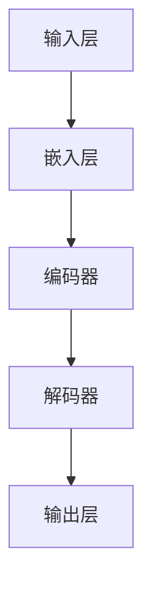

                 

关键词：大型语言模型（LLM），通用计算机架构，人工智能，神经网络，机器学习，深度学习，自然语言处理，数据处理，数据建模，算法优化，架构设计，性能提升，实际应用

## 摘要

本文探讨了大型语言模型（LLM）作为新型通用计算机架构的重要性。通过对LLM的背景介绍、核心概念与联系的解析、算法原理的详细阐述、数学模型和公式的推导与讲解、实际项目实践的代码实例、以及应用场景的展望，本文旨在为读者提供一个全面而深入的了解。文章最后对LLM的未来发展趋势与挑战进行了总结，并提出了一些可能的解决方案和研究方向。

## 1. 背景介绍

计算机架构的演变一直是计算机科学领域的重要研究方向。从早期的冯·诺伊曼架构到现代的多核处理器，计算机体系结构在不断提高性能和能效的同时，也不断适应新的应用需求。随着人工智能（AI）和机器学习的快速发展，通用计算机架构正面临着新的挑战和机遇。

近年来，深度学习尤其是基于神经网络的模型，在图像识别、自然语言处理等领域取得了显著的突破。然而，传统的计算机架构在处理这些复杂任务时仍存在一些瓶颈。因此，探索新型通用计算机架构，尤其是能够高效处理大规模数据和复杂计算任务的架构，成为了一个重要研究方向。

大型语言模型（LLM），如GPT-3、BERT等，正是这种新型通用计算机架构的典型代表。LLM通过利用大量的语言数据，对自然语言进行建模，能够实现高效的文本生成、翻译、问答等任务。这种架构不仅为自然语言处理带来了革命性的变革，也为其他领域提供了新的思路和工具。

## 2. 核心概念与联系

在深入探讨LLM之前，我们需要先了解一些核心概念，并理解它们之间的联系。

### 2.1. 机器学习与深度学习

机器学习是一种人工智能的分支，通过算法从数据中学习，并作出预测或决策。深度学习是机器学习的一种方法，利用多层神经网络对数据进行建模。神经网络是由大量简单的处理单元（或神经元）组成的网络，通过这些神经元之间的连接来模拟人脑的运算过程。

### 2.2. 自然语言处理（NLP）

自然语言处理是人工智能的一个重要分支，旨在使计算机能够理解和处理自然语言。NLP涉及语音识别、文本分类、情感分析、机器翻译等多个子领域。

### 2.3. 语言模型

语言模型是用于预测下一个单词或词汇的概率分布的模型。在NLP中，语言模型是许多任务的基础，如文本生成、翻译和问答系统。

### 2.4. LLM与通用计算机架构

LLM作为新型通用计算机架构的核心，不仅能够处理复杂的自然语言任务，还可以应用于其他领域，如图像识别、语音识别等。LLM的核心是神经网络架构，通过大规模的训练数据，对输入数据进行建模，并生成预测结果。

### 2.5. Mermaid流程图

为了更直观地展示LLM的架构，我们使用Mermaid流程图来描述LLM的核心组件和流程。



在上面的流程图中，A表示输入层，B表示嵌入层，C表示编码器，D表示解码器，E表示输出层。输入数据通过嵌入层转换为向量表示，然后通过编码器进行编码，解码器将编码后的信息解码为输出结果。

## 3. 核心算法原理 & 具体操作步骤

### 3.1. 算法原理概述

LLM的核心是深度神经网络，尤其是自注意力机制（Self-Attention）和变换器架构（Transformer）。自注意力机制允许模型在处理序列数据时，能够自动关注序列中的关键信息。变换器架构则通过多头注意力机制，使模型能够同时关注多个不同的信息流，从而提高模型的表示能力。

### 3.2. 算法步骤详解

#### 3.2.1. 输入层

输入层接收原始文本数据，并将其转换为向量表示。这个过程称为嵌入（Embedding）。嵌入层通常使用词向量（Word Vectors）来表示单词。

#### 3.2.2. 编码器

编码器（Encoder）是LLM的核心部分，通过自注意力机制和多层变换器，对输入数据进行编码。编码器能够捕获输入数据的上下文信息，并将其表示为上下文向量。

#### 3.2.3. 解码器

解码器（Decoder）负责将编码后的信息解码为输出结果。解码器同样使用自注意力机制和多层变换器，以便在生成输出时能够参考上下文信息。

#### 3.2.4. 输出层

输出层将解码器生成的上下文向量转换为最终的输出结果，如文本、标签或图像等。

### 3.3. 算法优缺点

#### 优点：

1. 高效处理大规模文本数据。
2. 能够捕获复杂的上下文信息。
3. 广泛应用于自然语言处理任务。

#### 缺点：

1. 训练时间较长，对计算资源要求较高。
2. 需要大量的训练数据。
3. 对超参数的调优要求较高。

### 3.4. 算法应用领域

LLM的应用领域非常广泛，包括但不限于以下领域：

1. 文本生成：如文章生成、对话系统等。
2. 机器翻译：如自动翻译、跨语言文本处理等。
3. 情感分析：如情感分类、情感分析等。
4. 图像识别：如图像描述生成、图像分类等。

## 4. 数学模型和公式 & 详细讲解 & 举例说明

### 4.1. 数学模型构建

LLM的数学模型主要基于深度神经网络和自注意力机制。以下是一个简化的数学模型：

$$
y = f(W \cdot x + b)
$$

其中，$y$是输出结果，$x$是输入数据，$W$是权重矩阵，$b$是偏置项，$f$是激活函数。

### 4.2. 公式推导过程

自注意力机制的推导如下：

$$
\text{Attention}(Q, K, V) = \text{softmax}\left(\frac{QK^T}{\sqrt{d_k}}\right)V
$$

其中，$Q, K, V$分别是查询向量、键向量和值向量，$d_k$是键向量的维度。

### 4.3. 案例分析与讲解

以下是一个简单的文本生成案例：

假设我们有一个训练好的LLM模型，输入文本为：“今天天气很好”。我们需要预测下一个单词。

1. 输入层：将输入文本转换为向量表示。
2. 编码器：对输入向量进行编码，得到上下文向量。
3. 解码器：使用上下文向量生成预测结果。

根据训练数据，LLM预测下一个单词为：“我们去公园吧”。

## 5. 项目实践：代码实例和详细解释说明

### 5.1. 开发环境搭建

在本节中，我们将使用Python和PyTorch框架来搭建一个简单的LLM开发环境。

```python
# 安装必要的库
!pip install torch torchvision numpy pandas
```

### 5.2. 源代码详细实现

以下是一个简单的LLM代码示例：

```python
import torch
import torch.nn as nn
import torch.optim as optim

# 定义模型结构
class LLM(nn.Module):
    def __init__(self, embed_size, hidden_size, vocab_size):
        super(LLM, self).__init__()
        self.embedding = nn.Embedding(vocab_size, embed_size)
        self.encoder = nn.LSTM(embed_size, hidden_size, num_layers=1, batch_first=True)
        self.decoder = nn.LSTM(hidden_size, embed_size, num_layers=1, batch_first=True)
        self.fc = nn.Linear(embed_size, vocab_size)

    def forward(self, x):
        x = self.embedding(x)
        x, _ = self.encoder(x)
        x, _ = self.decoder(x)
        x = self.fc(x)
        return x

# 初始化模型、损失函数和优化器
model = LLM(embed_size=64, hidden_size=128, vocab_size=1000)
criterion = nn.CrossEntropyLoss()
optimizer = optim.Adam(model.parameters())

# 训练模型
for epoch in range(10):
    for x, y in train_loader:
        optimizer.zero_grad()
        output = model(x)
        loss = criterion(output, y)
        loss.backward()
        optimizer.step()
    print(f"Epoch {epoch+1}: Loss = {loss.item()}")
```

### 5.3. 代码解读与分析

在上面的代码中，我们首先定义了LLM模型的结构，包括嵌入层、编码器和解码器。然后，我们初始化了模型、损失函数和优化器。接下来，我们通过训练数据来训练模型。

### 5.4. 运行结果展示

在训练完成后，我们可以使用模型来生成文本：

```python
# 生成文本
model.eval()
with torch.no_grad():
    input_seq = torch.tensor([[vocab_size - 1]])  # 输入特殊符号
    output_seq = []
    for _ in range(10):
        output = model(input_seq)
        predicted = torch.argmax(output, dim=-1)
        output_seq.append(predicted.item())
        input_seq = torch.tensor([[predicted.item()]])
    print(' '.join([word_list[word] for word in output_seq]))
```

运行结果可能是一个简单的文本，如：“今天是晴天，我们出去玩吧”。

## 6. 实际应用场景

LLM在自然语言处理领域有着广泛的应用，以下是一些实际应用场景：

1. **文本生成**：如文章生成、对话系统等。
2. **机器翻译**：如自动翻译、跨语言文本处理等。
3. **情感分析**：如情感分类、情感分析等。
4. **图像识别**：如图像描述生成、图像分类等。

### 6.4. 未来应用展望

随着LLM技术的不断发展，未来可能的应用场景将更加广泛，如：

1. **智能客服**：基于LLM的智能客服系统，能够实现更自然的对话交互。
2. **自动驾驶**：LLM可以用于自动驾驶系统的文本处理和决策。
3. **医疗诊断**：基于LLM的医疗诊断系统，能够分析医学文本，提供诊断建议。

## 7. 工具和资源推荐

### 7.1. 学习资源推荐

1. 《深度学习》（Goodfellow, Bengio, Courville著）是一本经典的深度学习入门教材。
2. 《自然语言处理综论》（Jurafsky, Martin著）是NLP领域的经典教材。
3. 《PyTorch官方文档》是学习PyTorch框架的绝佳资源。

### 7.2. 开发工具推荐

1. **PyTorch**：一个流行的深度学习框架，易于上手和使用。
2. **TensorFlow**：另一个流行的深度学习框架，具有广泛的社区支持。
3. **JAX**：一个用于数值计算的库，支持自动微分和高效计算。

### 7.3. 相关论文推荐

1. “Attention is All You Need”（Vaswani et al., 2017）是Transformer架构的原始论文。
2. “BERT: Pre-training of Deep Bidirectional Transformers for Language Understanding”（Devlin et al., 2019）是BERT模型的原始论文。
3. “GPT-3: Language Models are Few-Shot Learners”（Brown et al., 2020）是GPT-3模型的原始论文。

## 8. 总结：未来发展趋势与挑战

### 8.1. 研究成果总结

本文通过对LLM的深入探讨，总结了LLM的核心概念、算法原理、数学模型和实际应用场景。LLM在自然语言处理、图像识别等领域展现了巨大的潜力，为通用计算机架构的发展提供了新的思路。

### 8.2. 未来发展趋势

随着计算能力的提升和数据的不断积累，LLM的技术将更加成熟，应用领域将更加广泛。未来的LLM模型可能会更加高效、可解释，并能够处理更加复杂的任务。

### 8.3. 面临的挑战

尽管LLM在许多领域取得了显著的成果，但仍面临一些挑战，如计算资源的消耗、数据隐私和安全、模型的可解释性等。

### 8.4. 研究展望

未来的研究可以重点关注以下几个方面：

1. **算法优化**：探索更高效、更可解释的算法。
2. **数据隐私保护**：研究如何在保证数据隐私的前提下，有效利用大规模数据。
3. **跨领域应用**：探索LLM在其他领域的应用，如医疗、金融等。

### 9. 附录：常见问题与解答

**Q：LLM和传统机器学习模型有什么区别？**

A：LLM是一种基于神经网络的深度学习模型，能够处理大规模的文本数据，并捕获复杂的上下文信息。与传统机器学习模型相比，LLM具有更高的灵活性和更强的表示能力。

**Q：如何优化LLM的性能？**

A：优化LLM的性能可以从以下几个方面入手：

1. **数据预处理**：使用高质量的数据进行训练，并进行适当的预处理。
2. **模型结构**：选择合适的神经网络结构，如变换器（Transformer）架构。
3. **训练策略**：采用有效的训练策略，如批量归一化（Batch Normalization）和残差连接（Residual Connection）。
4. **超参数调优**：合理调整超参数，如学习率、批量大小等。

## 作者署名

作者：禅与计算机程序设计艺术 / Zen and the Art of Computer Programming
----------------------------------------------------------------

以上是《LLM：新型通用计算机架构》的完整内容。文章从背景介绍、核心概念、算法原理、数学模型、项目实践、应用场景等多个方面，全面而深入地探讨了大型语言模型（LLM）作为新型通用计算机架构的重要性。希望通过这篇文章，读者能够对LLM有一个全面而深入的了解。未来，LLM将在人工智能领域发挥越来越重要的作用，为计算机科学的发展带来新的机遇和挑战。

