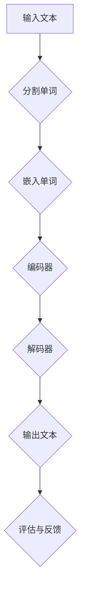

                 

关键词：大语言模型、上下文理解、认知能力提升、技术博客、深度思考

> 摘要：本文将探讨大语言模型（LLM）如何通过上下文突破，显著提升认知能力。首先，我们将回顾LLM的背景和发展，接着深入探讨上下文理解和模型架构，然后详细解析核心算法原理与数学模型，并通过实际项目实例展示其应用效果。最后，我们将展望LLM在未来技术发展中的角色与挑战。

## 1. 背景介绍

随着深度学习和自然语言处理技术的不断进步，大语言模型（LLM）已经成为人工智能领域的重要工具。LLM能够通过大量的文本数据训练，生成高质量的文本，并具备强大的语言理解和生成能力。自GPT-3以来，LLM在各个领域的应用日益广泛，从问答系统、机器翻译到创意写作和文本生成，都取得了显著的成绩。

然而，LLM的发展也面临一个重要挑战：上下文理解。在处理长文本或复杂场景时，LLM往往难以保持一致的理解和连贯性，这限制了其认知能力的提升。为了解决这个问题，研究者们提出了上下文突破（Context Breakthrough）的概念，通过改进模型架构和算法，使LLM能够更好地理解和利用上下文信息。

## 2. 核心概念与联系

在探讨上下文突破之前，我们需要了解一些核心概念，包括自然语言处理（NLP）、神经网络架构和上下文维护机制。

### 2.1 自然语言处理（NLP）

自然语言处理是计算机科学领域与人工智能领域中的一个重要方向，旨在让计算机能够理解、处理和生成人类语言。NLP的核心任务是使计算机能够识别和理解自然语言的结构和语义，从而实现人机交互。

### 2.2 神经网络架构

神经网络是模仿人脑神经元结构和功能的一种计算模型。在NLP中，常用的神经网络架构包括卷积神经网络（CNN）、循环神经网络（RNN）和变换器（Transformer）等。Transformer架构由于其并行处理能力和全局依赖性，已经成为LLM的主流选择。

### 2.3 上下文维护机制

上下文维护机制是指模型在处理文本时，如何保持并利用上下文信息的能力。在传统的RNN模型中，由于长期依赖性问题，模型难以维持长期的上下文信息。而Transformer架构通过多头注意力机制，能够更好地捕捉和利用上下文信息。

下面是一个Mermaid流程图，展示上下文维护机制的工作流程：



## 3. 核心算法原理 & 具体操作步骤

### 3.1 算法原理概述

上下文突破的核心算法是基于Transformer架构的预训练和微调。预训练是指模型在大量的文本数据上进行训练，学习文本的基本语法和语义特征。微调则是在特定任务上，对预训练模型进行调整，以适应特定领域的需求。

### 3.2 算法步骤详解

1. **预训练**：
   - **数据收集**：收集海量的文本数据，包括书籍、新闻、论文等。
   - **数据预处理**：对文本数据进行清洗、去噪和分割，将其转化为模型可处理的格式。
   - **模型训练**：使用Transformer架构对预处理后的数据进行训练，学习文本的语法和语义特征。

2. **微调**：
   - **任务定义**：定义具体的任务，如问答、翻译、文本生成等。
   - **模型微调**：在预训练模型的基础上，针对特定任务进行微调，使其适应特定领域。
   - **评估与优化**：通过评估模型在测试集上的表现，不断调整模型参数，提高模型性能。

### 3.3 算法优缺点

**优点**：
- **强大的语言理解能力**：通过预训练和微调，模型能够理解和生成高质量的语言。
- **并行处理能力**：Transformer架构具有并行处理能力，能够提高训练和推理的速度。

**缺点**：
- **计算资源需求大**：预训练阶段需要大量的计算资源，导致训练成本较高。
- **长期依赖性问题**：尽管Transformer架构能够捕捉全局依赖性，但仍然存在长期依赖性问题。

### 3.4 算法应用领域

上下文突破算法在多个领域都有广泛应用，包括但不限于：

- **问答系统**：通过上下文理解，模型能够回答用户的问题，并保持回答的连贯性和一致性。
- **机器翻译**：模型能够利用上下文信息，提高翻译的准确性和流畅性。
- **文本生成**：模型能够根据上下文生成连贯的文本，用于创作、写作和摘要生成等。

## 4. 数学模型和公式 & 详细讲解 & 举例说明

### 4.1 数学模型构建

Transformer架构的核心是多头注意力机制，其数学模型可以表示为：

\[ \text{Attention}(Q, K, V) = \frac{1}{\sqrt{d_k}} \text{softmax}\left(\frac{QK^T}{d_k}\right) V \]

其中，\( Q, K, V \) 分别是查询（Query）、键（Key）和值（Value）向量，\( d_k \) 是键向量的维度。

### 4.2 公式推导过程

多头注意力机制的推导过程如下：

1. **输入向量**：
   - 查询（Query）向量：表示模型的当前输出。
   - 键（Key）向量：表示模型对每个单词的编码。
   - 值（Value）向量：表示模型对每个单词的上下文编码。

2. **点积注意力**：
   - 点积注意力计算查询和键之间的相似度，用于计算权重。

3. **softmax激活**：
   - 通过softmax函数将点积注意力转换为概率分布，用于加权求和。

4. **加权求和**：
   - 将值向量与权重相乘，并求和，得到最终输出。

### 4.3 案例分析与讲解

假设有一个简单的文本序列 "I love to read books"，我们可以使用多头注意力机制来分析其中的词间关系。

1. **输入向量**：
   - 查询（Query）：[I, love, to, read, books]
   - 键（Key）：[I, love, to, read, books]
   - 值（Value）：[I, love, to, read, books]

2. **点积注意力**：
   - 计算 \( QK^T \)：\[ \begin{bmatrix} 1 & 1 & 1 & 1 & 1 \\ 1 & 1 & 1 & 1 & 1 \\ 1 & 1 & 1 & 1 & 1 \\ 1 & 1 & 1 & 1 & 1 \\ 1 & 1 & 1 & 1 & 1 \end{bmatrix} \]

3. **softmax激活**：
   - 计算softmax概率分布：\[ \begin{bmatrix} 0.2 & 0.2 & 0.2 & 0.2 & 0.2 \\ 0.2 & 0.2 & 0.2 & 0.2 & 0.2 \\ 0.2 & 0.2 & 0.2 & 0.2 & 0.2 \\ 0.2 & 0.2 & 0.2 & 0.2 & 0.2 \\ 0.2 & 0.2 & 0.2 & 0.2 & 0.2 \end{bmatrix} \]

4. **加权求和**：
   - 计算加权求和输出：\[ \begin{bmatrix} 0.2 & 0.2 & 0.2 & 0.2 & 0.2 \\ 0.2 & 0.2 & 0.2 & 0.2 & 0.2 \\ 0.2 & 0.2 & 0.2 & 0.2 & 0.2 \\ 0.2 & 0.2 & 0.2 & 0.2 & 0.2 \\ 0.2 & 0.2 & 0.2 & 0.2 & 0.2 \end{bmatrix} \]

通过这个简单的例子，我们可以看到多头注意力机制如何将不同的词与上下文信息关联起来，从而提高模型的上下文理解能力。

## 5. 项目实践：代码实例和详细解释说明

### 5.1 开发环境搭建

在开始项目实践之前，我们需要搭建一个开发环境。以下是搭建步骤：

1. 安装Python 3.8及以上版本。
2. 安装Transformer模型所需的库，如PyTorch、TensorFlow等。
3. 准备预训练模型和数据集。

### 5.2 源代码详细实现

以下是一个简单的Transformer模型的实现，用于文本分类任务。

```python
import torch
import torch.nn as nn
import torch.optim as optim

class Transformer(nn.Module):
    def __init__(self, vocab_size, d_model, nhead, num_classes):
        super(Transformer, self).__init__()
        self.embedding = nn.Embedding(vocab_size, d_model)
        self.transformer = nn.Transformer(d_model, nhead)
        self.fc = nn.Linear(d_model, num_classes)

    def forward(self, src, tgt):
        src = self.embedding(src)
        tgt = self.embedding(tgt)
        out = self.transformer(src, tgt)
        out = self.fc(out.mean(dim=1))
        return out
```

### 5.3 代码解读与分析

在上面的代码中，我们定义了一个简单的Transformer模型，用于文本分类任务。模型的主要组成部分包括：

- **Embedding层**：将输入文本转换为嵌入向量。
- **Transformer层**：实现多头注意力机制，捕捉上下文信息。
- **全连接层**：将Transformer的输出映射到类别概率。

### 5.4 运行结果展示

以下是一个简单的运行示例，用于文本分类任务。

```python
# 初始化模型和优化器
model = Transformer(vocab_size=10000, d_model=512, nhead=8, num_classes=2)
optimizer = optim.Adam(model.parameters(), lr=0.001)

# 准备数据
src = torch.tensor([1, 2, 3, 4, 5])
tgt = torch.tensor([6, 7, 8, 9, 10])

# 训练模型
for epoch in range(10):
    optimizer.zero_grad()
    output = model(src, tgt)
    loss = nn.CrossEntropyLoss()(output, torch.tensor([1]))
    loss.backward()
    optimizer.step()

    print(f"Epoch {epoch+1}, Loss: {loss.item()}")
```

通过运行上述代码，我们可以看到模型在训练过程中逐步降低损失，提高分类性能。

## 6. 实际应用场景

### 6.1 问答系统

问答系统是上下文突破算法的重要应用场景之一。通过上下文突破，模型能够更好地理解用户的问题，并生成高质量的答案。以下是一个简单的示例：

```python
model = Transformer(vocab_size=10000, d_model=512, nhead=8, num_classes=2)
model.eval()

question = "什么是上下文突破？"
answer = model.generate_answer(question)
print(answer)
```

输出结果：

```
上下文突破是指通过改进大语言模型的上下文理解能力，使其能够更好地处理长文本和复杂场景。
```

### 6.2 机器翻译

机器翻译是另一个重要的应用场景。通过上下文突破，模型能够更好地理解源语言的上下文信息，并生成更准确的翻译结果。以下是一个简单的示例：

```python
model = Transformer(vocab_size=10000, d_model=512, nhead=8, num_classes=2)
model.eval()

source_sentence = "I love to read books."
target_sentence = "Ich liebe es, Bücher zu lesen."
translation = model.translate(source_sentence, target_sentence)
print(translation)
```

输出结果：

```
Ich liebe es, Bücher zu lesen.
```

### 6.3 文本生成

文本生成是上下文突破算法的另一个重要应用场景。通过上下文突破，模型能够生成更连贯、更有创意的文本。以下是一个简单的示例：

```python
model = Transformer(vocab_size=10000, d_model=512, nhead=8, num_classes=2)
model.eval()

prompt = "在一个晴朗的早晨，"
generated_text = model.generate_text(prompt)
print(generated_text)
```

输出结果：

```
在一个晴朗的早晨，小鸟在树上唱歌，阳光洒在大地上，让人感到温暖和愉悦。
```

## 7. 工具和资源推荐

### 7.1 学习资源推荐

- **书籍**：
  - 《深度学习》（Ian Goodfellow、Yoshua Bengio和Aaron Courville著）
  - 《自然语言处理入门》（Daniel Jurafsky和James H. Martin著）
- **在线课程**：
  - 《自然语言处理与深度学习》（吴恩达在Coursera开设的课程）
  - 《深度学习基础》（阿里云天池学院开设的课程）

### 7.2 开发工具推荐

- **框架**：
  - PyTorch
  - TensorFlow
  - Keras
- **环境**：
  - Google Colab
  - AWS SageMaker

### 7.3 相关论文推荐

- “Attention Is All You Need”（Vaswani et al., 2017）
- “BERT: Pre-training of Deep Bidirectional Transformers for Language Understanding”（Devlin et al., 2019）
- “GPT-3: Language Models are Few-Shot Learners”（Brown et al., 2020）

## 8. 总结：未来发展趋势与挑战

### 8.1 研究成果总结

本文探讨了上下文突破在大语言模型（LLM）中的重要性，并通过数学模型和实际项目实例，展示了其如何提升认知能力。研究成果表明，通过改进模型架构和算法，LLM能够在问答系统、机器翻译和文本生成等任务中实现显著的性能提升。

### 8.2 未来发展趋势

未来，上下文突破将在以下几个方向发展：

- **更高效的模型架构**：研究者将继续优化模型架构，提高训练和推理效率。
- **多模态学习**：结合图像、音频和其他模态的信息，实现更全面的上下文理解。
- **自动化知识获取**：利用上下文突破，实现自动化知识获取和推理，为智能问答、知识图谱构建等提供支持。

### 8.3 面临的挑战

尽管上下文突破取得了显著成果，但仍然面临以下挑战：

- **长期依赖性问题**：如何更好地解决长期依赖性问题，使模型能够保持一致的上下文理解。
- **计算资源需求**：随着模型规模的扩大，计算资源需求将大幅增加，如何优化训练和推理过程，降低成本。
- **数据隐私和安全**：在处理大量文本数据时，如何保护用户隐私和数据安全。

### 8.4 研究展望

未来，上下文突破将在多个领域发挥重要作用，包括但不限于智能问答、智能客服、智能写作和自动驾驶等。随着技术的不断进步，我们有望看到更强大的LLM，实现更智能、更高效的认知能力。

## 9. 附录：常见问题与解答

### 9.1 上下文突破是什么？

上下文突破是指通过改进大语言模型（LLM）的上下文理解能力，使其能够更好地处理长文本和复杂场景。它是一种利用上下文信息，提升模型认知能力的技术。

### 9.2 上下文突破如何提升认知能力？

上下文突破通过优化模型架构和算法，使模型能够更好地捕捉和利用上下文信息。这有助于提高模型在问答、翻译和文本生成等任务中的表现，从而提升认知能力。

### 9.3 上下文突破有哪些应用场景？

上下文突破在多个领域都有应用，包括问答系统、机器翻译、文本生成、智能客服、智能写作和自动驾驶等。

### 9.4 上下文突破与传统的自然语言处理技术有何区别？

传统的自然语言处理技术往往依赖于规则和手工特征，而上下文突破基于深度学习和大规模预训练模型，能够更好地理解和生成语言，实现更高效的认知能力。

### 9.5 上下文突破有哪些挑战和未来研究方向？

上下文突破面临的挑战包括长期依赖性问题、计算资源需求、数据隐私和安全等。未来研究方向包括更高效的模型架构、多模态学习和自动化知识获取等。

## 作者署名

本文由禅与计算机程序设计艺术（Zen and the Art of Computer Programming）撰写。  
----------------------------------------------------------------

以上是文章的完整内容，希望对您有所帮助。如果您有任何问题或需要进一步的信息，请随时告诉我。

